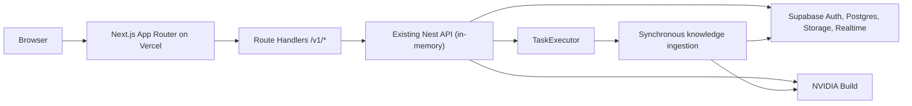

# ExAi Vercel-only MVP deployment

This mode is limited to customer demonstrations and controlled pilots. It preserves the production Nest API, worker, BullMQ, Redis, and ClamAV code while executing HTTP and knowledge-ingestion work inside the Next.js Vercel deployment.



## Temporarily removed services

The MVP deployment does not run a dedicated API server, worker process, Redis, BullMQ, or ClamAV service. Those implementations remain in the repository. `TaskExecutor` leaves pending jobs for the existing worker in normal deployments and executes knowledge ingestion synchronously only when `MVP_VERCEL_MODE=true`.

## Required services

- Vercel: Next.js pages and Vercel Functions.
- Supabase: Auth, Postgres, Storage, Realtime, and RLS.
- NVIDIA Build: chat and embedding models.

## Deploy

1. Import the repository into Vercel with the repository root as the project root.
2. Keep Fluid Compute enabled so knowledge ingestion can use its configured 300-second duration.
3. Add the environment variables below to Production and Preview.
4. Deploy. The root `vercel.json` builds `web` and all workspace dependencies and serves `apps/web/.next`.
5. Verify `GET /healthz`, `GET /readyz`, organizer login, exhibitor upload/indexing, booth QR, attendee submission, and dashboard updates.

## Required Vercel environment variables

```dotenv
MVP_VERCEL_MODE=true
API_DATABASE_URL=postgresql://...Supabase transaction-pooler...
API_SUPABASE_URL=https://PROJECT.supabase.co
API_SUPABASE_SERVICE_ROLE_KEY=...
API_CORS_ORIGIN=https://YOUR_VERCEL_DOMAIN
API_PUBLIC_WEB_ORIGIN=https://YOUR_VERCEL_DOMAIN
NEXT_PUBLIC_SUPABASE_URL=https://PROJECT.supabase.co
NEXT_PUBLIC_SUPABASE_PUBLISHABLE_KEY=...
NVIDIA_API_KEY=...
NVIDIA_BASE_URL=https://integrate.api.nvidia.com/v1
NVIDIA_CHAT_MODEL=deepseek-ai/deepseek-v4-flash
NVIDIA_EMBEDDING_MODEL=nvidia/nv-embedqa-e5-v5
```

`NEXT_PUBLIC_API_BASE_URL` should be omitted so browser calls use the current Vercel origin. Set it only when deliberately using a separate API. Do not configure worker, Redis, BullMQ, or ClamAV variables in MVP mode.

## Returning to the production worker architecture

1. **TODO before public production release: re-enable malware scanning. The MVP waiver must not be used for a public deployment.**
2. Unset `MVP_VERCEL_MODE`.
3. Deploy `apps/api` and `apps/worker` and configure `NEXT_PUBLIC_API_BASE_URL` for the API origin.
4. Configure `WORKER_DATABASE_URL`, `WORKER_REDIS_URL`, Supabase worker credentials, and `WORKER_CLAMAV_HOST`/`WORKER_CLAMAV_PORT`.
5. Start Redis, BullMQ consumers, and ClamAV, then verify clean/infected/quarantined upload paths.

Business logic does not change during that migration: API calls still use the same controllers and services, and knowledge work still enters through `TaskExecutor` and the retained ingestion function.
