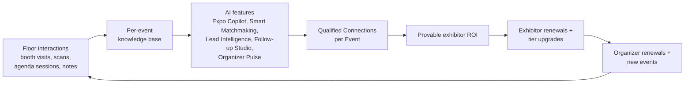

# Product Vision

This document is the canonical statement of why Concourse exists, the market gap it fills, what differentiates it, the single metric the whole company optimizes, and the boundaries of what we will not build. Business mechanics (pricing, segments, GTM) live in [02-business-goals.md](02-business-goals.md); the people we build for live in [03-user-personas.md](03-user-personas.md). All names and locked decisions come from [00-foundation.md](00-foundation.md) and are not restated here except where this document adds the reasoning behind them.

---

## 1. The Problem

Trade shows are the highest-cost, highest-intent B2B marketing channel that still runs on the dumbest data in the stack.

### 1.1 Badge scans are dumb data

The core artifact of the modern expo floor is the badge scan: a timestamp plus a contact record. It says *someone was here*. It does not say who they are beyond a registration form, why they stopped, what they asked about, which products they cared about, how serious they are, or what should happen next. Everything that made the conversation valuable evaporates the moment it ends. Incumbent tooling treats the floor as a logistics problem — get people in the door, scan them at booths, export a CSV — when the actual product of a trade show is *relationships with context*.

Concretely, for each stakeholder:

| Stakeholder | What they invest | What the status quo gives back |
|---|---|---|
| **Exhibitor** (Elena, Jamal) | Five to six figures per event in booth space, build, travel, and staff time | A CSV of scans delivered days later, no qualification, no context, generic follow-up sent a week after the buyer went cold |
| **Attendee** (Sofia) | Two or three days out of office, travel budget, a hall with hundreds of booths | A PDF floor plan and an agenda list; discovery happens by walking aisles; the ten booths that mattered most are found by luck or missed entirely |
| **Organizer** (Priya, Marcus) | A year of production work; their business *is* the renewal | Anecdotes. Attendance counts and scan totals, but no way to show any individual exhibitor that the event produced pipeline |

### 1.2 Expo ROI is unprovable — and that breaks the whole market

The organizer's revenue depends on exhibitors renewing booths. Exhibitors renew when they can defend the spend internally. Today they cannot: marketing attribution stops at "we scanned 412 badges." So exhibitors churn or shrink booths, organizers discount to retain them, and the channel underperforms its actual value. The missing layer is not another registration system or another event app — it is an **intelligence layer** that converts raw floor signals (booth visits, agenda session attendance, conversations, interests) into qualified, provable, actionable connections. That layer is Concourse.

### 1.3 Why now

Three shifts make this buildable and buyable in a way it was not five years earlier:

1. **LLMs turned unstructured floor data into structured intelligence.** Voice notes, exhibitor content, and behavior streams can now be summarized, scored, and retrieved reliably enough for production use (model choices in [00-foundation.md](00-foundation.md) §6; architecture in docs 21–23).
2. **PWAs closed the native gap for floor operations.** Installable, offline-capable web apps mean one codebase can serve a concrete hall with no connectivity (foundation D3).
3. **B2B buyers expect attribution everywhere else.** Digital channels report pipeline per dollar; events are the last big line item that reports nothing. Budget scrutiny is forcing the question.

---

## 2. Current Market

Assessment of the four incumbents named in [00-foundation.md](00-foundation.md) §1. Each is competent at what it was built for; each stops short of the intelligence layer.

| Vendor | What it does well | Where it stops |
|---|---|---|
| **Cvent** | Enterprise event-management suite: registration, venue sourcing, budgeting, on-site badging and check-in. Deep procurement relationships with corporate event teams. | Lead capture is scan-and-export. Analytics are dashboards over registration data, not interaction intelligence. Heavyweight per-event configuration; the exhibitor is an object in the organizer's account, not a customer with owned data. |
| **Swapcard** | Event engagement app: attendee networking, agenda, exhibitor directory, checkbox-interest matchmaking. | Matchmaking is shallow (declared interests, no behavioral signal, no explanations). Exhibitor lead tooling is thin — capture without qualification or follow-up intelligence. App-first architecture degrades badly on poor connectivity. |
| **Bizzabo** | "Event experience OS" for conferences: registration, agenda, session engagement, sponsor visibility, wearable badges for its own ecosystem. | Conference-centric: the agenda is the product and the expo floor is an appendix. Exhibitors are sponsors to be given impressions, not tenants building pipeline. Hardware lock-in for its smart-badge features. |
| **Map Your Show** | Floor-plan management and booth sales for large trade shows; strong organizer-side space-selling workflow. | The product ends when the floor is sold. No engagement layer, no lead intelligence, no attendee experience beyond a directory. |

**The common gaps — and our wedge:**

1. **Nobody treats the exhibitor as a first-class tenant.** In every incumbent, exhibitor data lives inside the organizer's account. Concourse makes the exhibitor an `organization` in its own right (foundation §7, §8): its catalog, its leads, its intelligence — portable across events.
2. **Nobody is AI-native.** Incumbents are bolting chat widgets onto record-keeping systems. Concourse's domain model is designed so every interaction feeds a per-event knowledge base that AI features query (foundation §7 "AI & knowledge", docs 21–23).
3. **Nobody is offline-first.** All four assume connectivity that concrete-and-steel venues routinely deny.
4. **Nobody proves ROI.** No incumbent can answer "did this event generate qualified pipeline for exhibitor X?" — the exact question that decides renewals.

We deliberately do not compete with Cvent on venue sourcing or full-suite corporate event management, nor with Map Your Show on floor-space sales workflow — see Non-Goals (§7).

---

## 3. Vision Statement

> **Concourse is the intelligence layer of the physical trade show.** Every booth visit, badge scan, agenda session, and conversation becomes structured, private, actionable knowledge — so exhibitors leave with qualified pipeline instead of a contact dump, attendees navigate the floor with a personal guide instead of a paper map, and organizers sell next year's floor with proof instead of anecdotes.

The long-term shape: an event run on Concourse produces a compounding, tenant-owned knowledge graph. Exhibitor organizations carry their catalog and intelligence across every event they attend; organizers carry cross-event benchmarks across every edition they run. The platform gets more valuable to every party with each event — that compounding loop, not any single feature, is the durable moat.

---

## 4. Differentiators

Four differentiators, each grounded in an architectural commitment — not a marketing claim. If a differentiator ever stops being enforceable in the architecture, it is no longer a differentiator.

### 4.1 AI-native intelligence layer

The five AI features ([00-foundation.md](00-foundation.md) §10 — Expo Copilot, Smart Matchmaking, Lead Intelligence, Follow-up Studio, Organizer Pulse) are not add-ons; the domain model was designed to feed them. `booth_visits` are raw signal; `leads` are derived intelligence; `kb_sources → kb_documents → kb_chunks` exist so every piece of event content is retrievable with tenant and entitlement filters. Incumbents would need to rebuild their data model to match this — a chat UI on top of scan records does not produce cited, grounded, per-tenant answers. Critically, every AI feature is an additive layer over a deterministic feature (foundation §10): the platform is fully usable with AI off, which is what makes AI trustworthy rather than load-bearing.

### 4.2 Speed as product

Principle 1 ("Fast is the feature") is enforced as engineering budget, not aspiration: sub-second perceived interaction on the floor surfaces, because a rep with a queue at the booth abandons any tool that makes them wait. This shapes stack choices already locked in foundation §6 (RSC-first rendering, Redis-backed sessions, cursor pagination) and shows up as explicit performance budgets in the frontend and API design docs. Speed is a differentiator precisely because incumbent suites are famously slow — it is the first thing a design partner notices in a demo.

### 4.3 Offline-first floor operations

Principle 4 made concrete: lead capture, badge scanning, and note-taking on the Exhibitor Portal mobile surface work with zero connectivity and reconcile when the network returns (foundation D3: installable PWA, offline-capable lead capture). Venue Wi-Fi failure is the single most common event-tech catastrophe; designing for it is a structural advantage over app-first competitors that treat offline as an error state. Sync and conflict semantics are owned by the offline architecture doc; the commitment itself is made here.

### 4.4 Exhibitor-owned data

Exhibitors are tenants, not rows in the organizer's account (foundation §8). Their leads, catalog, and intelligence belong to them, persist across events, and are exportable (per their tier's entitlements). This is both an ethical position and a commercial engine: it is the reason exhibitors will pay Concourse directly (foundation D4), the reason the exhibitor relationship compounds across events, and a hard structural difference from every incumbent. The trust boundary is enforced with RLS and explicit cross-tenant read paths (foundation §8), not policy documents.

---

## 5. North-Star Metric: Qualified Connections per Event

### 5.1 Definition

**Qualified Connections per Event (QCE)** — the number of unique exhibitor↔attendee pairs at an event where the connection was *mutual and acted upon*:

- **Exhibitor side:** a `lead` for that attendee reached pipeline status `qualified` or beyond (`qualified | contacted | meeting_booked | closed`; `disqualified` never counts, even if reached later stages first).
- **Attendee side (reciprocity):** the attendee performed at least one affirmative engagement with that exhibitor — accepted or completed a `meeting`, saved the exhibitor in the Attendee App, opted in to follow-up at scan time, or made a repeat booth visit (two or more `booth_visits` to the same booth).

Counting rules:

1. One pair = one `event_exhibitor` × one `registration`. Counted at most once per event regardless of how many interactions occurred.
2. Measurement window: event `live` start through 14 days after the event reaches `completed` — follow-up actions inside the window count; the metric freezes after day 14.
3. Both conditions must hold. A qualified lead the attendee ignored is not a connection; an attendee bookmark the exhibitor never qualified is not a connection.
4. Reported three ways: absolute QCE per event, **QCE per 1,000 registrations** (cross-event comparability), and **QCE per exhibitor** (the number Elena shows her CMO).

Field-level derivation (exact statuses, event definitions, and the materialized rollup) is owned by [16-database-schema.md](16-database-schema.md) and the analytics taxonomy (doc 32). This section owns the business definition; those docs implement it — any conflict resolves in favor of this definition.

### 5.2 Why this metric

- **It is the value, not a proxy for it.** Registrations, scans, and app opens can all grow while the event produces nothing. QCE only moves when an exhibitor got a real prospect *and* the prospect cared back — which is exactly what exhibitors pay for and what organizers need to prove.
- **Every persona moves it.** Priya grows it with better floor curation, Marcus with frictionless check-in, Elena and Jamal by capturing and qualifying well, Sofia by discovering the right booths. The KPI tree in [02-business-goals.md](02-business-goals.md) decomposes it per persona.
- **It resists gaming.** Requiring both sides blocks the two obvious inflation paths (exhibitors mass-marking leads qualified; attendees bulk-bookmarking). Guardrail metrics watch the rest: attendee opt-out/report rate, exhibitor disqualification rate, meeting no-show rate. QCE growth alongside deteriorating guardrails is treated as a regression.

---

## 6. Product Principles

The five principles from [00-foundation.md](00-foundation.md) §1 bind all UX and engineering decisions. This section adds the rationale and the practical rules each one implies. When principles conflict in a specific design, the lower-numbered principle wins unless the design doc justifies otherwise.

### P1 — Fast is the feature

*Rationale:* Floor time is the scarcest resource at an event. A rep has 20 seconds between conversations; an attendee decides in 3 seconds whether the app is worth opening again. Speed is not polish — on the floor it is the difference between a tool that gets used and one that gets abandoned by 10am on day one.

*In practice:* every floor-critical interaction (badge scan → lead captured, Copilot first token, floor plan pan) carries an explicit latency budget in its design doc; optimistic UI is the default for writes; spinners longer than 300ms are design failures to be fixed, not styled.

### P2 — Intelligence over records

*Rationale:* The status quo already produces records; records are the problem. Concourse earns its price only where it converts records into meaning — a scored lead with a written summary instead of a scan row, a cited answer instead of a search results page, an insight instead of a dashboard grid.

*In practice:* every list view answers "so what?" before "what" (default sort by score/relevance, not recency alone); AI summaries and reasons ship next to the data they interpret; raw data remains one tap away (never hidden — see P3), but is never the landing view.

### P3 — One source of truth

*Rationale:* Event tech's chronic failure is six tools holding six copies of the attendee list. Internally the same disease appears as duplicated state between services. Every fact lives in exactly one place; everything else derives — this is what makes the intelligence trustworthy.

*In practice:* the entity registry (foundation §7) assigns every fact one home; derived values (scores, rollups, embeddings) are always recomputable from source records; caches and read models are explicitly marked as derived and invalidatable; no surface writes to another surface's source of truth except through the API contract.

### P4 — Works in a concrete hall

*Rationale:* Venues are Faraday cages with carpet. Any floor workflow that requires connectivity will fail during the exact hours the product exists to serve.

*In practice:* floor-critical write paths (lead capture, notes, badge scan) queue locally and sync opportunistically; reads that matter on the floor (my leads, floor plan, my agenda) are cached for offline; features are classified offline-required / offline-degraded / online-only in their design docs, and "offline-required" is a release gate for the affected surface.

### P5 — Earn enterprise trust

*Rationale:* Concourse holds two tenants' commercially sensitive data side by side — exhibitor pipeline and organizer economics — plus attendee PII. One leak across a tenant boundary ends the company. Enterprise readiness (foundation D5) cannot be retrofitted.

*In practice:* tenancy, RLS, permission checks, and audit logging are foundation-layer concerns built before features (foundation §8, doc 28, docs 19–20); every privileged action lands in `audit_logs`; AI features inherit the same tenant and entitlement filters as everything else (foundation §8, doc 23); consent for attendee data sharing is explicit and revocable.

---

## 7. Non-Goals

What Concourse is **not**. These are commitments, not oversights; each has a line of reasoning and, where relevant, a pointer to what we do instead. Genuinely future candidates live in [44-future-expansion-plan.md](44-future-expansion-plan.md) — a non-goal here means *not on the roadmap at all* unless this document is revised.

| Non-goal | Reasoning | What we do instead |
|---|---|---|
| **Not a ticketing company** | Consumer ticketing (payments at scale, fraud, resale, box office) is a solved, low-margin, regulatorily heavy business dominated by specialists. It would consume the roadmap and add nothing to intelligence. | `registrations` support direct sign-up and bulk import from the organizer's registration/ticketing vendor. Concourse owns the badge and everything after the badge, not admission commerce. |
| **Not a general conference app** | Conference-first platforms (Bizzabo et al.) already serve agenda-centric events. Chasing that market dilutes the expo-floor focus that defines us. | `agenda_sessions` and `session_checkins` exist because agenda behavior is a signal for matchmaking and Copilot — the agenda serves the floor, not the reverse. |
| **Not a badge-hardware vendor** | Hardware is inventory, logistics, and certification — a different company. Hardware lock-in (Bizzabo's wearables) is also exactly the dependency organizers resent. | `badge_code` is an opaque, rotatable QR payload (foundation §12) scannable by any commodity camera or handheld. Printing and scanning hardware stays vendor-neutral. |
| **Not a horizontal CRM** | Exhibitors have CRMs and marketing automation they will not replace for one event channel. Competing with them is unwinnable and unnecessary. | Lead Intelligence enriches and qualifies during the event; exports and CRM sync (growth tier, foundation §4) hand off cleanly to the exhibitor's system of record. |
| **Not a virtual-events platform** | Virtual expo halls are a distinct product with distinct economics; the 2020-era pivot to virtual is a cautionary tale, not a roadmap. Concourse's differentiators (offline floor ops, physical presence signals) are meaningless online. | Physical-first. Hybrid content capture is noted in [44-future-expansion-plan.md](44-future-expansion-plan.md). |
| **Not a venue/floor-sales marketplace** | Venue sourcing (Cvent) and booth-space sales workflow (Map Your Show) are mature adjacent businesses upstream of our value. | `floor_plans` and `booths` model the sold floor as operational reality. Booth *sales* workflow imports its outcome; we start where the floor is sold. |
| **Not a data broker** | Selling or pooling attendee data across tenants would destroy the trust model that makes the platform work (P5, §4.4). | Attendee data flows to an exhibitor only through consented interaction; cross-tenant access happens only via the explicitly modeled read paths in foundation §8. |

---

## 8. Related Documents

- [02-business-goals.md](02-business-goals.md) — revenue model, segments, GTM phases, KPI tree under QCE
- [03-user-personas.md](03-user-personas.md) — the six canonical personas this vision serves
- [16-database-schema.md](16-database-schema.md) — column-level model behind the entity registry and QCE derivation
- [44-future-expansion-plan.md](44-future-expansion-plan.md) — deferred directions (native apps, EU region, custom domains, hybrid capture)
- [45-implementation-roadmap.md](45-implementation-roadmap.md) — sequencing of everything above
