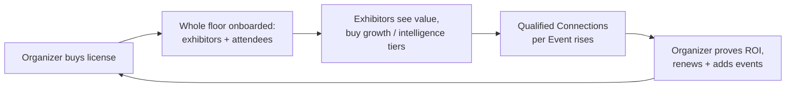
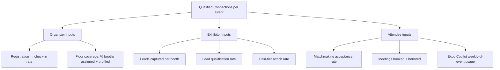

# Business Goals

This document turns the vision in [01-product-vision.md](01-product-vision.md) into a commercial plan: how Concourse makes money, who we sell to first and why, how go-to-market unfolds over three years, the KPI tree that decomposes the north-star metric into per-persona indicators, where we sit against competitors, and the business risks we are consciously carrying. Tier and plan names are canonical per [00-foundation.md](00-foundation.md) §4 (decision D4); this document specifies what each includes and the philosophy behind pricing, not price points.

---

## 1. Revenue Model

### 1.1 The two-sided model (D4)

Concourse monetizes both sides of the event, deliberately:

1. **Organizers pay a SaaS license** (per-event or annual) to run their events on Concourse. This is the anchor revenue: predictable, contract-based, and it puts the entire floor — every exhibitor, every attendee — onto the platform at zero acquisition cost to us.
2. **Exhibitors get a free baseline and buy premium tiers** inside the Exhibitor Portal, per event. This is the expansion revenue: high-margin, self-serve, and it scales with event count and floor size rather than with our sales headcount.
3. **Attendees are always free.** Charging attendees would suppress the participation that generates the intelligence both paying sides value. Attendee density is the fuel of the flywheel, never a revenue line.

The two streams reinforce each other: the organizer license delivers a captive, high-intent exhibitor audience for the upsell; strong exhibitor outcomes (measured as Qualified Connections, [01-product-vision.md](01-product-vision.md) §5) give the organizer the renewal proof that retains the license.

### 1.2 Organizer plans

Canonical plan keys: `launch`, `professional`, `enterprise` (foundation §4). Billed via Stripe, per-event or annual license.

| Capability | `launch` | `professional` | `enterprise` |
|---|---|---|---|
| Events | Single event | Multi-event, cross-event benchmarks | Unlimited, portfolio views |
| Core floor ops (floor plans, booths, registrations, check-in, badges) | Included | Included | Included |
| Exhibitor management (`event_exhibitors`, tiers, staffing) | Included | Included | Included |
| Analytics suite + Organizer Pulse | Basic dashboards | Full suite incl. Organizer Pulse | Full suite + custom exports |
| Smart Matchmaking (event-wide) | — | Included | Included |
| Support | Community | Priority | Dedicated + SLA |
| SSO (SAML/OIDC, native Supabase Auth) | — | — | Included (milestone M4) |
| Public API + webhooks (`api_keys`, `webhook_endpoints`) | — | — | Included |
| Custom domains, data residency options | — | — | Included ([44-future-expansion-plan.md](44-future-expansion-plan.md)) |

`launch` exists to make the first event a low-friction land (and is the design-partner vehicle); `professional` is the intended center of gravity for the beachhead segment; `enterprise` is where security review, procurement, and integration requirements are monetized rather than absorbed.

### 1.3 Exhibitor tiers

Canonical tier keys: `essentials`, `growth`, `intelligence` (foundation §4). Purchased per event inside the Exhibitor Portal; `essentials` is free with the booth.

| Capability | `essentials` (free) | `growth` (paid) | `intelligence` (paid) |
|---|---|---|---|
| Exhibitor profile + product listings (`products`, `event_product_listings`) | Included | Included | Included |
| Basic lead capture (badge scan → `leads`, manual notes) | Included | Included | Included |
| Staff seats (`exhibitor_staff`) | 3 | Unlimited | Unlimited |
| **Lead Intelligence** (scoring, AI interaction summaries, firmographic enrichment) | — | Included | Included |
| Meeting scheduling (`meetings`) | — | Included | Included |
| Exports + CRM sync | — | Included | Included |
| **Smart Matchmaking** priority placement | — | — | Included |
| **Follow-up Studio** | — | — | Included |
| Competitive benchmarks | — | — | Included |
| Real-time booth analytics | — | — | Included |

The tier ladder follows one rule: **capture is free; intelligence and automation are paid.** Every exhibitor can always collect and view their own leads at no cost — crippling basic capture would poison the data layer and the attendee experience. What exhibitors pay for is the conversion of that raw capture into pipeline: scoring, summaries, enrichment, matchmaking priority, and automated follow-up.

Features never check tier names in code — they check entitlement keys resolved through `plans → subscriptions → entitlements` (foundation §4, §8; e.g. `entitlement:lead_intelligence`). The canonical entitlement-key registry and the role/permission matrix live in [28-permission-model.md](28-permission-model.md); the tier→entitlement mapping is Stripe-synced per [16-database-schema.md](16-database-schema.md).

### 1.4 Pricing philosophy (value-metric based)

No hard price points in Phase 1 — pricing is set with design partners against measured value. The philosophy, however, is locked:

1. **Price on the value metric, not on seats.** Organizer pricing scales with **registered attendee volume per event** (banded) and plan capabilities; exhibitor pricing is a flat per-event fee per tier. Attendee volume is the honest proxy for value delivered to an organizer; a flat per-event tier is the honest proxy for an exhibitor's opportunity size at that event.
2. **Never tax collaboration.** Organizer staff seats (`event_staff`) are unlimited on every plan, and exhibitor seats are unlimited from `growth` up. Seat-taxing floor staff suppresses adoption of exactly the workflows (capture, notes) that create the intelligence we sell.
3. **The free tier must be genuinely useful.** `essentials` has to beat the incumbent scan-and-CSV experience on its own, or the upsell audience never materializes.
4. **Anchor to provable ROI.** The exhibitor upsell is priced against Qualified Connections and pipeline evidence, not against feature checklists — Lead Intelligence's in-product ROI view is a sales asset, not just a feature.
5. **Enterprise pays for trust, not for withheld product.** SSO, API, residency, and SLA are genuinely expensive capabilities; core intelligence features are never gated to `enterprise` only.

---

## 2. Target Segments and Beachhead

### 2.1 Beachhead: mid-market B2B trade shows (2k–30k attendees)

Profile: independent show producers and trade associations running B2B events of 2,000–30,000 attendees and roughly 50–1,000 exhibitors — industrial, healthcare, construction, food service, technology verticals. The buyer is the Event Director (Priya in [03-user-personas.md](03-user-personas.md)).

Why this segment first:

1. **Pain concentration.** For these producers, exhibitor booth revenue *is* the P&L, and exhibitor renewal is the existential metric. "Prove exhibitor ROI" is not a nice-to-have narrative — it directly defends their core revenue. Our north-star metric is their renewal argument.
2. **Buyable.** The Event Director has budget authority; sales cycles run one to three months, not the 12–18 months of enterprise event-tech procurement. We can iterate with real events fast.
3. **Whole-floor deployment is feasible.** Smart Matchmaking and QCE need the entire floor on the platform to work. A mid-market producer can mandate platform-wide adoption for an event; a global enterprise organizer pilots one hall of one event and starves the network effect.
4. **Structurally underserved.** Cvent is too heavy and priced for corporate enterprise; Map Your Show stops at floor sales; generic event apps are too shallow for exhibitor pipeline. Nobody owns this segment's actual problem.
5. **Scale-compatible.** The segment's upper bound (30k attendees, ~1,000 exhibitors) sits inside the locked scale targets (foundation D5), so the beachhead exercises the real architecture rather than a toy configuration.

### 2.2 Expansion segment: enterprise organizers (later, deliberate)

Large organizers (30k+ attendees, multi-event portfolios, international) come second, on the `enterprise` plan, once SSO (M4), the public API, and audit maturity are proven. Entering earlier would burn 12-month procurement cycles before the product has reference customers or the compliance surface enterprise review demands. The mid-market beachhead generates the case studies and the hardening that make enterprise sales winnable.

### 2.3 Explicit not-now segments

Consumer expos and fan conventions, festivals, corporate internal events, and academic conferences are out of scope for Phase 1–3 GTM (misaligned buyer, weak exhibitor-pipeline economics, or agenda-centric shape — see non-goals in [01-product-vision.md](01-product-vision.md) §7). Revisit criteria live in [44-future-expansion-plan.md](44-future-expansion-plan.md).

---

## 3. Go-to-Market Phases

| Phase | Period | Motion | Exit criteria |
|---|---|---|---|
| **GTM-1: Design partners** | Year 1 | 3–5 mid-market events on free/heavily discounted `launch`/`professional`. Founder-led sales; deep co-development; instrumented end-to-end. | QCE baseline established across ≥3 events; ≥2 public case studies; exhibitor paid-tier attach ≥10% at ≥1 event; all five AI features live in production at a real event. |
| **GTM-2: Repeatable mid-market** | Year 2 | Direct sales to show producers (land `professional`); in-product self-serve exhibitor upsell as the primary expansion engine; producers with multiple events converted to annual licenses. | ≥20 paid events run; organizer logo retention ≥90%; exhibitor attach ≥20% median; upsell revenue ≥25% of total. |
| **GTM-3: Enterprise + ecosystem** | Year 3 | `enterprise` plan sales (SSO, public API, custom domains, residency); partner/API ecosystem so CRMs, marketing automation, and registration vendors integrate; multi-event portfolio deals. | ≥3 enterprise organizer contracts; public API GA with ≥5 production integrations; net revenue retention ≥120%. |

Two structural notes on the motion:

- **Organizer-led distribution.** Every organizer deal onboards hundreds of exhibitor organizations and thousands of attendees at zero CAC. The exhibitor upsell therefore behaves like PLG inside a sales-led wrapper — the tier purchase is a product flow in the Exhibitor Portal, not a sales conversation.
- **Cross-event compounding.** Exhibitor orgs are global entities that participate in many events (foundation §7). An exhibitor who bought `growth` at one event arrives at the next event already onboarded, with catalog intact — attach rates should rise with platform tenure, and we track exactly that (§5).

---

## 4. Three-Year Business Goals

| Horizon | Theme | Goals |
|---|---|---|
| **Year 1** | Prove the intelligence layer | 3–5 design-partner events live end-to-end; QCE measured and published as case studies; median QCE per 1,000 registrations baselined; exhibitor NPS ≥ 40 at design-partner events; zero cross-tenant data incidents (a standing goal every year). |
| **Year 2** | Prove the business | ≥20 paid events; ≥5 organizers on annual multi-event licenses; exhibitor paid attach ≥20% median per event; organizer logo retention ≥90%; upsell ≥25% of revenue; QCE per 1,000 registrations +30% vs Year-1 baseline. |
| **Year 3** | Prove the platform | ≥3 `enterprise` organizers; public API + webhooks GA with ≥5 production integrations; NRR ≥120%; exhibitor orgs active at ≥3 events each ≥15% of exhibitor base; recognized category language ("qualified connections") appearing in competitor positioning. |

Revenue targets in currency are set annually by the founder outside this blueprint (pricing philosophy §1.4 precedes price points); the goals above are the durable, product-observable commitments.

---

## 5. KPI Tree

Everything rolls up to **Qualified Connections per Event** (definition owned by [01-product-vision.md](01-product-vision.md) §5). Event taxonomy for measuring these lives in the product analytics doc (doc 32).

| Persona | Leading indicators (during event cycle) | Lagging indicators (post-event / business) |
|---|---|---|
| Priya (organizer admin) | % booths assigned and exhibitor profiles completed pre-event; % exhibitors with ≥1 active staff account; Organizer Pulse weekly usage | Exhibitor rebook rate for next edition; organizer license renewal; QCE per 1,000 registrations vs prior edition |
| Marcus (organizer staff) | Check-in throughput (scans/min at peak); check-in queue incidents; % registrations checked in by day-1 noon | Attendee complaint rate about entry; event ops NPS |
| Elena (exhibitor admin) | Tier purchase timing (days before event); profile + product-listing completeness; Follow-up Studio sequences launched within 72h of event close | Leads → CRM-synced rate; pipeline attributed per event (self-reported); tier renewal at next event |
| Jamal (exhibitor rep) | Leads captured per rep per day; % leads with notes or voice notes; median time from `booth_visit` to `lead` capture | Lead qualification rate; % leads with AI summary viewed |
| Sofia (attendee) | Match acceptance rate on Smart Matchmaking; Expo Copilot sessions per registration; booths saved per active attendee | Meetings honored (no-show inverse); reciprocity rate (attendee side of QCE); repeat-event registration |
| Alex (platform admin) | Uptime during live events; sync-conflict rate on offline capture; AI cost per event within budget (docs 21–23) | Cross-tenant incidents (must be zero); support tickets per 1,000 registrations |

Guardrails (monitored alongside QCE, per [01-product-vision.md](01-product-vision.md) §5.2): attendee opt-out/report rate, exhibitor disqualification rate, meeting no-show rate.

---

## 6. Competitive Positioning

Positioning against the incumbents analyzed in [01-product-vision.md](01-product-vision.md) §2:

| Dimension | Cvent | Swapcard | Bizzabo | Map Your Show | **Concourse** |
|---|---|---|---|---|---|
| Center of gravity | Corporate event management | Attendee engagement app | Conference experience | Floor-plan / booth sales | **Expo-floor intelligence** |
| Exhibitor status | Object in organizer account | Directory entry | Sponsor | Space buyer | **First-class tenant with owned data** |
| Lead capture | Scan + export | Basic capture | Scan (own hardware) | — | **Offline-first capture → scored, summarized leads** |
| Matchmaking | — | Checkbox interests | Basic networking | — | **Behavioral + embedding-based, reasons always shown** |
| AI posture | Bolt-on assistants | Bolt-on | Bolt-on | — | **AI-native over a knowledge-graph domain model, deterministic core** |
| Offline floor ops | Partial (check-in) | Weak | Weak | n/a | **Designed-for (P4)** |
| ROI proof for exhibitors | No | No | Impressions | No | **Qualified Connections per Event** |
| Business model | Organizer suite license | Organizer license | Organizer license | Organizer license | **Organizer license + exhibitor self-serve upsell** |

One-line positioning: *incumbents sell the organizer software to run an event; Concourse sells the whole floor intelligence to prove the event was worth it.* We do not attack Cvent's registration/venue suite or Map Your Show's floor-sales workflow head-on — we sit downstream of both and make their outputs valuable (see non-goals, [01-product-vision.md](01-product-vision.md) §7).

---

## 7. Key Business Risks and Mitigations

| # | Risk | Impact | Mitigation |
|---|---|---|---|
| R1 | **Two-sided cold start within each event** — exhibitors won't pay before attendee engagement exists; attendees won't engage with an empty floor. | Weak first events poison references. | `essentials` free tier populates the floor by default; onboarding is organizer-mandated at event setup; Smart Matchmaking seeds from registration interests (`attendee_interests`) before any behavior exists; design partners chosen for organizer willingness to push adoption. |
| R2 | **Revenue seasonality and event concentration** — per-event licenses make revenue lumpy and tied to event calendars. | Cash-flow volatility; churn masked between editions. | Push annual multi-event licenses from GTM-2; exhibitor upsell spreads revenue across many payers; portfolio producers prioritized in pipeline. |
| R3 | **Exhibitor attach underperforms** — model leans on upsell that mid-market exhibitors may resist. | Growth ceiling at organizer-license revenue. | Free tier engineered as demand-gen for `growth` (Lead Intelligence teasers on real captured leads); attach measured from design-partner events onward with an explicit Year-2 attach exit criterion; pricing anchored to provable ROI (§1.4). |
| R4 | **Incumbents bolt on AI** — Cvent/Swapcard ship copilot features and claim parity. | Differentiation narrative erodes. | Moat is structural, not cosmetic: exhibitor tenancy, offline-first floor ops, and a domain model built to feed retrieval (foundation §7–8). Compete on QCE outcomes and floor-speed UX, which bolt-ons cannot reach without re-architecture. |
| R5 | **AI cost and quality at event scale** — hundreds of thousands of attendees generating Copilot traffic in a two-day burst. | Margin compression; bad answers at peak damage trust. | Model routing (fast/cheap classification vs reasoning models, foundation §6), per-event AI budgets and cost controls, and evals owned by docs 21–23; all AI features degrade to their deterministic base (foundation §10). |
| R6 | **Privacy and consent failures** — badge scans and behavioral tracking of attendees are PII-heavy and regulated (GDPR et al.). | Legal exposure; organizer trust loss; attendee revolt. | Consent-first capture (scan-time opt-in is also an input to QCE reciprocity); `badge_code` carries no PII (foundation §12); exhibitors receive data only through consented interactions; access control per [28-permission-model.md](28-permission-model.md); audit trail in `audit_logs`. |
| R7 | **Single-event operational failure** — an outage during a flagship live event is a public, unrecoverable moment. | Reference damage outweighing months of sales. | P4 offline-tolerance keeps floor capture alive through outages; live-event readiness (load tests, on-call, status comms) is a release discipline owned by the operations docs; uptime-during-live-events is a platform KPI (§5). |
| R8 | **Beachhead too small / expansion mistimed** — mid-market producers are a finite pool. | Growth stalls before enterprise readiness lands. | Segment sized in the thousands of qualifying events across target verticals; cross-event exhibitor compounding raises revenue per event without new logos; enterprise entry criteria defined in GTM-3 rather than opportunistically. |

---

## 8. Related Documents

- [01-product-vision.md](01-product-vision.md) — problem, differentiators, north-star definition, non-goals
- [03-user-personas.md](03-user-personas.md) — the buyers and users behind every KPI above
- [16-database-schema.md](16-database-schema.md) — `plans`, `subscriptions`, `entitlements` and QCE derivation detail
- [28-permission-model.md](28-permission-model.md) — entitlement-key registry; role/permission matrix
- [44-future-expansion-plan.md](44-future-expansion-plan.md) — deferred segments, custom domains, data residency, pricing experiments
- [45-implementation-roadmap.md](45-implementation-roadmap.md) — milestone sequencing (including M4 SSO) that GTM phases depend on
