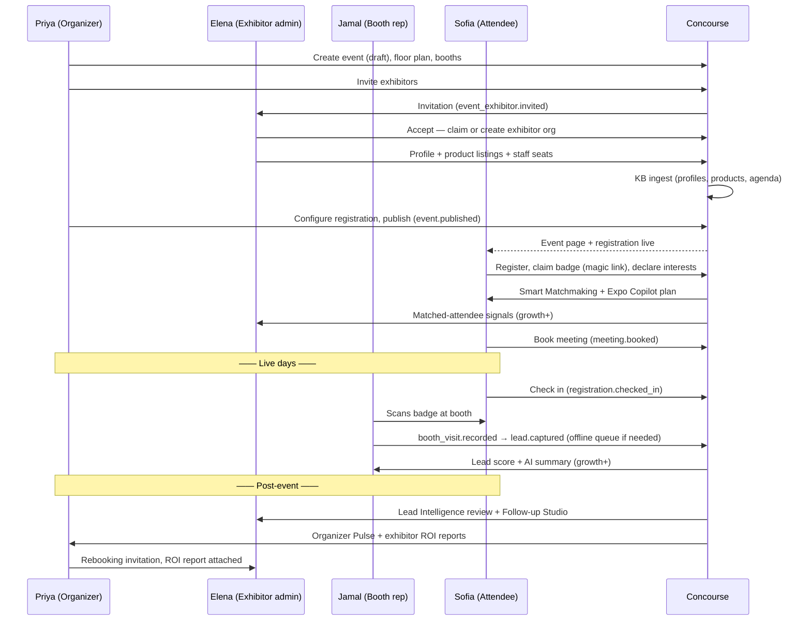

# User Journey (Cross-Persona Lifecycle)

This document is the master map of how one event flows through Concourse from first organizer login to next-edition rebooking, showing where the three persona journeys interlock: an organizer action unblocks exhibitors, exhibitor readiness makes the attendee experience worth having, attendee behavior on the floor produces the intelligence that closes the loop for everyone. It frames [05-organizer-journey.md](05-organizer-journey.md), [06-exhibitor-journey.md](06-exhibitor-journey.md), and [07-attendee-journey.md](07-attendee-journey.md) — those docs own step-level detail; this doc owns the timeline, the handoff points, and the journey design principles that all three must obey. All names conform to [00-foundation.md](00-foundation.md).

## 1. Lifecycle at a Glance

One event moves through five phases. Windows below are typical for a mid-market trade show (the platform must tolerate heavy compression — see the late-exhibitor and short-runway edge cases in docs 05–06).

| Phase | Typical window | Primary actor | `events.status` | Exit criterion |
|---|---|---|---|---|
| P1 — Event setup | T−26w → T−16w | Priya | `draft` | Event published: page live, registration open, exhibitor invitations out |
| P2 — Exhibitor onboarding | T−20w → T−1w | Elena | `published` | ≥90% of `event_exhibitors` at status `ready` (profile complete, booth assigned, staff seated) |
| P3 — Attendee registration & planning | T−12w → T−0 | Sofia | `published` | Registration curve on target; attendees onboarded with interests and plans |
| P4 — Live days | T−0 → T+3d | Jamal, Marcus, Sofia | `live` | Event days end; check-ins, booth visits, leads, meetings all recorded |
| P5 — Intelligence & rebooking | T+0 → T+6w | Elena, Priya | `completed` → `archived` | Follow-up executed, ROI reports delivered, next edition cloned |

Phases overlap deliberately: P2 and P3 run concurrently, and P5 for exhibitors (lead follow-up) starts the moment the first lead syncs, not when the event closes. `events.status` transitions (`draft → published → live → completed → archived`) are organizer-controlled with system guardrails; the status enum is canonical in [00-foundation.md](00-foundation.md) §7 and column detail lives in [16-database-schema.md](16-database-schema.md).

## 2. Master Timeline

How the three journeys interleave against the clock. Domain events use the `noun.verb_past` convention (foundation §11); the event pipeline that fans them out is owned by doc 25.

| When | Organizer (Priya / Marcus) | Exhibitor (Elena / Jamal) | Attendee (Sofia) | System / AI |
|---|---|---|---|---|
| T−26w | Signs up, creates organizer org, creates event `draft`; builds floor plan and booths | — | — | — |
| T−20w | Sends exhibitor invitations (`event_exhibitor.invited`); builds agenda skeleton | Elena accepts invite; claims or creates exhibitor org (`event_exhibitor.accepted`) | — | — |
| T−16w | Configures registration; publishes event (`event.published`) | Completes profile + `event_product_listings`; invites staff | Event page and registration live at `/e/[eventSlug]` | KB ingest of profiles, products, agenda into `kb_sources` → `kb_chunks` |
| T−12w → T−2w | Watches pre-event health dashboard; nudges laggard exhibitors; finalizes agenda | Hits tier-upgrade moments (seats, Lead Intelligence, matchmaking priority); preps meeting slots | Registers (`registration.created`), claims badge via magic link, declares interests | Smart Matchmaking generates `match_recommendations`; Expo Copilot answers planning questions |
| T−1w | Live-ops rehearsal; check-in stations provisioned; incident playbook reviewed | Jamal installs PWA, runs a practice scan; offline capture verified | Builds personal plan; books meetings (`meeting.booked`) | Pre-event digests sent via notification service (doc 33) |
| Live days | Marcus monitors check-in throughput, floor heatmap, incidents; status → `live` | Jamal scans badges: `booth_visit.recorded` → `lead.captured` → qualify → note (offline-safe) | Checks in (`registration.checked_in`); navigates floor; self-scans at booths; attends agenda sessions | Real-time rooms per event/booth push dashboards; Lead Intelligence scores as leads sync |
| T+0 → T+2w | Reviews Organizer Pulse; publishes exhibitor ROI reports; status → `completed` | Elena works Lead Intelligence review; runs Follow-up Studio; exports to CRM | Gets recap: connections, saved exhibitors, session materials | AI summaries generated per lead; north-star metric (Qualified Connections per Event) computed |
| T+2w → T+6w | Rebooks next edition: clones event, invites exhibitors with ROI proof attached | Decides to rebook (and often upgrades tier) based on measured ROI | — | Event archived; data retention clocks start |

## 3. Interlock Diagram

## 4. Handoff Points

A handoff is a moment where one persona's action unblocks another persona. These are the load-bearing joints of the product: each must be (a) automated where possible, (b) visible as a status when not, and (c) instrumented. Blocked personas always see *who* they are waiting on and *what* for (principle JP-7).

| # | Producing action | Unblocks | What becomes possible | Surfaced as |
|---|---|---|---|---|
| H1 | Priya publishes event | Sofia, Elena | Registration opens; exhibitor profiles get a public destination | Public event page `/e/[eventSlug]`; "published" state in Organizer Console |
| H2 | Priya assigns booth to an `event_exhibitor` | Elena, Sofia | Exhibitor profile shows location; wayfinding and heatmap become meaningful | Booth number on exhibitor profile and floor map |
| H3 | Elena completes profile + listings | Sofia, system | Exhibitor appears in attendee directory; KB ingest makes it citable by Expo Copilot and matchable by Smart Matchmaking | Onboarding funnel state `profile_complete` on Priya's exhibitor tracker |
| H4 | Sofia registers + claims badge | Jamal | Badge code exists — scannable at booths and check-in | `registrations` row with `badge_code` |
| H5 | Sofia declares interests | Elena, Sofia | `match_recommendations` generated both directions | Matches feed in Attendee App; matched-attendee list in Exhibitor Portal (growth+) |
| H6 | Elena publishes meeting slots | Sofia | Bookable meetings appear on exhibitor profile | Meeting picker; both parties' calendars |
| H7 | Jamal captures + qualifies a lead | Elena, Priya | Lead Intelligence pipeline; exhibitor ROI numerator; north-star metric input | Lead list, live booth analytics, Organizer Pulse |
| H8 | Marcus flips event to `live` | Everyone | Check-in accepted; live dashboards and realtime rooms active | Live-ops screen; attendee "event is live" state |
| H9 | Priya marks event `completed` | Elena, Priya | ROI reports finalized; Follow-up Studio unlocked with complete data; recap sent to attendees | Post-event dashboards; recap notification |

Every handoff emits a domain event (doc 25) and an analytics event (`surface.object_action`, taxonomy in doc 32) so funnel drop-off between handoffs is measurable per event.

## 5. Journey Design Principles

Numbered so sibling docs and surface specs can cite them (e.g., "per JP-2").

### JP-1 — Time-to-value budgets

Each persona has a hard budget from first touch to first felt value. These are product requirements, not aspirations; the flows in docs 05–07 are designed backwards from them.

| Persona | First-value moment | Budget |
|---|---|---|
| Priya | Event exists in `draft` with dates, venue, and a booth-ready floor plan | ≤ 30 min from signup |
| Elena (new exhibitor) | Profile live and previewable as attendees will see it | ≤ 15 min from invite acceptance |
| Elena (returning exhibitor) | Same, reusing existing org + catalog | ≤ 5 min from invite acceptance |
| Jamal | First lead captured; scan-to-next-scan cycle | ≤ 30 s first lead; ≤ 5 s per cycle |
| Sofia | Registered with badge claimed | ≤ 2 min |
| Sofia | Personalized plan: ≥5 match recommendations + agenda picks | ≤ 5 min after interest onboarding |
| Marcus | Answer "how is check-in going right now?" | ≤ 10 s from opening live ops |

### JP-2 — Offline moments are designed, not tolerated

Foundation principle "works in a concrete hall." Every journey step is classified up front; the offline-critical set is small and sacred:

| Moment | Connectivity assumption | Behavior |
|---|---|---|
| Jamal: scan → capture → qualify → note | **None** | Full loop works offline; queued in IndexedDB; syncs with client-generated idempotency keys (detail in [06-exhibitor-journey.md](06-exhibitor-journey.md)) |
| Sofia: show badge | **None** | Badge QR precached and rendered locally |
| Sofia: read agenda, personal plan, floor map, saved exhibitors | **None** | Precached at last online moment; staleness banner shows last-sync time |
| Marcus/staff: check-in scanning | **Degraded** | Scans queue locally and reconcile; duplicate check-in resolved server-side on sync |
| Expo Copilot, Smart Matchmaking, live dashboards, payments, publishing | **Online** | Explicit, honest offline states — never a spinner (foundation principle 1) |

### JP-3 — Handoffs are visible states, not emails

Email nudges (via the notification service, doc 33) accompany, never replace, an in-product status. Priya's exhibitor tracker, Elena's readiness checklist, and Sofia's plan all show pending dependencies inline with the responsible party named.

### JP-4 — Minimum viable setup first, depth later

Every setup flow (event wizard, exhibitor profile, attendee onboarding) reaches a shippable state on required fields only, then invites enrichment. Nothing blocks publish/participation on nice-to-have data; instead, completeness scores make the gap visible.

### JP-5 — AI is an additive layer

Per foundation §10, every AI feature has a deterministic fallback in the same spot in the journey: Expo Copilot degrades to search + directory browse; Smart Matchmaking to interest-tag filtering; Lead Intelligence to a manually sortable lead list; Follow-up Studio to plain export; Organizer Pulse to standard dashboards. Journeys in docs 05–07 name the fallback at each AI touchpoint.

### JP-6 — Consent before exposure

No attendee data reaches an exhibitor without an explicit, comprehensible consent act (badge scan or self-scan with a disclosed data set). Passive signals (dwell) feed aggregate heatmaps only and never create leads. The consent moments are specified in [07-attendee-journey.md](07-attendee-journey.md); enforcement lives in the permission model ([28-permission-model.md](28-permission-model.md)).

### JP-7 — No dead ends

Every blocked state names the unblocking actor and offers the strongest available action (nudge, resend invite, contact organizer). Empty states teach: an empty lead list before the event explains the scan flow rather than showing zero.

### JP-8 — Journeys are resumable across weeks

Multi-week gaps are the norm (Elena touches Concourse in bursts around deadlines). Every flow persists partial progress server-side, and re-entry lands on "what changed since you left + your next action," not a blank dashboard.

## 6. The Intelligence Loop

The lifecycle is a loop, not a line — this is the product's economic engine and the frame for post-event stages in docs 05 and 06:

1. Organizer publishes → exhibitors onboard → structured content enters the knowledge base (docs 21–23).
2. Attendees register and declare interests → Smart Matchmaking and Expo Copilot concentrate the right people at the right booths.
3. The floor happens → `booth_visits`, `leads`, `session_checkins`, `meetings` accumulate as ground truth.
4. Intelligence flows back: exhibitors get qualified pipeline (Lead Intelligence, Follow-up Studio), organizers get proof (Organizer Pulse, ROI reports), attendees get a useful record (recap, connections).
5. Proof drives rebooking at higher tiers — the next edition starts with more data than the last.

Qualified Connections per Event (the north-star metric, foundation §1) is measured at step 4 and reported at step 5.

## 7. Ownership Boundaries

| Detail | Owned by |
|---|---|
| Organizer stage-by-stage flows, routes, edge cases | [05-organizer-journey.md](05-organizer-journey.md) |
| Exhibitor flows, tier upsell moments, offline lead capture mechanics | [06-exhibitor-journey.md](06-exhibitor-journey.md) |
| Attendee flows, consent moments, low-connectivity behavior | [07-attendee-journey.md](07-attendee-journey.md) |
| Table/column detail behind every entity named here | [16-database-schema.md](16-database-schema.md) |
| Roles/permissions enforcing cross-persona visibility | [28-permission-model.md](28-permission-model.md) |
| Domain event fan-out, notification delivery, analytics taxonomy | docs 25, 33, 32 |
| Paid attendee ticketing, native mobile apps, dedicated incident entity | [44-future-expansion-plan.md](44-future-expansion-plan.md) |
