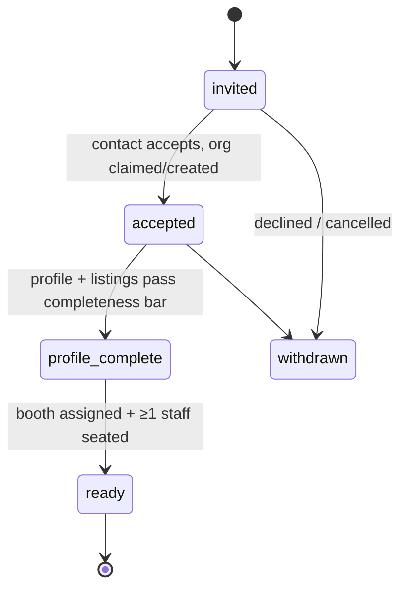

# Organizer Journey

This document specifies the end-to-end journey of the organizer personas — **Priya Sharma** (Event Director, strategic owner) and **Marcus Webb** (Event Operations Manager, hands-on operator) — from account creation through live-day operations to rebooking the next edition. Each stage names the exact Organizer Console routes touched (within the foundation §5 skeleton `/org/[orgSlug]/…`), the emotion or pain being relieved, the system effects, and the edge cases a builder must handle. Cross-persona timing and handoffs are framed in [04-user-journey.md](04-user-journey.md); this doc owns the organizer-side step detail. All entity, role, and tier names are canonical per [00-foundation.md](00-foundation.md).

## Journey Summary

| Stage | Name | Actor | Primary routes | Emotion addressed |
|---|---|---|---|---|
| O-1 | Account & organization creation | Priya | `/auth/signup`, `/org/[orgSlug]/dashboard` | "Is this tool going to be another 6-week procurement slog?" → productive in minutes |
| O-2 | Event creation wizard | Priya | `/org/[orgSlug]/events/new` | Blank-page dread → a real event skeleton fast |
| O-3 | Venue, floor plan & booth setup | Priya, Marcus | `/org/[orgSlug]/events/[eventSlug]/floor-plan` | CAD-file chaos → one canonical, editable floor |
| O-4 | Exhibitor invitation & onboarding tracking | Priya | `/org/[orgSlug]/events/[eventSlug]/exhibitors` | Spreadsheet-and-email herding → a live funnel |
| O-5 | Agenda building | Marcus | `/org/[orgSlug]/events/[eventSlug]/agenda` | Version-conflict hell → single source of truth |
| O-6 | Registration setup & publish | Priya | `/org/[orgSlug]/events/[eventSlug]/registration`, `…/settings` | Launch anxiety → guarded, reversible publish |
| O-7 | Pre-event health dashboard | Priya | `/org/[orgSlug]/events/[eventSlug]/overview` | "Are we on track?" gut-feel → measured readiness |
| O-8 | Live-day operations | Marcus | `/org/[orgSlug]/events/[eventSlug]/live` | Firefighting blind → seeing the whole floor |
| O-9 | Post-event insights & ROI reports | Priya | `/org/[orgSlug]/events/[eventSlug]/insights`, `…/reports` | "Trust me, it went well" → provable ROI |
| O-10 | Rebooking the next edition | Priya | `/org/[orgSlug]/events/new?from=[eventSlug]` | Starting over every year → compounding asset |

## O-1 — Account & Organization Creation

**Routes:** `/auth/signup` → org creation step → `/org/[orgSlug]/dashboard`
**Actor:** Priya. **Time-to-value budget:** part of the 30-minute JP-1 budget in [04-user-journey.md](04-user-journey.md).

1. Priya signs up with email + password (Supabase Auth, which owns credential storage and hashing), Google/Microsoft OAuth, or — later, on `enterprise` — SSO (auth details in docs 19–20).
2. Immediately after verification she creates her organizer organization: name, slug (validated, immutable-after-publish warning), logo. This creates an `organizations` row (`kind: organizer`) and an `organization_memberships` row with role `org:owner`.
3. She lands on `/org/[orgSlug]/dashboard` whose empty state has exactly one primary action: **Create your first event**.
4. She invites Marcus from `/org/[orgSlug]/team` (role `org:admin` or `org:member`); he accepts via `/auth/invite/[token]`.

**Billing decision:** signup and drafting are free. An active organizer plan (`launch` / `professional` / `enterprise`, foundation §4) is required only to *publish* an event (checked as entitlements at O-6). Gating at publish rather than signup maximizes evaluation depth while protecting revenue at the only moment that matters. Plan purchase lives at `/org/[orgSlug]/billing` (Stripe).

**Edge cases**
- Priya's company already has a Concourse org (a colleague created it): signup with a matching verified email domain surfaces "Request to join {org}" alongside "Create new organization"; join requests are approved by an `org:owner`/`org:admin`.
- Slug collision: suggest `{slug}-events`, never auto-suffix silently.

## O-2 — Event Creation Wizard

**Route:** `/org/[orgSlug]/events/new`
**Actor:** Priya. **Emotion:** the wizard converts blank-page dread into momentum — every step has smart defaults and can be revisited later from `…/settings` (JP-4).

Four steps, each writing incrementally (resumable per JP-8):

1. **Basics** — event name, event slug (drives the public `/e/[eventSlug]` URL; uniqueness is platform-global), start/end dates, timezone, expected attendance band, industry category (feeds Smart Matchmaking priors).
2. **Venue** — pick an existing `venues` record or create one (name, address, halls). Floor plan upload is deferred to O-3, not blocking.
3. **Team** — assign `event_staff` from org members (Marcus as `event:admin` or `event:staff`; matrix in [28-permission-model.md](28-permission-model.md)).
4. **Review & create** — creates the `events` row in status `draft`. Nothing is public.

Exit lands on `/org/[orgSlug]/events/[eventSlug]/overview`, which in `draft` renders as a **readiness checklist** (floor plan, exhibitors invited, agenda, registration, billing) — the same page that later becomes the health dashboard (O-7), so there is one home per event, always.

**Edge case** — dates change after exhibitor invites are out: editing dates on a `published` event requires typed confirmation and automatically notifies all accepted exhibitors and registered attendees (doc 33); the change is written to `audit_logs`.

## O-3 — Venue, Floor Plan & Booth Setup

**Route:** `/org/[orgSlug]/events/[eventSlug]/floor-plan`
**Actors:** Priya sets structure; Marcus does the detailed booth drawing. **Emotion:** replaces the "final_v7_REAL.dwg" email thread with one canonical floor.

1. Upload a floor plan underlay per hall (PDF/PNG/SVG, presigned S3 upload per doc 26) → `floor_plans` row.
2. Calibrate scale (two-point real-distance calibration) so dwell/wayfinding math works downstream.
3. Draw booths as rectangles/polygons on the underlay → `booths` rows with booth number, dimensions, category (e.g., standard / island / startup pavilion). Bulk tools: grid-stamp a row of uniform booths, CSV import of booth numbers.
4. Booths are **assignable** to exhibitors here or from the exhibitor tracker (O-4). Assignment writes to `event_exhibitors` and fires handoff H2 ([04-user-journey.md](04-user-journey.md) §4).

Concourse is not a CAD tool and does not try to be one — the underlay is an image, booths are vector overlays. That is sufficient for wayfinding, heatmaps, and assignment, and avoids a multi-quarter editor project.

**Edge case — floor plan change mid-setup (mandatory to handle well):**
- Replacing the underlay never deletes `booths`; existing booth vectors persist and enter a **re-anchor review** mode where Marcus drags any displaced booths onto the new underlay.
- Booths already assigned to exhibitors are visually flagged during re-anchor; deleting an assigned booth is blocked until the exhibitor is reassigned (picker inline) or unassigned with confirmation.
- If the event is `published`, saving a floor-plan revision notifies affected exhibitors ("Your booth is now B-214, hall 2") and attendees who saved those exhibitors. Every assignment change is audit-logged.

## O-4 — Exhibitor Invitation & Onboarding Tracking

**Routes:** `/org/[orgSlug]/events/[eventSlug]/exhibitors`, detail at `…/exhibitors/[eventExhibitorId]`
**Actor:** Priya. **Emotion:** this stage replaces her single biggest pre-event pain — chasing hundreds of exhibitors by spreadsheet — with a live funnel and automated nudges.

1. Add exhibitors one-by-one (company name, contact name, contact email, intended booth, optional complimentary tier) or via CSV import with a mapping/validation preview (bad rows quarantined, never silently dropped).
2. Each row creates an `event_exhibitors` record with onboarding status and sends an invitation (`event_exhibitor.invited`). What happens on the exhibitor side — accept, org claim-or-create, catalog reuse — is owned by [06-exhibitor-journey.md](06-exhibitor-journey.md).
3. The tracker is a funnel board over `event_exhibitors` onboarding status:

4. Per-status bulk nudges ("Remind all `invited` older than 7 days") send templated reminders through the notification service (doc 33) — capped at one automated nudge per exhibitor per 72h to protect sender reputation and relationships.
5. The detail page shows one exhibitor's completeness (profile fields, listings count, staff seated, booth) and a manual-override control: Priya can edit contact email or reissue an invite, but never edits the exhibitor's own profile content — that data belongs to the exhibitor tenant (foundation §8).

**Edge cases**
- **Late exhibitor (T−3 days):** identical flow, compressed. The invite email is marked urgent, the exhibitor's KB ingest jobs are enqueued at high priority (queue `kb-ingest`, doc 25) so Expo Copilot knows them by day one, and Priya assigns a booth from the held-inventory pool she is prompted to reserve during O-3.
- Invitation sent to the wrong email: revoke regenerates the token; the old link shows a clean "invitation revoked" page (error registry, doc 41).
- Exhibitor withdraws after booth assignment: status → `withdrawn`, booth returns to inventory, attendees who saved the exhibitor are notified, matchmaking pairs are retracted.
- Exhibitor stuck at `accepted` for weeks: the tracker surfaces staleness ("no activity in 14 days") and offers a personal (non-templated) nudge — per JP-3 the state is visible, not just emailed about.

## O-5 — Agenda Building

**Route:** `/org/[orgSlug]/events/[eventSlug]/agenda`
**Actor:** Marcus. **Vocabulary:** always **agenda sessions** (`agenda_sessions`), never bare "sessions" (foundation §12).

1. Define tracks and rooms (rooms optionally pinned to floor-plan locations for wayfinding).
2. Create agenda sessions: title, abstract, speakers, room, start/end, capacity, tags (tags join attendee interests for matchmaking and Copilot grounding).
3. CSV import for bulk programs; conflict detection (same room, overlapping time) blocks save with a precise error.
4. Published agenda content is a KB source (`kb_sources`) — Expo Copilot cites it.

**Edge case** — cancellation/room change on a `live` event: editing a live agenda session prompts an announcement notification to attendees who added it to their plan, and the change propagates to precached attendee agendas on next sync (JP-2 staleness banner covers the gap).

## O-6 — Registration Setup & Publish

**Routes:** `/org/[orgSlug]/events/[eventSlug]/registration` (setup), `…/settings` (publish control)
**Actor:** Priya. **Emotion:** publish is the scariest click of her quarter; the checklist makes it boring.

1. **Registration configuration:** registration types (e.g., General, VIP, Press — all free to the attendee per foundation D4; paid attendee ticketing is explicitly deferred to [44-future-expansion-plan.md](44-future-expansion-plan.md)), custom profile questions (typed fields, mapped into `attendee_interests` where marked as interest-bearing), capacity, approval mode (auto-approve default; manual review optional), and the consent disclosure text shown at registration — the platform-standard badge-scan consent language (see [07-attendee-journey.md](07-attendee-journey.md)) plus organizer-appended terms. Organizers can append to but not weaken the standard disclosure.
2. **Pre-publish checklist (hard gates):** active organizer plan entitlement, event dates/timezone set, registration configured, event page content (description, hero image) present. Floor plan and agenda are soft warnings, not gates — small events legitimately publish without them (JP-4).
3. **Publish:** status `draft → published`, fires `event.published` (handoff H1). The public event page `/e/[eventSlug]` and registration go live. Publish is reversible to `draft` within a grace window only if zero registrations exist; after that, "unpublish" becomes "close registration" — silently vanishing a live event with registrants is not a real-world operation.

## O-7 — Pre-Event Health Dashboard

**Route:** `/org/[orgSlug]/events/[eventSlug]/overview`
**Actor:** Priya, weekly then daily. **Emotion:** converts "I think we're fine" into numbers she can take to her boss.

The readiness checklist from O-2 matures into a health dashboard once published:

1. **Readiness score** — weighted composite of exhibitor funnel completion, registration pace vs. target (target set by Priya, defaulted from expected attendance band), agenda completeness, and matchmaking coverage (% of registered attendees with ≥5 `match_recommendations`).
2. **Exhibitor funnel** — the O-4 board, aggregated, with the bottom-10 laggards called out and one-click nudges.
3. **Registration curve** — cumulative registrations vs. days-to-event, with same-band benchmark shading on `professional`+.
4. **Organizer Pulse (pre-event mode)** — natural-language questions over setup data: "which product categories have the most attendee interest but the fewest exhibitors?" (`professional`+; AI grounding in docs 21–23). Deterministic fallback per JP-5: every Pulse answer is also reachable as a standard filterable report.

## O-8 — Live-Day Operations

**Route:** `/org/[orgSlug]/events/[eventSlug]/live` (tabs: Check-in, Floor, Agenda, Announcements)
**Actor:** Marcus, on his feet, on a tablet. **Emotion:** the day he stops firefighting blind. Every panel obeys the 10-second answer budget (JP-1).

0. **Go live:** Priya or Marcus flips status `published → live` on the morning of day one (prompted automatically at event start time, never auto-flipped — an operator confirms reality).
1. **Check-in monitoring:** real-time throughput (scans/min per station via Supabase Realtime channels), queue-depth estimate, checked-in vs. registered. Check-in scanning itself (staff pointing a device at Sofia's badge, writing `registration.checked_in`) runs on staff devices in the same PWA and is offline-tolerant per JP-2 — scans queue and reconcile, with server-side duplicate resolution (first check-in wins, later duplicates collapse silently).
2. **Floor heatmap:** live booth-visit density over the floor plan from `booth_visits` (scans + anonymous aggregate dwell — never individual tracks, per JP-6). Marcus uses it to spot dead zones and redirect signage/staff. Requires `professional`+.
3. **Agenda monitoring:** per-agenda-session check-in counts vs. capacity; over-capacity alerts suggest room swaps (which trigger the O-5 live-edit flow).
4. **Incident handling:** Phase 1 deliberately ships *operational levers*, not an incident-ticketing system: (a) **Announcements** — targeted broadcasts (all attendees / one hall / one agenda session's attendees / all exhibitor staff) through the notification service; (b) **status overrides** — close a booth, cancel or move an agenda session, pause check-in at a station; (c) every override is written to `audit_logs` with actor + reason. A dedicated incident entity/workflow is future work → [44-future-expansion-plan.md](44-future-expansion-plan.md).

**Edge cases**
- Venue Wi-Fi collapses: staff check-in and exhibitor lead capture continue offline (JP-2); the live dashboard honestly banners "last updated 4 min ago" instead of pretending — foundation principle "fast is the feature" includes fast truth.
- Badge won't scan at check-in: staff fallback is lookup by name/email → tap to check in; the lookup is rate-limited and audit-logged.
- Gate-crasher / unregistered walk-up: on-site registration runs through the same public `/e/[eventSlug]/register` flow on a kiosk-mode device, then immediate badge claim.

## O-9 — Post-Event Insights & ROI Reports

**Routes:** `/org/[orgSlug]/events/[eventSlug]/insights` (Organizer Pulse), `…/reports` (exhibitor ROI reports), `…/attendees` (data views/exports)
**Actor:** Priya, T+0 to T+2 weeks. **Emotion:** for the first time she can *prove* the event worked — to her boss and to every exhibitor deciding whether to rebook.

1. **Close-out:** Priya flips `live → completed` after the final day (prompted, not automatic). This finalizes metric windows, unlocks the attendee recap send, and marks report data as complete.
2. **Organizer Pulse (post-event mode):** the headline is **Qualified Connections per Event** (north-star, foundation §1), decomposed by exhibitor category, attendee segment, and hall; plus check-in totals, booth-visit distribution, agenda attendance, matchmaking acceptance rates, and NL questions ("which exhibitor categories were under-served relative to attendee interest?"). Aggregation-only views of exhibitor outcomes — Priya sees counts and scores in aggregate, never an individual exhibitor's lead contents (tenancy rule, foundation §8; read-path detail in [28-permission-model.md](28-permission-model.md)).
3. **Exhibitor ROI reports:** per-exhibitor report (visits, leads, qualified leads, meetings held, matchmaking engagement, benchmark percentile vs. event median) generated for every `event_exhibitor` and published *to the exhibitor's own portal* with one click. This is deliberately organizer-triggered: the report is Priya's rebooking sales asset.
4. **Exports:** attendee list (consent-respecting fields only), agenda attendance, exhibitor funnel — CSV from `…/attendees` and `…/reports`.

## O-10 — Rebooking the Next Edition

**Route:** `/org/[orgSlug]/events/new?from=[eventSlug]`
**Actor:** Priya, T+2–6 weeks. **Emotion:** the platform's compounding value — edition two starts at 80% configured.

1. **Clone:** copies venue, floor plan + booth layout, agenda structure (tracks/rooms, not dated agenda sessions), registration configuration, and the full exhibitor list into a new `draft` event with new dates. Leads, visits, and registrations never copy — they belong to the past edition (and leads belong to exhibitor tenants).
2. **Rebooking invitations:** the O-4 tracker pre-populated with last edition's exhibitors; invitations can attach that exhibitor's O-9 ROI report — the pitch writes itself. Exhibitors who accept reuse their org and catalog instantly ([06-exhibitor-journey.md](06-exhibitor-journey.md) owns that path).
3. **Archive:** after the retention-relevant work is done, `completed → archived` freezes the old event read-only.

## Marcus vs. Priya — Division of Labor

| Concern | Priya (`event:admin`) | Marcus (`event:staff` or `event:admin`) |
|---|---|---|
| Org/billing, plan purchase | Owns | No access |
| Event creation, publish, close-out | Owns | Publish only if `event:admin` |
| Floor plan drawing, agenda data entry | Reviews | Owns |
| Exhibitor relationship, nudging | Owns | Assists |
| Live-day operations | Monitors remotely | Owns on-site |
| Insights & ROI reports | Owns | Reads |

Exact permission strings per action: [28-permission-model.md](28-permission-model.md).

## Instrumentation

Every stage transition emits analytics events (`surface.object_action`, doc 32): `organizer.event_created`, `organizer.floor_plan_uploaded`, `organizer.exhibitor_invited`, `organizer.event_published`, `organizer.event_live`, `organizer.event_completed`, `organizer.roi_report_published`, `organizer.event_cloned`. The activation funnel (signup → first event published) and the rebooking rate (cloned within 90 days of `completed`) are the two organizer-side business KPIs derived from these.
