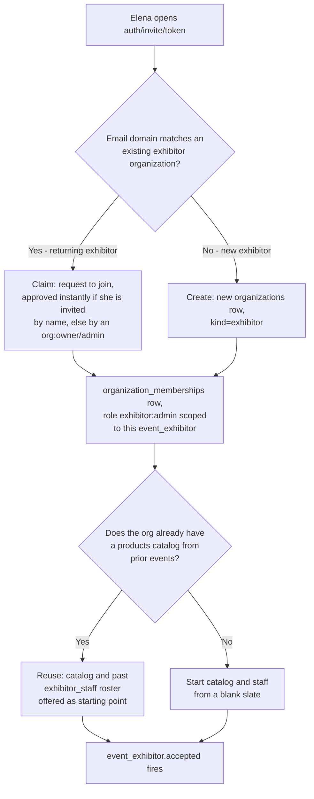
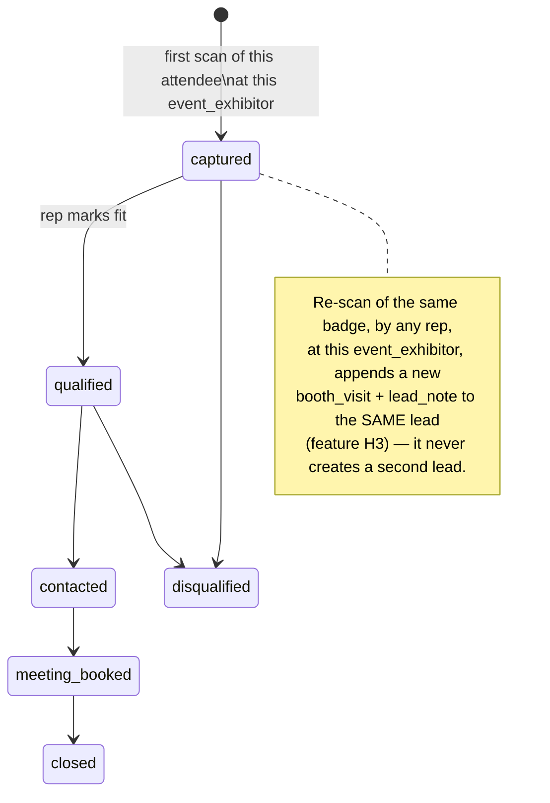
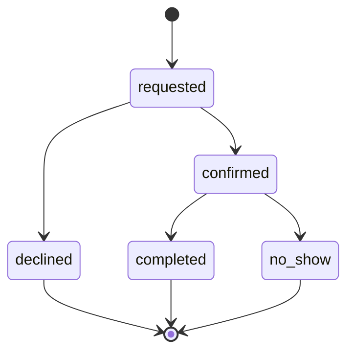
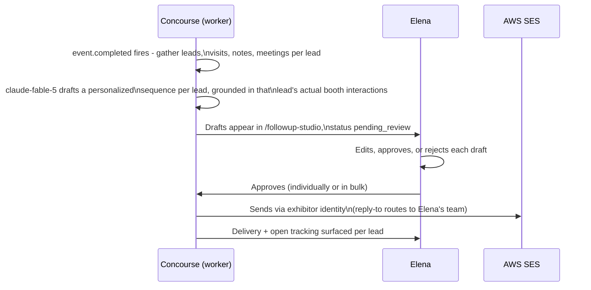

# Exhibitor Journey

This document specifies the end-to-end journey of the exhibitor personas — **Elena Rodriguez** (Marketing Director, exhibitor admin) and **Jamal Carter** (Booth Sales Rep, exhibitor rep) — from invitation acceptance through live-floor lead capture to post-event follow-up and rebooking. Each stage names the exact Exhibitor Portal routes touched (within the foundation §5 skeleton `/exhibit/[orgSlug]/events/[eventSlug]/…`), the emotion or pain being relieved, the system effects, and the edge cases a builder must handle. This is also the **canonical home for the offline-first lead capture loop** referenced as JP-2 in [04-user-journey.md](04-user-journey.md) and as handoff H7 — the mechanics in EX-6 (IndexedDB queue, `client_capture_id` idempotency, conflict handling for re-scans per feature H3) are specified here in full; the generic, surface-agnostic service-worker/IndexedDB implementation that carries this and other offline moments (badge display, agenda precache, check-in scanning) lives in [17-offline-sync-architecture.md](17-offline-sync-architecture.md), which treats this doc's business rules as its exhibitor-side requirements. Cross-persona timing and handoffs are framed in [04-user-journey.md](04-user-journey.md); the organizer-side half of onboarding (invitations, booth assignment, the funnel board) is owned by [05-organizer-journey.md](05-organizer-journey.md). All entity, role, tier, and entitlement names are canonical per [00-foundation.md](00-foundation.md) and [08-feature-matrix.md](08-feature-matrix.md).

## Journey Summary

| Stage | Name | Actor | Primary routes | Emotion addressed |
|---|---|---|---|---|
| EX-1 | Invitation acceptance & org claim-or-create | Elena | `/auth/invite/[token]`, `/exhibit/[orgSlug]/events/[eventSlug]/overview` | "Not another portal login" → recognized instantly if returning |
| EX-2 | Profile & product listings completion | Elena | `/exhibit/[orgSlug]/events/[eventSlug]/profile`, `…/catalog` | Blank profile anxiety → live in minutes, reused forever after |
| EX-3 | Staff seating within seat limits | Elena | `/exhibit/[orgSlug]/events/[eventSlug]/staff` | "Who's covering the booth?" → seated and notified in one pass |
| EX-4 | Tier ladder & upsell moments | Elena | `/exhibit/[orgSlug]/events/[eventSlug]/billing` | Locked feature dread → a visible, honest reason to pay |
| EX-5 | Pre-event prep: meeting slots & capture rehearsal | Elena, Jamal | `…/meetings`, `…/capture` (practice mode) | "Will this actually work on the floor?" → tested before doors open |
| EX-6 | Live-day offline-first lead capture | Jamal | `/exhibit/[orgSlug]/events/[eventSlug]/capture` | Forgotten conversations → every scan preserved, network or not |
| EX-7 | In-day lead triage, scoring & duplicate merge | Jamal, Elena | `…/leads`, `…/leads/[leadId]` | Alphabetical guesswork → the hot ones surface themselves |
| EX-8 | Meeting slot management & booking lifecycle | Elena, Jamal, Sofia | `…/meetings` | Calendar tag → confirmed meetings that show up |
| EX-9 | Follow-up Studio review & approval | Elena | `…/followup-studio` | Two-week cold blast → 48-hour warm, personal outreach |
| EX-10 | CRM export & sync | Elena | `…/leads` (export), `…/integrations` | Manual CSV wrangling → pipeline that's already in the CRM |
| EX-11 | Post-event ROI report receipt & rebooking decision | Elena | `…/reports` | "Was this booth worth it?" → a number to take to the CFO |

## EX-1 — Invitation Acceptance & Org Claim-or-Create

**Routes:** `/auth/invite/[token]` → claim-or-create step → `/exhibit/[orgSlug]/events/[eventSlug]/overview`
**Actor:** Elena. **Time-to-value budget:** ≤15 min from invite acceptance for a new exhibitor org, ≤5 min for a returning one (JP-1, [04-user-journey.md](04-user-journey.md)).

1. Priya's or Marcus's invitation (`event_exhibitor.invited`, O-4) lands as an email with a scoped, expiring token. Elena opens `/auth/invite/[token]`, authenticates (email/password, OAuth, or passkey per foundation §6), and reaches the claim-or-create decision.
2. Concourse checks whether Elena's verified email domain matches an existing `organizations` row of `kind: exhibitor`:



3. Either path writes the same shape of record: an `event_exhibitors` row (this event's participation, default tier `essentials`, status `accepted`) linking the exhibitor `organizations` row to the `events` row Priya created.
4. **Returning exhibitor, catalog reuse:** if the org has `products` from a prior event, Elena's first screen after claim is not a blank profile — it is "Bring your catalog and team to {event}?" with every existing product and every prior `exhibitor_staff` member pre-checked. Accepting writes `event_product_listings` rows in one action and re-invites the same reps (still subject to seat-limit checks per EX-3). This is the mechanism behind the ≤5-minute returning-exhibitor budget and the O-10 rebooking flow's "exhibitors who accept reuse their org and catalog instantly."
5. **New exhibitor:** lands on an empty profile with exactly one primary action, mirroring the organizer's O-1 pattern: **Complete your profile** — no forced tour, no blocking modal.

**Edge cases**
- **Late-arriving exhibitor (T−3 days or less):** identical flow, compressed. The invite is marked urgent by Priya (O-4); Elena's KB ingest (profile → `kb_sources`) is enqueued at high priority the moment her profile is saved, so Expo Copilot can cite her by doors-open even with almost no lead time. Catalog reuse becomes the critical path to hitting any usable time-to-value at all — a returning exhibitor who reuses their catalog can be `profile_complete` within minutes of accepting; a brand-new exhibitor arriving this late is realistically incomplete for opening day, and the readiness checklist (EX-2) says so honestly rather than hiding the gap.
- **Wrong contact / wrong email on the invite:** Elena forwards the email; the token is single-use-until-claimed but not identity-bound, so whoever completes the claim becomes the first `exhibitor:admin` — Elena (the intended admin) can be added afterward by that person, or Priya can revoke and reissue to the correct address (O-4 edge case, symmetric).
- **Two people at the same company both try to create a new org** because the domain check raced: the second claim attempt within the grace window is redirected to a "request to join" prompt against the just-created org instead of creating a sibling duplicate organization — domain-based dedup is checked at claim time, not only at signup, specifically to close this race.
- **Exhibitor withdraws before the event:** Elena (or Priya, on request) sets `event_exhibitors.status → withdrawn`. Effects mirror O-4's symmetric edge case: the booth returns to Priya's inventory, all `exhibitor_staff` seats are deactivated, any `match_recommendations` involving this exhibitor are retracted, and attendees who had saved the exhibitor are notified. If withdrawal happens mid-event (rare, but possible — a no-show), any `leads` already captured remain exhibitor-owned per tenancy (foundation §8); they are not deleted, only the forward-looking surfaces (booth listing, matchmaking, meeting booking) go dark.

## EX-2 — Profile & Product Listings Completion

**Routes:** `/exhibit/[orgSlug]/events/[eventSlug]/profile`, `/exhibit/[orgSlug]/events/[eventSlug]/catalog`
**Actor:** Elena. **Emotion:** JP-4's minimum-viable-setup-first principle applies directly — the profile is shippable on required fields alone, with a completeness score making the gap visible rather than blocking anything.

1. **Profile** (`event_exhibitors`-scoped presentation over the org record): logo, description, categories/tags (feed both the attendee directory and Smart Matchmaking), booth number (read-only here — booth assignment is organizer-owned, H2 in [04-user-journey.md](04-user-journey.md) §4), links, contact.
2. **Catalog** (`products`, org-scoped, reusable across every event the org exhibits at — feature E1): name, description, category, media via presigned S3 upload (doc 26). The foundation §5 route skeleton gives the Exhibitor Portal a single, event-scoped base path, so catalog CRUD is served from this event's `…/catalog` page rather than a separate org-level route — but because `products` rows are org-scoped, editing a product from any event's catalog page updates the same underlying row everywhere it's listed (foundation principle 3, one source of truth). This is what makes the JP-1 returning-exhibitor budget achievable — an exhibitor's 40-product catalog is built once, ever, regardless of which event's page it was built from.
3. **Listings** (`event_product_listings`, feature E2), on the same `…/catalog` page: Elena selects which subset of the org catalog shows at *this* event — a regional show might surface 8 of 40 products.
4. **Readiness checklist** (feature D6): profile fields, listing count ≥1, booth assigned (organizer-owned), staff seated ≥1 — the same completeness bar Priya's O-4 tracker reads (`accepted → profile_complete → ready`, per the state diagram in [05-organizer-journey.md](05-organizer-journey.md) O-4). One completeness score, computed once, shown on both sides — never two numbers disagreeing about the same exhibitor.
5. **KB ingestion:** saving the profile and listings enqueues `kb-ingest` jobs (queue name per foundation §11) that turn this content into `kb_sources` → `kb_chunks`, making the exhibitor citable by Expo Copilot and matchable by Smart Matchmaking (H3 in [04-user-journey.md](04-user-journey.md) §4) — this is the moment the exhibitor becomes visible to Sofia, not merely "saved."
6. **Profile moderation (feature D7):** Marcus can review and flag exhibitor-submitted content (logo, description, links) for organizer-side policy reasons (e.g., competitor claims, banned categories). A flagged profile stays live but shows a private "under review" badge to Elena only — moderation never silently unpublishes content Elena believes is live, per JP-3 (handoffs are visible states).

**Edge cases**
- Elena starts a profile, gets pulled into a different fire, and returns three weeks later (JP-8): she lands on "what changed since you left" — organizer nudges received, any moderation flags, and one clear next action — never a blank form.
- Product media upload fails AV scanning (doc 26): the listing saves without that asset and shows an inline retry, never a silent drop.

## EX-3 — Staff Seating Within Seat Limits

**Route:** `/exhibit/[orgSlug]/events/[eventSlug]/staff`
**Actor:** Elena. **Emotion:** "who's covering the booth" anxiety resolved with one invite screen, not a spreadsheet.

1. Elena invites reps by email; each accepted invite creates an `exhibitor_staff` row scoped to this `event_exhibitors` record, role `exhibitor:admin` or `exhibitor:rep` (Jamal is `exhibitor:rep`).
2. Returning exhibitors see their prior roster pre-populated from EX-1's catalog-reuse step and can re-invite in bulk.
3. Seats are checked against `entitlement:staff_seats` (foundation §4, registry in [08-feature-matrix.md](08-feature-matrix.md) §3): `essentials` grants exactly 3 active seats; `growth` and `intelligence` grant unlimited (`-1`).

**Edge case — seat-limit hit (the first upsell moment):** Elena invites a fourth rep on `essentials`. Per the feature-matrix gating rule (§5.2 — "gates fail closed but visible"), the invite form does not silently reject or 404; it shows the invite as ready to send with an inline upgrade prompt: "Essentials includes 3 staff seats — you're at your limit. Upgrade to Growth for unlimited seats." Accepting routes to EX-4's tier purchase; declining leaves the pending invite saved (not discarded) so upgrading later sends it immediately without re-entry.

## EX-4 — Tier Ladder & Upsell Moments

**Route:** `/exhibit/[orgSlug]/events/[eventSlug]/billing` (in-portal Stripe Checkout, feature Q4)
**Actor:** Elena. **Emotion:** every locked feature names exactly what it costs and what it buys — no dark-pattern paywalls, per the anti-persona stance against manipulative growth tactics ([03-user-personas.md](03-user-personas.md) §7).

Every `event_exhibitors` record starts on `essentials` (free with booth, foundation §4). Code checks entitlement keys, never tier names (foundation §4); the grant mapping is the canonical registry in [08-feature-matrix.md](08-feature-matrix.md) §3, reproduced here as the exhibitor-facing upgrade story:

| Moment in this journey | Locked at `essentials` | Unlocks at | Entitlement key |
|---|---|---|---|
| EX-3 — inviting a 4th staff member | 3-seat cap | `growth` (unlimited) | `entitlement:staff_seats` |
| EX-6/EX-7 — voice notes, lead scoring, AI summaries, hot-lead alerts | Text notes and a plain sortable list only | `growth` | `entitlement:lead_intelligence` |
| EX-7 — exporting captured leads | In-portal viewing only | `growth` | `entitlement:lead_export` |
| EX-8 — configuring bookable meeting slots | Not available | `growth` | `entitlement:meeting_scheduling` |
| EX-10 — CRM connector sync | Not available | `growth` | `entitlement:crm_sync` |
| EX-9 — Follow-up Studio drafting | Not available | `intelligence` | `entitlement:followup_studio` |
| Smart Matchmaking priority placement (inbound prospect boost) | Standard ranking only | `intelligence` | `entitlement:matchmaking_priority` |
| Real-time booth analytics stream (live visit/dwell view) | Near-real-time dashboard only (feature O2, all tiers) | `intelligence` | `entitlement:booth_analytics_realtime` |
| Category percentile competitive benchmarks | Not available | `intelligence` | `entitlement:competitive_benchmarks` |

1. Each upgrade moment is a **contextual** prompt at the point of friction (JP-3), never a generic pricing interstitial — Elena sees the upgrade offer exactly where the essentials ceiling bites.
2. Purchase is in-portal Stripe Checkout scoped to this `event_exhibitors` record (a tier is purchased per event, not once for the whole org — a company exhibiting at nine events, per Elena's persona profile, can run `essentials` at a low-priority regional show and `intelligence` at its flagship one).
3. Entitlements resolve immediately on Stripe webhook confirmation (`plans → subscriptions → entitlements`, foundation §4); no support ticket, no next-business-day wait — the locked-feature screen becomes the unlocked feature screen on the same page load.
4. **Downgrade/expiry (feature Q5):** if a subscription lapses mid-event (declined card, non-renewal), the exhibitor drops to a read-only grace period before reverting to `essentials` behavior — seats beyond 3 are frozen (not deleted; reactivating restores them), export and CRM sync stop, Follow-up Studio drafts already sent are unaffected. Billing mechanics in detail: [36-billing-and-payments-architecture.md](36-billing-and-payments-architecture.md).

## EX-5 — Pre-Event Prep: Meeting Slots & Capture Rehearsal

**Routes:** `/exhibit/[orgSlug]/events/[eventSlug]/meetings` (availability), `/exhibit/[orgSlug]/events/[eventSlug]/capture` (practice mode)
**Actors:** Elena configures; Jamal rehearses. **Emotion:** the week before, per [04-user-journey.md](04-user-journey.md) §2 (T−1w row) — "will this actually work on the floor?" answered before doors open, not during.

1. **Availability configuration (feature I1, `growth`+):** Elena defines bookable slot templates per staff member — duration, buffer, booth location (defaults from the assigned booth), and which reps hold which slots. This publishes bookable meetings to exhibitor profiles (handoff H6, [04-user-journey.md](04-user-journey.md) §4).
2. **PWA install:** Jamal installs the Exhibitor Portal PWA on his personal iPhone (foundation D3) from `/exhibit/[orgSlug]/events/[eventSlug]/capture` — an install prompt, not an App Store detour.
3. **Practice scan:** capture mode has an explicit rehearsal state — scanning a sample/test badge writes to a sandboxed `event_exhibitors`-scoped test lead, clearly labeled, purged before go-live, so Jamal's first *real* scan on show day is not also his first scan ever. This is the mechanism behind [04-user-journey.md](04-user-journey.md)'s T−1w row: "Jamal installs PWA, runs a practice scan; offline capture verified."
4. **Offline verification:** practice mode includes a one-tap "simulate offline" toggle (airplane mode is the real-world equivalent) so Jamal can confirm the capture flow described in EX-6 behaves identically with connectivity off — building trust in the mechanism before he needs to trust it under pressure.

## EX-6 — Live-Day Offline-First Lead Capture

**Route:** `/exhibit/[orgSlug]/events/[eventSlug]/capture`
**Actor:** Jamal, on his feet, one hand, twenty seconds between conversations. **Time-to-value budget:** ≤30s to first captured lead, ≤5s per subsequent scan-to-scan cycle (JP-1). **Connectivity assumption:** none — this is the "full loop works offline" row in JP-2 ([04-user-journey.md](04-user-journey.md) §5).

This is the canonical specification of the mechanism JP-2 and handoff H7 point to. It has four parts: the local queue, the sync protocol, the derived lead model, and re-scan/conflict handling.

### 6.1 The local queue

Every capture — connected or not — is written to a local IndexedDB store before anything else happens on screen. There is no "try online first, fall back to queue" branching: **the queue is the only write path**, even when online, which is what makes the offline and online experiences identical (foundation principle 4, "works in a concrete hall").

- **Store:** `pending_captures`, keyed by `client_capture_id` — a UUIDv7 (foundation §9's ID convention) generated on-device at the moment of scan, never server-assigned. This is the idempotency key for every retry of this capture.
- **Record shape** (illustrative — the generic offline-storage architecture is [17-offline-sync-architecture.md](17-offline-sync-architecture.md)'s to specify; this is the exhibitor-side contract that doc must satisfy):

```ts
interface PendingCapture {
  clientCaptureId: string;        // UUIDv7 — the idempotency key
  badgeCode: string;               // scanned QR payload (opaque, no PII — foundation §12)
  eventExhibitorId: string;
  boothId: string;
  capturedByStaffId: string;       // exhibitor_staff.id — Jamal
  capturedAt: string;               // device-clock ISO-8601 timestamp at scan
  qualifierAnswers?: Record<string, string | number | boolean>; // feature H5
  textNote?: string;
  voiceNote?: {
    localBlobRef: string;          // IndexedDB/Cache Storage key for the recorded audio
    durationSeconds: number;
    uploadStatus: "pending" | "uploaded" | "failed";
  };
  syncStatus: "pending" | "syncing" | "synced" | "failed";
  syncAttempts: number;
  lastSyncError?: string;
}
```

- Writing a `PendingCapture` is synchronous and local — the UI confirms "captured" in well under the JP-1 budget with zero network round-trips. This is the mechanism, not an approximation of it: the confirmation the rep sees *is* the durable write.

### 6.2 Scan-to-sync flow

```mermaid
sequenceDiagram
    participant J as Jamal (PWA)
    participant Q as IndexedDB (pending_captures)
    participant SW as Service worker / Background Sync
    participant API as Concourse API

    J->>J: Scans badge_code (camera QR)
    J->>J: Generates client_capture_id (UUIDv7)
    J->>Q: Writes PendingCapture, syncStatus=pending
    Q-->>J: Instant local confirm - no network required
    opt Jamal adds context
        J->>J: Records 15s voice note or types a note
        J->>Q: Attaches note/voiceNote to same record
    end
    Note over J,Q: Repeats all day, network up or down
    SW->>SW: Detects connectivity restored (online event / periodic wake)
    SW->>Q: Reads syncStatus=pending, ordered by capturedAt, in bounded batches
    SW->>API: POST /v1/booth-visits (Idempotency-Key: client_capture_id)
    API->>API: Upsert booth_visit; upsert lead by (event_exhibitor_id, registration_id)
    API-->>SW: 201 + { boothVisitId, leadId, appended: boolean }
    SW->>Q: Marks syncStatus=synced, stores server leadId
    opt voice note present
        SW->>API: Uploads audio via presigned S3 URL (doc 26)
        API->>API: Enqueues transcription job (worker queue lead-voice-transcription)
    end
```

- **Sync trigger:** the PWA's service worker listens for connectivity restoration and also attempts a periodic flush while foregrounded — Jamal never has to know a sync happened, per "fast is the feature" (foundation principle 1) meaning fast *and honest*: a small "3 pending" badge is visible whenever the queue is non-empty, never hidden, never a spinner.
- **Idempotency:** every POST carries `Idempotency-Key: {clientCaptureId}` per the API convention (foundation §9). A retried POST for a `client_capture_id` the server has already processed returns the original result — safe to retry on flaky hall Wi-Fi without ever double-writing.
- **Voice notes + transcription (feature H7, `entitlement:lead_intelligence`, `growth`+):** the audio blob syncs after the booth-visit record (text/qualifiers are never blocked waiting on a larger upload). Transcription runs as a background worker job; the resulting transcript is written as a `lead_notes` row (`source: voice`) and, where `entitlement:lead_intelligence` is active, folded into the AI interaction summary (feature L2) via `claude-haiku-4-5` per the model-routing split in foundation §6. The ASR engine selection itself is an implementation detail of the worker pipeline, owned by [21-ai-architecture.md](21-ai-architecture.md) and [27-background-jobs-architecture.md](27-background-jobs-architecture.md) — this doc fixes the contract (queued locally, uploaded on sync, transcribed asynchronously, attached to the lead), not the vendor.

### 6.3 From booth visit to lead

A scan is a raw signal (`booth_visits` — glossary, foundation §12); it becomes exhibitor intelligence only through the upsert below:



- The server-side upsert key for a `lead` is **`(event_exhibitor_id, registration_id)`** — one lead per attendee per exhibitor per event, matching the glossary definition exactly ("a lead is exhibitor-owned, enriched, derived from interactions with *one* attendee"). `registration_id` is resolved server-side from the scanned `badge_code`.
- `client_capture_id` guards a single device against re-sending its own retried POST. The **lead-level composite key** is what guards against duplicate leads across devices, reps, and days — a deliberately separate mechanism, because two offline devices can independently mint different `client_capture_id`s for the same real-world re-scan.

### 6.4 Re-scan and conflict handling (feature H3)

| Scenario | Server behavior |
|---|---|
| Same badge scanned twice by the same rep, same booth, same day | New `booth_visits` row; existing `leads` row found by the composite key; new `lead_notes` appended; pipeline stage unchanged unless the rep explicitly advances it |
| Same badge scanned by a *different* rep at the same booth | Same upsert; the lead accumulates multi-rep attribution — `leads.captured_by` records the first capture, later `booth_visits`/`lead_notes` each carry their own actor, so Elena's lead detail shows the full multi-rep conversation history, not a single rep's partial view |
| Re-scan after the lead is already `closed` or `disqualified` | Append is still allowed, but the capture UI surfaces "this contact was already {status}" so the rep makes an explicit choice; reopening writes a `lead.reopened` domain event rather than silently resurrecting a closed record |
| Two devices capture the same badge while both offline (race) | Each device syncs independently, each with its own `client_capture_id`. The **first to reach the server** creates the lead via the composite key; the second's POST still succeeds (idempotent at the device level) but resolves to an *append* against the lead the first request created — no conflict is surfaced to either rep, because none exists from the data model's point of view |
| Duplicate leads despite the above (e.g., the attendee re-registered under a second `badge_code`, so `registration_id` differs) | Not auto-merged — different `registration_id` means a different composite key. Surfaced instead in the feature H10 duplicate-suggestion queue (fuzzy match on name + email + company) for Elena's manual merge in EX-7 |

### 6.5 Offline spanning a full show day, then bulk sync

Jamal's show-day reality (his persona profile: hundreds of conversations, connectivity dying after lunch) can leave 100+ `PendingCapture` records queued by evening.

- **Non-blocking:** new scans keep writing to the queue while a sync is in flight — capture is never paused to let sync catch up.
- **Bounded batches, ordered:** the flush POSTs in small batches (not one giant request), strictly ordered by `capturedAt`, so "first capture wins" ordering (relevant to the race scenario above) holds even when 100 records reconcile in one burst at 6pm in the parking lot.
- **Backoff, not failure:** a 429 or 5xx during bulk flush retries with exponential backoff per record; the queue badge shows "syncing 47 of 112" rather than an error, unless a record fails permanently (e.g., a malformed payload), in which case it surfaces as one actionable item, never a silent drop.
- **Retention:** synced records prune from IndexedDB after a short confirmation window (24h) — long enough for Jamal to see "all synced" and trust it, short enough not to let device storage grow unbounded across a multi-day event.

## EX-7 — In-Day Lead Triage, Scoring & Duplicate Merge

**Routes:** `/exhibit/[orgSlug]/events/[eventSlug]/leads`, `…/leads/[leadId]`
**Actors:** Jamal (triage in dead moments), Elena (oversight). **Emotion:** replaces end-of-day alphabetical guesswork with a ranked list that already knows what mattered.

1. **Deterministic baseline (all tiers, JP-5 fallback):** every captured lead appears in a plain, sortable list — company, contact, qualifier answers, notes, pipeline stage (`captured → qualified → contacted → meeting_booked → closed`, or `disqualified`). This is what `essentials` sees, and it is fully usable without AI.
2. **Lead Intelligence (`growth`+, feature L1/L2/L4):** each lead gets a 0–100 score with reason codes, an AI-written interaction summary grounded in the actual visits/notes/meetings behind it (`claude-fable-5`, foundation §6), and a hot-lead push alert when score crosses threshold — surfaced *during* the day, not after, which is exactly Jamal's stated frustration ("no feedback loop... he captures all day and never learns which leads went anywhere").
3. **Firmographic enrichment (`growth`+, feature L3):** company data attached via a pluggable enrichment provider, same "provider framework, not a hardcoded vendor" pattern as CRM connectors (EX-10).
4. **Duplicate merge (feature H10):** the system-suggested duplicate queue (fuzzy match, see EX-6.4) surfaces candidate pairs to Elena; she reviews side-by-side and either merges (notes, visits, and score history combine onto one lead, the loser is archived with a pointer to the survivor) or dismisses the suggestion (two genuinely different people). Auto-merge is deliberately not offered — merging identity records incorrectly is worse than leaving two rows, so a human always confirms.
5. **Assignment (feature H8):** leads can be reassigned between reps (e.g., a rep who started the conversation hands off a technical question to a colleague) — pipeline flow and assignment are the same screen, designed for the thumb-speed triage Jamal's persona demands.

## EX-8 — Meeting Slot Management & Booking Lifecycle

**Route:** `/exhibit/[orgSlug]/events/[eventSlug]/meetings`
**Actors:** Elena configures availability (EX-5); Jamal books on the spot; Sofia requests from the Attendee App. **Gate:** `entitlement:meeting_scheduling` (`growth`+; held by the exhibitor — attendees always book free wherever the exhibitor has the key, per feature matrix §4.9 footnote).



1. **Configured availability** (EX-5) publishes slots to the exhibitor's public profile (handoff H6).
2. **Attendee-initiated:** Sofia requests a slot from the Attendee App; it enters `requested` and a rep confirms or declines from the same `…/meetings` screen used to configure availability — one inbox, not a separate booking tool.
3. **Rep-initiated, on the spot:** Jamal's persona goal #3 ("book the meeting there and then") is served directly from the lead detail screen (EX-7) — a strong conversation converts to a `confirmed` meeting in the same flow, no context switch back to a calendar app.
4. **Reminders & calendar invites (feature I4):** `.ics` attachments and push/email reminders through the notification service (doc 33).
5. **Outcome capture (feature I5):** after the slot passes, the rep marks `completed` or `no_show`, which updates the lead's pipeline stage (`meeting_booked → closed` on a good outcome) — meetings and leads are two views of one relationship, never reconciled by hand.

## EX-9 — Follow-up Studio Review & Approval

**Route:** `/exhibit/[orgSlug]/events/[eventSlug]/followup-studio`
**Actor:** Elena. **Gate:** `entitlement:followup_studio` (`intelligence` only, feature M1–M3 in the Follow-up Studio matrix section). **Emotion:** this is the stage that answers Elena's persona-defining frustration directly — the two-week generic blast becomes 48-hour warm, personal outreach (JP-1's adjacent goal, though not a hard budget in this doc's table since it is post-event, not first-touch).



1. **Grounded drafting (feature M1):** every draft cites what actually happened at the booth — the qualifier answers, notes, and score behind that specific lead — never a generic template with a mail-merge field. This is the deterministic-vs-AI boundary JP-5 requires: without `entitlement:followup_studio` (or with AI budget-capped, foundation §10), the fallback is plain CSV export (EX-10), never a broken AI feature.
2. **Human review is mandatory (feature M2):** no draft sends without Elena's (or a delegated rep's) explicit approval — this is a hard product rule, not a configurable toggle, because an AI-drafted message reaching a prospect unreviewed is a trust failure the platform will not risk.
3. **Platform sending (feature M3):** sends via SES under the exhibitor's own identity, with delivery/open tracking surfaced per lead — Elena sees which drafts landed and which got a reply, closing the loop her persona explicitly lacks today.
4. **Export to CRM instead (feature M4, `followup_studio` + `crm_sync`):** rather than sending through Concourse, Elena can push the drafted sequences into her connected CRM's own outreach tooling — covered in EX-10.

## EX-10 — CRM Export & Sync

**Routes:** `/exhibit/[orgSlug]/events/[eventSlug]/leads` (export button), `/exhibit/[orgSlug]/events/[eventSlug]/integrations` (connection — same single event-scoped base path as the rest of the Exhibitor Portal, foundation §5; the underlying CRM credential is stored at the org level and reused across every event the org exhibits at, same reuse logic as the product catalog in EX-2)
**Actor:** Elena. **Gate:** `entitlement:lead_export` for CSV/XLSX (`growth`+, feature H11); `entitlement:crm_sync` for live connectors (`growth`+, feature H12).

1. **Export (essentials sees leads in-portal only — this is the primary, explicitly named upsell lever in the feature matrix):** async CSV/XLSX export for large lead sets, generated as a background job so Elena is never staring at a spinner for a 5,000-row event (feature H11).
2. **CRM sync (`growth`+):** a connector framework with Salesforce and HubSpot first (feature H12), connected once at the org level and scoped to sync a given event's leads on demand or on a schedule. Field mapping (lead score, summary, qualifier answers, pipeline stage → CRM fields/stages) is configured once per connector and reused every event — the same "set up once, benefit every event" shape as the product catalog and staff roster.
3. **Follow-up Studio export target (feature M4):** on `intelligence` + `crm_sync`, drafted sequences push into the CRM's own sequencing tool instead of sending via Concourse — for exhibitors whose compliance or brand-voice process requires outreach to originate from their own CRM identity.
4. Deeper connector architecture (auth, field-mapping UI, sync cadence, error handling) is owned by [35-integrations-and-connectors.md](35-integrations-and-connectors.md); this doc owns only the moment in Elena's journey where the sync happens and why.

## EX-11 — Post-Event ROI Report Receipt & Rebooking Decision

**Route:** `/exhibit/[orgSlug]/events/[eventSlug]/reports`
**Actor:** Elena. **Emotion:** the stage that answers her persona's central question — "was this booth worth it?" — with a number instead of a guess.

1. **Receipt, not generation:** the exhibitor ROI report is deliberately organizer-triggered (O-9) and *published to* this route with one click from Priya's side — Elena does not build her own report, she receives Priya's rebooking sales asset, which is exactly why it is trustworthy evidence rather than self-graded homework.
2. **Contents:** visits, leads, qualified leads, meetings held, matchmaking engagement, and a benchmark percentile vs. the event median (Elena's persona goal #4 — "rank the nine events by actual return"). This is aggregate-to-the-exhibitor detail; Priya's side of the same data is aggregate-across-exhibitors only, never the reverse (tenancy rule, foundation §8).
3. **Cross-event comparison:** because reports land in the same shape at every event the org exhibits at, Elena's own event-to-event ranking (persona goal #4, "spend where we win") is a byproduct of consistent report structure, not a separate analytics build on her side.
4. **Rebooking:** when Priya's O-10 clone-and-invite flow reaches this exhibitor, the invitation carries this exact report attached — "the pitch writes itself," per [05-organizer-journey.md](05-organizer-journey.md) O-10. Elena's decision to rebook, and frequently to upgrade tier (T+2w→T+6w row, [04-user-journey.md](04-user-journey.md) §2), closes the loop that opened at EX-1.

## Elena vs. Jamal — Division of Labor

| Concern | Elena (`exhibitor:admin`) | Jamal (`exhibitor:rep`) |
|---|---|---|
| Org claim/create, tier purchase, billing | Owns | No access |
| Profile, catalog, listings | Owns | Reads |
| Staff seating | Owns | N/A (is seated) |
| Meeting slot configuration | Owns | Can book on the spot within configured slots |
| Live-floor lead capture | Assists (also captures at the booth) | Owns |
| Lead triage, scoring, duplicate merge | Owns oversight/merge | Owns day-of triage |
| Follow-up Studio review & approval | Owns | No access |
| CRM export/sync configuration | Owns | No access |
| ROI report | Owns | Reads |

Exact permission strings per action: [28-permission-model.md](28-permission-model.md).

## Instrumentation

Every stage transition emits analytics events (`surface.object_action`, doc 32): `exhibitor.invite_accepted`, `exhibitor.org_claimed`, `exhibitor.org_created`, `exhibitor.profile_completed`, `exhibitor.staff_invited`, `exhibitor.tier_upgraded`, `exhibitor.capture_queued`, `exhibitor.capture_synced`, `exhibitor.lead_qualified`, `exhibitor.leads_merged`, `exhibitor.meeting_confirmed`, `exhibitor.followup_approved`, `exhibitor.crm_synced`, `exhibitor.roi_report_viewed`. Two exhibitor-side business KPIs derive from these: the onboarding activation funnel (`invited → ready`, mirroring Priya's O-4 funnel from the other side) and 48-hour follow-up coverage (share of `event_exhibitors` with an approved Follow-up Studio send, or a CRM export, within 48h of `event.completed`) — the metric that most directly tracks Elena's stated definition of success.

## Ownership

| Detail | Owned by |
|---|---|
| Exhibitor stage-by-stage flows, routes, edge cases | This document |
| Offline lead capture business rules — queue contract, idempotency, re-scan/conflict resolution | This document (§EX-6); generic offline substrate in [17-offline-sync-architecture.md](17-offline-sync-architecture.md) |
| Tier/entitlement key definitions and grant mapping | [08-feature-matrix.md](08-feature-matrix.md) §3 |
| Table/column detail behind every entity named here | [16-database-schema.md](16-database-schema.md) |
| Roles/permissions enforcing exhibitor-side access | [28-permission-model.md](28-permission-model.md) |
| CRM connector framework internals | [35-integrations-and-connectors.md](35-integrations-and-connectors.md) |
| Follow-up Studio model routing, prompts, guardrails | [21-ai-architecture.md](21-ai-architecture.md) |
| Stripe checkout, proration, downgrade/dunning mechanics | [36-billing-and-payments-architecture.md](36-billing-and-payments-architecture.md) |
| Organizer-side exhibitor tracker, booth assignment, ROI report generation trigger | [05-organizer-journey.md](05-organizer-journey.md) |
| Attendee-side consent, self-scan, badge mechanics | [07-attendee-journey.md](07-attendee-journey.md) |
| Cross-persona timeline, handoffs, journey design principles (JP-1…JP-8) | [04-user-journey.md](04-user-journey.md) |
