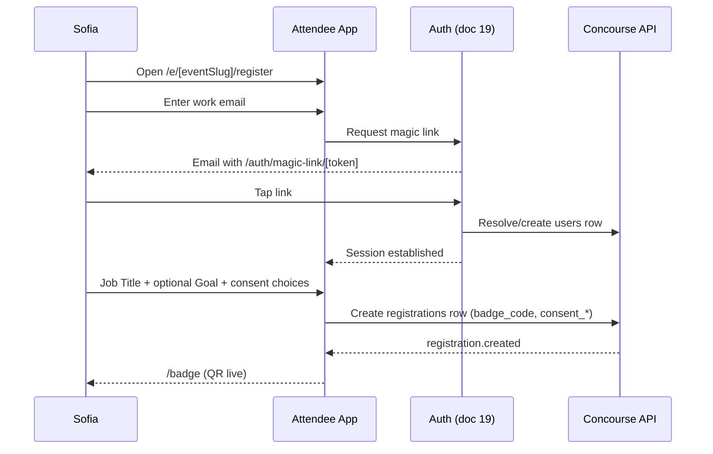
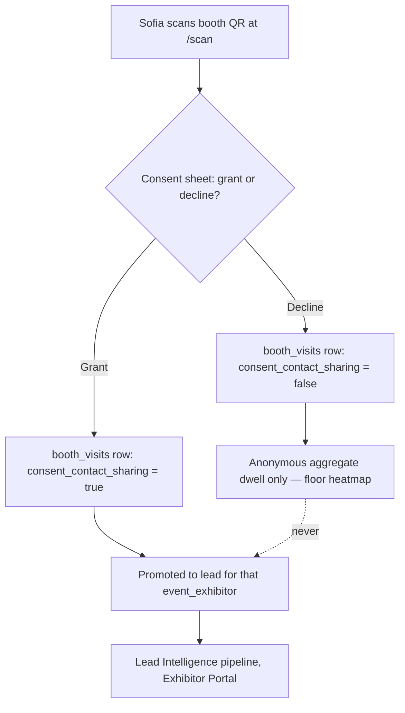

# Attendee Journey

This document specifies the end-to-end journey of the attendee persona — **Sofia Lindqvist**, procurement lead attending the show to shortlist vendors — from first registration touch through live-day floor behavior to the post-event recap. It is the canonical owner of three things no other document may restate differently: the **consent moments** referenced by [04-user-journey.md](04-user-journey.md) JP-6 (exact triggers, what each scope unlocks, and revocation's cascading effects), the **low-connectivity behavior** referenced by JP-2 (what is precached, what degrades, what stays online-only), and the attendee-facing step detail behind every Attendee App route in [11-information-architecture.md](11-information-architecture.md) §4.7. Cross-persona timing and handoffs are framed in [04-user-journey.md](04-user-journey.md); the auth token mechanics behind magic links (generation, expiry, replay protection, session issuance) are owned by [19-authentication-strategy.md](19-authentication-strategy.md) and [20-session-strategy.md](20-session-strategy.md) — this document owns only the UX sequence Sofia experiences. All entity, role, and tier names are canonical per [00-foundation.md](00-foundation.md); persona detail (goals, frustrations, JTBD) is expanded in [03-user-personas.md](03-user-personas.md) §5.

## 1. Journey Summary

| Stage | Name | Primary routes | Emotion addressed |
|---|---|---|---|
| S-1 | Registration & badge claim | `/e/[eventSlug]/register`, `/auth/magic-link/[token]`, `/badge` | "Another form, another password" dread → a badge in under two minutes |
| S-2 | Interest declaration | `/e/[eventSlug]/register` (step 2), `/profile` | Guessing what matters to her → the app already knows |
| S-3 | Pre-event planning | `/copilot`, `/matches`, `/agenda`, `/explore` | An alphabetical exhibitor list → a routed two days |
| S-4 | Live check-in | `/badge`, `` (event root) | Queue anxiety → a walk-through confirmation |
| S-5 | Floor navigation & discovery | `/explore`, `/map`, `/exhibitors/[exhibitorSlug]` | 400+ booths, no plan → guided discovery |
| S-6 | Booth self-scan & consent-gated sharing | `/scan` | "Am I signing up for spam?" → an explicit, revocable choice |
| S-7 | Agenda: bookmarking & session check-in | `/agenda`, `/agenda/[agendaSessionId]`, `/schedule` | Missing the two sessions that mattered → a schedule that reminds her |
| S-8 | Meetings: booking, accept, decline | `/meetings/[meetingId]`, `/schedule` | Serendipity-only conversations → booked certainty |
| S-9 | Post-event recap | `` (event root, completed state), email | "Did any of that matter?" → a shortlist that writes itself |

Time-to-value budgets for S-1 and S-3 are locked in [04-user-journey.md](04-user-journey.md) JP-1: registered with badge claimed ≤ 2 minutes; a personalized plan (≥5 match recommendations + agenda picks) ≤ 5 minutes after interest onboarding.

## 2. S-1 — Registration & Badge Claim

**Routes:** `/e/[eventSlug]/register` → `/auth/magic-link/[token]` → `/badge`
**Actor:** Sofia. **Time-to-value budget:** ≤ 2 minutes (JP-1).

Sofia never creates, enters, or resets a password. Magic-link email is the sole and default credential path for attendees ([00-foundation.md](00-foundation.md) §6); this section narrates the screens she sees, not the token mechanics behind them (owned by [19-authentication-strategy.md](19-authentication-strategy.md)).

1. Sofia lands on `/e/[eventSlug]/register` — from the public event page, a marketing email, or a QR code on show materials.
2. **Step 1 — identity.** She enters her Work Email and taps "Send my link." No other field is on this screen.
3. She receives the magic-link email and taps it → `/auth/magic-link/[token]`. This either creates a new `users` row or resolves to her existing global identity if she has attended a Concourse-powered event before (foundation §7: one human, one `users` row, across all orgs/events). **First-time users only** set a display name here as part of creating their identity — a one-time account-level step, distinct from event registration, so it does not violate the three-field registration budget below. Returning users skip straight to step 4 with name and email already known.
4. **Step 2 — registration.** Back on `/e/[eventSlug]/register`, she completes exactly three fields:

   | Field | Required | Purpose |
   |---|---|---|
   | Work Email | Yes (pre-filled, verified in step 2) | Identity, magic-link destination, `users.email` |
   | Job Title | Yes | Firmographic signal for Smart Matchmaking and Expo Copilot personalization |
   | Goal (free text) | No | Seeds her first Expo Copilot conversation (S-3) and is parsed into candidate declared interests she confirms in S-2 — never auto-tagged silently |

5. The registration-time consent disclosure renders inline on this same screen (the organizer's platform-standard badge-scan consent language plus any organizer-appended terms, per [05-organizer-journey.md](05-organizer-journey.md) O-6) — the three consent toggles from §11 are set here. Submitting the form is the single consent-capture moment for all three registration-time scopes.
6. Submit creates a `registrations` row (status `registered`) with a generated `badge_code` — opaque, rotatable, no PII in the payload (foundation §12).
7. She lands directly on `/badge` — her QR is live immediately. There is no separate "claim" action; submitting the registration *is* the claim. A confirmation email (SES) with the badge attached follows, but the app is the primary path — she never needs to open email to use her badge (JP-1).



**Edge case — wrong email typo:** the magic link only ever confirms possession of *that* inbox; a typo simply means no email arrives. The screen offers "Resend" and "Edit email" without penalty — no lockout, no support ticket.

## 3. S-2 — Interest Declaration

**Routes:** `/e/[eventSlug]/register` (step 2, inline), `/profile` (anytime after)
**Actor:** Sofia. Interests are the single input Smart Matchmaking and Expo Copilot personalization run on, so this document is precise about the two kinds `attendee_interests` holds (foundation §7).

| Source | How it enters `attendee_interests` | Attendee sees it as |
|---|---|---|
| **Declared** | Sofia picks tags from the event's interest taxonomy (the same category taxonomy exhibitor listings and agenda tags use, per [05-organizer-journey.md](05-organizer-journey.md) O-5) at registration and any time after in `/profile`; her optional Goal text, if parsed into candidate tags, is shown to her for one-tap confirm/reject before it is stored as declared | A chip list she edited herself |
| **Inferred** | System-derived from behavior: `booth_visit.recorded`, `session_checkin.recorded`, exhibitor bookmarks, `match_recommendations` save/dismiss feedback, and (only if `consent_ai_personalization` is granted) topics extracted from Copilot conversations | Never shown as raw tags to Sofia or to exhibitors — it only ever shows up *as its effect*: better matches, better Copilot answers |

Illustrative row shape (column detail is [16-database-schema.md](16-database-schema.md)'s to own; shown here only to make the declared/inferred distinction concrete):

```
attendee_interests
  id               uuid
  registration_id  uuid        -- fk → registrations
  tag              text        -- taxonomy value, e.g. "condition-monitoring-sensors"
  source           text        -- 'declared' | 'inferred'
  confidence       numeric     -- 1.0 for declared; model-scored for inferred
  created_at       timestamptz
  updated_at       timestamptz
```

Inferred interests are additive signal, never a ceiling: Sofia can always add or remove declared tags in `/profile`, and doing so immediately re-triggers Smart Matchmaking's incremental re-score (`attendee_interests.updated` domain event, per [21-ai-architecture.md](21-ai-architecture.md) §3.2).

## 4. S-3 — Pre-Event Planning

**Routes:** `/copilot`, `/matches`, `/agenda`, `/explore`
**Actor:** Sofia, typically on a laptop in the weeks before the event. **Time-to-value budget:** ≥5 match recommendations + agenda picks within 5 minutes of finishing S-2 (JP-1).

1. **Expo Copilot onboarding.** Her first `/copilot` conversation is seeded from her registration Goal (if she gave one) or a generic opener ("What are you trying to accomplish at this event?"). Answers are RAG-grounded and cited against exhibitor profiles, `event_product_listings`, and `agenda_sessions` ([22-rag-architecture.md](22-rag-architecture.md)); actionable answers let her save a booth or open a booking directly from the reply (feature K3, [08-feature-matrix.md](08-feature-matrix.md)).
2. **Smart Matchmaking onboarding.** `/matches` shows her "For You" list — scored `match_recommendations` with reasons always visible (never a bare score). Generation runs nightly per live/published event plus incremental re-scores on her `attendee_interests.updated` and `booth_visit.recorded` events ([21-ai-architecture.md](21-ai-architecture.md) §3.2). Save/dismiss on any card feeds back into future scoring (feature J5).
3. **Directory and agenda browsing.** `/explore` (exhibitor directory, facets, map toggle) and `/agenda` (schedule grid, filters) work whether or not she touches AI features at all — deterministic, always available.
4. **Bookmarks.** Saving an exhibitor or an agenda session writes to her personal plan, visible later at `/schedule`.

| AI touchpoint | What it does for Sofia | Consent required for personalization | Deterministic fallback (JP-5) |
|---|---|---|---|
| Expo Copilot | Conversational, cited event guide | `consent_ai_personalization` (else generic, ungrounded-in-her-profile RAG answers — still fully cited) | Directory search + browse |
| Smart Matchmaking (`/matches`) | Scored exhibitor recommendations, reasons shown | `consent_ai_personalization` to receive personalized scoring | Interest-tag filtering / category browse |

**Empty state (JP-7):** if Sofia opens `/matches` before the nightly batch has run for the first time, the screen explains *why* it's empty ("Your matches are being built from your interests — check back soon") with a CTA into `/explore`, never a bare zero-state.

**Edge case — Goal parsed into an off-taxonomy interest:** if the classifier can't map her Goal text to an existing taxonomy tag, it is simply dropped from the candidate list rather than inventing a new tag mid-event; she can still express it via free-text Copilot questions, which need no taxonomy match.

## 5. S-4 — Live Check-In

**Route:** `` (event root) — home renders a state-dependent view, the same one-page-many-states discipline [05-organizer-journey.md](05-organizer-journey.md) O-2 uses for the organizer overview page: pre-event it's a planning feed, live it's a now/next feed, completed it's the S-9 recap.
**Actor:** Sofia. **Emotion:** the moment she finds out whether registering ahead of time actually saved her the queue.

1. On arrival, Sofia opens `/badge` — full-screen sheet, brightness-boosted, badge QR precached and rendered with zero network dependency (§12).
2. Staff (Marcus's team) scan her badge at the door using the check-in scanning mode owned by [05-organizer-journey.md](05-organizer-journey.md) O-8; the write (`registration.checked_in`) happens on the *staff* device and is offline-tolerant there — nothing changes on Sofia's side whether the venue network is up or down.
3. Home flips into live-day mode: now/next feed, quick actions (badge, scan), announcements broadcast by the organizer (feature P5).

**Edge case — badge won't scan:** per O-8, staff fall back to name/email lookup; from Sofia's side this is invisible except a slightly longer stop at the door — never her problem to solve.

## 6. S-5 — Floor Navigation & Discovery

**Routes:** `/explore`, `/map`, `/exhibitors/[exhibitorSlug]`
**Actor:** Sofia, walking the floor. **Emotion:** replacing the alphabetical exhibitor list with a routed walk.

1. `/explore` — exhibitor + product directory with search, category facets, and a map toggle (feature E4).
2. `/map` — interactive floor plan, pan/zoom, tap a booth for details (feature C4); booth locator deep-links from a directory entry straight to its map pin, section-level (feature C5).
3. `/exhibitors/[exhibitorSlug]` — one exhibitor's profile: about, `event_product_listings`, booth location, staff, and a "book meeting" action (unlocked once Elena has published availability, S-8).
4. In-context Copilot: "I'm near Hall B with 40 minutes — what should I see?" turns idle floor time into routed discovery, grounded in her location, her interests, and what's actually near her.
5. Saving an exhibitor here (bookmark) both builds her personal shortlist and feeds inferred interests (§3).

## 7. S-6 — Booth Self-Scan & Consent-Gated Sharing

**Route:** `/scan`
**Actor:** Sofia, at a booth she chose to stop at. This is the flow JP-6 means by "self-scan with a disclosed data set," and it is the flow that, done badly at every other event Sofia has attended, taught her to decline scans altogether ([03-user-personas.md](03-user-personas.md) §5). Full consent architecture (scopes, storage, revocation) is §11; this section is the moment-by-moment UX.

1. Sofia points her camera (via `/scan`) at the booth's QR poster. The QR resolves to that booth's `event_exhibitor`.
2. **Before any data moves**, a full-screen consent sheet renders: which exhibitor, exactly what will be shared (name, work email, job title, her Goal if given, and the fact of this visit), and two equally-weighted buttons — no pre-checked box, no dark pattern (foundation principle 5; persona note: "punishes dark patterns by disengaging").
3. **Grant:** a `booth_visits` row is created (`source: self_scan`) with `consent_contact_sharing: true` snapshotted at that instant; the visit is promoted into a `lead` for that exhibitor (feature H9); the disclosed fields flow to the exhibitor's Lead Intelligence pipeline.
4. **Decline:** a `booth_visits` row is still created (anonymous aggregate signal only, feeding the O-8 floor heatmap) but no `lead` is ever created and the exhibitor never sees Sofia identified — passive signals never become leads (JP-6).
5. Either way, the app confirms what happened in plain language ("Shared with Meridian Sensors" / "Not shared — thanks for stopping by") — no dead ends (JP-7).



Illustrative disclosed payload for a granted self-scan (final schema owned by [16-database-schema.md](16-database-schema.md)):

```json
{
  "boothVisitId": "01J9...",
  "eventExhibitorId": "01J8...",
  "attendee": {
    "name": "Sofia Lindqvist",
    "workEmail": "sofia.lindqvist@example-industrial.eu",
    "jobTitle": "Procurement Lead",
    "goal": "Shortlist condition-monitoring sensors compatible with our PLC stack"
  },
  "consentContactSharing": true,
  "consentCapturedAt": "2026-09-14T10:32:00Z"
}
```

**Rep-initiated badge scans** (Jamal scanning Sofia's badge from the Exhibitor Portal, owned mechanically by [06-exhibitor-journey.md](06-exhibitor-journey.md)) use a different consent-capture trigger than self-scan, because Jamal has no time in a sub-5-second capture cycle (JP-1) to show Sofia a live prompt on her own device — this is resolved in §11.

## 8. S-7 — Agenda: Bookmarking & Session Check-In

**Routes:** `/agenda`, `/agenda/[agendaSessionId]`, `/schedule`
**Actor:** Sofia. **Vocabulary:** always **agenda session** (`agenda_sessions`), never bare "session" (foundation §12).

1. `/agenda` — schedule grid with track/room filters.
2. `/agenda/[agendaSessionId]` — detail: abstract, speakers, room, capacity, a **bookmark** action, and (once the agenda session starts) a **check in** action.
3. Bookmarking writes into her personal plan, visible at `/schedule` alongside confirmed meetings — her single "my things" surface (§12 information architecture: "discovery is breadth, my things is depth").
4. Checking in at the door of an agenda session (QR at the room, scanned in-app) writes a `session_checkins` row (feature G3); near-full agenda sessions show a capacity warning before she walks over (feature G5).

**Edge case — a bookmarked agenda session changes room live:** per [05-organizer-journey.md](05-organizer-journey.md) O-5, an organizer edit to a live agenda session triggers an announcement to attendees who bookmarked it; her cached agenda updates on next sync, with the JP-2 staleness banner covering any gap.

## 9. S-8 — Meetings: Booking, Accept, Decline

**Route:** `/meetings/[meetingId]`, booking entry point on `/exhibitors/[exhibitorSlug]`
**Actor:** Sofia. **Emotion:** turning a good booth conversation, or a good matchmaking recommendation, into a certainty instead of a hope.

1. Once an exhibitor (Elena, `entitlement:meeting_scheduling`) has published availability (handoff H6 in [04-user-journey.md](04-user-journey.md)), a "Book meeting" action appears on that exhibitor's profile.
2. Sofia requests a slot; the meeting enters lifecycle `requested → confirmed` (feature I3) — confirmation is instant if the slot was open, or exhibitor-confirmed if the exhibitor reviews requests.
3. `/meetings/[meetingId]` shows exhibitor, time, location, and accept/decline actions for any meeting proposed *to* her (e.g., following a strong self-scan interaction).
4. Confirmed meetings get calendar invites (`.ics`) and push/email reminders (feature I4); outcomes (`completed`, `no_show`) are recorded by the exhibitor side and don't require any action from Sofia.
5. Declining a meeting request is a single tap, no reason required, no penalty — consistent with the platform's non-manipulative stance toward attendee time.

Meeting booking is an **online-only** action (§12) — a slot is a scarce, contended resource, and booking it offline would create irreconcilable double-booking risk the moment two devices reconnect.

## 10. S-9 — Post-Event Recap

**Route:** `` (event root, `completed` state), plus a recap notification (email + in-app)
**Actor:** Sofia, T+0 to a few days after. **Emotion:** "did any of that matter?" answered with a shortlist, not a memory exercise.

1. When Priya marks the event `completed` (handoff H9), the home route's state machine flips to recap mode — the same page she used all week, now showing what it owes her instead of what's next.
2. The recap surfaces exactly the three things [04-user-journey.md](04-user-journey.md) promises attendees at this handoff: **connections** (exhibitors from `/scan` (My Connections, feature H13) and confirmed meetings), **saved exhibitors** (her bookmarks), and **session materials** (any follow-up content agenda speakers attached, surfaced from the same `agenda_sessions` she bookmarked or checked into).
3. A recap notification (SES, per [33-notification-system.md](33-notification-system.md)) delivers the same summary to her inbox the moment `completed` fires, so she doesn't have to remember to come back.
4. A single CTA — "Register for next year" — appears once the organizer opens the next edition, closing the loop that makes registering again easier than starting over.

## 11. Consent Architecture (JP-6 Ownership)

This section is the canonical resolution of [04-user-journey.md](04-user-journey.md) JP-6: exact consent-capture triggers, what each scope unlocks, and how revocation cascades. [21-ai-architecture.md](21-ai-architecture.md) §10 already names two of the three canonical scopes and refers to a third only descriptively ("the contact-sharing consent scope on the lead") — this document assigns that scope its canonical field name, `consent_contact_sharing`, and is the source of truth for all three going forward.

### 11.1 The three consent scopes

| Scope | Captured when | What it unlocks | Editable at |
|---|---|---|---|
| `consent_ai_personalization` | Registration (S-1 step 2), single toggle | Personalized Expo Copilot answers using her declared/inferred interests and bookmarks; inclusion in Smart Matchmaking's *scoring* (she receives recommendations) | `/profile`, anytime |
| `consent_discoverable` | Registration (S-1 step 2), single toggle | Appearing in exhibitor-facing Smart Matchmaking prospect lists (feature J3 — name + interests only, never contact details) | `/profile`, anytime |
| `consent_contact_sharing` (**default**) | Registration (S-1 step 2), single toggle, default **granted** and disclosed inline | Governs every future **rep-initiated** badge scan: whether it may create a `lead` for that exhibitor | `/profile`, anytime — takes effect on future scans only, never retroactive |
| `consent_contact_sharing` (**per-instance**) | Live, at the moment of a **self-scan** (`/scan`, §7) | Exactly one exhibitor receiving exactly one visit's contact and context, as a one-time grant | Not a stored default — decided fresh every self-scan |

The split exists because the two scan paths have incompatible time budgets: Jamal's capture cycle has a 5-second JP-1 budget (no time for Sofia to be prompted on her own device mid-scan), so rep-initiated scans consult a **default** she set once and can change anytime; self-scans are Sofia-initiated on her own device with no time pressure on anyone else, so they get a **live, per-instance** prompt instead. Both paths write the identical `consent_contact_sharing` semantics downstream — Elena's Lead Intelligence pipeline and Sofia's My Connections view treat a granted rep-scan and a granted self-scan identically.

Storage (illustrative; column detail owned by [16-database-schema.md](16-database-schema.md)):

```
registrations
  consent_ai_personalization         boolean   default true
  consent_discoverable               boolean   default true
  consent_contact_sharing_default    boolean   default true
  consent_updated_at                 timestamptz

booth_visits
  consent_contact_sharing            boolean   -- snapshot at capture time, not a live reference
  consent_captured_at                timestamptz
```

`booth_visits.consent_contact_sharing` is a **snapshot**, not a live pointer back to `registrations` — the historical record must reflect what was true when the badge was scanned, independent of what Sofia changes afterward (feature H4: capture is blocked without a consent record *at that moment*). Every grant and every revocation writes to `audit_logs` ([29-audit-logging-architecture.md](29-audit-logging-architecture.md)) with actor `attendee` — consent changes are security-relevant, not incidental profile edits.

### 11.2 Revocation's cascading effects

| Sofia revokes… | Immediate effect on Smart Matchmaking | Immediate effect on leads | Fallback she sees |
|---|---|---|---|
| `consent_ai_personalization` | Existing `match_recommendations` rows for her are deleted (data minimization, not merely hidden); no new personalized scoring runs for her; Copilot stops using her interests/bookmarks in prompts | No effect — separate scope | `/matches` reverts to interest-tag/category browse; `/copilot` still answers, generically (JP-5 fallback) |
| `consent_discoverable` | She is removed from every exhibitor-facing prospect list (feature J3) immediately; `match_recommendations` rows where she is the *recommended attendee* are deleted | No effect — separate scope | Nothing changes on her own `/matches` view — this scope only controls her visibility *to* exhibitors |
| `consent_contact_sharing` default | No effect on matchmaking — separate scope | Future rep-initiated scans no longer create leads (visit still logs to the anonymous heatmap only). Leads already captured under a prior valid consent are **not** retroactively deleted — they are the exhibitor's own tenant data, legitimately captured at the time (foundation §8); full erasure across tenants is a DSAR request, owned by [38-data-retention-privacy-compliance.md](38-data-retention-privacy-compliance.md) | Self-scan remains available and unaffected — it is a live per-instance grant, not gated by this default |
| A specific lead, via **My Connections** (H13) | No effect — separate mechanism | That one exhibitor's hold on that one lead is frozen: no further AI processing (no new Lead Intelligence summaries, excluded from Follow-up Studio selection per [21-ai-architecture.md](21-ai-architecture.md) §10), excluded from any future CRM sync. Already-completed syncs or sends are outside Concourse's control and this is stated to Sofia plainly, not glossed over | A visible "access revoked" state on that connection, logged to `audit_logs` |

Matchmaking re-scoring and prompt-exclusion on revocation is the same mechanism [21-ai-architecture.md](21-ai-architecture.md) §10 requires ("revocation triggers matchmaking re-scoring, exclusion from future prompts, and erasure propagation per [23-knowledge-base-architecture.md](23-knowledge-base-architecture.md) §10"); this document is where that requirement is specified down to the scope and the table it touches.

## 12. Low-Connectivity Behavior (JP-2 Ownership)

Concourse's second product principle is "works in a concrete hall" — connectivity is an enhancement, never a precondition. This section extends [04-user-journey.md](04-user-journey.md) JP-2's attendee row into an action-by-action specification. Precache/queue mechanics (service worker, IndexedDB schema, background sync, conflict resolution) are owned by [17-offline-sync-architecture.md](17-offline-sync-architecture.md); this table is the product decision of *what* must behave which way.

| Attendee action | Connectivity | Behavior |
|---|---|---|
| Show badge (`/badge`) | **None required** | `badge_code` and its rendered QR are precached at last sync; renders instantly, no network call |
| Read agenda, personal plan, floor map, saved exhibitors | **None required** | Precached at last online moment; a staleness banner shows "last synced Xm ago" instead of pretending data is live |
| Bookmark an agenda session or exhibitor | **Degraded** | Write queues in IndexedDB with a client-generated idempotency key and syncs on reconnect — the same pattern [06-exhibitor-journey.md](06-exhibitor-journey.md) uses for offline lead capture, applied here because a bookmark toggle is small, idempotent, and low-conflict |
| Self-scan a booth (`/scan`) | **Degraded** | Camera decode and the consent sheet are fully local; the resulting `booth_visits` write queues offline exactly like Jamal's capture flow (H2) and syncs with an idempotency key — the concrete hall is exactly where this needs to keep working |
| Staff-scanned check-in | **Degraded, but not Sofia's problem** | The write lives on the staff device and reconciles there (JP-2); showing her badge to be scanned needs no network on her side either way |
| Expo Copilot, Smart Matchmaking, live announcements | **Online required** | Explicit, honest disabled state with plain-language explanation — never a spinner (product principle 1); conversation history is preserved and resumes once connectivity returns |
| Meeting booking, accept, decline | **Online required** | Slot contention makes offline booking irreconcilable; the app shows "you're offline — meetings need a connection" rather than accepting a doomed request |
| Notification inbox | **Read cached, write online** | Previously fetched notifications remain visible; new ones require connectivity (or arrive via Web Push if the service worker is active) |

## 13. Edge Cases

### 13.1 Walk-up / on-site registration

Per [05-organizer-journey.md](05-organizer-journey.md) O-8, an unregistered attendee registers through the same public `/e/[eventSlug]/register` flow on a kiosk-mode device at the registration desk — same three fields (Work Email, Job Title, Goal), same consent disclosure. The one necessary deviation: a magic-link round trip is impractical on shared kiosk hardware (Sofia won't check personal email on someone else's tablet). The kiosk session authenticates by staff-witnessed possession of the entered work email rather than a clicked link, and issues the badge and `badge_code` immediately for on-the-spot printing or in-app display. A magic link is still emailed right away so Sofia can claim the same account on her own phone the moment she wants to.

### 13.2 Lost or rotated badge

`badge_code` is opaque and explicitly rotatable (foundation §12) — this is designed as a feature, not a support burden.

- **Self-service digital rotation:** Sofia can rotate her own `badge_code` from `/profile` → "Report lost badge" at any time, no staff involved. The old code is invalidated immediately — any later scan of it returns a clear "badge no longer valid" state rather than silently attributing scans to her — and a fresh QR renders in-app instantly.
- **Physical reprint:** if she lost the printed badge itself (not just wants a new digital code), that requires the check-in desk — Marcus's badge-reissue flow ([03-user-personas.md](03-user-personas.md) §2 JTBD 3), the same lookup-by-name/email fallback used when a badge won't scan (O-8).

### 13.3 Declining all consent

Registering with `consent_ai_personalization`, `consent_discoverable`, and the `consent_contact_sharing` default all declined is a fully supported, fully usable path — Concourse must remain a complete event companion with zero consent granted; this is a hard requirement, not an aspiration (foundation principle 5, "earn enterprise trust"). Concretely, with everything declined:

- Badge, check-in, floor map, agenda browsing, and bookmarking all work exactly as normal.
- `/copilot` still answers — generically, without her interest history (JP-5 fallback).
- `/matches` shows category browse instead of scored recommendations.
- She never appears in an exhibitor's prospect list.
- Rep-initiated badge scans never create a lead for her (visit logs to the anonymous heatmap only).
- **Self-scan remains fully available and ungated by her default** — because it is a live, per-instance grant (§11.1), she can still choose to share with one specific exhibitor she genuinely wants to talk to, even having declined the blanket default. This is the concrete answer to the persona frustration that drove her to decline everything at every prior event: control without an all-or-nothing switch.

### 13.4 The multi-event attendee (EventPicker)

Sofia attends four to six trade shows a year ([03-user-personas.md](03-user-personas.md) §5) — her one global `users` row accumulates one `registrations` row per event over time. Consent is scoped **per-registration, not globally to the user**: because [05-organizer-journey.md](05-organizer-journey.md) O-6 allows each organizer to append (never weaken) their own disclosure terms, a single blanket consent could not honestly represent what she agreed to at event A versus event B. Interests, badge, bookmarks, and every consent scope in §11 are independent per registration.

`EventPicker` ([12-navigation-structure.md](12-navigation-structure.md) §4) lives under Profile → "My events" for any user with more than one registration. It is a full context switch, not a header control — she is never viewing two events' data at once, consistent with the Attendee App's single-context navigation model. Past events remain reachable through the picker so a prior event's S-9 recap is never lost when she registers for a new one.

## 14. Instrumentation

Every stage in §1 emits analytics events (`surface.object_action`, taxonomy in [32-analytics-architecture.md](32-analytics-architecture.md)): `attendee.registered`, `attendee.badge_claimed`, `attendee.interest_declared`, `attendee.booth_saved`, `attendee.checked_in`, `attendee.booth_self_scanned`, `attendee.consent_granted`, `attendee.consent_revoked`, `attendee.session_bookmarked`, `attendee.session_checked_in`, `attendee.meeting_booked`, `attendee.recap_viewed`. These feed the registration-to-plan funnel (JP-1 budgets in §1) and are the attendee-side inputs to Qualified Connections per Event (north-star metric, foundation §1; canonical definition [01-product-vision.md](01-product-vision.md) §5.1, which governs on any conflict) — a connection only counts once both the exhibitor-side lead qualification and the attendee-side reciprocity criteria are met: the attendee accepted or completed a meeting, saved the exhibitor in the Attendee App (the "matchmaking save" case), opted in to follow-up at scan time, or made a repeat booth visit (two or more `booth_visits` to the same booth, which a self-scan contributes toward but does not by itself satisfy).

## 15. Ownership

| Detail | Owned by |
|---|---|
| Cross-persona timing, handoffs, journey design principles (JP-1…JP-8) | [04-user-journey.md](04-user-journey.md) |
| Exhibitor-side lead capture mechanics (badge-scan cycle, offline queueing, qualification) | [06-exhibitor-journey.md](06-exhibitor-journey.md) |
| Magic-link token mechanics, session issuance, device/session management | [19-authentication-strategy.md](19-authentication-strategy.md), [20-session-strategy.md](20-session-strategy.md) |
| Column-level schema behind `registrations`, `attendee_interests`, `booth_visits`, `leads` | [16-database-schema.md](16-database-schema.md) |
| Service worker, IndexedDB schema, background sync, conflict resolution | [17-offline-sync-architecture.md](17-offline-sync-architecture.md) |
| Expo Copilot and Smart Matchmaking model routing, prompts, guardrails, cost | [21-ai-architecture.md](21-ai-architecture.md), [22-rag-architecture.md](22-rag-architecture.md) |
| Deterministic Smart Matchmaking scoring model and weights | [24-matchmaking-and-scoring.md](24-matchmaking-and-scoring.md) |
| Consent enforcement at the permission layer; cross-tenant read paths | [28-permission-model.md](28-permission-model.md) |
| Consent-change audit trail | [29-audit-logging-architecture.md](29-audit-logging-architecture.md) |
| Notification delivery (recap email, reminders, announcements) | [33-notification-system.md](33-notification-system.md) |
| DSAR/erasure mechanics, retention schedules | [38-data-retention-privacy-compliance.md](38-data-retention-privacy-compliance.md) |
| Paid attendee ticketing, native mobile apps | [44-future-expansion-plan.md](44-future-expansion-plan.md) |
