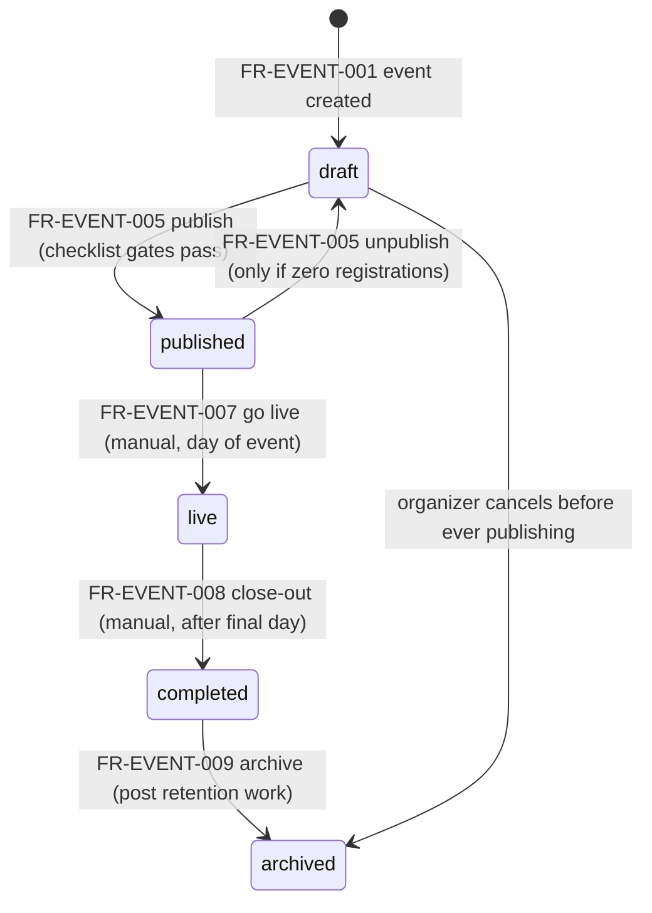
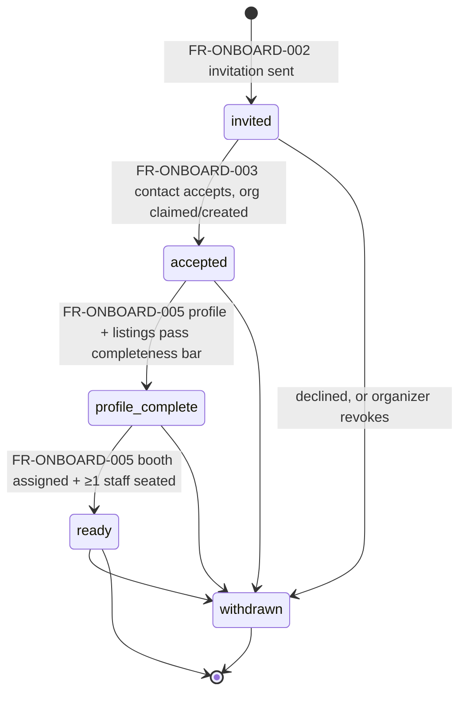
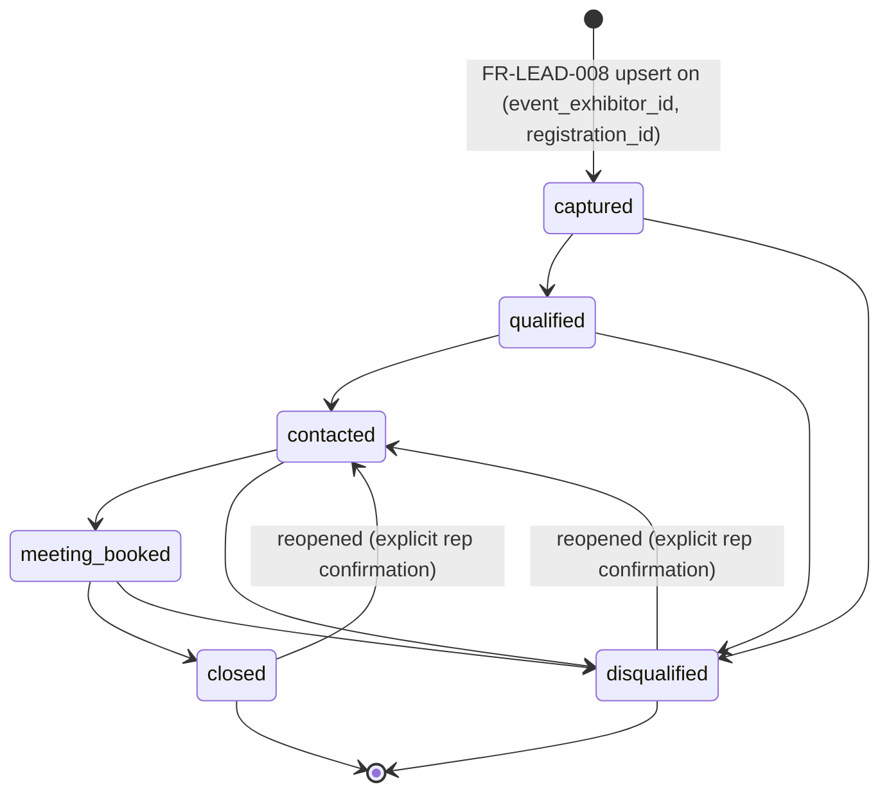
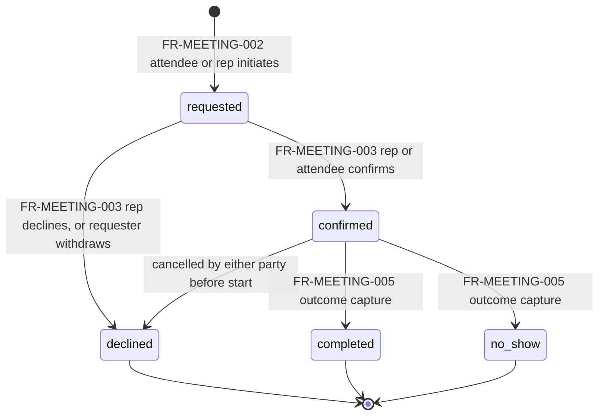
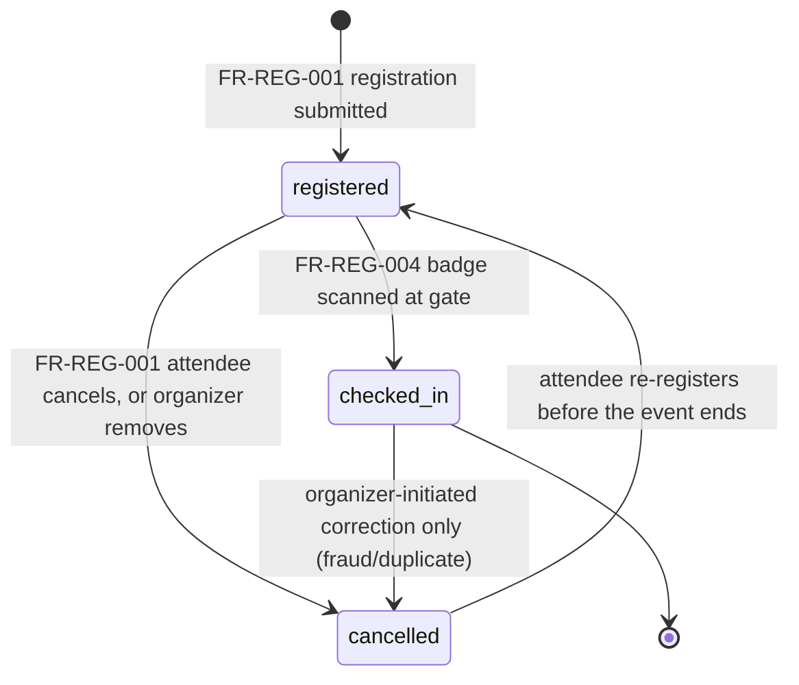

# Functional Requirements

This document gives every row of [08-feature-matrix.md](08-feature-matrix.md) §4.1–4.19 a testable requirement: a stable `FR-<MODULE>-<NNN>` id, the preconditions and inputs that must hold before the system acts, the exact system behavior, the resulting postcondition or state transition, and the error/edge cases a builder must handle — with machine-readable error codes forward-referenced by name to [41-error-code-registry.md](41-error-code-registry.md), which owns the HTTP status mapping. It does **not** own: feature gating/entitlement grants (that inventory is [08-feature-matrix.md](08-feature-matrix.md) §3), performance/scale numbers (`NFR-*` ids in [10-non-functional-requirements.md](10-non-functional-requirements.md)), column-level schema ([16-database-schema.md](16-database-schema.md)), the role→permission matrix ([28-permission-model.md](28-permission-model.md)), or persona-level narrative flow (that is [05-organizer-journey.md](05-organizer-journey.md), [06-exhibitor-journey.md](06-exhibitor-journey.md), [07-attendee-journey.md](07-attendee-journey.md)) — this document distills those journeys into the precise, state-machine-level contract an engineer implements against. All entity, role, tier, persona, and vocabulary use is canonical per [00-foundation.md](00-foundation.md).

## 1. Purpose & Scope

Every feature-matrix row gets at least one FR. Rows whose behavior is fully described by a shared state machine (event lifecycle, exhibitor onboarding, lead pipeline, meeting lifecycle, registration status) cite §3 rather than re-deriving transitions inline, per the "one source of truth" product principle (foundation §1). Some feature-matrix cells that already forward-reference a specific FR id (`entitlement:matchmaking_priority` → FR-MATCH-005; gating rule 2 → FR-BILL-005/006, both in [08-feature-matrix.md](08-feature-matrix.md)) are honored exactly at those ids below — this document is the target those citations resolve to, not a re-negotiation of them.

## 2. How to Read This Document

**ID format:** `FR-<MODULE>-<NNN>`, zero-padded three digits, monotonic within a module, never renumbered once assigned (a superseded FR is marked "superseded by" rather than reused). Module tokens map 1:1 to feature-matrix sections:

| Module token | Feature-matrix section | Here |
|---|---|---|
| AUTH | 4.1 Identity & Organizations | §4.1 |
| EVENT | 4.2 Event Setup | §4.2 |
| FLOOR | 4.3 Floor & Booths | §4.3 |
| ONBOARD | 4.4 Exhibitor Onboarding | §4.4 |
| CATALOG | 4.5 Catalog | §4.5 |
| REG | 4.6 Registration & Badging | §4.6 |
| AGENDA | 4.7 Agenda | §4.7 |
| LEAD | 4.8 Lead Capture | §4.8 |
| MEETING | 4.9 Meetings | §4.9 |
| MATCH | 4.10 Smart Matchmaking | §4.10 |
| COPILOT | 4.11 Expo Copilot & Knowledge Base | §4.11 |
| LEADINTEL | 4.12 Lead Intelligence | §4.12 |
| FOLLOWUP | 4.13 Follow-up Studio | §4.13 |
| PULSE | 4.14 Organizer Pulse | §4.14 |
| ANALYTICS | 4.15 Analytics | §4.15 |
| NOTIF | 4.16 Notifications | §4.16 |
| BILL | 4.17 Billing & Entitlements | §4.17 |
| API | 4.18 Public API & Webhooks | §4.18 |
| ADMIN | 4.19 Platform Admin | §4.19 |

**Table columns** (identical in every module table): **FR ID | Feature-matrix row | Preconditions & Inputs | Behavior & Postcondition | Errors & Edge Cases**. "Behavior & Postcondition" always states the state transition or write in domain-event terms (`noun.verb_past`, foundation §11) where one applies. "Errors & Edge Cases" cites the stable `code` from [41-error-code-registry.md](41-error-code-registry.md) in backticks; a code appearing here for the first time is this document's contribution to that registry, not a deviation from it. Rows beyond a 1:1 mapping to a matrix ID exist where one feature has two independently testable behaviors (e.g., a boost and its cap) — the matrix ID is repeated in the second column so traceability holds either way.

**Universal preconditions**, true of every FR below unless overridden: the caller is authenticated (`code: unauthenticated` otherwise) per [19-authentication-strategy.md](19-authentication-strategy.md); the caller holds the stated permission string and, where noted, entitlement key (`code: permission_denied` / `entitlement_required`, per [28-permission-model.md](28-permission-model.md)); path-derived tenant scope has been resolved and RLS session variables set (foundation §8); the request body passes its Zod schema (`code: validation_failed`). These are not repeated per row — §5 owns the cross-cutting mechanics.

## 3. Core State Machines

These five state machines recur across most other documents; they are specified once here and cited by id everywhere else. Every listed transition is the only way its `status` column changes — no code path mutates these fields outside the transition it names, and every illegal transition attempt returns `422 invalid_transition`.

### 3.1 Event Lifecycle (`events.status`)

| Transition | Actor / trigger | Guard | Postcondition |
|---|---|---|---|
| `[*] → draft` | Priya completes O-2 wizard step 4 | `entitlement:events_limit` not exceeded for the org's active (non-archived) event count | `events` row created; `event.created` emitted; visible only inside the org |
| `draft → published` | Priya/Marcus (`event:admin`), explicit "Publish" | Hard gates: active organizer plan entitlement resolved, dates/timezone set, registration configured, event page content present ([05-organizer-journey.md](05-organizer-journey.md) O-6); floor plan/agenda are warnings only | Public page `/e/[eventSlug]` and registration open; `event.published` emitted |
| `published → draft` | `event:admin` | Zero `registrations` rows exist for this event | Public page/registration taken down; reversible only in this direction |
| `published → published` (registration close, no status change) | `event:admin` | ≥1 registration exists, so `published → draft` is unavailable | `registration_open` flag flips false; public page shows "registration closed", event stays live-eligible |
| `published → live` | Priya or Marcus, manual confirm (system prompts at event start time, never auto-flips) | Event status is `published` | Live-day dashboards ([05-organizer-journey.md](05-organizer-journey.md) O-8) activate; `event.went_live` emitted |
| `live → completed` | Priya, manual, after final day | Event status is `live` | Metric windows finalize; ROI report generation unlocks (O-9); `event.completed` emitted, fanning out to Follow-up Studio (§4.13) |
| `completed → archived` | Priya, any time after close-out work is done | Event status is `completed` | Event becomes read-only; excluded from active dashboards; retained per [38-data-retention-privacy-compliance.md](38-data-retention-privacy-compliance.md) |
| `draft → archived` | `event:admin`, explicit cancel | Event never reached `published` | Soft-cancel; no public exposure ever occurred, so no notification fan-out is needed |

Editing `starts_at`/`ends_at` on a `published`+ event requires typed confirmation, notifies all `accepted`+ exhibitors and `registered`+ attendees, and writes to `audit_logs` (O-2 edge case) — this is a field update, not a status transition, and is exempt from `invalid_transition` handling.

### 3.2 Event Exhibitor Onboarding Funnel (`event_exhibitors.status`)

This is a strict superset of the diagram in [05-organizer-journey.md](05-organizer-journey.md) O-4 (which shows the happy path only); this document is the transition authority. `withdrawn` is reachable from every non-terminal state because withdrawal is a real-world event ("we're pulling out") that can happen at any point in setup, not only before acceptance. `withdrawn → ready` never exists — a withdrawn exhibitor that returns re-enters via a fresh invitation (`invited`), never a resurrection of the old row, so historical funnel analytics stay honest.

| Transition | Guard | Postcondition |
|---|---|---|
| `invited → accepted` | Invite token valid and unexpired; org claimed-or-created (foundation §8 tenancy) | `organization_memberships`/`exhibitor_staff` row created for the claiming user as `exhibitor:admin`; `event_exhibitor.accepted` emitted |
| `accepted → profile_complete` | Profile required fields present AND ≥1 `event_product_listings` row | `event_exhibitor.profile_completed` emitted; exhibitor becomes eligible for KB ingestion (§4.11) |
| `profile_complete → ready` | Booth assigned (`booth_id` set) AND ≥1 active `exhibitor_staff` seat | Exhibitor is bookable/matchable/citable; readiness checklist (D6) shows 100% |
| `* → withdrawn` | Exhibitor or organizer explicit action | Booth (if any) returns to inventory; `exhibitor_staff` seats deactivated; `match_recommendations` involving this exhibitor retracted; attendees who saved the exhibitor notified; `leads` already captured are untouched (tenancy — foundation §8) |

### 3.3 Lead Pipeline (`leads.stage`)

Decision, stated once here to close an otherwise-open question: **reopening a terminal lead always lands on `contacted`**, never back on `qualified` or `captured` — a reopen is triggered by a fresh, real interaction (re-scan, new note, new meeting request), and `contacted` is the honest description of "we are talking again," never an automatic re-promotion of qualification the rep has not re-affirmed. Reopening requires an explicit "reopen this lead?" confirmation in the capture/triage UI and emits `lead.reopened` — it is never silent (foundation principle 2, "intelligence over records": a resurrected lead without a clear reason is a record, not intelligence).

A `booth_visit` is not itself a pipeline stage — it is the raw signal (foundation §12) that triggers the upsert into `captured` via the composite key `(event_exhibitor_id, registration_id)`. Full re-scan/conflict semantics (multi-rep attribution, duplicate-`badge_code` races, cross-device idempotency) are specified in [06-exhibitor-journey.md](06-exhibitor-journey.md) §EX-6.4 and summarized as error/edge cases in FR-LEAD-003 below.

### 3.4 Meeting Lifecycle (`meetings.status`)

Decision: Concourse's meeting status enum is exactly `requested | confirmed | completed | declined | no_show` (foundation-consistent, no sixth "cancelled" value). A confirmed meeting called off before it happens is modeled as `confirmed → declined` — "declined" reads correctly for both "never agreed to" and "agreed, then called off," and adding a distinct `cancelled` value would fork one real-world event into two DB representations for no query benefit. Whichever party cancels is recorded on the emitted `meeting.declined` domain event's actor field, not in the status value itself.

### 3.5 Registration Status (`registrations.status`)

Decision on waitlisting (F8): the canonical `registrations.status` enum (foundation §7) is exactly `registered | checked_in | cancelled` — no fourth `waitlisted` value. A capacity-exceeded submission is therefore never written as a `registrations` row at all; it is held in a Redis-backed FIFO queue keyed by `event_id` (mirroring the idempotency-store pattern in [18-api-architecture.md](18-api-architecture.md) §3.6) until a slot frees (cancellation or cap increase), at which point a `registrations` row is created directly in `registered` — there is no intermediate status to promote *from*. This keeps the state machine exactly as locked in foundation §7 while still delivering F8 in full; detail in FR-REG-008.

Decision on re-registration: `(user_id, event_id)` is unique, so a `cancelled` registration is reactivated in place (`cancelled → registered`) rather than spawning a duplicate row — this is why `cancelled` is not drawn as a terminal state above.

## 4. Functional Requirements by Module

### 4.1 Identity & Organizations (AUTH)

| FR ID | Row | Preconditions & Inputs | Behavior & Postcondition | Errors & Edge Cases |
|---|---|---|---|---|
| FR-AUTH-001 | A1 | Unauthenticated. Input: email, password | Supabase Auth (`signUp`/`signInWithPassword`) verifies our password policy hook, hashes/stores the credential internally, and issues a JWT session; a mirrored `auth_sessions` row is written via the `auth.sessions` trigger ([20-session-strategy.md](20-session-strategy.md) §3) | `validation_failed` (weak password); `unauthenticated` (bad credentials — generic message, no account-exists leak); `rate_limited` after repeated failures (per-IP bucket, [18-api-architecture.md](18-api-architecture.md) §3.8) |
| FR-AUTH-002 | A2 | Unauthenticated. Input: OAuth provider code (Google/Microsoft/LinkedIn) | Exchanges code, upserts `users` by verified provider email, issues session; if invite context present, also creates the pending `organization_memberships`/`exhibitor_staff` row | `oauth_denied` (user cancelled at provider); `account_conflict` (existing password account, same email, different provider — routes to account-linking, never silent merge) |
| FR-AUTH-003 | A3 | Sofia only. Input: email | Emails single-use, short-TTL signed link; click issues session, upserts `users` if first time | `magic_link_expired`; `magic_link_already_used` |
| FR-AUTH-004 | A4 | Authenticated session | WebAuthn ceremony registers a platform/roaming credential; login offers it as an alternative factor | `passkey_registration_failed`; `unsupported_authenticator` (graceful fallback to password/OAuth, never a dead end) |
| FR-AUTH-005 | A5 | Authenticated, email verified. Input: org name, slug, `kind` | Creates `organizations` row + `organization_memberships` (`org:owner`) | `duplicate_resource` on slug collision — response includes a suggested `{slug}-events` alternative, never a silent auto-suffix (O-1); `validation_failed` |
| FR-AUTH-006 | A6 | `memberships:invite`. Input: email, role (`owner\|admin\|member`) | Creates expiring invite token, emails it | `invite_already_pending` (same email, same org); `validation_failed` (invalid role for org kind) |
| FR-AUTH-007 | A7 | Authenticated | Lists caller's `auth_sessions`; revoke invalidates that Supabase session immediately (service-role sign-out, [20-session-strategy.md](20-session-strategy.md) §6) | `not_found`; `permission_denied` (revoking another user's session without `platform:admin`) |
| FR-AUTH-008 | A8 | `entitlement:sso_saml` (`enterprise`). Input: SAML IdP assertion | Supabase Auth's native SSO validates the assertion (`signInWithSSO`), session issued, JIT-provisions `organization_memberships` per IdP group mapping | `entitlement_required`; `sso_assertion_invalid` |
| FR-AUTH-009 | A9 | Authenticated | Update name/avatar/locale immediately; email change requires re-verification of the new address before it takes effect | `validation_failed`; `email_verification_required` (old email stays authoritative until confirmed) |
| FR-AUTH-010 | A10 | Authenticated. Input: deletion confirmation | Enqueues DSAR erasure job ([38-data-retention-privacy-compliance.md](38-data-retention-privacy-compliance.md)); anonymizes `users` row, revokes all sessions, preserves `audit_logs`/`leads` per tenant/legal retention obligations | `deletion_blocked_sole_owner` (must transfer `org:owner` first) |

### 4.2 Event Setup (EVENT)

| FR ID | Row | Preconditions & Inputs | Behavior & Postcondition | Errors & Edge Cases |
|---|---|---|---|---|
| FR-EVENT-001 | B1 (create) | `events:create` (`org:owner`/`org:admin` — org-wide, since no `event:admin` grant can exist before the event does, [28-permission-model.md](28-permission-model.md) §3.2). Input: name, slug, dates, timezone, attendance band, industry category | Creates `events` row in `draft` — see §3.1; creator is not automatically `event:admin` — staffing happens in wizard step 3 (FR-EVENT-003) | `entitlement_required` (`events_limit` exhausted); `duplicate_resource` (slug not globally unique) |
| FR-EVENT-002 | B2 | `event:admin`. Input: logo, colors, hero image, description | Writes branding fields; renders `/e/[eventSlug]` public page once `published`+ | `validation_failed` (image size/type); pre-publish, page is preview-only to org members |
| FR-EVENT-003 | B3 | `event_staff:manage` (`org:owner`/`org:admin`, or `event:admin` on their own event, [28-permission-model.md](28-permission-model.md) §3.2). Input: user, role (`event:admin`\|`event:staff`) | Creates `event_staff` row | `permission_denied`; `not_found` (user not an org member) |
| FR-EVENT-004 | B4 | `event:admin`. Input: timezone, dates, venue link, feature toggles | Updates event config; date edits on `published`+ trigger the §3.1 notify-and-audit path | `stale_resource` (`If-Match` required — contended resource, [18-api-architecture.md](18-api-architecture.md) §3.7); `invalid_transition` if attempting a status change through this endpoint (status changes are FR-EVENT-005/007/008/009 only) |
| FR-EVENT-005 | B1 (lifecycle) | See §3.1 guards | `draft⇄published` transitions exactly as specified in §3.1 | `checklist_incomplete` (publish gate unmet); `unpublish_blocked` (registrations exist — offers "close registration" instead) |
| FR-EVENT-006 | B5 | `entitlement:events_limit` headroom. Input: source event | Clones venue, floor plan, booth layout, agenda structure (tracks/rooms, not dated sessions), registration config, exhibitor list into a new `draft` event; leads/visits/registrations never copy (O-10) | `entitlement_required` |
| FR-EVENT-007 | B1 (go live) | See §3.1 | `published → live`, manual confirm only | `invalid_transition` (not currently `published`) |
| FR-EVENT-008 | B1 (close-out) | See §3.1 | `live → completed`; finalizes metric windows, unlocks ROI reports and Follow-up Studio | `invalid_transition` |
| FR-EVENT-009 | B1 (archive) | See §3.1 | `completed → archived`; read-only thereafter | `invalid_transition` |

### 4.3 Floor & Booths (FLOOR)

| FR ID | Row | Preconditions & Inputs | Behavior & Postcondition | Errors & Edge Cases |
|---|---|---|---|---|
| FR-FLOOR-001 | C1 | `event:staff`+. Input: PDF/PNG/SVG per hall | Presigned S3 upload ([26-file-storage.md](26-file-storage.md)) → `floor_plans` row; two-point calibration stores real-distance scale | `validation_failed` (unsupported file type); replacing an underlay never deletes `booths` — it enters re-anchor review (O-3) |
| FR-FLOOR-002 | C2 | `event:staff`+. Input: polygon/rectangle geometry, number, size class | Creates/updates `booths` rows; bulk grid-stamp and CSV import supported | `booth_number_conflict` (duplicate within hall); deleting an assigned booth is blocked until reassigned or explicitly unassigned — `withdrawal_blocked` |
| FR-FLOOR-003 | C3 | `event:staff`+. Input: booth id, `event_exhibitor` id | Sets `booths.event_exhibitor_id`; on a `published` event, notifies the exhibitor and any attendees who saved them, and audit-logs the change | `stale_resource` (`If-Match` required, contended resource); `booth_already_assigned` |
| FR-FLOOR-004 | C4 | Sofia, `published`+ event | Renders pan/zoom map from `floor_plans` + `booths`, live-highlighting saved/booked booths | `not_found` (no floor plan uploaded — map view degrades to directory list, never a blank screen) |
| FR-FLOOR-005 | C5 | Sofia | Directory entry deep-links into the map centered on that booth's coordinates | `not_found` (booth has no floor-plan placement yet — falls back to hall/section text) |

### 4.4 Exhibitor Onboarding (ONBOARD)

| FR ID | Row | Preconditions & Inputs | Behavior & Postcondition | Errors & Edge Cases |
|---|---|---|---|---|
| FR-ONBOARD-001 | D1 | `event:staff`+. Input: CSV or single row (company, contact, email, intended booth, optional tier) | Validates/maps CSV with a preview; bad rows quarantined (never dropped silently) | `validation_failed` (per-row, returned as a quarantine list, not a single 422 for the whole batch) |
| FR-ONBOARD-002 | D1/D2 | Valid `event_exhibitors` row in `invited` | Sends `event_exhibitor.invited` email with scoped, expiring token | `invite_expired`; `invite_revoked` (old link shows a clean revoked-invitation page, never a raw 404) |
| FR-ONBOARD-003 | D2 | Valid unexpired invite token. Input: auth method | Domain-match check: matching verified domain → "request to join" (approved instantly if invited by name, else by `org:owner`/`admin`); no match → new `organizations` row (`kind: exhibitor`) | See §3.2 `invited → accepted`; `already_claimed` (race between two claimants on the same domain is resolved to "request to join" the just-created org, never a duplicate org — [06-exhibitor-journey.md](06-exhibitor-journey.md) EX-1) |
| FR-ONBOARD-004 | D3 | `exhibitor:admin` or `event:staff`+ | Updates `event_exhibitors` tier/status/booth; Priya/Marcus may edit contact email or reissue invites but never the exhibitor's own profile content (tenancy, foundation §8) | `permission_denied` (organizer attempting to edit profile content) |
| FR-ONBOARD-005 | D4 | `exhibitor:admin`. Input: logo, description, categories, links | Updates profile; feeds attendee directory, matchmaking, and (via listings) KB ingestion; drives §3.2 `accepted → profile_complete → ready` | `validation_failed`; flagged-but-live under D7 moderation |
| FR-ONBOARD-006 | D5 | `exhibitor:admin`. Input: rep email, role | Creates `exhibitor_staff`, checked against `entitlement:staff_seats` | `entitlement_required` shown as an inline upgrade prompt, not a block — pending invite is saved and auto-sends on upgrade ([06-exhibitor-journey.md](06-exhibitor-journey.md) EX-3) |
| FR-ONBOARD-007 | D6 | Any `event_exhibitors` row | Computes one completeness score (profile fields + listing count + booth + staff seated) shown identically to Elena and Priya/Marcus | No error path — a pure read; never two disagreeing numbers |
| FR-ONBOARD-008 | D7 | `event:staff`+. Input: flag reason | Marks profile content `under_review`; content stays live with a private badge visible only to the exhibitor | `not_found`; never silently unpublishes (JP-3) |

### 4.5 Catalog (CATALOG)

| FR ID | Row | Preconditions & Inputs | Behavior & Postcondition | Errors & Edge Cases |
|---|---|---|---|---|
| FR-CATALOG-001 | E1 | `exhibitor:admin`. Input: name, description, category, media | Org-scoped `products` CRUD, reusable across every event the org exhibits at | `validation_failed` |
| FR-CATALOG-002 | E2 | `exhibitor:admin`. Input: product ids for this event | Creates `event_product_listings` rows; ≥1 required to reach `profile_complete` (§3.2) | `entitlement_required` (none — all tiers); `validation_failed` (product not owned by this org) |
| FR-CATALOG-003 | E3 | `exhibitor:admin`/`rep`. Input: image/PDF | Presigned S3 upload, AV-scanned ([26-file-storage.md](26-file-storage.md)); listing saves without the asset if scanning fails, with inline retry | `file_scan_failed` (retryable, never a silent drop) |
| FR-CATALOG-004 | E4 | Sofia, `published`+ event | Browses/searches exhibitors + products, category filters (Postgres trigram/`tsvector`, [11-information-architecture.md](11-information-architecture.md) §6) | Empty state, never an error, when a filter matches nothing |
| FR-CATALOG-005 | E5 | Sofia, registered | Saves booth/product to a personal bookmark list | `not_found` (booth/product no longer listed — bookmark stays with a "no longer exhibiting" notice, not silently removed) |

### 4.6 Registration & Badging (REG)

| FR ID | Row | Preconditions & Inputs | Behavior & Postcondition | Errors & Edge Cases |
|---|---|---|---|---|
| FR-REG-001 | F1 | Event `published`+, `registration_open` true. Input: profile answers | Creates `registrations` row (`registered`) — see §3.5; interest-bearing answers write `attendee_interests` | `capacity_exceeded` → routed to FR-REG-008 waitlist queue, not an error page; `validation_failed` |
| FR-REG-002 | F2 | `event:admin`. Input: field definitions, consent text | Configures custom fields + the standard badge-scan consent disclosure; organizers may append, never weaken, the platform-standard text ([05-organizer-journey.md](05-organizer-journey.md) O-6) | `validation_failed` (attempt to remove standard consent clauses) |
| FR-REG-003 | F3 | `registered`+ | Issues a rotating QR `badge_code` (opaque, no PII, foundation §12) | Badge rotation never invalidates an already-checked-in state |
| FR-REG-004 | F4 | `event:staff`, `live` event | Staff device scans `badge_code` → `registered → checked_in`; offline-tolerant, first check-in wins, later duplicates collapse silently | `invalid_transition` (badge belongs to a `cancelled` registration — staff sees "cancelled registration" and a manual-lookup fallback) |
| FR-REG-005 | F5 | Public kiosk or staff device, event `live` or `published` | Runs the same `/e/[eventSlug]/register` flow, then immediately performs FR-REG-004 in the same transaction (`registered` then `checked_in` back-to-back) | Same as FR-REG-001/004 combined |
| FR-REG-006 | F6 | `checked_in` or `registered` | Renders a PDF badge for on-site printing | `not_found` |
| FR-REG-007 | F7 | `event:staff`. Input: approval mode `manual` | Registrations enter a review queue before `registered` is finalized; approved → `registered`, rejected → the row is never created (no `rejected` status is added — an unresolved registration attempt simply never materializes) | `validation_failed` |
| FR-REG-008 | F8 | Event `published`+, capacity cap set | Over-cap submissions enter the §3.5 Redis FIFO waitlist queue keyed by `event_id`; on a cancellation or cap increase, the front of the queue is promoted directly into `registered` and notified | `capacity_exceeded` (queue also full, if a queue depth cap is configured) |
| FR-REG-009 | F9 | `registered`+, Apple/Google Wallet capable device | Generates a wallet pass mirroring the badge QR | `not_found` |

### 4.7 Agenda (AGENDA)

| FR ID | Row | Preconditions & Inputs | Behavior & Postcondition | Errors & Edge Cases |
|---|---|---|---|---|
| FR-AGENDA-001 | G1 | `event:staff`. Input: track, room, speakers, times, capacity | Creates `agenda_sessions`; CSV import supported; overlapping room/time blocks save with a precise conflict error | `agenda_conflict` (same room, overlapping time — save blocked, not silently allowed) |
| FR-AGENDA-002 | G2 | Sofia, registered | Browses agenda, saves sessions to personal schedule | `not_found` |
| FR-AGENDA-003 | G3 | `event:staff` or Sofia (self-scan) | Door QR scan writes `session_checkins` | `capacity_exceeded` (soft — records the check-in, surfaces an over-capacity alert to staff rather than blocking entry) |
| FR-AGENDA-004 | G4 | `event:staff`. Input: bio, photo | Attaches speaker profile to one or more `agenda_sessions` | `validation_failed` |
| FR-AGENDA-005 | G5 | Sofia | Client-side computation flags time-overlaps in her saved schedule and near-full sessions | Purely advisory — never blocks saving a conflicting session; edits on a `live` event propagate to precached agendas on next sync with a staleness banner in the interim ([05-organizer-journey.md](05-organizer-journey.md) O-5) |

### 4.8 Lead Capture (LEAD)

| FR ID | Row | Preconditions & Inputs | Behavior & Postcondition | Errors & Edge Cases |
|---|---|---|---|---|
| FR-LEAD-001 | H1 | `exhibitor:rep`+, `event_exhibitors.status = ready`. Input: scanned `badge_code` | Writes to local queue first (§4.8 always via FR-LEAD-002), then syncs; sub-second local confirm | `consent_required` (below, FR-LEAD-004) |
| FR-LEAD-002 | H2 | Same as above, network optional | Every capture writes `PendingCapture` to IndexedDB (`client_capture_id` = on-device UUIDv7) before any network call — the queue is the only write path, online or offline ([06-exhibitor-journey.md](06-exhibitor-journey.md) §EX-6.1); background sync flushes in bounded, ordered batches on connectivity restoration | `idempotency_conflict` if a retried sync carries the same `client_capture_id` with a different body hash; permanent failures (e.g., malformed payload) surface as one actionable item, never a silent drop |
| FR-LEAD-003 | H3 | Existing lead may already exist for `(event_exhibitor_id, registration_id)` | Upsert appends a new `booth_visits` row + `lead_notes`; never creates a second lead for the same attendee/exhibitor pair — see §3.3 and the full conflict table in [06-exhibitor-journey.md](06-exhibitor-journey.md) §EX-6.4 | `invalid_transition` only on an explicit stage-change attempt that skips required stages; re-scans themselves never error |
| FR-LEAD-004 | H4 | Scan attempted, no consent record for this `registration_id` at this event | Capture is blocked before any `leads`/`booth_visits` write | `consent_required` — UI explains the badge must be re-presented after the attendee accepts the disclosure |
| FR-LEAD-005 | H5 | `exhibitor:admin` configures; `exhibitor:rep` answers | Custom qualifier questions render on the capture screen; answers stored on `PendingCapture.qualifierAnswers` and synced with the visit | `validation_failed` (required qualifier left blank, per exhibitor config) |
| FR-LEAD-006 | H7 | `exhibitor:rep`, `entitlement:lead_intelligence` | Records ≤ voice-note length cap locally, uploads after text/qualifiers sync, enqueues async transcription (`lead-voice-transcription` queue); transcript lands as a `lead_notes` row (`source: voice`) | `entitlement_required` (essentials/growth without the key sees text notes only, never a broken recorder) |
| FR-LEAD-007 | H6 | `exhibitor:rep`/`admin` | Text note attached to a lead at any pipeline stage | `not_found` |
| FR-LEAD-008 | H8 | `exhibitor:rep`/`admin` | Advances/reassigns `leads.stage` and `assigned_staff_id` per §3.3 | `invalid_transition`; `permission_denied` (rep reassigning outside their own captures without `exhibitor:admin`) |
| FR-LEAD-009 | H9 | Sofia, registered, self-scans a booth QR poster | Shares her own contact/consent into the same upsert path as FR-LEAD-003, with `source: attendee_self_scan` | `consent_required` if she has not accepted the disclosure yet — prompted inline |
| FR-LEAD-010 | H10 | `exhibitor:admin`. Input: candidate pair | Fuzzy-match queue (name + email + company) surfaces duplicates across different `registration_id`s; merge combines notes/visits/score history onto the survivor, archives the loser with a pointer; auto-merge is never offered — a human always confirms | `merge_conflict` (candidate pair already merged/dismissed by another admin — resolved by re-fetch) |
| FR-LEAD-011 | H11 | `exhibitor:admin`/`rep`, `entitlement:lead_export` | Async CSV/XLSX export job; essentials tier sees leads in-portal only | `entitlement_required` (upgrade prompt, not a 404, per gating rule 2) |
| FR-LEAD-012 | H12 | `exhibitor:admin`, `entitlement:crm_sync` | Connector framework (Salesforce/HubSpot first) syncs leads on demand or schedule per field mapping configured once at the org level | `entitlement_required`; connector-specific failures owned by [35-integrations-and-connectors.md](35-integrations-and-connectors.md) |
| FR-LEAD-013 | H13 | Sofia, registered | Read-only view of which exhibitors hold a lead record on her, consent-respecting | `not_found` |

### 4.9 Meetings (MEETING)

| FR ID | Row | Preconditions & Inputs | Behavior & Postcondition | Errors & Edge Cases |
|---|---|---|---|---|
| FR-MEETING-001 | I1 | `exhibitor:admin`, `entitlement:meeting_scheduling`. Input: slot templates per staff member | Publishes bookable slots to the exhibitor's public profile | `entitlement_required` |
| FR-MEETING-002 | I2 | Sofia or `exhibitor:rep`, exhibitor holds `entitlement:meeting_scheduling` (attendees always book free wherever the exhibitor has the key — footnote, [08-feature-matrix.md](08-feature-matrix.md) §4.9) | Creates `meetings` row in `requested` — see §3.4 | `slot_unavailable` (already booked by another party — re-fetch and retry) |
| FR-MEETING-003 | I3 | `exhibitor:rep`/`admin` for confirm/decline; either party for cancel | `requested → confirmed`, `requested → declined`, or `confirmed → declined` per §3.4 | `invalid_transition` |
| FR-MEETING-004 | I4 | `confirmed` meeting | `.ics` attachment generated; push/email reminders scheduled through the notification service | `not_found` |
| FR-MEETING-005 | I5 | `confirmed` meeting, slot time has passed. Input: outcome | `confirmed → completed` (also advances the lead to `closed` on a good outcome) or `confirmed → no_show`, per §3.4 | `invalid_transition` (outcome capture attempted before the slot time) |

### 4.10 Smart Matchmaking (MATCH)

| FR ID | Row | Preconditions & Inputs | Behavior & Postcondition | Errors & Edge Cases |
|---|---|---|---|---|
| FR-MATCH-001 | J1 | Sofia, registered | Declared interests at registration merge with behavior-inferred interests into `attendee_interests` | `validation_failed` |
| FR-MATCH-002 | J2 | Sofia, `entitlement:matchmaking` (organizer plan) | Scored exhibitor recommendations with reasons always shown, from `match_recommendations` | `entitlement_required` → deterministic category browse fallback, never a blank panel ([21-ai-architecture.md](21-ai-architecture.md) §8.3) |
| FR-MATCH-003 | J3 | Elena, `entitlement:matchmaking` (organizer plan) | Recommended-attendee prospect list for outreach, visible to all exhibitor tiers | `entitlement_required` |
| FR-MATCH-004 | J4 | Elena, `entitlement:matchmaking` (organizer) + `entitlement:matchmaking_priority` (exhibitor, `intelligence`) | `intelligence`-tier exhibitors receive a ranking boost in both the attendee-facing list (J2) and their own prospect list (J3) | `entitlement_required` (either gate missing — both are evaluated independently, gating rule 1, [08-feature-matrix.md](08-feature-matrix.md) §5) |
| FR-MATCH-005 | J4 | Same as FR-MATCH-004 | **Cap enforcement:** the boost may not displace more than 40% of any single attendee's top-10 recommendation slots, and never displaces a deterministically higher-scored non-priority match below position 10 — this is the exact behavior [08-feature-matrix.md](08-feature-matrix.md) §3 cites as "capped." Cap value and fairness algorithm tuning live in [24-matchmaking-and-scoring.md](24-matchmaking-and-scoring.md) | Cap violation is a scoring-service invariant (caught in CI golden-set tests, [24-matchmaking-and-scoring.md](24-matchmaking-and-scoring.md)), not a runtime user-facing error |
| FR-MATCH-006 | J5 | Sofia, `entitlement:matchmaking` | Save/dismiss on a recommendation writes feedback that feeds future scoring runs | `not_found` |

### 4.11 Expo Copilot & Knowledge Base (COPILOT)

| FR ID | Row | Preconditions & Inputs | Behavior & Postcondition | Errors & Edge Cases |
|---|---|---|---|---|
| FR-COPILOT-001 | K1 | Any `kb_sources` row created/updated | Worker pipeline: `kb_sources → kb_documents → kb_chunks` with embedding (Voyage `voyage-3.5`), tenant/visibility metadata attached at chunk level | `ingestion_failed` (retried per [27-background-jobs-architecture.md](27-background-jobs-architecture.md)); documents failing the injection/abuse classifier enter `quarantined`, never indexed |
| FR-COPILOT-002 | K2 | Sofia, `entitlement:expo_copilot` (all plans), within per-registration quota | Streaming, RAG-grounded, cited answer over tenant/visibility-filtered retrieval | `quota_exceeded` (30/hr, 200/day); `ai_unavailable` → deterministic search/browse fallback with notice ([21-ai-architecture.md](21-ai-architecture.md) §8.1) |
| FR-COPILOT-003 | K3 | Answer contains a resolvable citation to a booth/booking | One-tap save-booth or open-booking directly from the answer | `not_found` (cited entity no longer live — answer stays, action disabled) |
| FR-COPILOT-004 | K4 | Marcus, `entitlement:expo_copilot`. Input: doc/URL | Registers a `kb_sources` row feeding FR-COPILOT-001 | `validation_failed` (unsupported URL/doc type) |
| FR-COPILOT-005 | K5 | Any `event_exhibitors` reaching `profile_complete` | Profile, listings, and uploaded docs auto-enqueue into FR-COPILOT-001, high-priority for late (T−3d) exhibitors | No error path — a background trigger, not a user action |
| FR-COPILOT-006 | K6 | Sofia, answer already delivered | Thumbs up/down + report reason feeds the eval suite ([21-ai-architecture.md](21-ai-architecture.md) §5) | `not_found` |

### 4.12 Lead Intelligence (LEADINTEL)

| FR ID | Row | Preconditions & Inputs | Behavior & Postcondition | Errors & Edge Cases |
|---|---|---|---|---|
| FR-LEADINTEL-001 | L1 | `entitlement:lead_intelligence` | 0–100 score with reason codes computed on new/updated interaction signal | `entitlement_required` → rule-only score + raw timeline (deterministic fallback) |
| FR-LEADINTEL-002 | L2 | `entitlement:lead_intelligence` | AI-written narrative summary grounded in visits/notes/meetings for that lead only (tenant-isolated retrieval, [21-ai-architecture.md](21-ai-architecture.md) §7) | `ai_unavailable`/budget-exceeded → summary panel hidden, raw timeline shown |
| FR-LEADINTEL-003 | L3 | `entitlement:lead_intelligence` | Firmographic enrichment via a pluggable provider, attached to the lead | `enrichment_unavailable` (provider outage — lead unaffected, retried async) |
| FR-LEADINTEL-004 | L4 | `entitlement:lead_intelligence`, score crosses configured threshold | Push alert to the assigned rep | `not_found` (rep device unregistered for push — falls back to in-app notification center, P3) |

### 4.13 Follow-up Studio (FOLLOWUP)

| FR ID | Row | Preconditions & Inputs | Behavior & Postcondition | Errors & Edge Cases |
|---|---|---|---|---|
| FR-FOLLOWUP-001 | M1 | `entitlement:followup_studio`, `event.completed` fired | Per-lead draft sequence generated (`claude-fable-5`), grounded exclusively in that lead's own visits/notes/meetings; status `pending_review` | `entitlement_required` → CSV export (H11) is the fallback, never a broken AI screen |
| FR-FOLLOWUP-002 | M2 | Elena or delegated rep, draft in `pending_review` | Edits/approves/rejects; **no draft sends without explicit human approval** — this is a hard rule, not a configurable toggle | `stale_resource` (draft edited by two reviewers concurrently — `If-Match`) |
| FR-FOLLOWUP-003 | M3 | Draft `approved` | Sends via SES under the exhibitor's own identity; delivery/open tracking surfaced per lead | `send_failed` (SES bounce/complaint — surfaced per-recipient, never blocks the batch) |
| FR-FOLLOWUP-004 | M4 | `entitlement:followup_studio` + `entitlement:crm_sync` | Pushes approved sequences into the connected CRM's own sequencing tool instead of sending via SES | `entitlement_required` (either key missing) |

### 4.14 Organizer Pulse (PULSE)

| FR ID | Row | Preconditions & Inputs | Behavior & Postcondition | Errors & Edge Cases |
|---|---|---|---|---|
| FR-PULSE-001 | N1 | Priya, `entitlement:organizer_pulse`. Input: NL question | Answer grounded in this event's own metrics only; every answer is also reachable as a standard filterable report (JP-5 deterministic-equivalence rule) | `ai_unavailable` → standard analytics dashboards (§4.15) |
| FR-PULSE-002 | N2 | `entitlement:organizer_pulse`, `live` event | Daily AI insight digest delivered through the notification service | `ai_unavailable` → digest omitted for that day, no stale/fabricated digest sent |
| FR-PULSE-003 | N3 | `entitlement:organizer_pulse` | Under-served-category insight comparing floor categories to attendee interest signals | Same fallback as N1 |

### 4.15 Analytics (ANALYTICS)

| FR ID | Row | Preconditions & Inputs | Behavior & Postcondition | Errors & Edge Cases |
|---|---|---|---|---|
| FR-ANALYTICS-001 | O1 | `event:staff`+ | Registrations, check-ins, scans, top-booths dashboard, aggregation-lag tolerant ("as of {timestamp}" never a spinner) | No hard error path — degrades to last-computed numbers |
| FR-ANALYTICS-002 | O2 | `exhibitor:admin`/`rep` | Near-real-time visits/leads/staff-activity dashboard, all tiers | Same degrade pattern |
| FR-ANALYTICS-003 | O3 | Priya, `entitlement:analytics_suite` | Funnels, segments, scheduled exports | `entitlement_required` |
| FR-ANALYTICS-004 | O4 | Elena, `entitlement:booth_analytics_realtime` (`intelligence`) | Live visit stream over Supabase Realtime, dwell, peak-hour view | `entitlement_required` → falls back to FR-ANALYTICS-002's near-real-time dashboard |
| FR-ANALYTICS-005 | O5 | Elena, `entitlement:competitive_benchmarks` (`intelligence`) | Anonymized category percentile comparison | `entitlement_required` |
| FR-ANALYTICS-006 | O6 | Priya, `entitlement:analytics_suite` | Cross-event portfolio trends for the organizer org | `entitlement_required` |
| FR-ANALYTICS-007 | O7 | Priya, `entitlement:analytics_suite`, event `completed` | Auto-generated organizer wrap-up report | `entitlement_required`; `invalid_transition` (attempted before `completed`) |

### 4.16 Notifications (NOTIF)

| FR ID | Row | Preconditions & Inputs | Behavior & Postcondition | Errors & Edge Cases |
|---|---|---|---|---|
| FR-NOTIF-001 | P1 | Any triggering domain event | Transactional email via SES/React Email through the single notification-service choke point (foundation §6) | `send_failed` (bounce/complaint logged, retried per template policy) |
| FR-NOTIF-002 | P2 | Sofia/Jamal, push permission granted | VAPID web push delivered for PWA-relevant events | `push_unregistered` → falls back to in-app notification center |
| FR-NOTIF-003 | P3 | Any authenticated user | Unified in-app feed per surface | `not_found` |
| FR-NOTIF-004 | P4 | Any authenticated user | Per-category opt-out preferences; one-click unsubscribe link works without login | `already_unsubscribed` (idempotent — treated as success, not an error) |
| FR-NOTIF-005 | P5 | Marcus, `event:staff`+. Input: target segment (all/hall/agenda-session/exhibitor-staff), message | Broadcast dispatched through the notification service; every override is also written to `audit_logs` ([05-organizer-journey.md](05-organizer-journey.md) O-8) | `validation_failed` (empty segment) |

### 4.17 Billing & Entitlements (BILL)

| FR ID | Row | Preconditions & Inputs | Behavior & Postcondition | Errors & Edge Cases |
|---|---|---|---|---|
| FR-BILL-001 | Q1 | Internal — every entitlement-gated request | `plans → subscriptions → entitlements` resolution service, Redis-cached, invalidated on Stripe webhook | `entitlement_resolution_failed` (cache/DB both unavailable — fails closed, treated as entitlement absent, never fails open) |
| FR-BILL-002 | Q2 | Alex, `platform:admin` | Manually grants/overrides plans, tiers, entitlement overrides for support/sales cases | `permission_denied`; every grant is audit-logged ([29-audit-logging-architecture.md](29-audit-logging-architecture.md)) |
| FR-BILL-003 | Q3 | Priya, `org:owner`/`admin` | Stripe Checkout subscription flow for organizer plans (`launch`/`professional`/`enterprise`) | `payment_required` (checkout declined — plan stays on prior tier, no partial activation) |
| FR-BILL-004 | Q4 | Elena, `exhibitor:admin` | In-portal Stripe Checkout upsell, scoped to one `event_exhibitors` record (a tier is purchased per event, not once for the org) | `payment_required`; entitlements resolve on webhook confirmation, same page load, no support ticket ([06-exhibitor-journey.md](06-exhibitor-journey.md) EX-4) |
| FR-BILL-005 | Gating rule 2 (organizer surfaces) | Organizer principal lacks a required organizer-gate entitlement | Feature surface renders with a plan-contact prompt naming the missing key; the underlying route/resource returns normally (never `404`) so the UI can render the locked state | `entitlement_required` is the code on the underlying API call the UI still makes to know what it's missing |
| FR-BILL-006 | Gating rule 2 (exhibitor surfaces) | Exhibitor principal lacks a required exhibitor-gate entitlement | Feature surface renders with an in-context upgrade prompt (never a generic pricing interstitial, [06-exhibitor-journey.md](06-exhibitor-journey.md) EX-4); pending user input (e.g., a 4th staff invite) is preserved, not discarded, so accepting the upsell completes the original action immediately | `entitlement_required` |
| FR-BILL-007 | Q5 | Subscription lapses (declined card, non-renewal) mid-event | Grace period at current tier, then reversion to the free floor: seats beyond the free cap freeze (not delete — reactivating on renewal restores them exactly), export/CRM sync stop, prior Follow-up Studio sends are unaffected | `payment_required`; downgrade never deletes data, only access |
| FR-BILL-008 | Q6 | Priya/Elena | Billing portal: invoices, payment methods, Stripe Smart Retries for dunning | `payment_required` |

### 4.18 Public API & Webhooks (API)

| FR ID | Row | Preconditions & Inputs | Behavior & Postcondition | Errors & Edge Cases |
|---|---|---|---|---|
| FR-API-001 | R1 | `entitlement:public_api` (`enterprise`), valid `api_keys` bearer | Scoped read/write per [18-api-architecture.md](18-api-architecture.md) §9's resource map; per-key rate limits | `entitlement_required`; `permission_denied`; `rate_limited` |
| FR-API-002 | R2 | Priya, `entitlement:public_api` | Create/scope/rotate/revoke `api_keys` | `entitlement_required`; rotated/revoked keys fail closed immediately, no grace window |
| FR-API-003 | R3 | `entitlement:webhooks`. Input: target URL, event types | Creates `webhook_endpoints`; signed (HMAC), at-least-once delivery | `entitlement_required`; `validation_failed` (non-HTTPS target) |
| FR-API-004 | R4 | Priya, `entitlement:webhooks` | Inspect `webhook_deliveries`, manual redelivery via `Idempotency-Key` | `idempotency_key_required` on redelivery; after 7 attempts over 24h a delivery is marked `dead` and the org admin is notified ([18-api-architecture.md](18-api-architecture.md) §9) |
| FR-API-005 | R5 | Any integrator | Published OpenAPI 3.1 reference, generated from decorators, always in sync with the live contract | No error path — a static artifact |

### 4.19 Platform Admin (ADMIN)

| FR ID | Row | Preconditions & Inputs | Behavior & Postcondition | Errors & Edge Cases |
|---|---|---|---|---|
| FR-ADMIN-001 | S1 | Alex, `platform:admin` | Search orgs/users/events with status views, cross-tenant | `permission_denied` |
| FR-ADMIN-002 | S2 | Alex, `platform:admin` | Read-only "view as" impersonation; every session is audited (actor, target, duration, routes viewed); no write capability exists in this mode, enforced at the guard layer, not by UI hiding alone | `permission_denied` |
| FR-ADMIN-003 | S3 | Alex, `platform:admin` | Per-event AI spend view, ceiling adjustment, feature kill-switches ([21-ai-architecture.md](21-ai-architecture.md) §8.2) | `permission_denied` |
| FR-ADMIN-004 | S4 | Alex, `platform:admin` | Queries `audit_logs` across all tenants | `permission_denied` |
| FR-ADMIN-005 | S5 | Priya, `entitlement:audit_log_access` (`enterprise`) | Org-scoped view/export of the org's own `audit_logs` only | `entitlement_required`; cross-tenant rows never returned regardless of query |
| FR-ADMIN-006 | S6 | Alex, `platform:admin` | Moderation queue over reported content + AI-flagged (quarantined) items | `permission_denied` |
| FR-ADMIN-007 | S7 | Alex (initiates) / Worker (executes) | Scheduled PII purge and event archival jobs per [38-data-retention-privacy-compliance.md](38-data-retention-privacy-compliance.md) retention schedules | `not_found` (target already purged — idempotent no-op, not an error) |

## 5. Cross-Cutting Requirement Patterns

Rather than repeat these on every row above, they are stated once here and referenced by the codes used throughout §4.

| Pattern | Applies to | Mechanics | Codes |
|---|---|---|---|
| **Idempotent writes** | Any POST creating a fact that must not double-fire: `booth-visits`, `leads`, `lead-notes`, `meetings`, `session_checkins`, billing checkout, webhook redelivery | `Idempotency-Key` header, Redis-backed 24h dedupe; offline queues additionally carry `client_capture_id` as a DB-unique key surviving past the Redis TTL ([18-api-architecture.md](18-api-architecture.md) §3.6) | `idempotency_key_required`, `idempotency_conflict`, `idempotency_in_progress` |
| **Optimistic concurrency** | Contended resources: `events`, `floor_plans`, `booths`, `event_exhibitors`, `webhook_endpoints` | `If-Match` ETag derived from `updated_at`; required on these, honored elsewhere ([18-api-architecture.md](18-api-architecture.md) §3.7) | `precondition_required`, `stale_resource` |
| **Entitlement gating** | Every row carrying an organizer- or exhibitor-gate key in [08-feature-matrix.md](08-feature-matrix.md) §3 | Fails closed but visible — surface renders, action is upgrade-prompted, never `404` (detailed at FR-BILL-005/006) | `entitlement_required` |
| **Tenant isolation** | Every tenant-owned row (foundation §8) | Application-level scoping + Postgres RLS on `app.current_org_id`; cross-tenant reads only through explicitly modeled paths (e.g., FR-ANALYTICS-001's aggregate-only exhibitor view to organizers) | `not_found` returned instead of `permission_denied` wherever revealing existence would leak cross-tenant information |
| **Consent enforcement** | FR-LEAD-004, FR-LEAD-009, registration consent capture (FR-REG-002) | Capture/registration writes are blocked pre-transaction, not soft-flagged after the fact | `consent_required` |
| **AI degradation** | Every AI-layer FR (COPILOT, MATCH scoring inputs, LEADINTEL, FOLLOWUP, PULSE) | Budget-capped or provider-down → deterministic fallback per [21-ai-architecture.md](21-ai-architecture.md) §8.3; never a hard failure of the underlying workflow | `ai_unavailable` |
| **Invalid state transition** | Every state machine in §3 | Any transition not drawn in its diagram is rejected before any write | `invalid_transition` |

## 6. Ownership

| Detail | Owned by |
|---|---|
| This document | Testable functional requirements, state machines, error/edge cases per feature-matrix row |
| Feature inventory, milestones, entitlement key registry, gating rules | [08-feature-matrix.md](08-feature-matrix.md) |
| Performance/scale/availability numbers behind any FR | [10-non-functional-requirements.md](10-non-functional-requirements.md) |
| Column-level schema, constraints, indexes behind every entity named here | [16-database-schema.md](16-database-schema.md) |
| Offline queue substrate (generic, surface-agnostic) | [17-offline-sync-architecture.md](17-offline-sync-architecture.md) |
| Request/response conventions, error HTTP status mapping | [18-api-architecture.md](18-api-architecture.md), [41-error-code-registry.md](41-error-code-registry.md) |
| Role→permission matrix, entitlement check semantics | [28-permission-model.md](28-permission-model.md) |
| Model routing, prompts, guardrails, cost/eval detail behind every AI FR | [21-ai-architecture.md](21-ai-architecture.md), [22-rag-architecture.md](22-rag-architecture.md), [23-knowledge-base-architecture.md](23-knowledge-base-architecture.md), [24-matchmaking-and-scoring.md](24-matchmaking-and-scoring.md) |
| Persona-level narrative, routes, emotions behind each FR's journey context | [05-organizer-journey.md](05-organizer-journey.md), [06-exhibitor-journey.md](06-exhibitor-journey.md), [07-attendee-journey.md](07-attendee-journey.md) |
| Test plans verifying each FR id | [42-testing-strategy.md](42-testing-strategy.md) |
