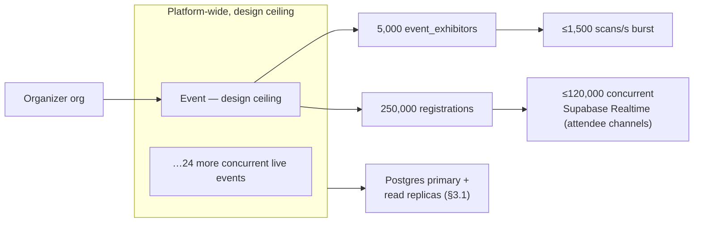
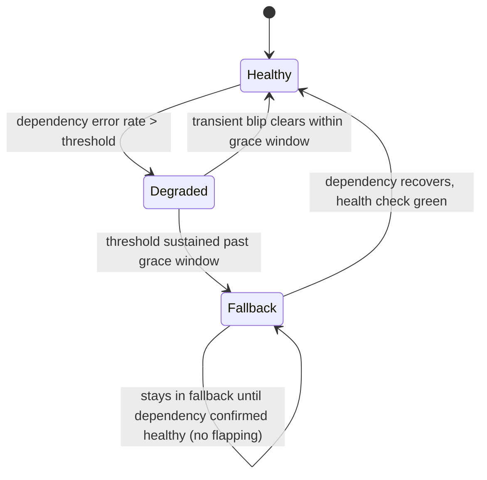

# Non-Functional Requirements

This document is the authoritative source for every performance, scale, availability, accessibility, internationalization, and capacity-planning number that other Concourse documents currently state ad hoc. It consolidates budgets already declared piecemeal in [04-user-journey.md](04-user-journey.md) (JP-1), [18-api-architecture.md](18-api-architecture.md) (§3.8 rate limits), [21-ai-architecture.md](21-ai-architecture.md) (§3, §6, §9), and [39-design-system.md](39-design-system.md) (§12 accessibility) into one place, and it fills the numeric gaps foundation decision D5 left open (exact scans/sec, connection counts, Postgres sizing). What this document does **not** own: the functional behavior behind any feature ([09-functional-requirements.md](09-functional-requirements.md)), the mechanics of *how* a budget is met in code ([27-background-jobs-architecture.md](27-background-jobs-architecture.md), [31-observability.md](31-observability.md), [22-rag-architecture.md](22-rag-architecture.md)), or the detailed token/contrast rules behind the accessibility gate ([39-design-system.md](39-design-system.md) §12). Every requirement below carries an `NFR-*` id so [09-functional-requirements.md](09-functional-requirements.md) and test plans in [42-testing-strategy.md](42-testing-strategy.md) can cite it directly. All names conform to [00-foundation.md](00-foundation.md).

## 1. Scope and Ownership

| This doc owns | Owned elsewhere |
|---|---|
| The authoritative numeric budget for every performance/scale/availability figure | The implementation that meets the budget ([27-background-jobs-architecture.md](27-background-jobs-architecture.md), [31-observability.md](31-observability.md), [22-rag-architecture.md](22-rag-architecture.md), [17-offline-sync-architecture.md](17-offline-sync-architecture.md)) |
| Scale targets expanding foundation D5 into concrete numbers | The scale-verification test suite ([42-testing-strategy.md](42-testing-strategy.md)) |
| Availability/SLA targets per surface | Commercial SLA credits and contract mechanics ([36-billing-and-payments-architecture.md](36-billing-and-payments-architecture.md)) |
| i18n readiness posture (externalization strategy) | Actual translated locale content (out of Phase 1; [44-future-expansion-plan.md](44-future-expansion-plan.md)) |
| The accessibility **release-gate policy** (what must pass, when) | The accessibility **standards themselves** — contrast, focus, touch targets, motion ([39-design-system.md](39-design-system.md) §12) and automated test implementation ([42-testing-strategy.md](42-testing-strategy.md)) |
| Browser/device support matrix | Responsive layout mechanics ([13-application-layout.md](13-application-layout.md)) |
| Capacity-planning assumptions (volumes, throughput) | Queue catalog and worker scaling policy ([27-background-jobs-architecture.md](27-background-jobs-architecture.md)), dashboards and alert routing ([31-observability.md](31-observability.md)) |
| AI cost/latency budgets as a cross-feature policy | Per-feature prompt/latency/fallback design ([21-ai-architecture.md](21-ai-architecture.md)) |

## 2. Performance & Latency Budgets

Foundation principle 1 — "fast is the feature" — is not a slogan here; every number below is a release gate, verified in [42-testing-strategy.md](42-testing-strategy.md) and alerted on in [31-observability.md](31-observability.md) (§10).

### 2.1 Perceived UI performance (page/route level)

| ID | Metric | Budget (p75, field data) | Surface | Rationale |
|---|---|---|---|---|
| NFR-PERF-01 | Largest Contentful Paint (LCP) | ≤ 2.0 s | Attendee App, Exhibitor Portal mobile routes | Concrete-hall network conditions; foundation principle 4 |
| NFR-PERF-02 | Largest Contentful Paint (LCP) | ≤ 2.5 s | Organizer Console, Platform Admin, Marketing site | Desktop-first, less network-constrained |
| NFR-PERF-03 | Interaction to Next Paint (INP) | ≤ 200 ms | All surfaces | Core Web Vitals "good" threshold; matches Marquee's ≤300 ms UI transition ceiling ([39-design-system.md](39-design-system.md) §9) |
| NFR-PERF-04 | Time to first byte, RSC shell | ≤ 600 ms | All surfaces | Vercel edge rendering; no auth/tenant context on the marketing site ([00-foundation.md](00-foundation.md) §5) |
| NFR-PERF-05 | PWA cold install → usable shell | ≤ 4 s on a mid-tier Android device, 4G | Attendee App, Exhibitor Portal | Service-worker precache warms during onboarding, not first use |

### 2.2 Interactive & AI feature latency budgets (authoritative, consolidated)

Every one of these numbers already exists somewhere else in `/docs`; this table is the single place to look them up, with the origin cited so nobody re-derives or silently drifts them.

| ID | Feature / path | Budget | Source |
|---|---|---|---|
| NFR-PERF-06 | Expo Copilot — first token | ≤ 1.5 s p95 | [1] |
| NFR-PERF-07 | Expo Copilot — complete streamed answer | ≤ 8 s p95 | [1] |
| NFR-PERF-08 | RAG hybrid retrieval (component of NFR-PERF-06) | ≤ 380 ms p95 | [2] |
| NFR-PERF-09 | Organizer Pulse — first token | ≤ 2.5 s p95 | [1] |
| NFR-PERF-10 | Organizer Pulse — complete narrative | ≤ 15 s p95 | [1] |
| NFR-PERF-11 | Lead Intelligence — summary generation | ≤ 6 s p95 (skeleton shown) | [1] |
| NFR-PERF-12 | Follow-up Studio — draft per lead | ≤ 10 s p95, batched 20-at-a-time | [1] |
| NFR-PERF-13 | Match recommendations — read API | ≤ 100 ms p95 (plain indexed query; scoring is async/batch) | [1] |
| NFR-PERF-14 | Badge-scan lead capture — confirmation feedback | Sub-second (< 1 s) local UI confirm | [3] |
| NFR-PERF-15 | Badge-scan lead capture — scan-to-next-scan cycle | ≤ 5 s (first lead of the day ≤ 30 s including app warm-up) | [4] |
| NFR-PERF-16 | Postgres full-text search (event federated search) | < 50 ms p95 | [5] |
| NFR-PERF-17 | Live dashboard tick (`event.dashboard_tick`) | 5 s cadence, worker-aggregated | [6] |
| NFR-PERF-18 | Standard CRUD list/read endpoints | ≤ 300 ms p95 | New — see §10 alerting |
| NFR-PERF-19 | Standard CRUD write endpoints (non-scan) | ≤ 500 ms p95 | New — see §10 alerting |

Footnotes: [1] [21-ai-architecture.md](21-ai-architecture.md) §3 (per-feature latency budgets) and §9 (SLO alert thresholds). [2] [22-rag-architecture.md](22-rag-architecture.md) §9 (owns the retrieval-latency breakdown; restated here as it composes into NFR-PERF-06). [3] [08-feature-matrix.md](08-feature-matrix.md) H1. [4] [04-user-journey.md](04-user-journey.md) §5, JP-1. [5] [11-information-architecture.md](11-information-architecture.md) §6. [6] [18-api-architecture.md](18-api-architecture.md) §7.3.

### 2.3 Journey time-to-value budgets (JP-1, restated authoritatively)

[04-user-journey.md](04-user-journey.md) §5 defines these as product requirements; they are repeated here because they are non-functional requirements in every sense (a stopwatch test, not a feature checklist) and because [09-functional-requirements.md](09-functional-requirements.md) needs one canonical id per budget to write acceptance tests against.

| ID | Persona | First-value moment | Budget |
|---|---|---|---|
| NFR-JTV-01 | Priya | Event exists in `draft` with dates, venue, booth-ready floor plan | ≤ 30 min from signup |
| NFR-JTV-02 | Elena (new exhibitor) | Profile live and attendee-previewable | ≤ 15 min from invite acceptance |
| NFR-JTV-03 | Elena (returning exhibitor) | Same, reusing org + catalog | ≤ 5 min from invite acceptance |
| NFR-JTV-04 | Jamal | First lead captured | ≤ 30 s |
| NFR-JTV-05 | Sofia | Registered with badge claimed | ≤ 2 min |
| NFR-JTV-06 | Sofia | Personalized plan (≥5 matches + agenda picks) | ≤ 5 min after interest onboarding |
| NFR-JTV-07 | Marcus | Answers "how is check-in going right now?" | ≤ 10 s from opening live ops |

### 2.4 Ingestion & rate-limit budgets

Restated from [18-api-architecture.md](18-api-architecture.md) §3.8 — the authoritative bucket definitions live there; this row confirms the scan-ingestion bucket is also a **non-functional requirement**, not just a rate-limiting implementation detail, because it is the numeric expression of foundation principle 4 ("works in a concrete hall").

| ID | Bucket | Sustained | Burst | Requirement it encodes |
|---|---|---|---|---|
| NFR-PERF-20 | Scan ingestion per `event_exhibitors` id (`booth-visits`, `leads`) | 1,200 req/min (20/s) | 2,400 req/min (40/s) | A 10-rep booth scanning flat-out must never see `429` |
| NFR-PERF-21 | Session (first-party surfaces) | 300 req/min | 600 req/min | General app usage headroom |
| NFR-PERF-22 | AI messages, per user | 20 req/min | 30 req/min | Cost control, not UX friction under normal use |

## 3. Scale Targets

This section is the concrete expansion of foundation decision **D5** ("thousands of exhibitors and hundreds of thousands of attendees per event; multiple simultaneous events; long-term enterprise foundation, not an MVP"). [08-feature-matrix.md](08-feature-matrix.md) M5 names this document as the verification target for that milestone's exit criterion — the numbers below are what M5 is measured against.

Two operating points are distinguished so nobody over-builds for day one or under-builds for the stated ceiling:

| Dimension | Beachhead operating point (near-term, [02-business-goals.md](02-business-goals.md) §2) | Design ceiling (D5 long-term target) |
|---|---|---|
| `event_exhibitors` per event | ~1,000 | 5,000 |
| `registrations` per event | ~30,000 | 250,000 |
| Simultaneous `live`-status events, platform-wide | 5 | 25 |
| Peak booth-scan writes/sec (`booth_visits` + `leads`), per event | 50/s sustained | 500/s sustained, 1,500/s burst (show-opening rush) |
| Concurrent Supabase Realtime connections, single event | ~15,000 | ≤ 140,000 (120,000 attendee + 15,000 exhibitor + 5,000 organizer/staff) |
| Concurrent Supabase Realtime connections, platform-wide | ~40,000 | ≤ 300,000 (mixed event sizes across 25 simultaneous live events) |

**NFR-SCALE-01 — Peak scan throughput.** The burst number (1,500/s) is derived, not asserted: 5,000 booths staffed, ~30% (1,500 booths) actively scanning during a rush (opening bell, keynote break), each sustaining an aggregate ~1 scan/sec across however many reps are staffing it at that moment ⇒ 1,500 booths × 1/s ≈ 1,500/s. This sits comfortably under the per-`event_exhibitor` burst ceiling of 40/s (§2.4) even for the busiest individual booths, so [27-background-jobs-architecture.md](27-background-jobs-architecture.md) can size the write path (Postgres + BullMQ fan-out) against the 1,500/s aggregate without any single exhibitor's rate-limit bucket becoming the binding constraint first.

**NFR-SCALE-02 — Concurrent live events.** "Multiple simultaneous events" (D5) is fixed at 25 concurrent `live`-status events at the design ceiling. This is a platform-wide budget, not per-organization — enterprise organizer orgs with `entitlement:events_limit = -1` may run several of their own events inside that shared ceiling.

### 3.1 Postgres connection budget

Decision (new, made here because D5 left it open): Concourse runs **PgBouncer in transaction-pooling mode** in front of the Postgres 16 primary and each read replica ([00-foundation.md](00-foundation.md) §6). This is additive to the locked stack choice, not a change to it — Drizzle ORM and RLS session variables behave identically through a transaction-mode pooler as long as `SET app.current_org_id` happens inside the same transaction as the query it scopes (already the pattern per [00-foundation.md](00-foundation.md) §8 and [18-api-architecture.md](18-api-architecture.md) §3.9).

| ID | Parameter | Design-ceiling value | Notes |
|---|---|---|---|
| NFR-SCALE-03 | Postgres `max_connections` (primary) | 600 | Headroom over the NFR-SCALE-04 pool for direct/admin connections, replication slots, and migrations — not a target to be filled, since PgBouncer is what absorbs load |
| NFR-SCALE-04 | PgBouncer pool size (effective backend connections) | 400 per database | Transaction-mode multiplexing absorbs thousands of logical app requests behind these 400 physical connections |
| NFR-SCALE-05 | Per-ECS-task Drizzle pool (API) | 10 connections | Task count scales horizontally within PgBouncer headroom |
| NFR-SCALE-06 | Per-ECS-task Drizzle pool (worker) | 5 connections | Worker tasks are fewer but longer-held per job |
| NFR-SCALE-07 | Read-replica count at design ceiling | 2, round-robin for `filter`/`search`/analytics reads | Write path never targets a replica |

### 3.2 Supabase Realtime connection budget

Per [00-foundation.md](00-foundation.md) §14 Amendment A5, Realtime connections are held and fanned out by Supabase's own managed infrastructure, not by our own horizontally-scaled API service instances — there is no per-instance connection ceiling or Redis pub/sub hop for us to size, which is a genuine simplification over the prior Socket.IO + Redis-adapter design (fewer moving parts we operate, not fewer design decisions we need to make).

| ID | Parameter | Design-ceiling value | Notes |
|---|---|---|---|
| NFR-SCALE-08 | Supabase project Realtime connection quota, confirmed against the design ceiling | ≥ 140,000 concurrent per project | Provisioned/confirmed with Supabase at the plan tier that supports this ceiling before a design-ceiling-sized event is scheduled; this replaces sizing our own gateway instances |
| NFR-SCALE-09 | Broadcast publish latency (our service-role client → Supabase Realtime → subscribed clients) | ≤ 250 ms p95 at design ceiling | Same latency target as the prior Redis pub/sub figure, now measured end-to-end against the managed service rather than our own adapter |

## 4. Availability & SLA Targets per Surface

Availability is tiered by how much a minute of downtime costs the persona standing at that moment, not by surface prestige. Floor-critical paths get the strictest target; the offline-tolerant design (foundation principle 4, [04-user-journey.md](04-user-journey.md) JP-2) means the *user-perceived* availability of the sacred loop (Jamal's scan→capture→qualify→note) is higher than the backend SLA alone would suggest — a queued, syncing scan is not an outage to Jamal.

| ID | Surface / path | Tier | Monthly SLA target | RTO | RPO |
|---|---|---|---|---|---|
| NFR-AVAIL-01 | Attendee App during a `live` event window (badge, floor map, offline-cached plan) | Floor-critical | 99.95% | ≤ 2 min (Multi-AZ auto-failover) | Near-zero (synchronous AZ replication) |
| NFR-AVAIL-02 | Exhibitor Portal capture routes (BadgeScanner, quick-qualify) during a `live` event window | Floor-critical | 99.95% | ≤ 2 min | Near-zero |
| NFR-AVAIL-03 | Organizer Console check-in/live-ops routes during a `live` event window | Floor-critical | 99.95% | ≤ 2 min | Near-zero |
| NFR-AVAIL-04 | Organizer Console / Exhibitor Portal — setup, catalog, analytics (non-live-window) | Back-office | 99.9% | ≤ 15 min | ≤ 5 min |
| NFR-AVAIL-05 | Public API v1 + webhooks (`enterprise` plan) | Contracted | 99.9% | ≤ 15 min | ≤ 5 min |
| NFR-AVAIL-06 | Marketing site (`/`, `/pricing`, `/about`, `/help`, `/legal/*`) | Public/static | 99.99% | ≤ 5 min (edge re-route) | N/A (static/RSC, no mutable state) |
| NFR-AVAIL-07 | Platform Admin | Internal | 99.5%, best-effort | ≤ 30 min | ≤ 15 min |

**Phase-1 disaster-recovery posture:** infra is single-region (`us-east-1`) with Multi-AZ Postgres and Redis ([00-foundation.md](00-foundation.md) §6). The RTO/RPO figures above cover AZ-level failure, which Multi-AZ handles automatically. Full region-level disaster recovery (cross-region standby, RTO in hours rather than minutes) is explicitly out of Phase-1 scope, consistent with EU region being a Future Expansion item ([00-foundation.md](00-foundation.md) §6); it is tracked in [44-future-expansion-plan.md](44-future-expansion-plan.md) with the revisit trigger "first enterprise contract requiring a documented DR runbook beyond Multi-AZ."

**Enterprise SLA commercial terms** (credits, reporting cadence) are a billing concern, not a technical one, and are owned by [36-billing-and-payments-architecture.md](36-billing-and-payments-architecture.md); this document fixes only the technical target that the commercial terms are built on top of.

## 5. Browser & Device Support Matrix

| ID | Platform | Supported | Notes |
|---|---|---|---|
| NFR-BROWSER-01 | Desktop Chrome / Edge | Latest + previous major (N, N−1) | Primary Organizer Console / Platform Admin target |
| NFR-BROWSER-02 | Desktop Firefox | Latest + previous major (N, N−1) | |
| NFR-BROWSER-03 | Desktop Safari (macOS) | Latest 2 major versions | |
| NFR-BROWSER-04 | iOS Safari | Latest 2 major iOS versions | PWA install via Add to Home Screen; primary Sofia/Jamal target on iPhone |
| NFR-BROWSER-05 | Android Chrome | Latest 2 major versions | Full PWA install (manifest + service worker); primary Sofia/Jamal target on Android |
| NFR-BROWSER-06 | Minimum supported viewport | 320px width | Small phones; primary mobile target range 375–430px |
| NFR-BROWSER-07 | Unsupported browsers (legacy Edge, IE, browsers > 2 majors old) | Static "please upgrade" page, no app bundle shipped | Served without depending on the authenticated app bundle |
| NFR-BROWSER-08 | JavaScript requirement | Required for all authenticated surfaces; marketing site pages remain readable without client JS (RSC) | No no-JS fallback for Organizer Console / Exhibitor Portal / Attendee App / Platform Admin |
| NFR-BROWSER-09 | Offline capability (Service Worker + IndexedDB) | Required on every supported browser above | All browsers in this matrix support both APIs; this is why the matrix excludes anything that doesn't |

Container widths and breakpoints implementing this matrix are owned by [39-design-system.md](39-design-system.md) §6 and [13-application-layout.md](13-application-layout.md).

## 6. Accessibility Release Gate

The accessibility **standards** — contrast ratios, focus rules, touch targets, motion, voice & tone — are owned in full by [39-design-system.md](39-design-system.md) §12. This document fixes only the **policy for when a release is blocked**:

1. **WCAG 2.2 AA is a merge gate, not a launch gate.** A PR touching UI cannot merge if its automated axe-core scan reports a critical or serious violation. This runs in the same CI stage as the token contrast tests already mandated in [39-design-system.md](39-design-system.md) §15.
2. **A milestone (M0–M5, [08-feature-matrix.md](08-feature-matrix.md) §2) does not exit** until every new surface introduced in that milestone has had one manual keyboard-only pass and one manual screen-reader pass (VoiceOver + NVDA, one pass each — not per-page, per-surface).
3. **An accessibility regression found after ship is a P0 bug** regardless of the originating feature's priority in [08-feature-matrix.md](08-feature-matrix.md) — it is triaged and fixed on the same clock as a data-loss bug, not queued as a P2 cleanup.
4. **No feature ships behind an accessibility exception.** There is no "ship now, fix a11y later" path in Phase 1; if a component can't meet §12 of [39-design-system.md](39-design-system.md), the feature slips, per the same discipline that governs P0/P1 in [08-feature-matrix.md](08-feature-matrix.md) §1.
5. Automated test implementation (which pages, which tooling, CI wiring) is owned by [42-testing-strategy.md](42-testing-strategy.md).

## 7. Capacity Planning Assumptions

These assumptions are inputs [27-background-jobs-architecture.md](27-background-jobs-architecture.md) and [31-observability.md](31-observability.md) build sizing decisions against. They are estimates, stated as decisions so downstream docs have a number to build to rather than a placeholder.

| ID | Assumption | Value | Feeds |
|---|---|---|---|
| NFR-CAP-01 | Average booth visits per attendee per live day | 8 | Worker throughput sizing, dashboard aggregation cadence |
| NFR-CAP-02 | Average leads captured per staffed booth per live day | 40 (essentials tier lower, intelligence tier higher) | `ai-batch` queue sizing (Lead Intelligence extraction) |
| NFR-CAP-03 | `kb_chunks` generated per event at design ceiling (5,000 exhibitors × ~10 chunks profile/listings, + organizer docs + agenda) | ~55,000 | `kb-ingest` queue throughput, pgvector index sizing, Voyage embedding call volume |
| NFR-CAP-04 | Peak `kb-ingest` job rate (bulk reingest window around event publish) | 200 jobs/s, briefly | Worker autoscaling trigger threshold |
| NFR-CAP-05 | Peak transactional email volume (single send window, e.g. pre-event digest) | 50,000 messages | `notification-dispatch` queue sizing, SES rate limits |
| NFR-CAP-06 | Domain events emitted per scan (`booth_visit.recorded` + downstream `lead.captured`, `lead.updated`) | ~2 events per scan average | Outbox relay + webhook-deliver queue sizing ([18-api-architecture.md](18-api-architecture.md) §9) |
| NFR-CAP-07 | Worker instance count | Min 2, autoscale on queue depth (BullMQ), no fixed max | [27-background-jobs-architecture.md](27-background-jobs-architecture.md) owns the scaling policy this triggers |
| NFR-CAP-08 | Redis working-set headroom per concurrent live event (BullMQ + rate-limit buckets + Attendee Continuity Token store + idempotency keys) | ≥ 2 GB | ElastiCache cluster sizing |
| NFR-CAP-09 | OTel span volume at peak scan throughput (avg 5 spans/request × NFR-SCALE-01 burst) | ~7,500 spans/s, briefly | Grafana Cloud (Tempo/Mimir) ingestion sizing |
| NFR-CAP-10 | pino log line volume at peak | ~3,000 lines/s across API+worker | Loki ingestion sizing, log-based alert noise budget |

## 8. Reliability, Degradation & Overload Behavior

Foundation principle 1 ("fast is the feature") and principle 4 ("works in a concrete hall") together require that **every subsystem degrades to a stated, honest, lesser state instead of erroring** — this is the same discipline [21-ai-architecture.md](21-ai-architecture.md) §8.3 already applies to AI features, extended here to the rest of the platform.

| ID | Subsystem | Failure mode | Fallback behavior |
|---|---|---|---|
| NFR-REL-01 | Postgres primary | AZ failure | Multi-AZ automatic failover (§4 RTO/RPO); writes pause during failover, reads may continue against a replica with a staleness banner, never a silent stale write |
| NFR-REL-02 | Redis (BullMQ, rate-limit buckets, Attendee Continuity Token store, idempotency) | Node failure | ElastiCache Multi-AZ automatic failover; RTO objective ≤ 60 s. User-facing auth sessions are unaffected by this failover — they are Supabase Auth JWTs, independent of our own Redis ([20-session-strategy.md](20-session-strategy.md) §1); only an in-flight ACT redemption during the failover window would need a retry |
| NFR-REL-03 | Supabase Realtime channel | Connection drop or managed-service blip | Client falls back to REST polling at 15 s intervals until reconnect; no data loss because pushes are invalidation hints, never the source of truth ([18-api-architecture.md](18-api-architecture.md) §7.3) |
| NFR-REL-04 | AI providers (Claude, Voyage) | Outage or budget exhaustion | Deterministic fallback per feature — full matrix in [21-ai-architecture.md](21-ai-architecture.md) §8.3 |
| NFR-REL-05 | Webhook endpoints | Non-2xx / timeout | Retry with backoff, 7 attempts over 24 h, then `dead` + org-admin notification ([18-api-architecture.md](18-api-architecture.md) §9) |
| NFR-REL-06 | Background job backlog | Queue depth exceeds threshold | Priority classes keep interactive-adjacent jobs (e.g. export triggered by a waiting user) ahead of batch (nightly matchmaking); depth-based autoscaling and alerting per [27-background-jobs-architecture.md](27-background-jobs-architecture.md), [31-observability.md](31-observability.md) |
| NFR-REL-07 | Analytics dashboards (deterministic, non-AI) | Aggregation pipeline lag | Last-computed numbers shown with an explicit "as of {timestamp}" — never a spinner, per foundation principle 1 |
| NFR-REL-08 | Client-device connectivity (Jamal, Sofia) | No network | Full offline capture/read per [04-user-journey.md](04-user-journey.md) JP-2; mechanics owned by [17-offline-sync-architecture.md](17-offline-sync-architecture.md) |

## 9. Internationalization Readiness

Only `en-US` ships in Phase 1 ([08-feature-matrix.md](08-feature-matrix.md) §6 lists multi-language UI content as explicitly deferred), but every surface is built so adding a locale later is a translation-and-config exercise, not a rewrite.

1. **Copy externalization.** Every user-facing string is sourced from ICU MessageFormat resource files (`next-intl`), organized `packages/shared/src/i18n/<locale>/<surface>.json`. No component contains a hardcoded user-facing string literal — enforced by a lint rule in the same shared config that enforces naming conventions ([00-foundation.md](00-foundation.md) §11). Pluralization and interpolation use ICU syntax so a translator never needs to touch code.
2. **Locale-invariant vocabulary stays invariant.** Canonical glossary terms ([00-foundation.md](00-foundation.md) §12), table/entity names, permission strings, entitlement keys, and domain event names (`lead.captured`, etc.) are never translated — they are system identifiers, not UI copy. Only the *rendered* label a persona sees goes through the resource files.
3. **Dates, times, numbers.** Every render path uses `Intl.DateTimeFormat` / `Intl.NumberFormat`, never manual string formatting. Absolute times remain in event-local timezone regardless of locale, per the voice & tone rule already locked in [39-design-system.md](39-design-system.md) §13.1 ("Starts 14:30 (event time)") — localization changes the language of the label, not the timezone convention.
4. **Layout readiness.** `packages/ui` already uses logical CSS properties (`margin-inline`, `padding-inline`) rather than physical `left`/`right` for spacing, so RTL locale support later is a `dir="rtl"` + token flip, not a component rewrite. RTL is not targeted in Phase 1 (no RTL locale is planned) — this is a readiness decision, not a delivery commitment.
5. **AI-generated content stays English-only in Phase 1.** Expo Copilot, Organizer Pulse, Lead Intelligence, and Follow-up Studio prompts and outputs are English-only; the eval golden sets ([21-ai-architecture.md](21-ai-architecture.md) §5) are curated in English only. Prompting the model to answer in an attendee's locale is a straightforward additive change once translated UI ships, but multiplying golden-set maintenance across locales for a feature nobody can use yet has no Phase-1 payoff.
6. **Delivery of any actual non-English locale** is out of Phase-1 scope and tracked in [44-future-expansion-plan.md](44-future-expansion-plan.md), with revisit trigger "signed enterprise or mid-market deal in a non-English-primary market."

## 10. Monitoring, Alerting & Error-Budget Policy

Dashboards, on-call rotation, and alert routing mechanics are owned by [31-observability.md](31-observability.md); this section fixes the thresholds that are product-level non-functional requirements rather than implementation detail, so that document has fixed numbers to wire alerts against.

1. **Error-budget framing.** Each SLA target in §4 implies a monthly error budget (e.g., 99.95% → 21.9 minutes/month). Burn-rate alerting: a **fast burn** (> 2% of the monthly budget consumed within 1 hour) pages on-call immediately; a **slow burn** (> 10% consumed within 6 hours) opens a ticket, not a page.
2. **Consolidated alert thresholds** (extends the AI-specific thresholds already fixed in [21-ai-architecture.md](21-ai-architecture.md) §9):

| ID | Signal | Threshold | Window |
|---|---|---|---|
| NFR-MON-01 | Expo Copilot first-token p95 | > 1.5 s | 15 min |
| NFR-MON-02 | Any AI feature fallback-activation rate | > 5% | 5 min |
| NFR-MON-03 | Standard CRUD read p95 (NFR-PERF-18) | > 300 ms sustained | 10 min |
| NFR-MON-04 | Standard CRUD write p95 (NFR-PERF-19) | > 500 ms sustained | 10 min |
| NFR-MON-05 | Scan-ingestion bucket `429` rate (NFR-PERF-20) | > 1% of requests | 5 min |
| NFR-MON-06 | Postgres replica lag | > 5 s | 2 min |
| NFR-MON-07 | BullMQ queue depth (any queue) | > 3× rolling 7-day median | 10 min |
| NFR-MON-08 | Realtime client reconnect rate (`realtime_client_reconnect_total`, [31-observability.md](31-observability.md) §6.2) | > 10% of connected clients/min | 5 min |

3. **Alert-fatigue budget.** No on-call rotation carries more than 2 paging alerts/week at steady state as a health signal for the thresholds themselves — a rotation exceeding that triggers a threshold review, not a rotation-size increase.

## 11. AI Cost & Latency Budgets (Degradation Ladder)

Latency budgets for AI features are already fixed in §2.2 (NFR-PERF-06…13); this section owns the **cost** side, which two other locked documents each state a piece of. Read together, they describe one two-layer budget model, not a contradiction:

- **Per-event total envelope** — the overall AI spend ceiling for one event's lifetime, resolved from the organizer's plan ([21-ai-architecture.md](21-ai-architecture.md) §6.2): `launch` $250/event, `professional` $1,000/event, `enterprise` contract-defined with overage billing.
- **Daily smoothing ceiling** — the entitlement key `entitlement:ai_budget_daily_usd` ([08-feature-matrix.md](08-feature-matrix.md) §3): `launch` $150/day, `professional` $600/day, `enterprise` $2,000/day (platform-admin adjustable).

Both are enforced pre-flight by the same `AiBudgetService` ([21-ai-architecture.md](21-ai-architecture.md) §1, §6.2). The daily figure exists so a multi-day event cannot burn its entire per-event envelope on day one — whichever ceiling is hit first governs. For a 3-day `launch`-tier event, the daily $150 cap binds before the $250 event total could be reached on a single day, which is the intended smoothing effect.

| ID | Scope | Mechanism | Default |
|---|---|---|---|
| NFR-AI-01 | Per event (organizer plan) — total | `AiBudgetService` pre-flight | `launch` $250, `professional` $1,000, `enterprise` contract-defined |
| NFR-AI-02 | Per event (organizer plan) — daily ceiling | `entitlement:ai_budget_daily_usd` | `launch` $150/day, `professional` $600/day, `enterprise` $2,000/day |
| NFR-AI-03 | Per `event_exhibitor` — Lead Intelligence | Entitlement-tied quota | 5,000 summaries/event |
| NFR-AI-04 | Per `event_exhibitor` — Follow-up Studio | Entitlement-tied quota | 2,000 drafts/event |
| NFR-AI-05 | Per registration — Expo Copilot | Abuse/cost quota | 30 messages/hour, 200/day |

**Degradation ladder** (authoritative source: [21-ai-architecture.md](21-ai-architecture.md) §6.2, §8.3 — reproduced here as the NFR-level summary):

1. **80% of any budget** → owner receives a notification ([33-notification-system.md](33-notification-system.md)); no user-facing change yet.
2. **100% of any budget** → the feature degrades to its deterministic fallback with an in-product notice. AI never hard-blocks a workflow it merely enhances (foundation §10): Expo Copilot → deterministic search/browse; Smart Matchmaking → template reasons over stored evidence; Lead Intelligence → rule-only score + raw timeline; Follow-up Studio → merge-field templates; Organizer Pulse → standard dashboards.
3. **Platform-admin override.** Alex can raise, lower, or reset any of these ceilings per event from the AI cost console ([08-feature-matrix.md](08-feature-matrix.md) S3), including a kill switch independent of budget state.
4. Budget-denial spikes and fallback-activation rates are alerted per §10 (NFR-MON-02) and dashboarded per [31-observability.md](31-observability.md).

## 12. Related Documents

| Document | Relationship |
|---|---|
| [00-foundation.md](00-foundation.md) | Source of D5 and product principles this document quantifies |
| [04-user-journey.md](04-user-journey.md) | Source of JP-1 time-to-value budgets (§2.3) and JP-2 offline classification (§8) |
| [08-feature-matrix.md](08-feature-matrix.md) | Source of the `ai_budget_daily_usd` entitlement (§11) and the M5 milestone this doc verifies (§3) |
| [18-api-architecture.md](18-api-architecture.md) | Source of rate-limit buckets (§2.4) and realtime push cadence (§2.2) |
| [21-ai-architecture.md](21-ai-architecture.md) | Source of every AI latency/cost/degradation figure this doc consolidates (§2.2, §11) |
| [22-rag-architecture.md](22-rag-architecture.md) | Owns retrieval-latency implementation behind NFR-PERF-08 |
| [27-background-jobs-architecture.md](27-background-jobs-architecture.md) | Consumes §3 scale targets and §7 capacity assumptions for queue/worker sizing |
| [31-observability.md](31-observability.md) | Consumes §7 capacity assumptions and §10 alert thresholds for dashboards/on-call |
| [39-design-system.md](39-design-system.md) | Owns the accessibility standards gated by §6 and the motion/breakpoint tokens referenced in §2.1/§5 |
| [36-billing-and-payments-architecture.md](36-billing-and-payments-architecture.md) | Owns commercial SLA credit mechanics for the targets fixed in §4 |
| [42-testing-strategy.md](42-testing-strategy.md) | Owns automated verification of every `NFR-*` id in this document |
| [44-future-expansion-plan.md](44-future-expansion-plan.md) | Owns delivery of non-English locales, full region-level DR, and other items this doc marks as deferred rather than resolved |
