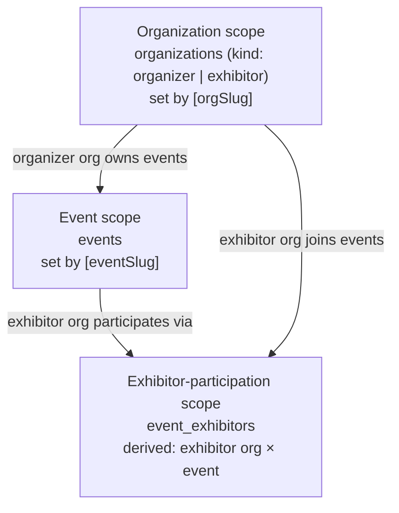

# Information Architecture

This document defines how Concourse's canonical domain model ([00-foundation.md](00-foundation.md) §7) is projected onto its four product surfaces: which entities appear where, in what hierarchy, under which URL, and how organization → event → exhibitor context nesting resolves. **This document owns the canonical route map.** [12-navigation-structure.md](12-navigation-structure.md) defines how users move through these routes, [13-application-layout.md](13-application-layout.md) defines the shells that render them, and [14-page-inventory.md](14-page-inventory.md) specifies every route as a buildable page. Any new route must be added here first.

---

## 1. Surfaces and their primary objects

Each surface is organized around one primary object. Everything else on the surface is reached through, or in service of, that object.

| Surface | Base path (foundation §5) | Primary object | Everything else is… |
|---|---|---|---|
| Organizer Console | `/org/[orgSlug]` | The **event** | …something you configure or monitor for an event |
| Exhibitor Portal | `/exhibit/[orgSlug]` | The **lead** | …something that produces, enriches, or converts leads |
| Attendee App | `/e/[eventSlug]` | The **event itself** (as an experience) | …a way to discover, plan, and connect within it |
| Platform Admin | `/admin` | The **tenant** (organization) | …operational tooling around tenants and the platform |

The Marketing site (`/`) is in Phase-1 scope (foundation §5, §14 Amendment A1); its route map, page architecture, and shell are owned entirely by [46-marketing-site.md](46-marketing-site.md), not by this document's §4 route table, which is the app-surface (authenticated tenant) route map only. The Public API (`api.concourse.app/v1`) has no UI pages; its management UI (API keys, webhooks) lives inside the Organizer Console.

## 2. Object model → surface mapping

Legend: **Own** = surface is the system of record UI (create/edit/delete). **Read** = read-only projection. **Derived** = surface shows a computed/aggregated view, never raw rows (foundation §8 cross-tenant rule). **—** = entity never appears on this surface.

| Entity (foundation §7) | Organizer Console | Exhibitor Portal | Attendee App | Platform Admin |
|---|---|---|---|---|
| `organizations` (organizer) | Own (own org settings) | — | — | Read + lifecycle ops |
| `organizations` (exhibitor) | Read (participant identity) | Own (own org settings) | Read (public profile) | Read + lifecycle ops |
| `users` | Read (members, attendees) | Read (staff) | Own (self) | Read + support ops |
| `organization_memberships` | Own (own org) | Own (own org) | — | Read |
| `auth_sessions` | Own (self, via `/account`) | Own (self, via `/account`) | Own (self, via `/account`) | Read (support) |
| `api_keys` | Own (enterprise) | — | — | Read |
| `events` | Own | Read (context) | Read (context) | Read + lifecycle ops |
| `venues`, `floor_plans`, `booths` | Own | Read (own booth) | Read (map) | — |
| `event_staff` | Own | — | — | Read |
| `event_exhibitors` | Own (invite, approve, tier, booth) | Own (profile, participation) | Read (directory entry) | Read |
| `exhibitor_staff` | Read (counts) | Own | Read (booth staff names) | Read |
| `products` | — | Own (org catalog) | — | — |
| `event_product_listings` | Read (counts) | Own | Read (directory) | — |
| `registrations` | Own (list, check-in, cancel) | Derived (only via leads/matches) | Own (self: register, profile) | Read (support) |
| `attendee_interests` | Derived (aggregates) | Derived (on leads/matches) | Own (self) | — |
| `agenda_sessions` | Own | Read | Read + bookmark | — |
| `session_checkins` | Own (scan) + Derived (counts) | — | Own (self-checkin) | — |
| `booth_visits` | Derived (traffic analytics) | Read (own booth) | Own (self-scan creates) | — |
| `leads` | Derived (counts only, never contents) | Own | — (attendee sees connections, not the lead record) | — |
| `lead_notes` | — | Own | — | — |
| `meetings` | Derived (volume analytics) | Own (own meetings) | Own (own meetings) | — |
| `match_recommendations` | Derived (coverage analytics) | Read (own matches) | Read (own matches) | — |
| `kb_sources` / `kb_documents` / `kb_chunks` | Own (per event) | Own (own content sources) | — (consumed via Expo Copilot) | Read (ingest health) |
| `ai_conversations` / `ai_messages` | Own (self: Organizer Pulse) | — (Phase 1; see [44-future-expansion-plan.md](44-future-expansion-plan.md)) | Own (self: Expo Copilot) | Derived (cost/usage) |
| `files` | Own (own uploads) | Own (own uploads) | Read (rendered assets) | Read (scan status) |
| `notifications` / `notification_preferences` | Own (self) | Own (self) | Own (self) | — |
| `plans` / `subscriptions` / `entitlements` | Own (own subscription) | Own (own tier purchase) | — | Own (plan catalog, overrides) |
| `webhook_endpoints` / `webhook_deliveries` | Own (enterprise) | — | — | Read |
| `audit_logs` | Read (own org) | — | — | Read (platform-wide) |
| `domain_events` | — | — | — | Read (pipeline health) |

Two rows encode load-bearing tenancy rules from foundation §8 and are repeated in the docs that render them:

1. **Leads are exhibitor-owned.** The Organizer Console never displays lead contents — only aggregate counts (e.g., "1,204 leads captured floor-wide"). No route in §5 exposes an organizer-side lead detail.
2. **Attendee PII flows to exhibitors only through the lead path.** The Exhibitor Portal never lists raw `registrations`; it sees attendees only as `leads` (after capture/derivation) or as `match_recommendations` (name + interests, no contact details until connected).

## 3. Context nesting

### 3.1 The three scopes

Every authenticated request on a tenant surface resolves a **request context** from the URL:

| Surface | URL params | Resolved context |
|---|---|---|
| Organizer Console (org level) | `[orgSlug]` | `organization` (must be `kind: organizer`) |
| Organizer Console (event level) | `[orgSlug]`, `[eventSlug]` | `organization` + `event` (event must belong to that org) |
| Exhibitor Portal (org level) | `[orgSlug]` | `organization` (must be `kind: exhibitor`) |
| Exhibitor Portal (event level) | `[orgSlug]`, `[eventSlug]` | `organization` + `event` + the `event_exhibitors` row joining them |
| Attendee App | `[eventSlug]` | `event` + the caller's `registrations` row for it (if any) |
| Platform Admin | none | platform scope (`platform:admin` only) |

The resolved context populates the per-request session variables (`app.current_org_id`, `app.current_user_id`) that drive RLS (foundation §8). Context resolution is middleware, not per-page code: a page inside `/org/[orgSlug]/events/[eventSlug]/…` can assume `org`, `event`, and the caller's event role exist and are consistent.

### 3.2 Slug rules

- **Organization slugs are globally unique** across both org kinds (single `organizations.slug` namespace) and **immutable after creation**. Rationale: slugs appear in printed materials and exhibitor invite links; display names remain freely editable.
- **Event slugs are globally unique platform-wide** (not merely per-org) and **immutable once the event leaves `draft`**. Rationale: the Attendee App base path `/e/[eventSlug]` (foundation §5) carries no org segment, so the slug alone must resolve the event — and it ends up on signage and badge QR codes. Global uniqueness is enforced at creation with suggested suffixes (e.g., `techexpo-2027`).
- Entity detail segments use **UUIDv7 ids** (foundation §9), except attendee-facing exhibitor profiles, which use the exhibitor org's slug (`/e/[eventSlug]/exhibitors/[exhibitorSlug]`) because those URLs are shared and printed.

### 3.3 Not-found vs. forbidden

To prevent tenant enumeration: a request for an org- or event-scoped route where the caller has **no relationship at all** to the tenant returns **404**, indistinguishable from a nonexistent slug. A caller who is a member of the tenant but lacks the page's permission gets **403** with a human explanation and a context-switch suggestion. The Attendee App is softer: an unregistered user hitting `/e/[eventSlug]/…` for a `published`/`live` event is redirected to `/e/[eventSlug]/register`; `draft` and `archived` events 404.

## 4. Canonical route map

Conventions: paths are plural kebab-case; `[param]` marks a dynamic segment; params ending in `Slug` are slugs, ending in `Id` are UUIDv7. Trailing segments listed as `…/new` are creation flows rendered as routes (not modals) because they are multi-step or need draft-resume (see [13-application-layout.md](13-application-layout.md) wizard pattern). This table is the **complete Phase-1 route inventory for the authenticated app surfaces** — 89 routes across Auth, Account, Organizer Console, Exhibitor Portal, and Platform Admin. [46-marketing-site.md](46-marketing-site.md) adds 7 more public marketing routes on top (not app-surface routes, so not listed here), for **96 total Phase-1 routes**. [14-page-inventory.md](14-page-inventory.md) specifies each of the 89 app-surface routes exactly once (the 7 marketing routes are specified in [14-page-inventory.md](14-page-inventory.md) §11, sourced from doc 46).

### 4.1 Auth — `/auth/…` (9 routes)

| Route | Purpose |
|---|---|
| `/auth/login` | Password, passkey, and OAuth sign-in; SSO discovery by email domain |
| `/auth/signup` | Organizer/exhibitor account creation (attendees register via magic link) |
| `/auth/forgot-password` | Request reset email |
| `/auth/reset-password/[token]` | Set new password from emailed token |
| `/auth/magic-link/[token]` | Claim attendee magic-link sign-in (foundation §6 auth row) |
| `/auth/invite/[token]` | Claim an org/event/exhibitor staff invite; creates membership |
| `/auth/verify-email/[token]` | Email verification landing |
| `/auth/sso` | Enterprise SAML/OIDC initiation (Supabase Auth native SSO redirect; milestone M4) |
| `/auth/select-context` | Post-login destination chooser when the user has multiple memberships/registrations |

### 4.2 Account — `/account/…` (4 routes, all authenticated users)

`users` are global identities (foundation §7), so personal settings live outside any tenant scope. All four surfaces link here (placement rules in [12-navigation-structure.md](12-navigation-structure.md)).

| Route | Purpose |
|---|---|
| `/account` | Profile: name, avatar, email management |
| `/account/security` | Password, passkeys (WebAuthn), linked OAuth providers |
| `/account/sessions` | Device list from `auth_sessions`; revoke sessions |
| `/account/notifications` | Global `notification_preferences`; per-event overrides live on the Attendee App profile |

### 4.3 Organizer Console — org scope `/org/[orgSlug]/…` (9 routes)

| Route | Purpose |
|---|---|
| `/org/[orgSlug]` | Org dashboard: events overview, cross-event headline metrics |
| `/org/[orgSlug]/events` | All events (list, filter by status) |
| `/org/[orgSlug]/events/new` | Create-event wizard |
| `/org/[orgSlug]/team` | `organization_memberships` management |
| `/org/[orgSlug]/settings` | Org profile and branding |
| `/org/[orgSlug]/settings/billing` | Plan, subscription, invoices (Stripe) |
| `/org/[orgSlug]/settings/security` | SSO/SAML configuration (enterprise) |
| `/org/[orgSlug]/settings/developers` | API keys + webhook endpoints (enterprise) |
| `/org/[orgSlug]/settings/audit-log` | Org-scoped `audit_logs` viewer |

### 4.4 Organizer Console — event scope `/org/[orgSlug]/events/[eventSlug]/…` (21 routes)

| Route (suffix after event base) | Purpose |
|---|---|
| `` (event root) | Event overview dashboard: status, readiness checklist, headline stats |
| `/live` | Live-ops board: real-time floor traffic, check-ins, alerts (during `live`) |
| `/exhibitors` | `event_exhibitors` list: status, tier, booth |
| `/exhibitors/invite` | Invite-exhibitors wizard (bulk email/CSV) |
| `/exhibitors/[eventExhibitorId]` | Participation detail: profile review, tier, booth assignment, staff count |
| `/floor-plan` | Floor plan editor: venues, `floor_plans`, `booths`, drag-assignment |
| `/agenda` | `agenda_sessions` list |
| `/agenda/new` | Create agenda session |
| `/agenda/[agendaSessionId]` | Agenda session detail: speakers, room, check-in counts |
| `/attendees` | `registrations` list: search, status, interests |
| `/attendees/[registrationId]` | Registration detail: profile, check-in history, badge reissue |
| `/check-in` | Check-in station mode: full-screen badge scanning for door staff |
| `/matchmaking` | Smart Matchmaking configuration + coverage monitoring |
| `/announcements` | Compose/schedule broadcast announcements to attendees (delivered per [33-notification-system.md](33-notification-system.md)) |
| `/analytics` | Analytics suite: traffic, engagement, exhibitor performance aggregates |
| `/pulse` | Organizer Pulse: natural-language analytics conversation (foundation §10) |
| `/knowledge-base` | `kb_sources` registry + ingest health; source detail opens as drawer, deep-linked via `?source=[kbSourceId]` |
| `/team` | `event_staff` assignments (`event:admin` / `event:staff`) |
| `/settings` | Event settings: name, dates, venue, publishing lifecycle |
| `/settings/registration` | Registration form fields, badge template, check-in rules |
| `/settings/exhibitor-tiers` | Configure exhibitor tier pricing/availability for this event |

### 4.5 Exhibitor Portal — org scope `/exhibit/[orgSlug]/…` (4 routes)

Foundation §5 gives the Portal's event-scoped base path; this doc adds the minimal org scope above it because `products` and the exhibitor org itself are org-scoped, reusable across events (foundation §7).

| Route | Purpose |
|---|---|
| `/exhibit/[orgSlug]` | Participation list: all events this exhibitor is in, with per-event status |
| `/exhibit/[orgSlug]/catalog` | Org-wide `products` catalog |
| `/exhibit/[orgSlug]/catalog/[productId]` | Product detail/edit |
| `/exhibit/[orgSlug]/settings` | Exhibitor org profile master + `organization_memberships` |

### 4.6 Exhibitor Portal — event scope `/exhibit/[orgSlug]/events/[eventSlug]/…` (15 routes)

| Route (suffix after event base) | Purpose |
|---|---|
| `` (participation root) | Booth dashboard: leads today, visits, meetings, tier status |
| `/profile` | Event-facing exhibitor profile editor (what attendees see) |
| `/listings` | `event_product_listings`: pick and order catalog products for this event |
| `/leads` | Lead pipeline (list + board views over the foundation §7 lead pipeline states) |
| `/leads/[leadId]` | Lead detail: timeline, notes, AI summary (gated), pipeline actions |
| `/capture` | Lead capture scanner: badge scan → lead; offline-first (Jamal's home) |
| `/meetings` | Meeting schedule: slots, requests, calendar |
| `/meetings/[meetingId]` | Meeting detail: attendee, time, location, status actions |
| `/matchmaking` | Recommended attendees (`match_recommendations`) with reasons |
| `/followup` | Follow-up Studio: sequence list (intelligence tier) |
| `/followup/[sequenceId]` | Sequence editor: AI-drafted, grounded follow-ups |
| `/analytics` | Booth analytics; real-time view gated to intelligence tier |
| `/team` | `exhibitor_staff` seats (`exhibitor:admin` / `exhibitor:rep`) |
| `/upgrade` | Tier comparison + purchase (Stripe) |
| `/settings` | Participation settings: CRM sync, export defaults, notifications |

### 4.7 Attendee App — `/e/[eventSlug]/…` (15 routes)

| Route (suffix after event base) | Purpose |
|---|---|
| `` (event root) | Home: today view, personalized feed, quick actions |
| `/register` | Registration flow (email magic link → interests → badge) |
| `/explore` | Exhibitor directory: search, facets, map toggle |
| `/exhibitors/[exhibitorSlug]` | Exhibitor profile: about, listings, booth location, staff, book meeting |
| `/agenda` | Event agenda: schedule grid, filters |
| `/agenda/[agendaSessionId]` | Agenda session detail: abstract, speakers, room, bookmark, check in |
| `/map` | Interactive floor plan with booth lookup |
| `/copilot` | Expo Copilot conversation (foundation §10) |
| `/matches` | Smart Matchmaking "For You" list with reasons |
| `/schedule` | My schedule: bookmarked agenda sessions + confirmed meetings |
| `/meetings/[meetingId]` | Meeting detail: exhibitor, time, location, accept/decline |
| `/badge` | My badge QR (`badge_code`), offline-available |
| `/scan` | Self-scan a booth QR → records `booth_visits`, opts into lead sharing |
| `/profile` | My event profile: interests, visibility, per-event notification overrides |
| `/notifications` | Notification inbox for this event |

### 4.8 Platform Admin — `/admin/…` (12 routes)

| Route | Purpose |
|---|---|
| `/admin` | Platform overview: tenants, live events, system health headline |
| `/admin/organizations` | All organizations (both kinds), search, plan |
| `/admin/organizations/[orgId]` | Org detail: members, subscription, events, support actions (incl. audited impersonation) |
| `/admin/users` | Global user lookup (email, name) |
| `/admin/users/[userId]` | User detail: memberships, registrations, sessions, support actions |
| `/admin/events` | All events across tenants, by status |
| `/admin/events/[eventId]` | Event detail: config snapshot, ingest health, scale metrics |
| `/admin/billing` | Plan catalog, subscription overview, entitlement overrides |
| `/admin/ai` | AI operations: model routing status, token spend, eval snapshots (details in docs 21–23) |
| `/admin/jobs` | BullMQ queue monitor: depths, failures, retries |
| `/admin/flags` | Feature flag management (PostHog-backed) |
| `/admin/audit-log` | Platform-wide `audit_logs` |

### 4.9 Query-parameter conventions

Query params never change *which* page renders — only its state. Canonical params (reused everywhere; do not invent synonyms):

| Param | Meaning | Example |
|---|---|---|
| `q` | Text query for the page's list/search | `/attendees?q=lindqvist` |
| `cursor`, `limit` | Pagination passthrough (foundation §9) | `/leads?cursor=…` |
| `status`, `tier`, `tag` | Canonical list filters (values = canonical enum strings) | `/leads?status=qualified` |
| `tab` | Active tab on a detail page | `/leads/[leadId]?tab=notes` |
| `view` | List presentation switch | `/leads?view=board` |
| `next` | Post-auth redirect target (same-origin, validated) | `/auth/login?next=/org/acme` |
| `source`, `panel` | Deep-link a drawer/panel on pages documented as drawer-based | `/knowledge-base?source=…` |

### 4.10 Redirects

- `/org`, `/exhibit` (bare) → `/auth/select-context`.
- `/org/[orgSlug]/events/[eventSlug]` legacy/mistyped children → 404 (no fuzzy matching).
- Renamed event display names never change slugs (§3.2), so no slug-redirect table is needed — a deliberate simplification over mutable slugs + 308 history.
- Auth-required hit without a session → `/auth/login?next=<attempted-path>` (deep-link rules in [12-navigation-structure.md](12-navigation-structure.md)).

## 5. Content hierarchy per surface

How information is layered on each surface, from the first screen down. This ordering is binding on navigation design (doc 12) and page composition (doc 14).

**Organizer Console** — hierarchy: *organization → event → operational domain → record*.
1. Org level answers "how are my events doing?" (portfolio view).
2. Event level is the working altitude; the event dashboard leads with lifecycle status and a readiness checklist while `draft`, and flips to operational stats when `live`.
3. Domains (exhibitors, floor, agenda, attendees, engagement, intelligence) are peers under the event; records (one exhibitor, one registration) are leaves.

**Exhibitor Portal** — hierarchy: *exhibitor org → event participation → funnel stage → lead*.
1. Org level exists only for cross-event assets (catalog, org settings) and event selection; it is deliberately thin.
2. The participation dashboard leads with today's funnel (visits → captures → qualified → meetings) because reps live in the current day.
3. Everything is ordered by proximity to revenue: capture and leads before profile and settings.

**Attendee App** — hierarchy: *event → now → discovery → my things*.
1. Home leads with "happening now / next for you" (time-anchored), then personalized recommendations.
2. Discovery (explore, agenda, map, copilot) is breadth; "my things" (schedule, matches, badge, meetings) is depth.
3. The badge is always ≤2 taps from anywhere and cached offline — it is the attendee's most urgent artifact in a queue.

**Platform Admin** — hierarchy: *platform health → tenant → record*. Read-mostly; every mutating support action is audit-logged and confirmable. Density over polish.

## 6. Search architecture

What is searchable, where, and on what backing. Query UX (palette, fields) belongs to [12-navigation-structure.md](12-navigation-structure.md); retrieval internals for semantic search belong to [22-rag-architecture.md](22-rag-architecture.md). Every index is tenant- and entitlement-filtered at query time (foundation §8).

| Surface | Search entry point | Corpus | Backing | Scope filter |
|---|---|---|---|---|
| Organizer Console | ⌘K palette + per-list `?q=` | events, event_exhibitors, registrations (name/email/badge_code), agenda_sessions, booths | Postgres FTS (`tsvector` per table) via `GET /v1/search?scope=org|event` aggregate + per-resource `?q=` | `organization_id`, `event_id` |
| Organizer Console | `/pulse` | Event analytics + knowledge base | Organizer Pulse: NL→insight over warehouse aggregates + RAG (docs 21–23) | event, entitlement `entitlement:analytics_suite` |
| Exhibitor Portal | ⌘K palette + per-list `?q=` | leads (+`lead_notes`), meetings, products, event_product_listings | Postgres FTS + per-resource `?q=` | `organization_id`, `event_exhibitor_id` |
| Attendee App | Explore search field | exhibitor profiles, event_product_listings, agenda_sessions | Postgres FTS + facets (`GET /v1/events/{eventId}/directory-search`) | `event_id`, published-only |
| Attendee App | `/copilot` | Full event knowledge base (`kb_chunks`) | Semantic: pgvector HNSW + `rerank-2.5`, RAG-grounded ([22-rag-architecture.md](22-rag-architecture.md)) | event, visibility metadata, registration required |
| Platform Admin | ⌘K palette | organizations, users (email), events, subscription ids | Exact/prefix match on indexed columns — no FTS needed for internal ops | platform (RLS-bypassing service role, audited) |

Decisions worth recording:

1. **Postgres FTS, not a dedicated search service.** At Phase-1 scale (hundreds of thousands of registrations per event, foundation D5), per-tenant-filtered `tsvector` indexes serve <50 ms lookups; Elasticsearch/Typesense adds an infra tier and a consistency problem for no Phase-1 benefit. Revisit trigger documented in [44-future-expansion-plan.md](44-future-expansion-plan.md).
2. **Keyword and semantic search stay separate.** Directory search is deterministic FTS (predictable, offline-cacheable result shapes); semantic discovery is exclusively Expo Copilot's job, where citations and reasons can be shown (foundation principle 2). Blending them in one box produces unexplainable rankings.
3. **One aggregate search endpoint per scope** (`/v1/search`) powers palettes; individual list pages use their own `?q=` so results and filters compose.

## 7. Ownership and cross-references

| Concern | Owner |
|---|---|
| Route map, URL/slug/query conventions, context resolution semantics | **This document** |
| Navigation trees, switchers, breadcrumbs, palette UX, deep-link redirect flows | [12-navigation-structure.md](12-navigation-structure.md) |
| Shells, breakpoints, page/state patterns | [13-application-layout.md](13-application-layout.md) |
| Per-route page specs (components, data, access, states) | [14-page-inventory.md](14-page-inventory.md) |
| Component inventory referenced by page specs | [15-component-inventory.md](15-component-inventory.md) |
| Table/column detail behind every entity named here | [16-database-schema.md](16-database-schema.md) |
| Role→permission matrix; entitlement key registry | [28-permission-model.md](28-permission-model.md) |
| RAG retrieval, tenancy filtering of `kb_chunks` | [22-rag-architecture.md](22-rag-architecture.md) |
