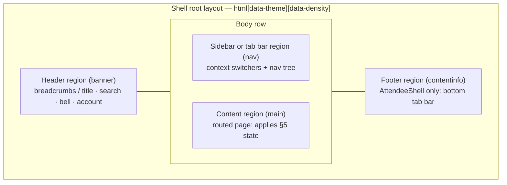
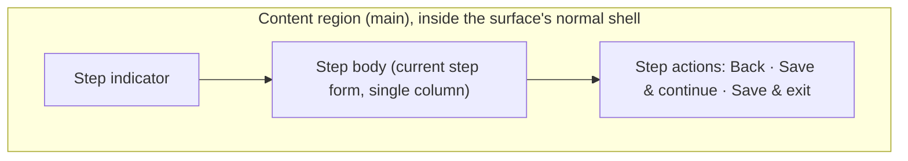

# Application Layout

This document defines the structural shells that every Concourse route renders inside, the canonical page/state taxonomy every page must implement, and the resumable multi-step wizard pattern used by long-form flows. **This document owns shell composition (regions), shell-level responsive structure, the state taxonomy, and the wizard persistence/resume mechanics.** It does not own *what* appears inside those regions: nav trees, switchers, breadcrumbs, and the content shown at each breakpoint belong to [12-navigation-structure.md](12-navigation-structure.md) (its §10 owns nav *content* per breakpoint; this doc's §4 owns the shell *structure* that content renders inside); the route map and context-resolution rules belong to [11-information-architecture.md](11-information-architecture.md); per-route component/data specs belong to [14-page-inventory.md](14-page-inventory.md); design tokens (spacing, color, motion, density) belong to [39-design-system.md](39-design-system.md) and are consumed, not redefined, here.

---

## 1. Scope and ownership

| This doc owns | Owned elsewhere |
|---|---|
| The five shell components (ConsoleShell, PortalShell, AttendeeShell, AdminShell, MarketingShell), their regions, and composition rules | Nav trees, switchers, breadcrumbs, palette scope → [12-navigation-structure.md](12-navigation-structure.md) |
| Shell-level responsive behavior (which regions exist, collapse, or relocate at each breakpoint) | Which nav items render at each breakpoint → [12-navigation-structure.md](12-navigation-structure.md) §10 |
| The canonical page/state taxonomy (loading, empty, error, offline, populated) and its composition within a shell | Per-route assignment of which states apply and their data/component wiring → [14-page-inventory.md](14-page-inventory.md) |
| The resumable multi-step wizard pattern: persistence, resume, and re-entry mechanics | Specific wizard step content (event wizard fields, registration steps) → [05-organizer-journey.md](05-organizer-journey.md), [07-attendee-journey.md](07-attendee-journey.md) |
| Token *consumption* rules for shells (which density/container tokens apply where) | Token *definition* → [39-design-system.md](39-design-system.md) |

Four shells exist, one per authenticated app surface (foundation §5): **ConsoleShell** (Organizer Console), **PortalShell** (Exhibitor Portal), **AttendeeShell** (Attendee App), **AdminShell** (Platform Admin). Every route in [11-information-architecture.md](11-information-architecture.md) §4 renders inside exactly one shell, resolved by URL base path — a Next.js route group per surface (`app/(console)/org/...`, `app/(portal)/exhibit/...`, `app/(attendee)/e/...`, `app/(admin)/admin/...`), each with its own root layout implementing the shell. Auth (`/auth/…`) and Account (`/account/…`) routes render in a fifth, unnamed minimal chrome (logo + content, no nav) since they are pre-context or cross-tenant; they are out of scope for shell naming because no surface owns them exclusively, consistent with how the registry already treats distributed concerns (foundation §13). The Marketing site's 7 public routes ([46-marketing-site.md](46-marketing-site.md), foundation §5 / §14 Amendment A1) render inside a sixth, named shell, **MarketingShell** (§3.5) — unlike the Auth/Account chrome, it is named because it is a real nav+footer shell with a fixed composition, not a bare "logo + content" fallback.

## 2. Shell composition model

### 2.1 Common region set

Every shell is built from the same four region primitives, composed differently per surface. A region that a shell does not use is absent from the DOM, not hidden — Concourse ships no empty landmark elements.

| Region | Landmark role | Purpose |
|---|---|---|
| **Header** | `header` (banner) | Breadcrumbs/page title, search/palette trigger, notification bell, account menu. Sticky at `--mq-z-sticky`. |
| **Sidebar / tab bar** | `nav` | Context switchers + navigation tree (desktop sidebar) or bottom tab bar (mobile). Exactly one of the two forms is mounted at a given breakpoint, never both. |
| **Content** | `main` | The routed page. The only region a page component ever renders into. Owns its own scroll; header/sidebar/footer are fixed relative to viewport. |
| **Footer** | `contentinfo` (AttendeeShell only) / absent elsewhere | Persistent bottom tab bar on the Attendee App. The three tenant-operational shells (Console, Portal desktop, Admin) render no footer — operational density wins over a chrome element that would cost vertical space for no navigational gain on pointer-first, tall-viewport surfaces. |



### 2.2 Shared structural rules

1. **Landmark completeness is mandatory.** Every shell renders `header` → `nav` → `main` in DOM order, matching the design system's accessibility baseline (39 §12.2); a skip link jumps straight to `main`.
2. **The shell owns chrome; the page owns content.** No page component ever renders its own header/sidebar — that would fragment the skip-link target and duplicate landmarks. Pages compose only inside `main`, using the state taxonomy in §5.
3. **Theme and density are stamped once, at the shell root**, not per page (`data-theme`, `data-density` per 39 §3.3/§11) — this is why density can be table-local (39 §11) without every table re-deriving the ambient mode.
4. **Shell identity never changes mid-navigation.** Moving between routes inside one surface never remounts the shell (Header/Nav persist; only `main`'s content swaps) — this is what makes scroll-position restoration (nav doc §4, Attendee back-navigation) and sticky switchers possible. Moving between surfaces (e.g., Console → Portal via the account menu, nav doc §6) is a full navigation and does remount into a different shell.
5. **Container width is a shell concern, token values are a design-system concern.** Each shell's `main` wraps content in the container width defined in 39 §6 (1440px sidebar-shells / 640px Attendee column) — the shell applies the token, it does not define a new value.

## 3. Shell specifications

### 3.1 ConsoleShell

Surface: Organizer Console (`/org/[orgSlug]/…`). Personas: Priya Sharma, Marcus Webb. Desktop-first, pointer-primary.

| Region | Composition |
|---|---|
| Header | Breadcrumb trail (nav doc §7) when `main` renders a content-header title; global search / ⌘K trigger chip; notification bell → `NotificationPanel` popover; account menu — rendered here only while the sidebar is expanded (see §3.1.2). |
| Sidebar | `OrgSwitcher` + (event context only) `EventSwitcher`, then the grouped nav tree (nav doc §2). Collapsible to a 64px icon rail (39 §6); collapsed state relocates the account menu to the sidebar's bottom-left slot, matching nav doc §11. |
| Content | Routed page, max-width 1440px, `--mq-space-gutter` horizontal padding, its own scroll container. Renders the §5 state taxonomy. |
| Footer | Absent. |

**3.1.1 Structural variants.** The sidebar has two structural modes, both still ConsoleShell (this is a nav-tree content swap, not a shell swap): org-level (switcher + 4 flat items) and event-context (switcher stack + 4 grouped sections). Doc 12 §2 owns exactly what renders in each; this doc's contract is that the sidebar *region* has a fixed width and scroll behavior regardless of which tree occupies it, so switching between the two never shifts the content region's origin.

**3.1.2 Breakpoint behavior (shell structure).**

| Breakpoint | Sidebar | Header | Content |
|---|---|---|---|
| `≥ lg` (1024px) | Full sidebar, expanded or rail, always visible | Full header row incl. breadcrumbs | Full width up to 1440px cap |
| `md`–`lg` (768–1023px) | Sidebar collapses to a hamburger-triggered overlay drawer (same nav content, temporary presentation — Radix `Dialog`-backed, not a permanent rail) | Persists; breadcrumbs remain (nav doc §7.1 includes Console at all sizes down to this range) | Full width, gutter narrows to the `<768px` token only below `md` (39 §6) |
| `< md` (mobile) | Same drawer pattern as above; the one named exception is `/check-in`, which suppresses the drawer trigger entirely and renders full-screen, single-purpose, touch-first (nav doc §10) | Reduced to a minimal bar: drawer trigger + title; search/bell collapse into the drawer's header | Single column |

Below `md`, the app additionally overlays a persistent read-only banner when connectivity drops (§5.4); the Console shell has no true offline mode beyond `/check-in`'s local scan queue (JP-2).

### 3.2 PortalShell

Surface: Exhibitor Portal (`/exhibit/[orgSlug]/…`). Personas: Elena Rodriguez (desktop-leaning), Jamal Carter (mobile, at-booth). The one shell that must serve both a desk-admin workflow and a phone-in-hand workflow equally well.

| Region | Composition |
|---|---|
| Header | Breadcrumb trail (≥`md` only, nav doc §7.1); on mobile, a search icon opens the palette instead of an inline trigger (nav doc §8); notification bell; account menu (same expanded/rail relocation rule as §3.1). |
| Sidebar | `OrgSwitcher` (exhibitor orgs) + `EventSwitcher` + tier pill, then the nav tree ordered by revenue-proximity (nav doc §3.2). Desktop only. |
| Content | Routed page, same 1440px/gutter contract as ConsoleShell. |
| Footer | Bottom tab bar **on mobile only** — the one shell whose footer region is conditional on breakpoint rather than fixed by surface identity, because Portal is the one shell that genuinely serves two device classes as primary. |

**3.2.1 Breakpoint behavior (shell structure).**

| Breakpoint | Nav region | Header | Footer |
|---|---|---|---|
| `≥ lg` | Sidebar (full, expanded or rail) | Full header, breadcrumbs | Absent |
| `md`–`lg` | Sidebar → overlay drawer | Same as ConsoleShell's drawer header | Absent |
| `< md` | Sidebar unmounts entirely | Slim bar: search icon, bell, account avatar only | **Bottom tab bar mounts** — 5 items, Capture leftmost (nav doc §3.3) |

**3.2.2 Offline structure.** `/capture` is the one PortalShell route that is fully offline-capable at the shell level: the Content region's header row (inside `main`, per the page's own layout, not the shell Header) carries a persistent sync-status affordance — queued-scan count and a `SyncBadge` — whenever the browser is offline or has queued writes (design system-owned token: `info`/neutral, never `danger`, per 39 §13.3). This is the concrete instance of the Offline state defined generically in §5.4. Detail on the IndexedDB queue itself belongs to [17-offline-sync-architecture.md](17-offline-sync-architecture.md).

### 3.3 AttendeeShell

Surface: Attendee App (`/e/[eventSlug]/…`). Persona: Sofia Lindqvist. Mobile-first; the only shell with no sidebar concept at any breakpoint and the only one with a footer at every breakpoint.

| Region | Composition |
|---|---|
| Header | Contextual, slim, no breadcrumbs (nav doc §7.1 explicitly excludes Attendee): Home renders a greeting + notification bell; detail/list pages render a back affordance + page title; `/badge` and `/scan` render as full-screen sheets that suppress the shell header entirely (they are momentary, single-purpose overlays, not navigable pages). |
| Sidebar/nav | None — replaced entirely by the Footer tab bar at every breakpoint; there is no desktop nav-rail variant. |
| Content | Single centered column, max-width 640px on desktop, full-bleed with `--mq-space-gutter` padding on mobile (39 §6). Always `comfortable` density (39 §11) — never user-switchable. |
| Footer | Persistent bottom tab bar, 5 tabs (Home, Explore, Copilot, Schedule, Profile — nav doc §4), sticky at `--mq-z-sticky`, visible on every route including detail pages (nav doc §4, back returns to the originating list). |

**3.3.1 Breakpoint behavior (shell structure).** AttendeeShell is deliberately breakpoint-*stable* — the same region set mounts at every width; only the Content region's outer wrapper changes.

| Breakpoint | Content wrapper | Tab bar |
|---|---|---|
| `≥ md` (desktop/tablet browser access — a secondary but supported path, e.g. Sofia checking her schedule from a laptop) | Centered 640px column, generous side margins | Unchanged, still bottom-fixed (not converted to a top or side nav — consistency with the phone experience is worth more than "looking native" on desktop for a mobile-primary surface) |
| `< md` | Full-bleed, gutter padding | Unchanged |

**3.3.2 Offline structure.** Per JP-2, Home, Explore's cached directory, Schedule, `/badge`, and the floor `/map` render from the last successful sync when offline; the shell Header's greeting area is replaced by a staleness strip ("Showing yesterday 18:42 — reconnect to refresh") rather than a blocking banner, because the product principle "works in a concrete hall" treats offline as ambient, not exceptional (39 §13.3). Copilot and search render the Offline state (§5.4) rather than degrading, since they have no meaningful cached answer (JP-2 explicitly marks them online-only).

### 3.4 AdminShell

Surface: Platform Admin (`/admin/…`). Persona: Alex Kim only. Internal, desktop-only, density-over-polish by design (39 §2, §13.2).

| Region | Composition |
|---|---|
| Header | Breadcrumb trail (nav doc §7.1 includes Admin); account menu; **no** notification bell (nav doc §11 — ops alerts route to on-call tooling, never in-app) and **no** search-palette trigger separate from ⌘K (palette is keyboard-only here; Alex is presumed at a keyboard). |
| Sidebar | Flat list, no switchers (platform scope has no org/event to switch, nav doc §5). Fixed 240px, not collapsible — nine items never justifies a rail, and building a collapse affordance for a nine-row internal list is exactly the kind of engineering JP-4's "minimum viable, depth later" discipline argues against. |
| Content | Routed page, 1440px cap, same gutter contract as the other sidebar shells. |
| Footer | Absent. |

**3.4.1 Breakpoint behavior (shell structure).** AdminShell is the one shell with a hard floor rather than a graceful collapse:

| Breakpoint | Behavior |
|---|---|
| `≥ md` | Full shell as specified above; no responsive changes above this floor — Alex's environment is a desk, so no `lg` distinction is drawn (unlike ConsoleShell/PortalShell, which reserve `lg` for the drawer transition). |
| `< md` | The shell does not render. A dedicated `UnsupportedViewportNotice` full-screen state (no Header/Sidebar/Content split) renders instead: an explanation and a link to `/admin`, expecting the user to switch devices. Justification: this is the one Concourse surface with a single named user and no field/floor use case (contrast Console's `/check-in`, which *must* work touch-first because door staff carry phones) — building and QA-ing a phone layout for Alex is effort with no persona-driven payoff. |

### 3.5 MarketingShell

Surface: Marketing site (`/`, `/pricing`, `/about`, `/contact`, `/help`, `/legal/privacy`, `/legal/terms` — foundation §5, [46-marketing-site.md](46-marketing-site.md)). No persona login required; visitors are anonymous or signed-in-but-browsing. Public, desktop-and-mobile, always static/RSC — the one shell with no auth and no tenant context at all.

| Region | Composition |
|---|---|
| Header | `MarketingHeader` (doc 46 §3.1): logo, product/pricing/about/help links, Log in / Sign up — or, for a signed-in visitor, an account menu ("Go to my events" → `/auth/select-context`, "Log out") in their place. No breadcrumbs, no search/⌘K trigger, no notification bell — none of those concepts exist pre-context. Sticky at `--mq-z-sticky`, 56px. |
| Sidebar / tab bar | **Absent entirely** — the one shell with neither a sidebar nor a tab bar at any breakpoint. There is no context to switch and no per-surface nav tree; the header's flat link row is the whole of navigation, consistent with doc 46 §1's framing of this as chrome, not a tenant surface. |
| Content | Routed page, no shell-level container cap beyond ordinary marketing-page measure (each page's own block layout, doc 46 §4–§9) — unlike the four authenticated shells, there is no 1440px sidebar-shell contract to apply because there is no sidebar. Always static/RSC, no client-side data fetching gate on first paint (doc 46 §10 performance rule). |
| Footer | `MarketingFooter` (doc 46 §3.2): four-column link grid (Product / Company / Resources / Legal), collapsing to an accordion stack `<768px`; copyright, social icons, fixed "English (US)" language indicator. Present on every one of the 7 routes — the only shell besides AttendeeShell with a footer on every route, though structurally a full link footer rather than a tab bar. |

**3.5.1 What's structurally distinct from the four authenticated shells.**

1. **No auth or tenant context.** MarketingShell never resolves `organization`/`event` scope (foundation §8) and never sets `app.current_org_id`/`app.current_user_id` — there is nothing for RLS to scope. This is the same "no context" fact doc 46 §1 states; here it is the shell-structural consequence: no switcher, no context-dependent nav tree, ever.
2. **Public nav + footer, not sidebar + tab bar.** Every authenticated shell's primary nav region is a sidebar (desktop) or tab bar (mobile) per §2.1; MarketingShell instead uses a light header link row plus a full footer link grid — a brochure-site nav pattern, not an app-navigation pattern, because there is no working set of records to navigate between (doc 46 §3's "no sidebar, no context switcher, no density mode" framing).
3. **No density mode.** `data-density` is not stamped by this shell (§2.2 rule 3 assumes a density-aware shell root; MarketingShell opts out) — marketing pages are always `comfortable`-equivalent spacing, a fixed choice rather than a per-tenant or per-user setting (doc 46 §3).
4. **SEO/metadata is a shell-level concern here, uniquely.** None of the four authenticated shells emit `<title>`/OG/Twitter-card/structured-data metadata as a shell responsibility (their pages are behind auth, not indexed); MarketingShell's root layout is where the doc 46 §10 conventions (title template, canonical URL, Open Graph, `robots.txt`, `sitemap.xml`, `Organization`/`FAQPage` JSON-LD) are actually wired in, since every one of the 7 routes must carry them.
5. **No state-taxonomy Offline variant.** Static/RSC rendering with no client-side data dependency on first paint means §5.4's Offline state does not apply here the way it does to Console's `/check-in` or Portal's `/capture` — a marketing page that's already rendered has nothing left to go stale against until the visitor navigates, at which point it is an ordinary navigation, not an offline state.

**3.5.2 Breakpoint behavior (shell structure).**

| Breakpoint | Header | Nav | Footer |
|---|---|---|---|
| `≥ md` (768px) | Full link row (Product ▾, Pricing, About, Help) + Log in/Sign up or account menu | N/A (no sidebar/tab bar at any width) | Four-column grid |
| `< md` (mobile) | Logo + hamburger → full-screen sheet nav (Radix `Dialog`, doc 46 §3.1), same links stacked, CTAs pinned to the bottom of the sheet | N/A | Accordion stack, one column at a time |

Unlike ConsoleShell/PortalShell's `lg` drawer transition or AdminShell's hard `md` floor, MarketingShell has exactly one structural breakpoint (the header's row-to-sheet collapse) — the shell is otherwise breakpoint-stable, similar in spirit to AttendeeShell's stability (§3.3.1) but without a persistent tab bar to keep fixed.

## 4. Responsive breakpoint reference

### 4.1 Canonical scale

Concourse defines no custom breakpoint tokens — it uses the Tailwind 4 default scale directly, the same "one scale, one truth" discipline the design system applies to spacing (39 §6):

| Name | Min width | Primary shell-structural role |
|---|---|---|
| (base) | 0px | Attendee full-bleed; Console/Portal/Admin never render below `md` without a fallback state |
| `md` | 768px | Portal: sidebar unmounts, footer tab bar mounts. Admin: floor below which `UnsupportedViewportNotice` replaces the shell. Design system gutter step-up (39 §6). |
| `lg` | 1024px | Console/Portal: sidebar collapses from a permanent rail to an overlay drawer below this width. |
| `xl` | 1280px | No shell-structural change; content-level responsive behavior (e.g., dashboard grid columns, 39 §6) is a page concern. |
| `2xl` | 1536px | No shell-structural change. |

### 4.2 Cross-shell structural summary

This table is the shell-level companion to nav doc §10 (which owns the nav *content* at each row); here the same breakpoints are read as *which regions exist*.

| Shell | `< md` | `md`–`lg` | `≥ lg` |
|---|---|---|---|
| ConsoleShell | Sidebar → drawer (`/check-in` exempt: full-screen) | Sidebar → drawer | Sidebar permanent (expanded/rail) |
| PortalShell | Sidebar unmounted; **Footer tab bar mounted** | Sidebar → drawer; no footer | Sidebar permanent; no footer |
| AttendeeShell | Full-bleed content; footer tab bar (always) | Centered column begins; footer tab bar (always) | Centered column; footer tab bar (always) |
| AdminShell | Shell does not render — `UnsupportedViewportNotice` | Full shell (floor is `md`, not `lg`) | Full shell |
| MarketingShell | Header collapses to hamburger + sheet; footer accordion-stacks | Header row + footer grid (same as `≥ lg`) | Header link row + footer grid; no sidebar/tab bar at any width |

## 5. Page and state taxonomy

Every route specified in [14-page-inventory.md](14-page-inventory.md) must implement its applicable states from this fixed set of five. A page never invents a sixth ad hoc state — if a situation doesn't fit, it is a variant of one of these five (see §5.5 for how entitlement-gating composes with Populated rather than becoming a state of its own). States render entirely inside the shell's Content region (§2.2 rule 2); they never affect Header/Sidebar/Footer, which is what lets a user retain full navigation while a page is loading, empty, or broken.

### 5.1 Loading / skeleton

The default state for any page whose data is not yet available on first paint. Per the design system's "fast is the feature" principle (39 §2), Concourse never shows a bare spinner for page-level loads — only `Skeleton` shapes matching the eventual layout (card outlines, table row placeholders, text-line bars), pulsing at the `--mq-duration-deliberate` (500ms) rhythm (39 §9). Skeletons crossfade to real content on arrival rather than popping. Breadcrumb leaf segments and switcher labels use a skeleton chip while their entity name is being fetched (nav doc §7.4) — this is the same primitive, scoped to a fragment rather than a whole page. Spinners are reserved for sub-page actions with no layout to preview (button submit state, inline "loading more" at a list's end).

### 5.2 Empty

A collection page (list, board, dashboard) with zero rows for reasons other than an error. Per JP-7 ("no dead ends") and voice & tone (39 §13.3), every empty state names *why* it's empty when that's informative (pre-event vs. genuinely nothing) and offers the next action as a primary button, using a spot illustration (39 §14.3), never a bare "No results" line. Example already locked in the design system: "No leads yet — scan your first badge." Search/filter-produced emptiness ("no results for *q*") is a distinct, lighter-weight variant: it clears filters as its action rather than proposing a creation flow.

### 5.3 Error

A page or a region within a page that failed to load or failed to submit. Error state follows the voice rule in 39 §13.3 (what happened + how to recover, machine code collapsed) and is scoped as narrowly as possible: a failed widget inside an otherwise-fine dashboard shows its own inline error card, not a full-page replacement — the rest of the page stays usable. Full-page errors are reserved for failures of the page's primary data dependency (e.g., the event itself 500s). Distinct from **403/404**, which are routing-level outcomes resolved before a shell page mounts its own state machine (doc 11 §3.3, nav doc §9) — they render as dedicated pages inside the same shell (so navigation stays available) but are not re-entrant "retry" states like §5.3's error.

### 5.4 Offline

Connectivity absence or degradation, scoped per JP-2's classification (some flows are offline-sacred, most degrade honestly). Offline is styled as **informational, never `danger`** (39 §13.3) — a neutral/`info`-family banner or inline badge, never red. Two structural variants:

1. **Read-from-cache**: page renders normally from the last-synced snapshot with a staleness indicator (last-sync timestamp). Applies to Attendee's badge/schedule/map/saved-exhibitors (§3.3.2) and, more narrowly, Console's `/check-in` scan queue.
2. **Write-queued**: the user can still act; actions queue locally (IndexedDB, client-generated idempotency keys per [18-api-architecture.md](18-api-architecture.md) §3.6) and a count-bearing `SyncBadge` shows pending items. Applies to Portal's `/capture` (§3.2.2) and Console's `/check-in` scans.

Anything not on JP-2's offline-tolerant list (Copilot, Smart Matchmaking, live dashboards, payments, publishing) shows a **blocking, explicit** offline notice instead of a spinner or a silent failure — foundation principle 1 forbids pretending an online-only feature is "still loading" when the real cause is connectivity.

### 5.5 Populated

The default, successful state: real data, fully rendered. Two documented variants compose with Populated rather than existing as separate top-level states:

- **Partial/degraded-data variant**: an AI-dependent widget (e.g., a Lead Intelligence score) is unavailable while everything else on the page is populated — per JP-5, the widget falls back to its deterministic equivalent in place, never to an error card, because AI is an additive layer and its absence is not a page failure.
- **Locked (entitlement-gated) variant**: the page or a specific module is real, routable, and rendered — never a 404, since the URL is genuine (nav doc §9) — but its content is replaced by a lock affordance and an upgrade CTA (nav doc §2.2's "locked, not hidden" rule extended from nav items to page content). This is the state nav doc §9 cites: *"Session, permission ok, missing entitlement → Page-level locked state with upgrade path."* It differs from §5.3 Error (nothing failed) and from §5.2 Empty (there would be data if entitled) — it is Populated in structure, gated in content.

## 6. State composition within shells

How the five states occupy a shell's regions. Header/Sidebar/Footer are unaffected by page state (rule 2, §2.2); only Content changes, and only in the ways below.

| State | Header | Sidebar/tab bar | Content | Footer |
|---|---|---|---|---|
| Loading | Renders normally; breadcrumb leaf shows a skeleton chip if the entity name isn't resolved yet | Renders normally, fully interactive — navigating away cancels the in-flight load | Skeleton shapes matching final layout | Renders normally (Attendee) |
| Empty | Normal; breadcrumb resolved (the collection exists, it's just empty) | Normal | Illustration + message + primary action | Normal |
| Error | Normal (nav must stay usable so the user can leave) | Normal | Inline error card (scoped) or full-page error card (primary-dependency failure), with a retry action | Normal |
| Offline (read-from-cache) | Normal, plus a staleness strip in the Attendee Header (§3.3.2) | Normal | Cached content + timestamp; disabled affordances for online-only actions show a tooltip explaining why | Normal |
| Offline (write-queued) | Normal | Normal | Content renders live-optimistic with queued items visually marked (per component inventory's forthcoming offline-state variants) | `SyncBadge` count may surface as a tab-bar dot (Portal mobile Capture tab) |
| Populated | Normal | Normal, current route highlighted | Full content | Normal |
| Populated → Locked | Normal | Item shown locked-not-hidden if it's the nav entry itself (nav doc §2.2); unaffected if entitlement is page-internal | Lock affordance + upgrade CTA in place of gated content/module | Normal |

## 7. Resumable multi-step wizard pattern

Per JP-8 ("journeys are resumable across weeks"), every multi-step creation/onboarding flow — the event creation wizard (O-2), exhibitor onboarding, and the attendee registration flow — persists progress server-side and re-enters at "what's next," never a blank first step. This section specifies the one pattern all of them implement; step-specific field content is owned by the journey docs (04–07).

### 7.1 WizardShell composition

A wizard is not a fifth shell — it is a **Content-region layout pattern** rendered inside the surface's normal shell (ConsoleShell for the event wizard, AttendeeShell for registration), so the user never loses their place in the app; Header/Sidebar/Footer behave exactly as specified in §2–§3 for that surface. Inside `main`, `WizardShell` adds one more nested structure:

| Sub-region | Purpose |
|---|---|
| Step indicator | Numbered steps with labels; completed / current / upcoming / invalid states. On ConsoleShell (desktop), a horizontal stepper above the form. On AttendeeShell (mobile), a slim progress bar + "Step 2 of 3" text — a full horizontal stepper doesn't fit a 375px viewport at 44px touch targets (39 §12.3). |
| Step body | The current step's form, inside a card, max-width narrower than the shell's full content cap (720px) — wizards are always single-column, never dashboard-width, per JP-4's "one thing at a time" bias. |
| Step actions | Back / Save & continue (primary) / Save & exit. "Save & exit" is always present and never destructive — it is functionally identical to Save & continue, minus advancing, because every step write is already persisted (§7.2) the moment it's valid. |



### 7.2 State persistence mechanics

Two persistence modes, chosen per wizard by whether a real owning entity can exist before the flow completes:

1. **Entity-backed wizards** — used whenever the target row's identity-defining fields (the ones a URL/slug depends on) are known at step 1. The owning row is created immediately, in its natural "incomplete" status, and each subsequent step is a `PATCH` against that same row or its children — there is no separate draft representation to reconcile later. The event creation wizard (§7.4) is this mode: an `events` row is created in status `draft` as soon as name + slug are captured, and Venue/Team steps patch that row and write `event_staff` rows; the wizard's final "Review & create" step is a confirmation of already-persisted data, not a first write.
2. **Pre-entity wizards** — used when no real owning row can exist yet because the flow starts before identity is confirmed (attendee registration starts from an emailed magic link, before Sofia's `users` row is even certainly linked to this browser). Progress is held in a `wizard_drafts` record instead:

```
wizard_drafts
  id                 uuid (pk)
  wizard_kind        text            -- 'attendee_registration' | 'event_creation' (mode 2 cases only)
  resume_token        text (unique)   -- opaque, delivered via the same channel that started the flow
  event_id            uuid (fk, nullable)  -- scoping context once known (e.g., which event's registration)
  current_step        text
  payload             jsonb           -- accumulated, validated field values keyed by step
  expires_at           timestamptz
  created_at / updated_at  timestamptz
```

  On the final step, the accumulated `payload` materializes into the real entity (a `registrations` row, plus any `attendee_interests`) in one transaction, and the `wizard_drafts` row is deleted — it is scratch space, never a secondary source of truth for the same fact (foundation principle 3). Column-level detail and indexing for this table are formalized in [16-database-schema.md](16-database-schema.md); this document fixes only the mechanism and the two required fields (`resume_token`, `payload`) that make resume possible.

Both modes persist **after every valid step**, not only on explicit "Save" — the "Save & continue"/"Save & exit" distinction in §7.1 is about navigation, not about whether a write happens; a write happens as soon as a step passes validation, matching JP-4's incremental-write framing for the event wizard ("each writing incrementally").

### 7.3 Resume / re-entry algorithm

```mermaid
stateDiagram-v2
    [*] --> ResolveEntry: user opens wizard URL or resume link
    ResolveEntry --> NoPriorProgress: no owning row / no wizard_drafts row for this user+kind
    ResolveEntry --> PriorProgressFound: owning row (incomplete status) or unexpired wizard_drafts row exists
    NoPriorProgress --> Step1: render step 1, empty
    PriorProgressFound --> ComputeFurthestValidStep: load persisted payload/entity state
    ComputeFurthestValidStep --> LandOnNextStep: land on first incomplete step, prior steps shown filled + editable
    LandOnNextStep --> ShowWhatChanged: banner — "You started this on {date}; here's where you left off"
    Step1 --> InProgress
    ShowWhatChanged --> InProgress
    InProgress --> InProgress: Save & continue / Back (always persists)
    InProgress --> Completed: final step confirmed
    Completed --> [*]: owning entity fully created / materialized; wizard chrome unmounts
```



Rules that make this concrete and testable:

1. **Resume is automatic, not user-invoked.** There is no "resume draft" button to remember — hitting the wizard's entry URL (or a resume link from a reminder notification, [33-notification-system.md](33-notification-system.md)) always re-evaluates progress and lands on the right step. This is JP-8's "re-entry lands on your next action, not a blank dashboard" applied literally.
2. **"Furthest valid step," not "last step visited."** If step 3 was left invalid or was never reached, resume lands there even if the user had clicked ahead and back — wizards never resume into a step whose prerequisites aren't actually satisfied.
3. **Every prior step remains editable from the stepper**, not just forward navigation — per JP-4, none of this is a one-way funnel.
4. **Expiry differs by mode.** Entity-backed wizards never expire (a `draft` event can sit for months — this is exactly JP-8's "multi-week gaps are the norm"). Pre-entity wizards expire (`wizard_drafts.expires_at`, default 14 days for attendee registration, chosen to comfortably exceed the gap between an event's invite email and typical registration behavior while not accumulating indefinite unclaimed drafts) — expiry renders a specific recovery state ("re-request your link"), the same pattern nav doc §9 specifies for expired invite/magic-link tokens, not a generic error.
5. **Concurrent edits are last-write-wins per step**, scoped to a single owner (the creating user for entity-backed; the token holder for pre-entity) — wizards are single-actor flows by construction (event team assignment happens in step 3 of *authoring*, not as a second author of the wizard itself), so optimistic-concurrency conflict handling ([18-api-architecture.md](18-api-architecture.md) §3) is unnecessary here.

### 7.4 Worked example: event creation wizard (O-2)

Route `/org/[orgSlug]/events/new` ([05-organizer-journey.md](05-organizer-journey.md) O-2), rendered inside **ConsoleShell**, entity-backed mode (§7.2 mode 1).

| Step | Persisted write on completion | Resume landing if left here |
|---|---|---|
| 1. Basics | Creates `events` row, status `draft`: name, slug, dates, timezone, attendance band, category | Step 1 pre-filled (only reachable state if the row doesn't exist yet — but it always will once name+slug are entered, since that's the same keystroke that creates the row) |
| 2. Venue | `PATCH events` (venue reference) or creates a `venues` row | Step 2, Basics shown complete in the stepper |
| 3. Team | Creates `event_staff` rows | Step 3 |
| 4. Review & create | No new write — this step reads back the already-persisted row and confirms; its action is semantic ("this event is ready to leave the wizard"), not transactional | N/A — completing step 3 with valid data is sufficient for exit to land on the event overview per O-2; step 4 exists for human confirmation, not data integrity |

On completion, exit lands on `/org/[orgSlug]/events/[eventSlug]` in its **readiness-checklist** rendering (O-2), itself a Populated-state page that is really "the wizard's natural successor" — this is the concrete instance of JP-8's "what changed since you left + your next action," continued past the wizard boundary into the event's ordinary lifecycle.

### 7.5 Worked example: attendee registration flow

Route `/e/[eventSlug]/register` ([11-information-architecture.md](11-information-architecture.md) §4.7; step detail owned by [07-attendee-journey.md](07-attendee-journey.md)), rendered inside **AttendeeShell**, pre-entity mode (§7.2 mode 2) — chosen because the flow starts from an unauthenticated magic-link send, before any `registrations` row (or, for a first-time platform user, any `users` row) can exist.

| Step | Held in `wizard_drafts.payload` until materialization | Resume mechanism |
|---|---|---|
| 1. Email → magic link sent | `{ email }`; `resume_token` embedded in the emailed link | Clicking the emailed link is the resume path — no separate "continue where I left off" screen is needed because the link *is* the resume token |
| 2. Interests | Adds `{ interests: [...] }` to payload | Re-opening the same link (or, once claimed, the plain `/e/[eventSlug]/register` URL while authenticated) lands on Interests with Email already resolved |
| 3. Badge / confirmation | Materializes `registrations` (status `registered`, `badge_code` generated) + `attendee_interests` rows in one transaction; `wizard_drafts` row deleted | Not resumable past this point — registration exists, so re-visiting `/register` redirects to the Home tab per doc 11 §3.3's redirect rule for already-registered users |

Because step 1 spans an email round-trip (minutes to days), this is JP-8's sharpest test case: the resume token in the link, not a session, is what carries continuity — consistent with how invite/magic-link tokens already behave everywhere else in the product (nav doc §9).

## 8. Ownership and cross-references

| Concern | Owner |
|---|---|
| Shell components (ConsoleShell, PortalShell, AttendeeShell, AdminShell), their regions, and shell-level breakpoint structure | **This document** |
| Page/state taxonomy (loading, empty, error, offline, populated) and its shell composition | **This document** |
| Resumable wizard pattern: persistence mechanics, resume algorithm | **This document** |
| Nav trees, switchers, breadcrumbs, command palette, deep-linking, nav content per breakpoint | [12-navigation-structure.md](12-navigation-structure.md) |
| Route map, URL/slug conventions, context resolution, 403/404 semantics | [11-information-architecture.md](11-information-architecture.md) |
| Per-route page specs: which states apply, components, data, access — using this doc's taxonomy | [14-page-inventory.md](14-page-inventory.md) |
| Concrete component list (`Skeleton`, `SyncBadge`, `WizardShell` internals, `UnsupportedViewportNotice`, illustrations) | [15-component-inventory.md](15-component-inventory.md) |
| Design tokens consumed by shells (spacing, container widths, density, motion, z-index) | [39-design-system.md](39-design-system.md) |
| `wizard_drafts` column-level schema and indexing | [16-database-schema.md](16-database-schema.md) |
| Offline queue mechanics behind §3.2.2/§5.4 write-queued state | [17-offline-sync-architecture.md](17-offline-sync-architecture.md) |
| Journey-specific wizard step content (event wizard, registration, exhibitor onboarding) | [05-organizer-journey.md](05-organizer-journey.md), [06-exhibitor-journey.md](06-exhibitor-journey.md), [07-attendee-journey.md](07-attendee-journey.md) |
