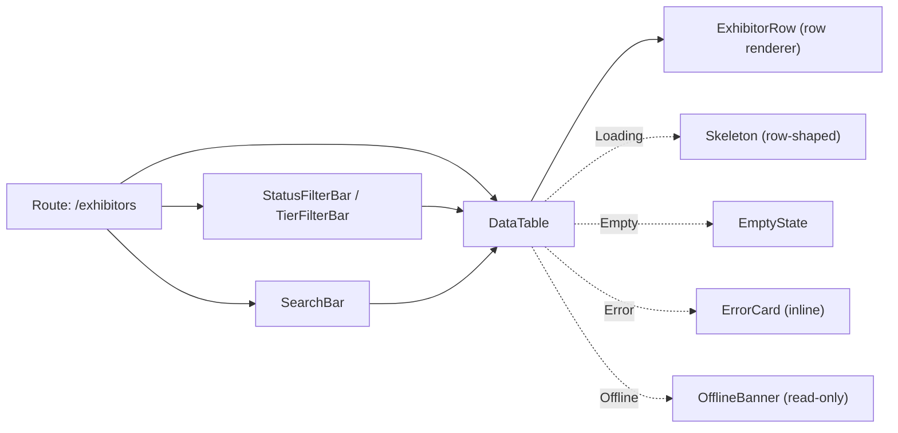
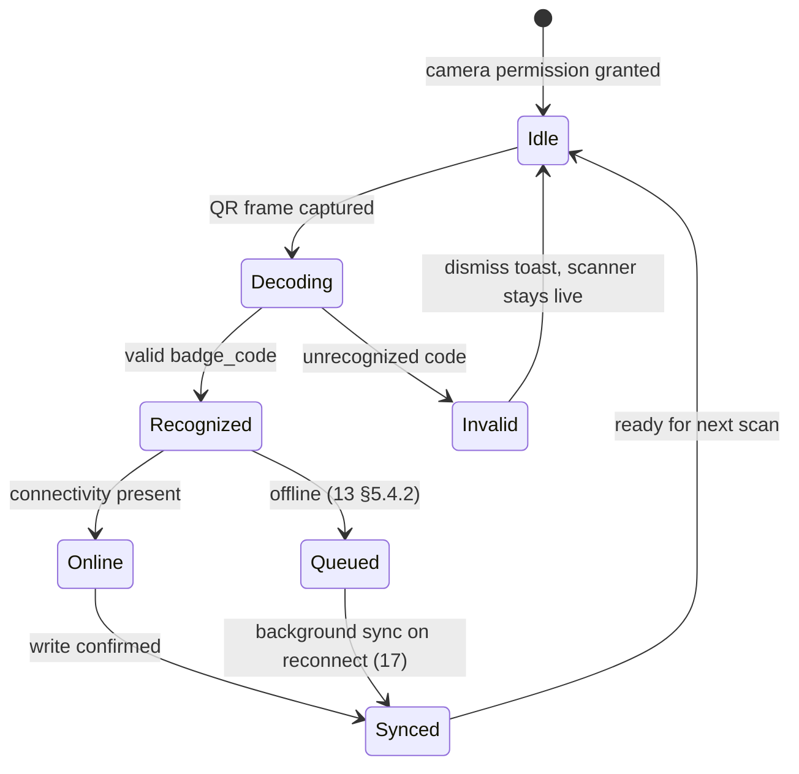

# Component Inventory

This document is the concrete component list promised by [39-design-system.md](39-design-system.md) §1's ownership table: every component named across [12-navigation-structure.md](12-navigation-structure.md), [13-application-layout.md](13-application-layout.md), [14-page-inventory.md](14-page-inventory.md), and [39-design-system.md](39-design-system.md), given a stated purpose, the surfaces/pages that use it, its key props at a conceptual level, and its states per the five-state taxonomy in [13-application-layout.md](13-application-layout.md) §5. **This document owns:** the canonical component name, its purpose, its usage sites, its conceptual prop surface, and its state behavior. **It does not own:** full TypeScript prop signatures, generic constraints, or engineering/versioning conventions ([40-ui-component-library.md](40-ui-component-library.md)); design tokens or token values ([39-design-system.md](39-design-system.md)); which pages exist or their route-level data/access rules ([14-page-inventory.md](14-page-inventory.md)); or shell/state-taxonomy definitions themselves ([13-application-layout.md](13-application-layout.md)). All names conform to [00-foundation.md](00-foundation.md) — no persona, product name, or entity name here deviates from that registry.

---

## 1. Scope and Ownership

| This doc owns | Owned elsewhere |
|---|---|
| Canonical component names and the resolution of any naming inconsistency between other docs (§8) | Token values consumed by components | [39-design-system.md](39-design-system.md) |
| Purpose and usage sites (surface/page) per component | Full prop types, generics, versioning policy | [40-ui-component-library.md](40-ui-component-library.md) |
| Conceptual prop surface (names and intent, not types) | Route existence, per-route data/access rules | [14-page-inventory.md](14-page-inventory.md) |
| Component-level state behavior, expressed via the five-state taxonomy | The taxonomy's definitions and shell composition rules | [13-application-layout.md](13-application-layout.md) |
| Grouping components into a build-order category scheme | Column-level schema behind any entity a component displays | [16-database-schema.md](16-database-schema.md) |

## 2. How to Read This Inventory

### 2.1 Categories

Components are grouped into five categories, matching how a team would actually staff and sequence the `packages/ui` build:

1. **Navigation and shells** — switchers, palette, account/notification chrome, wizard scaffolding.
2. **Data display** — tables, headers, cards, charts, tiles: components that render entity state without collecting input.
3. **Forms and inputs** — anything that collects, filters, or mutates data.
4. **Feedback and status** — the concrete building blocks of the five-state taxonomy (skeletons, empty/error/offline/locked composites) plus small status primitives (`Badge`, `Kbd`).
5. **Domain-specific** — components inseparable from one of Concourse's four core domain concepts: booth/registration (floor, badge, scan), lead & pipeline (capture, scoring, meetings), agenda (sessions, speakers, check-in), and AI (Expo Copilot, Smart Matchmaking, Lead Intelligence, Follow-up Studio, Organizer Pulse — foundation §10).

A component sits in exactly one category, chosen by its dominant nature: a form that only exists to configure one domain concept (e.g., `TierPricingForm`) still counts as **Forms and inputs**, because its interaction pattern is generic; a component whose entire reason to exist *is* one domain concept (e.g., `BadgeScanner`, `MatchScoreChip`) sits in **Domain-specific**.

### 2.2 Columns and state shorthand

Every table uses the same four columns beyond the name: **Purpose**, **Surfaces / Pages**, **Key Props (conceptual)**, **States**. States reuse the shorthand fixed by [14-page-inventory.md](14-page-inventory.md) §1, itself derived from [13-application-layout.md](13-application-layout.md) §5: `L` = Loading/skeleton, `E` = Empty, `Err` = Error, `Off` = Offline, `P` = Populated, `P→Locked` = Populated's entitlement-gated variant (13 §5.5). A component that is purely presentational (a chip, a badge, an icon button) has no state machine of its own — its cell reads **"presentational — inherits container state"** rather than restating "n/a" five times.

### 2.3 Family tables

Where the page inventory names many structurally identical components (row renderers passed into `DataTable`, filter bars, wizard steps), this document uses one **family table**: a shared row explaining the pattern once, followed by a compact per-variant table (name, entity, page) rather than repeating five identical Props/States cells. This is the same "one source of truth" discipline foundation principle 3 applies everywhere else — a row renderer's state machine *is* `DataTable`'s, not a second one to maintain.

### 2.4 Composition example

How the family pattern assembles on a typical list route (e.g., `/org/[orgSlug]/events/[eventSlug]/exhibitors`, 14 §5):

## 3. Navigation and Shells

Components that answer "where am I / where can I go" — rendered in shell Header/Sidebar/Footer regions (13 §2.1) or as the `main`-region scaffolding a page composes into (`WizardShell`).

| Component | Purpose | Surfaces / Pages | Key Props (conceptual) | States |
|---|---|---|---|---|
| `OrgSwitcher` | Switch the `[orgSlug]` route segment; lists the user's memberships of the surface-appropriate org kind (12 §6) | ConsoleShell, PortalShell sidebars | `currentOrg`, `memberships[]`, `kindFilter` (`organizer`\|`exhibitor`), `onSelect`, `showCreateAction` (Console only) | L: skeleton label on first mount · E: n/a (a session always has ≥1 membership by the time a shell renders) · Err: inline "couldn't load organizations" in the popover · Off: cached list, disabled if it would navigate to an uncached org · P: current org as text + dropdown |
| `EventSwitcher` | Switch the `[eventSlug]` route segment; Console orders `live`/`published` first then by start date, Portal orders by participation (12 §6) | ConsoleShell, PortalShell sidebars (event context only) | `currentEvent`, `events[]` (with `status`), `onSelect` (preserves current section, 12 §6) | L: skeleton label · E: n/a (only rendered once ≥1 event/participation exists) · Err: inline retry in popover · Off: cached list, status pills may be stale · P: current event + status pill (draft/published/live/completed/archived) as text + dropdown |
| `EventPicker` | Full context change across the whole `/e/[eventSlug]` prefix for attendees with multiple registrations (12 §6) | AttendeeShell — Profile → "My events" | `registrations[]`, `onSelect` (full navigation, not a header control) | L: skeleton list · E: n/a (only rendered for ≥2 registrations) · Err: inline retry · Off: cached registration list · P: list of events Sofia is registered for |
| `CommandPalette` | ⌘K: combined navigation + entity search + action commands, scoped per surface (12 §8) | ConsoleShell, PortalShell (desktop inline trigger / mobile search-icon trigger), AdminShell (keyboard-only) | `scope` (org\|event\|admin), `resultGroups` (nav, entities, actions), `onCommand`, `recentItems[]` | L: skeleton result rows while the aggregate search debounces · E: "No matches" (lighter variant, 13 §5.2) · Err: inline "search failed" row · Off: nav-only results (entity search needs connectivity) · P: grouped, keyboard-navigable result list |
| `AccountMenu` | Identity, "My account", eligible surface-switch links, theme, sign out — identical across all four shells (12 §11) | ConsoleShell, PortalShell, AttendeeShell (Profile tab foot), AdminShell | `user`, `avatarUrl`, `eligibleSurfaces[]`, `theme`, `onSignOut` | L: skeleton avatar chip · E: n/a · Err: inline "couldn't sign out" toast on action failure · Off: fully available (local session data) · P: menu with identity + links |
| `NotificationPanel` | Bell-triggered popover inbox for Console/Portal (12 §11) | ConsoleShell, PortalShell headers | `notifications[]`, `unreadCount`, `onMarkRead`, `onOpenAll` | L: skeleton rows · E: "You're all caught up" · Err: inline retry · Off: cached last-fetched page · P: chronological list, unread visually distinct |
| `Breadcrumbs` | The concrete component behind "breadcrumb trail" (12 §7, 13 §3.1/§3.2/§3.4): derived from route segments below the context switchers, max 3 rendered levels, leaf never a link | ConsoleShell, PortalShell (≥`md`), AdminShell headers | `segments[]` (label, href), `maxLevels` (3), `collapseMiddle` | L: leaf segment renders a skeleton chip while its entity name resolves (12 §7.4) · E: n/a · Err: n/a (a resolved route always has a name; a 404/403 pre-empts mounting, 13 §5.3) · Off: labels served from cache · P: linked trail, leaf as plain text |
| `WizardShell` | The resumable multi-step Content-region layout pattern (13 §7.1): step indicator + step body + step actions | ConsoleShell (`events/new`), AttendeeShell (`register`) — any entity-backed or pre-entity wizard | `steps[]` (label, status: completed\|current\|upcoming\|invalid), `currentStep`, `onBack`, `onSaveAndContinue`, `onSaveAndExit`, `layout` (horizontal stepper desktop / progress bar + "Step n of m" mobile, 13 §7.1) | L: current step body skeleton on resume; prior steps show filled (13 §7.3) · E: n/a · Err: inline per-field validation on the current step only · Off: blocking — entity-backed and pre-entity writes both require connectivity (13 §7.2) · P: current step form, "Save & exit" always enabled |
| `ContextChooser` | Post-auth landing decision surface: lists org memberships and event registrations, auto-forwards on exactly one (14 §2, `/auth/select-context`) | Minimal auth chrome — `/auth/select-context` | `memberships[]`, `registrations[]`, `onSelect`, `autoForwardIfSingle` | L: skeleton `MembershipCard`/`RegistrationCard` grid · E: "You don't belong to any organization or event yet" + creation/browse CTAs · Err: full-page retry · Off: blocking — this page's job is a live decision (14 §2) · P: card grid |
| `UnsupportedViewportNotice` | Full-screen fallback replacing the entire shell below AdminShell's `md` floor (13 §3.4.1) | AdminShell only, `< md` | `message`, `homeHref` (`/admin`) | No Header/Sidebar/Content split — it *is* the state. Single always-populated notice; no L/E/Err/Off variants apply. |

## 4. Data Display

Components that render entity state without collecting input. `DataTable` is the workhorse of every list/collection route in the inventory; its row-renderer family covers 17 page-specific column configurations that all inherit `DataTable`'s own state machine (§2.3).

### 4.1 `DataTable`

| Aspect | Detail |
|---|---|
| Purpose | The single tabular list component for every collection route across all four tenant shells — sortable, filterable (paired with a Filter Bar, §5.4), paginated per the cursor envelope (00 §9), row-clickable to a detail route. |
| Surfaces / Pages | Every `DataTable (XRow)` reference in 14 §4–§9 — 17 distinct entities across Console, Portal, and Admin. Never used in AttendeeShell (Attendee lists use card grids — `ExhibitorDirectory`, `ListingGrid` — per the touch-first, non-tabular design bias of 39 §11). |
| Key props (conceptual) | `rows`, `rowRenderer` (the `XRow` column-set component, see 4.2), `columns` (derived from `rowRenderer`), `sort`, `pagination` (`cursor`, `hasMore`), `density` (per-table override persisted per user, 39 §11), `selection` (optional checkbox column, used only where a bulk action exists, e.g. CSV-invite preview), `onRowClick`, `emptyState` (slot, defaults to the route's `EmptyState`, §6.2), `stickyHeader` (`--mq-z-sticky`, 39 §10). |
| States | L: skeleton row placeholders matching `--mq-table-row-h` (39 §11) · E: `EmptyState` slot (route-specific copy, 13 §5.2) · Err: inline `ErrorCard` scoped to the table region, rest of page usable (13 §5.3) · Off: read-only banner variant — sort/filter stay client-side over the cached page, write actions disabled (12 §10) · P: full sortable/filterable table |

### 4.2 Row renderer family

Each `XRow` component is a column-set definition consumed by `DataTable` — not an independent component with its own state machine (§2.3). Conceptual props for every row renderer: `entity` (the row's data object) and `actions[]` (row-level menu items, permission-filtered).

| Row renderer | Entity | Page(s) |
|---|---|---|
| `EventRow` | `events` | `/org/[orgSlug]/events` |
| `MembershipRow` | `organization_memberships` | `/org/[orgSlug]/team`, `/exhibit/[orgSlug]/settings` |
| `ExhibitorRow` | `event_exhibitors` | `/org/.../exhibitors` |
| `AgendaSessionRow` | `agenda_sessions` | `/org/.../agenda` |
| `RegistrationRow` | `registrations` | `/org/.../attendees` |
| `ApiKeyRow` | `api_keys` | `/org/[orgSlug]/settings/developers` |
| `WebhookEndpointRow` | `webhook_endpoints` | `/org/[orgSlug]/settings/developers` |
| `AnnouncementRow` | Announcement sends (33) | `/org/.../announcements` |
| `KbSourceRow` | `kb_sources` | `/org/.../knowledge-base` |
| `EventStaffRow` | `event_staff` | `/org/.../team` |
| `ParticipationRow` | `event_exhibitors` (org-scoped) | `/exhibit/[orgSlug]` |
| `ListingRow` | `event_product_listings` | `/exhibit/.../listings` |
| `ExhibitorStaffRow` | `exhibitor_staff` | `/exhibit/.../team` |
| `SequenceRow` | Follow-up sequences | `/exhibit/.../followup` |
| `OrgRow` | `organizations` | `/admin/organizations` |
| `UserRow` | `users` | `/admin/users` |
| `AdminEventRow` | `events` (cross-tenant) | `/admin/events` |

### 4.3 Detail headers

`DetailHeader` is the generic composite; every named variant is the same shell (title, status/tier pill, key facts row, primary actions) with page-specific slot content.

| Component | Purpose | Surfaces / Pages | Key Props (conceptual) | States |
|---|---|---|---|---|
| `DetailHeader` | Generic single-entity detail header: title, status pill, facts row, actions | `event_exhibitors` detail (`/org/.../exhibitors/[eventExhibitorId]`) and anywhere no specialized variant is named | `title`, `statusPill`, `facts[]`, `actions[]` | L: skeleton title + pill + facts · E: n/a · Err: full-page retry (primary dependency) · Off: read-only banner, actions disabled · P: full header |
| `EventStatusHeader` | Event root header — lifecycle status pill drives whether the page shows a readiness checklist or live stats (14 §5) | `/org/[orgSlug]/events/[eventSlug]` | `event`, `lifecycleStatus` | Same shape as `DetailHeader` |
| `RegistrationDetailHeader` | Attendee registration header | `/org/.../attendees/[registrationId]` | `registration`, `badgeStatus` | Same shape |
| `SessionDetailHeader` | Agenda session header (organizer + attendee variants — see §7.3) | `/org/.../agenda/[id]`, `/e/[eventSlug]/agenda/[id]` | `agendaSession`, `variant` (organizer\|attendee) | Same shape |
| `LeadDetailHeader` | Lead header (see §7.2) | `/exhibit/.../leads/[leadId]` | `lead`, `scoreBand` | Same shape |
| `MeetingDetailHeader` | Meeting header (see §7.2) | `/exhibit/.../meetings/[meetingId]`, `/e/[eventSlug]/meetings/[meetingId]` | `meeting`, `variant` (exhibitor\|attendee) | Same shape |
| `ExhibitorProfileHeader` | Public exhibitor profile header shown to attendees | `/e/[eventSlug]/exhibitors/[exhibitorSlug]` | `eventExhibitor`, `boothLocation` | Same shape |
| `OrgDetailHeader` | Platform Admin org detail header | `/admin/organizations/[orgId]` | `organization`, `kind` | Same shape |
| `UserDetailHeader` | Platform Admin user detail header | `/admin/users/[userId]` | `user` | Same shape |
| `AdminEventDetailHeader` | Platform Admin event detail header | `/admin/events/[eventId]` | `event` | Same shape |

### 4.4 Cards, tiles, and charts

| Component | Purpose | Surfaces / Pages | Key Props (conceptual) | States |
|---|---|---|---|---|
| `StatTile` | Single-metric summary tile (12-col grid, 3 cols desktop, 39 §6) | Console/Portal/Admin dashboards, event root, live board | `label`, `value`, `delta`, `format` (number\|currency\|percent, tabular-nums per 39 §5.1) | L: skeleton block · E: "—" placeholder value, never a fabricated zero when data hasn't computed yet · Err: inline retry (tile-scoped) · Off: last-cached value + staleness note · P: rendered metric |
| `StatGrid` | Grid composite of `StatTile`s — the headline-metrics layout named per route in 14 (org root, event root, `/admin`) | `/org/[orgSlug]`, `/org/.../events/[eventSlug]` (event root, `published`/`live`/`completed` lifecycle), `/admin` | `tiles[]` (each a `StatTile` spec) | Inherits its constituent `StatTile`s' L/E/Err/Off states; P: tile grid laid out per 39 §6 |
| `ReadinessChecklist` | Draft/incomplete-state checklist showing setup progress toward a completion percentage | `/org/.../events/[eventSlug]` (event root, `draft` lifecycle), `/exhibit/.../profile` | `items[]` (label, complete), `completionPercent` | L: skeleton checklist · E: n/a — always renders, 0% when nothing is filled (14 §8 D6) · Err: inline retry · Off: read-only cached snapshot · P: checklist with completion score |
| `EventCard` | Event summary card, org dashboard grid | `/org/[orgSlug]` | `event`, `statusPill`, `onClick` | Inherits page-level L/E/Err/Off; presentational otherwise |
| `ProductCard` | Catalog product summary card | `/exhibit/[orgSlug]/catalog` | `product`, `onClick` | Inherits page-level states |
| `MembershipCard` | Org-membership option card on the context chooser | `/auth/select-context` | `membership`, `onSelect` | Presentational — inherits `ContextChooser` |
| `RegistrationCard` | Event-registration option card on the context chooser | `/auth/select-context` | `registration`, `onSelect` | Presentational — inherits `ContextChooser` |
| `InviteContextCard` | Shows the org/event/role an invite token is claiming into | `/auth/invite/[token]` | `invite` (org, event, role) | L: skeleton card while invite context resolves · Err: superseded by `TokenRecoveryPanel` (§6.5) on expired/revoked | 
| `AnalyticsChart` | Generic dashboard chart (line/bar), categorical `--mq-viz-cat-*` tokens (39 §4.4) | Organizer/Exhibitor analytics dashboards | `series[]`, `chartType`, `dateRange` | L: skeleton chart block · E: "Not enough data yet" · Err: inline chart-level retry, rest of dashboard usable · Off: last-computed snapshot · P: rendered chart |
| `FunnelChart` | Stage-to-stage conversion visualization | `/org/.../analytics` | `stages[]` (visits→captures→qualified→meetings, per 14 §7 funnel) | Same as `AnalyticsChart`; gated by `entitlement:analytics_suite` (`P→Locked`) |
| `ExhibitorLeaderboardTable` | Ranked exhibitor performance table | `/org/.../analytics` | `rows[]`, `metric` | Same states as `DataTable`; `P→Locked` under `entitlement:analytics_suite` |
| `LiveTrafficFeed` | Real-time operational counters, 5s cadence via Supabase Realtime channel (00 §9) | `/org/.../live` | `metrics`, `tickIntervalMs` | L: skeleton board · E: "Live ops begins when the event starts" (pre-`live`) · Err: inline widget error · Off: last-tick snapshot · P: live counters |
| `BillingSummaryCard` | Current plan, usage vs. entitlement limits | `/org/[orgSlug]/settings/billing` | `subscription`, `entitlements[]` | L: skeleton card · E: "No active subscription yet" · Err: inline retry (Stripe fetch) · Off: blocking (billing is online-only) · P: plan + usage |
| `PlanComparisonTable` / `PricingComparisonTable` / `UpgradeComparisonTable` | Tier/plan comparison grids (organizer settings, marketing, exhibitor upgrade — same pattern, three usage contexts) | `/org/.../settings/billing`, `/pricing`, `/exhibit/.../upgrade` | `plans[]`, `currentPlan`, `highlightPlan` | P: always fully populated (46 §5); no live entity read on `/pricing` |
| `InvoiceTable` | Billing history | `/org/.../settings/billing` | `invoices[]` | `DataTable`-shaped states |
| `EntitlementUsageBar` | Usage-against-limit bar | `/org/[orgSlug]` | `used`, `limit`, `entitlementKey` | Presentational; reflects page-level L/E/Err |
| `SeatUsageTile` | Staff seat usage tile | `/exhibit/.../team` | `used`, `limit` (`entitlement:staff_seats`) | Presentational |
| `CoverageStatTile` | Matchmaking coverage tile | `/org/.../matchmaking` | `coveragePercent` | `P→Locked` under `entitlement:matchmaking` |
| `StaffCountTile` | Exhibitor staff count | `/org/.../exhibitors/[eventExhibitorId]` | `count` | Presentational |
| `TenantHealthPanel` / `LiveEventTile` | Cross-tenant platform overview widgets | `/admin` | `healthMetrics`, `liveEvents[]` | L/Err standard; E: n/a — platform scope always has data (14 §9) |
| `MembershipTable` | Full org membership table (admin detail) | `/admin/organizations/[orgId]` | `memberships[]` | `DataTable`-shaped |
| `MembershipList` / `RegistrationList` | Compact identity-linked lists on the admin user detail page | `/admin/users/[userId]` | `items[]` | L/Err standard; E: "No memberships or registrations yet" |
| `SubscriptionSummaryCard` | Org's subscription summary (admin) | `/admin/organizations/[orgId]` | `subscription` | Standard |
| `PlanCatalogTable` / `SubscriptionOverviewTable` | Platform-wide plan catalog and subscription overview | `/admin/billing` | `plans[]`, `subscriptions[]` | E: n/a — plan catalog always populated |
| `ConfigSnapshotPanel` / `ScaleMetricsPanel` | Event config snapshot and scale metrics (admin) | `/admin/events/[eventId]` | `event`, `scaleMetrics` | Standard |
| `JobQueueTable` / `DepthChart` | BullMQ queue depth/failure visibility (27) | `/admin/jobs` | `queues[]` | E: "All queues empty" |
| `FlagTable` | Feature flag list with rollout controls (34) | `/admin/flags` | `flags[]` | E: "No flags defined yet" |
| `AuditLogTable` | Immutable audit event table, shared shape across org-facing and platform-wide viewers (29) | `/org/[orgSlug]/settings/audit-log`, `/admin/audit-log` | `entries[]`, `filters` | E: "No audit events in this range" · `P→Locked` under `entitlement:audit_log_access` (org-facing only — platform viewer has no entitlement gate) |
| `SessionDeviceTable` | Device/session list with per-row revoke | `/account/sessions` | `sessions[]`, `currentSessionId` | E: "Just this device" |
| `NowNextFeed` / `AnnouncementBanner` | Attendee now/next feed and announcement banner | `/e/[eventSlug]` | `feedItems[]`, `announcements[]` | E: "Nothing happening right now — check the agenda" (lull between sessions) |
| `ExhibitorDirectory` / `ListingGrid` | Attendee-facing exhibitor and product grids | `/e/[eventSlug]/explore`, exhibitor profile | `items[]`, `layout` (grid\|map, `MapToggle`-driven) | E: "No results for that search" (lighter variant) |
| `MarketingHero`, `DifferentiatorGrid`, `SocialProofStrip`, `PlanTeaserStrip`, `MissionSection`, `DifferentiatorRecapGrid`, `TeamCareersPlaceholder`, `CategoryGrid`, `PopularArticleList`, `HelpSearchHero`, `LegalDocumentBody`, `EffectiveDateBadge` | Static/RSC marketing-site content blocks (46) | `/`, `/about`, `/help`, `/legal/*` | Mostly static `content` props; no live entity reads except `/help` search | Build-time rendering (46 §10) — no client Loading/Error state; `SocialProofStrip`/`TeamCareersPlaceholder` carry designed zero-entries copy, never fabricated content |
| `Avatar` | User/org image representation with `slate-100`/`slate-800` letterboxing (39 §14.3) | `AccountMenu`, every `*Row`/`*Card`, `AvatarUploader` preview | `src`, `initialsFallback`, `size` | Presentational — inherits container state; missing image always falls back to initials, never a broken-image icon |

## 5. Forms and Inputs

Anything that collects, filters, or mutates data. Grouped by the flow they belong to; wizard-step and filter-bar variants are family tables per §2.3.

### 5.1 Auth and account

| Component | Purpose | Surfaces / Pages | Key Props (conceptual) | States |
|---|---|---|---|---|
| `LoginForm` | Email/password login | `/auth/login` | `onSubmit`, `errors` | L: submit-button spinner only (no page skeleton) · Err: generic incorrect-credentials error, never field-specific (anti-enumeration, 14 §2) |
| `OAuthButtonGroup` | Google/Microsoft/LinkedIn OAuth entry points (00 §6) | `/auth/login`, `/auth/signup` | `providers[]`, `onProviderClick` | Presentational; Err surfaces via redirect-back error param |
| `SsoDiscoveryHint` | Surfaces an SSO hint when the email domain matches an enterprise org | `/auth/login` | `domainMatch`, `ssoHref` | L: resolves async as the email field is typed |
| `SignupForm` / `RoleToggle` | Signup form with organizer/exhibitor role selection | `/auth/signup` | `onSubmit`, `role` | Err: field-level (e.g., email already registered) |
| `LegalConsentCheckbox` | Signup-time consent capture, bound to the current published `legal_documents` version (00 §7, 46 §9.4) | `/auth/signup` | `documentVersion`, `checked`, `onChange` | L: skeleton chip until the legal version resolves |
| `ForgotPasswordForm` / `ResetPasswordForm` | Password recovery flow | `/auth/forgot-password`, `/auth/reset-password/[token]` | `onSubmit` | Err: generic success regardless of email match (enumeration discipline, 14 §2) |
| `InviteClaimForm` | Accepts an org/event/role invite | `/auth/invite/[token]` | `invite`, `onSubmit` | Paired with `InviteContextCard` (§4.4) |
| `AccountProfileForm` / `AvatarUploader` | Self-service profile editing | `/account` | `profile`, `onSave`, `onUpload` | Off: blocking — no offline-write queue for account edits (14 §3) |
| `PasswordChangeForm` | Password change | `/account/security` | `onSubmit` | Err: inline, scoped to the failed action |
| `PasskeyList` / `OAuthProviderList` | Manage registered passkeys / linked OAuth providers | `/account/security` | `items[]`, `onAdd`, `onRemove` | E: "No passkeys registered yet" + "Add a passkey" |
| `NotificationPreferencesForm` | Category/channel notification preference matrix (33) | `/account/notifications` | `preferences`, `onSave` | E: n/a — defaults always present, never a true-zero state |

### 5.2 Org/event configuration

| Component | Purpose | Surfaces / Pages | Key Props (conceptual) | States |
|---|---|---|---|---|
| `SettingsForm` | Generic tenant/participation settings form (org profile, event profile, participation defaults) — one composable pattern reused across every settings route | `/org/.../settings*`, `/exhibit/.../settings`, `/org/.../settings/security` | `fields[]` (schema-driven, Zod-backed per 00 §6), `onSave`, `readOnly` | Err: inline "couldn't save" banner, incl. 412 `stale_resource` on concurrent edit (18 §3.7) · Off: read-only cached view, edits blocked with tooltip, or fully blocking for `If-Match`-guarded writes |
| `BrandingUploader` / `LogoUploader` / `MediaUploader` | Image/asset upload against `files` (00 §7, 26) | Org settings, exhibitor profile, product editor | `currentAsset`, `onUpload`, `acceptedTypes` | Off: blocking — media upload needs connectivity |
| `InviteMemberForm` / `InviteStaffForm` | Invite a user into an org/event-exhibitor role | `/org/[orgSlug]/team`, `/exhibit/.../team` | `role`, `onInvite` | Err: "seat limit reached" banner when `entitlement:staff_seats` blocks the invite |
| `CreateApiKeyForm` | Scoped API key creation (enterprise, 00 §9) | `/org/[orgSlug]/settings/developers` | `scopes[]`, `onCreate` | `P→Locked` under `entitlement:public_api` |
| `SsoTestConnectionButton` | Validates a configured SAML/OIDC IdP (Supabase Auth native SSO, 00 §6) | `/org/[orgSlug]/settings/security` | `onTest`, `result` | `P→Locked` under `entitlement:sso_saml` |
| `InviteWizardForm` / `CsvUploader` / `InvitePreviewTable` | Bulk exhibitor invite flow: upload → preview → send | `/org/.../exhibitors/invite` | `csvFile`, `previewRows[]`, `onSend` | Err: row-level CSV validation errors; valid rows remain submittable |
| `AgendaSessionForm` | Create/edit an agenda session | `/org/.../agenda/new`, `/org/.../agenda/[id]` | `agendaSession`, `onSave` | L: n/a on `/new` (fresh form) |
| `AssignStaffForm` | Assign a user to `event_staff` | `/org/.../team` | `user`, `role` (`event:admin`\|`event:staff`) | Standard settings-form states |
| `RegistrationFormBuilder` / `BadgeTemplateEditor` / `CheckInRuleForm` | Configure the registration form, printed badge template, and check-in rules for an event | `/org/.../settings/registration` | `fields[]`, `template`, `rules[]` | E: "Using the default registration form" / "Default tiers active"-style default-state copy |
| `TierPricingForm` / `TierAvailabilityToggle` | Per-event exhibitor tier pricing/availability overrides | `/org/.../settings/exhibitor-tiers` | `tiers[]` (essentials\|growth\|intelligence, 00 §4), `onSave` | E: "Default tiers active" |
| `LifecycleActionBar` | Publish / complete / archive actions, disabled per current status | `/org/.../settings` | `event`, `currentStatus`, `allowedTransitions[]` | Actions disabled where the status forbids the transition |
| `AnnouncementComposer` / `ScheduleField` | Compose and optionally schedule a broadcast (33) | `/org/.../announcements` | `body`, `audience`, `scheduledAt` | Err: "send failed" banner, draft preserved |
| `ExportDefaultsForm` / `CrmSyncPanel` | Export/CRM sync configuration | `/exhibit/.../settings` | `defaults`, `connector` | `CrmSyncPanel` is `P→Locked` under `entitlement:crm_sync` |
| `EntitlementOverrideForm` | Platform-admin manual entitlement override (08 §4.17) | `/admin/billing` | `orgId`, `entitlementKey`, `override` | Standard admin-form states |
| `RolloutToggle` | Per-tenant feature flag rollout control (34) | `/admin/flags` | `flag`, `rolloutPercent` | Err: "toggle failed" banner |
| `ContactForm` / `TopicSelect` / `HoneypotField` | Public contact form with spam mitigation (46 §7) | `/contact` | `topic`, `body`, `honeypot` (hidden) | Err: field validation; rate-limited submit shows the 429 message; honeypot hits drop silently |

### 5.3 Exhibitor and attendee inputs

| Component | Purpose | Surfaces / Pages | Key Props (conceptual) | States |
|---|---|---|---|---|
| `ExhibitorProfileEditor` / `CategoryPicker` | Edit exhibitor profile + category tags | `/exhibit/.../profile` | `profile`, `categories[]` | P includes a readiness-completeness hint (14 §7) |
| `ProductForm` | Catalog product editor | `/exhibit/[orgSlug]/catalog/[productId]` | `product`, `onSave` | Off: blocking — media upload needs connectivity |
| `ProductPicker` / `DragOrderList` | Add catalog products to an event's listings, drag-to-reorder | `/exhibit/.../listings` | `catalog[]`, `selected[]`, `order[]` | P: ordered listing set |
| `CheckoutButton` | Stripe Checkout initiation (00 §6) | `/exhibit/.../upgrade` | `targetTier`, `onCheckout` | Off: blocking — Stripe Checkout is online-only |
| `ProfileForm` / `InterestPicker` / `VisibilityToggle` | Attendee profile, declared interests (`attendee_interests`), visibility preference | `/e/[eventSlug]/profile` | `registration`, `interests[]`, `visibility` | Off: read-from-cache view, edits blocked with tooltip until reconnect |

### 5.4 Wizard step family

Step-body content rendered inside `WizardShell` (§3). Conceptual props for every step: `value`, `onChange`, `onValidate` — validity gates "Save & continue" per 13 §7.

| Step component | Wizard | Persists on completion (13 §7.4/§7.5) |
|---|---|---|
| `EventBasicsStep` | Event creation (`/org/.../events/new`) | Creates `events` row, status `draft` |
| `VenueStep` | Event creation | `PATCH events` venue reference / creates `venues` row |
| `TeamStep` | Event creation | Creates `event_staff` rows |
| `ReviewStep` | Event creation | No write — confirms already-persisted state |
| `EmailStep` | Attendee registration (`/e/[eventSlug]/register`) | `{ email }` into `wizard_drafts.payload`; sends magic link |
| `InterestsStep` | Attendee registration | Adds `{ interests }` to `wizard_drafts.payload` |
| `BadgeConfirmationStep` | Attendee registration | Materializes `registrations` + `attendee_interests` |

### 5.5 Filter, search, and action-control family

Stateless controls that operate on already-loaded `DataTable`/grid data or trigger a scoped action; they carry no independent Loading/Empty/Error/Offline state (they inherit whatever region they filter or act on).

| Component | Purpose | Surfaces / Pages |
|---|---|---|
| `SearchBar` | Free-text query, paired with any list/grid | Console attendee/org tables, Attendee Explore/Map, Admin org/user tables |
| `FacetFilterBar` | Multi-facet directory filtering | `/e/[eventSlug]/explore` |
| `StatusFilterBar` | Filter by lifecycle/record status | Events list, exhibitor list, registration list |
| `TierFilterBar` | Filter by exhibitor tier (`essentials`\|`growth`\|`intelligence`) | `/org/.../exhibitors` |
| `CategoryFilterBar` | Filter catalog by product category | `/exhibit/[orgSlug]/catalog` |
| `KindFilterBar` | Filter organizations by `kind` (`organizer`\|`exhibitor`) | `/admin/organizations` |
| `DateRangeFilter` / `ActorFilter` / `OrgFilterBar` | Audit-log filtering | `/org/.../settings/audit-log`, `/admin/audit-log` |
| `MapToggle` | Toggle a directory grid to map view | `/e/[eventSlug]/explore` |
| `QuickActionRow` | Home-screen shortcut row (badge, scan) | `/e/[eventSlug]` |
| `RetryButton` | Canonical retry affordance, embedded in `ErrorCard` (§6.3) and standalone in `JobQueueTable` rows | Wherever `ErrorCard` renders; `/admin/jobs` |
| `RevokeSessionButton` | Revoke a device session — same component whether the actor revokes their own session or (platform-admin-privileged) another user's; a `scope` prop (`self`\|`admin`) distinguishes the two, resolving what 12/14 named inconsistently as `RevokeSessionButton` and `SessionRevokeButton` (see §8) | `/account/sessions`, `/admin/users/[userId]` |
| `ImpersonationButton` | Audited read-only "view as" action (08 §4.19) | `/admin/organizations/[orgId]` |
| `MarkReadButton` | Mark one/all notifications read | `NotificationPanel`, `/e/[eventSlug]/notifications` |
| `ConsentToggle` | Attendee self-scan consent confirmation | `/e/[eventSlug]/scan` |
| `StatusActionBar` | Meeting status transition actions (exhibitor side) | `/exhibit/.../meetings/[meetingId]` |

## 6. Feedback and Status

The concrete components behind the five-state taxonomy (13 §5) plus small always-on status primitives. 13 §8's ownership table explicitly assigns `Skeleton`, `SyncBadge`, and "illustrations" to this document — this section is where that promise is kept.

### 6.1 `Skeleton`

Loading-state primitive: shape placeholders (card outlines, table rows, text-line bars) pulsing at `--mq-duration-deliberate` (500ms, 39 §9), crossfading to real content on arrival. Used everywhere a page or fragment is in the `L` state — every `DataTable`, `DetailHeader`, `StatTile`, and breadcrumb leaf in this inventory composes with `Skeleton` rather than defining its own loading visual. Conceptual props: `shape` (`text`\|`card`\|`row`\|`chip`\|`circle`), `count`, `width`/`height`. No Empty/Error/Offline/Populated states of its own — it *is* the Loading state.

### 6.2 `Spinner`

Reserved for sub-page actions with no layout to preview: submit-button loading, "loading more" at a list's end, in-flight camera-permission checks (39 §5.1). Conceptual props: `size`, `label` (for screen readers). Never used for a page-level load — that is always `Skeleton` (13 §5.1's "fast is the feature" rule).

### 6.3 `EmptyState` and `ErrorCard`

| Component | Purpose | Key props (conceptual) | Notes |
|---|---|---|---|
| `EmptyState` | The formalized "illustration + message + primary action" composite required by every Empty state in 13 §5.2 (e.g., "No leads yet — scan your first badge.") | `illustration` (39 §14.3 spot illustration), `message`, `primaryAction`, `variant` (`creation`\|`search-empty`, the latter clears filters instead of proposing creation) | Consumed by every `DataTable`/grid's `emptyState` slot (§4.1) |
| `ErrorCard` | The formalized error composite: what happened + how to recover, machine code collapsed behind a details affordance (39 §13.3) | `message`, `recoveryHint`, `errorCode` (41), `scope` (`inline`\|`full-page`), `onRetry` (renders `RetryButton`) | `inline` scope for a failed widget inside an otherwise-fine page; `full-page` reserved for primary-dependency failures (13 §5.3) |
| `TokenRecoveryPanel` | The `ErrorCard` variant specific to expired/used auth tokens (invite, magic-link, reset-password, verify-email) | `tokenKind`, `onRequestNew` | Never a generic error — always offers "request a new one" (12 §9) |

### 6.4 Offline composites

| Component | Purpose | Key props (conceptual) | Notes |
|---|---|---|---|
| `OfflineBanner` | Console/Portal's "read-only banner" degrade mode (12 §10) | `lastSyncedAt` | Neutral/`info` styling, never `danger` (39 §13.3) |
| `StalenessStrip` | Attendee's Header-embedded staleness indicator replacing the greeting (13 §3.3.2) | `lastSyncedAt`, `message` (e.g., "Showing yesterday 18:42 — reconnect to refresh") | Read-from-cache variant of Offline (13 §5.4.1) |
| `SyncBadge` | Count-bearing pending-writes indicator for write-queued Offline (13 §5.4.2) | `queuedCount` | Used by `/check-in` and `/capture`; may surface as a tab-bar dot on Portal mobile's Capture tab (13 §6) |

### 6.5 Transitional status panels

Panels that render while a token-scoped or redirect-driven action is in flight — visually a single always-transitioning "state," per 14 §2's note that these pages "always transition, never rest in a Populated state."

| Component | Purpose | Surfaces / Pages |
|---|---|---|
| `SsoRedirectPanel` | Supabase Auth SAML/OIDC redirect in progress | `/auth/sso` |
| `MagicLinkClaimPanel` | Magic-link claim in progress | `/auth/magic-link/[token]` |
| `EmailVerificationPanel` | Email verification in progress | `/auth/verify-email/[token]` |
| `TokenValidityCheck` | On-mount token validity check before rendering `ResetPasswordForm` | `/auth/reset-password/[token]` |

### 6.6 Status primitives

| Component | Purpose | Surfaces / Pages | Key Props (conceptual) | States |
|---|---|---|---|---|
| `Badge` | Generic status pill (`success`\|`warning`\|`danger`\|`info`\|neutral families, 39 §4.3) | Everywhere a record's status needs a glanceable label (event lifecycle, lead pipeline stage, plan tier) | `label`, `family`, `icon?` | Presentational — inherits container state |
| `Kbd` | Keyboard-shortcut hint chip (`--mq-radius-xs`, 39 §7) | `CommandPalette` trigger chip, tooltips | `keys[]` | Presentational |
| `AlertList` | Live ops alert stream | `/org/.../live` | `alerts[]` | L: skeleton feed · Err: inline widget error, rest of board usable · Off: last-tick snapshot |
| `NotificationInbox` | Full-page chronological inbox (vs. `NotificationPanel`'s popover) | `/e/[eventSlug]/notifications` | `notifications[]`, `onMarkRead` | E: "You're all caught up" · Off: read-from-cache + staleness strip |

## 7. Domain-Specific Components

Components inseparable from one of Concourse's four core domain concepts (foundation §1, §10, §12).

### 7.1 Booth and registration

All badge-scanning routes (`/check-in`, `/capture`, `/scan`) decode the same `badge_code` QR payload (foundation §7, §12) through one shared primitive, `BadgeScanner` — `LeadCaptureScanner`, `CheckInScanner`, and `ScanCamera` each compose it with page-specific confirmation UI rather than re-implementing camera/decode logic three times (see §8 for the naming decision this resolves).

| Component | Purpose | Surfaces / Pages | Key Props (conceptual) | States |
|---|---|---|---|---|
| `BadgeScanner` | Shared camera + QR-decode primitive for any `badge_code` read | Internal to `LeadCaptureScanner`/`CheckInScanner`/`ScanCamera` | `onDecode`, `onInvalid`, `torchEnabled` | L: camera-permission skeleton · Err: inline "code not recognized" toast, `aria-live="assertive"` (39 §12.4) · Off: emits `queued` rather than failing |
| `LeadCaptureScanner` | Booth-visit + lead capture scan loop | `/exhibit/.../capture` | `eventExhibitorId`, `onCapture` | Off: fully offline-capable, write-queued via `SyncBadge` (13 §3.2.2) — the Exhibitor Portal's offline-sacred route |
| `CheckInScanner` | Door check-in scan loop (organizer staff) | `/org/.../check-in` | `eventId`, `onCheckIn` | Off: write-queued via `SyncBadge` — the one Console route that is fully offline-tolerant (13 §3.1.2) |
| `ScanCamera` | Attendee self-scan camera sheet | `/e/[eventSlug]/scan` | `eventId`, `source: 'self_scan'` | Off: blocking — self-scan is explicitly not on the offline-tolerant list (14 §8), shown as an explicit notice rather than a silent/misleading write |
| `FloorPlanCanvas` / `BoothMarker` / `VenueSelector` | Interactive floor-plan editor with drag-to-assign booths | `/org/.../floor-plan` | `floorPlan`, `booths[]`, `onAssign` | Err: inline save-failed toast on 412 `stale_resource` conflict (18 §3.7) · Off: blocking — concurrent drag-assignment needs live `If-Match` |
| `MapCanvas` / `BoothLookupSearch` | Attendee-facing pan/zoom floor map | `/e/[eventSlug]/map` | `booths[]`, `query` | Off: read-from-cache map + staleness strip |
| `BoothLocationChip` | Compact booth-location affordance on exhibitor profiles | `/e/[eventSlug]/exhibitors/[exhibitorSlug]` | `booth` | Presentational |
| `FloorHeatmap` | Crowd-density overlay on floor plans, `--mq-viz-heat-1..6` ramp at 55–80% opacity (39 §4.4) | `/exhibit/.../analytics` (`DwellHeatmap` alias, live variant) | `densityGrid`, `liveMode` | `P→Locked` under `entitlement:booth_analytics_realtime` for the live-stream variant; reduced-motion disables the live-pulse entirely (39 §9.3) |
| `BoothAnalyticsPanel` | Booth-level dashboard shell wrapping `AnalyticsChart` + `FloorHeatmap` | `/exhibit/.../analytics` | `eventExhibitorId` | Standard `AnalyticsChart`-shaped states |
| `BadgeQrPanel` / `BrightnessHintOverlay` | Full-screen QR badge sheet with a max-brightness hint | `/e/[eventSlug]/badge` | `badgeCode`, `registration` | Off: cached QR renders normally — no staleness strip needed, `badge_code` is stable until rotated |
| `BadgeReissueButton` | Reissue a rotated badge code | `/org/.../attendees/[registrationId]` | `registrationId`, `onReissue` | Standard action-button states |
| `CheckInHistoryTimeline` | Door check-in event history | `/org/.../attendees/[registrationId]` | `checkIns[]` | E: "No check-ins yet" (timeline region only) |

### 7.2 Lead and pipeline

| Component | Purpose | Surfaces / Pages | Key Props (conceptual) | States |
|---|---|---|---|---|
| `FunnelBoard` | Kanban-style lead pipeline board (`captured→qualified→contacted→meeting_booked→closed/disqualified`, foundation §7) | `/exhibit/.../leads` (board view) | `leads[]`, `groupByStatus`, `onDragStage` | E: "No leads yet — scan your first badge." + Scan CTA (canonical copy, 39 §5.2) |
| `FunnelStrip` | Participation-root visits→captures→qualified→meetings funnel summary (14 §8) | `/exhibit/[orgSlug]/events/[eventSlug]` (participation root) | `stages[]` (visits, captures, qualified, meetings) | L: skeleton strip · E: "No visits yet today — your dashboard fills in as attendees stop by." · Err: inline per-stage (degraded) · Off: blocking (default) — dashboard itself isn't the offline-sacred route · P: today's funnel counts |
| `LeadTable` | List view of the same pipeline (`?view=` toggle, 11 §4.9) | `/exhibit/.../leads` | `leads[]`, `stageFilter` | `DataTable`-shaped states; offline-captured leads render a queued marker until synced |
| `StageFilterBar` | Filter leads by pipeline stage/score band | `/exhibit/.../leads` | `stage`, `scoreBand` (gated `entitlement:lead_intelligence`) | Presentational |
| `TierStatusBadge` | Participation-root badge showing this exhibitor's own tier standing (essentials\|growth\|intelligence) | `/exhibit/[orgSlug]/events/[eventSlug]` (participation root) | `tier` | Presentational — inherits container state |
| `RecentLeadList` | Participation-root compact list of the most recently captured leads | `/exhibit/[orgSlug]/events/[eventSlug]` (participation root) | `leads[]` (recent subset) | E: "No visits yet today" (shared with `FunnelStrip`'s empty copy) · Off: blocking (default) · P: recent-lead rows |
| `QualifierQuestionForm` | Post-scan qualifying questions, run immediately after `BadgeScanner` decode in the Capture flow | `/exhibit/.../capture` | `questions[]`, `onSubmit` | Off: part of the fully offline-capable capture loop |
| `LeadTimeline` / `LeadNotesPanel` | Interaction history + rep notes (`lead_notes`, text/voice-transcribed) | `/exhibit/.../leads/[leadId]` | `lead`, `notes[]`, `onAddNote` | E: "No notes yet" (notes panel only) · Off: queued note writes shown pending |
| `MeetingTable` / `CalendarView` / `SlotEditor` | Exhibitor meeting scheduling (slots + bookings) | `/exhibit/.../meetings` | `meetings[]`, `slots[]` | E: "No meetings booked yet — set your availability" · `P→Locked` under `entitlement:meeting_scheduling` |
| `AcceptDeclineActionBar` | Attendee accept/decline on a booked meeting | `/e/[eventSlug]/meetings/[meetingId]` | `meeting`, `onAccept`, `onDecline` | Off: read-only banner, actions disabled with tooltip |
| `BookMeetingButton` | Initiates a meeting request from an exhibitor profile | `/e/[eventSlug]/exhibitors/[exhibitorSlug]` | `eventExhibitorId` | Standard action-button states |

### 7.3 Agenda

| Component | Purpose | Surfaces / Pages | Key Props (conceptual) | States |
|---|---|---|---|---|
| `AgendaGrid` | Attendee-facing filterable schedule grid | `/e/[eventSlug]/agenda` | `sessions[]`, `trackFilter` | E: "Agenda hasn't been published yet" · Off: read-from-cache + staleness strip |
| `TrackFilterBar` | Filter agenda by track | `/org/.../agenda`, `/e/[eventSlug]/agenda` | `track` | Presentational |
| `SpeakerCard` | Speaker bio card on an agenda session detail | `/org/.../agenda/[id]`, `/e/[eventSlug]/agenda/[id]` | `speaker` | Presentational |
| `CheckInCounterTile` | Session-attendance count (`session_checkins`, distinct from door check-in) | `/org/.../agenda/[agendaSessionId]` | `agendaSessionId` | Presentational |
| `BookmarkButton` / `CheckInButton` | Attendee bookmark and self-check-in actions on a session | `/e/[eventSlug]/agenda/[agendaSessionId]` | `agendaSessionId` | Off: check-in disabled with an explanatory tooltip when offline |
| `AgendaBookmarkCard` | Bookmarked-session card on the combined schedule list | `/e/[eventSlug]/schedule` | `agendaSession` | Presentational |
| `ScheduleList` | Combined bookmarks + confirmed meetings list (spans Agenda and Lead/meeting domains by design — one list, two source entities) | `/e/[eventSlug]/schedule` | `bookmarks[]`, `meetings[]` | E: "Nothing saved yet — bookmark agenda sessions or book a meeting" · Off: read-from-cache + staleness strip |

### 7.4 AI (Expo Copilot, Smart Matchmaking, Lead Intelligence, Follow-up Studio, Organizer Pulse — foundation §10)

Every AI-generated artifact carries `AiContentBadge`; Expo Copilot answers additionally carry `CitationChip`/`CitationCard` — no exceptions, including exports (39 §13.4).

| Component | Purpose | Surfaces / Pages | Key Props (conceptual) | States |
|---|---|---|---|---|
| `AiContentBadge` | The mandatory `violet`-family label on every AI-generated artifact | `AiSummaryCard`, `CopilotChatThread` answers, `MessageApprovalCard` drafts, Pulse insights, all exports of the above | `label` (fixed "AI-generated") | Presentational — never conditionally hidden |
| `CitationChip` | Inline compact citation marker within a Copilot answer's body text | `CopilotChatThread` answer body | `sourceRef` | Presentational; an uncited claim is a bug (22, 39 §13.4) |
| `CitationCard` | Expanded citation source card (KB document/chunk) | `/e/[eventSlug]/copilot` | `kbDocument`, `excerpt` | Presentational |
| `CopilotChatThread` / `SuggestedQuestionChips` | Expo Copilot's streaming, cited conversation (SSE, 18 §5.10) | `/e/[eventSlug]/copilot` | `conversation`, `onSend`, `suggestedQuestions[]` | L: skeleton thread on open · E: "Ask me anything about the expo floor" starter prompt · Err: inline "answer failed" retry, scoped to the message · Off: blocking — no meaningful cached answer (13 §3.3.2) |
| `PulseChatPanel` | Organizer Pulse's streaming conversational analytics | `/org/.../pulse` | `conversation`, `onSend` | Same shape as `CopilotChatThread`; `P→Locked` under `entitlement:organizer_pulse` |
| `MatchScoreChip` | Match-score band chip — `high` (≥70, `success`), `medium` (40–69, `warning`), `low` (<40, neutral `slate`); always shows the number, color is never the sole channel (39 §4.4, §12.1) | `MatchCard`, `MatchProspectList`, `MatchList` | `score`, `band` (derived) | Presentational |
| `MatchCard` / `MatchList` / `MatchProspectList` | Ranked attendee↔exhibitor recommendation cards/lists with reasons always shown | `/e/[eventSlug]/matches`, `/exhibit/.../matchmaking` | `recommendations[]`, `reasons[]` | E: "Recommendations appear once attendees start registering" (exhibitor side) / "…once you've shared a few interests" (attendee side) · `P→Locked` under `entitlement:matchmaking` (organizer gate) |
| `PriorityBadge` | Flags a match boosted by `entitlement:matchmaking_priority` | `/exhibit/.../matchmaking` | `isPriority` | Presentational |
| `FeedbackButtons` | Attendee thumbs-up/down on a match, feeds `match_recommendations` feedback | `/e/[eventSlug]/matches` | `matchId`, `onFeedback` | Standard action-button states |
| `AiSummaryCard` | AI-written lead interaction summary (Lead Intelligence) | `/exhibit/.../leads/[leadId]` | `lead` | Falls back to the deterministic score-only view if `entitlement:lead_intelligence` is missing — a degraded Populated variant, not a page failure (13 §5.5) |
| `SequenceEditor` / `MessageApprovalCard` | Follow-up Studio: editable AI-drafted sequence, explicit human approval per message before send | `/exhibit/.../followup/[sequenceId]` | `sequence`, `messages[]`, `onApprove` | Err: inline "draft generation failed" retry, scoped to the message · `P→Locked` under `entitlement:followup_studio` |
| `KbSourceDrawer` | Deep-linked (`?source=`) detail drawer over a KB source row | `/org/.../knowledge-base` | `kbSource`, `onReingest` | Row-level "ingest failed" badge on failure; table stays usable |
| `IngestHealthTile` | KB ingestion pipeline health (23) | `/org/.../knowledge-base`, `/admin/events/[eventId]` | `ingestStats` | Standard tile states |
| `AiOpsPanel` / `ModelRoutingStatusTile` / `TokenSpendChart` / `EvalSnapshotTable` | AI service ops visibility: model routing status, per-event token spend against ceilings, eval snapshots (21–22) | `/admin/ai` | `routingStatus`, `spendByEvent[]`, `evalRuns[]` | Standard admin dashboard states |

## 8. Naming Reconciliation Decisions

Three naming inconsistencies surfaced while consolidating components named independently across 12/13/14/39. Per foundation principle 3 ("one source of truth"), each is resolved here rather than left as two names for one thing or carried forward as an open question.

| # | Inconsistency | Decision | Rationale |
|---|---|---|---|
| N1 | 39-design-system.md refers to "the mobile capture routes (BadgeScanner, quick-qualify)" while 14-page-inventory.md names the actual page components `LeadCaptureScanner` (Portal `/capture`) and `CheckInScanner` (Console `/check-in`) | `BadgeScanner` is the shared camera/QR-decode primitive (§7.1); `LeadCaptureScanner` and `CheckInScanner` are page-level compositions of it with route-specific confirmation UI. `ScanCamera` (attendee self-scan) is a third composition of the same primitive. | All three routes decode the identical `badge_code` payload (foundation §7); implementing camera/decode logic three times would violate "one source of truth" and triple the a11y/offline QA surface for the same interaction. |
| N2 | 14-page-inventory.md names `RevokeSessionButton` on `/account/sessions` and `SessionRevokeButton` on `/admin/users/[userId]` | One component, canonical name `RevokeSessionButton`, with a `scope: 'self' | 'admin'` prop distinguishing self-service revoke from an audited platform-admin revoke-all action. | Both act on the same `auth_sessions` entity (foundation §7) through the same interaction shape; the admin variant differs only in audit logging (29) and bulk (`revoke-all`) capability, not in component identity. |
| N3 | 12/13 describe "breadcrumb trail," "toast," and "spot illustration" content structurally but never assign a PascalCase component name; 13 §8 explicitly delegates naming these ("illustrations", implicitly toasts/empty states) to this document | Named here as `Breadcrumbs` (§3), `Toast` (implied by 39 §10/§12.4's toast viewport and `aria-live` rules — no dedicated row needed beyond `--mq-z-toast` consumption, since toast content is always page-specific text), and the `EmptyState`/`ErrorCard`/`OfflineBanner`/`StalenessStrip`/`LockedStateCard` composites (§6) for the five-state taxonomy's non-Skeleton states. | This is precisely this document's mandate per 39 §1 and 13 §8 — naming the concrete components that the taxonomy and shell docs describe generically. No new visual pattern is introduced; each name attaches to behavior already specified in 12 §7, 13 §5, and 39 §14.3. |

No open question in this inventory is deferred to [44-future-expansion-plan.md](44-future-expansion-plan.md) — every component named across the source docs is resolved to exactly one canonical identity above.

## 9. Ownership and Cross-References

| Concern | Owner |
|---|---|
| Canonical component names, purpose, usage sites, conceptual props, state behavior | **This document** |
| Naming reconciliation across other docs' component references | **This document** (§8) |
| Design tokens (color, type, spacing, motion, density, elevation) consumed by every component above | [39-design-system.md](39-design-system.md) |
| Full TypeScript prop signatures, generics, a11y implementation, versioning/deprecation policy | [40-ui-component-library.md](40-ui-component-library.md) |
| Shell regions and the five-state taxonomy's definitions (this doc only names the components that implement it) | [13-application-layout.md](13-application-layout.md) |
| Per-route assignment of which components render where, with data/access rules | [14-page-inventory.md](14-page-inventory.md) |
| Nav trees, switchers' routing behavior, breadcrumb derivation rules, command palette scope | [12-navigation-structure.md](12-navigation-structure.md) |
| Column-level schema behind entities these components display (`leads`, `events`, `match_recommendations`, etc.) | [16-database-schema.md](16-database-schema.md) |
| Offline queue mechanics behind `SyncBadge`/write-queued states | [17-offline-sync-architecture.md](17-offline-sync-architecture.md) |
| AI feature specs behind `CopilotChatThread`, `AiSummaryCard`, `SequenceEditor`, `PulseChatPanel` | [21-ai-architecture.md](21-ai-architecture.md), [22-rag-architecture.md](22-rag-architecture.md) |
| Automated a11y test gates for every component's focus/contrast/touch-target behavior | [42-testing-strategy.md](42-testing-strategy.md) |
