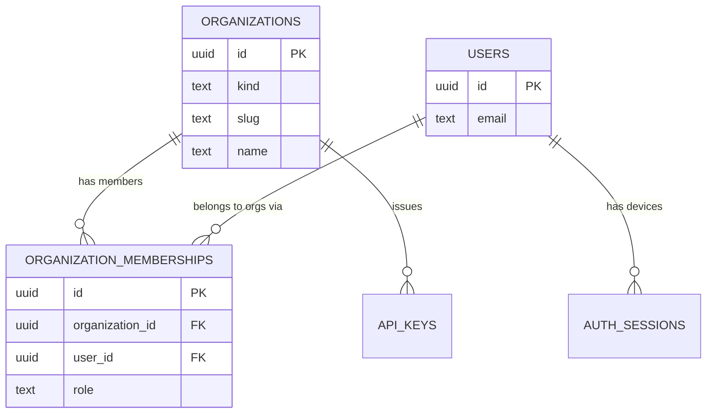
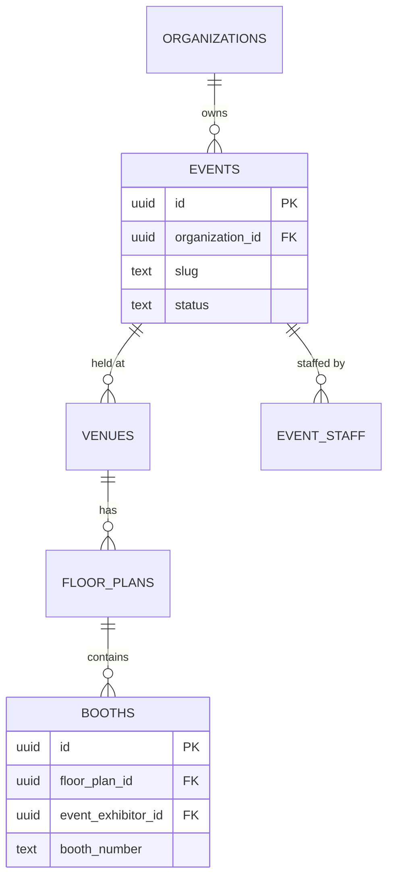
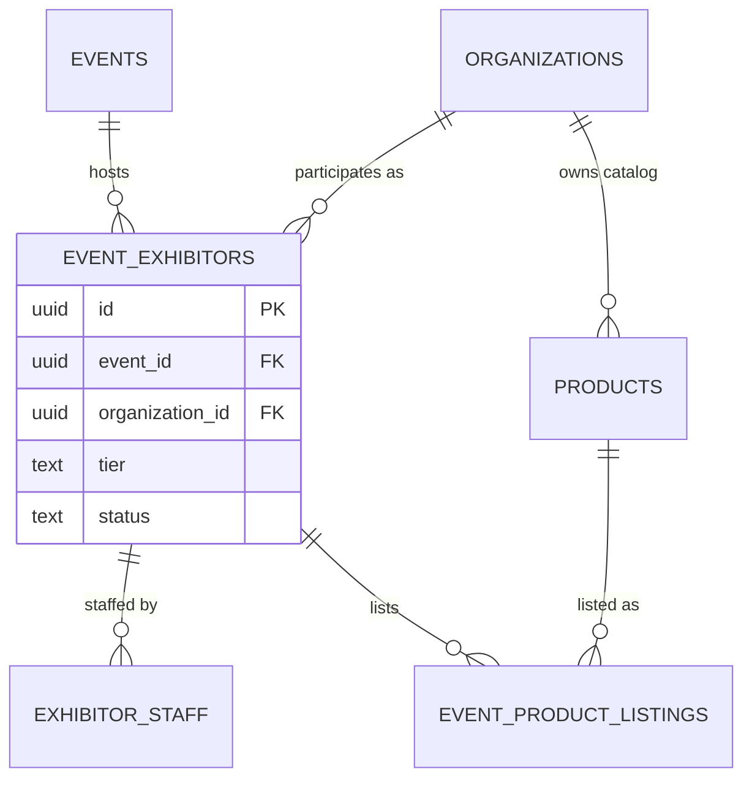
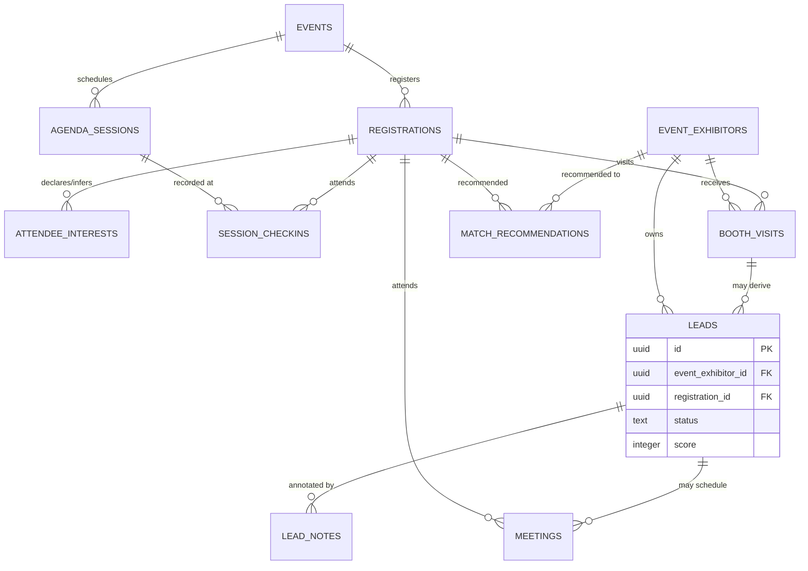
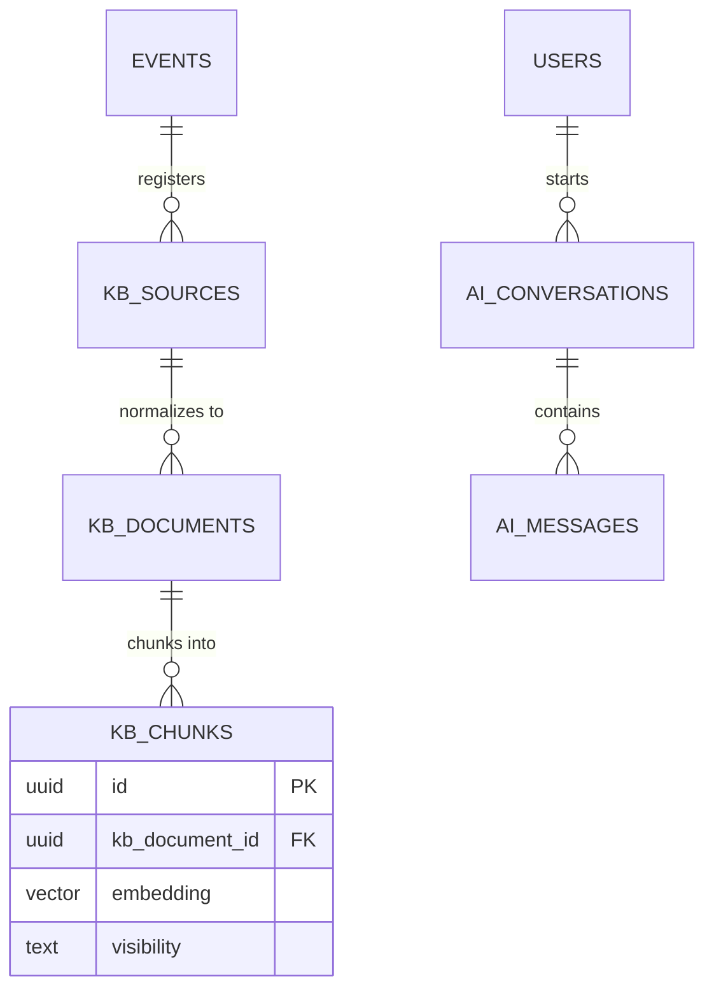
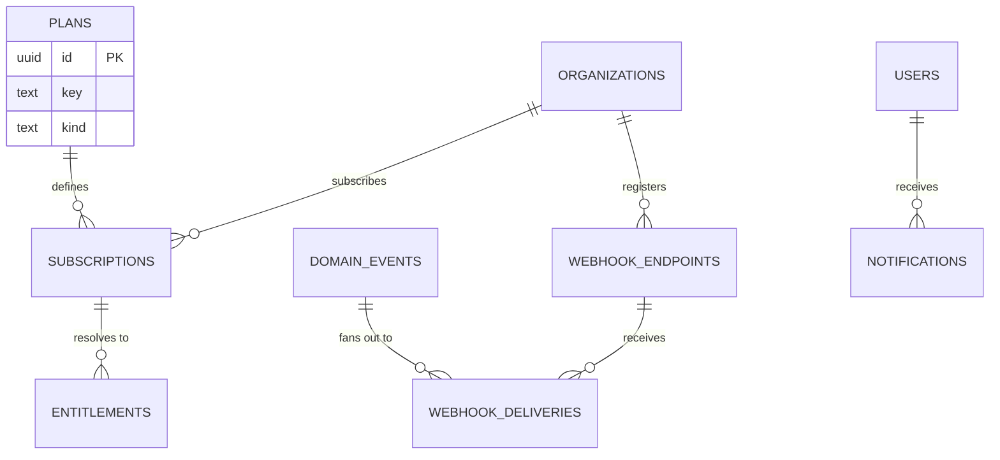
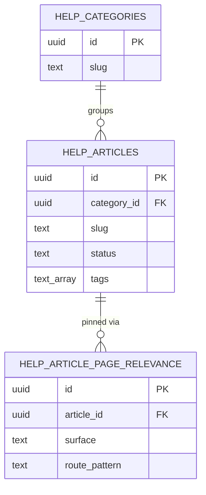
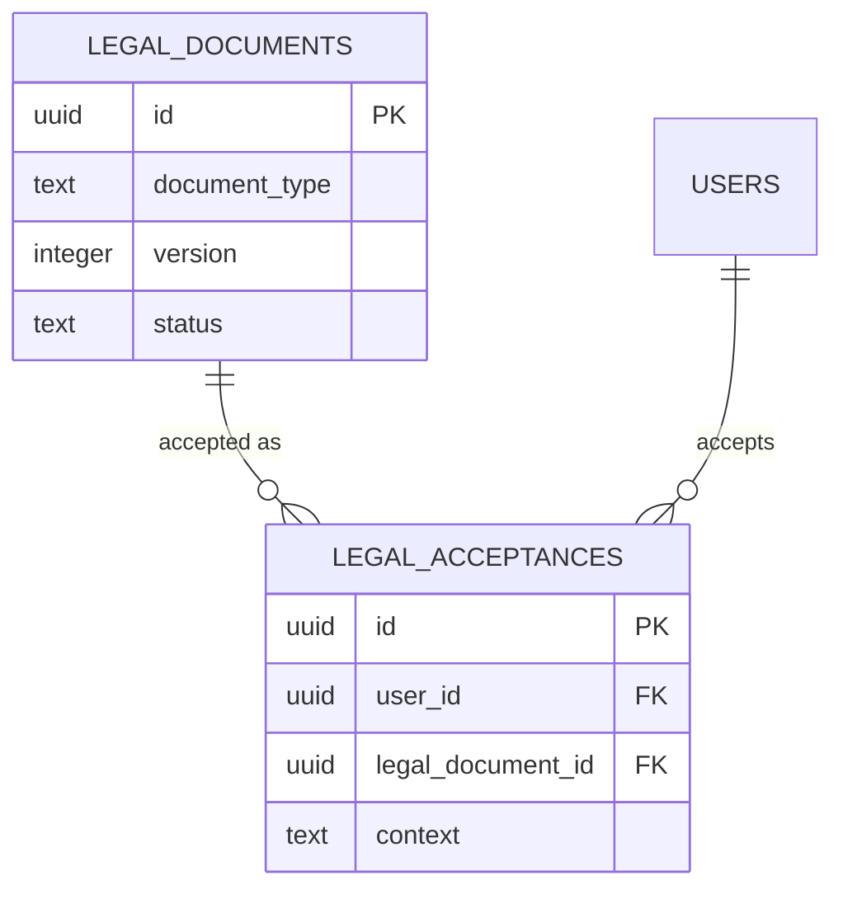

# Database Schema

This document is the column-level schema for every entity in [00-foundation.md](00-foundation.md) §7: full column lists with Postgres types, primary/foreign keys, constraints, uniqueness, indexes, and the exact Row-Level Security policy for every tenant-owned table. It owns the storage shape referenced by [18-api-architecture.md](18-api-architecture.md) (idempotency uniqueness, ETag/`updated_at` concurrency, resource fields), [11-information-architecture.md](11-information-architecture.md) (search backing, slug rules), and [21-ai-architecture.md](21-ai-architecture.md) (`ai_usage_events`, `kb_chunks` embedding storage). This revision also folds in the two entities [00-foundation.md](00-foundation.md) §14 Amendment A2 added to §7's registry (`legal_documents`, `legal_acceptances`, specified in full by [46-marketing-site.md](46-marketing-site.md) §9.2) and the additive extensions [30-help-center-and-support.md](30-help-center-and-support.md) §2.2/§3.2 flagged for this document to formalize (`help_articles.tags`, the new `help_article_page_relevance` table) — the same "register here, specify fully in the surfacing document, fold into the next schema revision" discipline foundation §14 established. **This revision also consolidates a batch of tables and columns that [19-authentication-strategy.md](19-authentication-strategy.md), [20-session-strategy.md](20-session-strategy.md), [17-offline-sync-architecture.md](17-offline-sync-architecture.md), [21-ai-architecture.md](21-ai-architecture.md), [27-background-jobs-architecture.md](27-background-jobs-architecture.md), [32-analytics-architecture.md](32-analytics-architecture.md), [33-notification-system.md](33-notification-system.md), and [35-integrations-and-connectors.md](35-integrations-and-connectors.md) introduced piecemeal and self-flagged as pending registration** (`oauth_identities`, `webauthn_credentials`, `auth_tokens`, `organizations.verified_domains`, `organization_memberships.status`, `auth_sessions.session_kind`, `booth_visits.consent_contact_sharing`, `background_jobs`, `dead_letter_jobs`, `push_subscriptions`, `crm_connections`, `crm_field_mappings`, `crm_sync_logs`, `firmographic_enrichment_caches`, `wallet_pass_registrations`, `event_qce_summaries` — renamed from the prior revision's singular `event_qce_summary`, `event_interest_coverages`, `event_exhibitor_metrics`, `booth_traffic_metrics`) — per [00-foundation.md](00-foundation.md) §14 Amendment A3; it also reconciles `event_exhibitors.status` and `auth_sessions.revoked_reason` against the enum values actually used elsewhere in the corpus. It does **not** own: business rule semantics for the north-star metric (that's [01-product-vision.md](01-product-vision.md) §5.1 — this doc implements its rollup only), the role→permission matrix ([28-permission-model.md](28-permission-model.md)), retention/erasure mechanics ([38-data-retention-privacy-compliance.md](38-data-retention-privacy-compliance.md)), the counsel-authored legal text or Help Center authoring workflow themselves ([46-marketing-site.md](46-marketing-site.md), [30-help-center-and-support.md](30-help-center-and-support.md) own those), or migration tooling internals beyond the governance summary in §13. Table and column names, types, and conventions here are binding on `packages/database` (Drizzle ORM schema, per [00-foundation.md](00-foundation.md) §6).

---

## 1. Scope and Reading Conventions

- Every table below corresponds 1:1 to a bullet in [00-foundation.md](00-foundation.md) §7, grouped into the same seven domain areas that document uses (Legal & Compliance is folded into §9 alongside Support & Content, both being platform-wide, org-agnostic, non-RLS content per §9's own reasoning — not split into an eighth diagram for two tables), plus the platform-wide `ai_usage_events` table named in [21-ai-architecture.md](21-ai-architecture.md) §6.1 and the QCE rollup tables this document owns per [01-product-vision.md](01-product-vision.md) §5.1.
- Column tables use Postgres types exactly as they will appear in DDL (`uuid`, `text`, `timestamptz`, `jsonb`, `numeric(p,s)`, `vector(n)`). `NOT NULL` is stated explicitly; omitted nullability means the column is nullable.
- **Constraints & Indexes** bullets list everything beyond a bare primary key: uniqueness, foreign keys with `ON DELETE` behavior, check constraints, and non-obvious indexes. Every foreign key column also gets a plain btree index unless stated otherwise (Postgres does not create one automatically).
- **RLS** shows the actual policy predicate. `app.current_org_id` and `app.current_user_id` are the two session GUCs foundation §8 mandates; how they're set is [18-api-architecture.md](18-api-architecture.md) §3.9's job, not this doc's.
- Every table carries `created_at timestamptz NOT NULL DEFAULT now()` and `updated_at timestamptz NOT NULL DEFAULT now()` per [00-foundation.md](00-foundation.md) §11; these two columns are omitted from the per-table tables below to avoid repeating them 61 times, and are assumed present everywhere except where §2.5 states an explicit exception.

## 2. Cross-Cutting Conventions

### 2.1 Primary keys — UUIDv7

All primary keys are `uuid NOT NULL DEFAULT concourse.uuid_generate_v7()` per [00-foundation.md](00-foundation.md) §9. **Decision:** PostgreSQL 16 has no native UUIDv7 generator (that lands in PG18); rather than add an extension dependency (`pg_uuidv7`) for one function, migration `0001_uuid_v7.sql` installs a ~15-line SQL function combining a 48-bit millisecond Unix timestamp with 74 bits of `gen_random_uuid()` entropy per the RFC 9562 layout, in a dedicated `concourse` schema kept separate from `public` so it's never confused with a data table. Every ORM-side default in `packages/database` calls this function; the application never generates ids in TypeScript, keeping id generation single-sourced in the database (principle P3).

### 2.2 Enums — `text` + `CHECK`, not native `ENUM`

**Decision:** every status/kind/role column is `text NOT NULL` with a `CHECK (col IN (...))` constraint, not a native Postgres `ENUM` type. Native enums require `ALTER TYPE ... ADD VALUE`, which drizzle-kit diffs awkwardly and which historically couldn't run inside a transaction with other DDL (still restricted in mixed migrations); a `CHECK` constraint is a normal column-level change that fits the existing migration pipeline and diffs cleanly. The allowed-value lists below are the canonical enums; adding a value is a additive migration, never a breaking one.

### 2.3 Multi-tenancy & RLS pattern

Two Postgres roles carry all traffic:

- **`app_tenant`** — used by every request-scoped connection from `apps/api` and `apps/worker` for tenant-owned data. RLS is **enabled and enforced** (`FORCE ROW LEVEL SECURITY`) on every table this role touches, so even the table owner is subject to policy.
- **`app_platform`** — used exclusively by `AdminModule`'s dedicated connection pool, granted `BYPASSRLS`. This is the mechanism behind the "platform (RLS-bypassing service role, audited)" search scope already promised in [11-information-architecture.md](11-information-architecture.md) §6. Every query issued through this pool is wrapped by a `record_audit_log(...)` call at the application layer (§8.9) — the bypass is real but never silent.

The standard single-tenant policy, applied verbatim wherever a table's own `organization_id` is its only tenancy dimension:

```sql
ALTER TABLE <table> ENABLE ROW LEVEL SECURITY;
ALTER TABLE <table> FORCE ROW LEVEL SECURITY;
CREATE POLICY tenant_isolation ON <table>
  USING (organization_id = current_setting('app.current_org_id', true)::uuid)
  WITH CHECK (organization_id = current_setting('app.current_org_id', true)::uuid);
```

Tables that are legitimately visible to **two** tenants at once (an organizer org and an exhibitor org both need rows in `event_exhibitors`, for example) get a second `organization_id`-shaped column so the same cheap equality check works without a join — see §2.4. Tables scoped to a **user** rather than an organization (e.g. `ai_conversations` for Expo Copilot) use `user_id = current_setting('app.current_user_id', true)::uuid` instead, or an `OR` of both predicates when a table can be owned either way. Each domain section states the exact policy per table; §11 is the flat lookup table across all 61.

### 2.4 Denormalization policy (dual-tenant and hot-path columns)

Principle P3 ("one source of truth... derived values are always recomputable from source records; caches and read models are explicitly marked as derived") governs every denormalized column in this schema. Two situations earn a documented exception, both applied consistently:

1. **Dual-tenant RLS columns.** A handful of tables sit at the seam between an organizer org and an exhibitor org (`event_exhibitors`, `kb_sources`, `kb_documents`, `kb_chunks`). Rather than write an RLS policy with a correlated subquery through `events` on every row read — expensive at the `kb_chunks` retrieval volume RAG needs — these tables carry a denormalized `organizer_organization_id`, copied from the parent `events.organization_id` at insert time. Events never change owning organization after creation (no transfer-of-ownership feature exists), so this copy is write-once and never goes stale.
2. **Search-vector source columns.** [11-information-architecture.md](11-information-architecture.md) §6 requires "Postgres FTS (`tsvector` per table)" as the search backing — a `tsvector` `GENERATED ALWAYS AS (...) STORED` column can only reference columns on its own row, so a small number of tables (`event_exhibitors`, `event_product_listings`) carry a denormalized snapshot of a parent's display text (`organization_name_cache`, `product_name_cache`/`product_description_cache`). These are kept in sync by an `AFTER UPDATE` trigger on the source table (`organizations`, `products`) that re-writes all dependent snapshot rows — the same "explicitly marked as derived and invalidatable" discipline P3 requires, just implemented as a trigger instead of an application cache.

No other denormalization exists in this schema; every other relationship is a plain foreign key resolved by `?expand=` (per [18-api-architecture.md](18-api-architecture.md) §3.4) or a join.

### 2.5 Soft delete & lifecycle policy

**Decision:** there is no universal `deleted_at`/`is_deleted` column. Tables with a natural lifecycle already have a status enum that represents retirement (`events.status = archived`, `event_exhibitors.status = withdrawn`, `webhook_endpoints.status = disabled_manual`, `registrations.status = cancelled`) — a second deletion flag on top would be a duplicate source of truth for the same fact, which principle P3 forbids. Pure join/fact tables with no lifecycle concept of their own (`organization_memberships`, `exhibitor_staff`, `event_product_listings`, `attendee_interests`) hard-delete via `ON DELETE CASCADE` from their parent. Rows subject to legal erasure (a Sofia DSAR request) are anonymized in place rather than deleted, by a procedure [38-data-retention-privacy-compliance.md](38-data-retention-privacy-compliance.md) owns end-to-end; this schema only guarantees that every column holding attendee PII is nullable so that procedure has somewhere to write `NULL`.

`audit_logs` is the one deliberate exception to "every table gets an `updated_at`-driven update path": `UPDATE` and `DELETE` are `REVOKE`d from every role including table owners (§8.9) — immutability is enforced at the grant level, not by convention. `legal_acceptances` (§9.5) is a second, narrower exception: it carries `created_at` only, no `updated_at` — a consent record is a fact about a moment ("this user saw this exact document version at this time"), and an in-place edit to that fact would undermine the entire reason the table exists. It does not get `audit_logs`' grant-level `REVOKE` treatment, since correcting a data-entry error still needs an ordinary application-layer path (unlike the security-log immutability audit_logs must guarantee against a compromised admin).

### 2.6 Role-string storage vs. permission-model strings

[00-foundation.md](00-foundation.md) §8 defines canonical permission-check strings (`org:owner`, `event:admin`, `exhibitor:rep`, …). **Decision:** the DB columns backing these (`organization_memberships.role`, `event_staff.role`, `exhibitor_staff.role`) store the bare suffix (`owner`, `admin`, `staff`, `rep`) rather than the scope-prefixed string, because the scope is already the table itself — storing `org:owner` in a column that only ever appears on `organization_memberships` rows would be redundant data duplicating the table name. [28-permission-model.md](28-permission-model.md) composes `<scope>:<role>` at the application layer when checking permissions.

### 2.7 Full-text search & vector index conventions

- FTS columns are `tsvector GENERATED ALWAYS AS (to_tsvector('english', ...)) STORED`, indexed with a plain `GIN` index. This backs [11-information-architecture.md](11-information-architecture.md) §6's Postgres FTS rows; which columns get one is stated per table in §4–§8.
- The one semantic index in the schema is `kb_chunks.embedding vector(1024)` (Voyage `voyage-3.5`, per [00-foundation.md](00-foundation.md) §6), indexed:

```sql
CREATE INDEX idx_kb_chunks_embedding ON kb_chunks
  USING hnsw (embedding vector_cosine_ops) WITH (m = 16, ef_construction = 64);
```

  Cosine ops match Voyage's recommended similarity metric. `m`/`ef_construction` are the pgvector defaults tuned for recall at the expected corpus size (tens of thousands of chunks per event, per foundation D5); [22-rag-architecture.md](22-rag-architecture.md) owns query-time `ef_search` tuning and reranking.

## 3. Domain: Identity & Tenancy

Owns global identity, the organization tenant abstraction, and how a human authenticates. Every other domain's RLS ultimately roots in this one.



### 3.1 `organizations`

The tenant. Two kinds; both first-class per [00-foundation.md](00-foundation.md) §8.

| Column | Type | Notes |
|---|---|---|
| `id` | `uuid` | PK |
| `kind` | `text NOT NULL` | `CHECK IN ('organizer','exhibitor')` |
| `slug` | `text NOT NULL` | globally unique, immutable after creation ([11-information-architecture.md](11-information-architecture.md) §3.2) |
| `name` | `text NOT NULL` | freely editable display name |
| `logo_file_id` | `uuid` | FK → `files.id`, `ON DELETE SET NULL` |
| `website_url` | `text` | |
| `billing_email` | `text` | |
| `verified_domains` | `text[]` | email domains this org is the claimed owner of, populated at org creation from the creator's verified email domain and grown as later domain-match claims succeed; backs the join-vs-create-org domain-match flow ([19-authentication-strategy.md](19-authentication-strategy.md) §5.2, §10.2) — a free-email domain (gmail.com and similar) is never written here, per that flow's blocklist check |
| `search_vector` | `tsvector GENERATED ALWAYS AS (to_tsvector('english', name)) STORED` | |

**Constraints & indexes:** `UNIQUE (slug)`; `CHECK` enforcing slug format (`^[a-z0-9-]{3,63}$`) at the DB layer as a last line of defense behind app-layer validation; `GIN` on `search_vector`.
**RLS:** members read/write their own org: `USING (id = current_setting('app.current_org_id', true)::uuid)`. Public read paths (attendee-facing exhibitor profile, published event's organizer name) go through the explicitly modeled cross-tenant read endpoints in [18-api-architecture.md](18-api-architecture.md) §5, never raw table access — those endpoints run under a narrower read-only view, not a broader RLS policy on this table.

### 3.2 `users`

Global identity — one human, one row, across all orgs and events.

| Column | Type | Notes |
|---|---|---|
| `id` | `uuid` | PK |
| `email` | `text NOT NULL` | unique, lowercased before write |
| `email_verified_at` | `timestamptz` | |
| `password_hash` | `text` | Legacy/inert column: Supabase Auth (§14 Amendment A5) now owns password storage/hashing internally in its own `auth.users` table; this column is not written to by the current design and is flagged for removal in a future schema-cleanup revision, per [19-authentication-strategy.md](19-authentication-strategy.md)'s reconciliation note |
| `full_name` | `text NOT NULL` | |
| `avatar_file_id` | `uuid` | FK → `files.id`, `ON DELETE SET NULL` |
| `locale` | `text NOT NULL DEFAULT 'en'` | |
| `is_platform_admin` | `boolean NOT NULL DEFAULT false` | grants `platform:admin`; changed only via `/v1/admin/*` |

**Constraints & indexes:** `UNIQUE (email)`.
**RLS:** no `organization_id` — this table is global by design. Policy: `USING (id = current_setting('app.current_user_id', true)::uuid)` for self-service reads/writes (`/account`); staff/attendee lookups within a tenant go through join-scoped views (`organization_memberships`, `registrations`, `exhibitor_staff`) rather than direct `users` table access, so a member of org A can never enumerate org B's users even though `users` itself has no org column. `app_platform` bypasses for the Platform Admin user directory (foundation-sanctioned cross-tenant surface).

### 3.3 `organization_memberships`

User↔organization with org role.

| Column | Type | Notes |
|---|---|---|
| `id` | `uuid` | PK |
| `organization_id` | `uuid NOT NULL` | FK → `organizations.id`, `ON DELETE CASCADE` |
| `user_id` | `uuid NOT NULL` | FK → `users.id`, `ON DELETE CASCADE` |
| `role` | `text NOT NULL` | `CHECK IN ('owner','admin','member')` (§2.6) |
| `status` | `text NOT NULL DEFAULT 'active'` | `CHECK IN ('pending','active')` — `pending` backs an org-join request awaiting an `org:owner`/`org:admin` approval ([19-authentication-strategy.md](19-authentication-strategy.md) §5.2's join-vs-create-org flow); the row is created at request time (a pending request is itself a relationship, so IA §3.3's "no relationship → 404" rule doesn't hit it), and flips to `active` on approval rather than a second row being created |
| `invited_by_user_id` | `uuid` | FK → `users.id`, `ON DELETE SET NULL` |
| `joined_at` | `timestamptz NOT NULL DEFAULT now()` | `NULL`-equivalent semantics don't apply here (column stays `NOT NULL DEFAULT now()`), but a `status = 'pending'` row's `joined_at` reflects the *request* time, not an actual join — the app layer never reads it as "joined" until `status` flips |

**Constraints & indexes:** `UNIQUE (organization_id, user_id)`; index on `user_id` (drives `GET /v1/users/me/memberships`); index on `(organization_id, status)` (drives the pending-requests list at `/org/[orgSlug]/team`); a `CHECK`-backed invariant that at least one `owner` remains per org is enforced at the application layer (a DB constraint can't see "the rest of the table" cheaply) — [28-permission-model.md](28-permission-model.md) owns the exact demotion-guard logic referenced in [18-api-architecture.md](18-api-architecture.md) §5.2; that invariant only counts `status = 'active'` rows.
**RLS:** `USING (organization_id = current_setting('app.current_org_id', true)::uuid)`.

### 3.4 `auth_sessions`

Device sessions — the audit/device-list table behind the Redis-backed opaque token ([00-foundation.md](00-foundation.md) §6, mechanics in [20-session-strategy.md](20-session-strategy.md)).

| Column | Type | Notes |
|---|---|---|
| `id` | `uuid` | PK; also the value embedded in the opaque token's Redis key |
| `user_id` | `uuid NOT NULL` | FK → `users.id`, `ON DELETE CASCADE` |
| `device_label` | `text` | e.g. "Chrome on macOS" |
| `ip_address` | `inet` | at session creation |
| `user_agent` | `text` | |
| `last_seen_at` | `timestamptz NOT NULL DEFAULT now()` | |
| `revoked_at` | `timestamptz` | `NULL` = active |
| `revoked_reason` | `text` | `CHECK IN ('user_logout','password_changed','admin_revoked','suspected_hijack','membership_removed') OR NULL` — `security_response` is folded into `suspected_hijack` rather than kept as a separate value (the two named the same trigger); `badge_code_rotated` is deliberately not a value here — rotating `registrations.badge_code` never touches a session or its ACT ([20-session-strategy.md](20-session-strategy.md) §5.4) |
| `session_kind` | `text NOT NULL DEFAULT 'standard'` | `CHECK IN ('standard','attendee','kiosk_attendee')` — governs the absolute/sliding lifetime rule [20-session-strategy.md](20-session-strategy.md) §4 applies: `standard` gets the 30-day cap with a sliding 14-day idle timeout (every non-attendee principal); `attendee` and `kiosk_attendee` both get a fixed, non-sliding 8-hour lifetime from creation, differing only in how the underlying identity claim originated (magic-link vs. staff-witnessed kiosk claim), never in session physics |

**Constraints & indexes:** index on `(user_id, revoked_at)` for the `/account/sessions` list; index on `session_kind` (the expiry sweep job partitions its scan by kind, per [20-session-strategy.md](20-session-strategy.md) §4).
**RLS:** `USING (user_id = current_setting('app.current_user_id', true)::uuid)`; `app_platform` bypass powers `POST /v1/admin/users/{userId}/sessions/revoke-all`.

### 3.5 `api_keys`

Scoped keys for the public API (enterprise).

| Column | Type | Notes |
|---|---|---|
| `id` | `uuid` | PK |
| `organization_id` | `uuid NOT NULL` | FK → `organizations.id`, `ON DELETE CASCADE` |
| `name` | `text NOT NULL` | |
| `key_prefix` | `text NOT NULL` | first 12 chars, the stored lookup prefix ([18-api-architecture.md](18-api-architecture.md) §8) |
| `secret_hash` | `text NOT NULL` | SHA-256 of the full secret |
| `scopes` | `text[] NOT NULL DEFAULT '{}'` | permission-string subset |
| `rate_limit_per_minute` | `integer` | overrides the default 120/min bucket |
| `last_used_at` | `timestamptz` | batched, 1-minute granularity |
| `revoked_at` | `timestamptz` | |
| `created_by_user_id` | `uuid NOT NULL` | FK → `users.id`, `ON DELETE SET NULL` |

**Constraints & indexes:** `UNIQUE (key_prefix)`.
**RLS:** `USING (organization_id = current_setting('app.current_org_id', true)::uuid)`. When the request principal *is* an API key (per [18-api-architecture.md](18-api-architecture.md) §3.9), `app.current_org_id` is still set to the key's owning org — API-key principals are org-scoped exactly like session principals, so no separate policy branch is needed.

### 3.6 `oauth_identities`

Linked third-party sign-in identities, per [19-authentication-strategy.md](19-authentication-strategy.md) §3's illustrative `oauth_identities` shape — a dedicated table rather than a JSONB column on `users`, so a provider lookup is a plain indexed equality query and a `users` row can hold one identity per provider without a repeating-group column.

| Column | Type | Notes |
|---|---|---|
| `id` | `uuid` | PK |
| `user_id` | `uuid NOT NULL` | FK → `users.id`, `ON DELETE CASCADE` |
| `provider` | `text NOT NULL` | `CHECK IN ('google','microsoft','linkedin')` |
| `provider_user_id` | `text NOT NULL` | the provider's stable subject identifier (`sub`) |

**Constraints & indexes:** `UNIQUE (provider, provider_user_id)` — the exact uniqueness [19-authentication-strategy.md](19-authentication-strategy.md) §3 requires; `UNIQUE (user_id, provider)` — one linked identity per provider per user; index on `user_id`.
**RLS:** `USING (user_id = current_setting('app.current_user_id', true)::uuid)` — same shape as `auth_sessions`; there is no organizer/platform read path onto another user's linked identities.

### 3.7 `webauthn_credentials`

Registered passkeys, per [19-authentication-strategy.md](19-authentication-strategy.md) §7 — a user may register many.

| Column | Type | Notes |
|---|---|---|
| `id` | `uuid` | PK |
| `user_id` | `uuid NOT NULL` | FK → `users.id`, `ON DELETE CASCADE` |
| `credential_id` | `text NOT NULL` | the WebAuthn credential id, base64url-encoded |
| `public_key` | `bytea NOT NULL` | COSE-encoded public key |
| `sign_count` | `bigint NOT NULL DEFAULT 0` | authenticator signature counter; a non-increasing value on verification is the clone-detection signal [19-authentication-strategy.md](19-authentication-strategy.md) §7.2 checks |
| `last_used_at` | `timestamptz` | |

**Constraints & indexes:** `UNIQUE (credential_id)` — globally unique per §7.2's lookup-by-credential-id sign-in path; index on `user_id` (drives the `/account/security` device-label list).
**RLS:** `USING (user_id = current_setting('app.current_user_id', true)::uuid)`.

### 3.8 `auth_tokens`

The single polymorphic table backing every single-use token type [19-authentication-strategy.md](19-authentication-strategy.md) §3/§13 issues (invite, magic-link, verify-email, reset-password) — **resolving that document's own open design question** ("whether single-use tokens share one polymorphic table or one per type" is left to this document) in favor of one shared table: all four types share identical mechanics (one generation function, SHA-256 `token_hash` storage, a single conditional-`UPDATE` consumption pattern, §13's uniform entropy/format), and the only real difference between them is which nullable subject/context column is populated and which `expires_at` a caller passes — four near-identical tables would duplicate that mechanism four times for zero behavioral gain, the same reasoning §2.2 applies to `CHECK`-constrained enums over parallel structures.

| Column | Type | Notes |
|---|---|---|
| `id` | `uuid` | PK |
| `kind` | `text NOT NULL` | `CHECK IN ('invite','magic_link','verify_email','reset_password')` |
| `token_hash` | `text NOT NULL` | SHA-256 of the raw token; the raw value is never persisted ([19-authentication-strategy.md](19-authentication-strategy.md) §13) |
| `user_id` | `uuid` | FK → `users.id`, `ON DELETE CASCADE`; the subject for `magic_link`/`verify_email`/`reset_password`, and for an already-resolved-identity `invite`; `NULL` for an `invite` issued to an email with no existing `users` row yet |
| `organization_id` | `uuid` | FK → `organizations.id`, `ON DELETE CASCADE`; set for an organization/event-staff/exhibitor-staff `invite` — the target org |
| `event_id` | `uuid` | FK → `events.id`, `ON DELETE CASCADE`; set for an event-staff or exhibitor `invite` |
| `payload` | `jsonb NOT NULL DEFAULT '{}'` | invite-type-specific extras not covered by a dedicated column (target role, prefill email, kiosk scope, etc.) — deliberately loose per-`kind` shape, validated at the application layer, mirroring the `notifications.category` "grow without a migration" reasoning (§8.2) |
| `expires_at` | `timestamptz NOT NULL` | varies by `kind` per [19-authentication-strategy.md](19-authentication-strategy.md) §13's registry (15 min magic-link, 14 days invite, 24h verify-email, 1h reset-password) |
| `used_at` | `timestamptz` | set by the conditional `UPDATE ... WHERE used_at IS NULL AND revoked_at IS NULL RETURNING id` consumption pattern; `NULL` = unconsumed |
| `revoked_at` | `timestamptz` | explicit revoke (invite revocation, §10.3) or superseded-by-newer-request (magic-link/verify-email/reset-password, §13) |

**Constraints & indexes:** `UNIQUE (token_hash)`; index on `(user_id, kind)` where relevant (e.g. "invalidate every other outstanding reset-password token for this user" per §12); index on `(kind, expires_at)` backing an expiry-sweep cleanup job. At least one of `user_id`/`organization_id`/`event_id` is non-null, enforced at the application layer (which combination is valid depends on `kind`, not expressible as a simple `CHECK`).
**RLS:** none of the client-facing roles read this table directly — every token is looked up by its hash inside the auth service's own request handlers (`/v1/auth/*`), never through a generic `GET`, so there is no UI surface an RLS policy would need to gate; `app_platform` bypass powers `platform:admin`'s ability to see/revoke a user's outstanding invites from `/admin/users/{userId}`.

## 4. Domain: Events & Floor

The organizer's operational surface: the event itself and its physical layout.



### 4.1 `events`

A trade show edition, owned by an organizer org.

| Column | Type | Notes |
|---|---|---|
| `id` | `uuid` | PK |
| `organization_id` | `uuid NOT NULL` | FK → `organizations.id`, `ON DELETE CASCADE`; must reference `kind = 'organizer'` (app-enforced) |
| `slug` | `text NOT NULL` | globally unique, immutable once `status <> 'draft'` ([11-information-architecture.md](11-information-architecture.md) §3.2) |
| `name` | `text NOT NULL` | |
| `description` | `text` | |
| `status` | `text NOT NULL DEFAULT 'draft'` | `CHECK IN ('draft','published','live','completed','archived')` |
| `timezone` | `text NOT NULL` | IANA tz name |
| `starts_at` | `timestamptz NOT NULL` | |
| `ends_at` | `timestamptz NOT NULL` | |
| `published_at` | `timestamptz` | set on `draft→published` |
| `live_started_at` | `timestamptz` | set automatically at `starts_at` by a worker job ([18-api-architecture.md](18-api-architecture.md) §5.3) |
| `completed_at` | `timestamptz` | anchors the QCE measurement window (§10) |
| `archived_at` | `timestamptz` | |
| `venue_id` | `uuid` | FK → `venues.id`, `ON DELETE SET NULL` (nullable: a venue is usually created alongside the event but the FK direction is venue→event, see §4.2) |
| `branding_logo_file_id` | `uuid` | FK → `files.id`, `ON DELETE SET NULL` |
| `search_vector` | `tsvector GENERATED ALWAYS AS (to_tsvector('english', name \|\| ' ' \|\| coalesce(description,''))) STORED` | |

**Constraints & indexes:** `UNIQUE (slug)`; `CHECK (ends_at > starts_at)`; index on `(organization_id, status)`; `GIN` on `search_vector`. `updated_at` backs the `If-Match`/ETag concurrency [18-api-architecture.md](18-api-architecture.md) §3.7 requires on this table.
**RLS:** `USING (organization_id = current_setting('app.current_org_id', true)::uuid)`. Attendee/public reads of `published`+ events go through the dedicated `GET /v1/events/{eventId}` and `GET /v1/events/lookup` read paths (unauthenticated-safe views scoped to `status IN ('published','live','completed')`), not a broadened RLS grant — consistent with the "explicitly modeled cross-tenant read path" rule in foundation §8.

### 4.2 `venues`

Physical layout root. **Decision:** one `venues` row per event (no cross-event venue catalog in Phase 1) — an organizer reusing the same convention center in consecutive years re-enters the address. A reusable venue catalog is a plausible improvement but not required for any Phase-1 feature; it is logged in [44-future-expansion-plan.md](44-future-expansion-plan.md) rather than built speculatively.

| Column | Type | Notes |
|---|---|---|
| `id` | `uuid` | PK |
| `event_id` | `uuid NOT NULL` | FK → `events.id`, `ON DELETE CASCADE` |
| `name` | `text NOT NULL` | |
| `address_line1` | `text` | |
| `address_line2` | `text` | |
| `city` | `text` | |
| `region` | `text` | |
| `postal_code` | `text` | |
| `country_code` | `text` | ISO 3166-1 alpha-2 |
| `timezone` | `text NOT NULL` | |

**Constraints & indexes:** index on `event_id`.
**RLS:** dual-tenant is not a concern here (venues have no exhibitor visibility as a system of record — they are `Read (context)` per [11-information-architecture.md](11-information-architecture.md) §2). Policy resolves through the parent event: `USING (event_id IN (SELECT id FROM events WHERE organization_id = current_setting('app.current_org_id', true)::uuid))`. This is the one join-based policy in the schema deliberately accepted rather than denormalized, because venues are low-cardinality (a handful per event) and never sit on a hot read path the way `kb_chunks` does (§2.4's denormalization criterion is "hot path," not "any cross-table check").

### 4.3 `floor_plans`

| Column | Type | Notes |
|---|---|---|
| `id` | `uuid` | PK |
| `venue_id` | `uuid NOT NULL` | FK → `venues.id`, `ON DELETE CASCADE` |
| `event_id` | `uuid NOT NULL` | denormalized from `venues.event_id` — same hot-path rationale as booths (§4.4), since floor-plan geometry reads happen on every Attendee App map open |
| `name` | `text NOT NULL` | e.g. "Hall B — Ground Floor" |
| `image_file_id` | `uuid` | FK → `files.id`, `ON DELETE SET NULL` |
| `image_width_px` | `integer` | coordinate space for booth placement |
| `image_height_px` | `integer` | |
| `status` | `text NOT NULL DEFAULT 'draft'` | `CHECK IN ('draft','published')` — attendee map only reads `published` |

**Constraints & indexes:** indexes on `venue_id`, `event_id`.
**RLS:** `USING (event_id IN (SELECT id FROM events WHERE organization_id = current_setting('app.current_org_id', true)::uuid))` for organizer read/write. Attendee map reads go through `GET /v1/venues/{venueId}/floor-plans` filtered to `published` — a modeled read path, not a broadened policy.

### 4.4 `booths`

Booths assignable to exhibitors.

| Column | Type | Notes |
|---|---|---|
| `id` | `uuid` | PK |
| `floor_plan_id` | `uuid NOT NULL` | FK → `floor_plans.id`, `ON DELETE CASCADE` |
| `event_id` | `uuid NOT NULL` | denormalized from `floor_plans.event_id` — this is the hottest floor read (attendee map pans, organizer live-ops board, `?expand=booth`), so avoiding a two-hop join to `venues` here is the clearest case for §2.4's exception |
| `event_exhibitor_id` | `uuid` | FK → `event_exhibitors.id`, `ON DELETE SET NULL`; the assignment. **Decision:** this is the only FK for the assignment relationship — `event_exhibitors` does not also carry a `booth_id` back-reference, to avoid a bidirectional pair that can drift out of sync. `?expand=booth` on an `event_exhibitors` read resolves via the reverse lookup below. |
| `booth_number` | `text NOT NULL` | |
| `size_class` | `text NOT NULL DEFAULT 'inline'` | `CHECK IN ('inline','corner','peninsula','island')` — standard trade-show booth taxonomy |
| `position_x` | `numeric(10,2) NOT NULL` | floor-plan coordinate space |
| `position_y` | `numeric(10,2) NOT NULL` | |
| `width` | `numeric(10,2) NOT NULL` | |
| `height` | `numeric(10,2) NOT NULL` | |
| `rotation_deg` | `numeric(5,2) NOT NULL DEFAULT 0` | |
| `status` | `text NOT NULL DEFAULT 'available'` | `CHECK IN ('available','assigned','reserved','blocked')` |
| `search_vector` | `tsvector GENERATED ALWAYS AS (to_tsvector('english', booth_number)) STORED` | |

**Constraints & indexes:** `UNIQUE (floor_plan_id, booth_number)`; **`UNIQUE (event_exhibitor_id) WHERE event_exhibitor_id IS NOT NULL`** — enforces the 1:1 exhibitor↔booth assignment the FK direction above implies; index on `event_id`; `GIN` on `search_vector`. `updated_at`-driven ETag: `If-Match` required per [18-api-architecture.md](18-api-architecture.md) §3.7 (assignment races).
**RLS:** organizer read/write: `USING (event_id IN (SELECT id FROM events WHERE organization_id = current_setting('app.current_org_id', true)::uuid))`. The assigned exhibitor's own-booth read (`Read (own booth)` per IA §2) is a second policy clause `OR (event_exhibitor_id IN (SELECT id FROM event_exhibitors WHERE organization_id = current_setting('app.current_org_id', true)::uuid))` — this table is genuinely dual-visible, so both clauses coexist in one `USING` expression.

### 4.5 `event_staff`

Organizer-side user assignments to an event.

| Column | Type | Notes |
|---|---|---|
| `id` | `uuid` | PK |
| `event_id` | `uuid NOT NULL` | FK → `events.id`, `ON DELETE CASCADE` |
| `user_id` | `uuid NOT NULL` | FK → `users.id`, `ON DELETE CASCADE` |
| `role` | `text NOT NULL` | `CHECK IN ('admin','staff')` (§2.6) |

**Constraints & indexes:** `UNIQUE (event_id, user_id)`.
**RLS:** `USING (event_id IN (SELECT id FROM events WHERE organization_id = current_setting('app.current_org_id', true)::uuid))`.

## 5. Domain: Exhibitor Participation

The pivot between an exhibitor's org-owned catalog and its per-event presence.



### 5.1 `event_exhibitors`

Exhibitor org ↔ event participation record.

| Column | Type | Notes |
|---|---|---|
| `id` | `uuid` | PK |
| `event_id` | `uuid NOT NULL` | FK → `events.id`, `ON DELETE CASCADE` |
| `organization_id` | `uuid NOT NULL` | FK → `organizations.id`, `ON DELETE CASCADE`; must reference `kind = 'exhibitor'` (app-enforced) |
| `organizer_organization_id` | `uuid NOT NULL` | denormalized from `events.organization_id` (§2.4, rule 1); write-once at insert |
| `tier` | `text NOT NULL DEFAULT 'essentials'` | `CHECK IN ('essentials','growth','intelligence')`; changes only via billing checkout ([18-api-architecture.md](18-api-architecture.md) §5.5) |
| `status` | `text NOT NULL DEFAULT 'invited'` | `CHECK IN ('invited','accepted','profile_complete','ready','withdrawn')` — the onboarding funnel Priya's O-4 tracker reads (`invited → accepted → profile_complete → ready`, with `withdrawn` reachable from any non-terminal state), exactly as [04-user-journey.md](04-user-journey.md), [05-organizer-journey.md](05-organizer-journey.md) O-4, [06-exhibitor-journey.md](06-exhibitor-journey.md) EX-2, and [25-event-pipeline.md](25-event-pipeline.md) §3.2 all define it |
| `profile_status` | `text NOT NULL DEFAULT 'draft'` | `CHECK IN ('draft','pending_review','approved','rejected')` — content moderation (feature D7), independent of participation `status` |
| `display_name` | `text` | booth signage override; falls back to `organization_name_cache` when null |
| `organization_name_cache` | `text NOT NULL` | denormalized from `organizations.name` (§2.4, rule 2), trigger-synced |
| `profile_headline` | `text` | |
| `profile_description` | `text` | |
| `logo_file_id` | `uuid` | FK → `files.id`, `ON DELETE SET NULL` |
| `categories` | `text[] NOT NULL DEFAULT '{}'` | product/category tags, used by matchmaking and directory facets |
| `invited_at` | `timestamptz NOT NULL DEFAULT now()` | |
| `claimed_at` | `timestamptz` | |
| `search_vector` | `tsvector GENERATED ALWAYS AS (to_tsvector('english', organization_name_cache \|\| ' ' \|\| coalesce(profile_headline,'') \|\| ' ' \|\| coalesce(profile_description,''))) STORED` | |

**Constraints & indexes:** `UNIQUE (event_id, organization_id)`; indexes on `event_id`, `organization_id`, `organizer_organization_id`; `GIN` on `search_vector`. `If-Match` required per [18-api-architecture.md](18-api-architecture.md) §3.7.
**RLS:** `USING (organization_id = current_setting('app.current_org_id', true)::uuid OR organizer_organization_id = current_setting('app.current_org_id', true)::uuid)` — the canonical two-sided policy §2.3 describes. Attendee directory reads go through the modeled `GET /v1/events/{eventId}/event-exhibitors` published-listing view.

### 5.2 `exhibitor_staff`

User assignments to an `event_exhibitor`.

| Column | Type | Notes |
|---|---|---|
| `id` | `uuid` | PK |
| `event_exhibitor_id` | `uuid NOT NULL` | FK → `event_exhibitors.id`, `ON DELETE CASCADE` |
| `user_id` | `uuid NOT NULL` | FK → `users.id`, `ON DELETE CASCADE` |
| `role` | `text NOT NULL` | `CHECK IN ('admin','rep')` (§2.6) |

**Constraints & indexes:** `UNIQUE (event_exhibitor_id, user_id)`; seat-count enforcement (`entitlement:staff_seats`) is an application-layer check at invite time, not a DB constraint (the limit varies by tier and can change after seats already exist).
**RLS:** `USING (event_exhibitor_id IN (SELECT id FROM event_exhibitors WHERE organization_id = current_setting('app.current_org_id', true)::uuid))`.

### 5.3 `products`

Exhibitor org's catalog — org-scoped, reusable across events.

| Column | Type | Notes |
|---|---|---|
| `id` | `uuid` | PK |
| `organization_id` | `uuid NOT NULL` | FK → `organizations.id`, `ON DELETE CASCADE` |
| `name` | `text NOT NULL` | |
| `description` | `text` | |
| `category` | `text` | |
| `sku` | `text` | |
| `search_vector` | `tsvector GENERATED ALWAYS AS (to_tsvector('english', name \|\| ' ' \|\| coalesce(description,'') \|\| ' ' \|\| coalesce(category,''))) STORED` | |

**Constraints & indexes:** index on `organization_id`; `GIN` on `search_vector`. Product media (images/PDFs) is **not** a column here — it lives in `files` via the polymorphic `owner_type = 'product'` association (§8.1), so a product's media is never duplicated between a column and the files registry (principle P3).
**RLS:** `USING (organization_id = current_setting('app.current_org_id', true)::uuid)`.

### 5.4 `event_product_listings`

Which products an exhibitor shows at a given event.

| Column | Type | Notes |
|---|---|---|
| `id` | `uuid` | PK |
| `event_exhibitor_id` | `uuid NOT NULL` | FK → `event_exhibitors.id`, `ON DELETE CASCADE` |
| `product_id` | `uuid NOT NULL` | FK → `products.id`, `ON DELETE CASCADE` |
| `sort_order` | `integer NOT NULL DEFAULT 0` | |
| `product_name_cache` | `text NOT NULL` | denormalized from `products.name` (§2.4, rule 2) |
| `product_description_cache` | `text` | denormalized from `products.description` |
| `search_vector` | `tsvector GENERATED ALWAYS AS (to_tsvector('english', product_name_cache \|\| ' ' \|\| coalesce(product_description_cache,''))) STORED` | |

**Constraints & indexes:** `UNIQUE (event_exhibitor_id, product_id)`; index on `product_id`; `GIN` on `search_vector`.
**RLS:** `USING (event_exhibitor_id IN (SELECT id FROM event_exhibitors WHERE organization_id = current_setting('app.current_org_id', true)::uuid))`. Attendee directory reads are the modeled published-listing path.

## 6. Domain: Attendees & Engagement

The largest domain by row volume and the one the north-star metric is computed from.



### 6.1 `registrations`

User↔event attendee record; carries the badge.

| Column | Type | Notes |
|---|---|---|
| `id` | `uuid` | PK |
| `event_id` | `uuid NOT NULL` | FK → `events.id`, `ON DELETE CASCADE` |
| `user_id` | `uuid NOT NULL` | FK → `users.id`, `ON DELETE CASCADE` |
| `status` | `text NOT NULL DEFAULT 'registered'` | `CHECK IN ('registered','checked_in','cancelled')` — exactly the three values [00-foundation.md](00-foundation.md) §7 enumerates; capacity-cap waitlisting (feature F8, M3 P2) is not yet a locked concept and is assigned to [44-future-expansion-plan.md](44-future-expansion-plan.md) rather than added here as a fourth, un-specified value |
| `badge_code` | `text NOT NULL` | opaque rotatable QR payload, no PII ([00-foundation.md](00-foundation.md) §12); random 32-char base32 token |
| `badge_code_rotated_at` | `timestamptz` | |
| `checked_in_at` | `timestamptz` | |
| `cancelled_at` | `timestamptz` | |
| `company_name` | `text` | |
| `job_title` | `text` | |
| `consent_ai_personalization` | `boolean NOT NULL DEFAULT false` | gates Copilot personalization + matchmaking inclusion ([21-ai-architecture.md](21-ai-architecture.md) §10) |
| `consent_discoverable` | `boolean NOT NULL DEFAULT false` | gates appearing in exhibitor-facing recommendations |
| `custom_fields` | `jsonb NOT NULL DEFAULT '{}'` | organizer registration-form-builder fields (F2) |
| `search_vector` | `tsvector GENERATED ALWAYS AS (to_tsvector('english', coalesce(company_name,'') \|\| ' ' \|\| coalesce(job_title,''))) STORED` | name/email search is handled by joining `users`, which already has its own index; this column only covers registration-specific fields not present on `users` |

**Constraints & indexes:** `UNIQUE (event_id, user_id)`; `UNIQUE (badge_code)` globally (badge scanning infrastructure is shared across concurrent events, so collisions must be impossible platform-wide); index on `(event_id, status)`.
**RLS:** `USING (event_id IN (SELECT id FROM events WHERE organization_id = current_setting('app.current_org_id', true)::uuid)) OR (user_id = current_setting('app.current_user_id', true)::uuid)` — organizer staff manage the event's registrations; the attendee manages their own row (per [18-api-architecture.md](18-api-architecture.md) §5.7's "attendee may PATCH own profile fields").

### 6.2 `attendee_interests`

Declared + inferred interest tags per registration.

| Column | Type | Notes |
|---|---|---|
| `id` | `uuid` | PK |
| `registration_id` | `uuid NOT NULL` | FK → `registrations.id`, `ON DELETE CASCADE` |
| `tag` | `text NOT NULL` | free-form category tag, validated against the event's category list at the app layer |
| `kind` | `text NOT NULL` | `CHECK IN ('declared','inferred')` |
| `weight` | `numeric(4,3)` | confidence, `inferred` only; `NULL` for `declared` |
| `source` | `text` | e.g. `'booth_visit_pattern'`, `'agenda_topic_overlap'` — `inferred` only |

**Constraints & indexes:** `UNIQUE (registration_id, tag, kind)`.
**RLS:** `USING (registration_id IN (SELECT id FROM registrations WHERE event_id IN (SELECT id FROM events WHERE organization_id = current_setting('app.current_org_id', true)::uuid)) OR registration_id IN (SELECT id FROM registrations WHERE user_id = current_setting('app.current_user_id', true)::uuid))`.

### 6.3 `agenda_sessions`

Conference talks/workshops within an event.

| Column | Type | Notes |
|---|---|---|
| `id` | `uuid` | PK |
| `event_id` | `uuid NOT NULL` | FK → `events.id`, `ON DELETE CASCADE` |
| `title` | `text NOT NULL` | |
| `description` | `text` | |
| `track` | `text` | |
| `room` | `text` | |
| `starts_at` | `timestamptz NOT NULL` | |
| `ends_at` | `timestamptz NOT NULL` | |
| `capacity` | `integer` | `NULL` = unlimited |
| `speakers` | `jsonb NOT NULL DEFAULT '[]'` | array of `{ name, title, bio, photo_file_id }`; no separate speakers table exists in the foundation §7 registry, so speaker records live inline rather than inventing a new entity |
| `search_vector` | `tsvector GENERATED ALWAYS AS (to_tsvector('english', title \|\| ' ' \|\| coalesce(description,'') \|\| ' ' \|\| coalesce(track,''))) STORED` | |

**Constraints & indexes:** `CHECK (ends_at > starts_at)`; index on `(event_id, starts_at)`; `GIN` on `search_vector`.
**RLS:** `USING (event_id IN (SELECT id FROM events WHERE organization_id = current_setting('app.current_org_id', true)::uuid))`. Attendee reads are the modeled published-event path.

### 6.4 `session_checkins`

Attendance at agenda sessions.

| Column | Type | Notes |
|---|---|---|
| `id` | `uuid` | PK |
| `agenda_session_id` | `uuid NOT NULL` | FK → `agenda_sessions.id`, `ON DELETE CASCADE` |
| `registration_id` | `uuid NOT NULL` | FK → `registrations.id`, `ON DELETE CASCADE` |
| `source` | `text NOT NULL` | `CHECK IN ('staff_scan','self_scan')` |
| `checked_in_at` | `timestamptz NOT NULL DEFAULT now()` | |

**Constraints & indexes:** `UNIQUE (agenda_session_id, registration_id)` — one attendance fact per session per attendee.
**RLS:** `USING (agenda_session_id IN (SELECT id FROM agenda_sessions WHERE event_id IN (SELECT id FROM events WHERE organization_id = current_setting('app.current_org_id', true)::uuid)) OR registration_id IN (SELECT id FROM registrations WHERE user_id = current_setting('app.current_user_id', true)::uuid))`.

### 6.5 `booth_visits`

Raw signal: an attendee's presence at a booth.

| Column | Type | Notes |
|---|---|---|
| `id` | `uuid` | PK |
| `event_id` | `uuid NOT NULL` | denormalized from `booths.event_id`; this table is written at booth-scan volume (rate limit 1,200 req/min per [18-api-architecture.md](18-api-architecture.md) §3.8), so every write avoids a join |
| `booth_id` | `uuid NOT NULL` | FK → `booths.id`, `ON DELETE CASCADE` |
| `event_exhibitor_id` | `uuid NOT NULL` | denormalized from `booths.event_exhibitor_id` at write time — the primary RLS/query column |
| `registration_id` | `uuid NOT NULL` | FK → `registrations.id`, `ON DELETE CASCADE` |
| `source` | `text NOT NULL` | `CHECK IN ('badge_scan','self_scan','dwell')` — exactly [18-api-architecture.md](18-api-architecture.md) §5.9's enum |
| `client_capture_id` | `text` | client-generated idempotency token for offline replay |
| `captured_at` | `timestamptz NOT NULL` | client clock, per [18-api-architecture.md](18-api-architecture.md) §5.9 |
| `recorded_at` | `timestamptz NOT NULL DEFAULT now()` | server receipt time — the two can diverge significantly for offline-queued writes |
| `consent_contact_sharing` | `boolean NOT NULL DEFAULT false` | a **snapshot** of the attendee's consent-sheet outcome at the moment of local capture, not a live-reevaluated flag — [17-offline-sync-architecture.md](17-offline-sync-architecture.md) §5.2 requires this be taken at the moment of the local (possibly offline) write, so a device that stays offline for hours still syncs the exact consent state chosen at capture time rather than whatever `registrations.consent_discoverable` happens to hold at sync time |

**Constraints & indexes:** **`UNIQUE (source, client_capture_id) WHERE client_capture_id IS NOT NULL`** — the exact uniqueness [18-api-architecture.md](18-api-architecture.md) §3.6 requires, backing offline-replay safety past the 24 h Redis idempotency TTL; indexes on `(event_exhibitor_id, captured_at)` and `(registration_id, booth_id)` (the latter backs repeat-visit detection for QCE, §10).
**RLS:** `USING (event_exhibitor_id IN (SELECT id FROM event_exhibitors WHERE organization_id = current_setting('app.current_org_id', true)::uuid))`. Organizer-side traffic analytics are `Derived` per [11-information-architecture.md](11-information-architecture.md) §2 — computed by an aggregate query path owned by [32-analytics-architecture.md](32-analytics-architecture.md), never raw-row RLS access for the organizer. The attendee's own self-scan creation is covered by the write path itself (the API validates `registration_id` belongs to the caller before insert); attendees have no standing read policy on this table because [11-information-architecture.md](11-information-architecture.md) §2 marks their view as `Own (self-scan creates)` only, not a read-back of history.

### 6.6 `leads`

Exhibitor-owned enriched record derived from a visit/interaction.

| Column | Type | Notes |
|---|---|---|
| `id` | `uuid` | PK |
| `event_id` | `uuid NOT NULL` | denormalized from `event_exhibitors.event_id` |
| `event_exhibitor_id` | `uuid NOT NULL` | FK → `event_exhibitors.id`, `ON DELETE CASCADE` |
| `registration_id` | `uuid NOT NULL` | FK → `registrations.id`, `ON DELETE CASCADE` |
| `booth_visit_id` | `uuid` | FK → `booth_visits.id`, `ON DELETE SET NULL`; the triggering visit, if capture originated from a scan |
| `owner_user_id` | `uuid` | FK → `users.id`, `ON DELETE SET NULL`; the rep who owns the lead |
| `status` | `text NOT NULL DEFAULT 'captured'` | `CHECK IN ('captured','qualified','contacted','meeting_booked','closed','disqualified')` — exactly [00-foundation.md](00-foundation.md) §7's pipeline |
| `score` | `integer` | 0–100, `NULL` until Lead Intelligence computes it (`entitlement:lead_intelligence`) |
| `source` | `text NOT NULL` | `CHECK IN ('badge_scan','self_scan','manual')` |
| `client_capture_id` | `text` | offline idempotency token, mirrors `booth_visits` |
| `captured_at` | `timestamptz NOT NULL` | |
| `contact_consent_scope` | `text[] NOT NULL DEFAULT '{}'` | the granted consent keys at capture time (e.g. `{contact_info, ai_summary, followup_email}`); the exact scope-key catalog is owned by [38-data-retention-privacy-compliance.md](38-data-retention-privacy-compliance.md) — this column stores whatever that catalog defines, validated at the application layer so the catalog can grow without a migration |
| `qualified_at` | `timestamptz` | first transition into `qualified` or later — feeds §10 |
| `search_vector` | `tsvector GENERATED ALWAYS AS (to_tsvector('english', coalesce(status,''))) STORED` | intentionally thin — lead search is driven primarily by the attendee's name/email via a join to `registrations`→`users`, plus `lead_notes` full text (§6.7); this column exists so the FTS index set matches [11-information-architecture.md](11-information-architecture.md) §6's "leads (+`lead_notes`)" corpus entry for status-only filtering without a join |

**Constraints & indexes:** **`UNIQUE (source, client_capture_id) WHERE client_capture_id IS NOT NULL`** (same rule as `booth_visits`, [18-api-architecture.md](18-api-architecture.md) §3.6); **`UNIQUE (event_exhibitor_id, registration_id)`** — one lead per exhibitor↔attendee pair per event; a re-scan of the same badge appends notes/visits to the existing row rather than creating a new one (feature H3), and this constraint is what makes that an upsert instead of an app-layer race; indexes on `(event_exhibitor_id, status)` and `(event_exhibitor_id, score DESC)` (backs the default `-score` sort).
**RLS:** `USING (event_exhibitor_id IN (SELECT id FROM event_exhibitors WHERE organization_id = current_setting('app.current_org_id', true)::uuid))`. Leads are exhibitor-owned only — there is no organizer or attendee read policy on this table at all, matching [11-information-architecture.md](11-information-architecture.md) §2's explicit rule that the Organizer Console never displays lead contents and the Attendee App never lists raw leads.

### 6.7 `lead_notes`

Rep notes attached to leads.

| Column | Type | Notes |
|---|---|---|
| `id` | `uuid` | PK |
| `lead_id` | `uuid NOT NULL` | FK → `leads.id`, `ON DELETE CASCADE` |
| `author_user_id` | `uuid NOT NULL` | FK → `users.id`, `ON DELETE SET NULL` |
| `body_md` | `text` | `NULL` while a voice note is still transcribing |
| `voice_file_id` | `uuid` | FK → `files.id`, `ON DELETE SET NULL` |
| `transcription_status` | `text NOT NULL DEFAULT 'none'` | `CHECK IN ('none','pending','completed','failed')` |
| `search_vector` | `tsvector GENERATED ALWAYS AS (to_tsvector('english', coalesce(body_md,''))) STORED` | |

**Constraints & indexes:** index on `lead_id`; `GIN` on `search_vector`.
**RLS:** `USING (lead_id IN (SELECT id FROM leads WHERE event_exhibitor_id IN (SELECT id FROM event_exhibitors WHERE organization_id = current_setting('app.current_org_id', true)::uuid)))`.

### 6.8 `meetings`

Scheduled exhibitor↔attendee meetings.

| Column | Type | Notes |
|---|---|---|
| `id` | `uuid` | PK |
| `event_id` | `uuid NOT NULL` | denormalized from `event_exhibitors.event_id` |
| `event_exhibitor_id` | `uuid NOT NULL` | FK → `event_exhibitors.id`, `ON DELETE CASCADE` |
| `registration_id` | `uuid NOT NULL` | FK → `registrations.id`, `ON DELETE CASCADE` |
| `attendee_user_id` | `uuid NOT NULL` | denormalized from `registrations.user_id` — the second half of this table's dual-tenant RLS (§below), avoiding a join on every meeting read |
| `lead_id` | `uuid` | FK → `leads.id`, `ON DELETE SET NULL`; the lead this meeting originated from, if any |
| `requested_by` | `text NOT NULL` | `CHECK IN ('exhibitor','attendee')` |
| `status` | `text NOT NULL DEFAULT 'requested'` | `CHECK IN ('requested','confirmed','completed','declined','cancelled','no_show')` |
| `starts_at` | `timestamptz NOT NULL` | |
| `ends_at` | `timestamptz NOT NULL` | |
| `location` | `text` | booth number, room, or virtual link |
| `outcome_notes` | `text` | captured post-meeting (feature I5) |

**Constraints & indexes:** `CHECK (ends_at > starts_at)`; indexes on `event_exhibitor_id`, `attendee_user_id`.
**RLS:** `USING (event_exhibitor_id IN (SELECT id FROM event_exhibitors WHERE organization_id = current_setting('app.current_org_id', true)::uuid) OR attendee_user_id = current_setting('app.current_user_id', true)::uuid)` — both parties to a meeting can read/act on their own copy per [18-api-architecture.md](18-api-architecture.md) §5.9's "attendee party (accept/decline/cancel own)".

### 6.9 `match_recommendations`

Smart Matchmaking output.

| Column | Type | Notes |
|---|---|---|
| `id` | `uuid` | PK |
| `event_id` | `uuid NOT NULL` | denormalized from `event_exhibitors.event_id` |
| `event_exhibitor_id` | `uuid NOT NULL` | FK → `event_exhibitors.id`, `ON DELETE CASCADE` |
| `registration_id` | `uuid NOT NULL` | FK → `registrations.id`, `ON DELETE CASCADE` |
| `attendee_user_id` | `uuid NOT NULL` | denormalized from `registrations.user_id`, same dual-tenant rationale as `meetings` |
| `score` | `numeric(5,2) NOT NULL` | deterministic weighted score ([21-ai-architecture.md](21-ai-architecture.md) §3.2) |
| `reasons` | `jsonb NOT NULL DEFAULT '[]'` | array of `{ reason_text, evidence_ids }` |
| `feature_vector_snapshot` | `jsonb NOT NULL` | inputs at scoring time, for reproducibility |
| `status` | `text NOT NULL DEFAULT 'pending'` | `CHECK IN ('pending','accepted','dismissed')` |
| `computed_at` | `timestamptz NOT NULL DEFAULT now()` | |

**Constraints & indexes:** `UNIQUE (event_exhibitor_id, registration_id)` — nightly/incremental re-scoring updates this row in place rather than accumulating history; indexes on `(registration_id, score DESC)` and `(event_exhibitor_id, score DESC)`.
**RLS:** `USING (event_exhibitor_id IN (SELECT id FROM event_exhibitors WHERE organization_id = current_setting('app.current_org_id', true)::uuid) OR attendee_user_id = current_setting('app.current_user_id', true)::uuid)`.

## 7. Domain: AI & Knowledge

Feeds the five AI features. `kb_chunks` is the schema's single highest-QPS table under RAG load, hence the heaviest denormalization in this document.



### 7.1 `kb_sources`

Registered content sources per event.

| Column | Type | Notes |
|---|---|---|
| `id` | `uuid` | PK |
| `event_id` | `uuid NOT NULL` | FK → `events.id`, `ON DELETE CASCADE` |
| `organizer_organization_id` | `uuid NOT NULL` | denormalized from `events.organization_id` (§2.4, rule 1) |
| `owner_organization_id` | `uuid` | `NULL` = organizer-owned source (uploaded docs, agenda); set to an exhibitor org's id for exhibitor-submitted content (profile, products) |
| `kind` | `text NOT NULL` | `CHECK IN ('exhibitor_profile','product','agenda','uploaded_document','external_url')` — exactly [00-foundation.md](00-foundation.md) §7's list |
| `title` | `text NOT NULL` | |
| `source_url` | `text` | `kind = 'external_url'` |
| `file_id` | `uuid` | FK → `files.id`, `ON DELETE SET NULL`; `kind = 'uploaded_document'` |
| `status` | `text NOT NULL DEFAULT 'pending'` | `CHECK IN ('pending','processing','indexed','failed','quarantined')` |
| `last_ingested_at` | `timestamptz` | |

**Constraints & indexes:** indexes on `event_id`, `organizer_organization_id`, `owner_organization_id`.
**RLS:** `USING (organizer_organization_id = current_setting('app.current_org_id', true)::uuid OR owner_organization_id = current_setting('app.current_org_id', true)::uuid)`.

### 7.2 `kb_documents`

Normalized documents extracted from sources.

| Column | Type | Notes |
|---|---|---|
| `id` | `uuid` | PK |
| `kb_source_id` | `uuid NOT NULL` | FK → `kb_sources.id`, `ON DELETE CASCADE` |
| `event_id` | `uuid NOT NULL` | denormalized from `kb_sources.event_id` |
| `organizer_organization_id` | `uuid NOT NULL` | denormalized from `kb_sources.organizer_organization_id` |
| `owner_organization_id` | `uuid` | denormalized from `kb_sources.owner_organization_id` |
| `title` | `text NOT NULL` | |
| `raw_text` | `text` | extracted plain text; large uploads store the original in `files`/S3 and keep only this searchable extraction here |
| `status` | `text NOT NULL DEFAULT 'pending'` | `CHECK IN ('pending','processing','indexed','quarantined','failed')` |
| `quarantine_reason` | `text` | set when the guardrail screener flags the document ([21-ai-architecture.md](21-ai-architecture.md) §7.3) |
| `indexed_at` | `timestamptz` | |

**Constraints & indexes:** indexes on `kb_source_id`, `(event_id, status)`, `organizer_organization_id`, `owner_organization_id`.
**RLS:** same two-clause predicate as `kb_sources`.

### 7.3 `kb_chunks`

Chunked, embedded content — the RAG retrieval unit.

| Column | Type | Notes |
|---|---|---|
| `id` | `uuid` | PK |
| `kb_document_id` | `uuid NOT NULL` | FK → `kb_documents.id`, `ON DELETE CASCADE` |
| `event_id` | `uuid NOT NULL` | denormalized — every retrieval query filters by event first |
| `organizer_organization_id` | `uuid NOT NULL` | denormalized |
| `owner_organization_id` | `uuid` | denormalized |
| `chunk_index` | `integer NOT NULL` | order within the source document |
| `content` | `text NOT NULL` | |
| `embedding` | `vector(1024) NOT NULL` | Voyage `voyage-3.5` |
| `token_count` | `integer NOT NULL` | |
| `visibility` | `text NOT NULL DEFAULT 'public'` | `CHECK IN ('public','exhibitor_internal','organizer_internal')` — the "tenant/visibility metadata" [00-foundation.md](00-foundation.md) §7 requires; exact filtering-by-entitlement logic at query time is [22-rag-architecture.md](22-rag-architecture.md)'s |
| `metadata` | `jsonb NOT NULL DEFAULT '{}'` | page numbers, section headers, source pointers for citation assembly |

**Constraints & indexes:** `UNIQUE (kb_document_id, chunk_index)`; the HNSW vector index from §2.7; a supporting btree on `(event_id, visibility)` so the SQL-level tenant/visibility filter (doc 22 §6: "in the SQL query") composes cheaply with the vector search.
**RLS:** same two-clause predicate as `kb_sources`/`kb_documents`. Retrieval additionally filters by `visibility` and caller entitlement inside the query itself — RLS is the tenant backstop, not the visibility mechanism (foundation §8: "RLS is defense-in-depth behind application-level scoping").

### 7.4 `ai_conversations`

Expo Copilot and other assistant threads.

| Column | Type | Notes |
|---|---|---|
| `id` | `uuid` | PK |
| `event_id` | `uuid NOT NULL` | FK → `events.id`, `ON DELETE CASCADE` |
| `organization_id` | `uuid` | `NULL` for attendee-owned Copilot threads; set to the organizer org for Organizer Pulse threads |
| `user_id` | `uuid NOT NULL` | FK → `users.id`, `ON DELETE CASCADE` — always the owning human regardless of `organization_id` |
| `feature` | `text NOT NULL` | `CHECK IN ('expo_copilot','organizer_pulse','followup_studio')` — matches [18-api-architecture.md](18-api-architecture.md) §5.10's request body enum |
| `title` | `text` | |
| `last_message_at` | `timestamptz` | |

**Constraints & indexes:** indexes on `(user_id, feature)`, `event_id`.
**RLS:** `USING ((organization_id IS NOT NULL AND organization_id = current_setting('app.current_org_id', true)::uuid) OR user_id = current_setting('app.current_user_id', true)::uuid)`.

### 7.5 `ai_messages`

| Column | Type | Notes |
|---|---|---|
| `id` | `uuid` | PK |
| `conversation_id` | `uuid NOT NULL` | FK → `ai_conversations.id`, `ON DELETE CASCADE` |
| `role` | `text NOT NULL` | `CHECK IN ('user','assistant','system','tool')` |
| `content_md` | `text NOT NULL` | |
| `citations` | `jsonb` | array of `{ marker, documentId, sourceType, title, deepLink }` ([21-ai-architecture.md](21-ai-architecture.md) §3.1) |
| `prompt_id` | `text` | |
| `prompt_version` | `integer` | |
| `prompt_hash` | `text` | |
| `model` | `text` | |
| `tokens_in` | `integer` | |
| `tokens_out` | `integer` | |
| `stop_reason` | `text` | |

**Constraints & indexes:** index on `(conversation_id, created_at)` (backs `?expand=ai_messages` "last 50").
**RLS:** `USING (conversation_id IN (SELECT id FROM ai_conversations WHERE (organization_id IS NOT NULL AND organization_id = current_setting('app.current_org_id', true)::uuid) OR user_id = current_setting('app.current_user_id', true)::uuid))`.

### 7.6 `ai_usage_events`

Per-call metering, per [21-ai-architecture.md](21-ai-architecture.md) §6.1's exact field list.

| Column | Type | Notes |
|---|---|---|
| `id` | `uuid` | PK |
| `organization_id` | `uuid` | the budget-owning org: the organizer for Copilot/Pulse, the exhibitor for Lead Intelligence/Follow-up Studio ([21-ai-architecture.md](21-ai-architecture.md) §6.2 scopes) |
| `event_exhibitor_id` | `uuid` | FK → `event_exhibitors.id`, `ON DELETE SET NULL`; set when the budget scope is per-exhibitor |
| `event_id` | `uuid` | FK → `events.id`, `ON DELETE SET NULL` |
| `feature` | `text NOT NULL` | `CHECK IN ('expo_copilot','smart_matchmaking','lead_intelligence','followup_studio','organizer_pulse','guardrail')` |
| `model` | `text NOT NULL` | |
| `prompt_id` | `text` | |
| `tokens_in` | `integer NOT NULL DEFAULT 0` | |
| `tokens_out` | `integer NOT NULL DEFAULT 0` | |
| `tokens_cached` | `integer NOT NULL DEFAULT 0` | |
| `cost_cents` | `numeric(10,4) NOT NULL DEFAULT 0` | |
| `latency_ms` | `integer` | |
| `occurred_at` | `timestamptz NOT NULL DEFAULT now()` | |

**Constraints & indexes:** index on `(organization_id, occurred_at)`; index on `(event_exhibitor_id, occurred_at)`. This table is high-write, low-read-latency-requirement (dashboards, not request-path checks — real-time budget enforcement reads Redis counters per [21-ai-architecture.md](21-ai-architecture.md) §6.1, not this table).
**RLS:** `USING (organization_id = current_setting('app.current_org_id', true)::uuid)`. Platform-wide cost dashboards (`/admin/ai`) use `app_platform`.

### 7.7 `ai_usage_hourly_rollups`

The "hourly rollups for billing and dashboards" [21-ai-architecture.md](21-ai-architecture.md) §6.1 requires, maintained by a worker aggregation job so no dashboard query ever scans raw `ai_usage_events`.

| Column | Type | Notes |
|---|---|---|
| `id` | `uuid` | PK |
| `organization_id` | `uuid` | |
| `event_id` | `uuid` | |
| `feature` | `text NOT NULL` | |
| `model` | `text NOT NULL` | |
| `hour_bucket` | `timestamptz NOT NULL` | truncated to the hour |
| `request_count` | `integer NOT NULL DEFAULT 0` | |
| `tokens_in_sum` | `bigint NOT NULL DEFAULT 0` | |
| `tokens_out_sum` | `bigint NOT NULL DEFAULT 0` | |
| `cost_cents_sum` | `numeric(12,4) NOT NULL DEFAULT 0` | |

**Constraints & indexes:** `UNIQUE (organization_id, event_id, feature, model, hour_bucket)` — the rollup job upserts into this key.
**RLS:** same as `ai_usage_events`.

## 8. Domain: Platform

Cross-cutting infrastructure: files, notifications, billing, webhooks, audit, and the transactional outbox.



### 8.1 `files`

Uploaded asset registry.

| Column | Type | Notes |
|---|---|---|
| `id` | `uuid` | PK |
| `organization_id` | `uuid` | `NULL` for platform-level assets (e.g. help article images); owning org otherwise |
| `uploaded_by_user_id` | `uuid NOT NULL` | FK → `users.id`, `ON DELETE SET NULL` |
| `owner_type` | `text` | `CHECK IN ('product','floor_plan','user_avatar','organization_logo','event_exhibitor_logo','event_branding','kb_document','lead_note_voice','export','help_article','legal_document') OR NULL` — the polymorphic association target; `NULL` before the owning record is created (files are presigned and uploaded before the owning row exists, per [26-file-storage.md](26-file-storage.md)'s upload flow) |
| `owner_id` | `uuid` | the owning row's id, set once the owner exists |
| `purpose` | `text NOT NULL` | upload-intent tag used to pick S3 key prefix and validation rules |
| `storage_key` | `text NOT NULL` | S3 key |
| `content_type` | `text NOT NULL` | |
| `byte_size` | `bigint NOT NULL` | |
| `checksum_sha256` | `text` | |
| `status` | `text NOT NULL DEFAULT 'pending'` | `CHECK IN ('pending','scanning','clean','infected','failed')` |

**Constraints & indexes:** index on `(owner_type, owner_id)`; index on `organization_id`.
**RLS:** `USING (organization_id = current_setting('app.current_org_id', true)::uuid OR uploaded_by_user_id = current_setting('app.current_user_id', true)::uuid)`.

### 8.2 `notifications`

| Column | Type | Notes |
|---|---|---|
| `id` | `uuid` | PK |
| `user_id` | `uuid NOT NULL` | FK → `users.id`, `ON DELETE CASCADE` |
| `event_id` | `uuid` | FK → `events.id`, `ON DELETE SET NULL`; context, when applicable |
| `category` | `text NOT NULL` | full taxonomy owned by [33-notification-system.md](33-notification-system.md); stored as validated `text`, not a DB enum, so that catalog can grow without a schema migration |
| `channel` | `text NOT NULL` | `CHECK IN ('email','push','in_app')` |
| `title` | `text NOT NULL` | |
| `body_md` | `text` | |
| `data` | `jsonb NOT NULL DEFAULT '{}'` | deep-link/context payload |
| `read_at` | `timestamptz` | |

**Constraints & indexes:** index on `(user_id, read_at)`.
**RLS:** `USING (user_id = current_setting('app.current_user_id', true)::uuid)`.

### 8.3 `notification_preferences`

| Column | Type | Notes |
|---|---|---|
| `id` | `uuid` | PK |
| `user_id` | `uuid NOT NULL` | FK → `users.id`, `ON DELETE CASCADE` |
| `event_id` | `uuid` | FK → `events.id`, `ON DELETE CASCADE`; `NULL` = global default, non-null = per-event override ([11-information-architecture.md](11-information-architecture.md) §4.2) |
| `category` | `text NOT NULL` | |
| `channel` | `text NOT NULL` | `CHECK IN ('email','push','in_app')` |
| `enabled` | `boolean NOT NULL DEFAULT true` | |

**Constraints & indexes:** `UNIQUE NULLS NOT DISTINCT (user_id, category, channel, event_id)` — PG16's `NULLS NOT DISTINCT` collapses the global-default row (`event_id IS NULL`) to a single unique key instead of the default "NULLs are always distinct" behavior, which would otherwise allow duplicate global-default rows.
**RLS:** `USING (user_id = current_setting('app.current_user_id', true)::uuid)`.

### 8.4 `plans`

Billing catalog (Stripe-synced) — both organizer plans and exhibitor tiers, distinguished by `kind`.

| Column | Type | Notes |
|---|---|---|
| `id` | `uuid` | PK |
| `key` | `text NOT NULL` | `CHECK IN ('launch','professional','enterprise','essentials','growth','intelligence')` — exactly [00-foundation.md](00-foundation.md) §4's tier names |
| `kind` | `text NOT NULL` | `CHECK IN ('organizer_plan','exhibitor_tier')` |
| `name` | `text NOT NULL` | |
| `description` | `text` | |
| `price_cents_monthly` | `integer` | |
| `price_cents_per_event` | `integer` | |
| `stripe_price_id` | `text` | |
| `is_active` | `boolean NOT NULL DEFAULT true` | |
| `sort_order` | `integer NOT NULL DEFAULT 0` | |

**Constraints & indexes:** `UNIQUE (key)`.
**RLS:** none — public catalog, world-readable (`GET /v1/plans` is unauthenticated per [18-api-architecture.md](18-api-architecture.md) §5.12); writes are `platform:admin`-only at the application layer, not RLS-restricted (this table has no `organization_id` to key a policy on, and doesn't need one).

### 8.5 `subscriptions`

| Column | Type | Notes |
|---|---|---|
| `id` | `uuid` | PK |
| `subject_type` | `text NOT NULL` | `CHECK IN ('organization','event_exhibitor')` — organizer plans subscribe an `organization`; exhibitor tier purchases subscribe an `event_exhibitor` (a tier is chosen per event, not org-wide, since an exhibitor can run `growth` at one show and `intelligence` at another) |
| `subject_id` | `uuid NOT NULL` | polymorphic target, validated against `subject_type` at the app layer |
| `plan_id` | `uuid NOT NULL` | FK → `plans.id`, `ON DELETE RESTRICT` |
| `stripe_subscription_id` | `text` | |
| `stripe_customer_id` | `text` | |
| `status` | `text NOT NULL DEFAULT 'incomplete'` | `CHECK IN ('trialing','active','past_due','canceled','incomplete')` |
| `current_period_start` | `timestamptz` | |
| `current_period_end` | `timestamptz` | |
| `cancel_at_period_end` | `boolean NOT NULL DEFAULT false` | |

**Constraints & indexes:** `UNIQUE (stripe_subscription_id)`; **`UNIQUE (subject_type, subject_id) WHERE status IN ('trialing','active','past_due')`** — at most one *current* subscription per subject, while preserving history from prior canceled subscriptions; index on `(subject_type, subject_id)`.
**RLS:** `USING ((subject_type = 'organization' AND subject_id = current_setting('app.current_org_id', true)::uuid) OR (subject_type = 'event_exhibitor' AND subject_id IN (SELECT id FROM event_exhibitors WHERE organization_id = current_setting('app.current_org_id', true)::uuid)))`.

### 8.6 `entitlements`

Resolved/cached entitlement grants — the table [28-permission-model.md](28-permission-model.md)'s check semantics read from.

| Column | Type | Notes |
|---|---|---|
| `id` | `uuid` | PK |
| `subject_type` | `text NOT NULL` | `CHECK IN ('organization','event_exhibitor')` |
| `subject_id` | `uuid NOT NULL` | |
| `key` | `text NOT NULL` | `entitlement:*` string, registry in [08-feature-matrix.md](08-feature-matrix.md) §3 |
| `value_type` | `text NOT NULL` | `CHECK IN ('boolean','limit')` |
| `bool_value` | `boolean` | set when `value_type = 'boolean'` |
| `limit_value` | `integer` | set when `value_type = 'limit'`; `-1` = unlimited |
| `source` | `text NOT NULL DEFAULT 'plan'` | `CHECK IN ('plan','override')` |
| `granted_by_user_id` | `uuid` | FK → `users.id`, `ON DELETE SET NULL`; set for `source = 'override'` (platform-admin manual grant, feature Q2) |
| `expires_at` | `timestamptz` | |

**Constraints & indexes:** `UNIQUE (subject_type, subject_id, key)`.
**RLS:** same predicate as `subscriptions`. `GET /v1/organizations/{orgId}/entitlements` and the event-exhibitor equivalent read this table directly — it is the resolved cache the client feature-gates from, per [00-foundation.md](00-foundation.md) §4.

### 8.7 `webhook_endpoints`

| Column | Type | Notes |
|---|---|---|
| `id` | `uuid` | PK |
| `organization_id` | `uuid NOT NULL` | FK → `organizations.id`, `ON DELETE CASCADE` |
| `url` | `text NOT NULL` | https-only, validated at the app layer |
| `description` | `text` | |
| `event_types` | `text[] NOT NULL DEFAULT '{}'` | subscribed `noun.verb_past` domain event names |
| `secret_hash` | `text NOT NULL` | |
| `secret_rotated_at` | `timestamptz` | old secret valid 24h post-rotation ([18-api-architecture.md](18-api-architecture.md) §9.3) |
| `status` | `text NOT NULL DEFAULT 'active'` | `CHECK IN ('active','disabled_failing','disabled_manual')` |

**Constraints & indexes:** index on `organization_id`. `If-Match` required on `PATCH`.
**RLS:** `USING (organization_id = current_setting('app.current_org_id', true)::uuid)`.

### 8.8 `webhook_deliveries`

| Column | Type | Notes |
|---|---|---|
| `id` | `uuid` | PK |
| `webhook_endpoint_id` | `uuid NOT NULL` | FK → `webhook_endpoints.id`, `ON DELETE CASCADE` |
| `domain_event_id` | `uuid` | FK → `domain_events.id`, `ON DELETE SET NULL` |
| `event_type` | `text NOT NULL` | |
| `payload` | `jsonb NOT NULL` | the envelope `{ id, type, occurred_at, api_version, data }` |
| `attempt_count` | `integer NOT NULL DEFAULT 0` | |
| `status` | `text NOT NULL DEFAULT 'queued'` | `CHECK IN ('queued','delivering','succeeded','failed','dead')` |
| `last_attempted_at` | `timestamptz` | |
| `next_attempt_at` | `timestamptz` | |
| `response_status_code` | `integer` | |
| `response_body_excerpt` | `text` | first 2 KB, diagnostics only |

**Constraints & indexes:** index on `(status, next_attempt_at)` (retry scheduler); index on `webhook_endpoint_id`.
**RLS:** `USING (webhook_endpoint_id IN (SELECT id FROM webhook_endpoints WHERE organization_id = current_setting('app.current_org_id', true)::uuid))`.

### 8.9 `audit_logs`

Immutable admin/security-relevant actions.

| Column | Type | Notes |
|---|---|---|
| `id` | `uuid` | PK |
| `organization_id` | `uuid` | `NULL` for platform-level actions |
| `actor_user_id` | `uuid` | FK → `users.id`, `ON DELETE SET NULL`; `NULL` for system-initiated actions |
| `actor_type` | `text NOT NULL` | `CHECK IN ('user','service','system')` |
| `action` | `text NOT NULL` | e.g. `'membership.role_changed'`, `'organization.status_changed'` |
| `resource_type` | `text NOT NULL` | |
| `resource_id` | `uuid` | |
| `before` | `jsonb` | prior state snapshot |
| `after` | `jsonb` | new state snapshot |
| `ip_address` | `inet` | |
| `user_agent` | `text` | |
| `request_id` | `text` | joins to the request-scoped `req_…` id ([18-api-architecture.md](18-api-architecture.md) §3.9) |

**Constraints & indexes:** index on `(organization_id, created_at)`; index on `(actor_user_id, created_at)`; index on `(resource_type, resource_id)`.
**Immutability:** all writes go through a `SECURITY DEFINER` function `record_audit_log(...)` — no role, including the table owner, has direct `INSERT` privilege, and `UPDATE`/`DELETE` are `REVOKE`d from every role with no exception. A correction is a new row, never an edit to history (§2.5).
**RLS:** `USING (organization_id = current_setting('app.current_org_id', true)::uuid)` for org-facing access, gated additionally by `entitlement:audit_log_access` at the application layer (enterprise-only per [08-feature-matrix.md](08-feature-matrix.md) §3). Platform-wide `/admin/audit-log` reads use `app_platform`.

### 8.10 `domain_events`

Transactional outbox.

| Column | Type | Notes |
|---|---|---|
| `id` | `uuid` | PK |
| `organization_id` | `uuid` | for filtering/scoping fan-out; `NULL` for platform-level events |
| `aggregate_type` | `text NOT NULL` | e.g. `'lead'`, `'booth_visit'` |
| `aggregate_id` | `uuid NOT NULL` | |
| `event_type` | `text NOT NULL` | `noun.verb_past` per [00-foundation.md](00-foundation.md) §11 |
| `payload` | `jsonb NOT NULL` | |
| `occurred_at` | `timestamptz NOT NULL DEFAULT now()` | |
| `dispatched_at` | `timestamptz` | `NULL` = pending relay |

**Constraints & indexes:** partial index `idx_domain_events_pending ON domain_events (occurred_at) WHERE dispatched_at IS NULL` — the outbox relay worker's poll query (`SELECT ... FOR UPDATE SKIP LOCKED`) hits only this partial index, so a growing dispatched-history never slows down live relay.
**RLS:** none of the client-facing roles can reach this table at all — `GRANT` on `domain_events` is restricted to a third role, **`app_worker`** (used only by the outbox relay and event-pipeline consumers in `apps/worker`), which needs no RLS because it never carries a request-scoped tenant context. This is a deny-by-grant boundary rather than a policy, consistent with [11-information-architecture.md](11-information-architecture.md) §2 marking this entity `—` (never appears) on every UI surface except Platform Admin's read-only pipeline-health view, which again goes through `app_platform`.

### 8.11 `push_subscriptions`

Web Push (VAPID) subscriptions, per [33-notification-system.md](33-notification-system.md) §3.3.

| Column | Type | Notes |
|---|---|---|
| `id` | `uuid` | PK |
| `user_id` | `uuid NOT NULL` | FK → `users.id`, `ON DELETE CASCADE` |
| `endpoint` | `text NOT NULL` | the browser's push service endpoint URL |
| `keys` | `jsonb NOT NULL` | `{ p256dh, auth }` VAPID subscription keys |
| `user_agent` | `text` | drives the device-management UI ("Chrome on Pixel 7") |
| `last_used_at` | `timestamptz` | updated on successful send; a subscription unused 90 days is pruned by the retention job ([33-notification-system.md](33-notification-system.md) §3.3) |

**Constraints & indexes:** `UNIQUE (user_id, endpoint)`; index on `user_id`.
**RLS:** `USING (user_id = current_setting('app.current_user_id', true)::uuid)` — same shape as `notifications`/`notification_preferences`.

### 8.12 `background_jobs`

Persisted record of BullMQ-dispatched worker jobs, per [27-background-jobs-architecture.md](27-background-jobs-architecture.md) §8.1/§12 (Key Decision J9), registered here per the same "design in the surfacing document, fold into the next schema revision" discipline §1 already applies to `ai_usage_events`/`legal_documents`.

| Column | Type | Notes |
|---|---|---|
| `id` | `uuid` | PK; doubles as the BullMQ job id |
| `queue` | `text NOT NULL` | queue name, `kebab-case` per [00-foundation.md](00-foundation.md) §11 (e.g. `kb-ingest`, `notification-dispatch`) |
| `payload` | `jsonb NOT NULL DEFAULT '{}'` | job arguments |
| `status` | `text NOT NULL DEFAULT 'queued'` | `CHECK IN ('queued','running','succeeded','failed')` |
| `attempts` | `integer NOT NULL DEFAULT 0` | attempts made so far |
| `run_at` | `timestamptz NOT NULL DEFAULT now()` | scheduled/next-attempt time, for delayed and retried jobs |

**Constraints & indexes:** index on `(queue, status, run_at)` — the worker's poll/backoff query.
**RLS:** none of the client-facing roles can reach this table — same deny-by-grant boundary as `domain_events` (§8.10), restricted to `app_worker`. Platform Admin's read-only job/queue health view goes through `app_platform`, consistent with [27-background-jobs-architecture.md](27-background-jobs-architecture.md)'s ownership of job scheduling itself.

### 8.13 `dead_letter_jobs`

Terminal-failure projection fed by a single global BullMQ `failed`-event listener, per [27-background-jobs-architecture.md](27-background-jobs-architecture.md) §9/§12 (Key Decision J7) — one shared table, not a bespoke dead-letter queue per queue name.

| Column | Type | Notes |
|---|---|---|
| `id` | `uuid` | PK |
| `original_job_id` | `uuid` | the `background_jobs.id` this row originated from; no FK `ON DELETE CASCADE` since a dead-letter record must outlive the original job row's own retention |
| `queue` | `text NOT NULL` | |
| `payload` | `jsonb NOT NULL` | the job's arguments at final failure |
| `error` | `text NOT NULL` | the terminal error message/stack excerpt |
| `failed_at` | `timestamptz NOT NULL DEFAULT now()` | |

**Constraints & indexes:** index on `(queue, failed_at)` — the Platform Admin dead-letter review surface's list query.
**RLS:** none — same `app_worker`-write / `app_platform`-read boundary as `background_jobs`.

### 8.14 `crm_connections`

Per-exhibitor CRM integration connection, per [35-integrations-and-connectors.md](35-integrations-and-connectors.md) §2.8.

| Column | Type | Notes |
|---|---|---|
| `id` | `uuid` | PK |
| `event_exhibitor_id` | `uuid NOT NULL` | FK → `event_exhibitors.id`, `ON DELETE CASCADE` |
| `provider` | `text NOT NULL` | `CHECK IN ('salesforce','hubspot')` |
| `credentials_ref` | `text NOT NULL` | opaque pointer to the encrypted OAuth token material (stored outside this table per [43-security-architecture.md](43-security-architecture.md)'s secrets-management posture, mirroring how `webhook_endpoints.secret_hash` never stores a usable secret directly) |
| `status` | `text NOT NULL DEFAULT 'active'` | connection health, taxonomy owned by [35-integrations-and-connectors.md](35-integrations-and-connectors.md) |

**Constraints & indexes:** index on `event_exhibitor_id`.
**RLS:** `USING (event_exhibitor_id IN (SELECT id FROM event_exhibitors WHERE organization_id = current_setting('app.current_org_id', true)::uuid))` — exhibitor-owned, same shape as `exhibitor_staff` (§5.2).

### 8.15 `crm_field_mappings`

Field-mapping rows per `crm_connections`, per [35-integrations-and-connectors.md](35-integrations-and-connectors.md) §2.8.

| Column | Type | Notes |
|---|---|---|
| `id` | `uuid` | PK |
| `crm_connection_id` | `uuid NOT NULL` | FK → `crm_connections.id`, `ON DELETE CASCADE` |
| `local_field` | `text NOT NULL` | the Concourse-side field name (e.g. `lead.score`) |
| `remote_field` | `text NOT NULL` | the CRM-side field API name |

**Constraints & indexes:** `UNIQUE (crm_connection_id, local_field)`; index on `crm_connection_id`.
**RLS:** `USING (crm_connection_id IN (SELECT id FROM crm_connections WHERE event_exhibitor_id IN (SELECT id FROM event_exhibitors WHERE organization_id = current_setting('app.current_org_id', true)::uuid)))`.

### 8.16 `crm_sync_logs`

Append-only per-sync-attempt history, per [35-integrations-and-connectors.md](35-integrations-and-connectors.md) §2.8 — mirrors `webhook_deliveries`' delivery-log pattern.

| Column | Type | Notes |
|---|---|---|
| `id` | `uuid` | PK |
| `crm_connection_id` | `uuid NOT NULL` | FK → `crm_connections.id`, `ON DELETE CASCADE` |
| `direction` | `text NOT NULL` | `CHECK IN ('push','pull')` |
| `status` | `text NOT NULL` | attempt outcome, taxonomy owned by [35-integrations-and-connectors.md](35-integrations-and-connectors.md) |
| `synced_at` | `timestamptz NOT NULL DEFAULT now()` | |
| `error` | `text` | `NULL` on success |

**Constraints & indexes:** index on `(crm_connection_id, synced_at)`.
**RLS:** same predicate as `crm_field_mappings`.

### 8.17 `firmographic_enrichment_caches`

Provider-agnostic firmographic lookup cache keyed by domain, per [35-integrations-and-connectors.md](35-integrations-and-connectors.md) §4.4. **Naming note:** [35-integrations-and-connectors.md](35-integrations-and-connectors.md) names this entity in the singular (`firmographic_enrichment_cache`); it is registered here in the plural to comply with this document's plural-table-name convention (§11 naming, [00-foundation.md](00-foundation.md) §11) — [35-integrations-and-connectors.md](35-integrations-and-connectors.md) should be reconciled to the plural name in its own next revision.

| Column | Type | Notes |
|---|---|---|
| `id` | `uuid` | PK |
| `domain` | `text NOT NULL` | the looked-up company domain |
| `data` | `jsonb NOT NULL` | the cached provider profile |
| `fetched_at` | `timestamptz NOT NULL DEFAULT now()` | |
| `expires_at` | `timestamptz NOT NULL` | 90-day TTL per [35-integrations-and-connectors.md](35-integrations-and-connectors.md) §4.4 |

**Constraints & indexes:** `UNIQUE (domain)`; index on `expires_at` (backs the TTL-eviction sweep).
**RLS:** none — global, not tenant-scoped (no `organization_id`); a cache hit for one exhibitor's enrichment lookup is safe to reuse for any other exhibitor looking up the same public company domain, same non-tenancy reasoning as `plans` (§8.4).

### 8.18 `wallet_pass_registrations`

Apple/Google Wallet device registrations against an issued badge pass, per [35-integrations-and-connectors.md](35-integrations-and-connectors.md) §5.2.

| Column | Type | Notes |
|---|---|---|
| `id` | `uuid` | PK |
| `registration_id` | `uuid NOT NULL` | FK → `registrations.id`, `ON DELETE CASCADE` |
| `platform` | `text NOT NULL` | `CHECK IN ('apple','google')` |
| `device_identifier` | `text NOT NULL` | Apple's `deviceLibraryIdentifier` equivalent; Google Wallet registrations use a provider-issued identifier in the same column |
| `pass_type_id` | `text NOT NULL` | the wallet pass type identifier the registration is scoped to |

**Constraints & indexes:** `UNIQUE (registration_id, platform, device_identifier)`; index on `registration_id`.
**RLS:** `USING (registration_id IN (SELECT id FROM registrations WHERE event_id IN (SELECT id FROM events WHERE organization_id = current_setting('app.current_org_id', true)::uuid)) OR registration_id IN (SELECT id FROM registrations WHERE user_id = current_setting('app.current_user_id', true)::uuid))` — same dual-tenant shape as `registrations` itself (§6.1).

## 9. Domain: Support, Content & Legal

Help Center content — versioned, org-agnostic, public + in-app — plus the versioned legal-document and consent-acceptance entities [00-foundation.md](00-foundation.md) §14 Amendment A2 added to §7's "Legal & compliance" grouping. The two sub-domains share nothing by foreign key, but share every other property that matters to schema design: platform-wide (not per-organization), authored by `platform:admin` only, and world-readable in their published state — which is exactly why they share one domain section and one "no RLS, application-gated" treatment rather than each needing a bespoke tenancy story.





### 9.1 `help_categories`

| Column | Type | Notes |
|---|---|---|
| `id` | `uuid` | PK |
| `slug` | `text NOT NULL` | unique |
| `name` | `text NOT NULL` | |
| `description` | `text` | |
| `sort_order` | `integer NOT NULL DEFAULT 0` | |

**Constraints & indexes:** `UNIQUE (slug)`.
**RLS:** none. This table has no `organization_id` and no user-ownership dimension — it is public, org-agnostic content per [00-foundation.md](00-foundation.md) §7. Write access (`platform:admin` only) is an application-layer permission check, not an RLS policy, because the content itself is meant to be readable by every tenant and by unauthenticated visitors at `/help` alike; an RLS policy would have nothing meaningful to restrict.

### 9.2 `help_articles`

| Column | Type | Notes |
|---|---|---|
| `id` | `uuid` | PK |
| `category_id` | `uuid NOT NULL` | FK → `help_categories.id`, `ON DELETE CASCADE` |
| `slug` | `text NOT NULL` | globally unique — public `/help/[slug]` URLs |
| `title` | `text NOT NULL` | |
| `body_md` | `text NOT NULL` | |
| `status` | `text NOT NULL DEFAULT 'draft'` | `CHECK IN ('draft','published','archived')` |
| `locale` | `text NOT NULL DEFAULT 'en'` | i18n readiness per [00-foundation.md](00-foundation.md) §6 stack notes |
| `view_count` | `bigint NOT NULL DEFAULT 0` | |
| `published_at` | `timestamptz` | |
| `tags` | `text[] NOT NULL DEFAULT '{}'` | free-form, `platform:admin`-curated labels (`onboarding`, `billing`, `ai-features`, `troubleshooting`, persona slugs like `exhibitor-rep`); surfaced by [30-help-center-and-support.md](30-help-center-and-support.md) §2.2 for `?tag=` filtering, folded into this base schema as an additive column per this document's §14 governance note |
| `search_vector` | `tsvector GENERATED ALWAYS AS (to_tsvector('english', title \|\| ' ' \|\| body_md)) STORED` | |

**Constraints & indexes:** `UNIQUE (slug)`; `GIN` on `search_vector`; `GIN` on `tags` (`USING gin (tags)`, backs `?tag=`); index on `(category_id, status)`.
**RLS:** none, same reasoning as §9.1; only `published` articles are served on public routes, enforced by the query, not by RLS.

### 9.3 `help_article_page_relevance`

Many-to-many pin of a `help_articles` row onto a specific route, so the in-app contextual help widget can surface "Understanding lead scores" directly on the lead-detail page rather than requiring a search. New entity, defined in full by [30-help-center-and-support.md](30-help-center-and-support.md) §3.2 and folded into this base schema here.

| Column | Type | Notes |
|---|---|---|
| `id` | `uuid` | PK |
| `article_id` | `uuid NOT NULL` | FK → `help_articles.id`, `ON DELETE CASCADE` |
| `surface` | `text NOT NULL` | `CHECK IN ('organizer_console','exhibitor_portal','attendee_app','platform_admin')` — the four canonical surfaces ([00-foundation.md](00-foundation.md) §12); marketing-site pins are unnecessary since `/help` already renders the full catalog |
| `route_pattern` | `text NOT NULL` | the route's canonical template string exactly as written in [14-page-inventory.md](14-page-inventory.md)/[11-information-architecture.md](11-information-architecture.md) §4 (e.g. `/exhibit/[orgSlug]/events/[eventSlug]/leads/[leadId]`) |
| `sort_order` | `integer NOT NULL DEFAULT 0` | ranks multiple pins on the same route |

**Constraints & indexes:** index on `(surface, route_pattern)` — the widget's one hot-path lookup. No `UNIQUE` constraint on `(article_id, surface, route_pattern)`: a duplicate row is a harmless double-render the authoring tool already prevents, not a data-integrity concern worth a database constraint ([30-help-center-and-support.md](30-help-center-and-support.md) §3.2).
**RLS:** none — same reasoning as §9.1/§9.2; this table has no tenancy dimension.

### 9.4 `legal_documents`

Versioned legal content records — the counsel-authored text itself lives outside the database (`files`/S3, per §8.1) and outside this blueprint's scope entirely ([46-marketing-site.md](46-marketing-site.md) §9.1); this table is only the version/lifecycle envelope around it.

| Column | Type | Notes |
|---|---|---|
| `id` | `uuid` | PK |
| `document_type` | `text NOT NULL` | `CHECK IN ('privacy','terms')` |
| `version` | `integer NOT NULL` | monotonic per `document_type`, starting at 1 |
| `effective_date` | `date NOT NULL` | when this version takes legal effect; may be future-dated for advance-notice publishing |
| `status` | `text NOT NULL DEFAULT 'draft'` | `CHECK IN ('draft','published','superseded')` |
| `body_file_id` | `uuid NOT NULL` | FK → `files.id`, `ON DELETE RESTRICT` — a published or superseded version's body can never be deleted out from under a `legal_acceptances` row that snapshotted it |
| `published_at` | `timestamptz` | set on the `draft → published` transition |
| `published_by` | `uuid` | FK → `users.id`, `ON DELETE SET NULL`; must hold `platform:admin` at the time of publish (app-enforced, logged to `audit_logs` per product principle P5) |

**Constraints & indexes:** `UNIQUE (document_type, version)`; **`UNIQUE (document_type) WHERE status = 'published'`** — the exact database-level guarantee [46-marketing-site.md](46-marketing-site.md) §9.3 requires ("exactly one published version per type" is a constraint, not application discipline alone); index on `(document_type, status)`.
**RLS:** none — platform-wide content with no `organization_id` dimension, same shape as `plans` (§8.4) and `help_categories` (§9.1). Public reads (`GET /v1/legal/{documentType}`) are query-filtered to `status = 'published'`; `draft`/`superseded` rows are visible only through `platform:admin`-gated authoring routes, an application-layer permission check rather than an RLS policy, consistent with this section's stated reasoning.

### 9.5 `legal_acceptances`

User↔`legal_documents` consent record — the audit trail that makes a signup's consent checkbox legally meaningful, per [46-marketing-site.md](46-marketing-site.md) §9.4. No `updated_at` (§2.5): a consent record is immutable by nature, not just by convention.

| Column | Type | Notes |
|---|---|---|
| `id` | `uuid` | PK |
| `user_id` | `uuid NOT NULL` | FK → `users.id`, `ON DELETE CASCADE`; consent is always tied to a global identity, never anonymous |
| `legal_document_id` | `uuid NOT NULL` | FK → `legal_documents.id`, `ON DELETE RESTRICT`; the **specific version** shown at acceptance time — never a pointer to "current" |
| `context` | `text NOT NULL` | `CHECK IN ('signup','reconsent','checkout')` |
| `accepted_at` | `timestamptz NOT NULL DEFAULT now()` | |
| `ip_address_hash` | `text` | hashed, not raw, per product principle P5 and [38-data-retention-privacy-compliance.md](38-data-retention-privacy-compliance.md) |
| `created_at` | `timestamptz NOT NULL DEFAULT now()` | no `updated_at` — see §2.5 |

**Constraints & indexes:** index on `(user_id, legal_document_id)`; index on `legal_document_id`.
**RLS:** `USING (user_id = current_setting('app.current_user_id', true)::uuid)` — a user reads their own consent history (e.g. an account-settings "what you agreed to" view). `app_platform` bypasses for the compliance/DSAR audit surface [38-data-retention-privacy-compliance.md](38-data-retention-privacy-compliance.md) owns end-to-end.

## 10. Qualified Connections per Event — Materialized Rollup

[01-product-vision.md](01-product-vision.md) §5.1 defines QCE as a business metric and explicitly delegates "the exact statuses, event definitions, and the materialized rollup" to this document. This section is that implementation.

### 10.1 Why a table, not a `MATERIALIZED VIEW`

**Decision:** QCE is computed into a real, incrementally-maintained table (`event_qualified_connections`), not a Postgres `MATERIALIZED VIEW` refreshed on a timer. Two of the vision doc's counting rules are stateful in a way a single `SELECT` can't express cleanly: (1) "disqualified never counts, even if reached later stages first" requires remembering that a pair *was* qualified and un-counting it, not just evaluating current state; (2) the 14-day freeze (rule 2) means a row's eligibility to keep changing has an expiry the aggregation itself must respect. Postgres has no incremental materialized-view refresh in the locked stack (adding `pg_ivm` for one feature is rejected as an extra extension dependency, mirroring the reasoning in §2.1), and a full `REFRESH MATERIALIZED VIEW` at hundreds-of-thousands-of-registrations scale (foundation D5) is not a fit for a value that needs to update within the live event. Instead, a worker consumer reacts to the domain events already flowing through the outbox ([25-event-pipeline.md](25-event-pipeline.md)) — `lead.updated`, `meeting.updated`, `booth_visit.recorded`, `registration.checked_in` — and upserts affected rows directly. This keeps QCE current in near-real-time on the organizer's live-ops board without a batch job.

### 10.2 `event_qualified_connections`

One row per exhibitor↔attendee pair that has ever satisfied the exhibitor-side qualification condition; reciprocity and active/inactive state are re-evaluated in place as new signals arrive.

| Column | Type | Notes |
|---|---|---|
| `id` | `uuid` | PK |
| `event_id` | `uuid NOT NULL` | FK → `events.id`, `ON DELETE CASCADE` |
| `event_exhibitor_id` | `uuid NOT NULL` | FK → `event_exhibitors.id`, `ON DELETE CASCADE` |
| `registration_id` | `uuid NOT NULL` | FK → `registrations.id`, `ON DELETE CASCADE` |
| `lead_id` | `uuid NOT NULL` | FK → `leads.id`, `ON DELETE CASCADE`; the qualifying lead |
| `qualifying_lead_status` | `text NOT NULL` | snapshot of `leads.status` at last evaluation; `CHECK IN ('qualified','contacted','meeting_booked','closed')` |
| `qualified_at` | `timestamptz NOT NULL` | first time the lead entered a qualifying status |
| `reciprocity_signal` | `text` | `CHECK IN ('meeting_accepted','meeting_completed','bookmark_saved','followup_opt_in','repeat_booth_visit') OR NULL` — `NULL` until the attendee side is satisfied |
| `reciprocity_at` | `timestamptz` | |
| `is_active` | `boolean NOT NULL DEFAULT false` | `true` only when both the exhibitor and attendee conditions currently hold; flips to `false` if the lead is later disqualified or consent is revoked — this is what makes rule 3 ("both conditions must hold," checked continuously, not just once) enforceable |
| `window_closes_at` | `timestamptz NOT NULL` | `events.completed_at + interval '14 days'`, cached at row creation so the finalize job doesn't need to re-join `events` |
| `finalized_at` | `timestamptz` | set once `window_closes_at` passes; after this, the row stops re-evaluating (rule 2's freeze) |

**Constraints & indexes:** `UNIQUE (event_exhibitor_id, registration_id)` — enforces counting rule 1 ("one pair = one `event_exhibitor` × one `registration`... at most once per event") directly at the database level; index on `(event_id, is_active)` (backs the summary rollup below); index on `finalized_at` (backs the nightly finalize sweep).
**RLS:** `USING (event_exhibitor_id IN (SELECT id FROM event_exhibitors WHERE organization_id = current_setting('app.current_org_id', true)::uuid))` — this is exhibitor-owned data derived from a `leads` row, so it inherits the same tenancy as `leads` (§6.6); no organizer or attendee row-level access, matching leads' visibility rule. Organizer-facing QCE reporting reads only the aggregate in §10.3, never this fact table — the same "derived counts only, never contents" discipline [11-information-architecture.md](11-information-architecture.md) §2 applies to leads applies here by the same logic (a QCE row's existence still implies specific lead contents).

### 10.3 `event_qce_summaries`

The aggregate this document's consumers (organizer dashboards, doc 32's analytics, doc 02's KPI tree) actually read. One row per event, upserted by the same worker consumer whenever an underlying `event_qualified_connections` row changes, plus a nightly full recompute for drift correction. **Naming note:** this table was previously named in the singular (`event_qce_summary`) in an earlier revision of this document, in violation of this document's own plural-table-name convention (§11 naming, [00-foundation.md](00-foundation.md) §11, and every other table in this schema) — renamed here to `event_qce_summaries` for consistency; any prior reference elsewhere to the singular name refers to this same table.

| Column | Type | Notes |
|---|---|---|
| `event_id` | `uuid` | PK, FK → `events.id`, `ON DELETE CASCADE` |
| `qce_count` | `integer NOT NULL DEFAULT 0` | `COUNT(*) WHERE is_active` from §10.2 |
| `registrations_count` | `integer NOT NULL DEFAULT 0` | snapshot of `COUNT(*) FROM registrations WHERE event_id = …` |
| `qce_per_1000` | `numeric(10,2) GENERATED ALWAYS AS (CASE WHEN registrations_count > 0 THEN (qce_count::numeric / registrations_count) * 1000 ELSE 0 END) STORED` | vision §5.1's "QCE per 1,000 registrations" |
| `exhibitor_count` | `integer NOT NULL DEFAULT 0` | distinct `event_exhibitors` with ≥1 active row |
| `qce_per_exhibitor` | `numeric(10,2) GENERATED ALWAYS AS (CASE WHEN exhibitor_count > 0 THEN qce_count::numeric / exhibitor_count ELSE 0 END) STORED` | "QCE per exhibitor — the number Elena shows her CMO" |
| `is_final` | `boolean NOT NULL DEFAULT false` | `true` once every constituent row has passed its `window_closes_at` — the value is then permanently frozen (rule 2) |
| `computed_at` | `timestamptz NOT NULL DEFAULT now()` | |

**Constraints & indexes:** PK doubles as the lookup index; no additional indexes needed at one row per event.
**RLS:** `USING (event_id IN (SELECT id FROM events WHERE organization_id = current_setting('app.current_org_id', true)::uuid))` — this is the organizer-safe aggregate view [01-product-vision.md](01-product-vision.md) §5.1 and [11-information-architecture.md](11-information-architecture.md) §2 both anticipate ("Derived (counts only, never contents)" for leads-adjacent data); it carries no lead-level detail, only counts and ratios, so organizer access is appropriate here even though the underlying fact table is exhibitor-only.

### 10.4 `event_exhibitor_metrics`

Per-exhibitor traffic/pipeline rollup, per [32-analytics-architecture.md](32-analytics-architecture.md) §4.2 — one of the three identity-stripped rollup tables that document specifies and flags "pending consolidation into doc 16," registered here alongside `event_qce_summaries` per that same section's own note that they belong together in this document's registry.

| Column | Type | Notes |
|---|---|---|
| `id` | `uuid` | PK |
| `event_exhibitor_id` | `uuid NOT NULL` | FK → `event_exhibitors.id`, `ON DELETE CASCADE` |
| `metric_date` | `date NOT NULL` | the day this row rolls up |
| `visits_count` | `integer NOT NULL DEFAULT 0` | fed by `booth_visit.recorded` |
| `leads_count` | `integer NOT NULL DEFAULT 0` | fed by `lead.captured`/`lead.updated` |

**Constraints & indexes:** `UNIQUE (event_exhibitor_id, metric_date)`; index on `event_exhibitor_id`.
**RLS:** `USING (event_exhibitor_id IN (SELECT id FROM event_exhibitors WHERE organization_id = current_setting('app.current_org_id', true)::uuid))` — same exhibitor-exclusive shape as `leads`/`booth_visits`, consistent with [11-information-architecture.md](11-information-architecture.md) §2's "derived counts only" rule this section already applies to `event_qce_summaries`.

### 10.5 `booth_traffic_metrics`

Per-booth traffic windows, per [32-analytics-architecture.md](32-analytics-architecture.md) §4.2, fed by `booth_visit.recorded`.

| Column | Type | Notes |
|---|---|---|
| `id` | `uuid` | PK |
| `booth_id` | `uuid NOT NULL` | FK → `booths.id`, `ON DELETE CASCADE` |
| `window_start` | `timestamptz NOT NULL` | |
| `window_end` | `timestamptz NOT NULL` | |
| `visit_count` | `integer NOT NULL DEFAULT 0` | |
| `dwell_avg_seconds` | `integer` | |

**Constraints & indexes:** `CHECK (window_end > window_start)`; index on `(booth_id, window_start)`.
**RLS:** organizer live-ops traffic-analytics view: `USING (booth_id IN (SELECT id FROM booths WHERE event_id IN (SELECT id FROM events WHERE organization_id = current_setting('app.current_org_id', true)::uuid)))` — this is the aggregate `Derived` path [11-information-architecture.md](11-information-architecture.md) §2 and `booth_visits`' own RLS note (§6.5) anticipate for organizer-facing traffic analytics, as distinct from raw `booth_visits` row access (exhibitor-exclusive).

### 10.6 `event_interest_coverages`

One row per (event, interest category) pairing declared/inferred attendee interest against exhibitor supply, per [32-analytics-architecture.md](32-analytics-architecture.md) §4.2 — "which categories are under-served on the floor," the Organizer Pulse question ([00-foundation.md](00-foundation.md) §10). **Naming note:** [32-analytics-architecture.md](32-analytics-architecture.md) names this entity in the singular (`event_interest_coverage`); registered here in the plural for the same plural-table-name reason as `event_qce_summaries` and `firmographic_enrichment_caches` — [32-analytics-architecture.md](32-analytics-architecture.md) should be reconciled to the plural name in its own next revision.

| Column | Type | Notes |
|---|---|---|
| `id` | `uuid` | PK |
| `event_id` | `uuid NOT NULL` | FK → `events.id`, `ON DELETE CASCADE` |
| `category` | `text NOT NULL` | the interest/category tag, same catalog as `attendee_interests.tag`/`event_exhibitors.categories` |
| `attendee_interest_count` | `integer NOT NULL DEFAULT 0` | fed by `attendee_interests.updated` |
| `exhibitor_count` | `integer NOT NULL DEFAULT 0` | fed by `event_exhibitor.updated`/`.profile_completed` |
| `computed_at` | `timestamptz NOT NULL DEFAULT now()` | |

**Constraints & indexes:** `UNIQUE (event_id, category)`; index on `event_id`.
**RLS:** `USING (event_id IN (SELECT id FROM events WHERE organization_id = current_setting('app.current_org_id', true)::uuid))` — organizer-only aggregate, same shape as `event_qce_summaries` (§10.3).

## 11. Row-Level Security Policy Reference

Flat lookup across every table for quick auditing — the authoritative predicate for each table is in its domain section (§3–§10); this is the index.

| Table | Tenancy basis | Policy shape |
|---|---|---|
| `organizations` | self | `id = current_org_id` |
| `users` | self (global) | `id = current_user_id` |
| `organization_memberships` | single org | `organization_id = current_org_id` |
| `auth_sessions` | user | `user_id = current_user_id` |
| `api_keys` | single org | `organization_id = current_org_id` |
| `oauth_identities` | user | `user_id = current_user_id` |
| `webauthn_credentials` | user | `user_id = current_user_id` |
| `auth_tokens` | none — no client-facing role | looked up by hash inside `/v1/auth/*` handlers only; `app_platform` bypass |
| `events` | single org | `organization_id = current_org_id` |
| `venues` | org via event | join to `events` |
| `floor_plans` | org via event | denormalized `event_id`, join to `events` |
| `booths` | dual (organizer + assigned exhibitor) | `event_id` join **or** `event_exhibitor_id` join |
| `event_staff` | org via event | join to `events` |
| `event_exhibitors` | dual (organizer + exhibitor) | `organizer_organization_id = current_org_id OR organization_id = current_org_id` |
| `exhibitor_staff` | single org via `event_exhibitors` | join |
| `products` | single org | `organization_id = current_org_id` |
| `event_product_listings` | single org via `event_exhibitors` | join |
| `registrations` | dual (organizer org + attendee user) | event join **or** `user_id = current_user_id` |
| `attendee_interests` | dual, via `registrations` | join |
| `agenda_sessions` | single org via event | join |
| `session_checkins` | dual, via `agenda_sessions`/`registrations` | join |
| `booth_visits` | single org (exhibitor) | denormalized `event_exhibitor_id` |
| `leads` | single org (exhibitor) — exclusive | denormalized/direct `event_exhibitor_id` |
| `lead_notes` | single org via `leads` | join |
| `meetings` | dual (exhibitor org + attendee user) | `event_exhibitor_id` join **or** denormalized `attendee_user_id` |
| `match_recommendations` | dual (exhibitor org + attendee user) | same shape as `meetings` |
| `kb_sources` | dual (organizer org + owner org) | denormalized `organizer_organization_id` / `owner_organization_id` |
| `kb_documents` | dual, denormalized | same as `kb_sources` |
| `kb_chunks` | dual, denormalized | same as `kb_sources`, plus query-time visibility filter |
| `ai_conversations` | dual (org, nullable + user) | `organization_id` (if set) OR `user_id` |
| `ai_messages` | via `ai_conversations` | join |
| `ai_usage_events` | single org (budget owner) | `organization_id = current_org_id` |
| `ai_usage_hourly_rollups` | single org | same |
| `files` | dual (org, nullable + uploader) | `organization_id` OR `uploaded_by_user_id` |
| `notifications` | user | `user_id = current_user_id` |
| `notification_preferences` | user | `user_id = current_user_id` |
| `plans` | none — public catalog | no policy |
| `subscriptions` | polymorphic subject (org or event_exhibitor) | subject-type-branched |
| `entitlements` | polymorphic subject | same |
| `webhook_endpoints` | single org | `organization_id = current_org_id` |
| `webhook_deliveries` | single org via `webhook_endpoints` | join |
| `audit_logs` | single org (nullable) | `organization_id = current_org_id`; platform reads bypass |
| `domain_events` | none — grant-level deny, no client role | `app_worker`-only |
| `push_subscriptions` | user | `user_id = current_user_id` |
| `background_jobs` | none — grant-level deny, no client role | `app_worker`-only; `app_platform` read |
| `dead_letter_jobs` | none — grant-level deny, no client role | `app_worker`-only; `app_platform` read |
| `crm_connections` | single org (exhibitor) via `event_exhibitors` | join |
| `crm_field_mappings` | single org (exhibitor) via `crm_connections` | join |
| `crm_sync_logs` | single org (exhibitor) via `crm_connections` | join |
| `firmographic_enrichment_caches` | none — global cache | no policy |
| `wallet_pass_registrations` | dual (organizer org + attendee user), via `registrations` | join |
| `help_categories` | none — public content | no policy |
| `help_articles` | none — public content | no policy |
| `help_article_page_relevance` | none — public content | no policy |
| `legal_documents` | none — public/platform-wide content | no policy |
| `legal_acceptances` | user | `user_id = current_user_id` |
| `event_qualified_connections` | single org (exhibitor) | denormalized `event_exhibitor_id` join |
| `event_qce_summaries` | single org (organizer) | event join |
| `event_exhibitor_metrics` | single org (exhibitor) | join |
| `booth_traffic_metrics` | single org (organizer) via `booths` | join |
| `event_interest_coverages` | single org (organizer) | event join |

## 12. Indexing Strategy Summary

| Concern | Mechanism | Where |
|---|---|---|
| Foreign-key lookups | plain btree on every FK column | every table above (stated per-table) |
| Cursor pagination stability | every list-backing table sorts by `-created_at, id` by default ([18-api-architecture.md](18-api-architecture.md) §3.3); `id` (UUIDv7) is monotonic with `created_at`, so a single composite index on the sort key plus `id` covers the tiebreaker for free | `events`, `leads`, `registrations`, `booth_visits`, and any table exposed as a paginated list |
| Offline-replay idempotency | partial unique index `(source, client_capture_id) WHERE client_capture_id IS NOT NULL` | `booth_visits`, `leads` |
| Optimistic concurrency | `updated_at` (microsecond precision) as the ETag source — no separate index needed, the column itself is the mechanism | `events`, `floor_plans`, `booths`, `event_exhibitors`, `webhook_endpoints` per [18-api-architecture.md](18-api-architecture.md) §3.7 |
| Deterministic keyword search | `tsvector` `GENERATED ALWAYS AS (...) STORED` + `GIN` | `organizations`, `events`, `booths`, `event_exhibitors`, `products`, `event_product_listings`, `agenda_sessions`, `registrations` (partial), `leads` (partial), `lead_notes`, `help_articles` |
| Tag filtering | `GIN` on a `text[]` column | `help_articles.tags` |
| Semantic retrieval | HNSW, cosine ops, `vector(1024)` | `kb_chunks.embedding` only |
| Outbox relay throughput | partial index `WHERE dispatched_at IS NULL` | `domain_events` |
| Job/queue poll throughput | composite `(queue, status, run_at)` | `background_jobs`, same "hot poll query" reasoning as the outbox above |
| Webhook retry scheduling | composite `(status, next_attempt_at)` | `webhook_deliveries` |
| Single-current-version enforcement | partial unique index `WHERE status = 'published'` | `legal_documents` (one published row per `document_type`); mirrors `subscriptions`' `WHERE status IN (...)` pattern (§8.5) |
| Domain-keyed cache lookup | `UNIQUE (domain)` | `firmographic_enrichment_caches` |
| QCE dashboard reads | single-row-per-event PK, no fan-out query | `event_qce_summaries` |

## 13. Migration & Schema Governance

- **Tooling:** Drizzle ORM + drizzle-kit generates and applies migrations against `packages/database/schema/*.ts`, one file per domain section of this document (`identity.ts`, `events-floor.ts`, `exhibitor.ts`, `engagement.ts`, `ai-knowledge.ts`, `platform.ts`, `support.ts` — the last covering both Help Center and Legal & Compliance, §9's combined domain), mirroring the section structure here so a reviewer can find the DDL behind any table in this doc by filename alone.
- **RLS and grants are checked into migrations as raw SQL** (`drizzle-kit`'s `.sql` migration escape hatch) — `CREATE POLICY`, `GRANT`, `REVOKE`, and the `concourse.uuid_generate_v7()` function are not expressible in Drizzle's TS schema DSL, and hand-written SQL migrations are reviewed with the same rigor as generated ones (no policy ships without a corresponding test in [42-testing-strategy.md](42-testing-strategy.md)'s Testcontainers suite asserting cross-tenant reads fail).
- **Every migration is additive-by-default** per the same non-breaking philosophy [18-api-architecture.md](18-api-architecture.md) §3.10 applies to the API contract: new tables, new nullable columns, new `CHECK` values are safe; dropping a column, tightening a `CHECK`, or narrowing an RLS policy requires a two-step migration (add the new constraint as `NOT VALID`/deferred, backfill, then validate) and a design-doc note in the affected feature's PR.
- **Seed data** (the `plans` catalog rows, `help_categories`/`help_articles` starter content, a placeholder `legal_documents` row per `document_type` so `/legal/privacy` and `/legal/terms` never 404 in a fresh environment, the fixture event used by [21-ai-architecture.md](21-ai-architecture.md) §5's evals) ships as idempotent seed scripts in `packages/database/seed/`, run in CI and against staging, never against production directly.

## 14. Ownership and Related Documents

This document owns every column, constraint, index, and RLS policy named above. It does not own:

| Concern | Owner |
|---|---|
| Business definition of Qualified Connections per Event (this doc implements it) | [01-product-vision.md](01-product-vision.md) §5.1 |
| API resource shapes, pagination, idempotency headers, ETag mechanics that this schema's uniqueness/`updated_at` columns back | [18-api-architecture.md](18-api-architecture.md) |
| Route→entity mapping, slug rules, search UX | [11-information-architecture.md](11-information-architecture.md) |
| Role→permission matrix and entitlement check semantics (this doc stores the keys/values only) | [28-permission-model.md](28-permission-model.md) |
| RAG retrieval logic, chunking/embedding pipeline behavior over `kb_chunks` | [22-rag-architecture.md](22-rag-architecture.md), [23-knowledge-base-architecture.md](23-knowledge-base-architecture.md) |
| Deterministic Smart Matchmaking scoring weights and tuning | [24-matchmaking-and-scoring.md](24-matchmaking-and-scoring.md) |
| Domain event catalog and outbox fan-out semantics beyond storage | [25-event-pipeline.md](25-event-pipeline.md) |
| Supabase Storage layout behind `files.storage_key` | [26-file-storage.md](26-file-storage.md) |
| Background job scheduling for the QCE finalize sweep and rollup refresh | [27-background-jobs-architecture.md](27-background-jobs-architecture.md) |
| Notification category taxonomy stored as free text in `notifications.category` | [33-notification-system.md](33-notification-system.md) |
| Stripe checkout/proration/dunning flows behind `plans`/`subscriptions` | [36-billing-and-payments-architecture.md](36-billing-and-payments-architecture.md) |
| Retention schedules and DSAR anonymization procedure referenced in §2.5 and `leads.contact_consent_scope` | [38-data-retention-privacy-compliance.md](38-data-retention-privacy-compliance.md) |
| Help Center authoring workflow, article lifecycle, contextual-widget resolution, escalation routing over `help_categories`/`help_articles`/`help_article_page_relevance` | [30-help-center-and-support.md](30-help-center-and-support.md) |
| Counsel-authored legal text itself, publish workflow UI, and the `/legal/*` public rendering/ISR behavior over `legal_documents`/`legal_acceptances` | [46-marketing-site.md](46-marketing-site.md) |
| AI model routing and prompt architecture behind `ai_conversations`/`ai_messages`/`ai_usage_events` | [21-ai-architecture.md](21-ai-architecture.md) |
