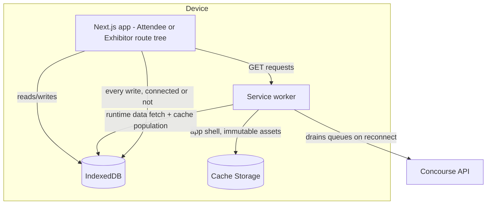
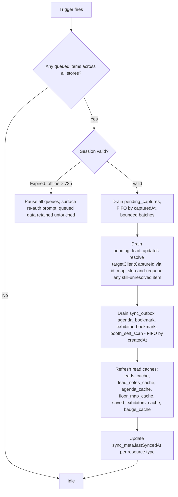

# Offline & Sync Architecture

This document is the technical implementation behind product principle P4 ("works in a concrete hall," [00-foundation.md](00-foundation.md) §1) and journey principle JP-2 ("offline moments are designed, not tolerated," [04-user-journey.md](04-user-journey.md) §5). [06-exhibitor-journey.md](06-exhibitor-journey.md) EX-6 and [07-attendee-journey.md](07-attendee-journey.md) §12 own the product-level WHAT — which actions must work offline, what a rep or attendee sees, and the business rules for re-scans and consent; this document owns the HOW — the service worker caching strategy, the IndexedDB object stores, the background-sync algorithm that drains queued writes, and the conflict-resolution logic the server and client jointly apply once connectivity returns. Where EX-6 already fixes an exact contract (the `PendingCapture` record shape, the composite-key upsert rule for `leads`), this document treats that contract as binding input and specifies the generic substrate underneath it, rather than restating or re-deriving it. All entity, persona, and route names are canonical per [00-foundation.md](00-foundation.md).

## 1. Scope and Ownership Split

| Question | Owned by |
|---|---|
| Which attendee/exhibitor actions must work offline, and what they see | [07-attendee-journey.md](07-attendee-journey.md) §12, [06-exhibitor-journey.md](06-exhibitor-journey.md) EX-6, [04-user-journey.md](04-user-journey.md) JP-2 |
| The `PendingCapture` record shape and the lead-upsert business rules (re-scan, multi-rep, duplicate merge) | [06-exhibitor-journey.md](06-exhibitor-journey.md) §6.1–6.4 |
| Consent scopes and their snapshot semantics on `booth_visits` | [07-attendee-journey.md](07-attendee-journey.md) §11 |
| Server-side idempotency (`Idempotency-Key`, Redis TTL) and the `(source, client_capture_id)` DB uniqueness this doc's queue relies on | [18-api-architecture.md](18-api-architecture.md) §3.6, [16-database-schema.md](16-database-schema.md) §6.5–6.6 |
| Session/token validity while offline, the 72-hour replay window | [20-session-strategy.md](20-session-strategy.md) |
| **Service worker caching strategy, IndexedDB schema, background-sync algorithm, conflict resolution, staleness-banner mechanics** | **This document** |

This is one Next.js app with path-scoped surfaces ([00-foundation.md](00-foundation.md) §5), not separate deployables — so "per surface" below means per route-tree (`/e/[eventSlug]/…` for the Attendee App, `/exhibit/[orgSlug]/events/[eventSlug]/…` for the Exhibitor Portal), not a second service worker. One service worker script is registered at the origin root; its caching rules branch on route prefix.

## 2. Client Architecture Overview



Two architectural rules hold for every surface, matching foundation principle 1 ("fast is the feature" means fast *and honest") and principle 4:

1. **The local store is the only write path.** There is no "try the network first, fall back to a queue" branch anywhere in this document — EX-6.1 states this for lead capture and this document generalizes it to every offline-classified write in JP-2's table (bookmarks, self-scans). A write is durable the instant it lands in IndexedDB; network delivery is a background concern the UI never blocks on.
2. **Reads are cache-first with an honest freshness signal.** Every offline-classified read (badge, agenda, floor map, saved exhibitors, leads, lead notes) renders instantly from IndexedDB/Cache Storage and separately tracks when that cache was last refreshed, which is what powers the staleness banner (§8) — the UI never fabricates liveness it doesn't have.

## 3. Service Worker Precache Strategy

"Precache" covers two distinct mechanics, and conflating them is a common PWA design error this document avoids:

- **Static asset precache** — the Next.js build's JS/CSS/font bundles and the web app manifest icons, listed in the service worker's precache manifest and fetched at `install` time, cache-busted by content hash on every deploy. This is identical for both surfaces and is not event- or user-scoped.
- **Data runtime cache** — per-event, per-user data (badge, agenda, leads, …) cannot be precached at `install` time because it doesn't exist until the user is authenticated and scoped to an event. This document's "precache strategy per surface" (§3.1–3.2) refers to this second kind: a runtime-cache population strategy that behaves *as if* precached because it is proactively refreshed at every reasonable opportunity (foreground open, reconnect, periodic timer) rather than only reactively on demand.

Cache strategy names below follow standard service-worker vocabulary (equivalent to Workbox's strategies, implemented directly against the Cache/IndexedDB APIs rather than via the Workbox dependency, since the app has no other Workbox usage and the four strategies needed are each under 20 lines):

| Strategy | Behavior |
|---|---|
| `CacheFirst` | Serve from cache if present; only hit network on a cache miss. Used for content keyed by an immutable version (an image whose cache key includes `updated_at`). |
| `StaleWhileRevalidate` | Serve from cache immediately; fire a background fetch to refresh the cache for next time. The default for offline-critical *reads*. |
| `NetworkFirst` | Try network with a short timeout; fall back to cache on failure. Used where staleness is more costly than a brief wait. |
| `NetworkOnly` | No cache involved; explicit online-required behavior. |

### 3.1 Attendee App

| Resource | JP-2 classification | Cache name | Strategy | Refresh trigger | Storage |
|---|---|---|---|---|---|
| App shell (JS/CSS/fonts/manifest) | N/A (infra) | `concourse-shell-v{buildHash}` | `CacheFirst`, precached at SW install | New deploy activates a new SW version | Cache Storage |
| Badge (`/badge`) | None required | `concourse-badge` | `StaleWhileRevalidate` | App foreground, reconnect, `registration.checked_in`, badge rotation | IndexedDB `badge_cache` |
| Agenda, personal plan (`/agenda`, `/schedule`) | None required | `concourse-agenda` | `StaleWhileRevalidate` | Foreground open of `/agenda` or `/schedule`; 15-min periodic refresh while app is foregrounded; push-triggered refresh on `agenda_session.updated` (feature G-adjacent, [05-organizer-journey.md](05-organizer-journey.md) O-5) when online | IndexedDB `agenda_cache` |
| Floor map (`/map`) | None required | `concourse-floor-map` | `CacheFirst` for the underlay image (keyed by `floor_plans.id` + `updated_at`); `StaleWhileRevalidate` for booth vector geometry | Floor-plan `updated_at` change (ETag compare, [18-api-architecture.md](18-api-architecture.md) §3.7); foreground open of `/map` | Cache Storage (image) + IndexedDB `floor_map_cache` (vectors) |
| Saved exhibitors (`/schedule`, exhibitor bookmarks) | None required | `concourse-saved-exhibitors` | `StaleWhileRevalidate` | On save/unsave, foreground open, 15-min periodic refresh | IndexedDB `saved_exhibitors_cache` |
| Bookmark write (agenda session or exhibitor) | Degraded (queued write) | — | write-through to `sync_outbox` (§5.2) | Every tap | IndexedDB `sync_outbox` |
| Self-scan write (`/scan`) | Degraded (queued write) | — | write-through to `sync_outbox` (§5.2); camera decode and the consent sheet are 100% local logic, no network dependency to render | Every scan | IndexedDB `sync_outbox` |
| Expo Copilot, Smart Matchmaking, live announcements, meeting booking, notification writes | Online required | — | `NetworkOnly` | — | none |

### 3.2 Exhibitor Portal

| Resource | JP-2 classification | Cache name | Strategy | Refresh trigger | Storage |
|---|---|---|---|---|---|
| Capture write path (`/capture`) | None required (full loop offline) | — | write-through to `pending_captures` (§5.1) — never `NetworkOnly`, per EX-6.1's "the queue is the only write path" rule | Every scan | IndexedDB `pending_captures` |
| Leads list & detail, read side (`/leads`, `/leads/[leadId]`) | None required for triage of already-synced leads | `concourse-leads` | `StaleWhileRevalidate` | Foreground open, 5-min periodic refresh during `events.status = live`, on any `capture synced` completion | IndexedDB `leads_cache` |
| Lead notes, read side (`lead_notes` on a lead detail) | None required | `concourse-lead-notes` | `StaleWhileRevalidate` | Together with the parent lead's refresh | IndexedDB `lead_notes_cache` |
| Lead notes, write side — a standalone note added from `/leads/[leadId]` in a triage moment (EX-7), distinct from the inline note captured at scan time (EX-6.1) | None required | — | write-through to `pending_lead_updates` (§5.3) | Every note submit | IndexedDB `pending_lead_updates` |
| Meeting slot booking, Follow-up Studio, CRM sync, billing checkout | Online required | — | `NetworkOnly` | — | none |

The `/leads` screen renders the union of `leads_cache` (server-confirmed) and any still-`pending`/`syncing` rows in `pending_captures`, projected client-side into the same list shape and visually marked "pending sync" — Jamal needs to see a lead he just captured in the triage list immediately, not only on `/capture`, even before it has a server-assigned `leadId` (§6.3).

## 4. IndexedDB Schema

**Decision:** each surface opens its own IndexedDB database, opened only when that surface's route tree is active in the client bundle (Next.js route-group code splitting already separates them). This keeps the schema legible per persona and avoids one shared database accumulating unrelated stores as the product grows. **Decision:** both databases are accessed through the `idb` wrapper (Jake Archibald's Promise-based IndexedDB adapter) rather than the raw callback API — a ~1.2 KB dependency with no architectural surface area, chosen purely to keep the code in this document (and in the real implementation) readable.

### 4.1 `concourse-attendee` (opened under `/e/[eventSlug]/…`)

| Object store | Key path | Purpose |
|---|---|---|
| `badge_cache` | `registrationId` | Precached badge + rendered QR |
| `agenda_cache` | `agendaSessionId` | Precached agenda sessions for the active event |
| `floor_map_cache` | `floorPlanId` | Precached booth vector geometry (the underlay image itself lives in Cache Storage, not IndexedDB, since it's a large blob) |
| `saved_exhibitors_cache` | `eventExhibitorId` | Precached bookmarked-exhibitor summaries |
| `sync_outbox` | `clientOperationId` | Generic queued write for bookmark and self-scan actions (§5.2) |
| `sync_meta` | `[resourceType, scopeId]` | One row per cached resource type holding `lastSyncedAt`, read by the staleness banner (§8) |

```ts
interface BadgeCacheEntry {
  registrationId: string;
  eventId: string;
  badgeCode: string;
  qrSvgMarkup: string;        // rendered locally from badgeCode — no image fetch, no network dependency to display
}

interface AgendaCacheEntry {
  agendaSessionId: string;
  eventId: string;
  title: string;
  track?: string;
  room?: string;
  startsAt: string;
  endsAt: string;
  capacity: number | null;
  bookmarked: boolean;
}

interface SyncMetaEntry {
  resourceType: "badge" | "agenda" | "floor_map" | "saved_exhibitors" | "leads" | "lead_notes";
  scopeId: string;             // eventId or eventExhibitorId — the resource's tenancy scope
  lastSyncedAt: string;        // device-clock ISO-8601, set on every successful refresh fetch
  lastSyncError?: string;
}
```

### 4.2 `concourse-exhibitor` (opened under `/exhibit/[orgSlug]/events/[eventSlug]/…`)

| Object store | Key path | Purpose |
|---|---|---|
| `pending_captures` | `clientCaptureId` | The exact `PendingCapture` contract fixed by [06-exhibitor-journey.md](06-exhibitor-journey.md) §6.1 — reproduced verbatim below, not redefined |
| `pending_lead_updates` | `clientUpdateId` | Offline stage transitions, reassignments, or standalone notes made against a lead after its initial capture (§5.3) |
| `leads_cache` | `leadId` | Read cache for lead triage |
| `lead_notes_cache` | `leadNoteId` | Read cache for lead notes |
| `id_map` | `clientCaptureId` | Maps a not-yet-confirmed local capture to its server-assigned `boothVisitId`/`leadId` once synced — the join `pending_lead_updates` needs to resolve a target that may not exist server-side yet (§6.3) |
| `sync_meta` | `[resourceType, scopeId]` | Same role as the attendee database's store |

```ts
// Reproduced verbatim from [06-exhibitor-journey.md](06-exhibitor-journey.md) §6.1 — that document
// is the sole owner of this shape; this schema must not drift from it independently.
interface PendingCapture {
  clientCaptureId: string;
  badgeCode: string;
  eventExhibitorId: string;
  boothId: string;
  capturedByStaffId: string;
  capturedAt: string;
  qualifierAnswers?: Record<string, string | number | boolean>;
  textNote?: string;
  voiceNote?: {
    localBlobRef: string;
    durationSeconds: number;
    uploadStatus: "pending" | "uploaded" | "failed";
  };
  syncStatus: "pending" | "syncing" | "synced" | "failed";
  syncAttempts: number;
  lastSyncError?: string;
}

interface PendingLeadUpdate {
  clientUpdateId: string;       // UUIDv7 — this update's own idempotency key
  targetClientCaptureId?: string; // set when the target lead has not yet synced (resolved via id_map)
  targetLeadId?: string;          // set when the target lead already has a server id
  kind: "stage_transition" | "reassignment" | "note";
  // stage_transition: PATCH /v1/leads/{leadId} (feature H3 pipeline, EX-7.1)
  // reassignment: PATCH /v1/leads/{leadId} owner_user_id (feature H8, EX-7.5)
  // note: POST /v1/leads/{leadId}/lead-notes (EX-7 triage note, distinct from EX-6.1's inline capture-time note)
  payload: Record<string, unknown>;   // e.g. { status: "qualified" } | { ownerUserId } | { bodyMd, voiceLocalBlobRef? }
  createdAt: string;
  syncStatus: "pending" | "syncing" | "synced" | "failed";
  syncAttempts: number;
  lastSyncError?: string;
}
```

### 4.3 The generic attendee outbox shape

Attendee-side offline writes (bookmarks, self-scans) have no locked business-rule document dictating an exact record shape the way `PendingCapture` does, and they are structurally homogeneous — each is "one idempotent mutation against one resource." Rather than invent a bespoke store per action, this document defines one generic shape:

```ts
interface SyncOutboxItem<TPayload = Record<string, unknown>> {
  clientOperationId: string;    // UUIDv7 — sent as Idempotency-Key ([18-api-architecture.md](18-api-architecture.md) §3.6)
  entityType: "agenda_bookmark" | "exhibitor_bookmark" | "booth_self_scan";
  method: "POST" | "DELETE";
  route: string;                 // resolved resource path, e.g. "/v1/agenda-sessions/{id}/bookmark"
  payload: TPayload;
  createdAt: string;
  syncStatus: "pending" | "syncing" | "synced" | "failed";
  syncAttempts: number;
  lastSyncError?: string;
}
```

**Coalescing rule:** before enqueueing a new `SyncOutboxItem`, the write path checks `sync_outbox` for an existing `pending` item with the same `entityType` + target resource id. If found, it is **replaced in place** rather than appended — a rapid bookmark/unbookmark toggle while offline must resolve to one final network call reflecting the last state, never two contradictory calls racing on sync. This is the client-side half of "last-write-wins" for a boolean toggle; the server has nothing to reconcile because only one request ever arrives.

## 5. Write Paths

### 5.1 Exhibitor capture (delegates to EX-6)

The scan → local write → sync flow, the `PendingCapture` lifecycle, voice-note upload sequencing, and bounded-batch bulk flush are specified in full in [06-exhibitor-journey.md](06-exhibitor-journey.md) §6.1–6.2 and §6.5. This document's `pending_captures` store is the literal implementation of that contract; no additional mechanics are introduced here beyond the generic drain algorithm (§6) that operates on it identically to every other queue.

### 5.2 Attendee bookmark and self-scan

```mermaid
sequenceDiagram
    participant S as Sofia (PWA)
    participant OB as IndexedDB (sync_outbox)
    participant SW as Service worker
    participant API as Concourse API

    S->>S: Taps bookmark, or completes /scan consent sheet
    S->>OB: Writes SyncOutboxItem, syncStatus=pending
    OB-->>S: Instant local confirm - bookmark fills in, "Shared with {exhibitor}" renders
    Note over S,OB: Identical whether online or offline - no branch
    SW->>SW: Detects connectivity restored / periodic flush
    SW->>OB: Reads syncStatus=pending, ordered by createdAt
    SW->>API: POST/DELETE with Idempotency-Key: clientOperationId
    API-->>SW: 2xx
    SW->>OB: Marks synced; prunes after 24h confirmation window
```

Both actions use the identical mechanism [06-exhibitor-journey.md](06-exhibitor-journey.md) uses for capture, per [07-attendee-journey.md](07-attendee-journey.md) §12's explicit statement that bookmarks and self-scans "queue in IndexedDB with a client-generated idempotency key and sync on reconnect... the same pattern." The self-scan's consent sheet outcome (grant or decline) is part of the queued payload — the `booth_visits.consent_contact_sharing` snapshot ([07-attendee-journey.md](07-attendee-journey.md) §11) is taken at the moment of the local write, not at sync time, so a device that stays offline for hours still preserves the exact consent state Sofia chose at the moment she chose it.

### 5.3 Exhibitor lead updates after initial capture

A pipeline stage transition (feature H3), a reassignment to a different rep (feature H8, EX-7.5), or a standalone note added during triage (EX-7, as opposed to the note captured inline at scan time per EX-6.1) all write a `PendingLeadUpdate`. If the originating capture has not yet synced, the update targets `targetClientCaptureId` rather than a server `leadId` that doesn't exist yet — the drain algorithm (§6) is responsible for resolving this dependency in order.

**Decision — `lead_notes` has no DB-level replay-safety constraint, unlike `booth_visits`/`leads`.** [18-api-architecture.md](18-api-architecture.md) §3.6 requires an `Idempotency-Key` on `POST .../lead-notes` exactly as it does on `booth-visits`/`leads`, but [16-database-schema.md](16-database-schema.md) §6.7 carries no `client_capture_id`-equivalent column or uniqueness constraint on `lead_notes` — a note is append-only content, not an upsert target, so there is no composite key for it to dedup against past the 24-hour Redis TTL. The exposure this leaves is narrow and accepted rather than engineered around: a device that retries a queued note-add *after* both the 24-hour Redis window and any local retry cycle have elapsed could, in the rare worst case, post the same note twice. The result is a cosmetically duplicated, trivially mergeable note — never a duplicate lead, a double-counted metric, or a tenancy/consent violation — so no second uniqueness mechanism is added purely to close that gap. This is why `pending_lead_updates`' `note` writes rely on the same 24-hour Redis `Idempotency-Key` window as every other write in this document, with no additional client- or server-side dedup layered on top.

## 6. Background-Sync Algorithm

### 6.1 Trigger strategy — no reliance on the Background Sync API alone

**Decision:** the sync engine is triggered by, in order of preference: (1) the browser `online` event, (2) the Web Background Sync API (`ServiceWorkerRegistration.sync`) where supported, (3) a 30-second foreground polling timer while the app is visible, and (4) an explicit flush on every app foreground/resume. Background Sync is used as a progressive enhancement, never a dependency — Jamal's device is explicitly his personal iPhone ([06-exhibitor-journey.md](06-exhibitor-journey.md) EX-5), and Safari on iOS does not implement the Background Sync API. A design that relied on it exclusively would silently fail to sync for the platform's primary offline-capture device. The foreground timer plus foreground/resume flush give iOS equivalent reliability whenever the app is open, which matches Jamal's real usage pattern (app open throughout the show day) — the gap this leaves (sync while the PWA is fully backgrounded on iOS for an extended period) is closed the moment he next opens the app, which is no later than his next scan.

### 6.2 Drain order



Order is deliberate, not incidental: **writes drain before reads refresh**, so a device that just reconnected pushes its own pending intelligence (captures, updates, bookmarks) before pulling anyone else's — this avoids a stale read-refresh overwriting a cache entry the device's own not-yet-sent write was about to change locally. Within writes, **captures drain before dependent updates**, because a `PendingLeadUpdate` targeting an unsynced capture has nothing to attach to server-side yet; any such item is left `pending` and retried on the next drain cycle rather than blocking the batch (this is expected to resolve within one or two cycles in practice, since captures typically sync in well under a second on reconnect).

### 6.3 The `id_map` resolution step

On every successful `pending_captures` sync, the server response (`{ boothVisitId, leadId }`, per EX-6.2) is written into `id_map` keyed by `clientCaptureId`. Before draining `pending_lead_updates`, the engine resolves each item's `targetClientCaptureId` against `id_map`; a hit rewrites the item to carry `targetLeadId` and it proceeds; a miss leaves it queued for the next cycle. `id_map` entries are retained for the same 24-hour confirmation window as their originating capture (§6.5 in EX-6) — long enough to cover the realistic delay between a capture and a same-day follow-up edit to it.

### 6.4 Exponential backoff

Backoff applies only to requests that were actually **attempted and failed** while the device believed itself online — merely being offline never counts as a failed attempt and never advances a backoff counter; the engine simply waits for the next trigger. For a genuine failure:

| Response | Classification | Action |
|---|---|---|
| Network error / timeout, `429`, `5xx` | Retryable | Exponential backoff: `delay = min(2000ms × 2^attempt, 300000ms) + jitter(0–1000ms)`; retried indefinitely while the device is online, since these are expected transient conditions on hall Wi-Fi |
| `401 unauthenticated` | Session expired | Pause the entire queue (not just this item); surface the re-auth prompt (§6.5); resume draining automatically on successful re-login — no data loss |
| `409 idempotency_conflict` | Non-retryable | Should not occur given a device-generated UUIDv7 key, but if the same key is ever replayed with a different body (e.g., a corrupted local write), flag as a permanently failed, actionable item rather than retry forever |
| `422 validation_failed` | Non-retryable | Flag as actionable; surfaced to the rep/attendee with the specific field error, never a silent drop (EX-6.5's "one actionable item, never a silent drop" rule, generalized to every queue) |
| `403 permission_denied` / `entitlement_required` | Non-retryable | Flag as actionable — e.g., an exhibitor's tier lapsed mid-event (EX-4's downgrade edge case) while a capture was queued; the rep sees why, not a mystery failure |

The queue badge pattern from EX-6.5 ("syncing 47 of 112") generalizes to every store in §4: any non-empty queue shows a count, any permanently-failed item shows as one actionable row, and a fully-drained queue shows "all synced" — never a spinner, per foundation principle 1.

### 6.5 The 72-hour offline replay window

[18-api-architecture.md](18-api-architecture.md) §3.6 fixes the offline PWA replay window at **72 hours**, owned in full mechanical detail by [20-session-strategy.md](20-session-strategy.md) §11. This document consumes that number as the bound on how long a device may accumulate queued writes while continuing to authenticate them against its existing session, and is precise about what it does and does not gate:

- **What it does not gate:** replay safety of the writes themselves. `booth_visits` and `leads` carry a permanent DB-level `UNIQUE (source, client_capture_id)` constraint ([16-database-schema.md](16-database-schema.md) §6.5–6.6), so a queued capture remains safely replayable indefinitely — there is no data-loss cliff at 72 hours.
- **What it does gate:** the session token authenticating those requests. Beyond 72 hours offline, [20-session-strategy.md](20-session-strategy.md)'s session mechanics expire the device's ability to authenticate without a fresh login. At that point (§6.2's decision node), the sync engine **pauses rather than discards**: every queued item in every store remains in IndexedDB untouched, the UI shows "Sign in to sync your {N} pending items," and a successful re-login resumes the drain from exactly where it stopped. A rep whose device sat offline for three-plus days of a multi-day event (a realistic worst case per EX-6.5's "hundreds of conversations... connectivity dying after lunch" pattern, extended across days) never loses a scan — he re-authenticates once and every queued capture flushes.

## 7. Conflict Resolution Rules Per Entity

| Entity | Conflict model | Rule | Detail owned by |
|---|---|---|---|
| `booth_visits`, `leads` (rep capture, self-scan) | Client-generated idempotency key + server-side composite-key upsert | `client_capture_id` dedups a single device's retries (first-write-wins on that key: a replay of the same key+body returns the original stored response, [18-api-architecture.md](18-api-architecture.md) §3.6). The **lead** itself dedups across devices/reps/days on `(event_exhibitor_id, registration_id)` — the first request to reach the server creates the lead, every subsequent one appends. No conflict is ever surfaced to a rep because none exists at the data-model level. | [06-exhibitor-journey.md](06-exhibitor-journey.md) §6.3–6.4 |
| `registrations` check-ins (staff-scanned) | Server-side duplicate collapse | Multiple staff devices queue the same badge's check-in independently while offline; on sync, the first `registration.checked_in` write wins (sets `status = 'checked_in'`, `checked_in_at`), and every later duplicate for the same `registration_id` collapses silently — a no-op success, not an error — because the state is already correct. This is O-8's rule verbatim ([05-organizer-journey.md](05-organizer-journey.md) O-8: "first check-in wins, later duplicates collapse silently"). Unlike lead capture, there is no per-write idempotency key here because the target state (`checked_in`) is itself idempotent — re-applying it is a no-op by construction, so no additional dedup mechanism is needed. | [05-organizer-journey.md](05-organizer-journey.md) O-8 |
| `agenda_sessions`, `floor_plans`, `booths`, `event_exhibitors` (attendee-facing read caches) | No conflict — read-only cache | The Attendee App never writes to these tables; it only ever caches organizer/exhibitor-authored data. There is nothing to reconcile because the client holds no competing version — only a **staleness banner** (§8) communicating how old the cached copy is. An organizer edit (e.g., a room change, [05-organizer-journey.md](05-organizer-journey.md) O-5) simply becomes visible on the attendee's next successful refresh; nothing is ever merged. | This document (§8) |
| `attendee_interests` (bookmarks feeding inferred interests) | Toggle coalescing, no server conflict | Covered by the `sync_outbox` coalescing rule (§4.3) — only the final client state is ever sent, so the server never receives contradictory requests to reconcile. | This document (§4.3, §5.2) |
| `lead_notes` (standalone triage notes and inline capture-time notes) | Append-only — no conflict possible | Every note is a new row attached to an existing lead; nothing is ever overwritten, so there is nothing to reconcile. Duplicate risk past the 24-hour idempotency window is a stated, accepted decision (§5.3), not a merge rule. | This document (§5.3) |
| Voice note transcription (`lead_notes.transcription_status`) | Sequenced dependency, not a conflict | The audio blob syncs strictly after its parent capture (EX-6.2); transcription is asynchronous server-side work with no client-side write to race against. | [06-exhibitor-journey.md](06-exhibitor-journey.md) §6.2 |

## 8. Staleness Banner UX Contract

The staleness banner is the client-facing half of foundation principle 1 ("fast is the feature" — including *fast truth*, [05-organizer-journey.md](05-organizer-journey.md) O-8) applied to every offline-classified read in §3. It renders exactly when a cached read is being served without a confirmed-fresh refresh, and never otherwise — a `StaleWhileRevalidate` cache hit that is followed by a successful background refresh within the render frame never shows a banner at all; only a **failed or skipped** revalidation (offline, timeout, error) does.

**Timestamp source:** every successful cache refresh writes `lastSyncedAt` (device clock, ISO-8601) into the relevant `sync_meta` row (§4) at the moment the response is accepted — never at the moment of render. The banner reads that stored value and computes a relative time client-side, re-rendered on a fixed interval (every 30 seconds) so the display stays live ("last synced 2m ago" ticking to "3m ago") without triggering any additional network activity. This is the same value both surfaces use — there is exactly one `sync_meta` mechanism, not a bespoke timestamp per resource type, per foundation principle 3 ("one source of truth").

**Copy pattern:**

| Condition | Copy | Notes |
|---|---|---|
| Cache served, refresh in flight or not yet due | *(no banner)* | The default, fast path |
| Cache served, last refresh attempt failed (offline or network error) | "Last synced {relative time} ago" | e.g. "Last synced 12m ago" |
| Cache served, `sync_meta` row has never been written for this resource (first-ever offline load before any successful sync) | "Showing saved data from your last visit — reconnect to update" | Distinguishes "stale" from "never synced," since a bare timestamp is meaningless with no prior sync |
| Queue non-empty (any store in §4 has `pending`/`syncing` items) | "{N} pending — will sync automatically" | The queue-badge pattern from EX-6.5, generalized |
| Session expired offline > 72h (§6.5) | "Sign in to sync your {N} pending items" | Actionable, names the exact blocker, per JP-7 ("no dead ends") |

No banner ever says or implies "live" when it is not — this is a hard product rule, not a copy-polish nicety: the same honesty discipline [05-organizer-journey.md](05-organizer-journey.md) O-8 requires of the live-ops dashboard ("last updated 4 min ago... fast truth") applies identically to every attendee- and exhibitor-facing cache in this document.

## 9. Storage Reliability and Edge Cases

- **Quota pressure.** If the browser's storage quota is nearly exhausted, eviction priority is: read-only caches (`*_cache` stores, Cache Storage entries) first, in LRU order; write queues (`pending_captures`, `pending_lead_updates`, `sync_outbox`) are never automatically evicted under any circumstance. If quota pressure persists after evicting every read cache, the UI shows a blocking "Storage full — connect to sync now" banner rather than silently dropping capture data — this is the direct implementation of EX-6's trust guarantee ("every scan preserved, network or not").
- **iOS Safari storage eviction.** Safari's Intelligent Tracking Prevention can evict a PWA's IndexedDB/Cache Storage after roughly a week of the site not being opened. Because Jamal's and Sofia's usage patterns both involve opening the app throughout an active event (well under that window), this is a non-issue during live days. Between events, a returning multi-event attendee (JP-8, [07-attendee-journey.md](07-attendee-journey.md) §13.4) may find prior caches evicted — this is acceptable and requires no mitigation, since read caches simply rebuild on next login and no queued write ever survives unsynced for a week without also hitting the 72-hour re-auth pause first, which already surfaces the same "reconnect" UI a rebuild would.
- **Multiple devices, same rep or same attendee.** Each device maintains an entirely independent set of stores; there is no cross-device queue merge. This is intentional, not a gap — server-side dedup (the `leads` composite key, the check-in no-op rule) already makes independent devices safe to reconcile without any client-to-client coordination (EX-6.4's "two devices capture the same badge while both offline" scenario is resolved entirely server-side).
- **Logout with a non-empty queue.** Logging out never clears `pending_captures`, `pending_lead_updates`, or `sync_outbox` — a confirmation dialog states the pending count and requires an explicit "sync first" or "log out anyway, keep queue for next login" choice. The queue is scoped to the device and the surface's IndexedDB database, not to the session, so it survives the logout and drains on the next successful login by anyone with access to that `event_exhibitors`/registration context.

## 10. Related Documents

| Detail | Owned by |
|---|---|
| Offline-critical action classification, JP-2's action-by-action table | [04-user-journey.md](04-user-journey.md) §5 |
| Exhibitor capture business rules: `PendingCapture` contract, re-scan/conflict rules, voice-note pipeline | [06-exhibitor-journey.md](06-exhibitor-journey.md) EX-6 |
| Attendee low-connectivity behavior table, consent snapshot semantics | [07-attendee-journey.md](07-attendee-journey.md) §11–12 |
| `Idempotency-Key` mechanics, Redis TTL, rate limits on scan ingestion | [18-api-architecture.md](18-api-architecture.md) §3.6, §3.8 |
| Column-level uniqueness (`(source, client_capture_id)`, lead composite key), RLS | [16-database-schema.md](16-database-schema.md) §6.5–6.6 |
| Session/token lifetime, the 72-hour offline replay window mechanics, re-auth flow | [20-session-strategy.md](20-session-strategy.md) |
| Check-in duplicate collapse, live-ops honesty banner precedent | [05-organizer-journey.md](05-organizer-journey.md) O-8 |
| PWA install, service worker registration, web app manifest at the platform level | [00-foundation.md](00-foundation.md) §6 (D3) |
| Web Push delivery for reconnect-triggered notifications | [33-notification-system.md](33-notification-system.md) |
