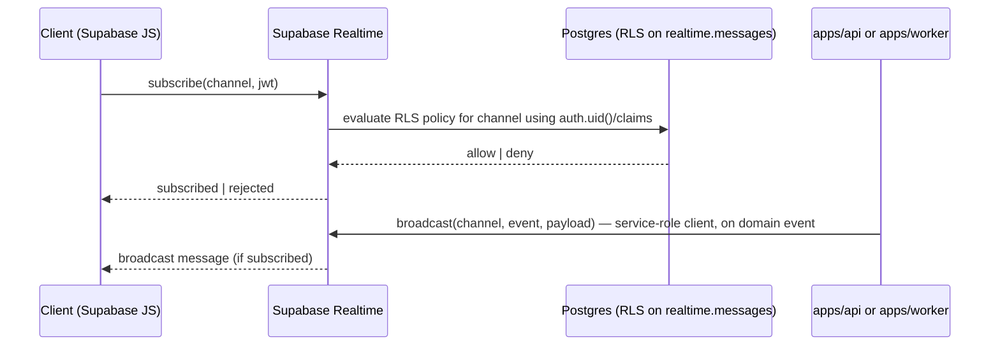
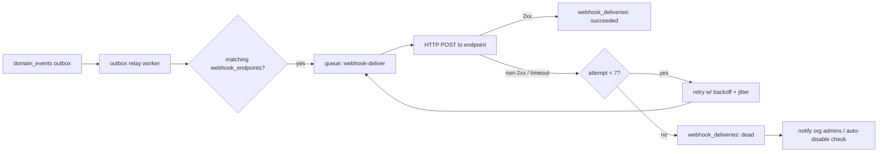

# API Architecture

This document specifies the Concourse REST API: the NestJS 11/Fastify service layout, the OpenAPI 3.1 contract pipeline, the full resource map for every module, and the request conventions (pagination, filtering, errors, idempotency, concurrency, rate limiting, versioning, context propagation), plus the realtime, public API, and webhook subsystems. It expands [00-foundation.md](00-foundation.md) §9 into build-ready detail. Column-level schema belongs to [16-database-schema.md](16-database-schema.md); the role→permission matrix belongs to [28-permission-model.md](28-permission-model.md); the machine-readable error code registry belongs to [41-error-code-registry.md](41-error-code-registry.md).

## 1. Service Topology

- **One API deployable** (`apps/api`): NestJS 11 on the Fastify adapter, hosted on ECS Fargate behind an ALB at `api.concourse.app`. It serves both the first-party app API and the public API — same routes, two auth modes (session cookie vs `api_keys`). A separate gateway service is rejected: one deployable keeps the contract single-sourced and we are nowhere near the scale where routing tiers pay for themselves.
- **One worker deployable** (`apps/worker`): Node 22 + BullMQ 5 consumers sharing NestJS modules with the API. It talks to Postgres/Redis directly; it calls API HTTP endpoints only for the internal operations listed in §12.
- **Module layout** (NestJS modules mirror the domain registry in [00-foundation.md](00-foundation.md) §7 and the feature breakdown in [11-information-architecture.md](11-information-architecture.md)):

| NestJS module | Owns resources |
|---|---|
| `AuthModule` | `/v1/auth/*` (flows in [19-authentication-strategy.md](19-authentication-strategy.md), sessions in [20-session-strategy.md](20-session-strategy.md)) |
| `UsersModule` | `users` (self-service) |
| `OrganizationsModule` | `organizations`, `organization_memberships`, invites |
| `EventsModule` | `events`, `event_staff` |
| `FloorModule` | `venues`, `floor_plans`, `booths` |
| `ExhibitorsModule` | `event_exhibitors`, `exhibitor_staff` |
| `ProductsModule` | `products`, `event_product_listings` |
| `RegistrationsModule` | `registrations`, `attendee_interests`, badge codes |
| `AgendaModule` | `agenda_sessions`, `session_checkins` |
| `EngagementModule` | `booth_visits`, `leads`, `lead_notes`, `meetings` |
| `MatchmakingModule` | `match_recommendations` |
| `KnowledgeBaseModule` | `kb_sources`, `kb_documents` (chunks are internal-only) |
| `AiModule` | `ai_conversations`, `ai_messages` (behavior in [21-ai-architecture.md](21-ai-architecture.md)) |
| `FilesModule` | `files` (storage design in [26-file-storage.md](26-file-storage.md)) |
| `NotificationsModule` | `notifications`, `notification_preferences`, push subscriptions |
| `BillingModule` | `plans`, `subscriptions`, `entitlements`, Stripe webhook |
| `WebhooksModule` | `webhook_endpoints`, `webhook_deliveries` |
| `ApiKeysModule` | `api_keys` |
| `SearchModule` | deterministic federated search per event |
| `AdminModule` | `/v1/admin/*` (platform:admin only) |
| `HealthModule` | `/healthz`, `/readyz` (unauthenticated, ALB-internal) |

## 2. Contract Pipeline (OpenAPI 3.1 → typed client)

The OpenAPI document is **generated from code and treated as the contract**; hand-written specs drift.

1. Controllers declare request/response shapes with Zod 3 schemas from `packages/shared` (via `nestjs-zod`-style pipes vendored into `packages/api-contract`). Zod is the single source: validation, OpenAPI schema, and TS types all derive from it.
2. CI runs `pnpm --filter api openapi:emit` producing `packages/api-contract/openapi/concourse.v1.json` (OpenAPI 3.1). The artifact is committed; a CI check fails if the emitted spec differs from the committed one, so every contract change is visible in review.
3. `packages/api-client` is generated from that artifact (fetch-based, zero runtime deps beyond `fetch`), exporting one typed function per operationId plus shared types. Operation IDs are stable `module_action` strings (`leads_list`, `leads_update`) — renaming one is a breaking change and reviewed as such.
4. The Next.js app consumes `packages/api-client` exclusively — no ad-hoc `fetch` to the API. This is the D3 native-readiness seam ([00-foundation.md](00-foundation.md) D3): React Native apps later consume the identical client. The client is written as a **tolerant reader**: unknown response fields and unknown enum values must not throw (unknown enums decode to a typed `"unknown"` sentinel), which is what lets us add fields and enum values without a major version.

## 3. Request Conventions

### 3.1 Resource naming and IDs

Per [00-foundation.md](00-foundation.md) §9: plural kebab-case paths, UUIDv7 ids. Route params are typed ids (`{eventId}`, `{leadId}`), never slugs — slug→id resolution is a web-app concern (`GET /v1/events/lookup?slug=` exists for the Next.js router, see §5.4). State transitions with side effects use verb subresources (`POST /v1/events/{eventId}/publish`) rather than `PATCH status`, because transitions carry validation and fan-out that a generic field write hides.

### 3.2 Pagination

Cursor-based everywhere; offset pagination is rejected (unstable under concurrent writes, O(n) on deep pages).

- Request: `?cursor=<opaque>&limit=<1..100>` (default `limit=25`).
- Cursor encoding: base64url of `{ k: [sortKeyValues...], id: "<uuid>" }`, HMAC-signed with a server key so clients can't forge positions. Cursors are valid only for the same `sort`+`filter` combination; a mismatch returns 400 `invalid_cursor`.
- Response envelope (every list endpoint, no exceptions):

```json
{ "data": [ … ], "pagination": { "nextCursor": "…", "hasMore": true } }
```

- No `totalCount` in list envelopes (COUNT(*) on large tenant tables is a foot-gun). Endpoints that genuinely need counts expose dedicated aggregate endpoints (e.g. `GET /v1/event-exhibitors/{id}/leads/stats`).

### 3.3 Filtering, sorting, search

- **Filter grammar:** `?filter[field][op]=value`. Operators: `eq` (default, so `filter[status]=qualified` works), `ne`, `lt`, `lte`, `gt`, `gte`, `in` (comma-separated), `contains` (ILIKE, allowlisted text fields only), `null` (`true|false`). Multiple filters are AND-ed. OR composition is deliberately unsupported in v1 — it makes index usage unpredictable; needs beyond AND belong to the search endpoints or Organizer Pulse.
- **Sort grammar:** `?sort=-captured_at,score` (leading `-` = descending). Every resource declares an allowlist of sortable fields; unknown fields → 400 `invalid_sort`. Default sort is always `-created_at,id` unless a table below says otherwise, and `id` is always the implicit tiebreaker (cursor stability).
- **Free text:** `?q=` where the resource map says so; implemented with Postgres trigram/`tsvector` indexes, not vectors — semantic search is Expo Copilot's job.
- Filterable/sortable field allowlists per resource live with the Zod schemas in `packages/shared` and are emitted into the OpenAPI description of each operation.

### 3.4 Response shaping: expansion, not sparse fieldsets

Decision: **`?expand=` with a per-resource whitelist; no `?fields=` sparse fieldsets.** Sparse fieldsets force every property optional in the generated client, destroying type safety — the whole point of `packages/api-client`. Expansion is one level deep, comma-separated (`GET /v1/leads/{id}?expand=registration,owner`), and each expandable relation is listed in the resource's OpenAPI schema as a nullable embedded object (present only when expanded). Expansions never cross a tenant boundary the caller couldn't read directly.

### 3.5 Errors — RFC 9457 `application/problem+json`

Every non-2xx response is a problem document:

```json
{
  "type": "https://docs.concourse.app/errors/stale_resource",
  "title": "Stale resource",
  "status": 412,
  "code": "stale_resource",
  "detail": "This event was modified after you fetched it. Re-fetch and retry.",
  "requestId": "req_01J9X6…",
  "errors": [
    { "field": "startsAt", "code": "before_end", "message": "startsAt must precede endsAt." }
  ]
}
```

- `code` is the stable machine key; the full registry with HTTP status mapping is [41-error-code-registry.md](41-error-code-registry.md). Clients branch on `code`, never on `detail` text.
- `errors[]` appears only on `422 validation_failed` (field-level Zod issues). Malformed JSON/body is `400 malformed_request`.
- 401 = unauthenticated (`code: unauthenticated`), 403 = authenticated but denied (`code: permission_denied` or `entitlement_required`, with `errors[0].code` carrying the missing permission/entitlement key). 404 is returned instead of 403 when revealing existence would leak cross-tenant information (default for all id-addressed routes).
- `requestId` always echoes §3.9's request id so support can join client reports to logs.

### 3.6 Idempotency

- `Idempotency-Key` header (UUIDv4 from the client) accepted on **every POST**; **required** (400 `idempotency_key_required`) on POSTs that create facts that must not double-fire: `booth-visits`, `leads`, `lead-notes`, `meetings`, `session_checkins`, billing checkout, `webhook-deliveries` redeliver.
- Storage: Redis `idem:{principalId}:{method}:{route}:{key}` → `{ bodySha256, status, responseBody }`, TTL 24 h.
- Replay with same key + same body hash: stored response replayed with header `Idempotency-Replayed: true`. Same key + different body: `409 idempotency_conflict`. In-flight duplicate (key exists, no stored response yet): `409 idempotency_in_progress` — clients retry with backoff.
- 24 h TTL is deliberate: the offline PWA replay window ([20-session-strategy.md](20-session-strategy.md) §11) is 72 h, so offline-queued mutations carry their own dedupe: `booth_visits` and `leads` also have DB-level uniqueness on `(source, client_capture_id)` per [16-database-schema.md](16-database-schema.md), making replays safe past Redis TTL.

### 3.7 Optimistic concurrency

Decision: **`If-Match` with an ETag derived from `updated_at`** (microsecond epoch, weak ETag `W/"1719412345123456"`). A `version` counter column is rejected — `updated_at` already exists on every table ([00-foundation.md](00-foundation.md) §11) and microsecond precision makes collisions implausible for human-driven edits.

- Every single-resource GET returns `ETag`; every PATCH/DELETE accepts `If-Match`.
- `If-Match` is **required** (428 `precondition_required`) on contended resources where lost updates are costly: `events`, `floor_plans`, `booths` (assignment races), `event_exhibitors`, `webhook_endpoints`. Elsewhere it is honored when sent.
- Mismatch → 412 `stale_resource`. Clients re-fetch, merge, retry.

### 3.8 Rate limiting

Token buckets in Redis (Lua script, atomic take-or-reject), keyed by principal. Responses carry IETF draft headers `RateLimit-Limit`, `RateLimit-Remaining`, `RateLimit-Reset`; rejections are `429 rate_limited` with `Retry-After`.

| Bucket key | Sustained | Burst | Notes |
|---|---|---|---|
| Session (per `auth_sessions` id) | 300 req/min | 600 | Covers all first-party surfaces |
| API key (per `api_keys` id) | 120 req/min | 240 | Overridable per key (`rate_limit_per_minute` column) |
| Unauthenticated per IP | 60 req/min | 120 | Auth endpoints have stricter, separate buckets — [19-authentication-strategy.md](19-authentication-strategy.md) §8 |
| Scan ingestion, per `event_exhibitors` id (`POST booth-visits`, `POST leads`) | 1,200 req/min | 2,400 | A busy booth with 10 reps scanning must never throttle; this is the "works in a concrete hall" budget |
| AI messages, per user | 20 req/min | 30 | Cost control; see [21-ai-architecture.md](21-ai-architecture.md) |

Limits are config, not code (env-sourced with per-key/per-plan overrides), so incidents are tunable without deploys.

### 3.9 Request context propagation

A Fastify `onRequest` hook builds an immutable `RequestContext` stored in `AsyncLocalStorage`:

```
RequestContext {
  requestId,            // X-Request-Id honored if present & well-formed, else generated (req_ + UUIDv7)
  traceId,              // OpenTelemetry
  principal: { kind: 'session' | 'api_key' | 'service', userId?, sessionId?, apiKeyId?, serviceName? },
  orgId?, eventId?, eventExhibitorId?,   // resolved from path params AFTER authorization (§ below)
}
```

- The context flows to: pino log lines (every line carries `requestId`/`traceId`), Sentry scope, OTel span attributes, the Postgres session variables `app.current_org_id` / `app.current_user_id` for RLS ([00-foundation.md](00-foundation.md) §8), and into every BullMQ job payload as `meta: { requestId, traceId, principal }` so worker logs join API logs.
- Scope resolution order per request: authenticate principal → load memberships/staff rows for the ids present in the path → authorize (permission + entitlement checks per [28-permission-model.md](28-permission-model.md)) → set RLS vars → controller. Scope ids are **always path-derived and server-validated**; nothing about "current org/event" is trusted from client state ([20-session-strategy.md](20-session-strategy.md) §13).

### 3.10 API versioning policy

- URI major version only: `/v1`. Date-pinned versioning (Stripe-style) is rejected: it multiplies codegen targets for `packages/api-client` and we control our only clients today.
- **Non-breaking (allowed within v1):** new endpoints; new optional request fields; new response fields; new enum values (client is a tolerant reader, §2); new expandable relations; relaxing validation.
- **Breaking (requires v2):** removing/renaming fields or endpoints, changing types, tightening validation, changing semantics of an existing `code`.
- When v2 ever ships, v1 gets ≥12 months of support with `Deprecation` and `Sunset` headers on every v1 response and per-key usage reporting so we can chase stragglers. Until then no deprecation machinery is built — see [44-future-expansion-plan.md](44-future-expansion-plan.md).

## 4. Request Lifecycle

```mermaid
sequenceDiagram
    participant C as Client (api-client)
    participant F as Fastify hooks
    participant G as Guards
    participant H as Controller/Service
    participant PG as Postgres (RLS)
    C->>F: HTTPS request (+cookie or Authorization: Bearer ck_…)
    F->>F: requestId/trace, body limit, CORS
    F->>G: AuthGuard (session or api_key) → principal
    G->>G: RateLimitGuard (Redis bucket)
    G->>G: ScopeGuard (path ids → membership check → permissions/entitlements)
    G->>H: RequestContext committed (ALS)
    H->>PG: SET app.current_org_id / app.current_user_id; queries
    H-->>C: 2xx | problem+json (+ETag, RateLimit-*)
```

## 5. Resource Map

Conventions for the tables: **Auth** lists the permission string checked (matrix in [28-permission-model.md](28-permission-model.md) — roles shown only where the route is persona-locked); `ent:` marks an entitlement key also required; **Pub** = exposed on the public API (§10). All list endpoints follow §3.2/§3.3; single-resource GETs support `?expand=` where noted.

### 5.1 Auth & users

Auth flow endpoints (`/v1/auth/*`: signup, login, logout, magic links, OAuth, passkeys, password reset, MFA, invite acceptance, session management) are owned by [19-authentication-strategy.md](19-authentication-strategy.md) and [20-session-strategy.md](20-session-strategy.md) and not repeated here.

| Route | Auth | Notes |
|---|---|---|
| `GET /v1/users/me` | any authenticated | `?expand=memberships` |
| `PATCH /v1/users/me` | any authenticated | name, locale, avatar `file_id` |
| `GET /v1/users/me/memberships` | any authenticated | org memberships + roles |
| `GET /v1/users/me/registrations` | any authenticated | Sofia's events; `filter[status]` |
| `GET /v1/users/me/meetings` | any authenticated | `filter[event_id]`, `filter[status]`, sort `starts_at` |

### 5.2 Organizations & memberships

| Route | Auth | Pub | Notes |
|---|---|---|---|
| `POST /v1/organizations` | any authenticated | | Creates organizer org (signup flow); exhibitor orgs are created via exhibitor invites |
| `GET /v1/organizations/{orgId}` | `organizations:read` | ✓ | `?expand=subscription` |
| `PATCH /v1/organizations/{orgId}` | `organizations:update` | | name, slug (slug change audited), branding file ids |
| `GET /v1/organizations/{orgId}/memberships` | `memberships:read` | | `filter[role]`, `q` (name/email) |
| `PATCH /v1/organizations/{orgId}/memberships/{membershipId}` | `memberships:update` | | role change; owner demotion requires another owner |
| `DELETE /v1/organizations/{orgId}/memberships/{membershipId}` | `memberships:remove` | | revokes the member's org-scoped sessions' access immediately (context re-check, [20-session-strategy.md](20-session-strategy.md) §13) |
| `POST /v1/organizations/{orgId}/invites` | `memberships:invite` | | email + role; token design in [19-authentication-strategy.md](19-authentication-strategy.md) §6 |
| `GET /v1/organizations/{orgId}/invites` / `DELETE …/invites/{inviteId}` | `memberships:invite` | | pending invites list / revoke |
| `GET /v1/organizations/{orgId}/audit-logs` | `audit_logs:read` (org:owner/admin) | ✓ | `filter[actor_user_id]`, `filter[action]`, `filter[created_at][gte|lte]` |

### 5.3 Events & staff

| Route | Auth | Pub | Notes |
|---|---|---|---|
| `GET /v1/organizations/{orgId}/events` | `events:read` | ✓ | `filter[status]`, `q`, sort `-starts_at` |
| `POST /v1/organizations/{orgId}/events` | `events:create` | | |
| `GET /v1/events/{eventId}` | `events:read` (attendee: published+ only) | ✓ | `?expand=venue` |
| `PATCH /v1/events/{eventId}` | `events:update` | | **If-Match required** |
| `POST /v1/events/{eventId}/publish` \| `/complete` \| `/archive` | `events:publish` | | status transitions `draft→published→live→completed→archived`; `live` is set automatically at `starts_at` by a worker job |
| `GET /v1/events/lookup?slug=…&orgSlug=…` | public (published events) | | slug→id resolution for the web router |
| `GET /v1/events/{eventId}/event-staff` | `event_staff:read` | | `filter[role]` |
| `POST /v1/events/{eventId}/event-staff` | `event_staff:manage` | | assigns an existing org member as `event:admin`/`event:staff` |
| `PATCH` / `DELETE /v1/events/{eventId}/event-staff/{staffId}` | `event_staff:manage` | | |

### 5.4 Floor: venues, floor plans, booths

| Route | Auth | Pub | Notes |
|---|---|---|---|
| `GET /v1/events/{eventId}/venues` / `POST` | `venues:read` / `venues:manage` | ✓/ | |
| `PATCH` / `DELETE /v1/venues/{venueId}` | `venues:manage` | | |
| `GET /v1/venues/{venueId}/floor-plans` / `POST` | `floor_plans:read` / `floor_plans:manage` | ✓/ | plan image via `files` presign |
| `PATCH /v1/floor-plans/{floorPlanId}` | `floor_plans:manage` | | **If-Match required** (geometry edits) |
| `GET /v1/events/{eventId}/booths` | `booths:read` (attendee: published plans only) | ✓ | `filter[status]`, `filter[event_exhibitor_id]`, `q` (booth number/exhibitor name) |
| `POST /v1/floor-plans/{floorPlanId}/booths` | `booths:manage` | | bulk create supported via `data: []` body |
| `PATCH /v1/booths/{boothId}` | `booths:manage`; assignment field requires `booths:assign` | | **If-Match required**; assignment = setting `event_exhibitor_id` |

### 5.5 Exhibitor participation

| Route | Auth | Pub | Notes |
|---|---|---|---|
| `GET /v1/events/{eventId}/event-exhibitors` | `event_exhibitors:read` (attendee: published listing view) | ✓ | `filter[tier]`, `filter[status]`, `q`, sort `name` |
| `POST /v1/events/{eventId}/event-exhibitors` | `event_exhibitors:create` (organizer) | | links or creates exhibitor org; triggers exhibitor admin invite |
| `GET /v1/event-exhibitors/{eventExhibitorId}` | `event_exhibitors:read` | ✓ | `?expand=booth,organization,entitlements` |
| `PATCH /v1/event-exhibitors/{eventExhibitorId}` | organizer `event_exhibitors:update` or exhibitor `exhibitor_profile:update` (field-partitioned) | | **If-Match required**; tier changes only via billing (§5.12) |
| `GET /v1/event-exhibitors/{id}/exhibitor-staff` | `exhibitor_staff:read` | | `filter[role]` |
| `POST /v1/event-exhibitors/{id}/invites` | `exhibitor_staff:invite` (exhibitor:admin) | | seat limit enforced for `essentials` (3 seats) via entitlement `entitlement:unlimited_seats` |
| `PATCH` / `DELETE …/exhibitor-staff/{staffId}` | `exhibitor_staff:manage` | | |

### 5.6 Products & listings

| Route | Auth | Pub | Notes |
|---|---|---|---|
| `GET /v1/organizations/{orgId}/products` / `POST` | `products:read` / `products:manage` | ✓/✓ | `q`, `filter[category]` |
| `GET` / `PATCH` / `DELETE /v1/products/{productId}` | `products:read` / `products:manage` | ✓ | |
| `GET /v1/event-exhibitors/{id}/event-product-listings` / `POST` | `listings:read` / `listings:manage` (attendee read on published) | ✓ | `POST` body: `product_id`, ordering |
| `DELETE /v1/event-product-listings/{listingId}` | `listings:manage` | | |

### 5.7 Registrations & attendees

| Route | Auth | Pub | Notes |
|---|---|---|---|
| `GET /v1/events/{eventId}/registrations` | `registrations:read` (organizer) | ✓ | `filter[status]`, `q` (name/email/company), `filter[checked_in_at][gte]` |
| `POST /v1/events/{eventId}/registrations` | `registrations:create` (organizer/import) or public self-registration when the event enables it | ✓ | Idempotency-Key required; triggers badge-claim email ([19-authentication-strategy.md](19-authentication-strategy.md) §5.5) |
| `POST /v1/events/{eventId}/registrations/import` | `registrations:import` | | async CSV import → returns `job` (§5.15) |
| `GET` / `PATCH /v1/registrations/{registrationId}` | `registrations:read` / owner-or-`registrations:update` | | attendee may PATCH own profile fields; cancel via `status` |
| `POST /v1/registrations/{registrationId}/check-in` | `registrations:check_in` (event:staff) | | Idempotency-Key required |
| `POST /v1/registrations/{registrationId}/badge-code/rotate` | owner or `registrations:update` | | invalidates old QR immediately |
| `GET` / `PUT /v1/registrations/{registrationId}/interests` | owner or `registrations:read` | | PUT replaces declared set; inferred tags are read-only |

### 5.8 Agenda

| Route | Auth | Pub | Notes |
|---|---|---|---|
| `GET /v1/events/{eventId}/agenda-sessions` | `agenda:read` (attendee: published) | ✓ | `filter[starts_at][gte|lte]`, `filter[track]`, `q`, sort `starts_at` |
| `POST /v1/events/{eventId}/agenda-sessions` | `agenda:manage` | | |
| `GET` / `PATCH` / `DELETE /v1/agenda-sessions/{agendaSessionId}` | `agenda:read` / `agenda:manage` | ✓ | |
| `POST /v1/agenda-sessions/{id}/session-checkins` | `checkins:create` (event:staff scan or attendee self-scan) | | Idempotency-Key required; body carries `badge_code` or self context |
| `GET /v1/agenda-sessions/{id}/session-checkins` | `checkins:read` (organizer) | ✓ | |

### 5.9 Engagement: visits, leads, meetings

| Route | Auth | Pub | Notes |
|---|---|---|---|
| `POST /v1/events/{eventId}/booth-visits` | `booth_visits:create` (exhibitor:rep badge scan; attendee self-scan) | | Idempotency-Key required; body: `booth_id`, `badge_code` or self, `source: badge_scan\|self_scan\|dwell`, `client_capture_id`, `captured_at` (client clock, for offline replay) |
| `GET /v1/event-exhibitors/{id}/booth-visits` | `booth_visits:read` | ✓ | `filter[captured_at][gte|lte]`, `filter[source]` |
| `GET /v1/event-exhibitors/{id}/leads` | `leads:read` | ✓ | `filter[status]`, `filter[score][gte]` (`ent:lead_intelligence`), `filter[owner_user_id]`, `q`, sort `-captured_at`, `-score` |
| `POST /v1/event-exhibitors/{id}/leads` | `leads:create` | ✓ | manual capture; Idempotency-Key required |
| `GET /v1/leads/{leadId}` | `leads:read` | ✓ | `?expand=registration,lead_notes,owner` |
| `PATCH /v1/leads/{leadId}` | `leads:update` | ✓ | pipeline transitions validated (`captured→…→closed/disqualified`); invalid → 422 `invalid_transition` |
| `GET /v1/event-exhibitors/{id}/leads/stats` | `leads:read` | ✓ | counts by status/score band — the sanctioned aggregate (no totalCount in lists) |
| `POST /v1/event-exhibitors/{id}/leads/export` | `leads:export`, `ent:lead_export` | ✓ | async → `job`; result is a presigned S3 URL, 15-min expiry |
| `GET` / `POST /v1/leads/{leadId}/lead-notes` | `leads:read` / `lead_notes:create` | ✓/✓ | POST supports `voice_file_id` → transcription job |
| `GET /v1/event-exhibitors/{id}/meetings` / `POST` | `meetings:read` / `meetings:create`, `ent:meeting_scheduling` | ✓/ | `filter[status]`, `filter[starts_at][gte|lte]` |
| `PATCH /v1/meetings/{meetingId}` | exhibitor `meetings:update` or attendee party (accept/decline/cancel own) | | status machine validated |

### 5.10 Matchmaking, knowledge base, AI

| Route | Auth | Notes |
|---|---|---|
| `GET /v1/events/{eventId}/match-recommendations` | attendee (own) or exhibitor `matchmaking:read` + `ent:smart_matchmaking` | server scopes to caller; `filter[score][gte]`, `filter[status]` |
| `POST /v1/match-recommendations/{id}/feedback` | recommendation subject | body `action: accepted\|dismissed`; feeds the model, [24-matchmaking-and-scoring.md](24-matchmaking-and-scoring.md) |
| `GET` / `POST /v1/events/{eventId}/kb-sources` | `kb:read` / `kb:manage` | `filter[kind]`, `filter[status]` |
| `GET` / `PATCH` / `DELETE /v1/kb-sources/{sourceId}` | `kb:read` / `kb:manage` | |
| `POST /v1/kb-sources/{sourceId}/reingest` | `kb:manage` | enqueues `kb-ingest`; returns `job` |
| `GET /v1/kb-sources/{sourceId}/kb-documents` | `kb:read` | ingest status per document; `kb_chunks` have no API — internal to retrieval ([22-rag-architecture.md](22-rag-architecture.md)) |
| `GET` / `POST /v1/events/{eventId}/ai-conversations` | per-feature permission + entitlement (e.g. Copilot: `attendee`; Organizer Pulse: `pulse:use`) | body `feature: expo_copilot\|organizer_pulse\|followup_studio`; `filter[feature]` |
| `GET /v1/ai-conversations/{conversationId}` | conversation owner | `?expand=ai_messages` (last 50) |
| `POST /v1/ai-conversations/{conversationId}/ai-messages` | conversation owner | **SSE streaming response** (`text/event-stream`) — see §7.4 |

### 5.11 Files, notifications, search

| Route | Auth | Notes |
|---|---|---|
| `POST /v1/files` | any authenticated, per-purpose permission | body: `filename`, `content_type`, `byte_size`, `purpose`; returns presigned S3 POST ([26-file-storage.md](26-file-storage.md)) |
| `POST /v1/files/{fileId}/complete` | uploader | flips to `scanning`; AV scan job |
| `GET /v1/files/{fileId}` | scoped by owning resource | returns metadata + short-lived download URL |
| `GET /v1/users/me/notifications` | any authenticated | `filter[read]`, `filter[category]` |
| `POST /v1/users/me/notifications/mark-read` | any authenticated | body: `ids: []` or `all: true` |
| `GET` / `PUT /v1/users/me/notification-preferences` | any authenticated | matrix in [33-notification-system.md](33-notification-system.md) |
| `POST` / `DELETE /v1/users/me/push-subscriptions` | any authenticated | Web Push (VAPID) endpoint registration |
| `GET /v1/events/{eventId}/search?q=…` | attendee/staff of event | deterministic federated search over exhibitors, products, agenda-sessions; `filter[type]` |

### 5.12 Billing

| Route | Auth | Notes |
|---|---|---|
| `GET /v1/plans` | public | organizer plans + exhibitor tiers ([00-foundation.md](00-foundation.md) §4) |
| `GET /v1/organizations/{orgId}/subscriptions` | `billing:read` | |
| `GET /v1/organizations/{orgId}/entitlements` | any org member | resolved entitlement keys — the client feature-gates from this |
| `GET /v1/event-exhibitors/{id}/entitlements` | any exhibitor staff | resolved from exhibitor tier |
| `POST /v1/organizations/{orgId}/billing/checkout` | `billing:manage` | returns Stripe Checkout URL |
| `POST /v1/event-exhibitors/{id}/billing/checkout` | `billing:manage` (exhibitor:admin) | tier upsell (`growth`/`intelligence`); Idempotency-Key required |
| `POST /v1/billing/stripe/webhook` | Stripe signature (no session) | raw-body route; verifies `Stripe-Signature` |
| `GET /v1/organizations/{orgId}/billing/portal` | `billing:manage` | Stripe customer portal link |

### 5.13 Webhooks & API keys (enterprise)

| Route | Auth | Pub | Notes |
|---|---|---|---|
| `GET` / `POST /v1/organizations/{orgId}/webhook-endpoints` | `webhooks:manage`, `ent:public_api` | ✓ | POST body: `url` (https only), `event_types: []`, optional `description` |
| `GET` / `PATCH` / `DELETE /v1/webhook-endpoints/{endpointId}` | `webhooks:manage` | ✓ | **If-Match required** on PATCH |
| `POST /v1/webhook-endpoints/{endpointId}/rotate-secret` | `webhooks:manage` | ✓ | old secret valid 24 h (dual-validation window) |
| `POST /v1/webhook-endpoints/{endpointId}/test` | `webhooks:manage` | ✓ | sends a `ping` delivery |
| `GET /v1/webhook-endpoints/{endpointId}/webhook-deliveries` | `webhooks:manage` | ✓ | `filter[status]`, `filter[event_type]` |
| `POST /v1/webhook-deliveries/{deliveryId}/redeliver` | `webhooks:manage` | ✓ | Idempotency-Key required |
| `GET` / `POST /v1/organizations/{orgId}/api-keys` | `api_keys:manage`, `ent:public_api` | | secret shown once at creation |
| `DELETE /v1/api-keys/{apiKeyId}` | `api_keys:manage` | | immediate revocation |
| `POST /v1/api-keys/{apiKeyId}/rotate` | `api_keys:manage` | | new secret; old valid 24 h |

### 5.14 Platform admin (`platform:admin` only, never on public API)

| Route | Notes |
|---|---|
| `GET /v1/admin/organizations`, `GET /v1/admin/users` | `q`, `filter[kind]`; read-only tenancy overview |
| `POST /v1/admin/users/{userId}/sessions/revoke-all` | security response ([20-session-strategy.md](20-session-strategy.md) §7) |
| `PATCH /v1/admin/organizations/{orgId}/status` | suspend/reactivate tenant |
| `GET /v1/admin/audit-logs` | cross-tenant, `filter[organization_id]` |

Read-only user impersonation (feature S2) is in scope for Phase 1 (M2), not deferred: the audit and
consent complexity that would otherwise block it is resolved by the mandatory-reason, synchronous-write
logging contract specced in [29-audit-logging-architecture.md](29-audit-logging-architecture.md) §6.6
(**D-AUDIT-4**), which gates the feature. Only full write-capable impersonation remains deferred, per
[44-future-expansion-plan.md](44-future-expansion-plan.md). No dedicated impersonation route is listed
in the table above yet; one may need to be added to this resource map in a future revision.

### 5.15 Async jobs

Long-running operations (`exports`, `imports`, `reingest`) return `202` with a `job` resource: `GET /v1/jobs/{jobId}` → `{ id, kind, status: queued|running|succeeded|failed, progress, result?, problem? }`. Jobs are visible only to their creator's scope. Clients poll at ≥2 s intervals or subscribe to the `job:{jobId}` realtime room (§7).

## 6. CORS & Security Headers

- CORS allowlist: `https://concourse.app` and Vercel preview origins matched by regex against a signed preview-domain list; `Access-Control-Allow-Credentials: true`; max-age 600.
- Public API (`Authorization: Bearer ck_…`) requests are CORS-unrestricted (`*`, no credentials) — key auth doesn't ride cookies.
- `Strict-Transport-Security: max-age=63072000; includeSubDomains; preload`; `X-Content-Type-Options: nosniff`; JSON responses only (no HTML render surface on the API origin). Body size limit 1 MiB default, 10 MiB on annotated import routes; file bytes never transit the API ([26-file-storage.md](26-file-storage.md)).

## 7. Realtime Architecture

Per [00-foundation.md](00-foundation.md) §6/§14 Amendment A5, realtime runs on **Supabase Realtime** — the same managed Supabase platform now hosting Database, Auth, and Storage — superseding the in-house Socket.IO 4 gateway this section previously specified. The rooms-per-surface pattern, the pushed-vs-polled event table, and the "a socket never joins a room its principal couldn't GET" security guarantee are all preserved exactly; only the implementation mechanism changes.

### 7.1 Topology

There is no dedicated realtime gateway process. `apps/api`/`apps/worker` publish messages through the Supabase service-role client whenever a domain event fires; clients (the Next.js app, via `packages/api-client`'s Supabase JS wrapper) connect **directly** to Supabase Realtime, authenticated with the same Supabase JWT already established by Auth ([20-session-strategy.md](20-session-strategy.md)). This is a genuine simplification over the prior design: no separate ECS target group to run, and no Redis adapter to operate for cross-instance fan-out — Supabase Realtime is an externally-hosted, managed service that handles its own fan-out, so the cross-instance concern that motivated the Redis adapter simply doesn't exist for us anymore.

### 7.2 Channels and authorization

Supabase Realtime has no separate "namespace" concept the way Socket.IO does; the old namespace/room pairs map onto **channels**, and distinct channel-name prefixes are sufficient on their own to keep audiences distinct — this is a legitimate simplification, not a gap:

| Channel(s) | Audience |
|---|---|
| `event:{eventId}`, `user:{userId}` | Sofia |
| `event_exhibitor:{id}`, `booth:{boothId}`, `user:{userId}` | Elena, Jamal |
| `event:{eventId}:ops`, `user:{userId}` | Priya, Marcus |
| `platform:ops` | Alex |

Every Broadcast and Presence channel is marked **private**, which routes every subscribe/publish through **Realtime Authorization**: Supabase evaluates Row-Level Security policies on the `realtime.messages` table using the same JWT-derived `auth.uid()`/claims Postgres already uses for every other RLS check in this platform ([00-foundation.md](00-foundation.md) §8). Each channel family gets an RLS policy checking the same membership/participation facts ScopeGuard already checks over HTTP:

| Channel family | RLS check |
|---|---|
| `event:{eventId}` | registration exists for `auth.uid()` on that event (or the event is `published`+, for read-only attendee subscribe) |
| `event_exhibitor:{id}`, `booth:{boothId}` | `exhibitor_staff` row links `auth.uid()` to that `event_exhibitor` id |
| `event:{eventId}:ops` | `event_staff` row links `auth.uid()` to that event with role `admin`/`staff` |
| `user:{userId}` | `auth.uid() = userId` |
| `platform:ops` | `auth.uid()` holds `platform:admin` |

Because these policies run in the same RLS engine that backstops every other tenant boundary in this platform, this is arguably a **structurally stronger** guarantee than the old design, not just a lateral swap: "a socket never joins a room its principal couldn't GET" is now enforced by Postgres itself at the realtime layer, rather than by a ScopeGuard-equivalent check living inside a Socket.IO `join` handler.



### 7.3 Pushed vs polled

Server pushes are **thin invalidation hints plus small payloads**, unchanged in philosophy: anything heavier is re-fetched through the API (keeps the HTTP contract the single source of truth and makes reconnect-gap recovery trivial: re-fetch, don't replay). Every row below is published as a Supabase Realtime **Broadcast** message from `apps/api`/`apps/worker` (service-role client) whenever the underlying domain event fires — one more fan-out consumer of the same transactional outbox described in [25-event-pipeline.md](25-event-pipeline.md), unchanged in that respect.

| Pushed (event → channel) | Payload |
|---|---|
| `lead.captured` → `event_exhibitor:{id}` | `{ leadId, boothId, score? }` — client re-fetches list |
| `booth_visit.recorded` → `booth:{boothId}` | counter increment payload (live booth analytics, `ent:booth_analytics`) |
| `meeting.updated` → `user:{userId}` both parties | `{ meetingId, status }` |
| `notification.created` → `user:{userId}` | `{ notificationId, category }` — badge counts |
| `event.dashboard_tick` → `event:{eventId}:ops` | pre-aggregated organizer live counters (5 s cadence from worker) |
| `job.updated` → `job:{jobId}` | `{ status, progress }` |
| `session.revoked` → `user:{userId}` | `{ sessionId }` — the client SDK listens for this and reacts by cooperatively closing its own Realtime connection and clearing local session state |

`session.revoked` is an adapted guarantee, not an identical one: Socket.IO's server-forced `disconnect(true)` becomes a cooperative signal the client must act on. The exposure this could otherwise leave open is bounded independently of the cooperative signal succeeding: the Supabase JWT itself carries the `hard_expires_at` claim from the Custom Access Token Hook design ([20-session-strategy.md](20-session-strategy.md)), and Supabase Realtime independently re-validates that claim on token refresh/periodic re-auth — so a connection cannot persist indefinitely past that bound even if a client bug misses the cooperative signal entirely.

Explicitly **polled, never pushed**: analytics aggregates and reports, lists/search results, match recommendations (batch-computed), entitlements. AI assistant responses stream over **HTTP SSE on the POST response** (§5.10), not Realtime — token streams are point-to-point request/response with retry semantics that HTTP already provides; fan-out machinery adds nothing.

## 8. Public API

- Same service, same routes — the **Pub** column in §5 defines the exposed subset. Public API requests authenticate with `Authorization: Bearer <key>`; anything session-only returns 403 `api_key_scope_insufficient`.
- Gated by `ent:public_api` (`enterprise` organizer plan; exhibitor org keys require the organizer's event to permit exhibitor API access — an event-level setting).
- **Key format:** `ck_live_<40 base62 chars>` / `ck_test_<…>`. The first 12 chars are a stored lookup prefix; the full secret is stored SHA-256-hashed. Shown once at creation. `last_used_at` updated (batched, 1-min granularity).
- **Scopes** are permission-string subsets granted at key creation, e.g. `events:read`, `registrations:read`, `registrations:create`, `leads:read`, `leads:create`, `leads:update`, `booth_visits:read`, `webhooks:manage`, `audit_logs:read`. A key's effective power = scopes ∩ what the owning org could do anyway. No wildcard scope.
- Keys are org-scoped principals: RLS and application scoping apply exactly as for users. Rate limits per §3.8.

## 9. Webhook Delivery

Outbound webhooks fan out from `domain_events` (transactional outbox, [25-event-pipeline.md](25-event-pipeline.md)) — the API process never calls customer URLs inline.



1. **Subscribable event types** = the `noun.verb_past` domain event names ([00-foundation.md](00-foundation.md) §11): `lead.captured`, `lead.updated`, `booth_visit.recorded`, `registration.created`, `registration.checked_in`, `meeting.scheduled`, `meeting.updated`, `event.published`, `event_exhibitor.updated`. Registry grows with [25-event-pipeline.md](25-event-pipeline.md).
2. **Payload:** envelope `{ id, type, occurred_at, api_version: "v1", data: { object } }` where `data.object` is the resource serialized exactly as its public-API GET (snapshot at delivery time). Snapshot over thin-ping: consumers overwhelmingly just want the object, and our at-least-once + ordering caveats are easier to document than a mandatory read-back.
3. **Signing:** `Concourse-Signature: t=<unix>,v1=<hex HMAC-SHA256(secret, "<t>.<raw body>")>`. Receivers must verify within a 5-minute tolerance. During secret rotation both `v1` (new) and `v0` (old) signatures are sent for 24 h.
4. **Delivery:** BullMQ queue `webhook-deliver`; 10 s connect/30 s total timeout; TLS required; redirects not followed; private/link-local IPs rejected at dial time (SSRF guard, re-resolved per attempt).
5. **Retries:** at-least-once, 7 attempts at 1 m, 5 m, 30 m, 2 h, 8 h, 24 h backoff (±20 % jitter). Consumers dedupe on `id`. Ordering is **not** guaranteed — documented prominently; `occurred_at` supports consumer-side ordering.
6. **DLQ & hygiene:** exhausted deliveries → status `dead`, retained 30 days, manually redeliverable (§5.13). An endpoint with 100 % failures for 5 consecutive days is auto-disabled (`status: disabled_failing`) with notification to org admins via [33-notification-system.md](33-notification-system.md).

## 10. Internal Service-to-Service Auth

Worker→API internal calls (job status callbacks, cache-bust endpoints under `/v1/internal/*`, health-checked separately and unrouted publicly) authenticate with short-lived Ed25519-signed service JWTs. Token mechanics — issuance, claims, TTL, key management — are owned by [20-session-strategy.md](20-session-strategy.md) §12; this document only fixes the rule: `/v1/internal/*` accepts **only** service principals, everything else never accepts them. Worker↔Postgres/Redis access does not use the API and needs no token.

## 11. OpenAPI Hygiene Rules

1. Every operation has: stable `operationId`, summary, tagged module, all error codes it can return enumerated (drawn from [41-error-code-registry.md](41-error-code-registry.md)), and security requirements (session/api-key/none).
2. Every schema property is documented; nullable vs optional is explicit (`null` means "known absent", omitted means "not expanded/not applicable").
3. Response DTOs are dedicated serializer classes — never ORM rows. A field reaches the wire only by being named in a DTO (mass-assignment and accidental-exposure guard, both directions).
4. Breaking-change detection runs in CI (spec diff classified against §3.10) and blocks merge without a `contract-break-approved` label.
