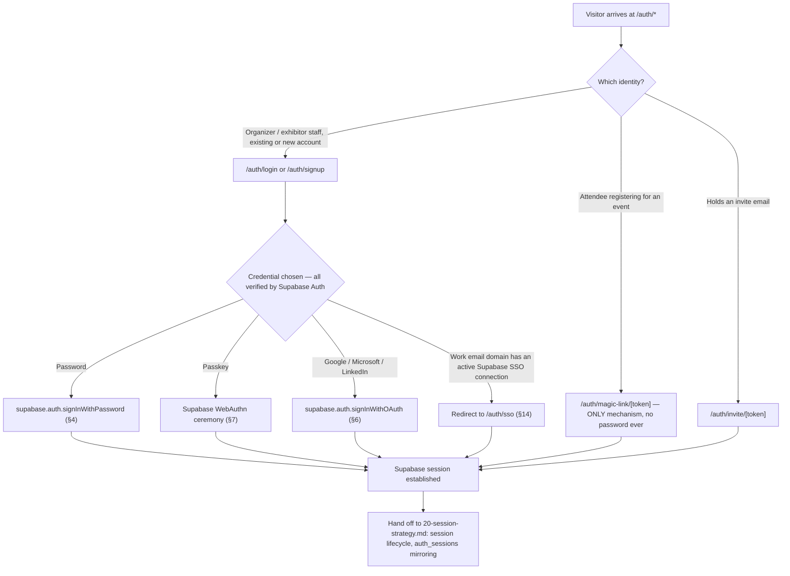
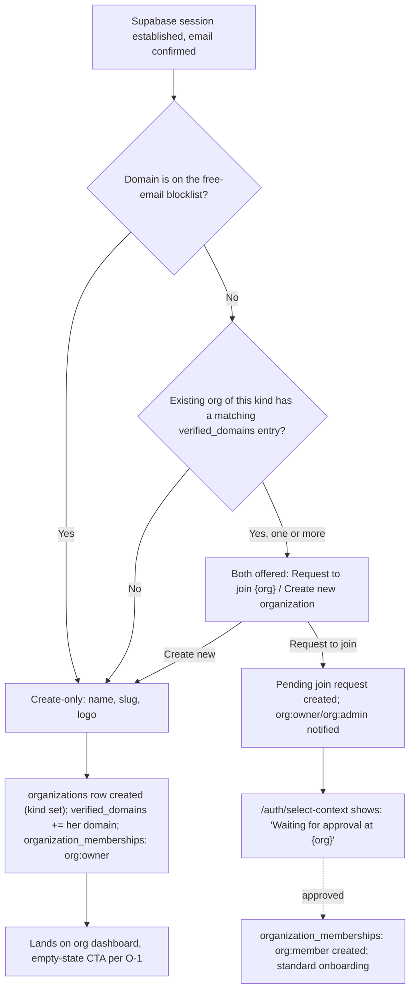
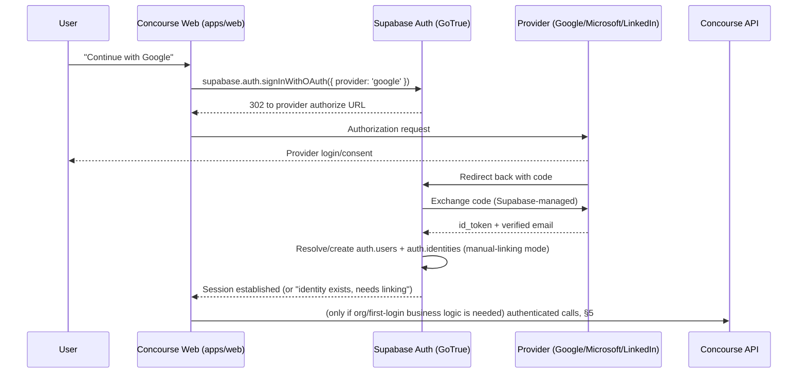
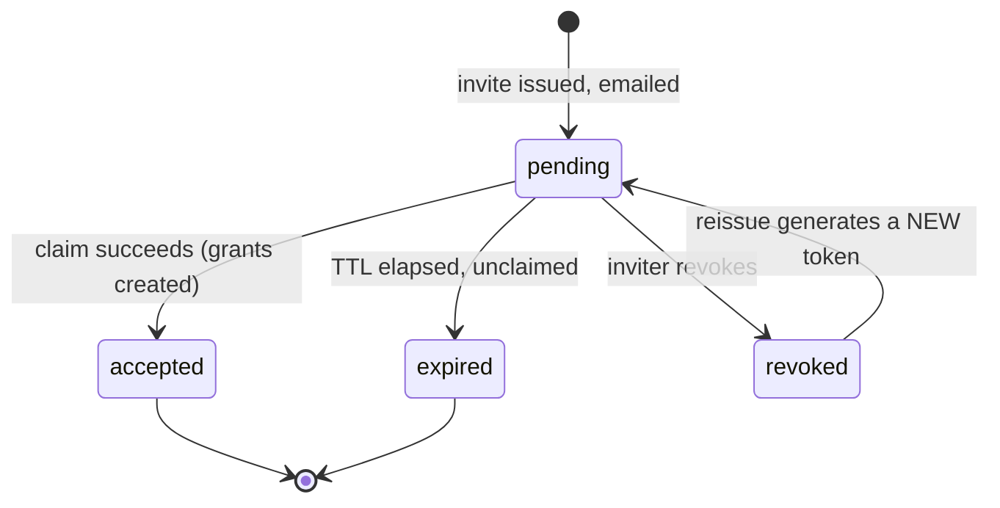

# Authentication Strategy

This document specifies every flow behind the `/auth/…` surface in [11-information-architecture.md](11-information-architecture.md) §4.1 as implemented on **Supabase Auth**, per [00-foundation.md](00-foundation.md) §6 and §14 Amendment A5: email/password, OAuth sign-in (Google, Microsoft, LinkedIn), WebAuthn passkeys, magic-link sign-in (the sole credential mechanism for attendees), invite-token claims (organization, event-staff, and exhibitor-staff invites), email verification, password reset, and enterprise SSO via Supabase's native SAML 2.0 support (milestone M4). It also fixes the exact **format, expiry, entropy, and single-use semantics** of the token types this platform still issues itself, and states clearly which token types it no longer issues because Supabase now owns them.

Amendment A5 moved credential verification itself — password checking, OAuth token exchange, SSO assertion parsing, WebAuthn ceremonies, magic-link delivery — out of `apps/api` and into Supabase Auth (GoTrue), called directly from the client (`apps/web`) via `@supabase/supabase-js`/`@supabase/ssr`. **This is a genuine, technically-necessary API surface change, not a style preference: `apps/api` no longer implements password hashing, OAuth code exchange, or SAML assertion parsing at all, because Supabase now performs that work and our API would otherwise be duplicating a security-sensitive subsystem for no benefit.** Every route below that used to *verify a credential* is replaced by a client-side Supabase SDK call; every route below that survives is either (a) business logic that must run **after** Supabase confirms an identity — org creation/domain-match, invite claiming, legal acceptance recording, registration creation for attendees — or (b) an admin-mediated flow the client SDK cannot do alone (kiosk claim, invite-driven JIT). Every surviving `apps/api` endpoint in this document runs **authenticated against an already-established Supabase JWT**; none of them re-implements a credential check.

This document stops at the instant a Supabase session exists (or, for flows that involve no separate registration step, at the instant our own business-logic endpoint finishes). What happens to that session next — its lifecycle, mirroring into `auth_sessions`, device management, revocation, and the offline replay window — is owned entirely by [20-session-strategy.md](20-session-strategy.md); every flow below ends with an explicit hand-off to it. Role→permission enforcement is [28-permission-model.md](28-permission-model.md)'s; column-level schema is [16-database-schema.md](16-database-schema.md)'s (unchanged by this revision — every table this document touches, `users`, `organizations`, `organization_memberships`, `oauth_identities`, `webauthn_credentials`, `auth_tokens`, already exists exactly as that document defines it); the UX narration of the attendee-facing steps is [07-attendee-journey.md](07-attendee-journey.md)'s and the organizer-facing narration is [05-organizer-journey.md](05-organizer-journey.md)'s — this document is the mechanics underneath both.

All entity, role, and tier names are canonical per [00-foundation.md](00-foundation.md). One rule governs everything below, unchanged by the Supabase migration: **Sofia — and every `attendee` identity — never creates, enters, or resets a password, ever.** Magic-link sign-in is not a convenience option for attendees; it is the only credential mechanism that exists for that role, for the lifetime of the account.

## 1. Scope & Ownership

| In scope here | Out of scope (owner) |
|---|---|
| Every `/auth/*` route's step-by-step flow: which steps run client-side against Supabase directly, and which run against our own authenticated `apps/api` endpoints | Session token format, JWT/refresh mechanics, `auth_sessions` mirroring, device list, revocation, offline replay window ([20-session-strategy.md](20-session-strategy.md)) |
| Token formats, expiry, entropy, single-use/revocation semantics for **our own** invite tokens; target configuration values for Supabase's magic-link/verify-email/reset-password token TTLs | Column-level schema for `users`, `organizations`, `registrations`, etc. ([16-database-schema.md](16-database-schema.md)) |
| The business rules layered on top of Supabase's credential verification (password policy hook, manual OAuth-identity linking, never-zero-factors, domain-match, JIT provisioning, Require-SSO enforcement) | Credential verification itself — password hashing, OAuth code exchange, SAML assertion parsing (Supabase Auth / GoTrue, configured, not implemented, by us) |
| Invite-token claim logic, incl. join-vs-create-org domain match | Audit log schema and retention for auth events ([29-audit-logging-architecture.md](29-audit-logging-architecture.md)) |
| Supabase SSO connection registration *process* (which admin-side flow triggers it) | SSO connection *configuration* UI (`/org/[orgSlug]/settings/security`), owned by [14-page-inventory.md](14-page-inventory.md)/[28-permission-model.md](28-permission-model.md) |
| Auth-specific rate-limit buckets layered on top of Supabase's own built-in limits | General API rate limiting ([18-api-architecture.md](18-api-architecture.md) §3.8, which this document extends) |

## 2. Auth Surface Overview

The nine routes below are the **complete** `/auth/…` inventory (foundation §5; IA §4.1). Every one is owned by this document; the **Mechanism** column now distinguishes a client-side Supabase SDK call from an authenticated `apps/api` call.

| Route | Mechanism | Personas | Section |
|---|---|---|---|
| `/auth/login` | Supabase `signInWithPassword`/passkey/`signInWithOAuth` (client); SSO discovery by email domain via our own API before any credential field renders | Priya, Marcus, Elena, Jamal, Alex | §4, §6, §7, §14 |
| `/auth/signup` | Supabase `signUp`/`signInWithOAuth` (client) creates the identity; our own authenticated API runs org create-or-join after | Priya, Marcus, Elena, Jamal | §4, §5, §6 |
| `/auth/forgot-password` | Supabase `resetPasswordForEmail` (client) | Same as above | §12 |
| `/auth/reset-password/[token]` | Supabase native recovery flow (client) | Same as above | §12 |
| `/auth/magic-link/[token]` | Supabase `signInWithOtp` (client) establishes the session; our own authenticated API creates the registration | Sofia | §9 |
| `/auth/invite/[token]` | Our own `auth_tokens`-backed invite claim; mini-signup (if needed) runs via Supabase client SDK | All except Sofia, Alex | §10 |
| `/auth/verify-email/[token]` | Supabase native "Confirm signup" flow (client) | Priya, Marcus, Elena, Jamal | §11 |
| `/auth/sso` | Supabase native SAML SSO initiation (`signInWithSSO`) | Priya, Marcus (enterprise orgs) | §14 |
| `/auth/select-context` | Post-authentication destination chooser | All | §15 |



`/auth/select-context` is where a caller with more than one `organization_memberships`/`event_staff`/`exhibitor_staff`/`registrations` row lands after §K above resolves; it reads the caller's memberships (already establishable from the Supabase JWT plus a live membership lookup) and is otherwise stateless — no separate token, no credential check.

## 3. Identity & Credential Storage Boundary

`users` remains the single global identity row per human (foundation §7) — one person, one row, regardless of how many organizations, events, or registrations they touch. This is **unchanged** by Amendment A5. What changed is *who writes to it and how*: Supabase's own `auth.users` table (in the same Postgres database, `auth` schema) is now the actual credential store and the place `email_confirmed_at`, linked-identity state, and internal password material live. Our `public.users` row is provisioned and kept in sync via **Postgres triggers on Supabase's `auth` schema** — the same database, so this is direct, first-class trigger wiring, not a network integration:

| Trigger | Fires on | Effect |
|---|---|---|
| `handle_new_auth_user` | `AFTER INSERT` on `auth.users` | Creates the matching `public.users` row (`id` = `auth.users.id`, `email`, `full_name` from `raw_user_meta_data`, `email_verified_at` seeded from `email_confirmed_at` if already set — true for OAuth/SSO-originated identities) |
| `handle_auth_user_email_confirmed` | `AFTER UPDATE OF email_confirmed_at` on `auth.users` | Sets `public.users.email_verified_at` — the column [16-database-schema.md](16-database-schema.md) §3.2 already defines, now populated from Supabase's own confirmation state instead of our own verify-email token type (§11) |
| `handle_auth_identity_linked` | `AFTER INSERT` on `auth.identities` (Supabase's own OAuth identity table) | Writes the corresponding row into `public.oauth_identities` (`provider`, `provider_user_id`, `linked_at`) — this is a **mirror for our own account-security UI** (`/account/security`'s linked-providers list) and for the manual-linking business check in §6; Supabase's own `auth.identities` is the actual authority Supabase itself consults to resolve a sign-in |

This is the same "elegant, legitimate use of same-database triggers" pattern [20-session-strategy.md](20-session-strategy.md) §1 uses for `auth_sessions` — described once here since three tables in this document's boundary depend on it.

**Two columns on the existing schema are superseded by this migration and are flagged here as follow-up cleanup, not silently repurposed:**
- `users.password_hash` ([16-database-schema.md](16-database-schema.md) §3.2) is no longer written or read by any code path this document specifies — GoTrue hashes and stores password material internally in `auth.users`, and we do not touch it directly (§4.2). The column is inert.
- `webauthn_credentials` ([16-database-schema.md](16-database-schema.md) §3.7) is no longer written or read — Supabase Auth manages WebAuthn credentials in its own internal schema (§7). The table is inert.

Both are candidates for removal in a future [16-database-schema.md](16-database-schema.md) revision; this document does not perform that schema edit itself (out of mandate), it only records the fact so the inert columns/tables aren't mistaken for still-live.

`organization_memberships`, `event_staff`, `exhibitor_staff`, and `registrations` are **unaffected in shape** — Amendment A5 only changed how the underlying identity is verified, never how a relationship attaches to it.

| Mechanism | Where it lives now | Notes |
|---|---|---|
| Password | Supabase `auth.users` (GoTrue-internal; we never read or write it) | §4.2 |
| OAuth identity | Supabase `auth.identities` (authoritative); mirrored to `public.oauth_identities` (our own UI/audit copy) | §6 |
| WebAuthn credential | Supabase Auth's own internal WebAuthn schema (authoritative); `public.webauthn_credentials` is inert (see above) | §7 |
| Single-use tokens we still issue (invite) | `public.auth_tokens`, unchanged shape ([16-database-schema.md](16-database-schema.md) §3.8) | §10, §13 |
| Single-use tokens Supabase now issues (magic-link, verify-email, reset-password) | Supabase-internal; format/entropy not ours to specify | §13 |

## 4. Email/Password Authentication

Applies to Priya, Marcus, Elena, Jamal, and Alex. **Never** applies to the `attendee` role — Supabase Auth's password grant is simply never invoked for an identity whose only relationship to the platform is a `registrations` row created via magic-link (§9); nothing about Sofia's identity ever acquires a password.

### 4.1 Password policy — enforced via Supabase's Password Verification Hook

Per NIST 800-63B guidance, not arbitrary composition rules — this rule set is unchanged from before Amendment A5, only *where it runs* has changed. Supabase Auth supports a **Password Verification Hook**: a Postgres function (or Edge Function) GoTrue invokes with the plaintext password, for the duration of that hook call only, immediately before accepting a `signUp`/`updateUser` password change. Our policy is implemented entirely inside this hook, plus Supabase's own configurable minimum-length project setting:

| Rule | Value | Enforced by |
|---|---|---|
| Minimum length | 12 characters | Supabase project auth setting (`minimum_password_length` or equivalent — the closest matching Supabase configuration option) |
| Maximum length | 256 characters (bounds hashing cost; GoTrue's own internal hashing, not ours, per §4.2) | Password Verification Hook |
| Composition requirements | None (no forced mixed-case/digit/symbol — proven not to improve real-world strength) | N/A — deliberately not enforced |
| Breach-corpus check | Rejected if the password appears in a known-breach corpus, checked via k-anonymity range query (first 5 hash chars sent, full match compared server-side inside the hook, never the plaintext password persisted or logged) | Password Verification Hook |
| Common-password/context check | Rejected if it equals the account's email local-part, display name, or organization name (name/org known from the hook's request payload) | Password Verification Hook |

The hook returns a reject decision (with a user-facing reason) or an allow; GoTrue never proceeds to accept/hash a password the hook rejects. This preserves the *exact* business rule the pre-Supabase design enforced in application code — only the enforcement point moved into a hook Supabase calls, instead of a check our own `/v1/auth/signup` handler ran before calling argon2id itself.

### 4.2 Password storage — owned entirely by Supabase, not specified here

**We do not implement or store password hashes.** GoTrue hashes and stores password material internally, inside `auth.users`, using its own documented algorithm — an implementation detail of Supabase Auth this document does not need to specify, does not gate any business rule on, and never reads directly. This replaces the prior argon2id parameter table in full; there is no lazy-rehash migration to describe because there is no hash for us to migrate. `users.password_hash` is inert per §3.

### 4.3 Signup

Client-side, `apps/web` calls:

```ts
const { data, error } = await supabase.auth.signUp({
  email: "priya.sharma@acmeexpos.com",
  password: "correct horse battery staple 12+",
  options: { data: { full_name: "Priya Sharma" } },
});
```

- Supabase validates email format, runs the password through §4.1's hook, creates `auth.users`, and (per Supabase project config) sends its own "Confirm signup" email (§11) — unless the account originates from OAuth (§6), which arrives pre-verified.
- The `handle_new_auth_user` trigger (§3) creates the matching `public.users` row immediately, so our own API can resolve the caller on its very next authenticated call without waiting on any webhook round trip.
- A session is returned in the same client call (frictionless — she is productive immediately), but the **organization-creation step (§5) is gated behind `email_verified_at`**, matching [05-organizer-journey.md](05-organizer-journey.md) O-1's "immediately after verification she creates her organizer organization." Every other password-account action (browsing, viewing `/account`) is available pre-verification; a persistent banner nags until verified — unchanged business rule (§11).
- **Alex (platform admin) accounts are never created through `/auth/signup`.** This is unaffected by the credential-verification move: Supabase's `signUp` only ever creates a normal identity in `auth.users` — it has no concept of `platform:admin` at all, because that role lives entirely in our own `users.is_platform_admin` flag ([16-database-schema.md](16-database-schema.md) §3.2), set only via `/admin/users/[userId]` by an existing `platform:admin`, or the one-time deployment bootstrap script. There is no code path — Supabase's or ours — from a client-initiated signup to that flag.

### 4.4 Login

Client-side:

```ts
const { data, error } = await supabase.auth.signInWithPassword({
  email: "priya.sharma@acmeexpos.com",
  password: "correct horse battery staple 12+",
});
```

- Supabase returns the same generic error for "email doesn't exist" and "password is wrong" (constant-time verification is GoTrue's internal responsibility) — `apps/web` renders it as `invalid_credentials` per [41-error-code-registry.md](41-error-code-registry.md), preserving the enumeration-prevention posture unchanged.
- Rate-limited by Supabase's own built-in auth rate limits first, and by our own stricter layered buckets second (§8).
- **SSO discovery still runs before any credential field is shown**, and it is still our own API: `/auth/login` calls `POST /v1/auth/sso/discover { email }` (unchanged shape and purpose from before Amendment A5) before rendering a password field at all. If the domain has an active Supabase SSO connection and the owning org holds `entitlement:sso_saml` with "Require SSO" enabled, the response is `403 { code: "sso_required", ssoUrl: "/auth/sso?domain=acmeexpos.com" }` and `signInWithPassword` is never called (§14).
- Success hands off to doc 20 for session lifecycle; `?next=` (validated same-origin) is honored per IA §4.9/§4.10.

### 4.5 Password change (`/account/security`)

This is one of the flows most directly reshaped by credential verification moving client-side, so it is spelled out step by step:

1. Client re-verifies the current password with `supabase.auth.signInWithPassword` (or, where Supabase's reauthentication flow is preferred for an already-live session, its dedicated reauthentication API) — this satisfies the "requires re-authentication, not just an active session" rule unchanged from before.
2. Client calls `supabase.auth.updateUser({ password: newPassword })`; the new password passes through §4.1's hook exactly as at signup.
3. On success, the client calls our own authenticated endpoint, `POST /v1/auth/security-events/password-changed` — this endpoint exists *because* we no longer see the password change itself (Supabase does), but we still own the downstream business consequence: it triggers the same security posture the old design enforced — **full session revocation across every device except the one making the change** (mechanics owned by [20-session-strategy.md](20-session-strategy.md) §6) — plus a confirmation email. This is a deliberate, narrow, Supabase-adjacent endpoint: its entire job is "credential change happened, now run our side-effects," never a credential check itself.

## 5. Organization Creation & the Join-vs-Create Domain-Match Flow (O-1)

**Unchanged in business logic.** Immediately after email verification (or immediately after an OAuth/passkey signup, which needs no separate verification step — §6), the account holder reaches the organization step. This still renders inline as the second half of `/auth/signup`; the only difference is that by this point a Supabase session already exists (from §4.3/§6), and every call in this section is an ordinary authenticated `apps/api` call, not a credential-verification call.

### 5.1 Kind selection

Unchanged: arriving at `/auth/signup` with no invite context prompts an explicit choice: **"I'm running an event"** (creates `organizations.kind: organizer`) or **"I'm exhibiting at events"** (creates `organizations.kind: exhibitor`). Arriving via an invite token (§10) pre-determines `kind` from the invite and skips this choice entirely.

### 5.2 Domain match

Per [05-organizer-journey.md](05-organizer-journey.md) O-1's edge case ("Priya's company already has a Concourse org... signup with a matching verified email domain surfaces 'Request to join {org}'") — unchanged:

1. The system extracts the domain from the verified email (verification state read from `users.email_verified_at`, §3) and checks it against a **free-email-provider blocklist** (gmail.com, outlook.com, yahoo.com, and similar) — a matched free-email domain never triggers domain matching.
2. For a non-free domain, the system looks up existing `organizations.verified_domains` (unchanged column, [16-database-schema.md](16-database-schema.md) §3.1) of the **selected kind**.
3. **No match** → only "Create your organization" is offered (name, slug, logo). Creating the org appends her verified domain to `organizations.verified_domains`.
4. **One or more matches** → both options render: "Request to join {org name}" for each match, and "Create new organization" alongside.



5. **Join-request semantics**, unchanged: `POST /v1/organizations/{orgId}/join-requests` (or the equivalent create-path on `POST /v1/organizations`) writes an `organization_memberships` row with `status: pending` ([16-database-schema.md](16-database-schema.md) §3.3) rather than an active membership. An `org:owner`/`org:admin` approves from `/org/[orgSlug]/team`'s pending-requests list, flipping `status` to `active`.
6. Every account-creation path — password, OAuth, SSO JIT (§14), invite claim (§10) — still writes a `legal_acceptances` row for whichever `legal_documents` version was current and shown at that moment; this is the one consistent consent-capture mechanism across every entry path, unaffected by the auth-mechanism change.

## 6. OAuth Sign-In (Google, Microsoft, LinkedIn)

Supabase Auth natively supports Google, Azure (Microsoft), and LinkedIn (OIDC) as OAuth providers; these are the three we configure in the Supabase project, matching the prior provider set exactly. `apps/api` performs **no OAuth code exchange at all** — that is Supabase's job end to end.



- **Resolution rule, preserved via manual linking:** the Supabase project is configured for **manual** identity linking (Supabase supports both automatic and manual linking of identities sharing an email; we use manual). This means Supabase does **not** silently attach a Google identity to an existing password account sharing the same email. When `signInWithOAuth` resolves to an email that already has a password-based `auth.users` row without a linked Google identity, the client detects this (Supabase surfaces it as a sign-in that requires linking rather than a silent success) and shows the same business message the pre-Supabase design specified: **"An account already exists for this email. Sign in with your password to link Google."** Once she re-authenticates with `signInWithPassword`, the client calls `supabase.auth.linkIdentity({ provider: 'google' })` to complete the link. This preserves the exact prevention-of-silent-account-takeover posture the old design had, re-expressed against Supabase's own identity-linking primitive rather than our own resolution logic.
- If no account exists at all, Supabase creates a new `auth.users` row directly with `email_confirmed_at` set immediately (the provider's own verification is trusted — Supabase never issues a separate "Confirm signup" email for an OAuth-originated identity), and our triggers (§3) mirror it into `public.users` with `email_verified_at` already set, so the flow proceeds straight to §5 with no verification gate.
- **Linking:** once linked (or newly created), a returning login with the same provider identity resolves directly — no domain-match step is repeated.
- Microsoft uses the Microsoft identity platform v2.0 OIDC endpoint (work/school + personal accounts both accepted — a personal Microsoft account is treated as a free-email-equivalent domain for §5.2 purposes, a Supabase project-level provider setting, not app logic). LinkedIn uses OpenID Connect. Google uses standard OIDC discovery. These provider-level choices are unchanged from before Amendment A5 — only the party making the token exchange changed.

## 7. WebAuthn Passkeys

Registration and management live at `/account/security`; sign-in is offered from `/auth/login`. **Supabase Auth owns WebAuthn/passkey credential storage and ceremony verification internally** — `public.webauthn_credentials` ([16-database-schema.md](16-database-schema.md) §3.7) is inert (§3) and this document no longer specifies clone-detection signature-counter logic as something *we* implement, because it is now entirely Supabase's internal responsibility.

### 7.1 Registration ceremony

- Registration runs through Supabase's client-side passkey/WebAuthn enrollment APIs (the closest equivalent to Supabase Auth's documented MFA/WebAuthn factor-enrollment flow — exact method names are Supabase's SDK surface, not restated here as gospel since they evolve with the SDK).
- The business requirements this document still owns and must be preserved regardless of the underlying SDK call: a **resident/discoverable key** so it can act as a first-factor, username-less sign-in at `/auth/login` where the browser supports it; **multiple credentials per user**, each with a user-assigned label shown at `/account/security`; and the **never-zero-factors** rule (§7.2).
- Attestation posture: `none` — Concourse does not need device-model attestation, matching the pre-Supabase decision; this is a Supabase project/enrollment-call setting, not something our own code enforces.

### 7.2 Sign-in ceremony and never zero factors

- `/auth/login` offers "Sign in with a passkey," using conditional UI (autofill) where supported, or an explicit button otherwise, driving Supabase's client-side WebAuthn assertion flow directly — there is no `apps/api` challenge/verify round trip anymore (§3's old illustrative `POST /v1/auth/webauthn/challenge`/`verify` are removed; Supabase's own client SDK handles the full ceremony against its internal credential store).
- **Clone detection is now Supabase's internal responsibility, not ours** — the pre-Supabase design's own signature-counter check (`webauthn_credentials.sign_count`) is not something this document restates as a mechanism we run, because there is no code path where our own service ever sees a raw assertion to check a counter against. If Supabase's own clone-detection heuristics flag a credential, that surfaces through its own sign-in error, which the client renders using the existing `unsupported_authenticator`-family error handling.
- **Never zero factors**, preserved exactly: a user may remove their password entirely once at least one passkey exists, but the system enforces at least one usable primary factor at all times. This check is application-level, run by our own account-security UI logic against **Supabase's own factor-listing API** (enumerating linked OAuth identities, registered passkeys, and whether a password is set) before allowing a removal request to proceed — removing the last passkey is blocked unless a password or a linked OAuth identity remains; removing a password is blocked unless ≥1 passkey or an OAuth identity remains.

## 8. Rate Limiting & Abuse Prevention (Auth-Specific Buckets)

Supabase Auth has its own built-in rate limits on its own endpoints (signups, OTP sends, password recovery, and so on) — those apply first, underneath everything below. **Layered on top**, our own platform continues to run the identical rate-limit buckets the pre-Supabase design specified, now understood as *our* complementary policy rather than the platform's only line of defense:

| Bucket | Sustained | Burst | Behavior on exceeding |
|---|---|---|---|
| Login attempts, per `(email, IP)` pair | 5/min | 10 | `429 rate_limited` with `Retry-After`; 10 consecutive failures within 15 min triggers a 15-min cool-down plus a "new sign-in attempt" security email |
| Signup, per IP | 10/hour | 20 | `429 rate_limited` |
| Magic-link requests, per work email | 3/15 min | 5 | A newer request supersedes the prior outstanding one at the Supabase layer (Supabase's own OTP-invalidation behavior on repeat request) |
| Password reset requests, per email | 3/hour | 5 | Generic `202`-equivalent response regardless of whether the email exists (Supabase's `resetPasswordForEmail` itself does not reveal existence; our own layered bucket adds the platform-level throttle) |
| Email verification resend | 3/hour | 5 | |
| Invite claim attempts, per token | 5 total (not time-windowed) | — | Token permanently invalidated after the 5th failed attempt, even if not yet expired — unchanged, since invite tokens remain entirely our own (§10, §13) |
| WebAuthn assertion attempts, per credential | 10/min | 20 | Standard lockout; clone detection is Supabase's own (§7.2) |
| SSO discovery/initiation, per IP | 30/min | 60 | Layered on top of the unauthenticated-IP bucket in [18-api-architecture.md](18-api-architecture.md) §3.8 |

All buckets we own remain Redis token buckets, config-sourced (not hardcoded), consistent with the platform-wide rate-limiting approach — Redis's role here is unaffected by Amendment A5, since Redis was never the session store's *only* job (foundation §6 keeps Redis for cache/queues/rate limits regardless of session mechanism).

## 9. Magic-Link Sign-In — Attendee's Only Mechanism

**Sofia never has a password.** This is a permanent product decision (foundation §6 auth row), unaffected by Amendment A5; magic-link is now `supabase.auth.signInWithOtp`, which both sends the email **and** auto-creates the `auth.users` row the instant the link is clicked and exchanged — a genuine mechanism change from the old design's own token/claim table, spelled out below because the old "peek without consuming" step does not map onto Supabase's flow (visiting the callback link already establishes a session; there is no separate non-consuming peek anymore).

### 9.1 Step 1 — request the link

Client calls:

```ts
await supabase.auth.signInWithOtp({
  email: "sofia.lindqvist@example-industrial.eu",
  options: { emailRedirectTo: "https://concourse.app/auth/magic-link/callback?eventSlug=techexpo-2027" },
});
```

The request step is unchanged in spirit: it always returns success regardless of whether the email is new, already registered, or unknown — Supabase's own `signInWithOtp` is called unconditionally, so there is no enumeration signal (matching the old design's generic `202` posture, now achieved because the call itself never distinguishes new-vs-existing to the caller). `eventSlug` rides as a query param on `emailRedirectTo` rather than inside our own token payload, since Supabase — not us — mints and delivers this token now.

### 9.2 Step 2 — the callback establishes a real session (no peek)

When Sofia taps the emailed link, Supabase's client-side exchange completes at `/auth/magic-link/callback` and a **real Supabase session now exists** — there is no non-consuming "peek" step to render a form before that happens, unlike the old design. The client reads `eventSlug` off the redirect URL and immediately renders the registration form (Step 1 identity is already resolved; nothing here is a token status check).

An expired, already-consumed, or otherwise invalid magic link fails at Supabase's own exchange step and the client renders the same "Resend" / "Edit email" screen [07-attendee-journey.md](07-attendee-journey.md) §2 specifies — mapped to `magic_link_invalid` ([41-error-code-registry.md](41-error-code-registry.md)) for UI consistency — never a lockout, never a support ticket.

### 9.3 Step 3 — our own endpoint: create the registration

This is the exact point the task requires spelling out: with a real Supabase session now established, the client calls **our own authenticated endpoint**, replacing the old combined claim call:

`POST /v1/registrations`

```json
{
  "eventSlug": "techexpo-2027",
  "displayName": "Sofia Lindqvist",
  "jobTitle": "Procurement Lead",
  "goal": "Shortlist condition-monitoring sensors compatible with our PLC stack",
  "consent": {
    "aiPersonalization": true,
    "discoverable": true,
    "contactSharingDefault": true
  }
}
```

- Authenticated by the Supabase JWT from §9.2 — no token in the path, no separate credential check; this endpoint's entire job starts from "identity already proven."
- `displayName` is required only if this is the caller's first-ever registration on the platform (our own check: does `public.users.full_name` already exist meaningfully, or is this the same-request completion of a `handle_new_auth_user`-provisioned row with no name yet) — this replaces the old peek response's `isNewIdentity` field with a **post-auth check our own endpoint performs**, exactly as the resolved design requires. Returning users omit it and it is ignored if sent.
- `jobTitle` is required; `goal` is optional free text; `consent` carries the three registration-time toggles owned in full by [07-attendee-journey.md](07-attendee-journey.md) §11.
- Server-side, in a single database transaction: (1) the endpoint checks whether this identity already has a `registrations` row for this event — if so, this is edge case §9.4, not a fresh registration; (2) a `registrations` row is created with a generated `badge_code` and the consent snapshot; (3) a `legal_acceptances` row is written; (4) `domain_events` outbox entries fire (`registration.created`).
- Response:

```json
{ "registrationId": "01J9U4...", "badgeCode": "01J9U5..." }
```

The response no longer carries `"authenticated": true` as a hand-off signal, because authentication already happened at §9.2, before this endpoint was ever called — the hand-off to [20-session-strategy.md](20-session-strategy.md) (mirroring this session into `auth_sessions`, minting the Attendee Continuity Token) happens as a side effect of the Supabase session's own creation, not as a side effect of this registration call.

```mermaid
sequenceDiagram
    participant S as Sofia
    participant AA as Attendee App
    participant SB as Supabase Auth
    participant API as Concourse API (this document, §9.3)
    participant Sess as Session lifecycle (doc 20)

    S->>AA: Enter work email
    AA->>SB: signInWithOtp({ email, emailRedirectTo })
    SB-->>S: Email with magic link
    S->>AA: Tap link
    AA->>SB: Exchange completes (client-side)
    SB-->>Sess: Session established → auth_sessions mirrored (doc 20 §3)
    S->>AA: Job Title + optional Goal + consent
    AA->>API: POST /v1/registrations (authenticated by Supabase JWT)
    API->>API: Check existing registration for this event; create registrations + badge_code + consent + legal_acceptances (one transaction)
    API-->>AA: registrationId, badgeCode
    AA-->>S: /badge (QR live)
```

### 9.4 Edge case — already-authenticated caller

Unchanged in outcome: if the caller already holds a valid Supabase session (e.g., Priya is also registering as an attendee for a different event) and the email she'd otherwise enter matches her session's identity, the flow skips the magic-link round-trip entirely — `POST /v1/registrations` runs directly against her existing session and `eventSlug`, since a fresh OTP would only re-prove something already proven. Entering a **different** email than her session's identity still requires the full `signInWithOtp` round-trip for that email — a session never lets you claim someone else's inbox.

### 9.5 Walk-up / kiosk variant

Per [05-organizer-journey.md](05-organizer-journey.md) O-8 and [07-attendee-journey.md](07-attendee-journey.md) §13.1, a kiosk-mode device cannot practically round-trip a personal email. The kiosk device authenticates to **our own API** with its own short-lived, station-scoped credential (unchanged from before — scoped to registration-creation only, rotated daily). Because there is no personal inbox to drive Supabase's client-side OTP flow, our API — using the **Supabase service-role key, server-side only** — calls Supabase Admin's user-creation/`generateLink` capability to establish the `auth.users` identity directly (equivalent to what a client-side `signInWithOtp` exchange would have produced, just triggered from our own trusted server context instead of Sofia's own device), then in the same transaction creates the `registrations` row exactly as §9.3 does. Immediately afterward, our API also triggers a real `signInWithOtp` email to the entered address — exactly as before — so Sofia can later claim the same identity on her own phone. The kiosk grant is a one-time convenience, not a standing credential for that inbox; this preserves the exact business rule from the pre-Supabase design.

## 10. Invite-Token Claim Flow

**Largely unchanged from the pre-Supabase design.** Invites (org, event-staff, exhibitor, exhibitor-staff) carry rich business payload — invite type, target org, target role — that Supabase's own generic invite primitive does not model. Our own custom invite-token mechanism, backed by the existing `auth_tokens` table ([16-database-schema.md](16-database-schema.md) §3.8), the conditional-consuming-`UPDATE` pattern, the 14-day TTL, and revocation/reissue semantics, is **not superseded by Amendment A5** and is preserved almost verbatim.

`/auth/invite/[token]` is the single claim route for four invite categories, distinguished by an `inviteType` on the token payload (§3):

| Invite type | Grants on accept | Issued from | Domain-match applies? |
|---|---|---|---|
| **Organization invite** | `organization_memberships` (role `org:owner`\|`org:admin`\|`org:member`) | `/org/[orgSlug]/team` or `/exhibit/[orgSlug]/settings` | No — the target org is already fixed by the invite |
| **Event-staff invite** | `organization_memberships` (role `org:member`, only if the invitee isn't already an org member) **+** `event_staff` (role `event:admin`\|`event:staff`) in one compound grant | `/org/[orgSlug]/events/[eventSlug]/team` | No |
| **Exhibitor invitation** | `event_exhibitors` participation record moves `invited → accepted`, plus either a new `organizations` (`kind: exhibitor`) or a join onto an existing one, plus `exhibitor_staff` (role `exhibitor:admin`) for the accepting contact | `/org/[orgSlug]/events/[eventSlug]/exhibitors/invite` | **Yes** — §10.2 |
| **Exhibitor-staff invite** | `exhibitor_staff` (role `exhibitor:admin`\|`exhibitor:rep`) on an existing `event_exhibitors` | `/exhibit/[orgSlug]/events/[eventSlug]/team` | No — the exhibitor org is already fixed |

### 10.1 Claim sequence

1. **Peek:** `GET /v1/auth/invites/{token}` (non-consuming) returns `{ valid, inviteType, inviterOrgName, targetRole, prefill: { email }, invitedEmailHasAccount }` — unchanged shape, since this is entirely our own token.
2. **Branch:**
   - Already logged in (a Supabase session exists) as the invited email → single "Accept" button.
   - Has an account, not logged in → routed through `/auth/login?next=/auth/invite/{token}` first — a Supabase credential check per §4/§6/§7, not ours.
   - No account → an inline mini-signup that now runs entirely via the Supabase client SDK (`signUp` or `signInWithOAuth`, per §4/§6) instead of our own argon2id signup — once that Supabase identity exists, the invite-accept business logic below runs identically to before.
3. **Accept:** `POST /v1/auth/invites/{token}/accept`, authenticated by the now-established Supabase JWT, consumes the token via the same conditional-`UPDATE` pattern (§3), creates the grant(s) in the table above in one transaction, writes to `audit_logs` ([29-audit-logging-architecture.md](29-audit-logging-architecture.md)), and fires the matching domain event.

### 10.2 Exhibitor invitation — the join-vs-create-org sub-flow

Unchanged. Exhibitor organizations are global entities that participate in many events (foundation §7) — a company invited to a second event reuses its existing org and catalog. On accept:

1. A pre-bound invite (e.g., a rebooking invite per [05-organizer-journey.md](05-organizer-journey.md) O-10) skips matching entirely.
2. Otherwise, the same domain-match logic as §5.2 runs, scoped to `kind: exhibitor` organizations.
3. Joining an existing exhibitor org grants `exhibitor:admin` on the specific `event_exhibitors` row created by this invite only — not retroactively on other events.

### 10.3 Revocation and reissue

Unchanged. An organizer or exhibitor admin revokes a pending invite from its list view; revocation sets `revokedAt` on our own `auth_tokens` row (§3), never reused. The old link, if visited, returns the peek response `{ "valid": false, "code": "invitation_revoked" }`. Reissuing generates an entirely new token.



## 11. Email Verification

Confirms ownership of a work email for **password-based** signups only — OAuth identities (§6) and SSO JIT provisioning (§14) already carry a provider-asserted verified email; magic-link identities (§9) prove ownership by the act of exchanging the link, which *is* their verification. This entirely replaces the old custom verify-email token type with Supabase's native **"Confirm signup"** flow.

- Supabase sends its own confirmation email on `signUp` (its own configurable template/TTL, §13); `/auth/verify-email/[token]` is Supabase's own hosted or client-exchanged confirmation link, not our own token-consuming endpoint.
- On confirmation, Supabase sets `auth.users.email_confirmed_at`; the `handle_auth_user_email_confirmed` trigger (§3) mirrors this into `public.users.email_verified_at` — the same column [16-database-schema.md](16-database-schema.md) already defines, now driven by Supabase's state instead of our own token type.
- **What verification gates, unchanged:** organization creation/join (§5), sending organization or event-staff invites, and publishing an event (separately gated by billing entitlements per [05-organizer-journey.md](05-organizer-journey.md) O-1/O-6). **What it does not gate, unchanged:** logging in, browsing, editing `/account` — verification nags with a persistent banner rather than locking the account out, checked by our onboarding logic reading `public.users.email_verified_at`.
- Resend is Supabase's own resend-confirmation call, rate-limited by our layered bucket (§8) in addition to Supabase's own.
- **Email change** (feature A9): `PATCH /v1/users/me/email { newEmail }` still does not overwrite the login identity immediately — the flow now uses Supabase's own email-change confirmation (which similarly emails the new address for confirmation before the change takes effect), preserving the identical safety net: the old address remains the identity of record until the new one is confirmed.

## 12. Password Reset

Entirely replaced by Supabase's native recovery flow, preserving the exact security posture.

- `/auth/forgot-password` calls `supabase.auth.resetPasswordForEmail(email, { redirectTo })` — Supabase's own response gives no enumeration signal (matching the old design's generic `202` intent) and is rate-limited by our own layered bucket (§8) on top of Supabase's built-in one.
- `/auth/reset-password/[token]` is Supabase's own recovery link; the client exchanges it (Supabase's client SDK handles the recovery-session establishment) and then calls `supabase.auth.updateUser({ password: newPassword })`, which runs through §4.1's Password Verification Hook exactly as any other password set.
- **On success**, the client calls the same authenticated endpoint §4.5 defines, `POST /v1/auth/security-events/password-changed { reason: 'password_reset' }` — this is the hand-off point: this document's job ends here, and [20-session-strategy.md](20-session-strategy.md) §6 owns the resulting cascade (**every other session for that user is revoked except the one performing the reset**), matching the pre-Supabase security posture exactly. A "your password was changed" confirmation email follows, sent by our own notification pipeline, as an out-of-band takeover-detection signal.

## 13. Token Format, Expiry & Entropy Registry

Amendment A5 splits this registry cleanly into two halves, because credential-adjacent tokens are no longer uniformly ours.

### 13.1 Our own tokens — unchanged

Invite tokens (org/event-staff/exhibitor/exhibitor-staff) remain **entirely our own**, backed by `public.auth_tokens` ([16-database-schema.md](16-database-schema.md) §3.8), with identical format, entropy, TTL, and consumption semantics to the pre-Supabase design:

- **Generation:** 32 bytes (256 bits) from a CSPRNG, base64url-encoded without padding (43 characters), prefixed `inv_` for observability in logs/support tooling (the prefix carries no entropy and is never trusted for authorization).
- **Storage:** only the SHA-256 hash of the full token is persisted (`token_hash`) — identical discipline to `api_keys` in [18-api-architecture.md](18-api-architecture.md) §8.
- **Consumption:** single-use via the conditional `UPDATE … WHERE used_at IS NULL AND revoked_at IS NULL RETURNING id` pattern (§3, §10.1).

| Token type | Prefix | Entropy | TTL | Single-use | Revocable | Delivery |
|---|---|---|---|---|---|---|
| Invite (org / event-staff / exhibitor / exhibitor-staff) | `inv_` | 256 bits | 14 days | Yes | Yes — explicit revoke action (§10.3); reissue always mints a new value | Email (SES) |

### 13.2 Supabase's own tokens — format not ours to specify, TTL is ours to configure

Magic-link, email-confirmation, and password-recovery tokens are now **Supabase's own** (GoTrue-internal). Their raw format and entropy are Supabase's implementation detail — not something this document specifies or needs to, since we never generate, store, or parse them ourselves. Their **TTL, however, we do configure**, targeting the same business requirements the pre-Supabase design fixed, as closely as Supabase's own settings allow:

| Flow | Target TTL (business requirement, unchanged) | Closest equivalent Supabase setting |
|---|---|---|
| Magic link (`signInWithOtp`) | ~15 minutes | The Supabase project's OTP/magic-link expiry setting, under `[auth]`/`[auth.email]` in `supabase/config.toml` (per [37-monorepo-and-folder-structure.md](37-monorepo-and-folder-structure.md)'s "where config lives" convention) — the exact key name is Supabase's own and not restated here as gospel |
| Email confirmation ("Confirm signup") | ~24 hours | The equivalent confirmation-token-expiry setting in the same `[auth]` configuration block |
| Password recovery | ~1 hour | The equivalent recovery-token-expiry setting in the same block |

These are stated as target configuration values, not literal config keys we're certain of by name — the intent (short-lived, actively-awaited tokens get short TTLs; the invite TTL, being ours, stays long at 14 days for the multi-week exhibitor onboarding cycle it serves) is unchanged from the pre-Supabase rationale: TTL matches the real-world latency of the surrounding workflow, not one security constant applied everywhere.

## 14. Enterprise SSO — SAML 2.0 via Supabase Auth (Milestone M4)

Gated by `entitlement:sso_saml` (`enterprise` organizer plan only, per [08-feature-matrix.md](08-feature-matrix.md) A8) and delivered at milestone M4, unchanged. **This replaces WorkOS entirely** with Supabase Auth's own native SAML 2.0 SSO support — a genuine simplification worth stating plainly: no third-party WorkOS dependency, no separate callback-URL vendor integration, one fewer system in the credential-verification path. **Connection configuration** (uploading IdP metadata, mapping the organization's email domain to a Supabase SSO provider registration via Supabase's Admin API/dashboard) happens at `/org/[orgSlug]/settings/security`, owned elsewhere ([14-page-inventory.md](14-page-inventory.md)); this document owns only how a user actually signs in once that connection exists.

### 14.1 Two initiation paths

**SP-initiated (the common case, discovered from `/auth/login`):**

1. User types their work email at `/auth/login`. Before any password field is even shown, the client calls `POST /v1/auth/sso/discover { "email": "priya.sharma@bigcorp-enterprise.com" }` — this remains our own endpoint, since domain→connection mapping is our own business data, not something Supabase's client SDK resolves unprompted.
2. If the domain has an active Supabase SSO connection **and** the owning org holds `entitlement:sso_saml`, the response is `{ "ssoRequired": true, "redirectUrl": "/auth/sso?domain=bigcorp-enterprise.com" }`.
3. `/auth/sso?domain=…` calls `supabase.auth.signInWithSSO({ domain: "bigcorp-enterprise.com" })` client-side, which redirects to the enrolled IdP directly — no WorkOS intermediary.
4. The IdP authenticates the user and posts the SAML assertion back to Supabase's own SSO callback endpoint (Supabase-hosted, not an `apps/api` route — it never needs an entry in the IA §4.1 page table, same reasoning the pre-Supabase design applied to the WorkOS callback).
5. Supabase validates the assertion, resolves the asserted profile, and proceeds to §14.2.

**IdP-initiated:** the user starts from their own IdP's app dashboard; the IdP posts straight to Supabase's SSO callback, skipping steps 1–3.

```mermaid
sequenceDiagram
    participant U as Priya
    participant L as /auth/login
    participant API as Concourse API
    participant SB as Supabase Auth
    participant IdP as Enterprise IdP

    U->>L: Enter work email
    L->>API: POST /v1/auth/sso/discover
    API-->>L: ssoRequired: true, redirectUrl
    L->>SB: supabase.auth.signInWithSSO({ domain })
    SB-->>IdP: SAML AuthnRequest
    IdP-->>U: IdP login screen
    U->>IdP: Authenticate
    IdP-->>SB: SAML assertion (Supabase's own callback)
    SB->>SB: Validate assertion; resolve/create auth.users (JIT, §14.2)
    SB-->>U: Session established → hand off to doc 20
```

### 14.2 Just-in-time (JIT) provisioning

Unchanged business rule: a first-time SSO login for an email never seen before auto-creates the identity (now via Supabase directly, mirrored to `public.users` by our trigger, §3) and an `organization_memberships` row (`role: org:member`) scoped to the organization that owns the matched SSO connection — no separate invite token is required, because an active enterprise SSO connection *is* the pre-vetting. This is a deliberate, justified departure from the invite-token requirement elsewhere in this document, unaffected by the WorkOS→Supabase migration. A `legal_acceptances` row is still written at JIT-creation time (§5.2's rule 6 applies uniformly).

### 14.3 Enforcement — "Require SSO"

Unchanged. Once an org enables "Require SSO," password, OAuth, and passkey login attempts for any email on that org's enrolled domain(s) are rejected with `403 { "code": "sso_required", "ssoUrl": "…" }` (§4.4) rather than proceeding to a credential check at all — this closes the gap where a user could bypass centralized IdP control via a leftover password credential. Our own `/v1/auth/sso/discover` endpoint is still the enforcement point, since it runs before any Supabase credential call.

### 14.4 Session hand-off

Unchanged in principle: a successful SSO sign-in ends at "Supabase session established" and hands off to [20-session-strategy.md](20-session-strategy.md) — there is no SSO-specific session type; the resulting session is indistinguishable in shape from a password or OAuth one.

## 15. Ownership & Related Documents

| Concern | Owner |
|---|---|
| Every `/auth/*` route's flow: which steps run client-side against Supabase and which run against our own authenticated endpoints; invite/token semantics | **This document** |
| Session lifecycle, JWT/refresh mechanics, `auth_sessions` mirroring, device list, revocation, offline replay window | [20-session-strategy.md](20-session-strategy.md) |
| `/auth/select-context` destination logic once memberships/registrations are known | [12-navigation-structure.md](12-navigation-structure.md) |
| Role→permission matrix, entitlement check semantics (`entitlement:sso_saml`, etc.) | [28-permission-model.md](28-permission-model.md) |
| Column-level schema for `users`, `organizations`, `organization_memberships`, `registrations`, `oauth_identities`, `webauthn_credentials` (now inert, §3), `auth_tokens` (unchanged) | [16-database-schema.md](16-database-schema.md) |
| Attendee-facing UX narration of registration/consent (S-1, S-2) | [07-attendee-journey.md](07-attendee-journey.md) |
| Organizer-facing UX narration of signup and exhibitor invitation (O-1, O-4, O-10) | [05-organizer-journey.md](05-organizer-journey.md) |
| Exhibitor-side acceptance mechanics beyond auth (profile setup, catalog reuse) | [06-exhibitor-journey.md](06-exhibitor-journey.md) |
| Machine-readable error codes (`invalid_credentials`, `magic_link_invalid`, `invitation_revoked`, `sso_required`, etc.) | [41-error-code-registry.md](41-error-code-registry.md) |
| Auth-event audit trail format and retention | [29-audit-logging-architecture.md](29-audit-logging-architecture.md) |
| DSAR/erasure interaction with `users`/credential records | [38-data-retention-privacy-compliance.md](38-data-retention-privacy-compliance.md) |
| General API conventions this surface inherits (pagination, errors, idempotency, base rate-limit buckets) | [18-api-architecture.md](18-api-architecture.md) |
| Threat model, secrets management (incl. the Supabase service-role key), and encryption posture behind these credential stores | [43-security-architecture.md](43-security-architecture.md) |
| `webauthn_credentials`/`users.password_hash` schema-cleanup follow-up (§3) | Future [16-database-schema.md](16-database-schema.md) revision, tracked per [44-future-expansion-plan.md](44-future-expansion-plan.md) discipline |
