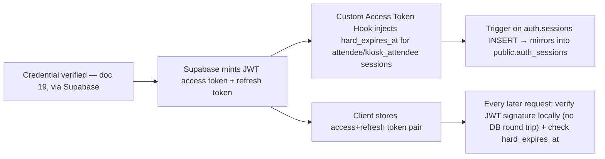
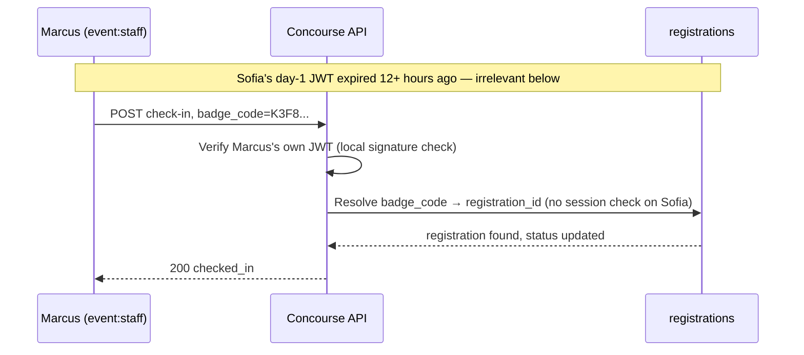
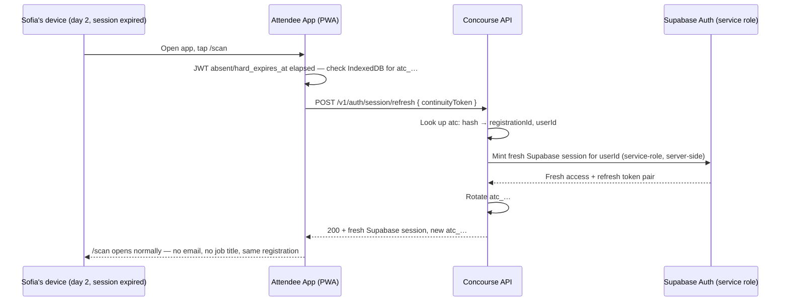
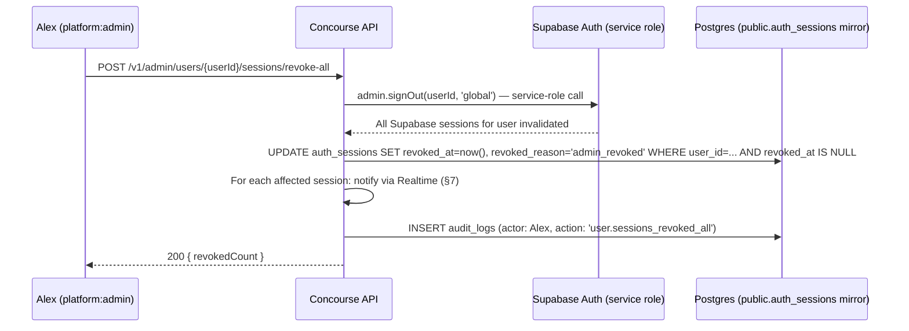
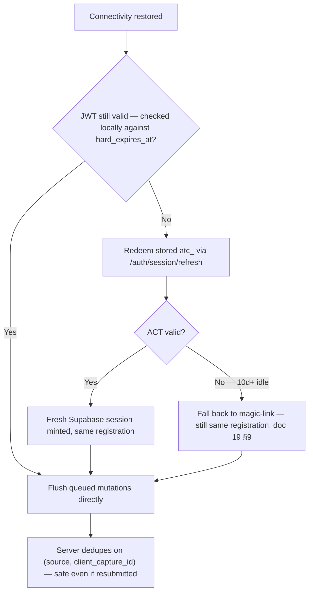

# Session Strategy

This document owns everything that happens **after** [19-authentication-strategy.md](19-authentication-strategy.md)'s
contract ends: the Supabase Auth JWT access/refresh session model, how our own `auth_sessions` table
(unchanged schema — [16-database-schema.md](16-database-schema.md) §3.4) is kept as a mirrored device-list/audit
record of Supabase's own session lifecycle, device/session listing and self-service revocation at
`/account/sessions`, revocation cascades (including the immediate access-loss
[18-api-architecture.md](18-api-architecture.md) §5.2 triggers), Supabase Realtime authorization and
forced-disconnect on revocation (handing off transport mechanics to
[18-api-architecture.md](18-api-architecture.md) §7), the 72-hour offline PWA replay window, internal
service-to-service Ed25519 JWTs, and the request-scoped trust boundary that keeps org/event authorization
from ever being cached in a token. It gives special, precise treatment to the attendee **8-hour session
rule**: Sofia Lindqvist's session is short-lived by design, and this document is the single place that
reconciles that short lifetime — now enforced via a **Custom Access Token Auth Hook**, not a Redis TTL —
with the product requirement that she is never asked to re-enter her Work Email or Job Title just because
a QR badge scan happened after her session expired. What this document does **not** own: credential
verification itself (password, OAuth, passkey, magic-link, SSO —
[19-authentication-strategy.md](19-authentication-strategy.md)), column-level schema
([16-database-schema.md](16-database-schema.md)), the role→permission matrix and entitlement semantics
([28-permission-model.md](28-permission-model.md)), general API request conventions and rate limiting
([18-api-architecture.md](18-api-architecture.md)), the offline sync engine's IndexedDB schema and
background-sync implementation ([17-offline-sync-architecture.md](17-offline-sync-architecture.md)),
consent scopes ([07-attendee-journey.md](07-attendee-journey.md) §11), or audit-log mechanics
([29-audit-logging-architecture.md](29-audit-logging-architecture.md)).

## 1. Session Model Overview & Design Rationale

Per [00-foundation.md](00-foundation.md) §6 and §14 Amendment A5, sessions are now **Supabase Auth's JWT
access token (short-lived, ~1 hour) plus a rotatable refresh token**, not the opaque Redis-backed token
this document previously specified. This is a real architecture change, and this section states the new
reasoning honestly rather than patching the old rationale in place:

- **Supabase owns the credential-to-session boundary now.** [19-authentication-strategy.md](19-authentication-strategy.md)
  hands off to Supabase's own session issuance the instant a credential (password, OAuth, passkey,
  magic-link, SSO) verifies. We build on that model rather than re-deriving our own.
- **Our own `auth_sessions` table is repurposed, not removed.** It is no longer the source of truth for
  "is this session currently valid" (Supabase's own `auth.sessions`/JWT verification is). It is now a
  **mirrored device-list/audit table** — still exactly the schema
  [16-database-schema.md](16-database-schema.md) §3.4 already defines (`session_kind`, `device_label`,
  `ip_address`, `revoked_at`, `revoked_reason`, unchanged) — kept in sync via a **Postgres trigger on
  `auth.sessions`**. Supabase's own internal session table lives in the `auth` schema of the same Postgres
  database we already have direct access to; a trigger firing `AFTER INSERT` on `auth.sessions` writes the
  corresponding row into `public.auth_sessions`, capturing `user_id`, `session_kind` (derived at write
  time, §4), `device_label`/`user_agent`/`ip_address` (parsed from the session's associated request
  metadata), and `created_at`. **This is a legitimate, elegant use of same-database triggers — not a
  workaround** — the same pattern [19-authentication-strategy.md](19-authentication-strategy.md) §3 uses
  for `oauth_identities` and `users.email_verified_at`.
- **Revocation is still the killer requirement**, and Supabase gives us real primitives for it:
  `admin.signOut(jwt, scope)` with scopes `global`/`local`/`others` (§6) covers the common cases cleanly;
  for one specific *other* device by id, we fall back to a direct, service-role-only write against
  Supabase's own `auth` schema (§6) — a supported pattern given we already have direct database access to
  the same Postgres instance, not a workaround around Supabase's API surface.
- JWTs were always the right tool exactly once in this document even before Amendment A5 — internal
  service-to-service calls (§11) — and remain so, unaffected by everything else in this rewrite.



## 2. Token Format & Issuance

Every session is a **Supabase-issued JWT access token** (short-lived, ~1 hour, signed with the project's
JWT secret) plus a **refresh token** (longer-lived, rotated on use, Supabase-managed). We do not generate,
encode, or hash these ourselves — this is the one deliberate exception to the CSPRNG/SHA-256 convention
[19-authentication-strategy.md](19-authentication-strategy.md) §13 still uses for our own invite tokens,
because this token type is no longer ours to format.

- **Web (PWA):** `@supabase/ssr` manages the access+refresh token pair via secure, `HttpOnly` cookies
  (its own documented cookie-splitting scheme for JWT size), replacing the old
  `__Host-concourse_session=sess_…` cookie. `apps/api`'s Fastify middleware verifies the incoming JWT's
  signature against the Supabase JWT secret on every request — a local cryptographic check, **no database
  round trip**, and materially cheaper than the old Redis-lookup-per-request design (§4 expands on why
  this is a genuine efficiency improvement, not just a like-for-like swap).
- **Native apps (future, the D3 seam — [00-foundation.md](00-foundation.md) D3):** the identical
  Supabase JWT/refresh pair, transported as `Authorization: Bearer <access_token>` instead of a cookie —
  Supabase's client SDKs already support this transport, so `packages/api-client` needs no format
  branching, matching the D3 readiness goal the old design already committed to.
- The access token's own `exp` claim is the fast-path expiry the browser and our middleware both respect;
  refresh happens transparently via the Supabase client SDK using the refresh token, subject to the
  `hard_expires_at` ceiling §4 describes for attendee-kind sessions.

## 3. `auth_sessions` as a Mirrored Device-List & Audit Table

`public.auth_sessions` ([16-database-schema.md](16-database-schema.md) §3.4) is **unchanged in schema**
and is now populated by a database trigger rather than our own application code writing it directly at
issuance time:

```sql
-- Illustrative: fires after Supabase's own GoTrue inserts a row into auth.sessions
CREATE TRIGGER mirror_new_auth_session
AFTER INSERT ON auth.sessions
FOR EACH ROW EXECUTE FUNCTION public.handle_new_auth_session();
```

`handle_new_auth_session()` writes into `public.auth_sessions`:

| Column | Populated from |
|---|---|
| `id` | Generated to match this mirror row (join key back to `auth.sessions.id` kept in an application-level lookup, since `auth_sessions.id` itself is our own `uuid` per its existing schema) |
| `user_id` | `auth.sessions.user_id` |
| `session_kind` | Looked up from the most recent registration/claim context for this user (`standard` by default; `attendee`/`kiosk_attendee` when the session originates from a magic-link or kiosk claim, per [19-authentication-strategy.md](19-authentication-strategy.md) §9) — this is the same `session_kind` column [16-database-schema.md](16-database-schema.md) §3.4 already defines per Amendment A3 |
| `device_label`, `user_agent`, `ip_address` | Parsed from the session's associated request metadata at creation time |
| `created_at` | `auth.sessions.created_at` |
| `revoked_at`, `revoked_reason` | `NULL` at insert; set later by our own application-level revocation calls (§6) — the trigger only ever mirrors *creation*, never revocation, since "why" a session ended is business intent a generic trigger cannot infer |

**Why a trigger, and why this is legitimate, not a hack:** Supabase's own `auth` schema lives in the exact
same Postgres instance and connection string our `packages/database`/Drizzle setup already targets
(foundation §6's "runs against the Supabase Postgres connection string unchanged"). A same-database
trigger is a first-class, supported way to react to another schema's writes — no polling, no webhook
latency, no eventual consistency window between "Supabase thinks a session exists" and "our own device
list knows about it."

`public.auth_sessions` remains the table `/account/sessions` (§8) reads, the table
[20-session-strategy.md](20-session-strategy.md)'s own revocation-cascade bookkeeping writes to, and the
audit trail [29-audit-logging-architecture.md](29-audit-logging-architecture.md) references — its role as
a **mirror of record for humans and audits**, not as the thing `apps/api` middleware consults per request
(that's the JWT itself, §2), is the one substantive change from before.

## 4. Session Lifecycle by Persona

| Session kind | Personas | Access token lifetime | Refresh/absolute behavior | Enforcement mechanism | Rationale |
|---|---|---|---|---|---|
| `standard` | Priya, Marcus, Elena, Jamal, Alex — every password/OAuth/passkey/SSO-verified principal | ~1 hour (Supabase project default) | Refreshed transparently via the refresh token; **closest achievable mapping** to the old 30-day-absolute/14-day-idle rule is Supabase's own project-level refresh-token lifetime and reuse-detection settings — Supabase does not natively expose a distinct idle-vs-absolute pair the way the pre-Supabase design specified, so this is described honestly as the closest available approximation, configured as close to "30 days absolute, 14 days idle" as the project's refresh-token settings allow | Supabase's own refresh-token expiry/rotation | Enterprise users should not re-authenticate daily; bounding worst-case exposure for a continuously-active stolen refresh token remains the goal, now via Supabase's own settings rather than our own Redis TTL bookkeeping |
| `attendee` | Sofia Lindqvist — magic-link claim (both first-time and returning) | ~1 hour, **but gated by a hard 8-hour ceiling from session creation regardless of refresh** | **No sliding.** Fixed, absolute — activity does not extend the 8-hour ceiling | **Custom Access Token Auth Hook** injects `hard_expires_at` (§5); our own middleware checks it locally, in addition to normal JWT signature verification | The original product requirement, unchanged: a "temporary secure session," deliberately short because attendee devices at a trade show are more likely to be shared, borrowed, or left unattended than a staff laptop; continuity is restored transparently via the ACT (§5.3), not by loosening the window |
| `kiosk_attendee` | Sofia, via the walk-up kiosk-claim path ([19-authentication-strategy.md](19-authentication-strategy.md) §9.5) | Identical 8-hour fixed rule | No | Identical mechanism to `attendee` | Kiosk-originated identity is no less "Sofia" than magic-link-originated identity; there is no reason for its session physics to differ |
| Internal service (Ed25519 JWT) | Worker → API, `/v1/internal/*` only | 5 minutes | N/A — reissued (locally signed), never refreshed | Local Ed25519 signature verification, unaffected by Amendment A5 | See §11 — not a Supabase session or an `auth_sessions` row at all |

Public API key (`api_keys`) principals are a distinct concept — not a session — and remain
[18-api-architecture.md](18-api-architecture.md) §8's to own, unaffected by this revision.

## 5. The Attendee 8-Hour Session Rule & Badge-Scan Reconciliation

This is the section the rest of this document exists to get exactly right, and the one place Amendment
A5 required genuine re-derivation rather than a mechanical terminology swap.

### 5.1 Two independent identifiers

| | Session (Supabase JWT) | `badge_code` |
|---|---|---|
| **What it proves** | "This browser/device is currently authenticated as Sofia, right now" | "This registration belongs to Sofia" |
| **Lifetime** | At most 8 hours, fixed, from creation (`attendee`/`kiosk_attendee`) | Persistent for the life of the registration; explicitly rotatable, never auto-expires ([00-foundation.md](00-foundation.md) §12, [07-attendee-journey.md](07-attendee-journey.md) §13.2) |
| **Where it lives** | Supabase's own `auth.sessions`/JWT, mirrored into `public.auth_sessions` (§3) | The `registrations` row itself ([00-foundation.md](00-foundation.md) §7) |
| **Who presents it** | Sofia's own device, on every API call she personally makes | Anyone with a camera pointed at her badge/QR — staff at the door, an exhibitor rep at a booth, or Sofia herself via self-scan |
| **What invalidates it** | The 8-hour `hard_expires_at` ceiling, logout, revocation (§6) | Only an explicit rotation ([07-attendee-journey.md](07-attendee-journey.md) §13.2) |
| **Contains PII?** | No — the JWT carries only `sub`/`session_kind`/`hard_expires_at`-shaped claims, never PII (§12) | No — opaque, rotatable, never contains PII ([00-foundation.md](00-foundation.md) §12) |

**Decision SS-1 (locked, unchanged): badge_code lookups never depend on session validity, in either
direction.** Whether Sofia's own session is currently live, expired, or was never issued this session has
zero bearing on whether her `badge_code` resolves correctly to her `registrations` row. The two lifecycles
remain orthogonal by design — this decision does not depend on the session token's underlying mechanics,
which is exactly why it survives the Supabase migration untouched.

### 5.2 Why scans by others already satisfy the rule — unchanged

`POST /v1/events/{eventId}/booth-visits` and `POST /v1/agenda-sessions/{id}/session-checkins`
([18-api-architecture.md](18-api-architecture.md) §5.8, §5.9) accept `badge_code` in the request body and
are authenticated by the **scanning principal's own session** — `exhibitor:rep` for a booth scan,
`event:staff` for a door check-in. The write resolves `badge_code → registration_id` server-side and
never touches, checks, or requires Sofia's own session state at all. Concretely: on day two of a
three-day event, Sofia's day-one session (issued 9am, dead by 5pm the same day under the 8-hour ceiling)
has been expired for over twelve hours by the time Marcus's team scans her badge at the door the next
morning — and it is completely irrelevant, because the check-in write is Marcus's authenticated action,
with `badge_code` serving purely as a lookup key into an always-valid, non-expiring identifier. This
reasoning never depended on the opaque-token mechanics of the pre-Supabase design in the first place, so
it carries over with only terminology updated (JWT instead of opaque `sess_` token) — logic and
mermaid narrative unchanged.



### 5.3 The remaining case: Sofia's own device, her own actions

Self-scan (`/scan`), browsing, bookmarking, and Expo Copilot are all actions **Sofia** takes, requiring
**her own** live session — the case §5.2's structural argument doesn't cover. The mechanism enforcing the
8-hour ceiling, and the mechanism restoring continuity past it, both changed with Amendment A5.

**Enforcing the 8-hour ceiling — the Custom Access Token Auth Hook:**

Supabase's own JWT/refresh lifetime is a project-wide setting and does not natively support "exactly 8
hours, no sliding, per attendee-kind session" out of the box — this is the one gap Amendment A5's adoption
does not close for free, and this is the resolution:

1. We register a **Custom Access Token Auth Hook** — a Postgres function Supabase invokes every time it
   mints or refreshes a JWT for a user, letting us inject custom claims into that JWT.
2. The hook looks up the user's current `session_kind` from the mirrored `public.auth_sessions` row (§3)
   and, for `attendee`/`kiosk_attendee` kinds, injects a `hard_expires_at` claim computed as
   `auth_sessions.created_at + 8 hours`.
3. Our own `apps/api` auth-verification middleware, **after** cryptographically verifying the JWT's
   signature (standard JWT verification against the Supabase JWT secret — no database round trip needed
   for this part), **also** checks `hard_expires_at` locally against the current time for attendee-kind
   sessions, and rejects with `401` if elapsed — **even if Supabase's own refresh token would otherwise
   still be willing to mint a fresh access token.**
4. This is a hard, deliberate, application-enforced ceiling layered on top of Supabase's own mechanism. It
   requires **zero extra database lookup on the fast path** — the claim travels inside the JWT itself —
   which is an efficiency **improvement** over the old design's per-request Redis lookup, not merely a
   like-for-like replacement.

`standard`-kind sessions simply don't get a `hard_expires_at` claim (or get one far in the future) and
rely on Supabase's own refresh-token lifetime plus whatever idle/absolute policy its project settings
provide (§4's "closest achievable mapping" note).

**Restoring continuity — the Attendee Continuity Token (ACT), redemption updated:**

The ACT concept is preserved almost entirely; only *redemption* changes. The ACT itself remains **our
own, independent, long-lived (10-day, sliding, rotate-on-use) credential**, with nothing to do with
Supabase's session format:

- Minted as an additional side effect of the same flow that issues her first session — the magic-link
  claim or kiosk claim ([19-authentication-strategy.md](19-authentication-strategy.md) §9) — with zero
  additional fields collected.
- Format: identical convention to every other token this platform still generates directly — 32-byte
  CSPRNG, base64url, prefix `atc_`.
- **Storage:** kept in **Redis** (`atc:{sha256(token)}` → `{ registrationId, userId, eventId }`, TTL 10
  days, sliding, rotate-on-use). This is a deliberate choice, stated explicitly: introducing a new
  dedicated Postgres table for the ACT would mean adding a table outside
  [16-database-schema.md](16-database-schema.md)'s existing, locked registry — out of this revision's
  mandate. Redis remains part of the stack regardless of the session-store migration (foundation §6 keeps
  Redis for cache/queues/rate limits), so keeping the ACT there costs nothing new and avoids a schema
  change this document is not chartered to make.
- Client-side persistence is IndexedDB, not a cookie, so it survives independently of the ~1-hour access
  token's own expiry; the concrete client-side schema is
  [17-offline-sync-architecture.md](17-offline-sync-architecture.md)'s to own.
- **Redemption, updated:**

```
POST /v1/auth/session/refresh
{ "continuityToken": "atc_9fQ2z..." }
```

  Upon validating the ACT, this endpoint uses the **Supabase service-role key, server-side only**, to
  mint a fresh Supabase session bound to the **same user id** — via Supabase Admin's session/magic-link
  generation capability, exchanged server-side — rather than minting our own opaque token. The client
  receives a fresh Supabase access+refresh token pair (a new 8-hour `hard_expires_at` clock, same
  `registration_id`), plus a rotated ACT, instead of a `Set-Cookie: sess_…`. The net behavior Sofia
  experiences is **unchanged**: opening the app on day two silently re-establishes a fresh 8-hour clock on
  the same registration, no email, no job title re-entry.
- `401 continuity_token_invalid` on a missing/expired/already-rotated-away token — the client falls back
  to an ordinary magic-link request ([19-authentication-strategy.md](19-authentication-strategy.md) §9),
  which **always** re-attaches to the same registration (the returning-user path resolves by existing
  `users`/`registrations` uniqueness) and never renders a new registration form — the worst case degrades
  to "check your email again," never to "start over."



### 5.4 What does *not* carry over — unchanged

`badge_code` rotation ([07-attendee-journey.md](07-attendee-journey.md) §13.2, "Report lost badge") and
session/ACT revocation are **independent threat responses** and deliberately do not cascade into each
other — this reasoning never depended on the session token's mechanics and is unaffected by Amendment A5:

- Rotating `badge_code` addresses "someone might scan-and-be-attributed as me at a booth" — it does not
  touch her session or ACT.
- Revoking her sessions/ACT (§6) addresses "someone has my device/account" — it does not rotate
  `badge_code`.
- The one exception: revoking an attendee session for `suspected_hijack` (§6) **also** revokes that
  registration's outstanding ACT(s), so the same silent-renewal path an attacker rode in on cannot
  immediately re-establish a fresh session. A benign revocation (natural admin cleanup) does not need to
  touch the ACT.
- `/account/sessions` (§8) surfaces both actions side by side for a self-reported "I think my account is
  compromised" flow, without implying either one is technically incomplete without the other.

## 6. Revocation Semantics, Cascades & Security Responses

Supabase provides `admin.signOut(jwt, scope)` with scopes `global` (all sessions), `local` (just this
one), and `others` (all but this one) — these map directly onto "log out everywhere" / "log out this one
device... wait, see below" / "log out everywhere else," a clean improvement over hand-rolling the
equivalent against our own Redis keys as the pre-Supabase design did.

For revoking one **specific other** device by its mirrored `auth_sessions.id` (not "everywhere else,"
genuinely one specific session), Supabase's admin scopes don't give a one-off by-session-id primitive as
cleanly. The resolved approach: our API, using the **service-role key server-side only**, invalidates that
session's underlying refresh token directly in Supabase's own `auth` schema (the same schema our
mirror-trigger already reads from, §3), which GoTrue respects on that session's next verification attempt.
**This is implemented via direct, service-role-only interaction with Supabase's own auth schema in the
same Postgres instance — a legitimate, supported pattern given our direct database access, not a
workaround.** In every case, our own application code additionally writes `revoked_at`/`revoked_reason`
onto the corresponding `public.auth_sessions` mirror row(s) — the creation-side trigger (§3) never handles
revocation, since "why" is business intent a generic trigger can't infer, so this write is a deliberate,
explicit application-level step, not an omission.

| Trigger | What is revoked | Supabase mechanism | `revoked_reason` (mirror row) | Exempts the acting session? |
|---|---|---|---|---|
| `POST /v1/auth/logout` | The one session performing the call | `admin.signOut(jwt, 'local')` | `user_logout` | N/A |
| `/account/sessions` → revoke one other device | That single `auth_sessions` row | Direct service-role invalidation of that session's refresh token in `auth` schema | `user_logout` | N/A (targets a different session) |
| `/account/sessions` → "log out everywhere else" | Every other session for the caller | `admin.signOut(jwt, 'others')` | `user_logout` | Yes — the initiating session is preserved |
| Password reset succeeds ([19-authentication-strategy.md](19-authentication-strategy.md) §12) | Every session for that user **except** the one performing the reset | `admin.signOut(jwt, 'others')`, invoked right after the reset completes | `password_changed` | **Yes, by decision** — matches the old posture exactly |
| `DELETE .../memberships/{membershipId}` ([18-api-architecture.md](18-api-architecture.md) §5.2) | No session is touched at all | N/A | N/A | See §6.1 — access loss is enforced by fresh per-request scope resolution, not by killing the session |
| `POST /v1/admin/users/{userId}/sessions/revoke-all` (`platform:admin` only) | Every session for that user | `admin.signOut(jwt, 'global')`, invoked via the service role on the target user's behalf | `admin_revoked` | No |
| Suspected hijack (§9 heuristic, or a support-escalated report) | The flagged session(s); for `attendee` sessions, also that registration's ACT(s) (§5.4) | `admin.signOut(jwt, 'local')` on the flagged session (or the direct-invalidation path if targeting one specific non-current session) | `suspected_hijack` | No |

### 6.1 Membership removal: access loss without a session kill — unchanged

`DELETE /v1/organizations/{orgId}/memberships/{membershipId}` is deliberately **not** a session-kill
event, and this never depended on session-token mechanics in the first place — it carries over verbatim
with updated terminology only. Org/event scope is never cached in the session (§12) — it is re-derived
from the live `organization_memberships`/`event_staff`/`exhibitor_staff` tables on every single request.
The instant the membership row is gone, the *very next* request that ScopeGuard resolves against that org
returns 403/404; there is no propagation delay, no database round trip needed at removal time beyond the
membership check itself, and no dependency on this document's revocation machinery at all. The person's
JWT remains technically valid for anything it still has a legitimate path to (e.g. `GET /v1/users/me`),
which is correct, not a gap: a member removed from one org who still holds memberships elsewhere should
stay logged in for those.

For a genuinely security-motivated removal, an org admin additionally has the option to trigger a full
session kill via the same admin/self-service surface (§8) — a stronger, explicit, separate action layered
on top of the always-on scope recheck, never a substitute for it.

### 6.2 Admin "revoke all" as a security response



## 7. Realtime Authorization & Forced Disconnect

Socket.IO is replaced by **Supabase Realtime**, per [00-foundation.md](00-foundation.md) §6 and §14
Amendment A5 — the transport-level mechanics (channel/broadcast/presence design, the rooms-per-event/booth
pattern's mapping onto Supabase Realtime channels) are owned by
[18-api-architecture.md](18-api-architecture.md) §7, rewritten in parallel against the same design
principles as this document. This section owns only **this document's side** of that design: where a
forced-disconnect signal originates and what backstops it.

- **Channel authorization** uses the caller's Supabase JWT plus Realtime Authorization RLS policies for
  private channels ([18-api-architecture.md](18-api-architecture.md) §7 owns the policy shape) — a socket
  (channel subscription) never gains access to data its principal couldn't already read via a normal
  authenticated `GET`, the same invariant the old Socket.IO design enforced.
- **Forced disconnect on revocation:** every revocation path in §6 triggers a cooperative broadcast
  message on the affected user's own private Realtime channel telling the connected client to
  self-disconnect — the `session.revoked`-equivalent signal this document originates, with the actual
  broadcast/channel mechanics specified in [18-api-architecture.md](18-api-architecture.md) §7.
- **Backstop:** because a cooperative broadcast can be missed (a dropped connection, a client that ignores
  the message), the client's connection is never trusted indefinitely on the strength of the broadcast
  alone — it is backstopped by the JWT's own expiry/`hard_expires_at` claim (§5.3), so a missed
  cooperative signal is bounded in time regardless: worst case, a revoked-but-still-connected client's
  channel access lapses no later than its own token's natural expiry.

This mirrors the old design's intent (revocation reaches a live connection promptly) while being honest
that the transport primitive changed from a Redis pub/sub-backed `socket.disconnect(true)` to a
cooperative Realtime broadcast plus a hard token-expiry backstop.

## 8. Device & Session Management (`/account/sessions`)

`AuthModule` ([18-api-architecture.md](18-api-architecture.md) §1) serves the following, extending the
`/v1/auth/*` surface [19-authentication-strategy.md](19-authentication-strategy.md) §1 explicitly defers
to this one:

| Route | Auth | Notes |
|---|---|---|
| `GET /v1/users/me/sessions` | any authenticated | Returns every non-revoked `public.auth_sessions` row for the caller: `deviceLabel`, `ipLastSeen`, `createdAt`, `lastSeenAt`, `sessionKind`, `isCurrent` (computed by matching the request's own session id) |
| `DELETE /v1/users/me/sessions/{sessionId}` | owner only | Revokes one device via the direct-invalidation path (§6); `revoked_reason: 'user_logout'` |
| `POST /v1/users/me/sessions/revoke-all-others` | any authenticated | "Log out everywhere else" — `admin.signOut(jwt, 'others')` (§6) |
| `POST /v1/users/me/sessions/revoke-all` | any authenticated | Full self-service "I think I'm compromised" response — `admin.signOut(jwt, 'global')`, and for `attendee` sessions also revokes outstanding ACTs (§5.4) |

`/account/sessions` (the Attendee App exposes an equivalent, simpler view under `/profile`, per
[07-attendee-journey.md](07-attendee-journey.md)'s single-context navigation model) renders this list from
the `public.auth_sessions` mirror (§3), not from a live Supabase API call, since the mirror is exactly what
device-list UX needs and querying it costs nothing beyond an ordinary indexed Postgres read. Sofia's view
additionally surfaces "Report lost badge" (badge rotation,
[07-attendee-journey.md](07-attendee-journey.md) §13.2) alongside session revocation, consistent with
§5.4's stance that the two are complementary, not substitutes.

## 9. Session Security Hardening

Unchanged in posture; the mechanism each bullet leans on is updated where relevant.

- **No hard concurrent-session cap.** Priya reasonably holds simultaneous sessions on a laptop, a phone,
  and a tablet; Sofia reasonably holds one from her own magic-link claim and one from a kiosk-claim if she
  registered on-site and later claimed on her phone. Capping concurrency would create support burden for
  zero measurable security benefit against this document's actual threat model (credential/token theft,
  not multi-device convenience).
- **No session fixation surface exists to defend against:** a Supabase session is only ever established
  **after** credential verification completes (doc 19) — there is no pre-auth anonymous session that gets
  "upgraded" in place, so there is nothing for an attacker to pre-seed.
- **Anomaly signal, not an automatic block.** A new device fingerprint or new-country IP is logged to the
  corresponding `public.auth_sessions` mirror row (`ip_address`, `device_label` at capture time, per §3)
  and surfaced in `/account/sessions`, but does not by itself trigger revocation — mobile networks
  routinely change IP/ASN mid-session, and false-positive lockouts are a worse product outcome than an
  unflagged low-signal anomaly. Only the **combination** of a new device *and* a new country appearing
  within a short window of a session's activity is flagged `suspected_hijack`-eligible for admin visibility
  (`platform:admin` dashboard, [00-foundation.md](00-foundation.md) §7's `audit_logs`) — a lead for a human
  security response (§6), never an automatic kill, keeping this document's stance the same one
  [19-authentication-strategy.md](19-authentication-strategy.md) §8 takes toward login rate limiting:
  friction is a last resort, not a first response.

## 10. Offline PWA Replay Window (72 Hours)

[18-api-architecture.md](18-api-architecture.md) §3.6 fixes this window's length and the reason it differs
from the 24-hour idempotency-key Redis TTL: offline-queued mutations (`booth_visits`, `agenda_sessions`
bookmarks/check-ins) carry their own `(source, client_capture_id)` database-level uniqueness
([16-database-schema.md](16-database-schema.md)) that outlives any Redis TTL — this document owns *why 72
hours* and *how a queued write ever gets re-authenticated* once the session active at capture time has
since died. **The reasoning is unchanged; the mechanism sentence is updated.**

**The reconciliation:** the attendee session's fixed 8-hour cap (§5.3) would otherwise be incompatible with
a 72-hour offline window — a write queued at hour 2 offline and flushed at hour 70 would be submitted
against a session whose `hard_expires_at` elapsed 62 hours earlier. The Attendee Continuity Token (§5.3) is
exactly what closes that gap: on regaining connectivity, the service worker's sync handler
([17-offline-sync-architecture.md](17-offline-sync-architecture.md)) first checks whether the Supabase
session is still valid — **locally verifiable via the JWT's own expiry/`hard_expires_at` claim, no network
round trip needed to detect this** — and if not, silently redeems the stored ACT via `POST
/v1/auth/session/refresh` (§5.3) **before** flushing the queue, so every queued mutation is submitted under
a freshly minted, valid 8-hour session bound to the same `registration_id` — never under an expired token
that would 401.



Because `captured_at` (the client clock, [18-api-architecture.md](18-api-architecture.md) §5.9) travels
with the mutation independent of which session eventually submits it, the true capture time is preserved
for ordering and analytics regardless of the session-refresh detour above.

**Why 72 hours and not longer — unchanged:** it comfortably covers the worst realistic connectivity gap at
a multi-day expo (a Friday-evening dead zone through Monday morning) without holding an unbounded queue of
writes against entities that are increasingly likely to have drifted from what was true at capture time.
Past 72 hours, the client **discards** the queued write rather than silently apply a possibly-stale one —
always with a plain-language notice (JP-7, [07-attendee-journey.md](07-attendee-journey.md)), never a
silent drop.

| Attendee action queued offline | Survives the 72h window via | Discarded past 72h? |
|---|---|---|
| Self-scan booth visit (`/scan`) | ACT-refreshed session + `client_capture_id` dedupe | Yes, with notice |
| Bookmark (agenda session / exhibitor) | Same | Yes, with notice |
| Meeting booking, accept, decline | **Never queued at all** — online-only, per [07-attendee-journey.md](07-attendee-journey.md) §12 (slot contention) | N/A |
| Badge display (`/badge`) | Not a write — precached render, no session needed to view it (§5.2's structural point applies here too) | N/A |

## 11. Internal Service-to-Service Auth (Ed25519 JWTs)

Worker → API calls under `/v1/internal/*` ([18-api-architecture.md](18-api-architecture.md) §10 — job-status
callbacks, cache-bust endpoints) use a **fundamentally different** mechanism from everything above:
short-lived, self-signed **Ed25519 JWTs**, not a Supabase session, not an `auth_sessions` row, no cookie.
**This mechanism is completely unchanged by Amendment A5** — it is an internal worker→API concern orthogonal
to user-facing Supabase Auth adoption, carried over with only a light copyedit removing any stale reference
to the old Redis-session mechanics elsewhere in this document.

- **Why not the session model:** the worker fleet and the API fleet are both fully under Concourse's
  control, and job processing must not stall if a dependency is briefly unavailable — a stateless,
  zero-round-trip verification is worth its complexity here specifically because the TTL is minutes,
  making "can't revoke before expiry" a non-issue (§1).
- **Claims:** `iss: "concourse-worker"`, `aud: "concourse-api-internal"`, `sub: "<serviceName>"` (e.g.
  `kb-ingest-worker`), `iat`, `exp` (`iat + 300s`), `jti` (UUIDv7).
- **Issuance is local signing, not a network call:** the worker signs a fresh token per internal call (or
  per short batch) with its own private key — there is no "mint" round trip to the API, which is exactly
  why this isn't a session in this document's sense.
- **Key management:** an Ed25519 keypair per deploy environment; the private key lives only with the
  worker deployable (secrets held per [43-security-architecture.md](43-security-architecture.md)); the API
  holds the current and previous public keys for a 24-hour overlap window during rotation, mirroring the
  webhook-secret dual-validation pattern ([18-api-architecture.md](18-api-architecture.md) §9.3).
- **Verification** sets `RequestContext.principal = { kind: 'service', serviceName: sub }`
  ([18-api-architecture.md](18-api-architecture.md) §3.9's shape) with no RLS org/user session variables
  set — internal routes operate under narrowly scoped service privileges
  ([43-security-architecture.md](43-security-architecture.md)), never as a stand-in for a user.

## 12. Request Context & the Scope Trust Boundary

Unchanged in principle: org/event scope is never cached in the token, always re-derived live per request
against RLS. What changed is the shape of the token carrying identity claims.

The Supabase JWT carries `{ sub, session_kind, hard_expires_at? }`-shaped claims — `sub` is Supabase's own
subject claim (the user id), `session_kind` and `hard_expires_at` are the custom claims our Custom Access
Token Hook injects (§5.3) — and **nothing about org, event, role, or entitlement**. This is the same fact
[18-api-architecture.md](18-api-architecture.md) §3.9 depends on when it states "Scope ids are always
path-derived and server-validated; nothing about 'current org/event' is trusted from client state."

- **Rejected alternative, unchanged reasoning:** embedding roles/memberships as claims inside the JWT
  itself. Rejected because a membership change (role change, removal, entitlement downgrade via
  [00-foundation.md](00-foundation.md) §4's `plans → subscriptions → entitlements` chain) would only take
  effect the next time the token is reissued/refreshed — an unacceptable lag for a security-sensitive
  action, and precisely the staleness §6.1's "immediate access loss" requirement forbids. This reasoning
  applies with equal force to a Supabase-issued JWT as it did to the old opaque token — nothing about
  moving to JWTs changes the argument against caching scope in them.
- **Chosen design, unchanged:** every request re-derives org/event scope live, per the order
  [18-api-architecture.md](18-api-architecture.md) §3.9 already specifies — verify the JWT signature (and,
  for attendee-kind sessions, `hard_expires_at`; this document) → load the membership/staff row(s) for the
  ids in the path → authorize → set the Postgres RLS session variables (`app.current_org_id`,
  `app.current_user_id`, [00-foundation.md](00-foundation.md) §8). Entitlements resolve the same way, live
  off `entitlements`, never cached alongside the session.
- **Cost is accepted, not hidden:** every scoped request pays a membership-row lookup, exactly as before —
  this was never the Redis-lookup step Amendment A5 removed (that lookup was for session validity, now a
  local JWT check, §2); the membership-row read was always a separate, necessary Postgres query and
  remains one. It is a cheap, indexed, per-user-sized read (a person belongs to a handful of orgs/events,
  never thousands) — caching it next to the session was considered and rejected here for the same reason
  embedding it in the token was: it reintroduces exactly the staleness this design exists to eliminate, for
  a read that is already inexpensive without the cache.

```mermaid
sequenceDiagram
    participant C as Client
    participant API as Concourse API
    participant PG as Postgres (live scope)

    C->>API: Request with Supabase JWT (path carries {orgId})
    API->>API: Verify JWT signature locally; check hard_expires_at if attendee-kind
    API->>PG: Live lookup: organization_memberships WHERE user_id, org_id
    PG-->>API: current role (or none — membership was just removed)
    API->>API: Authorize against *this* result, never a cached claim
```

## Ownership

| Detail | Owned by |
|---|---|
| Supabase JWT/refresh session model, `auth_sessions` mirroring via trigger | **This document** |
| Attendee 8-hour session rule (Custom Access Token Hook, `hard_expires_at`), Attendee Continuity Token, badge-scan reconciliation | **This document** |
| Device/session listing and revocation (`/account/sessions`), revocation cascades, admin security response | **This document** |
| Realtime authorization hand-off and forced-disconnect backstop | **This document**, transport mechanics owned by [18-api-architecture.md](18-api-architecture.md) §7 |
| Offline PWA replay window (72h) — the session-continuity half; queue/IndexedDB implementation is doc 17's | **This document** / [17-offline-sync-architecture.md](17-offline-sync-architecture.md) |
| Internal service-to-service Ed25519 JWTs | **This document** |
| Request-scoped context, RLS session variables, scope trust boundary | **This document**, consumed by [18-api-architecture.md](18-api-architecture.md) §3.9 |
| Credential verification: password, OAuth, WebAuthn, magic-link, invite claim, SSO | [19-authentication-strategy.md](19-authentication-strategy.md) |
| Column-level schema for `auth_sessions`, `users`, `registrations` | [16-database-schema.md](16-database-schema.md) |
| Role→permission matrix, entitlement check semantics | [28-permission-model.md](28-permission-model.md) |
| General API request conventions, rate limiting, idempotency | [18-api-architecture.md](18-api-architecture.md) |
| Offline sync engine: service worker, IndexedDB schema, background sync, conflict resolution | [17-offline-sync-architecture.md](17-offline-sync-architecture.md) |
| Consent scopes and their cascades | [07-attendee-journey.md](07-attendee-journey.md) §11 |
| Session-revocation and consent-change audit trail | [29-audit-logging-architecture.md](29-audit-logging-architecture.md) |
| New-device/anomaly notification delivery | [33-notification-system.md](33-notification-system.md) |
| Secrets management for Ed25519 signing keys and the Supabase service-role key | [43-security-architecture.md](43-security-architecture.md) |
| Concurrent-session UX beyond what §9 fixes, native-app token storage hardening | [44-future-expansion-plan.md](44-future-expansion-plan.md) |
