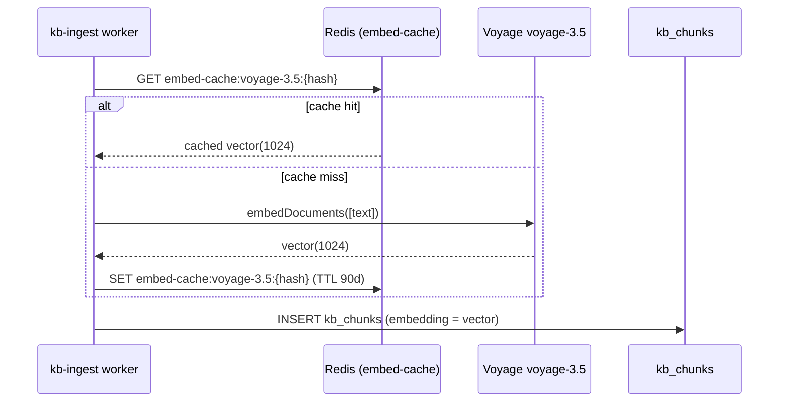
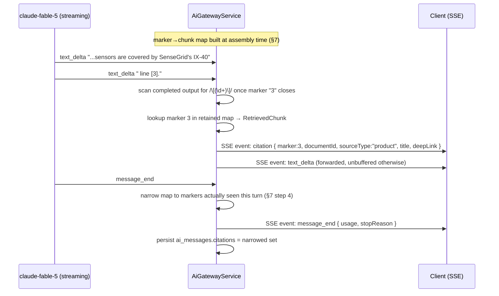

# RAG Architecture

This document specifies the retrieval pipeline that grounds Concourse's AI features in the per-event knowledge base: chunking, embedding, retrieval strategy, reranking, tenant/visibility filtering, evaluation, latency budgets, the agentic retrieval tool contract, and citation resolution. It owns everything between "a chunk exists in `kb_chunks`" and "a model call receives grounded context and a citation renders on screen." It does **not** own: the AI service boundary, model routing, prompt architecture, guardrails, cost controls, or the SSE event catalog — those are [21-ai-architecture.md](21-ai-architecture.md); the `kb_source`/`kb_document`/`kb_chunk` lifecycle, ingestion triggers, and moderation/quarantine workflow — those are [23-knowledge-base-architecture.md](23-knowledge-base-architecture.md); column-level schema and RLS policy text — that is [16-database-schema.md](16-database-schema.md); and the deterministic keyword search endpoint — that is [18-api-architecture.md](18-api-architecture.md) §5.11. Today's only caller of the retrieval pipeline described here is **Expo Copilot** ([00-foundation.md](00-foundation.md) §10); Smart Matchmaking consumes raw chunk/profile embeddings directly ([21-ai-architecture.md](21-ai-architecture.md) §3.2) rather than issuing a retrieval query, and Organizer Pulse never touches the knowledge base — it queries a curated metric layer instead ([21-ai-architecture.md](21-ai-architecture.md) §3.5).

---

## 1. Pipeline overview

Two pipelines share the same storage: an offline **ingestion pipeline** (worker, queue `kb-ingest`) that turns a `kb_source` into embedded `kb_chunks`, and an online **retrieval pipeline** (API, interactive path) that turns an attendee's question into grounded, cited context.

```mermaid
flowchart TB
    subgraph ingest["Ingestion — apps/worker, queue kb-ingest"]
        S[kb_sources row] --> D[kb_documents: normalized text]
        D --> C1[Chunk per §2]
        C1 --> H{Embedding cache hit? §4}
        H -->|hit| E1[Reuse cached vector(1024)]
        H -->|miss| E2[AiEmbeddingService.embedDocuments §3]
        E1 --> K[kb_chunks row: content + embedding + visibility + metadata]
        E2 --> K
    end
    subgraph query["Retrieval — apps/api, interactive path"]
        Q[Attendee question] --> QE[AiEmbeddingService.embedQuery §3]
        QE --> F[Tenant + visibility SQL filter §6]
        F --> ANN[HNSW cosine ANN search, top 50]
        ANN --> R[rerank-2.5 §5]
        R --> TH{Above min score?}
        TH -->|no| NR[No grounded result — Copilot declines, deterministic search shown]
        TH -->|yes| CA[Citation-marker assembly §7]
        CA --> CTX[kb_context block injected into prompt]
        CTX --> GEN[claude-fable-5 generation, doc 21 §3.1]
        GEN -->|optional 2nd hop| TOOL[search_knowledge_base tool §10]
        TOOL --> F
        GEN --> STREAM[SSE stream: text_delta + citation events §11]
    end
    K -.->|indexed content available to| ANN
```

`RetrievalService.search(principal, eventId, query, opts)` ([21-ai-architecture.md](21-ai-architecture.md) §1) is the single entry point into the query-time pipeline; nothing outside `packages/ai` issues a query against `kb_chunks` directly, matching the module-boundary enforcement in doc 21 §1.

## 2. Chunking strategy per `kb_document` type

Every `kb_document` inherits its type from its parent `kb_sources.kind` ([16-database-schema.md](16-database-schema.md) §7.1): `exhibitor_profile | product | agenda | uploaded_document | external_url`. Chunking is type-aware because the five kinds have wildly different structure — a product listing is already an atomic unit; a 40-page spec sheet is not.

| `kb_source.kind` | Unit chunked | Target chunk size | Overlap | `kb_chunks.metadata` captured |
|---|---|---|---|---|
| `exhibitor_profile` | Profile split by declared section (About, Why Visit Us, Categories) | ~500 tokens | none — sections are already coherent units | `{ section }` |
| `product` | One `products` row (name + description + specs + category) | ~300 tokens; split by paragraph only if description exceeds 600 tokens | 15% only when split | `{ productId, category }` |
| `agenda` | One `agenda_sessions` row (title + abstract + speaker bio) | ~350 tokens | none | `{ agendaSessionId, track, startsAt }` |
| `uploaded_document` | Recursive structural splitter: headings → paragraphs → sentences (never mid-sentence) over `kb_documents.raw_text` extracted from the `files` original | 512 tokens | 15% (~75 tokens) | `{ pageNumber, headingPath, fileId }` |
| `external_url` | Same recursive splitter, applied to readability-extracted main content | 512 tokens | 15% | `{ url, scrapedAt }` |

Rules applied uniformly regardless of kind:

1. **Minimum viable chunk:** fragments under 40 tokens (e.g., an isolated "Booth 412" line) are merged into the preceding chunk rather than embedded standalone — a near-empty vector adds retrieval noise without adding grounding value.
2. **Token counting:** `kb_chunks.token_count` is populated from the same tokenizer Voyage uses for request-size accounting, so ingestion can pre-batch requests without guessing.
3. **Chunking runs once per (re)ingestion**, triggered by `POST /v1/kb-sources/{sourceId}/reingest` ([18-api-architecture.md](18-api-architecture.md) §5.10) or the standing ingest trigger; `kb_documents.status` moves `pending → processing → indexed` as chunking and embedding complete, `quarantined`/`failed` on guardrail or extraction failure ([23-knowledge-base-architecture.md](23-knowledge-base-architecture.md)).
4. **Structural metadata is not optional** for `uploaded_document`/`external_url` — `pageNumber`/`headingPath`/`url` are what let citation assembly (§7) build a deep link back to the exact place a claim came from, not just the document.

## 3. Embedding pipeline (`voyage-3.5`)

All embedding calls go through `AiEmbeddingService` ([21-ai-architecture.md](21-ai-architecture.md) §1) — `embedDocuments(texts)` for ingestion, `embedQuery(text)` for the query-time path. Both call Voyage `voyage-3.5`, 1024 dimensions, per [00-foundation.md](00-foundation.md) §6.

- **Ingestion (batch):** the worker groups a document's chunks into requests of up to 128 texts (Voyage's practical batch ceiling) and calls `embedDocuments`. This runs under the **batch** priority class of the shared Redis token bucket ([21-ai-architecture.md](21-ai-architecture.md) §8.1), so a large reingest can never starve Copilot's interactive `embedQuery` calls. Before calling Voyage, every chunk's content hash is checked against the embedding cache (§4); only misses are actually sent to the provider.
- **Query time (interactive):** `embedQuery(text)` embeds the attendee's question (after query rewrite/coreference resolution, doc 21 §3.1) as a single small request on the interactive priority class. Query embeddings are **not** cached — attendee questions are free text with low repeat-hit value, and caching raw question text would add a privacy surface for no retrieval benefit; document embeddings repeat constantly across reingestions and are the case worth caching (§4).
- **Shared consumer:** the same 1024-dim vectors this pipeline produces for `product`/`exhibitor_profile` chunks are the "vectors from doc 22" Smart Matchmaking's deterministic scorer compares against attendee interest-profile embeddings ([21-ai-architecture.md](21-ai-architecture.md) §3.2) — one embedding pipeline, two consumers, no divergent vector spaces.
- **Model pinning:** the embedding model id is a single constant (`packages/shared/src/ai/models.ts`, alongside the generation aliases in doc 21 §2). A future model upgrade requires a full corpus re-embed — the embedding cache key includes the model id (§4) precisely so an upgrade cache-misses everything instead of silently mixing vector spaces.

## 4. Embedding cache

**Decision:** a **Redis content-hash cache**, not a new Postgres table. `kb_chunks.embedding` is already the durable store of record; the cache exists only to avoid re-paying Voyage for content that hasn't changed — most commonly, a `reingest` on a `kb_source` whose underlying text didn't actually change, or templated boilerplate repeated verbatim across similar `exhibitor_profile` sources.

- **Key:** `embed-cache:{model}:{sha256(normalized_chunk_text)}` — normalization = trim + collapse whitespace + lowercase-invariant Unicode NFC, so trivial formatting differences still hit.
- **Value:** the 1024-float vector, msgpack-encoded.
- **TTL:** 90 days, sliding (refreshed on hit) — long enough to cover an event's full ingest/reingest lifecycle, short enough to bound Redis memory without a manual eviction job.
- **No invalidation path is needed:** the hash *is* the content. Changed content produces a different key (correct miss); a model upgrade changes the key prefix (correct full miss, by design — §3). There is no state where a cached vector can become stale in place.
- **Hit accounting:** a cache hit still emits the `ai.embed` OTel span (doc 21 §9) with `cache.hit=true` and zero cost/latency recorded against the provider — the embedding cache uses the exact same span attribute doc 21 §9 already defines for this purpose, not a bespoke metric.



## 5. Retrieval strategy: pure-vector, not hybrid

| Dimension | Pure vector (`voyage-3.5` + `rerank-2.5`) | Hybrid (vector + lexical/BM25 fusion) |
|---|---|---|
| Recall on natural-language questions (Copilot's actual traffic, doc 21 §5 golden set) | High | High |
| Recall on exact-match lookups (booth number, SKU, acronym) | Moderate; mitigated below | High |
| Precision after reranking | High — cross-encoder rerank recovers most of the lexical-sensitivity gap | High |
| Fit with locked schema | Exact fit — `kb_chunks` (16 §7.3) carries only the HNSW vector index, no `tsvector`/GIN column | Requires an undocumented amendment to a locked schema doc |
| Duplicate work vs. existing platform surfaces | None — exact-match/lookup queries already have a home | Duplicates `GET /v1/events/{eventId}/search` (18 §5.11), which already does deterministic FTS lookup over exhibitors/products/agenda-sessions |
| Engineering surface | One index, one scoring function, one candidate set | Two indexes, a fusion function (e.g. RRF), a second tuning axis in evals |
| Fit with corpus scale | Tens of thousands of chunks per event (foundation D5, doc 16 §2.7) — HNSW recall is already very high at this scale | Same scale; lexical index adds cost without a clear recall win here |

**Decision: pure-vector retrieval with `rerank-2.5` reranking, no lexical fusion.** The schema was already built this way (doc 16 §7.3 has no lexical index on `kb_chunks`), the platform already has a dedicated deterministic keyword-search path for lookup-style queries, and Copilot's job is conversational grounded QA over natural-language questions, not keyword matching. Introducing a second, fused index would add tuning surface (fusion weights, a second recall metric) to solve a problem the platform doesn't actually have in this feature's traffic pattern.

**Mitigating the one real gap (exact identifiers embedding poorly):** every chunk's canonical identifiers (booth number, SKU, agenda track code) are written into the chunk text itself during chunking (§2), not left implicit, so the embedding model sees them in context; `rerank-2.5` is a cross-encoder and is materially more sensitive to lexical overlap than cosine similarity alone, which recovers most exact-match precision at the rerank stage. If the retrieval evals (§8) ever show a sustained exact-match recall gap that this doesn't close, **hybrid lexical fusion for RAG retrieval is an explicit, scoped revisit item in [44-future-expansion-plan.md](44-future-expansion-plan.md)**, gated on eval evidence rather than speculative need.

**Rerank application:** `RetrievalService.search` runs the ANN stage over the tenant/visibility-filtered candidate set (§6) at `maxCandidates` (default 50), then calls `AiEmbeddingService.rerank(query, docs)` on those 50 to produce the final ranking, and returns the top `limit` (default 8, max 12). Candidates scoring below `minRerankScore` (default 0.3) are dropped; if the surviving set is empty, `search` returns an empty result and Copilot's grounding rule (doc 21 §3.1) requires the model to say it can't find grounded information rather than answer un-cited.

```typescript
interface RetrievalOptions {
  limit?: number;           // default 8, max 12 — final chunks returned
  maxCandidates?: number;   // default 50 — pre-rerank ANN pool size
  sourceKinds?: KbSourceKind[];
  eventExhibitorId?: string;
  minRerankScore?: number;  // default 0.3
}

interface RetrievedChunk {
  chunkId: string;
  documentId: string;
  sourceType: KbSourceKind;   // kb_sources.kind
  title: string;
  content: string;
  score: number;              // rerank-2.5 relevance score
  metadata: Record<string, unknown>; // §2 per-kind metadata
}
```

## 6. Tenant & visibility filtering at query time

Per [00-foundation.md](00-foundation.md) §8, isolation is **application-level scoping first, Postgres RLS as defense-in-depth behind it** — both mandatory, neither sufficient alone. `kb_chunks` is explicitly the case doc 16 calls out (§7.3): "Retrieval additionally filters by visibility and caller entitlement inside the query itself — RLS is the tenant backstop, not the visibility mechanism." This section is where that filter is specified.

`RetrievalService.search` builds an explicit `WHERE` clause from the caller's `RetrievalPrincipal` before the ANN search ever runs — it is not a post-filter on results, because filtering after a top-50 ANN search would silently starve the reranker of in-scope candidates whenever a tenant's content is a minority of nearby vectors.

```typescript
interface RetrievalPrincipal {
  userId: string;
  organizationId?: string;   // caller's own org, if any (exhibitor or organizer)
  roles: string[];           // canonical role strings, 00-foundation §8
}
```

| Caller role | Allowed `visibility` values | Additional `owner_organization_id` constraint |
|---|---|---|
| `attendee` (registration) | `public` | n/a — only `public` rows ever qualify |
| `exhibitor:admin`, `exhibitor:rep` | `public`, `exhibitor_internal` | `exhibitor_internal` rows require `owner_organization_id = principal.organizationId` |
| `event:admin`, `event:staff` (organizer) | `public`, `organizer_internal` | tenant-scoped already via `organizer_organization_id` |
| `platform:admin` | `public`, `exhibitor_internal`, `organizer_internal` | none — oversight path; every use is audit-logged ([00-foundation.md](00-foundation.md) §8, [29-audit-logging-architecture.md](29-audit-logging-architecture.md)) |

```sql
SELECT id, kb_document_id, chunk_index, content, metadata,
       1 - (embedding <=> $1::vector) AS similarity
FROM kb_chunks
WHERE event_id = $2
  AND organizer_organization_id = $3          -- tenant scope, mirrors the RLS predicate
  AND visibility = ANY($4::text[])            -- role-derived allowlist, table above
  AND (
        visibility = 'public'
        OR owner_organization_id = $5          -- caller's own org, when applicable
      )
ORDER BY embedding <=> $1::vector
LIMIT $6;                                       -- maxCandidates
```

Today, Expo Copilot's principal is always an `attendee` — in practice its allowlist is always `{public}`. The role table above exists at the `RetrievalService` layer regardless, because `kb_chunks` carries `exhibitor_internal`/`organizer_internal` rows from day one (doc 16 §7.3), and the filter must be correct for those rows even though no current caller exercises the broader roles — a future exhibitor- or organizer-facing retrieval consumer (§44) inherits a filter that's already correct rather than one that's correct only for the one caller that exists today. RLS (`app.current_org_id`/`app.current_user_id`, foundation §8) is applied by Postgres underneath this query on the same connection regardless of whether this `WHERE` clause is perfectly written — that redundancy is the point.

## 7. Citation assembly

Once `search` returns the reranked `RetrievedChunk[]` (§5), the gateway assembles the generation prompt's grounding context before the first model call:

1. Each returned chunk is assigned a **stable marker** `n` (1-indexed, in rerank order) for this request only.
2. Chunks are serialized into the `<kb_context nonce="…">` block ([21-ai-architecture.md](21-ai-architecture.md) §7.2) with their marker visibly attached, e.g. `[3] {content}`, so the model's own `[n]` citation output refers to the same numbering the client will resolve.
3. The full marker→chunk map (`Map<number, RetrievedChunk>`) is held for the duration of the request — it is what §11 resolves against as the model streams.
4. On `message_end`, the assembly step **narrows** the map to only the markers the model actually emitted (verified by the post-stream validator, doc 21 §7.4/§5, against citation-validity = 100% in CI) and writes that narrowed, deduplicated set to `ai_messages.citations` ([16-database-schema.md](16-database-schema.md) §7.5) in first-appearance order — the persisted record is "what was cited," not "what was retrieved."

Each persisted citation resolves fixed fields from the chunk's parent document and its `kb_sources.kind`:

| `sourceType` (`kb_sources.kind`) | `deepLink` construction |
|---|---|
| `exhibitor_profile` | `/e/{eventSlug}/exhibitors/{eventExhibitorId}` |
| `product` | `/e/{eventSlug}/exhibitors/{eventExhibitorId}/products/{productId}` |
| `agenda` | `/e/{eventSlug}/agenda/{agendaSessionId}` |
| `uploaded_document` | short-lived presigned URL to the original file ([26-file-storage.md](26-file-storage.md)), optionally with `#page={pageNumber}` from `kb_chunks.metadata` |
| `external_url` | the source's `source_url` (`kb_sources.source_url`) |

```json
{
  "marker": 3,
  "documentId": "3f1e9c2a-...",
  "sourceType": "product",
  "title": "SenseGrid IX-40 Vibration Sensor",
  "deepLink": "/e/techexpo-2027/exhibitors/8b21.../products/c9a0..."
}
```

This is the exact shape `ai_messages.citations` stores (doc 16 §7.5) and the exact shape the `citation` SSE event carries (doc 21 §11) — one struct, three places it's referenced, never redefined.

## 8. Retrieval evals: recall@k and nDCG

Retrieval quality is graded independently of generation quality — a perfectly-cited answer built on the wrong chunks is still a grounding failure, so it needs its own gate rather than riding on doc 21's groundedness judge.

- **Golden set:** `evals/retrieval/golden.jsonl`, checked into the repo, built against the same seeded fixture event used by doc 21 §5. Each row is `{ query, relevantChunkIds: string[] }`, curated by engineering + product across the same query categories as the Copilot golden set (navigational, comparative, logistics, out-of-scope) so the two suites stay aligned. Target size: 150 labeled queries at launch, grown alongside the fixture event's corpus.
- **Metrics:**

| Metric | Definition | Gate (CI merge-blocking) |
|---|---|---|
| `recall@5` | Fraction of queries where ≥1 labeled-relevant chunk appears in the top 5 post-rerank results | ≥ 0.85 |
| `recall@10` | Same, top 10 post-rerank | ≥ 0.92 |
| `nDCG@10` | Rank-weighted relevance quality over the top 10 post-rerank results | ≥ 0.85 |
| Pre-rerank `recall@50` | ANN-stage-only recall (isolates the vector index from the reranker) | ≥ 0.95 — a drop here indicates an embedding/chunking regression rather than a reranker regression |
| Cross-tenant leakage | Adversarial queries run as principal A must return zero chunks owned by tenant B | 0 leaked rows, always — treated as a security gate, not a quality gate |

- **Regression gate:** any PR touching `packages/ai/src/retrieval/**`, the chunking pipeline, or the embedding/rerank model aliases runs this suite; merge blocks on any gate above, plus no metric regressing more than 2 points from the recorded baseline — the identical discipline doc 21 §5 applies to its own eval gates.
- **Nightly full runs** against the live corpus (not just the fixture event) catch drift from real ingestion patterns; results land on the AI dashboard ([31-observability.md](31-observability.md)) alongside doc 21's eval results, since this suite runs "in the same CI stage" doc 21 §5 designates.
- **Fixture infrastructure:** Testcontainers-seeded Postgres with pgvector, per [42-testing-strategy.md](42-testing-strategy.md) — the same fixture harness the generation evals use, so retrieval and generation evals can be run together for end-to-end regression checks without double-seeding.

## 9. Retrieval latency budget

Expo Copilot's first-token budget allocates **≤ 380 ms p95** to retrieval (doc 21 §3.1). That budget is broken down across the hop-1 (automatic, pre-generation) retrieval stages:

| Stage | Budget (p95) | Notes |
|---|---|---|
| Query embedding (`embedQuery`) | ≤ 60 ms | Single small Voyage call, interactive priority class |
| Tenant/visibility-filtered HNSW ANN search (§6, top 50) | ≤ 80 ms | `ef_search` tuned at query time against the doc 16 §2.7 index; per-event corpus size (tens of thousands of chunks) keeps this well under budget |
| `rerank-2.5` (50 → top `limit`) | ≤ 180 ms | The dominant cost — a cross-encoder call over 50 candidates |
| Context/marker assembly (§7) | ≤ 20 ms | In-process, no I/O |
| Network + scheduling overhead | ≤ 40 ms | Buffer for connection reuse, GC pauses, etc. |
| **Total (hop 1)** | **≤ 380 ms** | Matches doc 21 §3.1 exactly |

The optional agentic second hop (§10) executes **mid-stream**, after first token has already been emitted — it does not count against the 380 ms first-token allocation. It carries the same per-hop budget (≤ 380 ms p95) but counts instead against Copilot's **≤ 8 s p95 complete-answer budget** (doc 21 §3.1). Worst case — both hops fire — consumes ≤ 760 ms of retrieval time across the full answer, leaving the remaining budget for the two generation segments and the tool round-trip itself; the hop cap in §10 exists specifically to keep this worst case bounded rather than open-ended.

## 10. Agentic retrieval tool contract

Expo Copilot's system prompt exposes exactly one retrieval tool, matching the tool named in [21-ai-architecture.md](21-ai-architecture.md) §3.1: `search_knowledge_base(query, filters)`. It is read-only, like every Copilot tool (doc 21 §3.1's "zero mutating tools by design").

```json
{
  "name": "search_knowledge_base",
  "description": "Search the event knowledge base for grounding information. Use only when the context already provided is insufficient to answer the question — this is a second retrieval pass, not a first resort.",
  "input_schema": {
    "type": "object",
    "properties": {
      "query": { "type": "string", "description": "A focused natural-language query, not the raw user message" },
      "filters": {
        "type": "object",
        "properties": {
          "sourceKinds": {
            "type": "array",
            "items": { "type": "string", "enum": ["exhibitor_profile", "product", "agenda", "uploaded_document", "external_url"] }
          },
          "eventExhibitorId": { "type": "string", "format": "uuid" }
        }
      }
    },
    "required": ["query"]
  }
}
```

- **Implementation:** the tool handler calls the exact same `RetrievalService.search(principal, eventId, query, opts)` as the automatic hop-1 retrieval — `filters` maps directly onto `RetrievalOptions.sourceKinds`/`eventExhibitorId` (§5). There is no separate, looser code path for the agentic hop; it inherits the identical tenant/visibility filter (§6) and rerank threshold (§5).
- **Hop cap — exactly 2:** hop 1 is the automatic pre-generation retrieval (§1, §9); the model may invoke `search_knowledge_base` **at most once** per turn, for a hard total of 2 retrieval hops, enforced by a counter in the tool-loop state inside `AiGatewayService` (doc 21 §1) — not a suggestion in the prompt. A third attempted call returns `{ "error": "max_hops_reached" }` as the tool result, forcing the model to answer with what it already has, still subject to the citation-validity check (§7, doc 21 §7.4). This bounds both cost (a second reranker call is not free) and the §9 worst-case latency.
- **Result shape:** identical `RetrievedChunk[]` (§5), serialized as a fresh `<kb_context>` block with markers continuing the sequence from hop 1 (i.e., if hop 1 supplied markers 1–8, hop 2's results are numbered 9 onward) so no marker is ever reused for two different chunks within one message.
- **Fallback:** if the tool call itself fails (provider error, budget exhaustion), the tool result is a graceful `{ "error": "retrieval_unavailable" }` rather than a thrown exception into the model loop — the model is expected to answer from hop-1 context alone or decline per the grounding rule (doc 21 §3.1), never to retry the tool itself.

## 11. Citation marker resolution for the SSE stream

Assembly (§7) produces the marker→chunk map before generation starts; this section is what happens to that map **while tokens are streaming**, feeding the `citation` SSE event doc 21 §11 defines: `citation { marker, documentId, sourceType, title, deepLink }`.



Mechanically: the gateway buffers only the smallest span needed to detect a complete `[n]` token sequence in the model's output (it does not hold back unrelated text — `text_delta` events for non-citation text forward immediately). The moment a marker closes, the gateway does a synchronous in-memory lookup against the map built in §7 — **no database round-trip is on this path**, because every chunk the marker could possibly reference was already fetched and held in the map before generation began. If a marker appears that has no entry in the map (the validator's job, doc 21 §7.4), no `citation` event fires for it and the offending span is stripped or triggers one regeneration per doc 21 §7.4's guardrail — the client never receives a citation event it can't resolve to a real chunk. This is also why the map is scoped per-request rather than looked up by marker number alone: marker `3` in one message and marker `3` in another carry no relationship, and the gateway never conflates them.

At `message_end`, the narrowed, first-appearance-ordered citation set is written once to `ai_messages.citations` (§7, [16-database-schema.md](16-database-schema.md) §7.5) — so a client that reconnects mid-stream and refetches the thread (doc 21 §11's durability guarantee) sees the identical citations it would have received live, not a reconstruction.

## 12. Ownership

| Owns | Doc |
|---|---|
| Chunking, embedding (`voyage-3.5`), embedding cache, retrieval strategy, reranking (`rerank-2.5`), tenant/visibility query-time filter, citation assembly and resolution, retrieval evals, retrieval latency budget, agentic retrieval tool contract | **This document** |
| AI service boundary, model routing, per-feature prompt specs, guardrails, cost controls, SSE event catalog, generation-quality evals | [21-ai-architecture.md](21-ai-architecture.md) |
| `kb_sources`/`kb_documents`/`kb_chunks` lifecycle, ingestion triggers, moderation/quarantine | [23-knowledge-base-architecture.md](23-knowledge-base-architecture.md) |
| Column-level schema, indexes, RLS policy text for every table referenced here | [16-database-schema.md](16-database-schema.md) |
| `/v1/kb-sources`, `/v1/ai-conversations` route contracts; deterministic keyword search | [18-api-architecture.md](18-api-architecture.md) §5.10, §5.11 |
| Role→permission matrix, entitlement semantics | [28-permission-model.md](28-permission-model.md) |
| Deferred: hybrid lexical fusion for RAG retrieval (revisit only if §8 evals show a sustained exact-match recall gap) | [44-future-expansion-plan.md](44-future-expansion-plan.md) |

### Related Documents

- [00-foundation.md](00-foundation.md) — canonical entities (`kb_sources`, `kb_documents`, `kb_chunks`), tech stack (§6), tenancy/permission vocabulary (§8)
- [16-database-schema.md](16-database-schema.md) — §7.1–7.3 column-level schema and RLS for the tables this document queries
- [18-api-architecture.md](18-api-architecture.md) — §5.10 KB/AI routes, §5.11 deterministic search, §7.3/§11 SSE precedent
- [21-ai-architecture.md](21-ai-architecture.md) — AI service boundary, Expo Copilot spec (§3.1), guardrails (§7), SSE contract (§11)
- [23-knowledge-base-architecture.md](23-knowledge-base-architecture.md) — ingestion pipeline and moderation this document's chunker/embedder runs inside
- [28-permission-model.md](28-permission-model.md) — role→permission matrix backing §6's allowlist
- [44-future-expansion-plan.md](44-future-expansion-plan.md) — deferred hybrid-retrieval revisit
