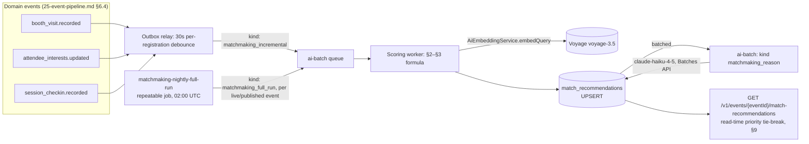
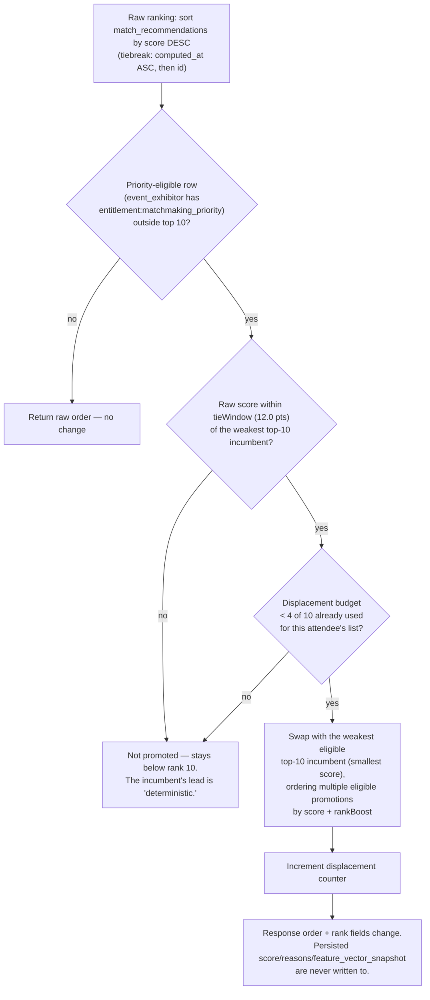

# Matchmaking and Scoring

This document owns the complete deterministic scoring model behind **Smart Matchmaking** ([00-foundation.md](00-foundation.md) §10): the weighted formula and its four input factors, the versioned weights-file convention, the golden-set tuning and evaluation methodology that feeds [21-ai-architecture.md](21-ai-architecture.md) §5's eval gates, the nightly full-run and incremental re-score pipeline (naming exactly which [25-event-pipeline.md](25-event-pipeline.md) domain events trigger which kind of re-score), and the priority-placement tie-breaking mechanic behind `entitlement:matchmaking_priority`. It does **not** own: the AI service boundary, model routing, or the feature's degradation/fallback behavior (all [21-ai-architecture.md](21-ai-architecture.md) §3.2, §8.3 — this document is that section's expansion, not a competing spec); the `match_recommendations` column-level DDL ([16-database-schema.md](16-database-schema.md) §6.9); the API routes, pagination, or entitlement-check semantics for reading recommendations ([18-api-architecture.md](18-api-architecture.md) §5.10, [28-permission-model.md](28-permission-model.md) §3.8); the embedding pipeline that produces the vectors this model consumes ([22-rag-architecture.md](22-rag-architecture.md) §3); the `ai-batch` queue's job shapes, concurrency, and retry ceiling ([27-background-jobs-architecture.md](27-background-jobs-architecture.md) §5.4); or the domain-event catalog and outbox mechanics that deliver this feature's triggers ([25-event-pipeline.md](25-event-pipeline.md) §5, §6.4). Every entity, persona, and vocabulary term below is canonical per [00-foundation.md](00-foundation.md).

## 1. Purpose & Design Principle

Smart Matchmaking scores attendee↔exhibitor pairs (Sofia ↔ every `event_exhibitor` at her event) to power two feature-matrix rows ([08-feature-matrix.md](08-feature-matrix.md) §4.10): **J2** (attendee-facing recommendations) and **J3** (exhibitor prospect lists). [21-ai-architecture.md](21-ai-architecture.md) §3.2 already locks the governing constraint this whole document works inside: **no LLM sets a score.** At foundation D5 scale (hundreds of thousands of attendees, thousands of exhibitors, multiple concurrent events), a score must be cheap to compute, reproducible bit-for-bit given the same inputs, and rankable without a model call in the hot path. A Claude call renders the *reason sentence* attached to a score (§6); it never touches the number. This split is what lets rank order be trusted by Jamal, Elena, and Sofia the same way a leaderboard is trusted — recomputing it twice with the same inputs always produces the same rank.

## 2. The Feature Vector: Four Scoring Factors

[21-ai-architecture.md](21-ai-architecture.md) §3.2 names four weighted factors. This section defines each one precisely enough to implement.

| Factor | Symbol | Definition | Primary data sources | Range |
|---|---|---|---|---|
| Embedding similarity | `S` | Cosine similarity between the attendee's interest-profile embedding and the exhibitor's content embeddings | `attendee_interests` (declared + inferred tags), `kb_chunks.embedding` for the exhibitor's `exhibitor_profile`/`product` chunks ([22-rag-architecture.md](22-rag-architecture.md) §3) | `[0, 1]` (negative cosine clamped to 0) |
| Declared-interest category overlap | `C` | Fraction of the attendee's declared interest tags this exhibitor's categories cover | `attendee_interests` (`kind = 'declared'`), `event_exhibitors.categories` | `[0, 1]` |
| Behavioral signal | `B` | Composite of booth-visit affinity and agenda-topic overlap | `booth_visits`, `session_checkins`, `agenda_sessions`, `event_exhibitors.categories` | `[0, 1]` |
| Reciprocal fit | `R` | How well the attendee matches the exhibitor's declared target-buyer criteria | `registrations` fields, `event_exhibitors.target_buyer_criteria` (§2.4) | `[0, 1]` |

### 2.1 Embedding similarity (`S`)

**Decision — computed at scoring time, never persisted as a column.** [22-rag-architecture.md](22-rag-architecture.md) §3 states plainly that "Smart Matchmaking consumes raw chunk/profile embeddings directly rather than issuing a retrieval query" and that the vectors are the same `voyage-3.5` (1024-dim) vectors already sitting in `kb_chunks.embedding` for `exhibitor_profile`/`product` chunks. There is no `attendee_interests`-level or `registrations`-level embedding column in [16-database-schema.md](16-database-schema.md) — a durable per-attendee embedding would be a second, staleness-prone copy of a fact (declared + inferred tags) that already lives in one place, which foundation principle 3 forbids. The scoring worker instead calls `AiEmbeddingService.embedQuery` (§1's port, [21-ai-architecture.md](21-ai-architecture.md) §1) on a synthesized short text — the attendee's declared and inferred tags joined into one string (`"industrial IoT, predictive maintenance, factory automation"`) — at the start of each scoring run for that registration, holding the resulting vector in worker memory only for the duration of the run.

`S` for a given `(registration, event_exhibitor)` pair is the **mean of the top-3 cosine similarities** between that interest-profile vector and the exhibitor's `kb_chunks` (kinds `exhibitor_profile`, `product`), clamped to `[0, 1]`:

```
S = mean(top3(cosine_similarity(interestProfileVector, chunkEmbedding) for chunk in exhibitorChunks))
```

Top-3-mean rather than a single max is a deliberate noise reduction: one unusually on-topic sentence in an otherwise generic profile should not single-handedly produce a 0.95 similarity that the rest of the exhibitor's content doesn't support.

### 2.2 Category overlap (`C`)

Recall-oriented, not Jaccard — the question is "how much of what this attendee said they want does this exhibitor cover," not overall set similarity:

```
C = |declaredTags ∩ exhibitor.categories| / max(1, |declaredTags|)
```

An attendee with no declared tags (`|declaredTags| = 0`) yields `C = 0` for every exhibitor — declared-interest overlap simply doesn't contribute for that registration, and the other three factors carry the score. This is preferable to an undefined `0/0` or an arbitrary neutral value, since "the attendee declared nothing" is a real, informative state, not a missing-data gap.

### 2.3 Behavioral signal (`B`)

A weighted sub-combination of two normalized sub-signals, both versioned alongside the top-level weights (§5):

```
B = 0.60 · VisitAffinity + 0.40 · AgendaOverlap

VisitAffinity = |booth_visits by this registration to exhibitors sharing ≥1 category with this event_exhibitor|
                / max(1, |all booth_visits by this registration|)

AgendaOverlap = |agenda_sessions (via session_checkins) whose track/category overlaps this event_exhibitor's categories|
                / max(1, |all agenda_sessions checked into by this registration|)
```

Both sub-signals are self-normalizing per attendee (they measure *proportion* of that attendee's own activity, not absolute counts), so a heavy show-floor walker and a light one are scored on the same `[0, 1]` scale.

### 2.4 Reciprocal fit (`R`)

**Schema note (additive, non-breaking).** `event_exhibitors` today ([16-database-schema.md](16-database-schema.md) §5.1) has no column for an exhibitor's target-buyer criteria. This document adds `event_exhibitors.target_buyer_criteria jsonb NULL` — an optional, exhibitor-authored structured object (job-title keywords, seniority levels, target industries, company-size bands), surfaced as an optional field on the Event Exhibitor Profile editor (feature D4, [08-feature-matrix.md](08-feature-matrix.md) §4.4) — following the same "register the need here, formalize the DDL on the schema's next revision" discipline [00-foundation.md](00-foundation.md) §14 established for its own A1/A2 amendments, and that [16-database-schema.md](16-database-schema.md)'s own introduction already anticipates for additive doc-driven needs.

```typescript
interface TargetBuyerCriteria {
  jobTitleKeywords?: string[];    // matched against registrations.job_title, case-insensitive substring
  targetIndustries?: string[];    // matched against registrations.custom_fields.industry, if the
                                   // event's registration form (F2) collects it
  companySizeBands?: string[];    // e.g. ["51-200", "201-1000"]; matched against
                                   // registrations.custom_fields.company_size
}
```

```
R = 0.50 · jobTitleMatch + 0.30 · industryMatch + 0.20 · companySizeMatch   (each term ∈ {0, 1})
```

**Decision — neutral default when unset.** Most exhibitors will not fill in this optional field, especially at `essentials`/`growth` tiers where nobody has asked them to. Scoring `R = 0` for every exhibitor that skips an optional field would systematically punish the majority for non-participation in a field with no adoption pressure. `target_buyer_criteria IS NULL` therefore yields `R = 0.50` (the scale's midpoint — neither reward nor penalty), a constant named `RECIPROCAL_FIT_NEUTRAL_DEFAULT` in the weights file (§5).

## 3. The Deterministic Scoring Formula

```
score = 100 × ( w_S·S + w_C·C + w_B·B + w_R·R )        clamped to [0, 100], stored as numeric(5,2)
```

with default weights (versioned in `weights.ts`, §5):

| Weight | Factor | Default value | Rationale |
|---|---|---|---|
| `w_S` | Embedding similarity | `0.40` | The broadest, most semantically rich signal — captures fit even when tags/categories are coarse or missing |
| `w_C` | Category overlap | `0.25` | Explicit, attendee-declared intent deserves real weight, not just a tiebreaker |
| `w_B` | Behavioral signal | `0.20` | Revealed preference (what Sofia actually does) corroborates or corrects declared intent |
| `w_R` | Reciprocal fit | `0.15` | Smallest weight — optional, sparsely populated input; present to reward exhibitors who configure it without letting its absence swing scores for everyone else |

`w_S + w_C + w_B + w_R = 1.00` is an enforced invariant (§5) — the formula never needs a separate normalization step.

## 4. Worked Example

Sofia declared interests `{"industrial-iot", "predictive-maintenance"}` at registration. "SensorWorks" (an `event_exhibitor`, `categories = {"industrial-iot", "automation"}`) has not configured `target_buyer_criteria`.

| Factor | Computation | Value |
|---|---|---|
| `S` | Mean of top-3 cosine similarities between Sofia's interest-profile vector and SensorWorks's `exhibitor_profile`/`product` chunks | `0.78` |
| `C` | `\|{"industrial-iot"}\| / \|{"industrial-iot","predictive-maintenance"}\|` = `1/2` | `0.50` |
| `B` | `VisitAffinity` = 2 of her 3 booth visits so far were to category-overlapping exhibitors = `0.667`; `AgendaOverlap` = 2 of her 4 checked-in agenda sessions overlap = `0.50`; `B = 0.60(0.667) + 0.40(0.50)` | `0.60` |
| `R` | `target_buyer_criteria` unset → neutral default | `0.50` |

```
score = 100 × (0.40·0.78 + 0.25·0.50 + 0.20·0.60 + 0.15·0.50)
      = 100 × (0.312 + 0.125 + 0.120 + 0.075)
      = 100 × 0.632
      = 63.20
```

`63.20` is written to `match_recommendations.score` ([16-database-schema.md](16-database-schema.md) §6.9), and each input above (with the identifying ids, not just the numbers) is written to `feature_vector_snapshot` for reproducibility, per §6.

## 5. Versioned Weights File

Weights are code, reviewed and diffed like any other logic — never a database row an ops user could quietly nudge. They live in exactly one place:

```typescript
// packages/ai/src/matchmaking/weights.ts
export const MATCHMAKING_WEIGHTS_VERSION = 4;

export interface MatchmakingWeightSet {
  version: number;
  embeddingSimilarity: number;   // w_S
  categoryOverlap: number;       // w_C
  behavioralSignal: number;      // w_B
  reciprocalFit: number;         // w_R
}

export const MATCHMAKING_WEIGHTS: MatchmakingWeightSet = {
  version: MATCHMAKING_WEIGHTS_VERSION,
  embeddingSimilarity: 0.40,
  categoryOverlap: 0.25,
  behavioralSignal: 0.20,
  reciprocalFit: 0.15,
};

export const BEHAVIORAL_SUBWEIGHTS = { visitAffinity: 0.60, agendaOverlap: 0.40 } as const;
export const RECIPROCAL_FIT_SUBWEIGHTS = { jobTitleMatch: 0.50, industryMatch: 0.30, companySizeMatch: 0.20 } as const;
export const RECIPROCAL_FIT_NEUTRAL_DEFAULT = 0.50;

export const PRIORITY_PLACEMENT = {
  rankBoost: 8.0,            // score-equivalent nudge, ranking-only, never persisted (§9)
  tieWindow: 12.0,            // max raw-score gap eligible for promotion
  topNCap: 10,
  maxDisplacementRatio: 0.40, // → 4 of 10 slots
} as const;
```

**Enforcement, mirroring [21-ai-architecture.md](21-ai-architecture.md) §4's prompt-versioning discipline exactly:** a build step emits `weights.manifest.json` (`{ version, sha256(weightsObject) }`), committed alongside the source. CI fails if the checked-in weights change without a version bump — silent weight drift is as unacceptable as silent prompt drift, for the identical reason: every historical score must be attributable to an exact weight set. A unit test asserts `w_S + w_C + w_B + w_R === 1.00 ± 1e-9` on every `MATCHMAKING_WEIGHTS` export, failing the build before an unnormalized weight set ever reaches a scoring run. Every `match_recommendations` row's `feature_vector_snapshot` (§6) records `weightsVersion`, so a score computed under version 3 is never silently reinterpreted under version 4's weights. Rollback is `git revert`, same as doc 21 §4 — there is no runtime weight-editing UI in Phase 1.

## 6. Evidence, Snapshot & Reason Generation

Every scoring run writes two `jsonb` columns on `match_recommendations` ([16-database-schema.md](16-database-schema.md) §6.9): `feature_vector_snapshot` (the full computation, for reproducibility and debugging) and `reasons` (the array [21-ai-architecture.md](21-ai-architecture.md) §3.2 shows to Sofia and Elena, always). Both are populated from the same worked example above:

```json
{
  "weightsVersion": 4,
  "score": 63.20,
  "embeddingSimilarity": { "value": 0.78, "topChunkIds": ["kbc_01J9Xa…", "kbc_01J9Xb…", "kbc_01J9Xc…"] },
  "categoryOverlap": { "value": 0.50, "declaredTags": ["industrial-iot", "predictive-maintenance"], "matchedTags": ["industrial-iot"] },
  "behavioralSignal": { "value": 0.60, "visitAffinity": 0.667, "agendaOverlap": 0.50, "boothVisitIds": ["bv_01J8…", "bv_01J8…"], "agendaSessionIds": ["as_01J7…", "as_01J7…"] },
  "reciprocalFit": { "value": 0.50, "basis": "neutral_default" }
}
```

**Evidence id namespace** — the registry the [21-ai-architecture.md](21-ai-architecture.md) §3.2 reason-validator checks every `evidence_ids` entry against:

| Prefix | Refers to | Example |
|---|---|---|
| `embedding:` | A `kb_chunks.id` contributing to `S` | `embedding:kbc_01J9Xa…` |
| `category:` | A matched declared-interest tag contributing to `C` | `category:industrial-iot` |
| `visit:` | A `booth_visits.id` contributing to `B` | `visit:bv_01J8…` |
| `agenda:` | A `session_checkins.id` contributing to `B` | `agenda:as_01J7…` |
| `reciprocal:` | A matched `target_buyer_criteria` key contributing to `R` | `reciprocal:jobTitleKeywords` |

`claude-haiku-4-5` (Message Batches, per [21-ai-architecture.md](21-ai-architecture.md) §2/§3.2) renders one 1–2 sentence `reason_text` per pair from exactly this evidence, e.g.:

```json
[{ "reason_text": "Matches your interest in industrial IoT — you've visited 2 related booths and attended 2 related agenda sessions.",
   "evidence_ids": ["category:industrial-iot", "visit:bv_01J8…", "visit:bv_01J8…", "agenda:as_01J7…", "agenda:as_01J7…"] }]
```

If reason generation fails or the AI budget is exhausted, [21-ai-architecture.md](21-ai-architecture.md) §3.2/§8.3's deterministic template fallback ("Matches your interest in *{topTag}*; showing {n} related products") reads off the same `feature_vector_snapshot` — it requires no separate code path, since the snapshot already holds every fact a template needs.

## 7. Scoring Pipeline: Nightly Full Run & Incremental Re-Score



### 7.1 Nightly full run

Scheduled as a BullMQ repeatable job `matchmaking-nightly-full-run` at `0 2 * * *` UTC — one hour before [27-background-jobs-architecture.md](27-background-jobs-architecture.md) §6's `ai-eval-nightly`, so any eval run that day observes freshly-computed production scores rather than yesterday's. It enqueues one `{ kind: 'matchmaking_full_run', eventId }` job (per [27-background-jobs-architecture.md](27-background-jobs-architecture.md) §5.4's `AiBatchJob` union) on `ai-batch` for every event with `status IN ('published', 'live')`, which re-scores every `(registration, event_exhibitor)` pair at that event from scratch. This is the entry this document contributes to [27-background-jobs-architecture.md](27-background-jobs-architecture.md) §6's scheduled-job registry — the same "register the schedule here, let the queue doc's next revision list it mechanically" split [25-event-pipeline.md](25-event-pipeline.md) §5.7 already uses for file-domain events.

### 7.2 Incremental re-score: exactly three triggers, two granularities

[21-ai-architecture.md](21-ai-architecture.md) §3.2 and [25-event-pipeline.md](25-event-pipeline.md) §6.4 already lock the trigger set — **`booth_visit.recorded`, `attendee_interests.updated`, `session_checkin.recorded`** — and note the consumer is scoped to either a single pair or the registration's whole profile. This document fixes which is which and why:

| Domain event | Job payload | Scope | Why |
|---|---|---|---|
| `booth_visit.recorded` | `{ kind: 'matchmaking_incremental', registrationId, eventExhibitorId }` | **Pair-scoped** — only the visited exhibitor's score for this registration | A single visit's most direct signal is affinity toward *that* exhibitor. Recomputing every exhibitor's `VisitAffinity` denominator on every scan would multiply work by the exhibitor count at up to 1,200 scans/min ([18-api-architecture.md](18-api-architecture.md) §3.8) for a second-order effect (other exhibitors' `VisitAffinity` shifts only through the shared denominator) that the next nightly full run already corrects. Accepted, bounded staleness — never unbounded, since §7.1 guarantees a daily correction. |
| `attendee_interests.updated` | `{ kind: 'matchmaking_incremental', registrationId }` | **Whole-profile** — every `event_exhibitor` at the registration's event | Declared/inferred tags feed both `S` (the interest-profile embedding) and `C` (category overlap) identically for every exhibitor; there is no pair-scoped subset of exhibitors this could skip. |
| `session_checkin.recorded` | `{ kind: 'matchmaking_incremental', registrationId }` | **Whole-profile** | Agenda-topic overlap (`AgendaOverlap`, §2.3) is compared against every exhibitor's `categories`, same reasoning as above. |

**Debounce.** [25-event-pipeline.md](25-event-pipeline.md) §6.4 fixes a 30-second, last-trigger-wins debounce per `registration_id` at the outbox relay to absorb scan bursts. This document adds the coalescing rule for mixed trigger types landing in the same window: **the consumer performs the union of scope** — if a pair-scoped `booth_visit.recorded` and a whole-profile `attendee_interests.updated` both land for the same registration within 30 seconds, the single re-score that fires is whole-profile, never the narrower one. A pair-scoped re-score is only safe to run alone when nothing broader was also requested in the window.

`match_recommendations`' `UNIQUE (event_exhibitor_id, registration_id)` constraint ([16-database-schema.md](16-database-schema.md) §6.9) makes every one of these an idempotent upsert-in-place — a redundant re-score (e.g., a full run and an incremental run racing) is a harmless overwrite with the more recent `computed_at` winning, never a duplicate row.

## 8. Golden-Set Tuning & Evaluation Methodology

[21-ai-architecture.md](21-ai-architecture.md) §5 fixes the golden set's location and size for this feature: `evals/matchmaking/golden.jsonl`, 100 labeled pairs. This document owns what "labeled" means and how weights get tuned against it.

### 8.1 Label schema

Each golden-set entry is a `(syntheticAttendeeProfile, eventExhibitorFixture, relevanceGrade, rationale)` tuple, curated by engineering + product against the seeded fixture event ([42-testing-strategy.md](42-testing-strategy.md)):

| `relevanceGrade` | Meaning |
|---|---|
| `0` | Not relevant — an attendee in this profile would not want this recommendation |
| `1` | Tangential — plausible but weak fit |
| `2` | Relevant — a good match |
| `3` | Highly relevant — obviously worth surfacing near the top |

### 8.2 Offline tuning harness

`packages/ai/src/matchmaking/tune-weights.ts` is an offline script (never runs in production, no `AiGatewayService` involvement) that grid-searches candidate `MatchmakingWeightSet` combinations — each weight constrained to `[0, 0.60]` in `0.05` steps, filtered to combinations summing to `1.00` — scoring the golden set under each candidate and computing **nDCG@10** (primary metric: rewards getting the *order* of the top 10 right, not just the presence/absence of relevant matches). The candidate with the highest nDCG@10 is surfaced as a proposal; engineering + product review it manually (never auto-promoted) before it becomes the next `MATCHMAKING_WEIGHTS_VERSION`.

### 8.3 Eval metrics & CI gates

| Metric | Grader | Threshold |
|---|---|---|
| `nDCG@10` | Programmatic, against `relevanceGrade` | ≥ baseline; merge blocks on regression > 2 points, the identical discipline [21-ai-architecture.md](21-ai-architecture.md) §5 applies to every other feature's eval gate |
| `Precision@5` | Programmatic | ≥ 0.80 |
| Cap-violation count | Programmatic — replays §9's tie-break algorithm against the golden set's simulated priority entitlements | **Must be `0`.** Per FR-MATCH-005 ([09-functional-requirements.md](09-functional-requirements.md) §4.10), a cap violation is a scoring-service invariant failure caught here, never a runtime user-facing error |
| Weight-sum invariant | Programmatic, on every `MatchmakingWeightSet` | Must equal `1.00 ± 1e-9` |
| Score-distribution sanity | Programmatic | No more than 5% of golden-set scores within 1.0 point of either `0` or `100` (a collapsed distribution signals a broken factor, e.g. an embedding call silently returning zero vectors) |

Any PR touching `packages/ai/src/matchmaking/**`, `evals/matchmaking/**`, or `weights.ts` runs this suite in CI — mirroring [21-ai-architecture.md](21-ai-architecture.md) §5's regression-gate wiring exactly. The [27-background-jobs-architecture.md](27-background-jobs-architecture.md) §6 `ai-eval-nightly` repeatable job additionally re-runs this suite nightly against the fixture event's then-current `kb_chunks` embeddings — since matchmaking's scoring path has no LLM call to drift, the analogous production risk this nightly run catches is **embedding-model drift** ([22-rag-architecture.md](22-rag-architecture.md) §3's "a future model upgrade requires a full corpus re-embed... the cache key includes the model id precisely so an upgrade cache-misses everything instead of silently mixing vector spaces"): a partially re-embedded corpus would silently mix vector spaces inside `S`, and this nightly run is what would first show a golden-set regression from exactly that failure mode.

## 9. Priority Placement & Tie-Breaking (`entitlement:matchmaking_priority`)

FR-MATCH-004/005 ([09-functional-requirements.md](09-functional-requirements.md) §4.10) and [21-ai-architecture.md](21-ai-architecture.md) §3.2 together fix the two governing constraints this section must satisfy simultaneously: the boost is capped ("may not displace more than 40% of any single attendee's top-10 recommendation slots, and never displaces a deterministically higher-scored non-priority match below position 10"), and it must **never change the displayed evidence** — only rank. §9.1–§9.3 resolve exactly how, reconciling what could otherwise read as a contradiction (any displacement necessarily moves *some* standard match down).

### 9.1 The reconciliation: "tie-breaking," precisely

A raw score gap is treated as **deterministic** (real, not noise) once it exceeds a fixed tie window; within the window, two scores are treated as statistically indistinguishable — a genuine tie the platform is free to break using the entitlement. "Never displaces a deterministically higher-scored match below position 10" therefore means exactly: outside the tie window, nothing moves. This is the literal implementation of [21-ai-architecture.md](21-ai-architecture.md) §3.2's "priority affects tie-breaking rank only."

### 9.2 The algorithm (applies to J2, the attendee-facing list)

Constants from `weights.ts` §5: `topNCap = 10`, `tieWindow = 12.0`, `maxDisplacementRatio = 0.40` (→ 4 of 10 slots), `rankBoost = 8.0`.



Applied to the worked example's attendee list, suppose Sofia's raw top 10 exhibitor scores run `82, 79, 75, 71, 68, 65, 62, 60, 58, 56`, and "AutoFlow Systems" (`intelligence` tier, `entitlement:matchmaking_priority`) sits at raw rank 11 with score `54.5`. Its gap to the weakest incumbent (`56`) is `1.5` — within the `12.0`-point tie window — so it is promoted, swapping with that weakest incumbent (rank 10 → rank 11). Exactly 1 of the 4 allowed displacements is used; every incumbent above rank 9 (score `58` and higher, all more than `12.0` points clear of `54.5`... actually within window too, but the algorithm only ever swaps with the single weakest incumbent per promotion, so higher-ranked incumbents are untouched regardless of window membership) keeps its exact position. `AutoFlow`'s displayed `score` stays `54.5` and its `reasons` are unchanged — only its position in the response array and a `boostApplied: true` flag move.

**Read-time only, per [21-ai-architecture.md](21-ai-architecture.md) §3.2's rule.** This entire algorithm runs inside `MatchmakingModule`'s response-serialization step for `GET /v1/events/{eventId}/match-recommendations` ([18-api-architecture.md](18-api-architecture.md) §5.10), reading the querying exhibitor's *current* `entitlement:matchmaking_priority` grant at request time. It never writes to `match_recommendations`. An entitlement purchased mid-event takes effect on the very next read, with zero re-score latency — a direct, deliberate benefit of keeping the boost out of the persisted score.

**Response contract addition (non-breaking per [18-api-architecture.md](18-api-architecture.md) §3.10 — new optional response field):**

```json
{ "id": "mr_01J…", "score": 54.50, "reasons": [ /* unchanged */ ],
  "rank": 10, "boostApplied": true, "unboostedRank": 11 }
```

### 9.3 J3 (the exhibitor's own prospect list): the same mechanic, read from the other side

FR-MATCH-004 states the boost applies "in both the attendee-facing list (J2) and their own prospect list (J3)." J3 has no competing exhibitors to out-rank within it — every row already belongs to the querying `event_exhibitor` by construction of the endpoint's scoping. §9.2's displacement algorithm therefore runs exactly once, on J2, per attendee; J3 satisfies FR-MATCH-004 by **surfacing that same outcome from the exhibitor's side**: each row in Elena's prospect list carries the identical `boostApplied`/`unboostedRank` pair computed for that attendee's own J2 list, letting her see, per prospect, whether and by how much `entitlement:matchmaking_priority` is lifting her placement in that attendee's view. This is one mechanic observed from two surfaces, not two competing ranking passes — consistent with [00-foundation.md](00-foundation.md) principle 3 ("one source of truth").

## 10. Consent, Exclusion & the Feedback Loop

- **Scoring inclusion gate:** only registrations with `consent_ai_personalization = true` ([16-database-schema.md](16-database-schema.md) §6.1, [21-ai-architecture.md](21-ai-architecture.md) §10) are scored at all — a registration without this consent never gets a `match_recommendations` row, full stop, and existing rows are deleted on revocation (propagation owned by [21-ai-architecture.md](21-ai-architecture.md) §10).
- **Discoverability gate is narrower and separate:** `consent_discoverable = true` additionally gates whether a *scored* registration appears in exhibitor-facing surfaces (J3, prospect lists). A registration can therefore receive J2 recommendations (personalization consent only) while remaining invisible to every exhibitor's own prospect list (discoverability consent withheld) — the two consent flags compose independently, never one implying the other.
- **Feedback loop (J5):** `POST /v1/match-recommendations/{id}/feedback` ([18-api-architecture.md](18-api-architecture.md) §5.10) writes `match_recommendations.status` (`accepted`/`dismissed`, [16-database-schema.md](16-database-schema.md) §6.9). This status is **not** a scoring input (it would let a single accidental dismiss silently suppress a genuinely well-matched exhibitor forever) — instead, accepted/dismissed pairs are exported into the next golden-set curation cycle (§8.1) as candidate labels for engineering + product review, closing the loop from production signal to tuned weights without letting any single user action move a live score.

## 11. Observability & Failure Modes

- **Metrics** (dashboards owned by [31-observability.md](31-observability.md), emitted here): `matchmaking_score_distribution` (histogram, per event), `matchmaking_cap_violations_total` (counter — must stay `0` in production, same invariant as §8.3's CI gate; any non-zero value pages on-call as a scoring-service bug, not a tunable threshold), `matchmaking_incremental_debounce_coalesced_total`, `matchmaking_full_run_duration_seconds` (per event, histogram), `matchmaking_reason_fallback_rate` (fraction of reasons rendered from the deterministic template, §6, vs. the model).
- **Fallback ladder** is owned by [21-ai-architecture.md](21-ai-architecture.md) §8.3 and unchanged here: reason-generation failure falls back to the evidence-templated sentence (§6); a fully killed feature (`ai-smart-matchmaking` flag) falls back to category browse. This document's scoring math has no separate "AI unavailable" state of its own to fall back from — it has no model call in its critical path (§1) — so the only failure modes specific to this document are a stalled `ai-batch` worker (caught by [27-background-jobs-architecture.md](27-background-jobs-architecture.md) §10's queue-depth alerts) and a cap-violation bug (caught above).
- **SLO alert (new, owned by this document per [31-observability.md](31-observability.md)'s intake convention):** `matchmaking_full_run_duration_seconds` p95 exceeding 30 minutes for any single event pages on-call — the nightly run must finish well inside its window before the next day's incremental triggers start layering on top of stale full-run data.

## 12. Key Decisions

| # | Decision | Rationale |
|---|---|---|
| K1 | Interest-profile embedding is computed at scoring time, held only in worker memory — never a persisted column | Avoids a second, staleness-prone copy of `attendee_interests`; matches [22-rag-architecture.md](22-rag-architecture.md) §3's "consumes raw chunk/profile embeddings directly" |
| K2 | `S` uses the mean of the top-3 chunk similarities, not a single max | Reduces noise from one unusually on-topic sentence dominating an otherwise weak match |
| K3 | `target_buyer_criteria` defaults to a neutral `0.50` `R` when unset, rather than `0` | An optional, low-adoption field must not systematically punish exhibitors who haven't configured it |
| K4 | Priority boost is a read-time reordering only, gated by a tie window, never a write to `score` | Directly implements [21-ai-architecture.md](21-ai-architecture.md) §3.2's "never changes the displayed evidence"; also makes entitlement changes take effect with zero re-score latency |
| K5 | J3's boost is the same J2 outcome surfaced from the exhibitor's side, not an independent ranking pass | J3's rows have no competing exhibitors to out-rank by construction of its own scoping — a second mechanic would have nothing to act on |
| K6 | `booth_visit.recorded` triggers a pair-scoped re-score; `attendee_interests.updated`/`session_checkin.recorded` trigger whole-profile re-scores | Matches which factors each event actually changes (§7.2); bounds incremental work at booth-scan volume while the nightly full run corrects any resulting cross-exhibitor staleness within 24 hours |
| K7 | Weight tuning is an offline, human-reviewed promotion — never auto-applied from the tuning harness | Mirrors [21-ai-architecture.md](21-ai-architecture.md) §4's "no runtime prompt editing" stance: an unreviewed scoring change is a production change |

## 13. Ownership / Related Documents

| Detail | Owned by |
|---|---|
| This document | Scoring formula, factor definitions, weights-file convention, golden-set tuning methodology, nightly/incremental trigger-to-scope mapping, priority-placement tie-break algorithm |
| AI service boundary, model routing, reason-generation prompt, feature fallback ladder | [21-ai-architecture.md](21-ai-architecture.md) §3.2, §8.3 |
| `match_recommendations` column-level DDL, RLS policy | [16-database-schema.md](16-database-schema.md) §6.9 |
| `match-recommendations` API routes, entitlement checks, feedback endpoint | [18-api-architecture.md](18-api-architecture.md) §5.10, [28-permission-model.md](28-permission-model.md) §3.8 |
| Embedding pipeline (`voyage-3.5`), embedding cache, `kb_chunks` shape | [22-rag-architecture.md](22-rag-architecture.md) §3–§4 |
| `ai-batch` queue, job kinds/payloads, concurrency, retry ceiling | [27-background-jobs-architecture.md](27-background-jobs-architecture.md) §5.4 |
| Domain event catalog, outbox relay, incremental re-score trigger set and debounce | [25-event-pipeline.md](25-event-pipeline.md) §5, §6.4 |
| FR-MATCH-001…006 functional requirements, cap enforcement citation | [09-functional-requirements.md](09-functional-requirements.md) §4.10 |
| Entitlement key registry (`entitlement:matchmaking`, `entitlement:matchmaking_priority`) and gating interaction rules | [08-feature-matrix.md](08-feature-matrix.md) §3, §5 |
| Consent flags (`consent_ai_personalization`, `consent_discoverable`), erasure propagation | [21-ai-architecture.md](21-ai-architecture.md) §10, [16-database-schema.md](16-database-schema.md) §6.1 |
| AI dashboards, alert routing for the metrics in §11 | [31-observability.md](31-observability.md) |
| Eval fixture infrastructure, seeded fixture event | [42-testing-strategy.md](42-testing-strategy.md) |
