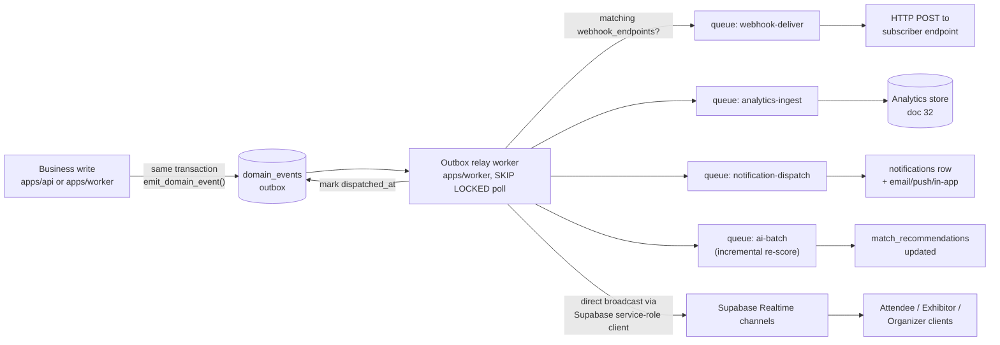

# Event Pipeline

This document owns the **transactional outbox pattern** that makes every meaningful state change in Concourse reliably observable outside the transaction that caused it: the `domain_events` table (schema, invariants, and the write-in-same-transaction discipline), the **outbox relay worker** that drains it, and the **complete catalog of domain event types** in canonical `noun.verb_past` form ([00-foundation.md](00-foundation.md) §11). It also specifies every fan-out consumer that subscribes to this stream — webhook delivery, analytics ingestion, notification triggers, AI re-scoring triggers, and realtime Supabase Realtime channel pushes — as the single place those five consumers' *inputs* are defined, even though each consumer's own internals are owned elsewhere. It does **not** own: column-level DDL beyond what §2 reproduces for reference (owned by [16-database-schema.md](16-database-schema.md) §8.10, the canonical source); webhook signing/retry mechanics or the public API surface for endpoints/deliveries (owned by [18-api-architecture.md](18-api-architecture.md) §9, which this document extends rather than restates); the analytics metric catalog and reports (owned by [32-analytics-architecture.md](32-analytics-architecture.md)); notification content, channels, and preferences (owned by [33-notification-system.md](33-notification-system.md)); Smart Matchmaking's scoring model (owned by [24-matchmaking-and-scoring.md](24-matchmaking-and-scoring.md) and [21-ai-architecture.md](21-ai-architecture.md) §3.2); or generic BullMQ queue/retry conventions for non-event queues (owned by [27-background-jobs-architecture.md](27-background-jobs-architecture.md)). All entity, persona, and vocabulary use below is canonical per [00-foundation.md](00-foundation.md).

## 1. Purpose & Scope

Concourse's product principle "one source of truth" ([00-foundation.md](00-foundation.md) §1) requires that every fact live in exactly one place. The moment a fact needs to *also* reach a webhook subscriber, an analytics store, a notification, an AI re-scoring job, or a live dashboard, a second system of record risks appearing by accident — a service that calls the notification API directly from inside a request handler, a Realtime broadcast call sitting next to a `leads` UPDATE, a webhook POST fired inline. Each of those is a small reliability bug waiting to happen: the write succeeds, the side-effect throws or the process dies, and the side-effect is silently lost with no way to know it happened. The **transactional outbox** pattern closes this gap: the side-effect *intent* (a row in `domain_events`) is written in the exact same database transaction as the business fact, so either both happen or neither does. Everything downstream — including every fan-out consumer this document specifies — reads from that durable, ordered, at-least-once stream instead of being called synchronously from request handlers.

## 2. The `domain_events` Outbox: Schema

Column-level DDL for `domain_events` is defined once, canonically, in [16-database-schema.md](16-database-schema.md) §8.10; it is reproduced here for reference because this document is where its behavior is specified.

| Column | Type | Notes |
|---|---|---|
| `id` | `uuid` | PK, UUIDv7 — time-ordered, doubles as the webhook/consumer dedupe key |
| `organization_id` | `uuid` | Scoping for fan-out filtering; `NULL` for platform-level events (none currently in the catalog, reserved for future platform-scope events) |
| `aggregate_type` | `text NOT NULL` | The owning entity, e.g. `'lead'`, `'booth_visit'`, `'event_exhibitor'` — one of the §7 entity names in [00-foundation.md](00-foundation.md) |
| `aggregate_id` | `uuid NOT NULL` | The row's own id in its owning table |
| `event_type` | `text NOT NULL` | `noun.verb_past`, drawn from the catalog in §5 |
| `payload` | `jsonb NOT NULL` | Event-specific minimal payload — see §2.1 for what belongs here vs. what does not |
| `occurred_at` | `timestamptz NOT NULL DEFAULT now()` | Commit-time of the writing transaction; the ordering key for relay and for consumer-side sequencing |
| `dispatched_at` | `timestamptz` | `NULL` = pending relay; set by the outbox relay worker (§4) once fan-out has been handed off |

**Constraints & indexes:** partial index `idx_domain_events_pending ON domain_events (occurred_at) WHERE dispatched_at IS NULL` backs the relay's poll query. **Grants:** no client-facing role (`app_tenant`) can read or write this table directly — access is either through the `SECURITY DEFINER` RPC in §3 (write path) or the `app_worker` role (relay/consumer read path), per [16-database-schema.md](16-database-schema.md) §8.10.

### 2.1 What goes in `payload`

**Decision:** `payload` holds the minimal, canonical, *point-in-time* fact needed to identify the change and drive routing/filtering decisions — ids, the field(s) that changed, and small scalars (status, score, actor). It deliberately does **not** hold a full serialized resource snapshot. Two reasons: (1) most consumers (notification triggers, AI re-scoring, realtime hints) only ever need ids and a status/delta, never the full object; (2) the one consumer that does want a full object — webhook delivery — explicitly wants it *fresh at delivery time*, not as it existed at write time, because retries can be hours later and a stale snapshot would misinform the subscriber ([18-api-architecture.md](18-api-architecture.md) §9.2's "snapshot at delivery time" language is intentional, not incidental). Webhook delivery is therefore the one consumer that re-serializes the live resource through its normal public-API DTO at send time; every other consumer reads straight off `payload`. This keeps the outbox row small (cheap to write inside every business transaction) and keeps "what does the resource look like right now" answerable in exactly one way — the resource's own table — never two.

## 3. Write-in-Same-Transaction Pattern

Every state-changing write that has a corresponding entry in the §5 catalog **must** emit its domain event inside the same Postgres transaction as the business write, or not emit it at all — there is no allowed third path (a post-commit "best effort" publish defeats the entire pattern).

**The grant problem, and its resolution.** [16-database-schema.md](16-database-schema.md) §8.10 restricts direct table grants on `domain_events` to `app_worker`; the request-scoped connections used by `apps/api` (and most of `apps/worker`'s command handlers) run as `app_tenant`, which cannot see this table at all. Rather than carve an exception into `app_tenant`'s grants — which would reopen the table to arbitrary reads/writes from request handlers and undermine the "only the relay touches this table directly" boundary — writers go through a `SECURITY DEFINER` RPC function, exactly the precedent [16-database-schema.md](16-database-schema.md) §8.9 already establishes for `audit_logs`' `record_audit_log(...)`. A `SECURITY DEFINER` function executes with its owner's privileges but **inside the caller's own transaction** — it is not a second transaction, so atomicity with the business write is preserved exactly.

```sql
-- migration: 00xx_domain_events_outbox.sql (concourse schema, alongside uuid_generate_v7)
CREATE FUNCTION concourse.emit_domain_event(
  p_organization_id uuid,
  p_aggregate_type   text,
  p_aggregate_id     uuid,
  p_event_type       text,
  p_payload          jsonb
) RETURNS uuid
LANGUAGE plpgsql
SECURITY DEFINER
SET search_path = public
AS $$
DECLARE v_id uuid;
BEGIN
  INSERT INTO domain_events (organization_id, aggregate_type, aggregate_id, event_type, payload)
  VALUES (p_organization_id, p_aggregate_type, p_aggregate_id, p_event_type, p_payload)
  RETURNING id INTO v_id;
  RETURN v_id;
END;
$$;

REVOKE ALL ON FUNCTION concourse.emit_domain_event FROM PUBLIC;
GRANT EXECUTE ON FUNCTION concourse.emit_domain_event(uuid, text, uuid, text, jsonb) TO app_tenant, app_worker;
```

A thin TypeScript wrapper in `packages/database` is the only call site application code uses:

```typescript
// packages/database/src/outbox.ts
export async function emitDomainEvent(
  tx: DrizzleTransaction,
  input: {
    organizationId: string | null;
    aggregateType: string;
    aggregateId: string;
    eventType: DomainEventType;   // union of every §5 event_type literal
    payload: Record<string, unknown>;
  },
): Promise<string> {
  const [{ id }] = await tx.execute(sql`
    SELECT concourse.emit_domain_event(
      ${input.organizationId}, ${input.aggregateType}, ${input.aggregateId},
      ${input.eventType}, ${JSON.stringify(input.payload)}::jsonb
    ) AS id
  `);
  return id;
}
```

Every service method that performs a §5 state transition calls it from inside its own `db.transaction(...)` block, after the business write, using the same `tx` handle:

```typescript
// apps/api/src/modules/engagement/leads.service.ts
async captureOrUpdateLead(cmd: CaptureLeadCommand) {
  return this.db.transaction(async (tx) => {
    const { lead, wasInserted } = await upsertLead(tx, cmd); // ON CONFLICT (event_exhibitor_id, registration_id)
    await emitDomainEvent(tx, {
      organizationId: cmd.exhibitorOrganizationId,
      aggregateType: 'lead',
      aggregateId: lead.id,
      eventType: wasInserted ? 'lead.captured' : 'lead.updated',
      payload: {
        leadId: lead.id, eventExhibitorId: lead.eventExhibitorId,
        registrationId: lead.registrationId, status: lead.status,
        score: lead.score, source: lead.source,
      },
    });
    return lead;
  });
}
```

If `upsertLead` throws, the transaction rolls back and no event exists — never a lead with no event. If `emitDomainEvent` throws (constraint violation, connection loss), the transaction rolls back and the lead write itself is undone — never an event with no underlying fact, and never a "committed write, lost event" gap. This is the entire value of the pattern; every consumer downstream inherits the guarantee "if `domain_events` says it happened, the business row backs it up" for free.

## 4. The Outbox Relay Worker

The relay runs inside `apps/worker` (Node 22 + BullMQ 5, per [00-foundation.md](00-foundation.md) §6) as `app_worker` — the only role with direct `SELECT`/`UPDATE` on `domain_events`. It is a small continuously-running poll loop, not a BullMQ job itself (a per-tick job would add queue overhead to a sub-second polling cadence for no benefit); it is safe to run **multiple replicas** for throughput and failover because claiming uses `FOR UPDATE SKIP LOCKED`.

```sql
-- one relay tick, inside a transaction held for the duration of the tick
WITH batch AS (
  SELECT id FROM domain_events
  WHERE dispatched_at IS NULL
  ORDER BY occurred_at
  LIMIT 200
  FOR UPDATE SKIP LOCKED
)
SELECT de.* FROM domain_events de JOIN batch USING (id);
-- … route each row per §6 …
UPDATE domain_events SET dispatched_at = now() WHERE id = ANY($claimedIds);
COMMIT;
```

**Cadence & sizing:** poll interval 500 ms when the previous batch was full (catch-up mode), backing off to 2 s when a batch comes back empty — config, not code, so incidents are tunable without a deploy (mirrors [18-api-architecture.md](18-api-architecture.md) §3.8's rate-limit philosophy). Batch size 200 is the same order of magnitude as the webhook/notification queue's own batching and keeps the `FOR UPDATE` lock window short.

**Routing:** for each claimed row, the relay looks up the static routing table in §6 (which consumer queues subscribe to which `event_type`s) and, for each match, enqueues a BullMQ job whose `jobId` is deterministic — `` `${consumerQueue}:${domainEventId}` `` — onto that consumer's queue. Deterministic job ids make re-enqueue after a crash-before-commit safe: BullMQ treats an add with an existing `jobId` as a no-op, so a relay crash between "jobs enqueued" and "`dispatched_at` committed" produces at most a harmless duplicate-add attempt on the next tick, never a duplicate job execution. Only after every matched consumer's job (or direct Realtime publish, §6.5) has been successfully handed off does the tick's transaction commit the `dispatched_at` update — if any hand-off throws, the whole tick rolls back and the batch is retried in full on the next poll, which is safe by the same deterministic-id argument.

**Ordering:** the relay drains in `occurred_at` order per tick, but two different consumer queues process independently and at different speeds, so **cross-consumer ordering is not guaranteed** (the same caveat [18-api-architecture.md](18-api-architecture.md) §9.5 already states for webhooks applies platform-wide). Within a single consumer's queue, BullMQ FIFO plus the relay's own ordered enqueue keeps same-aggregate events in commit order under normal operation; retries can still reorder relative to newer events for the same aggregate, so every consumer is written to be commutative on `status`-style fields (last-write-wins by re-reading current state) rather than assuming strict sequencing.

## 5. Domain Event Type Catalog

Every event type is `noun.verb_past` per [00-foundation.md](00-foundation.md) §11. `aggregate_type` matches the singular form of the owning entity name from [00-foundation.md](00-foundation.md) §7 (the same singularization [29-audit-logging-architecture.md](29-audit-logging-architecture.md) §4 uses for `resource_type`). This catalog consolidates every event name already in ad hoc use across [18-api-architecture.md](18-api-architecture.md) §7.3/§9 and [09-functional-requirements.md](09-functional-requirements.md)'s state-machine emissions, extends it with the additional events those same state machines imply but had not yet named, and registers the file-domain events [26-file-storage.md](26-file-storage.md) §10 already defers to this catalog — [18-api-architecture.md](18-api-architecture.md) §9.1 explicitly anticipates this growth ("registry grows with doc 25").

### 5.1 Event lifecycle (aggregate: `event`)

| Event type | Emitted when ([09-functional-requirements.md](09-functional-requirements.md) §3.1) | Payload |
|---|---|---|
| `event.created` | `[*] → draft` (FR-EVENT-001) | `{ eventId, organizationId, slug, status }` |
| `event.published` | `draft → published` (FR-EVENT-005) | `{ eventId, organizationId, slug, status, publishedAt }` |
| `event.went_live` | `published → live` (FR-EVENT-007) | `{ eventId, organizationId, liveStartedAt }` |
| `event.completed` | `live → completed` (FR-EVENT-008) | `{ eventId, organizationId, completedAt }` |
| `event.archived` | `completed → archived`, or `draft → archived` cancel (FR-EVENT-009) | `{ eventId, organizationId, archivedAt, reason: 'retention' \| 'cancelled' }` |

### 5.2 Floor & booths (aggregate: `booth`)

| Event type | Emitted when | Payload |
|---|---|---|
| `booth.assigned` | `booths.event_exhibitor_id` set from `NULL` (FR-FLOOR-003) | `{ boothId, eventId, floorPlanId, eventExhibitorId, boothNumber }` |
| `booth.reassigned` | `booths.event_exhibitor_id` changed from one exhibitor to another (FR-FLOOR-003) | `{ boothId, eventId, floorPlanId, eventExhibitorId, previousEventExhibitorId, boothNumber }` |
| `booth.unassigned` | `booths.event_exhibitor_id` cleared to `NULL` (FR-FLOOR-003, or cascaded from `event_exhibitor.withdrawn` §3.2) | `{ boothId, eventId, floorPlanId, previousEventExhibitorId, boothNumber }` |

**Decision — three event types instead of one generic `booth.assigned`:** FR-FLOOR-003 itself describes a single write path (`PATCH` on the booth's `event_exhibitor_id`) and does not name a domain event. [29-audit-logging-architecture.md](29-audit-logging-architecture.md) §6.3 independently arrived at a three-way `booth.assigned`/`.reassigned`/`.unassigned` split for its own `audit_logs.action` taxonomy on this exact write path, and its §5 write-path diagram shows the same distinction flowing into the `domain_events` insert emitted in the same transaction. Rather than let the audit registry (which [29-audit-logging-architecture.md](29-audit-logging-architecture.md) §4 explicitly documents as independently maintained from this catalog) and this one silently diverge on the same fact, this catalog adopts the identical three-way split — it is also the more useful shape for the §6.3 notification consumer, whose audience and copy genuinely differ between "you were assigned a booth," "your booth changed," and "your booth was removed."

### 5.3 Exhibitor participation funnel (aggregate: `event_exhibitor`)

Funnel states follow the transition authority of [09-functional-requirements.md](09-functional-requirements.md) §3.2 (`invited → accepted → profile_complete → ready`, with `withdrawn` reachable from any non-terminal state).

| Event type | Emitted when | Payload |
|---|---|---|
| `event_exhibitor.invited` | `[*] → invited` (FR-ONBOARD-002) | `{ eventExhibitorId, eventId, organizationId: null, status: 'invited', invitedAt }` — `organizationId` is `null` until claimed; no exhibitor org exists yet |
| `event_exhibitor.accepted` | `invited → accepted` (FR-ONBOARD-003) | `{ eventExhibitorId, eventId, organizationId, status: 'accepted', claimedAt }` |
| `event_exhibitor.profile_completed` | `accepted → profile_complete` (§3.2) | `{ eventExhibitorId, eventId, organizationId, status: 'profile_complete' }` |
| `event_exhibitor.ready` | `profile_complete → ready` (§3.2) | `{ eventExhibitorId, eventId, organizationId, status: 'ready', boothId }` |
| `event_exhibitor.withdrawn` | `* → withdrawn` (§3.2) | `{ eventExhibitorId, eventId, organizationId, status: 'withdrawn', previousStatus }` |
| `event_exhibitor.flagged` | `event:staff` marks content under review (FR-ONBOARD-008) | `{ eventExhibitorId, eventId, organizationId, profileStatus: 'pending_review', reason }` — FR-ONBOARD-008's prose ("marks profile content `under_review`") describes the same transition [16-database-schema.md](16-database-schema.md) §5.1's actual `profile_status` `CHECK` constraint names `pending_review`; this payload uses the literal enum value, since a payload field must be a value a consumer can compare against the real column |
| `event_exhibitor.updated` | Any other field write not covered above — profile edits (FR-ONBOARD-005), organizer-side contact/tier edits (FR-ONBOARD-004) | `{ eventExhibitorId, eventId, organizationId, changedFields: string[] }` |

### 5.4 Registration & agenda (aggregates: `registration`, `session_checkin`, `attendee_interest`)

Status vocabulary follows [00-foundation.md](00-foundation.md) §7 / [09-functional-requirements.md](09-functional-requirements.md) §3.5 (`registered | checked_in | cancelled`).

| Event type | Emitted when | Payload |
|---|---|---|
| `registration.created` | `[*] → registered` (FR-REG-001) | `{ registrationId, eventId, userId, status: 'registered', badgeCode }` |
| `registration.checked_in` | `registered → checked_in` (FR-REG-004) | `{ registrationId, eventId, checkedInAt, source: 'staff_scan' \| 'self_scan' }` |
| `registration.cancelled` | `registered/checked_in → cancelled` (§3.5) | `{ registrationId, eventId, cancelledAt, reason: 'attendee' \| 'organizer_correction' }` |
| `registration.reactivated` | `cancelled → registered` (§3.5, re-registration) | `{ registrationId, eventId }` |
| `session_checkin.recorded` | Door scan writes `session_checkins` (FR-AGENDA-003) | `{ sessionCheckinId, agendaSessionId, registrationId, eventId, source: 'staff_scan' \| 'self_scan' }` |
| `attendee_interests.updated` | Declared interests replaced via `PUT` ([18-api-architecture.md](18-api-architecture.md) §5.7), or inferred tags recomputed from behavior (FR-MATCH-001) | `{ registrationId, eventId, kind: 'declared' \| 'inferred', tags: string[] }` |

### 5.5 Booth visits & lead pipeline (aggregates: `booth_visit`, `lead`)

Lead status follows [16-database-schema.md](16-database-schema.md) §6.6's `status` column (`captured | qualified | contacted | meeting_booked | closed | disqualified`).

| Event type | Emitted when | Payload |
|---|---|---|
| `booth_visit.recorded` | Every scan/dwell write, offline-tolerant (FR-LEAD-001/002) | `{ boothVisitId, boothId, eventExhibitorId, registrationId, eventId, source: 'badge_scan' \| 'self_scan' \| 'dwell', capturedAt }` |
| `lead.captured` | First upsert on `(event_exhibitor_id, registration_id)` (FR-LEAD-003, §3.3) | `{ leadId, eventExhibitorId, registrationId, boothVisitId, status: 'captured', source }` |
| `lead.updated` | Any subsequent field/status write that is not a capture, reopen, or merge — stage advances (`qualified`/`contacted`/`meeting_booked`/`closed`/`disqualified`), score changes, note/qualifier writes, reassignment (FR-LEAD-008) | `{ leadId, eventExhibitorId, registrationId, status, previousStatus, score, ownerUserId }` |
| `lead.reopened` | Terminal `closed`/`disqualified` → `contacted` with explicit rep confirmation (§3.3) | `{ leadId, eventExhibitorId, registrationId, status: 'contacted', previousStatus, reopenedByUserId }` |
| `lead.merged` | Duplicate-lead merge confirmed by an admin (FR-LEAD-010) | `{ survivorLeadId, mergedLeadId, eventExhibitorId }` |

**Decision — why `lead.updated` is generic rather than one event per stage:** [18-api-architecture.md](18-api-architecture.md) §9.1 already established `lead.updated` as a single subscribable webhook type covering all stage transitions except capture. Splitting it into `lead.qualified`/`lead.contacted`/… would multiply the catalog for no consumer that currently needs the distinction at the event-type level — every consumer that cares about the specific stage reads it off `payload.status`. `lead.reopened` and `lead.merged` are the two exceptions because [09-functional-requirements.md](09-functional-requirements.md) explicitly calls them out as never-silent, always-notified transitions (foundation principle 2, "intelligence over records") that deserve their own name for filtering (e.g., a webhook subscriber wanting reopen/merge alerts without diffing every `lead.updated` payload).

### 5.6 Meetings (aggregate: `meeting`)

Status vocabulary follows [16-database-schema.md](16-database-schema.md) §6.8's canonical six-value enum (`requested | confirmed | completed | declined | cancelled | no_show`).

| Event type | Emitted when | Payload |
|---|---|---|
| `meeting.scheduled` | `[*] → requested` (FR-MEETING-002) | `{ meetingId, eventExhibitorId, registrationId, attendeeUserId, status: 'requested', startsAt, endsAt, requestedBy: 'exhibitor' \| 'attendee' }` |
| `meeting.updated` | `requested → confirmed`, `* → declined`, `confirmed → completed`, `confirmed → no_show` (FR-MEETING-003/005) | `{ meetingId, eventExhibitorId, registrationId, attendeeUserId, status, previousStatus, actor: 'exhibitor' \| 'attendee' }` |
| `meeting.cancelled` | `requested/confirmed → cancelled` (FR-MEETING-003/005) | `{ meetingId, cancelledBy: 'exhibitor' \| 'attendee', reason }` |

**Decision — naming `meeting.scheduled` rather than `meeting.requested`:** [18-api-architecture.md](18-api-architecture.md) §9.1 already lists `meeting.scheduled` as a subscribable webhook type for meeting creation; this document keeps that name rather than introducing a competing `meeting.requested` that would read more literally against the `requested` status value. "Scheduled" is understood externally as "a meeting now exists on the calendar, pending confirmation," which is exactly what creation means here, and a webhook subscriber's integration code (already written against the Locked doc's name) does not need to change when this catalog is finalized.

**Reconciling "`meeting.declined` domain event" in [09-functional-requirements.md](09-functional-requirements.md) §3.4:** that document's prose, when describing the `confirmed → declined` cancellation path, refers informally to "the emitted `meeting.declined` domain event's actor field." [18-api-architecture.md](18-api-architecture.md) §9.1's Locked webhook registry enumerates exactly `meeting.scheduled` and `meeting.updated` for this aggregate — no `meeting.declined` — and per this document's own rule (§2.1, whole catalog is webhook-subscribable), a genuinely distinct `meeting.declined` event type would necessarily have appeared there too. This catalog therefore treats 09's phrase as shorthand for "the `meeting.updated` event whose payload carries `status: 'declined'`," not a sixth event type; the `actor` field 09 refers to is exactly the `actor` key already in `meeting.updated`'s payload above.

### 5.7 Files (aggregate: `file`)

[26-file-storage.md](26-file-storage.md) §10 owns AV scanning, quarantine, and retention mechanics end-to-end and explicitly registers its three domain events into this catalog rather than restating outbox mechanics itself — the same "register here, own the mechanism there" split this document uses for webhook/analytics/notification internals.

| Event type | Emitted when | Payload |
|---|---|---|
| `file.scan_completed` | `files.status → clean` | `{ fileId, organizationId, ownerType, ownerId, purpose }` |
| `file.quarantined` | `files.status → infected`, object moved to quarantine prefix ([26-file-storage.md](26-file-storage.md) §6.4) | `{ fileId, organizationId, ownerType, ownerId, purpose, uploadedByUserId }` |
| `file.purged` | Retention sweep or DSAR erasure hard-deletes the row ([26-file-storage.md](26-file-storage.md) §9.3–9.4) | `{ fileId, organizationId, ownerType, ownerId }` |

`organization_id` is `NULL` for platform-level assets (help article images, etc., [16-database-schema.md](16-database-schema.md) §8.1); per §6.1's rule below, those rows are simply not webhook-subscribable, same as any other `NULL`-org event.

## 6. Fan-Out Consumers

Every consumer below is driven exclusively by the relay's routing table — none of them poll `domain_events` directly or call each other; they are siblings, not a chain.



This extends the webhook-only flow already drawn in [18-api-architecture.md](18-api-architecture.md) §9 — that diagram is the zoomed-in view of the `WHQ → WHE` branch above (its `webhook_deliveries` state machine, HMAC signing, and 7-attempt backoff are unchanged and not repeated here).

### 6.1 Webhook delivery

Owned end-to-end by [18-api-architecture.md](18-api-architecture.md) §9; this document's contribution is the input contract. **Rule:** every event type in §5 whose `organization_id` is non-null is webhook-subscribable — an `event_exhibitor` running organizer-side enterprise integrations may reasonably want any of them, so the subscribable set is the whole catalog, not a hand-picked subset. For each claimed row, the relay queries `webhook_endpoints WHERE organization_id = $orgId AND status = 'active' AND event_types @> ARRAY[$eventType]`; each match enqueues one `webhook-deliver` job. The job handler — not the relay — re-serializes the current resource through its normal public-API DTO (never the outbox `payload`, per §2.1) into the envelope `{ id, type, occurred_at, api_version, data: { object } }` and inserts the `webhook_deliveries` row with `domain_event_id` set to the outbox row's id, which is also the delivery's dedupe key for the receiving side.

### 6.2 Analytics ingestion

Interior detail (metric catalog, dashboards, exports) is owned by [32-analytics-architecture.md](32-analytics-architecture.md); this document's contribution is the feed. **Rule:** every claimed row, with no filtering, enqueues one `analytics-ingest` job — the event pipeline's obligation is a complete, ordered-by-`occurred_at`, deduplicated (by `domain_events.id`) fact stream, not a curated subset. The job handler translates each domain event into the analytics-facing taxonomy, which is deliberately a *different* naming convention (`surface.object_action`, [00-foundation.md](00-foundation.md) §11) from the system-of-record `noun.verb_past` used here — the two serve different audiences (engineers debugging state transitions vs. product analytics on user behavior) and collapsing them into one name would force every schema change to fight both purposes at once.

| Domain event | Analytics event ([00-foundation.md](00-foundation.md) §11 convention) |
|---|---|
| `registration.checked_in` | `attendee.badge_checked_in` |
| `booth_visit.recorded` | `attendee.booth_visited` |
| `lead.captured` | `exhibitor.lead_captured` |
| `meeting.scheduled` | `attendee.meeting_requested` |
| `event.completed` | `organizer.event_completed` |

The full translation table (all 31 event types) and every derived metric live in doc 32; PostHog ([00-foundation.md](00-foundation.md) §6) is the delivery target for product-analytics events. The `analytics-ingest` job handler also carries a second, narrower responsibility: for exactly the four event types [16-database-schema.md](16-database-schema.md) §10.1 names as QCE's own inputs (`lead.updated`, `meeting.updated`, `booth_visit.recorded`, `registration.checked_in`), the handler additionally upserts `event_qualified_connections`/`event_qce_summary` in the same job — doc 16 §10.1's "a worker consumer reacts to the domain events already flowing through the outbox" is this handler, not a separate queue, since [27-background-jobs-architecture.md](27-background-jobs-architecture.md) §5's queue catalog has no dedicated QCE queue. One stream, two downstream materializations (PostHog + QCE), per principle P3 — never a second subscription to the outbox for the same fact.

### 6.3 Notification triggers

Content, channels, templates, and preferences are owned by [33-notification-system.md](33-notification-system.md); this document's contribution is which events trigger a notification and who the audience is. **Rule:** unlike analytics, this is a filtered subset — only events with a real human audience and action enqueue a `notification-dispatch` job (the canonical queue name already fixed in [00-foundation.md](00-foundation.md) §11's naming-conventions example).

| Domain event | Audience | Notes |
|---|---|---|
| `event_exhibitor.invited` | Invited contact | Transactional email with the invite token ([19-authentication-strategy.md](19-authentication-strategy.md) §6) |
| `event_exhibitor.withdrawn` | Organizer staff; attendees who saved the exhibitor | §3.2's "attendees who saved the exhibitor notified" |
| `booth.assigned` | Exhibitor staff; attendees who saved the exhibitor | On a `published`+ event only (FR-FLOOR-003) |
| `registration.created` | The registrant | Badge-claim email ([19-authentication-strategy.md](19-authentication-strategy.md) §5.5) |
| `meeting.scheduled` | The non-initiating party | "New meeting request" |
| `meeting.updated` | Both parties | Confirm/decline/complete; `confirmed` additionally schedules the `.ics` + reminder jobs (FR-MEETING-004) |
| `lead.updated` (score crosses configured threshold) | Assigned rep (Jamal) | FR-LEADINTEL-004's push alert; the notification handler inspects `payload.score` against the exhibitor's configured threshold rather than a dedicated event type, since the underlying fact is still "a lead was updated" |
| `event.completed` | Organizer admins (Priya) | Unlocks ROI reports; also the trigger for Follow-up Studio (§6.4-adjacent, but Follow-up Studio subscribes directly per §3.4.1 of [21-ai-architecture.md](21-ai-architecture.md), not through the notification consumer) |
| `file.quarantined` | Uploading user | [26-file-storage.md](26-file-storage.md) §10's "uploader alert" — the one file-domain event with a real human audience; `file.scan_completed`/`file.purged` are consumed only by other services (§5.7), never a notification |
| `booth.unassigned` | Exhibitor staff; attendees who saved the exhibitor | Same audience/rationale as `event_exhibitor.withdrawn` above, for the narrower "booth only" case (e.g. reassigned to another exhibitor without the exhibitor itself withdrawing) |

Notification category strings (`notifications.category`, [16-database-schema.md](16-database-schema.md) §8.2) are assigned per event type by doc 33's taxonomy; this table fixes only the trigger-to-audience mapping.

### 6.4 AI re-scoring triggers

Owned by [21-ai-architecture.md](21-ai-architecture.md) §3.2, which names the trigger set explicitly: **`booth_visit.recorded`, `attendee_interests.updated`, `session_checkin.recorded`** enqueue an incremental Smart Matchmaking re-score on queue `ai-batch`, scoped to the single `(registration_id, event_exhibitor_id)` pair or `registration_id`'s whole interest profile that changed — not a full nightly re-run. No other event type in the catalog feeds this consumer; lead-pipeline and meeting events do not, because matchmaking scores the attendee's *interest signal*, not an exhibitor's pipeline state.

**Decision — debounce window:** a busy booth can emit `booth_visit.recorded` at up to the 1,200 req/min scan-ingestion rate ([18-api-architecture.md](18-api-architecture.md) §3.8), which would otherwise storm the re-score queue with redundant work for the same registration within seconds of itself. The `ai-batch` consumer coalesces same-`registration_id` triggers with a 30-second debounce (last-trigger-wins, re-scoring once per window) before invoking the scoring pipeline — a pure throughput optimization that never changes *which* events fire, only how the consumer batches its own work, so it does not appear as a separate event type.

### 6.5 Realtime Supabase Realtime channel pushes

Channels and authorization are owned by [18-api-architecture.md](18-api-architecture.md) §7; that document's §7.3 table is the base mapping and already anticipates growth from this doc, exactly as its §9.1 webhook registry does. Four of §7.3's rows (`notification.created`, `event.dashboard_tick`, `job.updated`, `session.revoked`) are **not** sourced from `domain_events` — they are ephemeral, non-outbox pushes published directly by their owning module via the same Supabase Realtime service-role broadcast mechanism (`NotificationsModule` after its own insert, a 5-second worker tick, job-progress updates, and session revocation respectively) and are out of this document's scope. The rows sourced from the outbox are:

| Domain event | Channel | Payload pushed |
|---|---|---|
| `lead.captured` | `event_exhibitor:{id}` | `{ leadId, boothId, score? }` — client re-fetches the list (already in [18-api-architecture.md](18-api-architecture.md) §7.3) |
| `booth_visit.recorded` | `booth:{boothId}` | Counter increment for `ent:booth_analytics` live dashboards (already in §7.3) |
| `meeting.updated` | `user:{userId}` (both parties) | `{ meetingId, status }` (already in §7.3) |
| `registration.checked_in` | `event:{eventId}:ops` | `{ registrationId }` — organizer live check-in counter (extends §7.3) |
| `event_exhibitor.withdrawn` | `event:{eventId}` | `{ eventExhibitorId }` — attendee map/directory removes the booth live (extends §7.3) |
| `booth.assigned` / `booth.reassigned` | `event:{eventId}` | `{ boothId, eventExhibitorId }` — attendee map reflects a new or changed assignment live (extends §7.3) |

**Mechanism:** the relay worker does not hold a live realtime connection of its own — there is no dedicated realtime gateway process at all (per [18-api-architecture.md](18-api-architecture.md) §7.1) — so it publishes a Broadcast message directly to the relevant Supabase Realtime channel using the Supabase **service-role client**, called directly from the worker process: Supabase Realtime is an externally-hosted, managed service both `apps/api` and `apps/worker` can reach directly with the appropriate credentials, so this preserves the same "no HTTP hop between `apps/worker` and `apps/api`" property the prior design had, just via a different mechanism. Consistent with §7.3's "thin invalidation hints" design, these pushes are fire-and-forget: if a client is disconnected when published, it re-fetches on reconnect rather than replaying a missed push.

## 7. Delivery Guarantees, Ordering & Idempotency

- **At-least-once, everywhere.** No consumer in §6 is exactly-once; every one of them is written to be safe under redelivery. Webhook delivery dedupes on the envelope `id` (§6.1, unchanged from [18-api-architecture.md](18-api-architecture.md) §9.5); analytics ingestion dedupes on `domain_events.id`; notification dispatch is naturally idempotent per notification row (re-sending the same email twice is a UX nuisance, not a correctness bug, and is bounded by BullMQ's own job-level dedupe via the deterministic `jobId` from §4); AI re-scoring is idempotent by construction (`match_recommendations` has `UNIQUE (event_exhibitor_id, registration_id)`, so a redundant re-score is a harmless overwrite); realtime pushes are advisory hints a client re-fetches behind, so redelivery is invisible to the user.
- **No cross-consumer ordering.** As stated in §4, only same-consumer, same-aggregate ordering is a soft guarantee under normal operation. A subscriber or internal consumer that needs to reconstruct a strict history reads `occurred_at` off the payload (present on the row itself, forwarded into every job) and orders client-side — the same discipline [18-api-architecture.md](18-api-architecture.md) §9.5 already documents for webhooks, generalized to every consumer here.
- **The outbox is not a queryable event log for users.** Per [16-database-schema.md](16-database-schema.md) §8.10, `domain_events` is reachable only by `app_worker` and, read-only, by Platform Admin's pipeline-health view via `app_platform`. Any UI-facing "activity feed" (e.g., a lead's timeline) is built from the owning tables (`lead_notes`, `booth_visits`) directly, never from replaying the outbox — the outbox is plumbing, not a second source of truth for product surfaces (principle P3).

## 8. Failure Handling & Observability

- **Relay-internal failures** (a hand-off to §6 throws) roll back the whole tick per §4; the affected rows remain `dispatched_at IS NULL` and are retried on the next poll with no special-cased dead-letter path at the relay level — the relay itself never gives up on a row, because giving up on an outbox row means silently losing a fact, which no failure mode in this system is allowed to do.
- **Consumer-internal failures** are each consumer's own BullMQ job retry policy (exponential backoff + jitter, generic conventions owned by [27-background-jobs-architecture.md](27-background-jobs-architecture.md)), except webhook delivery's 7-attempt/24h schedule, which is specific enough to warrant its own spec in [18-api-architecture.md](18-api-architecture.md) §9.5 and is not duplicated here. A consumer job that exhausts its retries surfaces per that consumer's own failure UX (webhook → `dead` delivery + admin notification; notification → bounce logged per FR-NOTIF-001; analytics/AI-rescore → alerted via the metrics below, since they have no per-tenant "failed" surface to show).
- **Metrics** (dashboards/alerting owned by [31-observability.md](31-observability.md), emitted here): `outbox_pending_count` (gauge, `SELECT count(*) WHERE dispatched_at IS NULL`, the direct signal of relay health), `outbox_relay_lag_seconds` (histogram, `dispatched_at - occurred_at` per row at hand-off), `outbox_relay_batch_size` (histogram, per tick), `outbox_consumer_enqueue_failures_total{consumer}` (counter). **SLO alert:** `outbox_pending_count` sustained above 5,000 for 5 minutes, or `outbox_relay_lag_seconds` p95 above 10 s for 5 minutes — both indicate the relay is falling behind write volume and pages on-call before any consumer-visible staleness accumulates.

## 9. Key Decisions

| # | Decision | Rationale |
|---|---|---|
| V1 | Writers use a `SECURITY DEFINER` RPC (`concourse.emit_domain_event`) rather than a direct grant on `domain_events` for `app_tenant` | Preserves [16-database-schema.md](16-database-schema.md) §8.10's "no client-facing role touches this table" boundary while keeping the write in the same transaction; mirrors the existing `record_audit_log` precedent (§8.9) |
| V2 | `domain_events.payload` is minimal (ids + deltas), never a full resource snapshot | Only webhook delivery needs the full object, and it needs it *fresh at delivery time*, not as of write time (§2.1) |
| V3 | `lead.updated`/`meeting.updated` are generic across most stage transitions rather than one event type per stage | Matches the webhook registry already Locked in [18-api-architecture.md](18-api-architecture.md) §9.1; consumers filter on `payload.status`; `lead.reopened`/`lead.merged` are named exceptions because foundation principle 2 requires them to be never-silent |
| V4 | AI re-score triggers are exactly the three event types named in [21-ai-architecture.md](21-ai-architecture.md) §3.2, with a 30 s per-registration debounce in the consumer | Keeps the trigger set authoritative to its own owning doc; debounce absorbs booth-scan burst volume without adding a new event type |
| V5 | Realtime fan-out publishes directly via the Supabase Realtime service-role client rather than routing through an HTTP call to `apps/api` | There is no realtime gateway process of any kind to route through ([18-api-architecture.md](18-api-architecture.md) §7.1); Supabase Realtime is a managed external service both `apps/api` and `apps/worker` can reach directly with the appropriate credentials, so no intermediary hop is needed |
| V6 | Analytics ingestion receives the unfiltered full catalog; notification dispatch receives a curated subset | Analytics' job is comprehensive fact capture; notifications exist only where a human has something to see or do — sending one for every `event_exhibitor.updated` would be noise, not intelligence (foundation principle 2) |
| V7 | Booth assignment is three event types (`booth.assigned`/`.reassigned`/`.unassigned`), not one generic `booth.assigned` | Reconciles with [29-audit-logging-architecture.md](29-audit-logging-architecture.md) §6.3's independently-arrived-at three-way `audit_logs.action` split for the same write path (§5.2), and gives the notification consumer the audience/copy distinction it actually needs |
| V8 | File-domain events (`file.scan_completed`/`.quarantined`/`.purged`) are registered into this catalog rather than left to [26-file-storage.md](26-file-storage.md) alone | [26-file-storage.md](26-file-storage.md) §10 explicitly defers "outbox/fan-out mechanics" to this document and only registers its event names — the same registration discipline foundation §14 established for A1/A2 |
| V9 | `meeting.declined` (informally named in [09-functional-requirements.md](09-functional-requirements.md) §3.4) is treated as `meeting.updated` with `payload.status = 'declined'`, not a sixth event type | [18-api-architecture.md](18-api-architecture.md) §9.1's Locked webhook registry has no `meeting.declined`; per this catalog's own rule that the whole catalog is webhook-subscribable, a real distinct event type would have to appear there |

## 10. Ownership / Related Documents

| Detail | Owned by |
|---|---|
| This document | `domain_events` behavior (write pattern, relay, catalog), and the *input contract* for all five fan-out consumers |
| Column-level `domain_events`/`webhook_deliveries`/`notifications` DDL | [16-database-schema.md](16-database-schema.md) §8 |
| Webhook signing, retry schedule, DLQ, public API surface for endpoints/deliveries | [18-api-architecture.md](18-api-architecture.md) §9, §5.13 |
| Supabase Realtime channels, RLS-based authorization, non-outbox pushes | [18-api-architecture.md](18-api-architecture.md) §7 |
| Analytics metric catalog, dashboards, exports, `surface.object_action` taxonomy, QCE-adjacent reporting | [32-analytics-architecture.md](32-analytics-architecture.md) |
| Notification content, channels, templates, preferences, category taxonomy | [33-notification-system.md](33-notification-system.md) |
| Smart Matchmaking scoring model, weights, golden-set tuning | [24-matchmaking-and-scoring.md](24-matchmaking-and-scoring.md), [21-ai-architecture.md](21-ai-architecture.md) §3.2 |
| Generic BullMQ queue catalog, retry/backoff conventions, worker deployable topology | [27-background-jobs-architecture.md](27-background-jobs-architecture.md) |
| File upload, AV scanning, quarantine, and retention mechanics behind the §5.7 events | [26-file-storage.md](26-file-storage.md) |
| `audit_logs` action taxonomy — an independent registry that may name the same fact differently (§5.2) | [29-audit-logging-architecture.md](29-audit-logging-architecture.md) |
| Qualified Connections per Event fact table and summary rollup fed by §6.2 | [16-database-schema.md](16-database-schema.md) §10 |
| Machine-readable error codes referenced by any consumer's failure path | [41-error-code-registry.md](41-error-code-registry.md) |
| State machines whose transitions this catalog's events are emitted from | [09-functional-requirements.md](09-functional-requirements.md) §3 |
| OTel dashboards/alert routing for the metrics in §8 | [31-observability.md](31-observability.md) |
