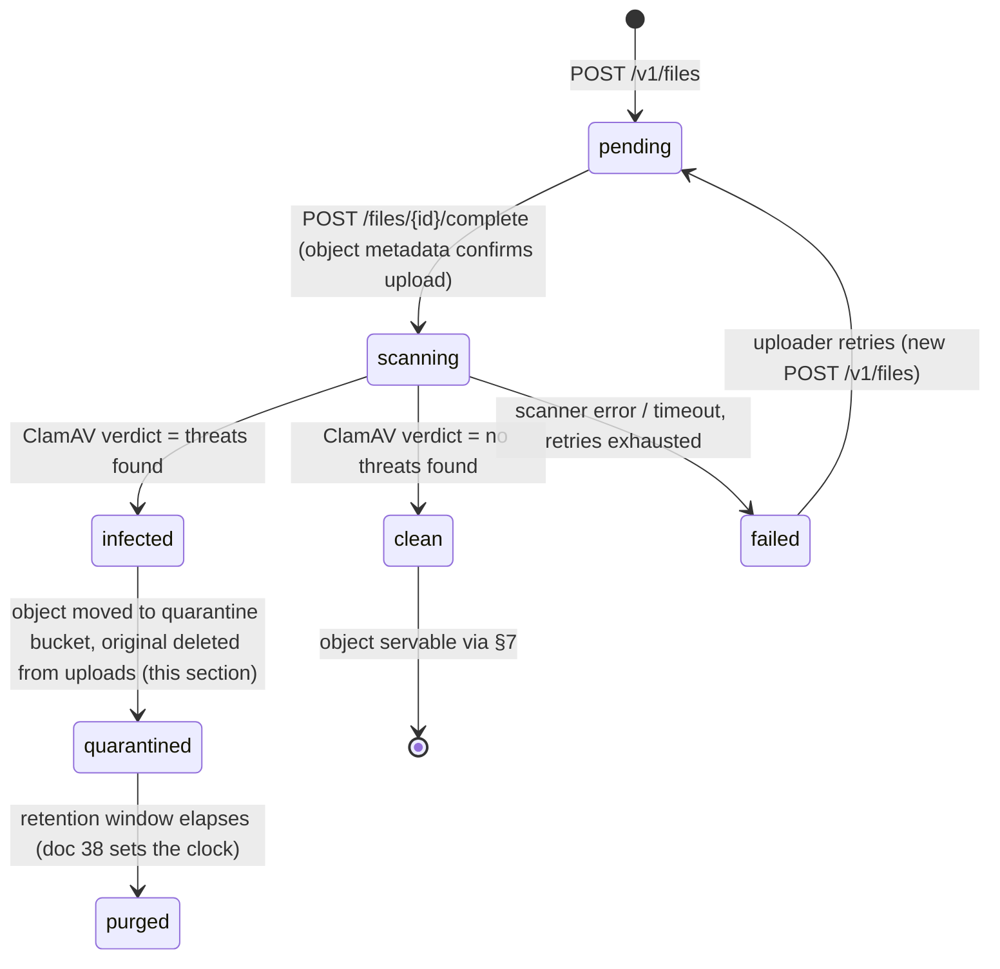

# File Storage

This document specifies how Concourse stores, validates, scans, serves, and eventually purges every binary asset in the platform: the `files` entity end-to-end, on **Supabase Storage** ([00-foundation.md](00-foundation.md) §6, §14 Amendment A5). It owns the signed-upload contract behind `POST /v1/files` and `POST /v1/files/{id}/complete` ([18-api-architecture.md](18-api-architecture.md) §5.11), the tenant-prefixed storage path layout, the private-bucket-plus-signed-URL delivery mechanics, the antivirus (AV) scanning pipeline and its status states, per-purpose content-type/size validation rules, and the *mechanism* that enforces file retention and deletion. It does **not** own: column-level DDL and RLS for the `files` table (that is [16-database-schema.md](16-database-schema.md) §8.1 — this doc treats those columns as given and builds the storage mechanics around them), *how long* any given asset is kept or *when* a DSAR erasure fires a purge (that policy belongs entirely to [38-data-retention-privacy-compliance.md](38-data-retention-privacy-compliance.md) — this doc owns only the engine that executes whatever schedule 38 sets), BullMQ queue/retry/backoff conventions in general (owned by [27-background-jobs-architecture.md](27-background-jobs-architecture.md) — this doc defines what the file-related queues do, not how the worker deployable runs them), the role→permission matrix (owned by [28-permission-model.md](28-permission-model.md)), and the content-moderation/prompt-injection screening that runs on `kb_documents` *after* ingestion (owned by [21-ai-architecture.md](21-ai-architecture.md) §7 and [23-knowledge-base-architecture.md](23-knowledge-base-architecture.md) — a file being AV-clean is a precondition for that pipeline, not a substitute for it).

This is a mechanism rewrite only. [00-foundation.md](00-foundation.md) §14 Amendment A5 replaced the platform's S3 + CloudFront + Amazon GuardDuty Malware Protection choice with Supabase Storage; every business rule, state machine, and security principle this document specified against S3 is preserved unchanged below — only the primitives that implement them differ, and each such difference is called out with its reason. The `files` table itself ([16-database-schema.md](16-database-schema.md) §8.1: `status` enum `pending`/`scanning`/`clean`/`infected`/`failed`, `owner_type`/`owner_id`, `purpose`, `storage_key`, and the rest) is unchanged and is not re-specified here — this document only describes how the new mechanism populates and reads those existing columns.

---

## 1. Scope and Ownership

| This doc owns | Owned elsewhere |
|---|---|
| Signed-upload contract, Supabase Storage path structure, signed-download delivery | Route/permission/error shapes for `/v1/files*` → [18-api-architecture.md](18-api-architecture.md) §5.11 |
| `files` row lifecycle *mechanics* (status transitions, linkage) | Column DDL, indexes, RLS predicate → [16-database-schema.md](16-database-schema.md) §8.1 |
| AV scanning pipeline, quarantine handling | Queue scheduling/retry conventions in general → [27-background-jobs-architecture.md](27-background-jobs-architecture.md) |
| Per-purpose content-type/size allowlists | Which permission gates each purpose (definitive matrix) → [28-permission-model.md](28-permission-model.md) |
| Purge/lifecycle *mechanism* (what runs, on what trigger) | Retention *durations*, DSAR/erasure triggers, legal basis → [38-data-retention-privacy-compliance.md](38-data-retention-privacy-compliance.md) |
| Floor-plan underlay upload as a storage transaction | Floor-plan editing UX, calibration, re-anchor flow → [05-organizer-journey.md](05-organizer-journey.md) O-3 |
| Voice-note audio upload as a storage transaction | Offline queueing, transcription trigger, lead-note attachment → [06-exhibitor-journey.md](06-exhibitor-journey.md) §6.2 |
| Precondition gate ("file must be `clean`") for KB ingestion | Chunking, embedding, quarantine-for-content-reasons → [23-knowledge-base-architecture.md](23-knowledge-base-architecture.md), [21-ai-architecture.md](21-ai-architecture.md) §7 |
| Encryption-at-rest/in-transit mechanics for stored objects (as delivered by the managed platform) | Overall threat model, secrets management, compliance posture → [43-security-architecture.md](43-security-architecture.md) |

Consistent with [00-foundation.md](00-foundation.md) §6: **Supabase Storage, signed uploads, tenant-prefixed paths.**

## 2. Storage Topology

| Component | Choice | Notes |
|---|---|---|
| Upload/asset bucket | `uploads` (Supabase Storage, one bucket per environment project: `dev`/`staging`/`prod`) | **Decision — one bucket, path-prefixed, per environment; not one bucket per purpose or per tenant.** Supabase Storage documents buckets as the coarse-grained container a small number of top-level policies attach to, with fine-grained access control expected to live in RLS policies keyed off object path (`name`) within the bucket — the opposite division of labor from S3, where the bucket itself was often the unit of policy. A single `uploads` bucket per environment, carrying the same `{keyPrefix}/{purpose}/{fileId}/{sanitizedFilename}` path structure the platform already uses (§3 unchanged), lets one small set of RLS policies (§2 below) govern every purpose by pattern-matching on path segments, rather than maintaining a growing number of buckets in lockstep with the purpose list in §8. This mirrors the environment split the old S3 buckets already had (`dev`/`staging`/`prod`), so no environment-isolation property is lost. |
| Quarantine bucket | `quarantine` (Supabase Storage, one per environment, alongside `uploads`) | A **separate, dedicated bucket** rather than a prefix within `uploads` (§6.4) — the structural analog of the old deny-all S3 prefix, but expressed as a bucket boundary because Supabase Storage RLS policies are most naturally scoped per-bucket; a bucket boundary makes "nothing reads this except the break-glass role" a one-policy fact instead of a path-prefix condition every other policy on `uploads` must also remember to exclude. |
| Access control | **Postgres Row-Level Security policies on `storage.objects`**, the table Supabase Storage itself is backed by | This is a closer philosophical fit to this platform's own "RLS is the backstop, not the primary control" stance ([00-foundation.md](00-foundation.md) §8) than the old S3-bucket-policy-plus-OAC model ever was: on Supabase Storage, the *only* mechanism is Postgres RLS — there is no separate bucket-policy language sitting beside it, so this is the one place on the platform where RLS is not a second line of defense behind application logic but the actual access-control system, evaluated using the same `app.current_org_id`/`app.current_user_id` session GUCs (§8) every tenant-owned table already relies on. Policies key off `bucket_id` and the leading path segments of `storage.objects.name`, mirroring the `keyPrefix` table in §3. |
| Encryption | Managed by the Supabase Storage platform, at rest, by default | Concourse does not configure or hold key material for object encryption — this is a property of the managed service, not a per-object setting the API chooses. A customer-managed-key upgrade path for `enterprise` data-residency requirements remains a **Future Expansion** item exactly as it was under SSE-KMS, now tracked as "Supabase's own customer-managed-key offering, if/when the EU-region requirement in [00-foundation.md](00-foundation.md) §6 is built" — deferred to [44-future-expansion-plan.md](44-future-expansion-plan.md), unchanged in substance from the prior cross-reference. |
| CDN | Supabase Storage's own built-in global CDN, automatic for every object | **Simplification vs. the prior design:** there is no separate CDN distribution to provision, register, or maintain — every signed URL Supabase issues (§7) is already served from its CDN edge. The old CloudFront distribution + Origin Access Control pairing (a second piece of infrastructure whose only job was to sit in front of the bucket) has no equivalent to stand up; Supabase Storage folds that role into the platform itself. |
| Public vs. private | Both `uploads` and `quarantine` are **private buckets, never public** | Preserves the "no public bucket, ever" principle exactly (§12): Supabase Storage buckets default to private, and this platform's RLS policies (above) are the only read path — there is no bucket-level "public" toggle enabled on either bucket, ever. Every read goes through a signed URL (§7), minted server-side after an RLS-gated ownership check; bytes are never served from a bucket a client could address directly without one. |
| Direct-upload CORS | Supabase Storage's per-project CORS configuration allows `POST`/`PUT` from the same origin allowlist as the API ([18-api-architecture.md](18-api-architecture.md) §6: `https://concourse.app` + signed preview-domain regex) | The browser uploads bytes straight to Supabase Storage; API/worker compute never proxies the upload, matching the "file bytes never transit the API" rule already stated in [18-api-architecture.md](18-api-architecture.md) §6 — this property is unchanged by the storage-platform swap (§4). |
| AV engine | **Self-hosted ClamAV**, run as a process within the worker fleet's own infrastructure (`apps/worker`, [27-background-jobs-architecture.md](27-background-jobs-architecture.md)) | The prior choice (Amazon GuardDuty Malware Protection for S3) was justified specifically by "the stack is already built entirely on managed AWS primitives" — that rationale no longer holds once storage isn't S3, and Supabase Storage has no built-in managed malware-scanning equivalent to substitute in its place. Self-hosted ClamAV, running inside the worker fleet that already exists for every other background job on this platform, is the honest, standard adaptation when a managed cloud-native scanner isn't available: no new infrastructure class is introduced, only a process added to a compute tier the platform already operates. Full mechanics, including the one real behavioral change this implies, are in §6. |

## 3. Tenant-Prefixed Storage Path Structure

Every `storage_key` follows the same deterministic shape it always has — this structure is preserved **exactly**, because it was never S3-specific; it is now a Supabase Storage object path (the `name` column of `storage.objects`, scoped within the `uploads` bucket) rather than an S3 key, but the shape, the rationale, and every rule below are unchanged:

```
{keyPrefix}/{purpose}/{fileId}/{sanitizedFilename}
```

- **`fileId`** is the file's own UUIDv7 (foundation §9 convention), generated when the `files` row is created — before any bytes exist.
- **`sanitizedFilename`** is the client-declared `filename` (from the `POST /v1/files` body) after Unicode NFKC normalization, stripping any character outside `[a-zA-Z0-9._-]`, collapsing repeats, and truncating to 120 characters (empty result falls back to `file`). This is a *display* convenience for `Content-Disposition` (§7) and is never re-parsed for validation — validation runs entirely off the declared `content_type`/`byte_size` at request time (§8) and the AV scan verdict (§6), never off the filename or its extension. There is deliberately no separate `filename` column on `files` ([16-database-schema.md](16-database-schema.md) §8.1) — the path already encodes it, and a second copy would violate the "one source of truth" principle (foundation §1, P3).
- **`keyPrefix`** is derived from `purpose`, not from whatever `organization_id` happens to be set, because a couple of purposes are intentionally not org-scoped:

| `keyPrefix` | Applies to purposes | Rationale |
|---|---|---|
| `org/{organization_id}` | `floor_plan`, `product`, `event_exhibitor_logo`, `organization_logo`, `event_branding`, `lead_note_voice`, `kb_document`, `export` | Tenant-owned content; the org whose data this belongs to. |
| `user/{uploaded_by_user_id}` | `user_avatar` | A personal asset with no organization context — `users` are global identities (foundation §7). |
| `platform` | `help_article`, `legal_document` | Org-agnostic public platform content ([30-help-center-and-support.md](30-help-center-and-support.md); [46-marketing-site.md](46-marketing-site.md) §9.2); not tied to whichever `platform:admin` happened to upload it. |

Example: a floor-plan underlay for organizer org `018f…` uploaded as `hall-2-final.pdf` lands at `org/018f2a1e-.../floor_plan/018f2b90-.../hall-2-final.pdf` — the same path it would have been as an S3 key, now the `name` of a row in `storage.objects` under the `uploads` bucket.

The RLS policies on `storage.objects` (§2) pattern-match this same `{keyPrefix}/...` structure: an `org/{organization_id}/...` object is readable/writable only when `organization_id` matches `current_setting('app.current_org_id', true)::uuid`, a `user/{uploaded_by_user_id}/...` object only when it matches `current_setting('app.current_user_id', true)::uuid`, and `platform/...` objects are gated to `platform:admin` for writes (reads for `help_article`/`legal_document` purposes go through the signed-URL path in §7, never direct bucket access, exactly as before).

## 4. Upload Flow — Signed Upload URL to Completion

```mermaid
sequenceDiagram
    participant C as Client (web/PWA)
    participant API as Concourse API
    participant SB as Supabase Storage (uploads bucket)
    participant WH as Supabase Storage Webhook
    participant W as Worker (file-av-scan)

    C->>API: POST /v1/files { filename, content_type, byte_size, purpose }
    API->>API: Resolve purpose → allowlist (§8); check permission + entitlement
    API->>API: INSERT files (status=pending, storage_key computed per §3)
    API->>SB: createSignedUploadUrl(bucket=uploads, path=storage_key)
    API-->>C: 201 { fileId, uploadUrl, token, expiresAt }
    C->>SB: PUT bytes to signed upload URL (direct browser upload, bytes never touch the API)
    SB-->>C: 200
    C->>API: POST /v1/files/{fileId}/complete
    API->>SB: HEAD/metadata read on the object (verify it exists, actual size/content-type match declared)
    API->>API: UPDATE files SET status='scanning'
    API-->>C: 200 { status: "scanning" }
    Note over SB,WH: INSERT on storage.objects fires the Database Webhook
    WH->>W: enqueue file-av-scan job
    W->>W: ClamAV scan (§6)
    W->>API: POST /v1/internal/files/{id}/scan-result (service JWT, doc 18 §10)
    API->>API: UPDATE files SET status = clean | infected | failed (§6)
```

- `createSignedUploadUrl` is Supabase Storage's presigned-upload primitive: the API requests it scoped to the exact `storage_key` path already computed at `INSERT` time, with a short expiry (5 minutes, matching the old presigned-POST precedent). Conceptually this is the same shape as the prior S3 presigned POST — request a time-limited, path-scoped write credential server-side, hand it to the client, let the client PUT bytes directly — so the sequence, the "bytes never transit the API" property, and every business rule below carry over unchanged.
- **What differs mechanically, and why:** S3's presigned POST could encode `content-length-range` and `Content-Type` conditions directly into the policy document, rejecting an oversized or wrong-type upload at the storage edge before it reached application code. Supabase Storage's signed upload token does not carry an equivalent inline condition set — it authorizes a PUT to a specific path, not a conditioned one. This means the purpose allowlist (§8) can no longer be enforced by the storage layer itself at upload time; it is enforced entirely at `POST /v1/files` time (permission + allowlist check before the signed URL is even issued) and re-verified at `/complete` (below) against what Supabase Storage actually received. This is a real, if narrow, adaptation: a malicious or buggy client could in principle attempt to PUT more bytes or a different content-type than requested, and the storage layer alone will not stop it — the re-verification at `/complete` is what closes that gap, exactly as it already did for the "declared metadata is not trusted" rule (§12), just carrying slightly more of that enforcement weight than before.
- `Idempotency-Key` is accepted (optional) on `POST /v1/files` per the general rule in [18-api-architecture.md](18-api-architecture.md) §3.6; it is not in that document's *required* set because a duplicate presign request is self-limiting — an abandoned `pending` row is swept within hours (§11). A replay past the 5-minute signed-URL expiry has nothing useful to return; the client simply issues a fresh `POST /v1/files`.
- `POST /v1/files/{id}/complete` is the only place `byte_size`/`content_type` are re-verified against reality (via a Supabase Storage object-metadata read) rather than trusted at face value from the original request body — this closes the gap where a client declares one size/type and uploads another, and is now the primary enforcement point for the purpose allowlist per the point above.

## 5. Ownership Linkage

A `files` row starts with `owner_type`/`owner_id` `NULL` ([16-database-schema.md](16-database-schema.md) §8.1) because the owning resource (a `floor_plans` row, a `products` row, a `kb_sources` row, `users.avatar_file_id`, …) is usually created or updated *after* the upload, referencing the now-known `fileId`.

**Decision — linkage requires a clean file (unchanged).** Whatever endpoint creates or updates the owning row (e.g. `POST /v1/events/{eventId}/floor-plans`, `PATCH /v1/products/{productId}`) is responsible for setting `owner_type`/`owner_id` in the same transaction, and **rejects the request with `422 file_not_clean`** if the referenced file's status is anything other than `clean`. This is the single choke point that guarantees no pending, infected, or failed upload is ever wired into a booth underlay, a product listing, a logo, or a KB source — the owning-resource endpoints never need their own AV-awareness beyond this one check. Nothing about this section changes with the storage-platform swap: it depends only on the `files.status` column, not on where the bytes live.

## 6. AV Scanning Pipeline & Quarantine

`files.status` uses exactly the values already registered in [16-database-schema.md](16-database-schema.md) §8.1 — `pending`, `scanning`, `clean`, `infected`, `failed`. **Quarantine is a storage-layer action taken on `infected` (and unrecoverable `failed`) objects, not a sixth status value** — this document's job is that action, not a new column value:



This is the one place a real, honest adaptation was unavoidable, and it is called out precisely rather than glossed over.

1. **Trigger:** `POST /files/{id}/complete` flips `status` to `scanning`. A **Supabase Storage Webhook** (a Database Webhook configured to fire on `INSERT` into `storage.objects` for the `uploads` bucket) enqueues the `file-av-scan` BullMQ job (queue catalog, concurrency, and retry conventions unchanged, owned by [27-background-jobs-architecture.md](27-background-jobs-architecture.md) — that document's queue entry for `file-av-scan` now describes a self-hosted-ClamAV consumer rather than a GuardDuty-verdict consumer, but the queue name, priority, and retry policy are unchanged).
2. **Scan execution — the adaptation.** The `file-av-scan` worker job downloads the object's bytes (via a short-lived service-role-authenticated read, or a signed URL scoped to itself and never exposed to any client) and scans them with **self-hosted ClamAV**, running as a process within the worker fleet's own infrastructure. This is a deliberate, justified change from the prior design, where GuardDuty scanned S3-side and no Concourse-operated compute ever touched file bytes: **scanned bytes now transiently pass through the worker**, a trusted internal compute tier, for the duration of the scan. Be precise about what this does and does not change: **"bytes never transit the API" is still fully preserved** — only the worker, never the API, ever reads file bytes, and only for this one scanning purpose; the upload path (§4) and the download path (§7) are both still direct client↔Supabase-Storage transfers with no Concourse compute in the data path. What changed is narrower and specific: one additional internal component (the worker, already a trusted tier operating on tenant data via direct Postgres/Redis access per [27-background-jobs-architecture.md](27-background-jobs-architecture.md) §2) now reads raw file bytes for the seconds a scan takes, where previously nothing Concourse operated did.
3. **Verdict delivery:** the worker's own job handler calls the internal `/v1/internal/files/{id}/scan-result` route (service-JWT auth, [18-api-architecture.md](18-api-architecture.md) §10) with the verdict — the same internal-endpoint pattern as before, just invoked directly by the worker's own scan result rather than relayed from an external event bus, since there is no EventBridge-equivalent step in this design (ClamAV runs and completes inside the same job that requested the scan).
4. **Clean:** `status → clean`; emits domain event `file.scan_completed` (§10).
5. **Infected:** `status → infected`; the object is **moved to the dedicated `quarantine` bucket** (§2) under the same path, whose RLS policy denies every principal read/write access except a `platform:admin`-scoped read policy (the break-glass role) — and the original object is deleted from `uploads`. This is the direct structural analog of the old "copy to a deny-all S3 prefix, delete the original key" action, expressed as a bucket move instead of a prefix move for the reason given in §2. The uploader is notified ([33-notification-system.md](33-notification-system.md)) with no technical detail beyond "this file could not be accepted"; the event is written to `audit_logs`; a domain event `file.quarantined` fires (§10).
6. **Failed (scanner-side error, not a threat verdict):** BullMQ retries the verdict-processing job per standard backoff (owned by doc 27); after retries exhaust, `status → failed` and the uploader sees a retry CTA (§11).
7. **SVG-specific defense (unchanged):** `floor_plan`, `event_exhibitor_logo`, `organization_logo`, `event_branding`, and `help_article` permit `image/svg+xml`. SVG is XML with executable-adjacent capability (`<script>`, event-handler attributes, external references) that a malware scanner — ClamAV included, exactly as GuardDuty was — is not designed to catch. Every `clean`-verdict SVG additionally passes through a sanitizer step (strips `<script>`, `on*` attributes, and external `href`/`xlink:href` references) before it is servable; a file that fails sanitization is treated as `infected` for handling purposes even though the AV scan found no malware signature.
8. **Never scanned:** the `export` purpose is system-generated (a worker writes a CSV/PDF/zip directly to Supabase Storage — no client signed upload, no `POST /v1/files/{id}/complete`) and is created with `status = clean` immediately. Content the platform itself authors from already-validated data is not untrusted input.

## 7. Download Flow — Supabase Signed URLs

`GET /v1/files/{fileId}` ([18-api-architecture.md](18-api-architecture.md) §5.11) returns metadata plus a **Supabase Storage signed URL** (`createSignedUrl`, single object, **15-minute expiry** — matching the precedent already set for the `leads:export` presigned URL in [18-api-architecture.md](18-api-architecture.md) §5.9), generated server-side by the API after the same RLS-gated ownership check the endpoint always performed, using the Supabase service role.

- A file whose `status` is not `clean` returns `404` (never reveals infected/pending existence to a non-owner caller) or, for the owner, `409 file_not_clean` with the current status — never a URL. Unchanged from the prior design.
- **Cache behavior — an honest note on what carries over and what doesn't.** The old CloudFront setup forwarded zero query strings into its cache key while still validating the signature on every request at the viewer-request layer, so many attendees loading the same exhibitor logo each got their own freshly-signed URL yet still hit the same cached object — short-lived signing didn't cost a cache-hit penalty. Supabase Storage's CDN caches served objects at the edge by default, but that specific cache-key-forwarding tunable is a CloudFront-specific mechanic this document is not confident has a directly equivalent, separately configurable knob on Supabase's CDN today. Rather than invent a false specific, the outcome this platform needs is stated plainly: **many attendees loading the same public-facing asset (an exhibitor logo, an event branding image) must still get cache-efficient delivery**, and Supabase Storage's default CDN caching of object bytes (keyed on the object itself, independent of the specific signed-URL token used to request it) is expected to deliver that outcome without platform-side tuning. If production traffic ever shows this isn't the case, retuning cache behavior for Supabase Storage is the follow-up, tracked in [44-future-expansion-plan.md](44-future-expansion-plan.md) rather than assumed away here.
- **Response headers:** `Content-Type` from the object's stored metadata (validated at upload, §8), `X-Content-Type-Options: nosniff` (matching [18-api-architecture.md](18-api-architecture.md) §6's header posture), and `Content-Disposition: inline` for image/audio/PDF preview purposes vs. `attachment` for `export` and `kb_document` (documents meant to be saved, not rendered in place) — set via Supabase Storage's `download`/transform options on `createSignedUrl` where supported, or via the metadata already stored on the object at upload time.
- Quarantined/purged objects are physically absent from the servable `uploads` bucket the instant §6.5's move completes, so a stale signed URL a client cached client-side simply fails at Supabase Storage once quarantine acts — there is no window where a signed URL can retrieve an object after quarantine because signature validity (minutes) and quarantine reaction time (seconds, webhook-driven) are on different timescales, but even in the pathological race the object has already moved to the `quarantine` bucket and the original path 404s.

## 8. Per-Purpose Validation Rules

`purpose` (not `owner_type`) is the field the API uses to pick the allowlist below at `POST /v1/files` time, because purpose is known immediately while `owner_type`/`owner_id` are set later (§5). The values are identical to `files.owner_type`'s registered set ([16-database-schema.md](16-database-schema.md) §8.1) since every current use case has a 1:1 purpose↔eventual-owner mapping — a future purpose that fans out to multiple owner types would be the trigger to split the two vocabularies, tracked in [44-future-expansion-plan.md](44-future-expansion-plan.md) if it ever arises. **Enforcement point:** as noted in §4, Supabase Storage's signed-upload token cannot carry S3-style inline size/content-type conditions, so every row below is enforced at `POST /v1/files` (before a signed URL is even minted) and re-verified at `/complete` against what Supabase Storage actually received — not, as before, additionally enforced at the storage edge itself. The allowlist values themselves are entirely unchanged.

| Purpose | Allowed content-types | Max size | Typical uploader | Notes |
|---|---|---|---|---|
| `floor_plan` | `application/pdf`, `image/png`, `image/svg+xml` | 30 MiB | Priya/Marcus ([05-organizer-journey.md](05-organizer-journey.md) O-3) | Underlay per hall; SVG sanitized (§6.7). Large PDF hall scans are the norm. |
| `product` | `image/jpeg`, `image/png`, `image/webp`, `application/pdf` | 15 MiB | Elena/Jamal ([08-feature-matrix.md](08-feature-matrix.md) E3) | "Images and PDFs" spec sheets, catalog reusable across events. |
| `event_exhibitor_logo` | `image/png`, `image/jpeg`, `image/webp`, `image/svg+xml` | 5 MiB | Elena | Displayed on the booth/exhibitor profile; square aspect ratio recommended per [39-design-system.md](39-design-system.md) Avatar frames. |
| `organization_logo` | `image/png`, `image/jpeg`, `image/webp`, `image/svg+xml` | 5 MiB | Priya or Elena (own org) | Org-level, reused across events an exhibitor participates in. |
| `event_branding` | `image/png`, `image/jpeg`, `image/svg+xml` | 15 MiB | Priya/Marcus | Event hero/banner assets on the attendee app and (per [46-marketing-site.md](46-marketing-site.md)) any public event page. |
| `user_avatar` | `image/png`, `image/jpeg`, `image/webp` | 5 MiB | Any authenticated user (self only) | No purpose-specific permission beyond authentication — everyone may set their own avatar. |
| `lead_note_voice` | `audio/webm`, `audio/mp4`, `audio/aac`, `audio/wav` | 8 MiB | Jamal ([06-exhibitor-journey.md](06-exhibitor-journey.md) §6.2) | The capture UI caps recording at ~15 s; 8 MiB leaves generous headroom above that so a slightly longer note never hard-fails at the storage layer. |
| `kb_document` | `application/pdf`, `application/vnd.openxmlformats-officedocument.wordprocessingml.document`, `application/vnd.openxmlformats-officedocument.presentationml.presentation`, `text/plain`, `text/markdown`, `text/csv` | 50 MiB | Priya/Marcus/Elena (whoever owns the `kb_sources` row, foundation §7) | Feeds [23-knowledge-base-architecture.md](23-knowledge-base-architecture.md) ingestion, which gates on `files.status = 'clean'` for its own upload-complete trigger — the largest allowlisted purpose since product decks/spec PDFs are the norm. |
| `export` | `text/csv`, `application/pdf`, `application/zip` | 250 MiB | System-generated only (worker) | No client signed-upload; created `clean` (§6.8). |
| `help_article` | `image/png`, `image/jpeg`, `image/webp`, `image/svg+xml` | 5 MiB | Alex or organizer authors ([30-help-center-and-support.md](30-help-center-and-support.md)) | Public content. |
| `legal_document` | `text/html`, `text/markdown` | 2 MiB | Alex (`platform:admin`) | Backs `legal_documents.body_file_id` ([46-marketing-site.md](46-marketing-site.md) §9.2); counsel-authored text, never binary — no image/PDF variant is allowlisted because the rendering path is HTML/Markdown-only ([46-marketing-site.md](46-marketing-site.md) §9.3 publish flow). |

A defensive, purpose-independent **256 MiB absolute ceiling** is enforced at the API layer regardless of the table above — a guard against a future purpose-config bug rather than a limit anyone should ever hit.

Definitive *who may upload which purpose* (permission strings) is [28-permission-model.md](28-permission-model.md)'s table; the "Typical uploader" column above is illustrative context, not a permission grant.

## 9. Retention & Lifecycle: Mechanism vs. Policy

**Policy** — how long a `clean` file of a given purpose is kept before routine expiry, how long a `quarantined`/`failed` file is kept for audit before permanent deletion, and what triggers an out-of-band erasure (a Sofia DSAR request, an event archival per [08-feature-matrix.md](08-feature-matrix.md) S7) — is entirely [38-data-retention-privacy-compliance.md](38-data-retention-privacy-compliance.md)'s decision, not restated or duplicated here.

**Mechanism** (this document's scope):

1. **No soft-delete column (unchanged).** Following the no-universal-`deleted_at` discipline already locked in [16-database-schema.md](16-database-schema.md) §2, a purged file is **hard-deleted** — the Supabase Storage object and the `files` row are both removed; there is no tombstone status. The historical fact of deletion (which file, which purpose, which owner, why) is preserved in `audit_logs`, the same pattern the schema already uses for every other destructive admin action.
2. **Static Storage lifecycle safety net:** abort/remove incomplete uploads (a `pending` row whose signed-upload URL expired without a completed PUT) older than 1 day, run as part of the sweep in step 3 rather than a bucket-native lifecycle rule — Supabase Storage does not expose S3-style declarative bucket lifecycle configuration, so what was previously one line of static S3 lifecycle JSON is folded into the same scheduled sweep that already has to reason about `pending` rows for other reasons (§11); this is a consolidation, not a capability loss, since the sweep already needed the `files`-table join that the old S3 rule could never see anyway (variable per-purpose retention, doc 38's actual policy, was never expressible in static lifecycle JSON either).
3. **Scheduled sweep job** (`file-retention-sweep`, BullMQ repeatable job, catalog/scheduling owned by [27-background-jobs-architecture.md](27-background-jobs-architecture.md)): runs daily, joins `files` against the retention rules 38 maintains keyed by exactly the columns this doc's schema already exposes (`purpose`, `owner_type`, `owner_id`, `status`, `organization_id`, `created_at`), and hard-deletes every eligible row+object per step 1. Emits `file.purged` (§10).
4. **On-demand purge:** 38's DSAR/erasure procedure targets specific files immediately (does not wait for the daily sweep) by invoking the same underlying purge routine with an explicit file-id list — one mechanism, two triggers (schedule vs. request).
5. **Quarantined objects** are retained (not immediately hard-deleted) in the `quarantine` bucket specifically so Alex can review an infected-verdict false positive within 38's review window before the sweep reclaims it — quarantine is a hold, not an instant shred. Unchanged from the prior design; only the storage location (a dedicated bucket rather than a deny-all prefix, §6.5) differs.

## 10. Domain Events & Downstream Consumers

Following the `noun.verb_past` convention ([00-foundation.md](00-foundation.md) §11):

| Event | Emitted when | Consumed by |
|---|---|---|
| `file.scan_completed` | `status → clean` | Gates ownership linkage (§5); [23-knowledge-base-architecture.md](23-knowledge-base-architecture.md) ingestion for `kb_document`; the `lead-voice-transcription` queue named in [06-exhibitor-journey.md](06-exhibitor-journey.md) §6.2 — that diagram's "enqueues transcription job" step is realized as a subscriber to *this* event, not as a side effect of the raw upload, so a voice note is never transcribed before it is confirmed clean |
| `file.quarantined` | `status → infected` and the object is moved (§6.5) | Notification service (uploader alert); `audit_logs`; Alex's review queue |
| `file.purged` | Retention sweep or on-demand erasure hard-deletes a row (§9.3–9.4) | `audit_logs`; any owning-entity reference already resolves to `NULL` via that table's own `ON DELETE SET NULL` FK, independent of this event |

The full outbox/fan-out mechanics these events ride are owned by [25-event-pipeline.md](25-event-pipeline.md); this table only registers the file-domain entries into that catalog. None of this section changed — it depends on the `files` table and this platform's own event conventions, not on the storage vendor.

## 11. Failure Modes & Edge Cases

| Case | Handling |
|---|---|
| Client abandons upload after `POST /v1/files` (never uploads to Supabase Storage, never calls `/complete`) | Row stays `pending`; a sweep (piggybacked on `file-retention-sweep`, §9.3) deletes `pending` rows older than 1 hour — well past the 5-minute signed-URL expiry, so no legitimate in-flight upload is ever caught. |
| Client uploads to Supabase Storage but never calls `/complete` | Identical handling — the object exists in `uploads` but the row is `pending`; the sweep deletes both the orphan object (via `storage_key`) and the row. |
| Object-metadata read at `/complete` finds no object (upload never actually succeeded) | `409 upload_incomplete` (illustrative code; final registry in [41-error-code-registry.md](41-error-code-registry.md)) — the client re-requests a signed upload URL rather than retrying `/complete` against nothing. |
| ClamAV verdict never arrives (worker crash mid-scan, webhook delivery failure) | `scanning` rows with no verdict after 30 minutes are requeued once by the sweep job; a second miss escalates to `failed` and pages on-call ([31-observability.md](31-observability.md)). Same handling shape as the prior EventBridge-delivery-failure case; only the upstream event source changed. |
| Owning row deleted after its file was linked (e.g. a `products` row deleted) | The forward FK (e.g. `products.image_file_id`) clears via `ON DELETE SET NULL` ([16-database-schema.md](16-database-schema.md)); the `files` row itself becomes an orphan (`owner_id` now dangling) and is picked up by the same retention sweep once 38's orphan-grace-period elapses — it is not deleted synchronously with the owner, to tolerate the common "delete then immediately recreate the same reference" UI pattern. |
| Same `client_capture_id`-style replay for a voice note upload during offline sync ([06-exhibitor-journey.md](06-exhibitor-journey.md) §6.2) | The `booth_visits`/`leads` idempotency key covers the *capture*; the file upload itself is a separate `POST /v1/files` call issued once the device is back online and is not re-attempted if the sync layer already recorded a server `fileId` for that local voice note. |
| A `failed` file (scanner error, not malware) | Never quarantined (nothing to quarantine) and never auto-retried by the platform — the uploader gets a retry CTA and simply re-uploads (`POST /v1/files` again), which is cheaper and safer than building failure-classification logic to decide what's safe to auto-retry. |
| Storage Webhook delivery to the worker fails outright (Supabase-side delivery issue) | Falls into the same "verdict never arrives" row above — the 30-minute stuck-`scanning` sweep is the general-purpose backstop for any failure in the trigger→scan→verdict chain, regardless of which specific hop failed, so no separate handling is required for this specific failure mode. |

## 12. Security Considerations

- **No public bucket, ever.** Both `uploads` and `quarantine` are private Supabase Storage buckets; the only read path is a signed URL minted server-side after an RLS-gated ownership check (§7). This is the same principle the old "S3 Block Public Access, CloudFront+OAC is the only read path" statement encoded — expressed against Supabase Storage's own private-bucket default instead.
- **Bytes never transit the API**, in either direction of the client-facing flows. Upload (signed upload URL, browser → Supabase Storage direct) and download (signed URL, Supabase Storage → browser direct) both bypass the API/worker processes entirely — a large or malicious payload cannot exhaust API memory/CPU, consistent with [18-api-architecture.md](18-api-architecture.md) §6's "file bytes never transit the API" rule. **The one narrow, explicitly scoped exception is the AV-scan step (§6.2):** the worker — never the API — reads file bytes transiently, for the sole purpose of running the ClamAV scan, a change from the prior design that is called out here rather than left implicit.
- **Declared metadata is not trusted.** `content_type`/`byte_size` are re-verified at `/complete` (§4) against what Supabase Storage actually received, and now carry more of the enforcement weight than before since Supabase's signed-upload token has no S3-style inline condition set (§4, §8); the true defense against MIME spoofing remains binary-level inspection at scan time (§6), which does not rely on the declared content-type at all.
- **SVG is treated as active content**, not merely an image format (§6.7).
- **Quarantine is a dedicated deny-all bucket, not a delete** — this preserves forensic material for Alex's review and for `audit_logs` without ever making the object reachable through the normal signed-URL path (§7).
- **RLS is the primary control here, not merely the backstop.** Unlike every other tenant-owned table on this platform, where [00-foundation.md](00-foundation.md) §8's "RLS is defense-in-depth behind application-level scoping" stance applies, `storage.objects` access on Supabase Storage genuinely has no separate application-level policy layer sitting in front of it the way an S3 bucket policy once did — the RLS policy described in §2 *is* the access-control system for object reads/writes. The `files` table's own RLS predicate ([16-database-schema.md](16-database-schema.md) §8.1) remains the standard defense-in-depth backstop for the metadata row, consistent with foundation §8's "both are mandatory" stance; the object-level policy is additionally the platform's sole control at the bytes layer, which is the closer philosophical fit to this platform's RLS stance that S3 policies never achieved.
- Encryption, key management, and the broader threat model this section's choices sit inside are owned end-to-end by [43-security-architecture.md](43-security-architecture.md).

## 13. Observability

Dashboards/alert routing are owned by [31-observability.md](31-observability.md); this module emits:

- **Spans:** `file.upload_initiated`, `file.scan_completed`, `file.download_signed` with attributes `purpose`, `owner_type`, `byte_size`, `status`, `organization_id`.
- **Metrics:** `file_uploads_total{purpose,status}`, `file_scan_duration_seconds` (histogram — now measuring the self-hosted ClamAV scan's own wall-clock time inside the worker, rather than an external GuardDuty round-trip), `file_quarantine_total{purpose}`, `file_retention_purged_total{purpose,trigger}`, `file_orphan_sweep_reclaimed_total`.
- **Alerts:** scan-verdict latency p95 > 5 minutes (`file-av-scan` queue backlog or ClamAV throughput ceiling — the alerting condition is unchanged, only the thing that could be backlogged differs), quarantine rate > baseline (possible targeted attack on an upload surface), retention-sweep job failure (compliance risk — 38's schedule silently not executing).

## 14. Ownership and Related Documents

This document owns the signed-upload contract, Supabase Storage path layout, signed-download mechanics, the AV scanning/quarantine pipeline, per-purpose validation rules, and the retention-execution engine. It does not own:

| Concern | Owner |
|---|---|
| `files` column DDL, indexes, RLS policy | [16-database-schema.md](16-database-schema.md) §8.1 |
| `/v1/files*` route shapes, auth, error envelopes | [18-api-architecture.md](18-api-architecture.md) §5.11 |
| Role→permission matrix for per-purpose upload gating | [28-permission-model.md](28-permission-model.md) |
| Retention durations, DSAR/erasure triggers, legal basis | [38-data-retention-privacy-compliance.md](38-data-retention-privacy-compliance.md) |
| BullMQ queue catalog, retry/backoff conventions | [27-background-jobs-architecture.md](27-background-jobs-architecture.md) |
| Domain event catalog and outbox fan-out semantics beyond this table's entries | [25-event-pipeline.md](25-event-pipeline.md) |
| KB ingestion, chunking, content-moderation quarantine (a distinct concept from AV quarantine) | [23-knowledge-base-architecture.md](23-knowledge-base-architecture.md), [21-ai-architecture.md](21-ai-architecture.md) §7 |
| Floor-plan editing UX built on top of the `floor_plan` purpose | [05-organizer-journey.md](05-organizer-journey.md) O-3 |
| Offline capture/sync mechanics that precede the `lead_note_voice` upload | [06-exhibitor-journey.md](06-exhibitor-journey.md) §6.2 |
| Counsel-authored legal text, version/publish lifecycle built on top of the `legal_document` purpose | [46-marketing-site.md](46-marketing-site.md) §9 |
| Encryption/secrets/compliance posture this doc's choices operate within | [43-security-architecture.md](43-security-architecture.md) |
| EU data residency / customer-managed-key upgrade path | [44-future-expansion-plan.md](44-future-expansion-plan.md) |
| Supabase Storage CDN cache-tuning follow-up, if production traffic shows a need (§7) | [44-future-expansion-plan.md](44-future-expansion-plan.md) |
