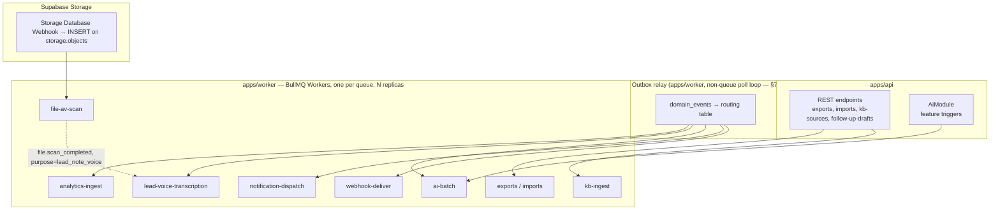
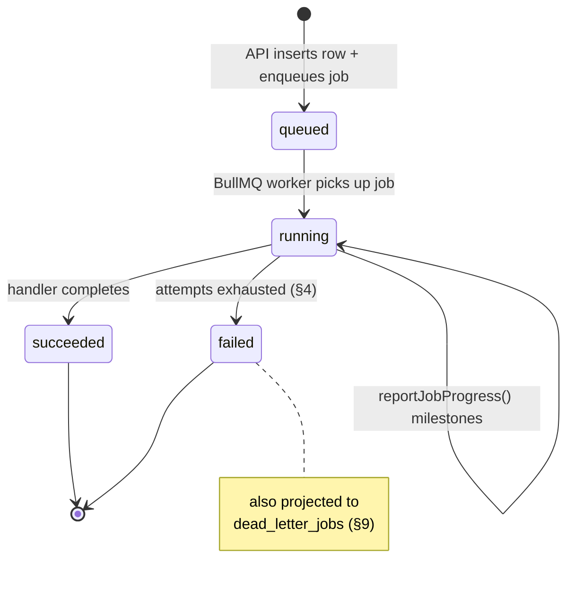

# Background Jobs Architecture

This document owns the `apps/worker` deployable end-to-end: its topology and relationship to `apps/api` ([00-foundation.md](00-foundation.md) §6), the complete **BullMQ 5** queue catalog (every queue name already in ad hoc use across [18-api-architecture.md](18-api-architecture.md), [21-ai-architecture.md](21-ai-architecture.md), [25-event-pipeline.md](25-event-pipeline.md), and [26-file-storage.md](26-file-storage.md), consolidated here as the single registry), payload shapes, concurrency, BullMQ priority, and retry/backoff policy per queue, the **general** worker retry policy that every queue inherits unless stated otherwise, the worker-side mechanics that populate the `GET /v1/jobs/{jobId}` resource, and dead-letter handling and failure alerting. It does **not** own: the `domain_events` outbox schema, the outbox relay's polling/routing logic, or the fan-out consumer *inputs* (owned by [25-event-pipeline.md](25-event-pipeline.md), which this document treats as a producer feeding several of its queues); webhook signing and the webhook-specific 7-attempt retry schedule (owned by [18-api-architecture.md](18-api-architecture.md) §9.5, referenced not restated); AI model-call policy, prompt architecture, guardrails, or the AI-batch-specific retry ceiling (owned by [21-ai-architecture.md](21-ai-architecture.md) §8.1, which this document supplies the *baseline* for); the AV scanning decision logic or per-purpose validation rules (owned by [26-file-storage.md](26-file-storage.md), which this document only runs the queue for); retention *durations* or DSAR triggers (owned by [38-data-retention-privacy-compliance.md](38-data-retention-privacy-compliance.md), which this document only runs the sweep for); and dashboards/alert routing themselves (owned by [31-observability.md](31-observability.md), which this document only defines the metrics feeding).

---

## 1. Scope and Ownership

| This doc owns | Owned elsewhere |
|---|---|
| `apps/worker` topology, scaling, isolation | API service topology → [18-api-architecture.md](18-api-architecture.md) §1 |
| The full BullMQ queue catalog: names, payloads, concurrency, priority | Per-queue *business logic* each consumer runs (webhook signing, AI prompts, AV verdicts) → each owning doc |
| The **general** retry/backoff policy (default for every queue) | The webhook-specific fixed schedule → [18-api-architecture.md](18-api-architecture.md) §9.5; the AI-batch-specific ceiling → [21-ai-architecture.md](21-ai-architecture.md) §8.1 (both are named exceptions to this doc's baseline, §4) |
| Worker-side population of the `background_jobs` table backing `GET /v1/jobs/{jobId}` | The route shape, auth, and response envelope itself → [18-api-architecture.md](18-api-architecture.md) §5.15 |
| Dead-letter handling, failure metrics | Dashboards, alert routing, on-call → [31-observability.md](31-observability.md) |
| Scheduled/repeatable job cadence | The domain policy each schedule executes (retention duration → [38-data-retention-privacy-compliance.md](38-data-retention-privacy-compliance.md); AI eval gates → [21-ai-architecture.md](21-ai-architecture.md) §5) |
| ASR vendor selection for voice-note transcription (§5.8, resolving the open item [06-exhibitor-journey.md](06-exhibitor-journey.md) §6.2 explicitly deferred here) | The transcript's downstream use in Lead Intelligence → [21-ai-architecture.md](21-ai-architecture.md) §3.3 |

Consistent with [00-foundation.md](00-foundation.md) §6: **Node 22 + BullMQ 5** consumers on **Redis 7** (ElastiCache), sharing the NestJS module system with `apps/api` but deployed separately on **AWS ECS Fargate**.

## 2. The `apps/worker` Deployable

- **One worker deployable**, per [18-api-architecture.md](18-api-architecture.md) §1: Node 22, BullMQ 5, NestJS modules mirroring the domain registry ([00-foundation.md](00-foundation.md) §7). It connects to Postgres and Redis **directly** — most job handlers read/write tenant tables with the same Drizzle models `apps/api` uses, scoped exactly as `app_worker` per [16-database-schema.md](16-database-schema.md)'s RLS grants (the same role the outbox relay runs as, [25-event-pipeline.md](25-event-pipeline.md) §4).
- **When it calls the API instead of writing directly:** only for operations that already live behind a NestJS service with request-scoped business logic the worker would otherwise have to duplicate — e.g. the AV scan-verdict handler calls `POST /v1/internal/files/{id}/scan-result` ([26-file-storage.md](26-file-storage.md) §6.2) rather than flipping `files.status` itself, because that route's service also performs quarantine object-move, `audit_logs` write, and notification enqueue. These calls use the Ed25519-signed service JWTs specified in [18-api-architecture.md](18-api-architecture.md) §10; everything else (job-status projections, domain-table writes) is a direct Postgres write from within the job handler's own transaction.
- **Context propagation:** every job's `data` carries `meta: { requestId, traceId, principal }`, forwarded from the originating request per [18-api-architecture.md](18-api-architecture.md) §3.9, so pino log lines and OTel spans in `apps/worker` join the request that triggered the job. Jobs with no originating HTTP request (scheduled jobs, §6) mint a fresh `requestId` and set `principal: { kind: 'service', serviceName: 'worker-scheduler' }`.



## 3. BullMQ Conventions

- **Naming:** `kebab-case`, per [00-foundation.md](00-foundation.md) §11's own worked examples (`kb-ingest`, `notification-dispatch`) — every queue in §5 follows this without exception.
- **Job IDs:** deterministic wherever the producer already has a natural dedupe key, exactly as the outbox relay establishes (`` `${queue}:${domainEventId}` ``, [25-event-pipeline.md](25-event-pipeline.md) §4). For queues fed directly from API requests rather than the outbox (exports, imports, kb-ingest on-demand reingest), the job id is the `background_jobs.id` created in the same request (§8) — an `Idempotency-Key`-driven retry of the originating POST reuses that id, so a duplicate client submission cannot double-enqueue.
- **Payload envelope:** every job's `data` is `{ ...queueSpecificFields, meta: { requestId, traceId, principal } }` (§2). Queue-specific fields are listed per queue in §5.
- **Removal policy:** `removeOnComplete: { age: 86400, count: 1000 }` (successful jobs kept 24h for debugging, capped); `removeOnFail` is **not** used — failed jobs are retained until the dead-letter sweep (§9) has projected them to Postgres, then removed on a 7-day age cap. This is deliberate: BullMQ's own failed-job list is the source the dead-letter sweep reads, so clearing it early would race the projection.
- **Redis isolation:** all queues share the single Redis 7 ElastiCache cluster already fixed in [00-foundation.md](00-foundation.md) §6 (same instance BullMQ, pub/sub, sessions, and rate limits use), keyed under the `bull:{queueName}:*` prefix BullMQ manages internally — no separate Redis deployment per queue; volume at this platform's scale ([00-foundation.md](00-foundation.md) §2 D5) does not warrant it.

## 4. Retry & Backoff Policy

### 4.1 General default (the baseline every queue inherits)

**Decision:** unless a queue's row in §5 states an override, every BullMQ job in this catalog uses:

| Setting | Value |
|---|---|
| Attempts | 5 |
| Backoff | Exponential, base delay 15 s, factor 2 (15s, 30s, 1m, 2m, 4m — capped at 10 min) |
| Jitter | ±20%, applied by a shared custom backoff strategy (`concourseExponentialJitter`) registered once in `packages/worker-core` so every queue's `defaultJobOptions` references it by name rather than reimplementing the math |
| Stalled-job recovery | BullMQ `lockDuration` 30 s, `maxStalledCount` 1 — a worker replica that crashes mid-job releases the lock and the job is retried on another replica exactly once as "stalled" before counting against `attempts` |

This mirrors the shape already established for the outbox relay's own consumers and for webhooks ([25-event-pipeline.md](25-event-pipeline.md) §8, [18-api-architecture.md](18-api-architecture.md) §9.5) without duplicating either — it is the policy for every queue that doesn't already have a documented reason to differ.

### 4.2 Named exceptions

Two queues in this catalog intentionally do **not** use §4.1, and both exceptions are documented in the doc that owns the reason, not invented here:

| Queue | Exception | Owning spec | Why it differs from the general default |
|---|---|---|---|
| `webhook-deliver` | Fixed absolute-time schedule: 7 attempts at 1m, 5m, 30m, 2h, 8h, 24h (±20% jitter) | [18-api-architecture.md](18-api-architecture.md) §9.5 | A subscriber's endpoint can be down for hours during a legitimate incident on *their* side; the retry window needs to span a full day, which an exponential-from-15s ladder capped at 10 minutes cannot do. Fixed long-tail backoff is the right shape only because this is the one queue calling an arbitrary third-party URL. |
| `ai-batch` | 3 attempts, exponential + jitter, capped shorter than §4.1 | [21-ai-architecture.md](21-ai-architecture.md) §8.1 | This is the case this document is required to distinguish explicitly: **AI batch jobs are a special case that references this document's general policy as its baseline**, not a competing policy. `AiGatewayService` (doc 21 §1) already performs its own inner retry — 2 attempts with backoff+jitter on 429/5xx — *before* the BullMQ job-level attempt counter increments at all. Stacking the full 5-attempt general ladder on top of that inner retry would let one stuck job occupy `5 × (inner retry latency)`, which (a) blows past the freshness windows Lead Intelligence and Follow-up Studio need (doc 21 §3.3/§3.4's second-scale latency budgets) and (b) burns a disproportionate share of the per-event/tenant AI budget (doc 21 §6.2) chasing a call that already had two shots at the provider level. Doc 21 §8.1 fixes the ceiling at 3 attempts for exactly this reason; this document's contribution is the base exponential+jitter shape doc 21 explicitly reuses rather than defining its own. |

Every other queue in §5 — including `exports` and `imports`, which are compute-heavy but not AI-cost-sensitive — uses a documented **tightened** variant of §4.1 (3 attempts, cap 15 min) rather than a wholesale different policy, noted inline in their rows.

## 5. Queue Catalog

Conventions for the table: **Priority** is the BullMQ numeric `priority` job option, 1 = highest, 5 = lowest (default, unset jobs run FIFO among themselves at priority 3). **Concurrency** is the `Worker` concurrency option *per replica*; `apps/worker` runs N replicas (§11), so effective platform-wide concurrency is `concurrency × replicas`.

| Queue | Producer(s) | Concurrency | Priority | Retry |
|---|---|---|---|---|
| `webhook-deliver` | Outbox relay ([25-event-pipeline.md](25-event-pipeline.md) §6.1) | 25 | 2 — High | §4.2 exception |
| `notification-dispatch` | Outbox relay ([25-event-pipeline.md](25-event-pipeline.md) §6.3) + direct calls from any module with a transactional notification | 30 | 2 — High | §4.1 general |
| `kb-ingest` | `POST /v1/events/{eventId}/kb-sources`, `POST /v1/kb-sources/{id}/reingest` ([18-api-architecture.md](18-api-architecture.md) §5.10) | 6 | 3 — Standard | §4.1 general |
| `ai-batch` | `AiModule` feature triggers ([21-ai-architecture.md](21-ai-architecture.md) §3.2–§3.4) + outbox relay incremental re-score ([25-event-pipeline.md](25-event-pipeline.md) §6.4) | 12 | 3 — Standard (see note) | §4.2 exception |
| `exports` | `POST .../leads/export` and future export endpoints ([18-api-architecture.md](18-api-architecture.md) §5.9, §5.15) | 4 | 3 — Standard | 3 attempts, exponential from 1 min, cap 15 min |
| `imports` | `POST /v1/events/{eventId}/registrations/import` ([18-api-architecture.md](18-api-architecture.md) §5.7) | 3 | 3 — Standard | Same as `exports` |
| `file-av-scan` | Supabase Storage Database Webhook, on `INSERT` into `storage.objects` ([26-file-storage.md](26-file-storage.md) §6.1) | 20 | 1 — Critical | §4.1 general |
| `lead-voice-transcription` | Subscriber to `file.scan_completed` where `purpose = lead_note_voice` ([26-file-storage.md](26-file-storage.md) §10, [06-exhibitor-journey.md](06-exhibitor-journey.md) §6.2) | 5 | 3 — Standard | §4.1 general |
| `analytics-ingest` | Outbox relay, unfiltered ([25-event-pipeline.md](25-event-pipeline.md) §6.2) | 15 | 4 — Low | §4.1 general |

**Note on `ai-batch` priority:** the BullMQ `priority` field only orders jobs *within* this queue relative to each other; it is not what keeps AI batch work from starving interactive AI calls — that separation happens one layer down, inside `AiGatewayService`'s own Redis token buckets with two priority classes where "interactive preempts batch" ([21-ai-architecture.md](21-ai-architecture.md) §8.1). This queue's own `priority: 3` simply means, e.g., a Follow-up Studio draft batch and a matchmaking incremental re-score contend fairly with each other for the queue's 12 concurrent slots.

### 5.1 `webhook-deliver`

```typescript
interface WebhookDeliverJob {
  domainEventId: string;      // dedupe key, also webhook_deliveries.domain_event_id
  webhookEndpointId: string;
  eventType: string;          // noun.verb_past, from the domain_events catalog
  meta: { requestId: string; traceId: string; principal: unknown };
}
```
Full handling (envelope assembly, signing, SSRF guard, DLQ, auto-disable) is owned by [18-api-architecture.md](18-api-architecture.md) §9; this catalog entry fixes only the queue-level shape.

### 5.2 `notification-dispatch`

```typescript
interface NotificationDispatchJob {
  domainEventId?: string;             // present when triggered by the outbox; absent for direct calls
  category: string;                   // notifications.category taxonomy, doc 33
  audienceUserIds: string[];
  templateId: string;
  templateData: Record<string, unknown>;
  meta: { requestId: string; traceId: string; principal: unknown };
}
```
Content, channels, and preferences are owned by [33-notification-system.md](33-notification-system.md); trigger-to-audience mapping is owned by [25-event-pipeline.md](25-event-pipeline.md) §6.3.

### 5.3 `kb-ingest`

```typescript
interface KbIngestJob {
  kbSourceId: string;
  eventId: string;
  organizationId: string;
  trigger: 'created' | 'reingest';
  meta: { requestId: string; traceId: string; principal: unknown };
}
```
Chunking, embedding, and quarantine are owned by [23-knowledge-base-architecture.md](23-knowledge-base-architecture.md). Ingestion is idempotent at the `kb_chunks` level (upsert by content hash), so a retried attempt after a partial failure never double-embeds already-processed content.

### 5.4 `ai-batch`

```typescript
type AiBatchJob =
  | { kind: 'matchmaking_full_run'; eventId: string; meta: JobMeta }
  | { kind: 'matchmaking_incremental'; registrationId: string; eventExhibitorId?: string; meta: JobMeta }
  | { kind: 'matchmaking_reason'; matchRecommendationIds: string[]; meta: JobMeta }
  | { kind: 'lead_note_extraction'; leadNoteId: string; meta: JobMeta }
  | { kind: 'lead_summary'; leadId: string; meta: JobMeta }
  | { kind: 'followup_draft'; eventExhibitorId: string; leadIds: string[]; meta: JobMeta }
  | { kind: 'guardrail_screen'; kbDocumentId: string; meta: JobMeta };

type JobMeta = { requestId: string; traceId: string; principal: unknown };
```

**Decision — one queue, discriminated by `kind`, not several queues:** [21-ai-architecture.md](21-ai-architecture.md) §3.2 (Locked) names the Smart Matchmaking pipeline's queue as `ai-batch` explicitly, covering both the nightly full run and incremental re-scores; §3.3/§3.4 name the same queue for Lead Intelligence extraction and Follow-up Studio drafting. This document does not introduce a separate `matchmaking-batch` queue alongside it — doing so would contradict doc 21's already-Locked text for no operational benefit, since every `ai-batch` consumer already goes through the same `AiGatewayService` budget/guardrail/circuit-breaker pipeline (doc 21 §1) regardless of `kind`. Splitting by `kind` inside one queue gets per-workload observability (§10) without a second queue to keep in sync with doc 21's text.

### 5.5 `exports`

```typescript
interface ExportJob {
  jobId: string;               // = background_jobs.id, §8
  kind: 'leads_export';        // extensible: future export endpoints add a kind here
  scope: { eventExhibitorId?: string; organizationId: string };
  filters: Record<string, unknown>;
  requestedByUserId: string;
  meta: JobMeta;
}
```
The handler writes the resulting CSV/PDF/zip directly to Supabase Storage under the `export` purpose, created `clean` per [26-file-storage.md](26-file-storage.md) §6.8 (no AV scan needed — system-generated), then returns a 15-minute Supabase Storage signed URL as `background_jobs.result.downloadUrl`, matching the presigned-URL precedent already fixed for `leads:export` in [18-api-architecture.md](18-api-architecture.md) §5.9.

### 5.6 `imports`

```typescript
interface ImportJob {
  jobId: string;
  kind: 'registrations_import';
  eventId: string;
  fileId: string;              // the uploaded CSV, purpose-validated per doc 26 §8
  columnMapping: Record<string, string>;
  requestedByUserId: string;
  meta: JobMeta;
}
```
Row-level failures (a malformed CSV row) do not fail the whole job — the handler accumulates a per-row error list into `background_jobs.result.rowErrors[]` and completes with `status: 'succeeded'` if at least one row imported, or `'failed'` with `problem.code: 'import_no_rows_succeeded'` if none did. This keeps a 9,999-good/1-bad import from being an all-or-nothing failure for Priya/Marcus.

### 5.7 `file-av-scan`

```typescript
interface FileAvScanJob {
  fileId: string;
  scanId: string;
  meta: JobMeta;
}
```
Priority 1 (Critical) because a `pending`/`scanning` file is a resource a user is actively waiting to use (assign to a booth, attach to a lead, publish as a logo) — of every queue in this catalog, this is the one where general-default backoff (§4.1) directly gates a human-visible next step, so it also gets the highest concurrency-to-volume ratio. This queue now runs the scan itself: the handler downloads the object's bytes from Supabase Storage and scans them with self-hosted ClamAV running inside this worker fleet, then calls the internal scan-result route with the verdict it just produced — there is no external scanner or verdict callback to wait on; the scan and the verdict determination both happen inside this one job, per [26-file-storage.md](26-file-storage.md) §6.

### 5.8 `lead-voice-transcription`

```typescript
interface LeadVoiceTranscriptionJob {
  fileId: string;
  leadNoteId: string;          // pre-existing row, transcription_status = 'pending'
  organizationId: string;
  meta: JobMeta;
}
```

**Decision — ASR vendor: Amazon Transcribe.** [06-exhibitor-journey.md](06-exhibitor-journey.md) §6.2 deliberately left "the ASR engine selection itself" as an implementation detail jointly owned by [21-ai-architecture.md](21-ai-architecture.md) and this document, fixing only the contract (queued locally, uploaded on sync, transcribed asynchronously). This document resolves it: **Amazon Transcribe**, for two reasons — (1) it is a mature, accurate managed ASR offering that requires no new model fleet for the worker fleet to operate, consistent with this platform's general preference for a managed primitive over self-hosting a model class it has no other reason to run; this choice is unrelated to and unaffected by the Supabase adoption ([00-foundation.md](00-foundation.md) §14 Amendment A5) — file storage location has no bearing on which ASR vendor transcribes the bytes; (2) it introduces no new model-provider dependency into `packages/ai`'s enforced boundary ([21-ai-architecture.md](21-ai-architecture.md) §1) — the raw transcript is plain text that then flows into the *already-specified* `claude-haiku-4-5` note-extraction step (doc 21 §3.3) exactly like a typed note would. **Mechanism:** the trigger is still the same `file.scan_completed` domain event, filtered to `purpose = lead_note_voice` (§2, [26-file-storage.md](26-file-storage.md) §10). Rather than staging the object into S3 for the batch `StartTranscriptionJob` API, this job's handler downloads the object's bytes from Supabase Storage using the same download mechanism the `file-av-scan` job already uses (§5.7) — the file is already verdicted `clean` by the time this job fires — and calls **Amazon Transcribe's streaming transcription API** directly with that byte stream. Voice notes are short (~15 s capture, 8 MiB cap per [26-file-storage.md](26-file-storage.md) §8), which is a clean fit for streaming transcription rather than a compromise, and it avoids needing to stage the file into S3 at all. On completion, the handler writes `lead_notes.body_md` and flips `transcription_status → completed` ([16-database-schema.md](16-database-schema.md)); on exhaustion of retries, `transcription_status → failed` and Jamal's lead-notes panel shows the raw audio with a "transcription failed" state rather than blocking the note.

### 5.9 `analytics-ingest`

```typescript
interface AnalyticsIngestJob {
  domainEventId: string;
  aggregateType: string;
  eventType: string;
  occurredAt: string;          // ISO-8601, the domain_events row's occurred_at
  payload: Record<string, unknown>;
  meta: JobMeta;
}
```
Unfiltered passthrough of the entire domain event catalog, per [25-event-pipeline.md](25-event-pipeline.md) §6.2's decision that analytics ingestion's obligation is comprehensive capture, not curation. Priority 4 (Low) because nothing user-facing blocks on this queue draining promptly — the QCE rollup and dashboards ([32-analytics-architecture.md](32-analytics-architecture.md)) tolerate minutes of lag, unlike `file-av-scan` or `webhook-deliver`.

## 6. Scheduled & Repeatable Jobs

Distinct from the event/request-triggered queues in §5, these run on a BullMQ **repeatable job** (cron-pattern) schedule with no external producer:

| Job | Cadence | Concurrency | Retry | Purpose |
|---|---|---|---|---|
| `file-retention-sweep` | Daily, `0 3 * * *` UTC | 1 | 2 attempts (a missed day is caught by the next run; failures still alert, §10) | Executes [38-data-retention-privacy-compliance.md](38-data-retention-privacy-compliance.md)'s retention schedule against `files` per [26-file-storage.md](26-file-storage.md) §9.3; also sweeps orphaned `pending` uploads (§26 §11) and abandoned `background_jobs` rows (§8.4) in the same tick |
| `event-lifecycle-tick` | Every 1 min | 1 | §4.1 general | Transitions `events` from `published → live` at `starts_at`, the "worker job" [18-api-architecture.md](18-api-architecture.md) §5.3 anticipates without naming; emits `event.went_live` via `emitDomainEvent` inside the same transaction as the status write, per the write-in-same-transaction discipline ([25-event-pipeline.md](25-event-pipeline.md) §3) |
| `webhook-endpoint-health-check` | Daily | 1 | §4.1 general | Auto-disables endpoints with 100% delivery failure for 5 consecutive days ([18-api-architecture.md](18-api-architecture.md) §9.6) |
| `event-dashboard-tick` | Every 5 s | 1 (batches all live events in one tick, not one job per event) | Best-effort — a missed tick is superseded by the next one 5 s later, no retry needed | Computes and publishes `event.dashboard_tick` payloads to each live event's `event:{eventId}:ops` room via the same `@socket.io/redis-emitter` mechanism the outbox relay uses ([25-event-pipeline.md](25-event-pipeline.md) §6.5, [18-api-architecture.md](18-api-architecture.md) §7.3) |
| `ai-usage-rollup` | Hourly | 1 | §4.1 general | Rolls `ai_usage_events` into hourly aggregates for billing/dashboards ([21-ai-architecture.md](21-ai-architecture.md) §6.1) |
| `ai-eval-nightly` | Nightly | 1 per feature suite (parallel) | 1 attempt (a failed eval run pages on-call rather than silently retrying against a possibly-still-broken model) | Runs the golden-set suites against live models ([21-ai-architecture.md](21-ai-architecture.md) §5); results land on the AI dashboard ([31-observability.md](31-observability.md)) |

Batching `event-dashboard-tick` as one job over all live events (rather than a repeatable job per event) avoids the BullMQ scheduler overhead of potentially hundreds of 5-second-cadence jobs at the scale target of "multiple simultaneous events" ([00-foundation.md](00-foundation.md) §2 D5).

## 7. Non-Queue Process: the Outbox Relay

**`outbox-relay` is not a BullMQ queue**, and this document does not add one under that name. [25-event-pipeline.md](25-event-pipeline.md) §4 already fixes it as a small continuously-running poll loop inside `apps/worker` — safe to run as multiple replicas via `FOR UPDATE SKIP LOCKED` — that reads `domain_events` and *enqueues* onto several of the queues in §5 (`webhook-deliver`, `notification-dispatch`, `ai-batch`, `analytics-ingest`, and — per [26-file-storage.md](26-file-storage.md) §10 — `lead-voice-transcription` when a `file.scan_completed` event's payload carries `purpose: 'lead_note_voice'`). It is listed here only for completeness of "everything that runs inside `apps/worker`"; its cadence, batching, ordering guarantees, and crash-safety are owned entirely by doc 25 and are not restated. The one thing this document contributes to its behavior is: every queue it enqueues onto follows this document's retry/backoff policy (§4) once the job lands, which is exactly the boundary doc 25 §8 already draws ("generic BullMQ queue/retry conventions... owned by doc 27").

## 8. The Async Job Resource: Worker-Side Population

[18-api-architecture.md](18-api-architecture.md) §5.15 fixes the client-facing contract: long-running operations return `202` with a `job` resource, `GET /v1/jobs/{jobId} → { id, kind, status: queued|running|succeeded|failed, progress, result?, problem? }`, visible only to its creator's scope. This document owns the table that backs it and the worker-side write path that keeps it current.

### 8.1 `background_jobs` (illustrative schema)

| Column | Type | Notes |
|---|---|---|
| `id` | `uuid` | PK, UUIDv7; doubles as the BullMQ `jobId` for the queue that backs it (§3) |
| `organization_id` | `uuid NOT NULL` | Scoping, same RLS discipline as every tenant-owned table ([00-foundation.md](00-foundation.md) §8) |
| `created_by_user_id` | `uuid NOT NULL` | The creator; `GET /v1/jobs/{jobId}` authorizes against this plus `scope` |
| `kind` | `text NOT NULL` | `'leads_export' \| 'registrations_import' \| 'kb_reingest' \| ...` — extensible; each value maps to exactly one queue in §5 |
| `queue_name` | `text NOT NULL` | Which BullMQ queue is processing this job — lets the admin job-ops view (§9) join back to queue-level metrics |
| `status` | `text NOT NULL DEFAULT 'queued'` | `CHECK IN ('queued','running','succeeded','failed')` — the exact enum [18-api-architecture.md](18-api-architecture.md) §5.15 already fixes; this table does not add a fifth value |
| `progress` | `smallint NOT NULL DEFAULT 0` | `0`–`100` |
| `result` | `jsonb` | Present only on `succeeded`; shape is `kind`-specific (e.g. `{ downloadUrl, expiresAt }` for exports) |
| `problem` | `jsonb` | Present only on `failed`; a subset of the RFC 9457 shape ([18-api-architecture.md](18-api-architecture.md) §3.5) — `{ code, title, detail }` |
| `scope` | `jsonb NOT NULL` | Additional visibility-scoping ids beyond `organization_id` (e.g. `{ eventId, eventExhibitorId }`) so a job created by one exhibitor rep isn't visible to a sibling rep unless the permission model says so |
| `created_at`, `updated_at`, `completed_at` | `timestamptz` | Standard, per [00-foundation.md](00-foundation.md) §11 |

Column-level DDL, indexes, and the RLS predicate belong with every other entity's canonical home once this table is registered into [00-foundation.md](00-foundation.md) §7 — the same registration discipline already applied to `domain_events` and `legal_documents` when those docs were written (foundation §14, A1/A2). Until that registration pass, this section is this table's authoritative design.

### 8.2 Write path

1. **Creation:** the originating API request (`leads/export`, `registrations/import`, `kb-sources/{id}/reingest`) inserts a `background_jobs` row (`status: 'queued'`) and enqueues the corresponding BullMQ job using that row's `id` as the job id, in that order — if the enqueue throws, the request rolls back the insert too (both happen in one API request's transaction/compensating-delete, not two independent facts that could disagree).
2. **Progress:** the job handler calls a shared `reportJobProgress(jobId, { status, progress, result?, problem? })` helper (`packages/worker-core`) once per meaningful milestone (not per row of a 50,000-row export). The helper does two things in sequence: `UPDATE background_jobs SET ...`, then a fire-and-forget publish of `job.updated → job:{jobId}` via `@socket.io/redis-emitter` — the exact mechanism the outbox relay already uses for realtime hints ([25-event-pipeline.md](25-event-pipeline.md) §6.5), reused rather than reinvented. BullMQ's own `job.updateProgress()` is called alongside purely for BullMQ-native tooling (Bull Board, §9); the Postgres row is the source of truth the API reads.
3. **Terminal state:** `succeeded` sets `result`; `failed` sets `problem` after retries are exhausted (§4) — a job never reports `failed` while attempts remain, matching BullMQ's own `failed` event semantics (fired only after the last attempt).
4. **Client consumption:** `GET /v1/jobs/{jobId}` (owned by doc 18) reads this table directly; clients poll at ≥2 s per doc 18 §5.15 or join `job:{jobId}` in their own namespace (attendee/exhibitor/organizer/admin, per [18-api-architecture.md](18-api-architecture.md) §7.2's ScopeGuard-authorized join pattern) for the push.



### 8.3 Authorization

`background_jobs.organization_id` + `scope` are checked against the `RequestContext` exactly as any other resource's ScopeGuard check ([18-api-architecture.md](18-api-architecture.md) §3.9) — a job is a first-class scoped resource, not a special case. A non-creator, non-scope-matching caller gets `404` (never `403`), consistent with doc 18 §3.5's "don't reveal cross-tenant existence" default.

### 8.4 Cleanup

Rows older than 30 days are swept by `file-retention-sweep` (§6) in the same daily tick — `background_jobs` is operational metadata, not a product record with its own retention policy in doc 38, so this document fixes its own housekeeping window rather than deferring it.

## 9. Dead-Letter Handling

**Decision — one uniform mechanism, not a bespoke DLQ per queue.** A global BullMQ `QueueEvents` listener attached once per queue in `apps/worker`'s bootstrap subscribes to each queue's `failed` event and, only when `job.attemptsMade >= job.opts.attempts` (i.e., genuinely exhausted, not an interim retry), inserts a row into `dead_letter_jobs`:

| Column | Type | Notes |
|---|---|---|
| `id` | `uuid` | PK |
| `queue_name` | `text NOT NULL` | |
| `bullmq_job_id` | `text NOT NULL` | Joinable back to Bull Board for raw inspection |
| `job_name` | `text` | BullMQ job name / `kind` discriminator where applicable |
| `job_data` | `jsonb NOT NULL` | The full job payload at time of final failure |
| `failed_reason` | `text NOT NULL` | Last error message |
| `stacktrace` | `text` | Last error stack, truncated to 8 KB |
| `attempts_made` | `smallint NOT NULL` | |
| `first_failed_at`, `last_failed_at` | `timestamptz` | |

This mirrors the "one stream, multiple downstream materializations" discipline [25-event-pipeline.md](25-event-pipeline.md) §6.2 already establishes for analytics — one failure-capture mechanism serving every queue's post-mortem needs, rather than nine bespoke tables. Per-queue **product-facing** failure UX remains each consumer's own, unchanged from where it's already specified:

| Queue | Product-facing failure surface |
|---|---|
| `webhook-deliver` | `webhook_deliveries.status = 'dead'`, admin notification, manual redeliver ([18-api-architecture.md](18-api-architecture.md) §9.6) |
| `notification-dispatch` | Bounce logged per FR-NOTIF-001 ([25-event-pipeline.md](25-event-pipeline.md) §8) |
| `exports` / `imports` | `background_jobs.status = 'failed'` with `problem`, visible to the requester via the same `GET /v1/jobs/{jobId}` polling they're already doing |
| `file-av-scan` | `files.status = 'failed'` after the doc-26-owned 30-minute stuck-verdict sweep, retry CTA to the uploader ([26-file-storage.md](26-file-storage.md) §11) |
| `lead-voice-transcription` | `lead_notes.transcription_status = 'failed'`, raw audio remains playable (§5.8) |
| `kb-ingest`, `ai-batch`, `analytics-ingest` | No per-tenant failure surface (these have no single "requester" waiting synchronously) — visible only via `dead_letter_jobs` and the metrics/alerts in §10, consistent with [25-event-pipeline.md](25-event-pipeline.md) §8's identical statement for the same three classes of consumer |

`dead_letter_jobs` rows are surfaced to `platform:admin` (Alex) as a job-ops view, consistent with the Admin Panel's deliberately distributed-ownership pattern already established in [00-foundation.md](00-foundation.md) §13 — this document does not assign it a specific route, only the data it reads.

## 10. Failure Alerting & Observability

Dashboards and alert routing are owned by [31-observability.md](31-observability.md); `apps/worker` emits:

- **Spans:** one OTel span per job (`worker.job`) with attributes `queue`, `kind`/`job.name`, `attempt`, `outcome`, `duration_ms`, plus the propagated `requestId`/`traceId` (§2).
- **Metrics:** `worker_job_duration_seconds{queue}` (histogram), `worker_job_attempts_total{queue,outcome}` (counter, `outcome: succeeded|failed|stalled`), `worker_queue_depth{queue,state}` (gauge, BullMQ `waiting`/`delayed`/`active` counts, polled every 15 s), `worker_dead_letter_total{queue}` (counter, incremented alongside every §9 insert), `worker_job_stalled_total{queue}`.
- **SLO alerts:** `worker_queue_depth{state="waiting"}` sustained above a per-queue threshold for 10 min (thresholds scaled to each queue's expected volume — `file-av-scan` and `webhook-deliver` alert far sooner than `analytics-ingest`, matching their priority tiers in §5); `worker_dead_letter_total` rate spike (any queue); `worker_job_stalled_total > 0` sustained for 5 min (signals a crash loop in a specific job handler, since one stall is expected occasionally but a sustained rate is not); `file-retention-sweep`/`webhook-endpoint-health-check`/`ai-eval-nightly` failing their scheduled run at all (compliance/hygiene risk, per the same reasoning [26-file-storage.md](26-file-storage.md) §13 already applies to its own sweep).
- This section supplies inputs only; dashboard layout, paging policy, and on-call rotation are entirely doc 31's decision.

## 11. Worker Scaling & Isolation

- **Phase 1 shape:** a single ECS Fargate task definition for `apps/worker`, horizontally scaled by ECS desired-count, where every replica runs one BullMQ `Worker` instance per queue in §5 plus the outbox relay poll loop (§7) and the repeatable jobs (§6) — all in the same Node process, since every current workload here is I/O-bound (Postgres, Redis, Supabase Storage, Voyage, Claude, Amazon Transcribe) rather than CPU-bound, and Node's event loop handles concurrent I/O-bound work across queues without contention.
- **Why not split into per-workload deployables now:** the queues most likely to contend for resources under load — `ai-batch` (external provider latency) and `file-av-scan`/`webhook-deliver` (network-bound, priority-sensitive) — are already isolated from each other at the BullMQ level (independent concurrency limits, §5) and at the AI-specific level (`AiGatewayService`'s own token buckets, [21-ai-architecture.md](21-ai-architecture.md) §8.1). A second ECS task definition reserved for AI-heavy workloads is the documented lever if production metrics (§10) ever show one queue's volume degrading another's latency; that split is deferred to [44-future-expansion-plan.md](44-future-expansion-plan.md) rather than built speculatively.
- **Redis contention:** BullMQ's own per-queue key prefixing keeps queues from interfering with each other's data; the shared ElastiCache cluster's overall throughput budget is the same one already sized for sessions/rate-limits/pub-sub in [00-foundation.md](00-foundation.md) §6, and queue volume at this platform's scale target does not approach that ceiling.

## 12. Key Decisions

| # | Decision | Rationale |
|---|---|---|
| J1 | No separate `matchmaking-batch` queue; matchmaking work runs on `ai-batch`, discriminated by `kind` | [21-ai-architecture.md](21-ai-architecture.md) §3.2 already Locks the queue name `ai-batch` for the full matchmaking pipeline; a second queue would contradict it for no consumer-visible benefit (§5.4) |
| J2 | "Retention purge" is the already-named `file-retention-sweep` queue, not a new name | [26-file-storage.md](26-file-storage.md) §9.3 already fixes this name and explicitly defers its catalog/scheduling to this document; renaming it would desync two docs describing one job |
| J3 | "AV scan" is the already-named `file-av-scan` queue, not a new name | Same reasoning as J2, sourced from [26-file-storage.md](26-file-storage.md) §6.2 |
| J4 | `outbox-relay` is documented here as a non-queue process, not added as a BullMQ queue | [25-event-pipeline.md](25-event-pipeline.md) §4 already fixes it as a continuous poll loop; adding a same-named queue would be a second, contradictory definition |
| J5 | `ai-batch`'s 3-attempt ceiling is an explicit, named exception to this doc's 5-attempt general default, not a competing policy | Required distinction per this document's brief; justified by `AiGatewayService`'s own inner retry already absorbing transient failures (§4.2) |
| J6 | ASR vendor for voice-note transcription is Amazon Transcribe, called via its streaming API against bytes downloaded from Supabase Storage rather than the batch API against an S3 object | Resolves an item [06-exhibitor-journey.md](06-exhibitor-journey.md) explicitly deferred to docs 21/27; a mature managed ASR offering that needs no new self-hosted model fleet, unaffected by the Supabase storage migration, and introduces no new provider into `packages/ai`'s enforced boundary (§5.8) |
| J7 | Dead-letter handling is one shared `dead_letter_jobs` projection fed by a global `failed`-event listener, not a bespoke table per queue | Mirrors the "one stream, multiple materializations" principle already applied to analytics ingestion ([25-event-pipeline.md](25-event-pipeline.md) §6.2) |
| J8 | `apps/worker` ships as a single ECS task definition running every queue in Phase 1 | All current workloads are I/O-bound; splitting is a lever held in reserve, not a speculative build (§11) |
| J9 | `background_jobs` is a new table, designed here and pending formal registration into [00-foundation.md](00-foundation.md) §7 | Follows the same precedent already used for `domain_events` and `legal_documents` — a document that needs a new entity to do its job defines it there first (§8.1) |

## 13. Ownership / Related Documents

| Detail | Owned by |
|---|---|
| This document | `apps/worker` topology, full BullMQ queue catalog, general retry/backoff policy, `background_jobs` worker-side mechanics, dead-letter handling, scaling |
| `domain_events` outbox, relay polling/routing, fan-out consumer *inputs* | [25-event-pipeline.md](25-event-pipeline.md) |
| Webhook signing, fixed retry schedule, DLQ product surface, public API for endpoints/deliveries | [18-api-architecture.md](18-api-architecture.md) §9, §5.13 |
| `GET /v1/jobs/{jobId}` route shape, auth, response envelope | [18-api-architecture.md](18-api-architecture.md) §5.15 |
| AI service boundary, model routing, per-feature specs, AI-batch retry ceiling, cost/budget controls | [21-ai-architecture.md](21-ai-architecture.md) |
| AV scanning decision logic, quarantine, per-purpose validation, retention *durations* | [26-file-storage.md](26-file-storage.md), [38-data-retention-privacy-compliance.md](38-data-retention-privacy-compliance.md) |
| KB ingestion internals (chunking, embedding, moderation) | [23-knowledge-base-architecture.md](23-knowledge-base-architecture.md) |
| Smart Matchmaking scoring model and weights | [24-matchmaking-and-scoring.md](24-matchmaking-and-scoring.md) |
| Notification content, channels, preferences | [33-notification-system.md](33-notification-system.md) |
| Analytics metric catalog, dashboards, exports | [32-analytics-architecture.md](32-analytics-architecture.md) |
| Role→permission matrix gating job-triggering endpoints | [28-permission-model.md](28-permission-model.md) |
| Machine-readable error codes in any `problem` field | [41-error-code-registry.md](41-error-code-registry.md) |
| Dashboards, alert routing, on-call for the metrics in §10 | [31-observability.md](31-observability.md) |
| Formal registration of `background_jobs` into the entity registry; deferred ECS task-definition split | [44-future-expansion-plan.md](44-future-expansion-plan.md) (registration itself belongs in [00-foundation.md](00-foundation.md) §7 once scheduled) |
