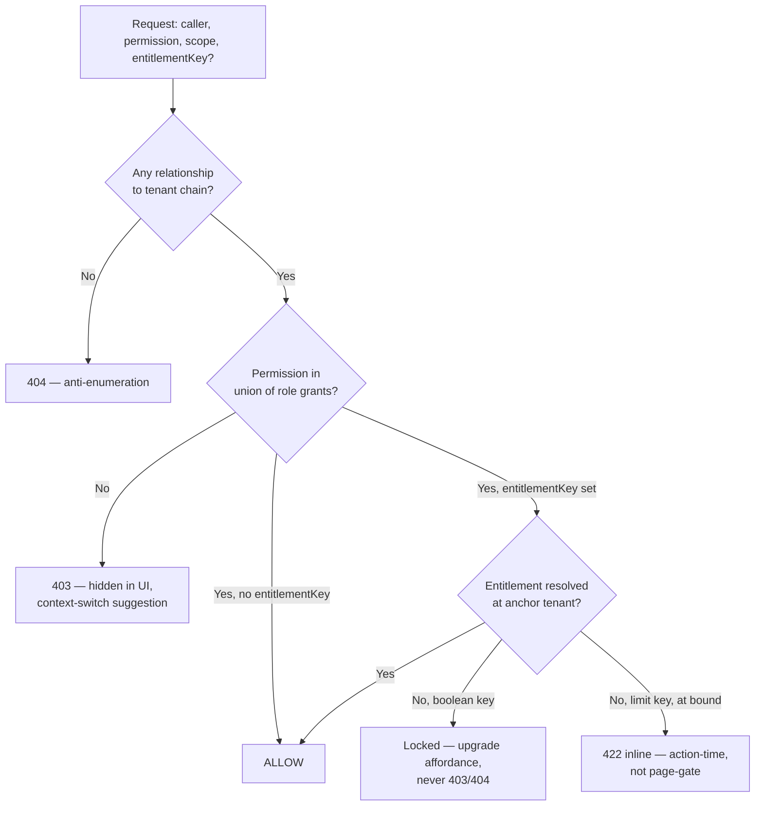

# 28 — Permission Model

This document owns four things and nothing else: (1) the complete role→permission matrix for every
`resource:action` permission string referenced in [18-api-architecture.md](18-api-architecture.md) §5,
mapped against every canonical role from [00-foundation.md](00-foundation.md) §8; (2) the exact
semantics of entitlement-key checks and how they compose with permission checks; (3) the exhaustive
registry of cross-tenant read paths — every place one tenant legitimately sees a derived or aggregate
view of another tenant's data; and (4) the UI-gating decision table (hidden vs. locked vs. 404 vs.
403) that [12-navigation-structure.md](12-navigation-structure.md) and
[11-information-architecture.md](11-information-architecture.md) state informally.

Explicitly **not** owned here: column-level schema and RLS policy SQL ([16-database-schema.md](16-database-schema.md)),
credential/session mechanics ([19-authentication-strategy.md](19-authentication-strategy.md),
[20-session-strategy.md](20-session-strategy.md)), the entitlement *key registry itself* — types,
tiers, values — which is [08-feature-matrix.md](08-feature-matrix.md) §3's canonical table (this
document only defines how those keys are *checked*), what gets written to the audit trail
([29-audit-logging-architecture.md](29-audit-logging-architecture.md)), and billing/subscription
lifecycle mechanics ([36-billing-and-payments-architecture.md](36-billing-and-payments-architecture.md)).

## 1. Role Registry

Canonical role strings, restated from [00-foundation.md](00-foundation.md) §8 with their scope and
assignment mechanism — every other section of this document is a function of this table.

| Role | Scope | Assigned via (foundation §7 entity) | Held by (example) |
|---|---|---|---|
| `platform:admin` | Platform (global, no tenant) | Internal grant, not self-service; no table row — a flag on `users` set only by existing platform admins | Alex Kim |
| `org:owner` | One `organizations` row (either `kind`) | `organization_memberships.role = owner` | Priya Sharma (organizer org), Elena Rodriguez (exhibitor org) |
| `org:admin` | One `organizations` row (either `kind`) | `organization_memberships.role = admin` | Delegated deputies on either org kind |
| `org:member` | One `organizations` row (either `kind`) | `organization_memberships.role = member` | Any other org employee with least-privilege access |
| `event:admin` | One `events` row | `event_staff.role = admin` | Priya Sharma, on her events |
| `event:staff` | One `events` row | `event_staff.role = staff` | Marcus Webb |
| `exhibitor:admin` | One `event_exhibitors` row | `exhibitor_staff.role = admin` | Elena Rodriguez, per event her company exhibits at |
| `exhibitor:rep` | One `event_exhibitors` row | `exhibitor_staff.role = rep` | Jamal Carter |
| `attendee` | One `registrations` row | Existence of the `registrations` row itself (no separate role field — registering *is* the grant) | Sofia Lindqvist |

Two structural decisions, made here because they are load-bearing for every table below and neither
is stated explicitly elsewhere:

- **D-PERM-1 — Event staffing requires prior org membership; exhibitor staffing does not.**
  `event_staff` assignment is explicitly "an existing org member" per
  [18-api-architecture.md](18-api-architecture.md) §5.3 — so `event:admin`/`event:staff` is always
  layered on top of an `org:owner`/`org:admin`/`org:member` grant on the same (organizer)
  organization. `exhibitor_staff`, by contrast, is invite-created independently
  ([18-api-architecture.md](18-api-architecture.md) §5.5) — a booth rep can hold `exhibitor:admin`
  or `exhibitor:rep` on one `event_exhibitors` row with **no** `organization_memberships` row on the
  parent exhibitor organization at all. This matches reality: a contractor or seasonal rep is staffed
  to one show, not the company's cross-event settings.
- **D-PERM-2 — Exhibitor-org ownership is a superset of exhibitor-participation admin.** An
  `org:owner`/`org:admin` on an exhibitor organization implicitly carries every permission
  `exhibitor:admin` carries on **every** `event_exhibitors` row belonging to that organization (cross-event
  oversight — e.g., Elena as Marketing Director can act on any show her company is in, not just the
  ones she was individually staffed to). This is additive, not a separate grant to model: the
  permission-resolution algorithm (§5) unions grants across every role a caller holds, and org-level
  exhibitor grants are defined at that broader scope precisely so they flow down.

A caller may hold several of these roles simultaneously (e.g., `org:owner` on an organizer org *and*
`event:admin` on three of its events); §5 defines how grants combine.

## 2. Permission String Registry

Every `resource:action` permission string referenced across
[18-api-architecture.md](18-api-architecture.md) §5's Auth columns, grouped by resource family. This
is the flat lookup the matrix in §4 checks roles against — no permission is used in §4 that isn't
listed here, and no string here is unused in §4.

| Family | Permission strings |
|---|---|
| Organization & membership | `organizations:read`, `organizations:update`, `memberships:read`, `memberships:update`, `memberships:remove`, `memberships:invite`, `audit_logs:read` |
| Events & staff | `events:read`, `events:create`, `events:update`, `events:publish`, `event_staff:read`, `event_staff:manage` |
| Floor | `venues:read`, `venues:manage`, `floor_plans:read`, `floor_plans:manage`, `booths:read`, `booths:manage`, `booths:assign` |
| Exhibitor participation | `event_exhibitors:read`, `event_exhibitors:create`, `event_exhibitors:update`, `exhibitor_profile:update`, `exhibitor_staff:read`, `exhibitor_staff:invite`, `exhibitor_staff:manage` |
| Products & listings | `products:read`, `products:manage`, `listings:read`, `listings:manage` |
| Registrations & agenda | `registrations:read`, `registrations:create`, `registrations:import`, `registrations:update`, `registrations:check_in`, `agenda:read`, `agenda:manage`, `checkins:create`, `checkins:read` |
| Engagement | `booth_visits:create`, `booth_visits:read`, `leads:read`, `leads:create`, `leads:update`, `leads:export`, `lead_notes:create`, `meetings:read`, `meetings:create`, `meetings:update` |
| Matchmaking, KB, AI | `matchmaking:read`, `kb:read`, `kb:manage`, `ai_conversations:use` |
| Billing | `billing:read`, `billing:manage` |
| Webhooks & API keys | `webhooks:manage`, `api_keys:manage` |

`ai_conversations:use` collapses the four feature bodies in
[18-api-architecture.md](18-api-architecture.md) §5.10 (`expo_copilot`, `organizer_pulse`,
`followup_studio`, and the reserved matchmaking-feedback path) into one permission string whose grant
is always evaluated together with a per-feature entitlement — §6 gives the exact per-feature table.
Self-owned account resources (`GET/PATCH /v1/users/me/*`, `notifications`, `notification_preferences`,
`auth_sessions`, `files` the caller uploaded) are **ownership-checked, not RBAC-checked** — any
authenticated caller has full CRUD on rows where they are the subject — and are intentionally absent
from this registry; they're specified in [19-authentication-strategy.md](19-authentication-strategy.md)
and [33-notification-system.md](33-notification-system.md). `POST /v1/files` (§18 §5.11) is likewise
not its own permission: **D-PERM-3** — upload permission is inherited from the purpose's owning
resource (a floor-plan image checks `floor_plans:manage`; a product image checks `products:manage`;
a lead voice note checks `lead_notes:create`; an avatar checks self-ownership). No separate
`files:upload` string exists.

## 3. Role → Permission Matrix

Legend (used in every table below): **PA** `platform:admin` · **OO** `org:owner` · **OA** `org:admin`
· **OM** `org:member` · **EA** `event:admin` · **ES** `event:staff` · **XA** `exhibitor:admin` ·
**XR** `exhibitor:rep` · **AT** `attendee`. `✓` = intrinsic grant; `—` = no intrinsic grant (may still
be reachable through a *different* role the same caller holds, per §5's union rule — this matrix
shows what each role grants on its own). `(organizer)` / `(exhibitor)` marks a cell that only applies
when the organization in scope is that `kind`; unmarked org-level cells apply to both kinds.

### 3.1 Organization & membership

| Permission | PA | OO | OA | OM | EA | ES | XA | XR | AT | Entitlement |
|---|---|---|---|---|---|---|---|---|---|---|
| `organizations:read` | ✓ (all) | ✓ (own) | ✓ (own) | ✓ (own) | — | — | — | — | — | — |
| `organizations:update` | ✓ | ✓ | ✓ | — | — | — | — | — | — | — |
| `memberships:read` | ✓ | ✓ | ✓ | ✓ | — | — | — | — | — | — |
| `memberships:update` | ✓ | ✓ | ✓¹ | — | — | — | — | — | — | — |
| `memberships:remove` | ✓ | ✓ | ✓¹ | — | — | — | — | — | — | — |
| `memberships:invite` | ✓ | ✓ | ✓ | — | — | — | — | — | — | — |
| `audit_logs:read` (org-facing) | ✓ (cross-tenant) | ✓ | ✓ | — | — | — | — | — | — | `entitlement:audit_log_access` |

¹ `org:admin` cannot demote or remove an `org:owner`; the action requires another `org:owner` (business
rule stated verbatim in [18-api-architecture.md](18-api-architecture.md) §5.2).

### 3.2 Events & staff — organizer organizations only

| Permission | PA | OO | OA | OM | EA | ES |
|---|---|---|---|---|---|---|
| `events:read` | ✓ | ✓ | ✓ | ✓ | ✓ | ✓ |
| `events:create` | ✓ | ✓ | ✓ | — | — | — |
| `events:update` | ✓ | ✓ | ✓ | — | ✓ (own event) | — |
| `events:publish` | ✓ | ✓ | ✓ | — | ✓ (own event) | — |
| `event_staff:read` | ✓ | ✓ | ✓ | — | ✓ (own event) | ✓ (own event) |
| `event_staff:manage` | ✓ | ✓ | ✓ | — | ✓ (own event) | — |

`events:create` is org-wide because no `event:admin` grant can exist before the event does; once
created, the creator (or org owner/admin) staffs `event:admin`/`event:staff` per
[18-api-architecture.md](18-api-architecture.md) §5.3.

### 3.3 Floor: venues, floor plans, booths — event-scoped

| Permission | PA | OO/OA (organizer) | EA | ES | XA | XR | AT |
|---|---|---|---|---|---|---|---|
| `venues:read` | ✓ | ✓ | ✓ | ✓ | — | — | — |
| `venues:manage` | ✓ | ✓ | ✓ | — | — | — | — |
| `floor_plans:read` | ✓ | ✓ | ✓ | ✓ | ✓ (own booth's plan) | ✓ (own booth's plan) | ✓ (published) |
| `floor_plans:manage` | ✓ | ✓ | ✓ | — | — | — | — |
| `booths:read` | ✓ | ✓ | ✓ | ✓ | ✓ (own) | ✓ (own) | ✓ (published) |
| `booths:manage` | ✓ | ✓ | ✓ | — | — | — | — |
| `booths:assign` | ✓ | ✓ | ✓ | — | — | — | — |

`booths:assign` (setting `event_exhibitors_id` on a booth) is split from `booths:manage` deliberately
— it is a contractual/billing-adjacent action reserved above `event:staff`, consistent with
[18-api-architecture.md](18-api-architecture.md) §5.4 marking it a distinct check on the same route.

### 3.4 Exhibitor participation & staff

| Permission | PA | OO/OA (organizer) | EA | OO/OA (exhibitor) | XA | XR | AT |
|---|---|---|---|---|---|---|---|
| `event_exhibitors:read` | ✓ | ✓ | ✓ | ✓ (own org's rows) | ✓ (own) | ✓ (own) | ✓ (published directory) |
| `event_exhibitors:create` | ✓ | ✓ | ✓ | — | — | — | — |
| `event_exhibitors:update` (organizer-owned fields: tier, booth, status) | ✓ | ✓ | ✓ | — | — | — | — |
| `exhibitor_profile:update` (exhibitor-owned fields: description, logo, contact) | ✓ | — | — | ✓ | ✓ | — | — |
| `exhibitor_staff:read` | ✓ | ✓ (counts only, no names — see §7 row 1) | ✓ (counts only) | ✓ | ✓ | ✓ (own team) | — |
| `exhibitor_staff:invite` | ✓ | — | — | ✓ | ✓ | — | — |
| `exhibitor_staff:manage` | ✓ | — | — | ✓ | ✓ | — | — |

`event_exhibitors:update` is field-partitioned per
[18-api-architecture.md](18-api-architecture.md) §5.5: the same route accepts either permission
depending on which fields are in the PATCH body — organizer fields require
`event_exhibitors:update`, exhibitor fields require `exhibitor_profile:update`. A caller with only
one of the two gets a `403` naming the rejected fields, not a partial write.

### 3.5 Products & listings

| Permission | PA | OO/OA (exhibitor) | OM (exhibitor) | XA | XR |
|---|---|---|---|---|---|
| `products:read` | ✓ | ✓ | ✓ | ✓ | ✓ |
| `products:manage` | ✓ | ✓ | — | ✓ | — |
| `listings:read` | ✓ | ✓ | ✓ | ✓ | ✓ |
| `listings:manage` | ✓ | ✓ | — | ✓ | — |

Attendees read listings through the published event-exhibitor directory (`event_exhibitors:read`,
§3.4), not a direct `listings:read` grant — there is no attendee row in this table.

### 3.6 Registrations, check-in & agenda — organizer-owned, event-scoped

| Permission | PA | OO/OA (organizer) | EA | ES | AT |
|---|---|---|---|---|---|
| `registrations:read` | ✓ | ✓ | ✓ | ✓ | ✓ (own only) |
| `registrations:create` | ✓ | ✓ | ✓ | ✓ (walk-up desk) | ✓ (self-registration, where enabled) |
| `registrations:import` | ✓ | ✓ | ✓ | — | — |
| `registrations:update` | ✓ | ✓ | ✓ | — | ✓ (own profile fields only) |
| `registrations:check_in` | ✓ | ✓ | ✓ | ✓ | ✓ (self-scan) |
| `agenda:read` | ✓ | ✓ | ✓ | ✓ | ✓ (published) |
| `agenda:manage` | ✓ | ✓ | ✓ | — | — |
| `checkins:create` | ✓ | ✓ | ✓ | ✓ (scan) | ✓ (self-scan, own) |
| `checkins:read` | ✓ | ✓ | ✓ | ✓ | — |

`exhibitor:admin`/`exhibitor:rep` hold **no** row in this table — per
[11-information-architecture.md](11-information-architecture.md) §2 tenancy rule 2, the Exhibitor
Portal never lists raw `registrations`; the only attendee-identity path into the Exhibitor Portal is
through `leads` (§3.7) or `match_recommendations` (§3.8).

### 3.7 Engagement: booth visits, leads, meetings — exhibitor-owned, event-exhibitor-scoped

| Permission | PA | OO/OA (exhibitor) | XA | XR | AT | OO/OA/EA/ES (organizer) |
|---|---|---|---|---|---|---|
| `booth_visits:create` | — | — | ✓ | ✓ (badge scan) | ✓ (self-scan, own) | — |
| `booth_visits:read` | ✓ (support) | ✓ | ✓ (own booth) | ✓ (own booth) | — | — (derived analytics only, §7 row 3) |
| `leads:read` | ✓ (support) | ✓ | ✓ | ✓ (own) | — | — (never — §6.4, §7 row 2) |
| `leads:create` | — | ✓ | ✓ | ✓ | — | — |
| `leads:update` | — | ✓ | ✓ | ✓ (own) | — | — |
| `leads:export` | — | ✓ | ✓ | — | — | — |
| `lead_notes:create` | — | ✓ | ✓ | ✓ | — | — |
| `meetings:read` | ✓ (support) | ✓ | ✓ | ✓ (own) | ✓ (own) | — (derived volume analytics only) |
| `meetings:create` | — | ✓ | ✓ | ✓ | ✓ (own, via accept/decline flow) | — |
| `meetings:update` | — | ✓ | ✓ | ✓ (own) | ✓ (own party, accept/decline/cancel) | — |

`leads:export` is deliberately withheld from `exhibitor:rep` — export is a data-exfiltration-risk
action reserved to `exhibitor:admin` and above, independent of the `entitlement:lead_export` check
that also gates it (§6). No organizer role — including `platform:admin` outside a declared support
action — carries `leads:read`; this is the strongest tenancy boundary in the system and is examined
in full in §6.4 and §7.

### 3.8 Matchmaking, knowledge base & AI

| Permission | PA | OO/OA/EA (organizer) | XA | XR | AT |
|---|---|---|---|---|---|
| `matchmaking:read` | — | — (derived coverage analytics only) | ✓ | ✓ | ✓ (own, ownership-checked) |
| `kb:read` | ✓ (ingest health) | ✓ | ✓ (own sources) | — | — |
| `kb:manage` | — | ✓ | ✓ (own sources) | — | — |
| `ai_conversations:use` (`expo_copilot`) | — | — | — | — | ✓ |
| `ai_conversations:use` (`organizer_pulse`) | — | ✓ (also gated by `pulse:use`-equivalent grant, `org:owner`/`org:admin`/`event:admin` only) | — | — | — |
| `ai_conversations:use` (`followup_studio`) | — | — | ✓ | — | — |

`ai_conversations:use` for `followup_studio` is a single-shot generation call against the same
resource family as the conversational features, not a multi-turn chat surface — this reconciles the
"Phase 1 deferred" note against `ai_conversations`/`ai_messages` for the Exhibitor Portal in
[11-information-architecture.md](11-information-architecture.md) §2 (which refers to a general-purpose
exhibitor chat UI, not yet built) with Follow-up Studio's Phase-1 availability per
[08-feature-matrix.md](08-feature-matrix.md) §3: the permission and route exist now; the open-ended
conversational Exhibitor Portal UI around it does not, and is tracked in
[44-future-expansion-plan.md](44-future-expansion-plan.md).

### 3.9 Billing

| Permission | PA | OO/OA (organizer) | OO/OA (exhibitor) | XA |
|---|---|---|---|---|
| `billing:read` | ✓ (support diagnostics only) | ✓ | ✓ | ✓ |
| `billing:manage` | — | ✓ | ✓ | ✓ |

`platform:admin` never holds `billing:manage` — tenant billing actions on a tenant's behalf go
through Stripe's own support tooling, not impersonated writes through this API, consistent with the
Phase-1 exclusion of user impersonation in [18-api-architecture.md](18-api-architecture.md) §5.14.

### 3.10 Webhooks & API keys — enterprise, organizer organizations only

| Permission | PA | OO (organizer) | OA (organizer) |
|---|---|---|---|
| `webhooks:manage` | —³ | ✓ | — |
| `api_keys:manage` | —³ | ✓ | — |

**D-PERM-4** — unlike every other org-level pair, `org:admin` is deliberately excluded here: creating
a webhook endpoint or an API key grants a durable, machine-usable credential with programmatic reach
into tenant data, which this model treats as an owner-only security action (the same tier of
seriousness as membership removal in §3.1). Exhibitor organizations hold no row in this table —
exhibitor-scoped public API access is explicitly deferred
([08-feature-matrix.md](08-feature-matrix.md) §6, [44-future-expansion-plan.md](44-future-expansion-plan.md)).

³ **D-PERM-5** — `platform:admin` intentionally holds neither string, even though
[11-information-architecture.md](11-information-architecture.md) §2 lists Platform Admin as `Read` on
`api_keys` and `webhook_endpoints`/`webhook_deliveries`: both permission strings are unsplit
(`webhooks:manage`/`api_keys:manage` cover list/get *and* create/rotate/delete on the same route per
[18-api-architecture.md](18-api-architecture.md) §5.13, with no separate `:read` variant), and granting
either to `platform:admin` would hand it the create/rotate/delete capability §9 explicitly withholds
(no tenant-role-equivalent write access). Platform Admin's read visibility into these two entities is
satisfied entirely by the general-purpose support read path (§7 row 14) — a direct, platform-scoped
query, never the tenant-facing RBAC string — which is also why no dedicated `GET
/v1/admin/webhook-endpoints`-style route appears in [18-api-architecture.md](18-api-architecture.md)
§5.14: it would be redundant with row 14's already-total read access.

Two entitlement keys govern this family per
[08-feature-matrix.md](08-feature-matrix.md) §3 — `entitlement:public_api` and `entitlement:webhooks`
— and both carry identical values across every organizer plan (`—`/`—`/`✓`: enterprise-only, nothing
else). **D-PERM-6** — because [18-api-architecture.md](18-api-architecture.md) §5.13 gates *every*
route in this family (`webhook-endpoints` and `api-keys`, in full) on `ent:public_api` alone,
`entitlement:public_api` is the operative check `authorizeWithEntitlement` (§6.3) evaluates for both
`webhooks:manage` and `api_keys:manage`. `entitlement:webhooks` is reserved, not dead: it is the seam
for a future plan tier that sells webhooks without the full public API surface (e.g., a
`professional`-tier "webhooks only" add-on) — until that tier exists, the two keys are co-resolved
1:1 and no code path checks `entitlement:webhooks` on its own. Revisit criteria (introducing a plan
where the two diverge) is tracked in [44-future-expansion-plan.md](44-future-expansion-plan.md).

## 4. API Keys & Service Identity Scoping

An `api_keys` credential (foundation §7) authenticates as a **scoped service identity**, not an
interactive user — it has no `organization_memberships` row and holds none of the roles in §1.
Instead, at creation time the issuing `org:owner` selects a subset of `{resource}:read` /
`{resource}:manage` pairs from §3's organizer-side columns to bind to the key. Two hard rules,
enforced at issuance (`POST /v1/organizations/{orgId}/api-keys`):

1. **Session-only permissions are never assignable to a key**: `memberships:invite`,
   `memberships:remove`, `billing:manage`, `webhooks:manage`, `api_keys:manage`, and
   `audit_logs:read` cannot appear in a key's scope set, regardless of the issuing owner's own
   grants — a leaked key must never be able to mint another key, change billing, or rewrite the
   membership roster.
2. **A key's effective scope is the intersection**, not the union, of its bound scopes and whatever
   is exposed on the public API (`Pub` column, [18-api-architecture.md](18-api-architecture.md) §5) —
   a key cannot be scoped to a route the public API contract doesn't expose at all.

## 5. Permission Resolution Semantics

**D-PERM-7 — the model is purely additive.** There are no explicit deny grants; a caller's effective
permission set for a given resource scope is the **union** of every intrinsic grant (§3) from every
role the caller holds that is in scope for that resource. This keeps role definitions simple
(least-privilege positive grants only) at the cost of needing careful scope matching — which is why
§1's structural decisions (D-PERM-1, D-PERM-2) matter: they define which roles a caller can
simultaneously hold, not just what one role grants alone.

```
function authorize(caller, permission, scope):
    roles = resolveRoles(caller, scope)
    // scope = { organizationId?, eventId?, eventExhibitorId?, registrationId? }
    // resolveRoles walks: platform flag → organization_memberships rows matching organizationId
    // → event_staff rows matching eventId (only if an org role above also matches that event's org)
    // → exhibitor_staff rows matching eventExhibitorId → registrations row matching registrationId

    if roles is empty:
        if caller has ANY relationship to the tenant chain above scope:
            return DENY_403   // member of the org but not staffed to this event, etc.
        else:
            return DENY_404   // no relationship at all — anti-enumeration, doc 11 §3.3

    granted = union( ROLE_PERMISSIONS[r] for r in roles )   // §3's tables, keyed by role
    if permission not in granted:
        return DENY_403

    return ALLOW_PENDING_ENTITLEMENT   // proceeds to §6
```

Scope resolution is middleware, not per-route code (mirrors
[11-information-architecture.md](11-information-architecture.md) §3.1's context-nesting model): the
request's URL params resolve `organization`/`event`/`event_exhibitor`/`registration` once, and every
downstream permission check reuses that resolved scope rather than re-deriving it.

## 6. Entitlement Check Semantics

An entitlement key (registry: [08-feature-matrix.md](08-feature-matrix.md) §3) answers a different
question than a permission: not *"is this caller allowed to touch this resource,"* but *"has the
relevant tenant paid for this capability."* The two checks are independent axes and are always
evaluated in a fixed order.

### 6.1 Resolution

Entitlements are resolved from the `plans → subscriptions → entitlements` chain (foundation §4,
tables owned by [16-database-schema.md](16-database-schema.md)) against **one of two tenant anchors**,
never the caller directly:

- **Organizer-plan keys** (`entitlement:analytics_suite`, `entitlement:matchmaking`,
  `entitlement:organizer_pulse`, `entitlement:sso_saml`, `entitlement:public_api`,
  `entitlement:webhooks`, `entitlement:audit_log_access`, `entitlement:events_limit`,
  `entitlement:expo_copilot`, `entitlement:ai_budget_daily_usd`, `entitlement:custom_domains`,
  `entitlement:data_residency`) resolve against the **organizer organization** in scope.
- **Exhibitor-tier keys** (`entitlement:staff_seats`, `entitlement:lead_intelligence`,
  `entitlement:meeting_scheduling`, `entitlement:lead_export`, `entitlement:crm_sync`,
  `entitlement:followup_studio`, `entitlement:matchmaking_priority`,
  `entitlement:competitive_benchmarks`, `entitlement:booth_analytics_realtime`) resolve against the
  **`event_exhibitors` row** in scope — never against the exhibitor organization as a whole, because
  tiers are purchased per event (foundation §4).

The resolved set is cached per request-scope anchor (Redis, keyed `entitlements:{anchorType}:{anchorId}`)
and invalidated on the relevant Stripe webhook
([36-billing-and-payments-architecture.md](36-billing-and-payments-architecture.md)) — never
recomputed from `plans`/`subscriptions` on the hot path.

### 6.2 Boolean vs. limit semantics

[08-feature-matrix.md](08-feature-matrix.md) §3 types every key `boolean` or `limit`. The check
differs by type:

```
function checkEntitlement(key, anchor, usageIfLimit?):
    value = resolveEntitlementValue(key, anchor)
    if entitlementType(key) == "boolean":
        return value == true
    if entitlementType(key) == "limit":
        if value == -1: return true               // unlimited
        return usageIfLimit < value                // e.g. active exhibitor_staff count < staff_seats
```

`limit`-type keys are therefore checked **at the point of the bounded action** (e.g., the 4th
`exhibitor_staff` invite on `essentials` checks `entitlement:staff_seats` against the current active
count, per [18-api-architecture.md](18-api-architecture.md) §5.5), not as a page-load gate — a limit
key never produces a "locked" UI state (§8), only a `422`/inline error when the bound is reached.

### 6.3 Composition with permission checks — exact order

The full decision function, extending §5's `authorize`:

```
function authorizeWithEntitlement(caller, permission, scope, entitlementKey?):
    result = authorize(caller, permission, scope)          // §5
    if result == DENY_404 or result == DENY_403:
        return result                                       // permission failure short-circuits — never reveals entitlement state

    if entitlementKey is null:
        return ALLOW

    anchor = entitlementAnchorFor(entitlementKey, scope)     // §6.1
    if checkEntitlement(entitlementKey, anchor):
        return ALLOW
    else:
        return DENY_ENTITLEMENT_REQUIRED                     // never 403/404 — see §8
```

**Permission is always evaluated before entitlement, and a permission failure is indistinguishable
from resource absence to the caller (`403`/`404`) — the API never leaks "you'd need to upgrade to see
this" to someone who has no relationship to the resource at all.** Only a caller who already has
`ALLOW_PENDING_ENTITLEMENT` learns about a missing entitlement, and learns it as a distinct,
recoverable state (`DENY_ENTITLEMENT_REQUIRED`), never as an error. This is the exact expansion of
[08-feature-matrix.md](08-feature-matrix.md) §5 rule 2 ("gates fail closed but visible") and rule 1
("both gates apply") — rule 1's "both gates" are permission (§3–5) and entitlement (§6), applied in
that fixed order, at potentially two different anchors (organizer entitlement AND exhibitor
entitlement on the same request, per the matchmaking-priority example in that section).



### 6.4 The `leads:read` resolution — worked example of composition

`GET /v1/event-exhibitors/{id}/leads` and `GET /v1/event-exhibitors/{id}/leads/stats`
([18-api-architecture.md](18-api-architecture.md) §5.9) share the permission string `leads:read`, yet
the Organizer Console must show a floor-wide lead count without ever exposing lead contents
([11-information-architecture.md](11-information-architecture.md) §2 tenancy rule 1). This document
resolves that with a scope decision, not a permission carve-out: **no organizer role (`org:owner`,
`org:admin`, `event:admin`, `event:staff`) is ever granted `leads:read` on an `event_exhibitors`
scope it does not itself hold** — the permission is exhibitor-side only (§3.7). The Organizer
Console's "1,204 leads captured floor-wide" figure is not this endpoint at all: it is a materialized
analytics rollup, computed asynchronously off `lead.captured`/`lead.updated` domain events
([25-event-pipeline.md](25-event-pipeline.md)) into a reporting view owned by
[32-analytics-architecture.md](32-analytics-architecture.md), gated by a separate, coarser
permission (`analytics:read`, owned in full by doc 32) that only ever returns counts-by-band, never a
row with lead content. Two permission strings, two anchors, zero shared code path — this is
intentional, not an oversight, and is the concrete mechanism behind cross-tenant read path #2 in §7.

## 7. Cross-Tenant Read-Path Registry

Every place one tenant legitimately sees a derived or aggregate view of another tenant's data,
per the two load-bearing tenancy rules in [11-information-architecture.md](11-information-architecture.md)
§2. Enumerated exhaustively — anything not listed here that looks like cross-tenant visibility is a
bug, not an oversight.

| # | Reader | Owner tenant | Source entity | Exact projection exposed | Mechanism |
|---|---|---|---|---|---|
| 1 | Organizer (`org:owner`/`org:admin`/`event:admin`) | Exhibitor org | `exhibitor_staff` | Seat **count** only (e.g., "3/3 seats used") — no staff names, emails, or roles | Live count query, no row projection |
| 2 | Organizer (any role) | Exhibitor org | `leads` | Counts by pipeline status and score band per `event_exhibitors`, floor-wide sum — never a lead row, name, contact detail, note, or score value | Async analytics rollup off domain events (§6.4), never a live `leads` query |
| 3 | Organizer (any role) | Exhibitor org | `booth_visits` | `{boothId, visitCount, uniqueAttendeeCount, avgDwellSeconds}` — no attendee identity | Async analytics rollup |
| 4 | Organizer (any role) | Exhibitor org | `meetings` | `{eventExhibitorId, countByStatus}` — no attendee identity, no meeting subject/notes | Async analytics rollup |
| 5 | Organizer (any role) | Exhibitor + Attendee | `match_recommendations` | `{coveragePct, avgScore}` — floor-wide/per-category, no identity of either matched party | Async analytics rollup |
| 6 | Organizer (`org:owner`/`org:admin`/`event:admin`, `entitlement:organizer_pulse`) | Attendee | `attendee_interests` | `{interestTag, count}` aggregated across all registrations — never a per-attendee interest list | Async analytics rollup feeding Organizer Pulse |
| 7 | Attendee | Exhibitor org | `organizations`, `products`, `event_product_listings` | Full public profile (name, logo, description, catalog) — this is the exhibitor's own opt-in public-facing data, not a leak | Live query, published-status filtered |
| 8 | Attendee (own) | Exhibitor org | `match_recommendations` | `{exhibitorId, score, reasons, referencedProductIds}` — reasons draw only from the attendee's own declared/inferred interests and the exhibitor's *public* catalog | Live query, ownership-scoped |
| 9 | Exhibitor (`exhibitor:admin`/`rep`, own `event_exhibitors`) | Attendee | `registrations` (snapshot only) | `{name, company, contactFields, badgeCode}` **frozen into the `leads` row at capture time** — never a live join back to `registrations` | Write-once projection at `booth_visits`→`leads` capture |
| 10 | Exhibitor (own, gated by the **organizer's** `entitlement:matchmaking`²) | Attendee | `match_recommendations` | `{registrationId-derived name, declared/inferred interests, score, reasons}` — **no contact details** until a mutual connection promotes the relationship into a `lead` (row 9) | Live query, ownership-scoped |
| 11 | Attendee (via Expo Copilot) | Exhibitor + Organizer | `kb_chunks` | Cited chunk text + source attribution only from chunks whose visibility metadata marks them event-wide/public — exhibitor-internal-only sources are excluded at retrieval time | Tenant- and visibility-filtered RAG retrieval ([22-rag-architecture.md](22-rag-architecture.md)) |
| 12 | Platform (`platform:admin`) | Any tenant | `kb_sources`/`kb_documents` | `{sourceId, status, errorCount}` ingest health only — never chunk/document content | Live query, ops-scoped |
| 13 | Platform (`platform:admin`) | Any tenant | `ai_conversations`/`ai_messages` | Aggregate token spend and request counts per organization/event — never message content | Async cost-analytics rollup |
| 14 | Platform (`platform:admin`) | Any tenant | Everything in foundation §7 | Full read + defined lifecycle ops (suspend/reactivate, session revocation, cross-tenant audit log) — support/ops purpose only, itself audit-logged | Direct query, platform scope (no `app.current_org_id` set) |

² Row 10's gate is the **organizer-anchored** `entitlement:matchmaking` boolean
([08-feature-matrix.md](08-feature-matrix.md) §3), the same key that unlocks Smart Matchmaking for
attendees (row 8) — there is no separate exhibitor-tier key for base visibility, consistent with
[08-feature-matrix.md](08-feature-matrix.md) §5 rule 1's worked example (organizer prospect-list gate
"J3" is `entitlement:matchmaking` for all exhibitor tiers; only the *priority-boost* refinement "J4"
adds the exhibitor-tier `entitlement:matchmaking_priority` on top, per §6.1). This reconciles
[18-api-architecture.md](18-api-architecture.md) §5.10's route-level shorthand `ent:smart_matchmaking`
on `GET /v1/events/{eventId}/match-recommendations` — that shorthand names the feature, not a distinct
entitlement key; **D-PERM-8**: every entitlement check in this document resolves to a key in
[08-feature-matrix.md](08-feature-matrix.md) §3's registry, and any other document's inline shorthand
is read as pointing at the nearest matching canonical key, never as license to mint a new one.

**Explicitly not a read path (confirms tenancy rule 2 by omission):** the Exhibitor Portal has no
route, aggregate, or projection that lists raw `registrations` — rows 9 and 10 are the *only* two
ways attendee identity reaches an exhibitor, and both are already narrower than the raw table.

## 8. UI Gating: Hidden vs. Locked vs. 404 vs. 403

Formalizing [12-navigation-structure.md](12-navigation-structure.md) §2.2's informal rule and
§9's deep-linking table into one decision table, driven directly by §6.3's `authorizeWithEntitlement`
outcomes:

| Caller relationship to tenant | Permission | Entitlement | Nav item | Direct/deep link |
|---|---|---|---|---|
| None at all | n/a | n/a | Not rendered (route doesn't resolve for this caller) | **404** — indistinguishable from a nonexistent slug ([11-information-architecture.md](11-information-architecture.md) §3.3) |
| Member/staff/registrant, but lacks permission | Missing | n/a | **Hidden entirely** — permission gaps are never upsell moments | **403** with human explanation + context-switch suggestion |
| Member/staff/registrant, has permission | Present | Missing (`boolean` key) | **Visible, locked** with upgrade/plan-contact affordance | Resolves normally; page renders locked state — **never 404**, the URL is real |
| Member/staff/registrant, has permission | Present | Missing (`limit` key, at bound) | Visible, fully interactive | Resolves normally; the bounded *action* (not the page) returns `422` inline |
| Member/staff/registrant, has permission | Present | Present (or n/a) | Visible, fully interactive | Full access |
| Unregistered attendee, event `published`/`live` | n/a (no registration yet) | n/a | n/a | Redirect to `/e/[eventSlug]/register`, resume after |
| Unregistered attendee, event `draft`/`archived` | n/a | n/a | n/a | **404** |

The permission/entitlement split is the crux: **missing permission removes the feature from the
product's surface area entirely** (discoverability would only frustrate someone who can never get
access — e.g., a `event:staff` user has no path to ever see `webhooks:manage` UI, full stop);
**missing entitlement keeps the feature fully discoverable but inert** (discoverability *sells*
plans — an `org:owner` on `launch` sees "Matchmaking" in the nav, locked, with the upsell right
there). This is exactly [12-navigation-structure.md](12-navigation-structure.md) §2.2's stated
rationale, now traced to its root cause in §6.3's evaluation order: a locked state is only reachable
after a permission check has already passed.

## 9. Platform Admin Access Model

`platform:admin` is a role like any other in this model, not a bypass — every action it takes still
runs through `authorizeWithEntitlement` (§6.3), just against a **platform scope** that carries no
`app.current_org_id` (foundation §8), so Postgres RLS policies written as `organization_id =
current_setting('app.current_org_id')` do not implicitly admit it — platform-admin routes use a
separate RLS policy branch keyed on the role claim itself, reviewed in
[43-security-architecture.md](43-security-architecture.md). Three properties, all already implied by
§3.1's and §7's tables but worth stating together:

1. **No standing entitlement checks.** Platform routes never carry an `entitlementKey` — the platform
   operator is not a paying tenant.
2. **Read is broad; write is narrow.** §3 shows `platform:admin` with `✓` on nearly every read
   permission, but only two write-shaped platform-exclusive actions exist:
   `PATCH /v1/admin/organizations/{orgId}/status` (suspend/reactivate) and
   `POST /v1/admin/users/{userId}/sessions/revoke-all` — both security-response actions, both
   mandatorily audit-logged ([29-audit-logging-architecture.md](29-audit-logging-architecture.md)).
   `platform:admin` never gets tenant-role-equivalent write access (it cannot create a `lead`, publish
   an `event`, or edit a `product`) — support operations, not operation-of-the-business.
3. **Read-only impersonation is in scope for M2.** Feature S2 (audited "view as," no write ability) is
   not excluded from Phase 1: a support engineer may act *as* a tenant user in a read-only capacity in
   addition to reasoning about a tenant's data through the read paths in §7 row 14. This document
   governs the permission/entitlement checks such a session runs under; the audit contract that gates
   the feature — mandatory reason, synchronous write, target-org-visible logging — is owned by
   [29-audit-logging-architecture.md](29-audit-logging-architecture.md) §6.6 (**D-AUDIT-4**), which is
   authoritative for what gets logged. Full write-capable impersonation remains deferred; revisit
   criteria tracked in [44-future-expansion-plan.md](44-future-expansion-plan.md).

## 10. Worked Examples

Three end-to-end traces through `authorizeWithEntitlement`, chosen to exercise every branch in §6.3's
flowchart.

**Jamal Carter exports leads.** Jamal holds `exhibitor:rep` on his company's `event_exhibitors` row
for TechExpo 2027. He taps "Export" in the Exhibitor Portal. §3.7 shows `leads:export` is **not**
granted to `exhibitor:rep` — the request never reaches the entitlement check; it's a `403`, and per
§8 the Export button was never rendered for him at all (hidden, not locked) because permission, not
entitlement, is what's missing. Elena Rodriguez (`exhibitor:admin` on the same row) sees the button;
her request passes the permission check, then checks `entitlement:lead_export` at the `event_exhibitors`
anchor — present on `growth`/`intelligence`, so she gets a signed export URL; on `essentials` she'd
see the button in a locked state with an upgrade prompt, never a 404.

**Priya Sharma checks a competitor organizer's audit log by guessing a slug.** Priya holds no role at
all on that organization. §5's `resolveRoles` returns empty and finds no relationship in the tenant
chain (not a member, not staffed, not registered) → `404`, identical to what she'd see for a slug
that doesn't exist. She cannot distinguish "wrong URL" from "real org I'm not allowed near."

**Sofia Lindqvist asks Expo Copilot about a booth whose profile includes an internal-only spec sheet.**
Sofia holds `attendee` on her registration for the event; `ai_conversations:use` for `expo_copilot` is
granted to every `attendee` with no entitlement check (`entitlement:expo_copilot` is `✓` on every
organizer plan per [08-feature-matrix.md](08-feature-matrix.md) §3, so the check always passes — the
real ceiling is the daily AI budget, enforced separately in
[21-ai-architecture.md](21-ai-architecture.md), not this document). The permission/entitlement chain
allows the request; what actually keeps the internal-only spec sheet out of her answer is cross-tenant
read path #11 (§7) — retrieval-time visibility filtering on `kb_chunks`, a data-scoping rule, not a
permission-model rule. This distinction — *who may ask* vs. *what the answer is allowed to contain* —
is exactly why §7 exists as a registry separate from §3's matrix.

## Ownership

This document is the single source of truth for: the role↔permission matrix (§3), entitlement-check
semantics and their composition with permissions (§6), the cross-tenant read-path registry (§7), and
the hidden/locked/404/403 UI-gating decision table (§8). It is consumed by, and must stay consistent
with, every Auth column in [18-api-architecture.md](18-api-architecture.md) §5, the tenancy rules in
[11-information-architecture.md](11-information-architecture.md) §2–3, the gating affordances in
[12-navigation-structure.md](12-navigation-structure.md) §2.2 and §9, and the entitlement key
registry in [08-feature-matrix.md](08-feature-matrix.md) §3. RLS policy implementation of §5's scope
resolution is [16-database-schema.md](16-database-schema.md)'s responsibility; what gets written to
the immutable audit trail when any check in this document denies or a platform-admin action fires is
[29-audit-logging-architecture.md](29-audit-logging-architecture.md)'s; DSAR/erasure interaction with
the cross-tenant read paths in §7 is [38-data-retention-privacy-compliance.md](38-data-retention-privacy-compliance.md)'s;
and the broader threat model this permission model sits inside is
[43-security-architecture.md](43-security-architecture.md)'s.

## Related Documents

- [00-foundation.md](00-foundation.md) — canonical roles, entities, glossary (§7, §8)
- [08-feature-matrix.md](08-feature-matrix.md) — entitlement key registry and gating interaction rules (§3, §5)
- [11-information-architecture.md](11-information-architecture.md) — object model → surface mapping, tenancy rules, not-found vs. forbidden (§2, §3.3)
- [12-navigation-structure.md](12-navigation-structure.md) — locked-vs-hidden nav rendering, deep-linking behavior (§2.2, §9)
- [16-database-schema.md](16-database-schema.md) — RLS policy implementation of the scopes resolved in §5
- [18-api-architecture.md](18-api-architecture.md) — the Auth columns this document's matrix explains (§5)
- [19-authentication-strategy.md](19-authentication-strategy.md), [20-session-strategy.md](20-session-strategy.md) — session/credential mechanics behind `caller` in §5's algorithm
- [22-rag-architecture.md](22-rag-architecture.md), [23-knowledge-base-architecture.md](23-knowledge-base-architecture.md) — retrieval-time visibility filtering behind cross-tenant read path #11
- [25-event-pipeline.md](25-event-pipeline.md), [32-analytics-architecture.md](32-analytics-architecture.md) — domain events and rollups behind the analytics-derived read paths in §7
- [29-audit-logging-architecture.md](29-audit-logging-architecture.md) — what gets logged when this model denies or a platform action fires
- [36-billing-and-payments-architecture.md](36-billing-and-payments-architecture.md) — subscription lifecycle behind §6.1's entitlement resolution
- [38-data-retention-privacy-compliance.md](38-data-retention-privacy-compliance.md) — DSAR/erasure interaction with §7's cross-tenant projections
- [43-security-architecture.md](43-security-architecture.md) — the broader threat model and RLS policy review for §9's platform scope
- [44-future-expansion-plan.md](44-future-expansion-plan.md) — impersonation, exhibitor-scoped public API, custom domains, data residency deferrals referenced above
