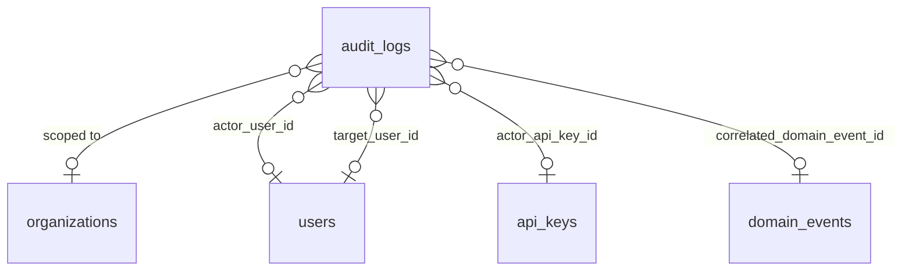
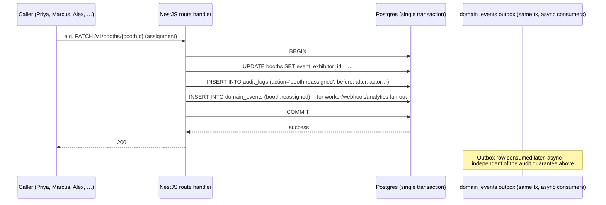

# 29 — Audit Logging Architecture

This document owns four things: the exact schema of `audit_logs` (foundation §7's "immutable
admin/security-relevant actions" table), the action-name taxonomy written into it, the mechanism that
guarantees it is append-only, and the two viewers built on top of it — the platform-wide viewer at
`/admin/audit-log` (Alex Kim only) and the org-facing viewer at `/org/[orgSlug]/settings/audit-log`
(gated by `entitlement:audit_log_access`). It is the single source of truth for **what gets written,
in what shape, for how long, and who can read it back**. It explicitly does not own: the
role→permission matrix that decides *whether* an action is allowed in the first place
([28-permission-model.md](28-permission-model.md) §3–6); the transactional outbox and domain-event
catalog used for cross-service fan-out to workers, webhooks, and analytics
([25-event-pipeline.md](25-event-pipeline.md)); column-level DDL and RLS policy syntax for every table
including this one ([16-database-schema.md](16-database-schema.md)); the broader retention/DSAR
framework for every other entity in the system ([38-data-retention-privacy-compliance.md](38-data-retention-privacy-compliance.md));
or OTel span/log correlation mechanics ([31-observability.md](31-observability.md)). This document
defines the audit-specific retention, redaction, and write-path rules that those documents' general
machinery must accommodate.

## 1. Scope Principle: Admin/Security-Relevant, Not Business Data

Foundation §7 characterizes `audit_logs` as holding "immutable admin/security-relevant actions" —
that one-liner is the scoping test applied throughout this document. `audit_logs` is **not** a
general-purpose change-history table for every mutation in the system. Ordinary business-data writes
(a lead's stage advancing, a product description edit, an agenda session's abstract being reworded) are
already tracked where they belong: `created_at`/`updated_at` on the row itself, and — where other
systems need to react — a `domain_events` row ([25-event-pipeline.md](25-event-pipeline.md)). Writing
those to `audit_logs` too would do two harmful things: flood the platform viewer with noise that
drowns out genuinely security-relevant rows, and — more seriously — turn `audit_logs` into an
unintended side channel around the strongest tenancy boundary in the system. Per
[28-permission-model.md](28-permission-model.md) §3.7 and §6.4, **no organizer role — including
`platform:admin` outside a declared support action — ever holds `leads:read`**. If a `lead.updated`
action were audit-logged with a full before/after payload, Alex's cross-tenant platform viewer would
casually re-open exactly the boundary §6.4 goes out of its way to close with a separate, coarser,
counts-only permission (`analytics:read`). **D-AUDIT-1 — audit_logs never contains business-entity
content** (leads, lead notes, registrations, meetings, products, agenda sessions, KB content,
messages). It contains only actions on the control-plane surface: identity, tenancy structure, floor
assignment, publish lifecycle, live-day overrides, platform support actions, and
security-credential lifecycle. §6 and §7 enumerate the boundary exhaustively in both directions.

## 2. `audit_logs` Schema

| Column | Type | Nullable | Notes |
|---|---|---|---|
| `id` | `uuid` (UUIDv7) | No | Time-ordered PK, per foundation §9 ID convention |
| `organization_id` | `uuid` FK → `organizations` | Yes | RLS scope anchor. Null only for the narrow set of actions with no tenant anchor at all (e.g. `user.sessions_revoked_all` — a platform action against a global `users` row); see §3 |
| `actor_type` | `enum('user','api_key','system')` | No | `system` covers worker-originated actions taken with no human request in flight (none currently required — reserved, see §6) |
| `actor_user_id` | `uuid` FK → `users`, `ON DELETE SET NULL` | Yes | Null when `actor_type != 'user'`, or after the actor's account is hard-deleted (DSAR erasure) — see D-AUDIT-3 |
| `actor_display_name` | `text` | No (empty string if system) | **Denormalized snapshot** of the actor's name at write time — survives account deletion so the row remains legible |
| `actor_display_email` | `text` | No (empty string if system) | Same snapshot rationale |
| `actor_role` | `text` | Yes | The canonical role string ([00-foundation.md](00-foundation.md) §8) the actor held *in the scope of this action* at write time, e.g. `org:owner`, `platform:admin` |
| `actor_api_key_id` | `uuid` FK → `api_keys`, `ON DELETE SET NULL` | Yes | Set when `actor_type = 'api_key'` |
| `target_user_id` | `uuid` FK → `users`, `ON DELETE SET NULL` | Yes | The user *affected* by the action when different from the actor — role changes, membership removal, session revocation, impersonation target |
| `action` | `text` | No | Taxonomy string, §4 |
| `resource_type` | `text` | No | Singular snake_case, drawn from foundation §7 entity names (or the small audit-only set in §4) |
| `resource_id` | `uuid` | Yes | Null for actions with no single resource anchor (rare — none in the §6 registry currently need this, reserved for completeness) |
| `batch_id` | `uuid` | Yes | Groups rows written by one bulk operation (§5) so the viewer can collapse them |
| `before` | `jsonb` | Yes | **Changed-field subset only**, not a full row snapshot — see D-AUDIT-2 |
| `after` | `jsonb` | Yes | Same shape as `before` |
| `reason` | `text` | Yes | Operator-supplied justification. Application-layer-required (not a DB constraint) for the specific actions flagged "reason required" in §6 |
| `ip_address` | `inet` | Yes | Actor's request IP; null only for `actor_type = 'system'` rows |
| `user_agent` | `text` | Yes | Null for API-key calls and system rows |
| `request_id` | `uuid` | No | Correlates to the OTel trace ([31-observability.md](31-observability.md)) covering the request that produced this row |
| `correlated_domain_event_id` | `uuid` FK → `domain_events` | Yes | Set when the same business fact also produced a `domain_events` row (e.g. `booth.reassigned`); lets the viewer cross-link without making audit writes depend on outbox delivery |
| `metadata` | `jsonb` | Yes | Action-specific extra context that doesn't fit `before`/`after` (e.g. an impersonation session's target org name, a bulk import's row count) |
| `created_at` | `timestamptz` | No | `DEFAULT now()`. **Deliberate deviation from foundation §11's "every table has `created_at`/`updated_at`"**: an append-only table is by definition never updated, so `updated_at` would be a column that is always equal to `created_at` and misleads readers into thinking edits are possible. Stated here, not silently dropped. |

Indexes: `(organization_id, created_at DESC)` for the org-facing viewer's default sort;
`(actor_user_id, created_at DESC)`; `(resource_type, resource_id)`; `(action)`; `(batch_id)` partial
index `WHERE batch_id IS NOT NULL`. Column-level RLS policy syntax is
[16-database-schema.md](16-database-schema.md)'s to write, but the policy shape mirrors foundation §8:
`organization_id = current_setting('app.current_org_id')` for tenant reads, with the platform-scope
branch (no `app.current_org_id` set) admitting cross-tenant reads exactly as
[28-permission-model.md](28-permission-model.md) §9 describes for every other platform-readable table.

**D-AUDIT-2 — `before`/`after` store the changed-field subset, not full-row snapshots.** A `PATCH` on
`organizations` that changes only `slug` writes `before: { slug: "techexpo-25" }`, `after: { slug:
"techexpo-2025" }` — never the full organization row. Two reasons: it keeps rows small and fast to
index regardless of how wide the parent table is, and it avoids incidentally capturing unrelated
fields (billing contact emails, branding asset IDs) that happened to be present on the row at write
time but are irrelevant to the audited change and would otherwise widen the table's effective PII
surface for no benefit.

## 3. Actor, Resource & Scope Model

Every row has exactly one **actor** (§2) and exactly one **scope anchor** for RLS
(`organization_id`). The scope anchor is the tenant *whose control-plane changed* — not necessarily
the actor's own organization. Two examples that make the distinction concrete:

- Marcus (`event:staff`, organizer org) reassigns a booth: `organization_id` = the **organizer**
  org's id (the org whose `booths` row changed), `actor_user_id` = Marcus.
- Alex starts an impersonation session to help Elena's team debug a listing: `organization_id` = the
  **target exhibitor org's** id (per §6's transparency decision below), `actor_user_id` = Alex,
  `target_user_id` = the impersonated user.

`organization_id` is null only for actions with no tenant to anchor to at all: `user.sessions_revoked_all`
is issued against a `users` row directly and a user can belong to several organizations
simultaneously, so no single `organization_id` is correct. These null-scope rows are visible only in
the platform viewer (§9) — they cannot appear in any org-facing viewer query because that query is
always `WHERE organization_id = :own_org_id`.

**D-AUDIT-3 — actor identity survives account deletion via denormalized snapshot, not live join.**
`actor_display_name`/`actor_display_email` are written once, at insert time, and never re-read from
`users`. When a user's account is hard-deleted (DSAR erasure, owned by
[38-data-retention-privacy-compliance.md](38-data-retention-privacy-compliance.md)), `actor_user_id`
and `target_user_id` are set null by the FK's `ON DELETE SET NULL`, but the row remains fully legible
— "jamal.carter@… (Booth Sales Rep) removed a membership" stays true and readable forever, which is the
entire point of an audit trail surviving the subject of one of its own rows. This is the audit-specific
mechanism doc 38 needs to reconcile erasure with immutability; doc 38 owns the DSAR workflow that
triggers the deletion, this document owns what happens to `audit_logs` when it does.

## 4. Action Taxonomy

**Decision: mirror the domain-event `noun.verb_past` convention (foundation §11) for syntax, but
maintain an independent, audit-specific registry — not a reuse of `domain_events` rows.**

Foundation §11 already fixes `noun.verb_past` (`lead.captured`, `booth_visit.recorded`) as the
platform's one convention for naming a thing that happened. Inventing a second grammar for audit
actions — `AUDIT_ROLE_CHANGE` or `role-changed` or any other shape — would mean every engineer carries
two mental models for "name a past event" instead of one, for no benefit; the syntax is free to reuse
and worth reusing.

What is *not* reused is the underlying catalog. `domain_events` (doc 25) exists to fan business facts
out to workers, webhooks, and analytics — its catalog is scoped to what those consumers need, and it
is written asynchronously through a transactional outbox (eventually consistent by design: a worker
can be down for minutes without anything being lost, because the outbox row just waits). `audit_logs`
exists to answer "who did this and can we prove it" for a narrower, more security-centric set of
actions (§1), and — critically — it is written **synchronously in the same transaction as the action
itself** (§5), because an audit row that might not exist yet when the caller gets a `200` is not a
trustworthy audit trail. A single business fact can legitimately produce *both* a `domain_events` row
and an `audit_logs` row (booth reassignment does — see `correlated_domain_event_id` in §2), and many
audit actions have **no** domain-event counterpart at all because nothing outside security tooling
needs to react to them (`impersonation_session.started` fans out to nobody; it only needs to be
provable after the fact).

`resource_type` values are the singular form of a foundation §7 entity name wherever a persisted
entity exists (`organization`, `event`, `booth`, `webhook_endpoint`, `api_key`, …), plus a small,
closed set of audit-only pseudo-resources for control-plane concepts that are not themselves a
foundation §7 table: `impersonation_session` and `entitlement_override`. Both represent a real
lifecycle (start/end, grant/revoke) worth naming distinctly in the taxonomy even though neither owns a
row anywhere outside `audit_logs` itself.

## 5. Write Path & Immutability Guarantee

**The write is synchronous and transactional, not derived from the domain-event outbox.** Every
control point in §6 calls a shared `AuditService.record(entry)` from inside the same NestJS service
method that performs the mutation, inside the same Postgres transaction. If the transaction commits,
the audit row exists; if it rolls back, neither the mutation nor its audit row does. This is the one
place this document's design deliberately diverges from doc 25's default "everything async through
the outbox" pattern for mutations — and the divergence is the point: an audit trail that could be
silently dropped by a crashed consumer between "action succeeded" and "audit row written" is not a
trail feature S4/S5 or any compliance buyer would trust.

**Immutability is enforced at three layers, deliberately redundant:**

1. **Grants.** The application database role used by the API and worker services holds `INSERT` and
   `SELECT` on `audit_logs` — never `UPDATE` or `DELETE`. No apparent application code path can issue
   either statement even if a bug tried to.
2. **Trigger.** A `BEFORE UPDATE OR DELETE` trigger on `audit_logs` unconditionally `RAISE EXCEPTION`s.
   This is defense-in-depth against a misconfigured grant (a bad migration, a future role change) —
   the trigger cannot be bypassed by any connection using the standard application role, only by a
   superuser/migration role that never runs application code.
3. **No soft-delete column.** There is deliberately no `deleted_at` — a soft-delete is a mutation, and
   this table has none. The only process that ever removes rows is the retention purge (§8), which
   runs as a scheduled, privileged job outside the application's ORM path entirely, not a `DELETE`
   issued by a service method.

This is the mechanism referenced by feature **S4** ([08-feature-matrix.md](08-feature-matrix.md)
§4.19, "Platform audit log viewer | Query `audit_logs` across tenants") — S4 can promise its viewer
shows a trustworthy, tamper-evident record precisely because the three layers above exist beneath it.

There is no `POST /v1/audit-logs` route anywhere in [18-api-architecture.md](18-api-architecture.md)
§5 — only the two `GET` routes covered in §9–10 below. The API surface itself has no mutation path for
this resource; that omission is not an oversight, it is the contract-level expression of the same
guarantee.

## 6. What MUST Be Logged

Every row below is written synchronously per §5. "Reason required" means the application layer
rejects the request with a `422` if `reason` is omitted — enforced in the service method, not a DB
constraint (a DB-level `CHECK` can't distinguish which actions need it without a large `CASE`, and the
service method already has the context cheaply).

### 6.1 Identity & access

| Action | Trigger (route / permission, [18-api-architecture.md](18-api-architecture.md)) | `resource_type` | `before`/`after` | Reason required |
|---|---|---|---|---|
| `organization_membership.role_changed` | `PATCH …/memberships/{id}` — `memberships:update` (§5.2) | `organization_membership` | `{ role }` | No |
| `organization_membership.removed` | `DELETE …/memberships/{id}` — `memberships:remove` (§5.2) | `organization_membership` | `before: { role }`, `after: null` | No |
| `event_staff.assigned` / `.role_changed` / `.removed` | `POST`/`PATCH`/`DELETE …/event-staff` — `event_staff:manage` (§5.3) | `event_staff` | `{ role }` | No |
| `exhibitor_staff.assigned` / `.role_changed` / `.removed` | `POST …/invites`, `PATCH`/`DELETE …/exhibitor-staff` — `exhibitor_staff:invite`/`:manage` (§5.5) | `exhibitor_staff` | `{ role }` | No |
| `user.sessions_revoked_all` | `POST /v1/admin/users/{userId}/sessions/revoke-all` — `platform:admin` (§5.14) | `user` | `metadata: { sessionCount }` | **Yes** |
| `organization.status_changed` | `PATCH /v1/admin/organizations/{orgId}/status` — `platform:admin` (§5.14) | `organization` | `{ status: suspended\|active }` | **Yes** |

### 6.2 Tenant identity

| Action | Trigger | `resource_type` | `before`/`after` | Reason required |
|---|---|---|---|---|
| `organization.slug_changed` | `PATCH /v1/organizations/{orgId}` — `organizations:update` (§5.2, explicitly "slug change audited") | `organization` | `{ slug }` | No |
| `event.slug_changed` | `PATCH /v1/events/{eventId}` — `events:update` (§5.3) | `event` | `{ slug }` | No |

Both slugs are load-bearing for path-based tenant/event resolution (foundation §5) — a silent slug
change would break every bookmarked and previously-shared URL, which is exactly the kind of
low-frequency, high-blast-radius action this table exists to make provable after the fact.

### 6.3 Floor & booths

| Action | Trigger | `resource_type` | `before`/`after` | Reason required |
|---|---|---|---|---|
| `floor_plan.replaced` | `POST /v1/venues/{venueId}/floor-plans` during re-anchor ([05-organizer-journey.md](05-organizer-journey.md) O-3 edge case) | `floor_plan` | `metadata: { previousFloorPlanId, boothsReanchored }` | No |
| `booth.assigned` / `.reassigned` / `.unassigned` | `PATCH /v1/booths/{boothId}` where the assignment field is written — `booths:assign` specifically, not the general `booths:manage` (§5.4; the split is deliberate per [28-permission-model.md](28-permission-model.md) §3.3) | `booth` | `{ event_exhibitor_id }` | No |

O-3 states plainly: "Every assignment change is audit-logged" — this is that requirement, scoped to
exactly the `booths:assign` permission boundary doc 28 already drew for the same reason (a
contractual/billing-adjacent action, not routine floor drawing).

### 6.4 Event lifecycle

| Action | Trigger | `resource_type` | `before`/`after` | Reason required |
|---|---|---|---|---|
| `event.published` | `POST /v1/events/{eventId}/publish` — `events:publish` (§5.3) | `event` | `{ status: draft→published }` | No |
| `event.unpublished` | Publish reversal within the zero-registration grace window (O-6) | `event` | `{ status: published→draft }` | No |
| `event.registration_closed` | The O-6 post-grace-window "unpublish" substitute | `event` | `{ status }` | No |
| `event.gone_live` | Operator-confirmed `published→live` transition (O-8 step 0) | `event` | `{ status }` | No |
| `event.completed` | `POST …/complete` — close-out (O-9) | `event` | `{ status }` | No |
| `event.archived` | `POST …/archive` (O-10) | `event` | `{ status }` | No |

### 6.5 Live-day status overrides

| Action | Trigger | `resource_type` | `before`/`after` | Reason required |
|---|---|---|---|---|
| `booth.status_overridden` | Marcus closes/reopens a booth mid-event ([05-organizer-journey.md](05-organizer-journey.md) O-8 §4b) | `booth` | `{ status }` | **Yes** |
| `agenda_session.cancelled` / `.moved` | Live-edit of a `live`-event agenda session, incl. capacity-triggered room swaps (O-5 edge case, O-8 §4b) | `agenda_session` | `{ status }` or `{ room_id }` | **Yes** |
| `checkin_station.paused` / `.resumed` | O-8 §4b, pausing a physical check-in station | `checkin_station` | `{ status }` | **Yes** |

O-8 §4 is explicit: "(c) every override is written to `audit_logs` with actor + reason" — this section
is that sentence expanded into a concrete table. Announcements (O-8 §4a) are the one adjacent action
*not* included here — see §7.

### 6.6 Platform support & entitlements

| Action | Trigger | `resource_type` | `before`/`after` | Reason required |
|---|---|---|---|---|
| `impersonation_session.started` | Alex begins a read-only "view as" session (feature **S2**, [08-feature-matrix.md](08-feature-matrix.md) §4.19) | `impersonation_session` | `metadata: { targetUserId, targetOrgId }` | **Yes** |
| `impersonation_session.ended` | Session ends (explicit exit or idle timeout) | `impersonation_session` | `metadata: { durationSeconds }` | No |
| `entitlement_override.granted` / `.revoked` | Manual provisioning (feature **Q2**, [08-feature-matrix.md](08-feature-matrix.md) §4.17) — Alex grants/revokes a plan, tier, or individual entitlement key outside the normal Stripe flow | `entitlement_override` | `{ entitlementKey, value }` | **Yes** |

**Reconciling S2 with §5.14/§9.3.** [08-feature-matrix.md](08-feature-matrix.md) commits to S2
("Read-only impersonation… Audited 'view as' without write ability," M2, P1) as a real, in-scope
feature. [18-api-architecture.md](18-api-architecture.md) §5.14 and
[28-permission-model.md](28-permission-model.md) §9.3 both currently describe Phase 1 as excluding
impersonation entirely, citing "audit and consent complexity" as the blocker. This document resolves
that tension rather than leaving it standing: the audit mechanics above — synchronous write (§5),
mandatory reason, and the transparency rule immediately below — are precisely the "audit complexity"
those two documents flag as outstanding. **D-AUDIT-4**: S2 ships gated on exactly this logging
contract; doc 18 §5.14 and doc 28 §9.3 should be updated on their next revision to reflect that the
blocker they name is resolved here, rather than continuing to describe impersonation as categorically
deferred. Until that edit lands, this document's position is authoritative for *what gets logged if
S2 ships on its committed M2 milestone* — which is what this document is for.

**Transparency rule — impersonation is logged into the target org's own trail, not just the platform's.**
`impersonation_session.*` rows are written with `organization_id` = the **impersonated user's**
organization (not a null/platform-only scope), so an enterprise customer with
`entitlement:audit_log_access` sees in their *own* org-facing viewer exactly when Alex looked at their
tenant and why (`reason`) — consistent with foundation §1's product principle "earn enterprise trust":
proving restraint is only meaningful if the customer can see the proof themselves, not just Alex's own
employer.

### 6.7 Webhooks & API keys (enterprise)

| Action | Trigger | `resource_type` | `before`/`after` | Reason required |
|---|---|---|---|---|
| `webhook_endpoint.created` / `.updated` / `.deleted` | §5.13 — `webhooks:manage` | `webhook_endpoint` | `{ url, event_types }` | No |
| `webhook_endpoint.secret_rotated` | `POST …/rotate-secret` — `webhooks:manage` (§5.13) | `webhook_endpoint` | `metadata: { oldSecretValidUntil }` — **never the secret value itself** | No |
| `api_key.created` / `.rotated` / `.revoked` | §5.13 — `api_keys:manage` | `api_key` | `metadata: { lookupPrefix }` — the stored 12-char prefix only ([18-api-architecture.md](18-api-architecture.md) §8), **never the secret** | No |

**D-AUDIT-5 — credential material never enters `before`/`after`.** Both rows above carry a
`before`/`after` shape that is deliberately incapable of holding secret bytes: webhook secrets and API
key secrets are never persisted anywhere in plaintext outside the moment they're shown once at
creation ([18-api-architecture.md](18-api-architecture.md) §8), and `audit_logs` is no exception to
that rule — logging *that* a rotation happened, when, and by whom is the security-relevant fact;
logging the secret would create a second place a leak could originate from.

## 7. What Is Deliberately Not Logged

Stated explicitly so nothing on this list is later added by accident under a mistaken reading of
"exhaustive" in §6's brief:

| Not logged | Why |
|---|---|
| Any `leads`, `lead_notes`, `registrations`, `meetings`, `products`, `event_product_listings`, `agenda_sessions`, `kb_*`, `ai_conversations`/`ai_messages` mutation | Business data, not control-plane (§1/D-AUDIT-1). Traceable via the entity's own timestamps and, where cross-system reaction is needed, `domain_events` (doc 25) |
| Routine `booths:manage` edits (drawing, resizing, renumbering) | Only the `booths:assign` action (§6.3) carries admin/security weight; free-form floor drawing does not |
| `PATCH` on `event_exhibitors` for exhibitor-owned profile fields (`exhibitor_profile:update`) | Business content, same reasoning as row 1 — organizer-owned fields (`event_exhibitors:update`, tier/booth/status) are likewise business-workflow state, not control-plane, except where they resolve to a `booth.reassigned` row already covered in §6.3 |
| Announcements (O-8 §4a) | A broadcast send, not a state override; already tracked end-to-end by the notification service's own delivery log ([33-notification-system.md](33-notification-system.md)) — duplicating that into `audit_logs` would be the exact noise §1 warns against |
| Billing/subscription state transitions (checkout, proration, dunning, tier purchase) | Owned end-to-end by Stripe's own audit trail plus [36-billing-and-payments-architecture.md](36-billing-and-payments-architecture.md)'s webhook-driven subscription history; a second parallel ledger for the same facts would drift and add no signal. The one exception is `entitlement_override.*` (§6.6), because that path is the one place entitlements change *outside* Stripe |
| Any `GET`/read request | Reads are not state changes; access-pattern logging (who *viewed* what) is a distinct capability from this document's scope and is not built in Phase 1 — see below |
| CSV bulk imports of business records (exhibitor rosters, registrations) | Business data creation, already traceable via the async `jobs` resource ([18-api-architecture.md](18-api-architecture.md) §5.15) that ran the import and the `event_exhibitor.invited`/equivalent domain events it emits |

**Read-access logging (who viewed a resource, as opposed to who changed it) is explicitly out of
scope for Phase 1.** It is a materially different system — the write volume of "every `GET`" dwarfs
control-plane mutations by orders of magnitude and would need its own sampling/retention posture
entirely separate from this table's 7-year, every-row guarantee (§8). Tracked as a revisit item in
[44-future-expansion-plan.md](44-future-expansion-plan.md).

## 8. Retention & Purge

**Decision: 7 years from `created_at`, then hard-deleted.** Seven years aligns with the longest common
enterprise-contract and SOC 2 Type II examiner expectation this platform is likely to face at the
`enterprise` tier (feature-matrix §3's `entitlement:audit_log_access` is enterprise-only for exactly
this population), without committing to indefinite storage growth on a table that, per §6, is
write-heavy relative to most tenant tables (every role change, every override, every impersonation
session, forever).

Purge runs as a scheduled worker job (`audit-log-purge` queue, kebab-case per foundation §11's queue
naming convention), owned operationally by
[27-background-jobs-architecture.md](27-background-jobs-architecture.md), on a nightly cadence,
batch-deleting rows past the 7-year threshold directly via the privileged migration-tier database role
described in §5 — never through the application ORM path, and never through a route on the public or
internal API (there is none, §5). The purge job's own execution (rows-deleted count, batch duration) is
recorded in the platform's operational logs ([31-observability.md](31-observability.md)), **not** back
into `audit_logs` itself — logging "row X was purged" into the same table the purge is trying to bound
would defeat the retention policy's purpose and grow the table it's meant to cap.

**Erasure interaction.** Per §3/D-AUDIT-3, a user's hard-deletion (DSAR erasure,
[38-data-retention-privacy-compliance.md](38-data-retention-privacy-compliance.md)) does not delete or
redact that user's audit rows — it nulls `actor_user_id`/`target_user_id` via `ON DELETE SET NULL` and
leaves the denormalized `actor_display_name`/`actor_display_email` snapshot intact. This is a
deliberate GDPR posture, not an oversight: audit records documenting *who did what to a tenant's
control plane* are retained on a legitimate-interest/legal-obligation basis (GDPR Art. 6(1)(f) /
Art. 17(3)(b) — necessary for establishing legal claims and demonstrating compliance), independent of
the erasure of the acting user's own account elsewhere in the system. Doc 38 owns the DSAR execution
workflow; this is the specific carve-out that workflow must honor when it reaches `audit_logs`.

**Extended/contractual retention beyond 7 years** (a specific enterprise customer's legal-hold or
longer-than-default contractual audit requirement) is not built in Phase 1 — assigned to
[44-future-expansion-plan.md](44-future-expansion-plan.md) as a per-tenant retention override, revisit
criterion: first enterprise contract that requires it.

## 9. Platform Audit Log Viewer — `/admin/audit-log`

Alex-only ([00-foundation.md](00-foundation.md) §3, `platform:admin`), backed by
`GET /v1/admin/audit-logs` ([18-api-architecture.md](18-api-architecture.md) §5.14). This is feature
**S4** ([08-feature-matrix.md](08-feature-matrix.md) §4.19, M1, P1) — it ships early, ahead of the
org-facing viewer, because internal accountability doesn't wait on the `entitlement:audit_log_access`
commercial gate that governs the customer-facing one.

| Capability | Behavior |
|---|---|
| Tenant scope | Cross-tenant by default; no `organization_id` filter required. Null-scope rows (§3) are visible only here |
| Filters | `filter[organization_id]`, `filter[actor_user_id]` (or email substring search against the denormalized snapshot — works even for deleted users, per D-AUDIT-3), `filter[action]` (taxonomy autocomplete, §4), `filter[resource_type]`, `filter[resource_id]`, `filter[batch_id]`, `filter[created_at][gte\|lte]` |
| Row detail | Full drawer: `before`/`after` rendered as a structured diff, `ip_address`, `user_agent`, `reason`, and `request_id` deep-linked to the corresponding OTel trace in Grafana ([31-observability.md](31-observability.md)) |
| Grouping | Rows sharing a `batch_id` collapse into one expandable group |
| Export | Async `job` (kind `export`, [18-api-architecture.md](18-api-architecture.md) §5.15) → CSV or JSON, no row cap within the 7-year retention window, signed S3 download URL |

## 10. Org-Facing Audit Log Viewer — `/org/[orgSlug]/settings/audit-log`

Gated by `entitlement:audit_log_access` (`enterprise` plan only, [08-feature-matrix.md](08-feature-matrix.md)
§3), visible to `org:owner`/`org:admin` per `audit_logs:read`
([28-permission-model.md](28-permission-model.md) §3.1). This is feature **S5**
([08-feature-matrix.md](08-feature-matrix.md) §4.19, M4, P2) — it ships with the rest of the
enterprise/monetization milestone, alongside SSO and the public API. Backed by
`GET /v1/organizations/{orgId}/audit-logs` ([18-api-architecture.md](18-api-architecture.md) §5.2).

| Capability | Behavior |
|---|---|
| Tenant scope | Hard-scoped to the caller's own `organization_id` via RLS — the route cannot return another tenant's rows regardless of query params |
| Filters | `filter[actor_user_id]` (own-org members only, resolved from `organization_memberships`), `filter[action]`, `filter[created_at][gte\|lte]` — matches [18-api-architecture.md](18-api-architecture.md) §5.2's stated query params exactly |
| Row detail | Same diff view as §9, minus the OTel trace deep-link (internal tooling, not exposed to tenants) |
| Included rows | Everything in §6 scoped to this org, **including** `impersonation_session.*` rows where this org was the target (the §6.6 transparency rule) |
| Export | Async `job` → **CSV only** (no JSON — this is a self-serve compliance-export surface, not a programmatic integration one; enterprise customers wanting programmatic access use the public API's `audit_logs:read` scope instead, §11). Query window capped at a trailing 12 months per export request to bound query cost against the 7-year retention window; older ranges are fetched with additional requests |

Per the "gates fail closed but visible" rule
([28-permission-model.md](28-permission-model.md) §6.3, [08-feature-matrix.md](08-feature-matrix.md)
§5 rule 2), an organizer on `launch`/`professional` sees this settings page in the nav in a **locked**
state with an upgrade prompt — never a 404 — consistent with every other entitlement-gated surface in
the product.

## 11. Viewer Comparison

| | Platform viewer (`/admin/audit-log`) | Org-facing viewer (`/org/[orgSlug]/settings/audit-log`) |
|---|---|---|
| Audience | Alex Kim only | `org:owner` / `org:admin`, `enterprise` plan |
| Ships | M1, P1 (S4) | M4, P2 (S5) |
| Scope | Cross-tenant, unrestricted | Own org only (RLS-enforced) |
| Route | `GET /v1/admin/audit-logs` | `GET /v1/organizations/{orgId}/audit-logs` |
| Includes null-scope rows | Yes | N/a (cannot exist in this scope) |
| Includes impersonation targeting this org | Yes | Yes (transparency rule, §6.6) |
| OTel trace deep-link | Yes | No |
| Export formats | CSV, JSON | CSV only |
| Export row cap | None (within 7-yr retention) | 12-month window per request |

`api_keys:manage`'s scoped-key mechanism ([28-permission-model.md](28-permission-model.md) §4)
explicitly **forbids** `audit_logs:read` from ever being bound to an API key — a leaked key must never
be able to read a tenant's own security history. Programmatic access to org-facing audit data is
therefore not available via the public API in Phase 1; the CSV export in §10 is the only automatable
path, and it requires an interactive session, not a key.

## 12. Worked Example

**Priya suspects a former employee's access wasn't fully revoked, and asks Alex for help.** Alex opens
`/admin/audit-log`, filters `organization_id` to Priya's org and `action` to
`organization_membership.removed`, and confirms the removal row exists with the correct
`created_at`. To go further, Alex starts a read-only impersonation session against Priya's org to look
at her current member list — this action itself writes `impersonation_session.started` with
`organization_id` = Priya's org, `reason: "Investigating access-revocation report from customer"`
(required per §6.6), `target_user_id` = Priya. The moment the session ends,
`impersonation_session.ended` is written. Priya, back in her own `/org/[orgSlug]/settings/audit-log`
(she is on `enterprise`), sees both rows in her own trail without needing to ask Alex what happened —
the transparency rule (§6.6) means she has independent, tamper-evident proof of exactly what was
looked at and why, satisfying the same "earn enterprise trust" principle that motivated building this
document's viewers in the first place.

## Ownership

This document is the single source of truth for: the `audit_logs` schema (§2), the action-name
taxonomy and its relationship to `domain_events` (§4), the append-only enforcement mechanism (§5), the
exhaustive registry of what must and must not be written (§6–7), the 7-year retention/purge policy and
its DSAR interaction (§8), and the capability boundary between the platform and org-facing viewers
(§9–11). It is consumed by, and must stay consistent with, feature rows S4/S5 in
[08-feature-matrix.md](08-feature-matrix.md) §4.19, the `audit_logs:read` permission definition in
[28-permission-model.md](28-permission-model.md) §3.1, and the two `GET …/audit-logs` routes in
[18-api-architecture.md](18-api-architecture.md) §5.2/§5.14. RLS policy SQL implementing §2's scope
column is [16-database-schema.md](16-database-schema.md)'s responsibility; the purge job's scheduling
and operational ownership is [27-background-jobs-architecture.md](27-background-jobs-architecture.md)'s;
the DSAR erasure workflow that §8 must accommodate is
[38-data-retention-privacy-compliance.md](38-data-retention-privacy-compliance.md)'s; and the broader
threat model this table's isolation guarantees sit inside is
[43-security-architecture.md](43-security-architecture.md)'s.

## Related Documents

- [00-foundation.md](00-foundation.md) — canonical entity registry (§7), roles (§8), naming
  conventions (§11) this document extends
- [05-organizer-journey.md](05-organizer-journey.md) — O-3 (booth reassignment audit requirement),
  O-8 (live-day override audit requirement)
- [08-feature-matrix.md](08-feature-matrix.md) — features S2 (impersonation), S4/S5 (the two viewers),
  Q2 (entitlement overrides), `entitlement:audit_log_access` (§3)
- [16-database-schema.md](16-database-schema.md) — column-level DDL and RLS policy implementation
- [18-api-architecture.md](18-api-architecture.md) — the two `GET …/audit-logs` routes (§5.2, §5.14),
  webhook/API-key routes this document's §6.7 logs (§5.13)
- [25-event-pipeline.md](25-event-pipeline.md) — the `domain_events` outbox this document's taxonomy
  deliberately does not reuse (§4)
- [27-background-jobs-architecture.md](27-background-jobs-architecture.md) — the retention purge job's
  scheduling and queue ownership
- [28-permission-model.md](28-permission-model.md) — `audit_logs:read` permission definition, the
  `leads:read` tenancy boundary this document's §1 protects, the entitlement-check semantics gating S5
- [31-observability.md](31-observability.md) — OTel trace correlation via `request_id`, the purge job's
  own operational logging
- [33-notification-system.md](33-notification-system.md) — the announcement delivery log that makes
  logging announcements into `audit_logs` redundant (§7)
- [36-billing-and-payments-architecture.md](36-billing-and-payments-architecture.md) — the Stripe-driven
  subscription history that makes duplicate billing audit rows redundant (§7)
- [38-data-retention-privacy-compliance.md](38-data-retention-privacy-compliance.md) — DSAR/erasure
  workflow this document's §3/§8 erasure carve-out must accommodate
- [43-security-architecture.md](43-security-architecture.md) — broader threat model and RLS review for
  the platform-scope read path in §9
- [44-future-expansion-plan.md](44-future-expansion-plan.md) — deferred: read-access logging (§7),
  per-tenant extended retention overrides (§8)
