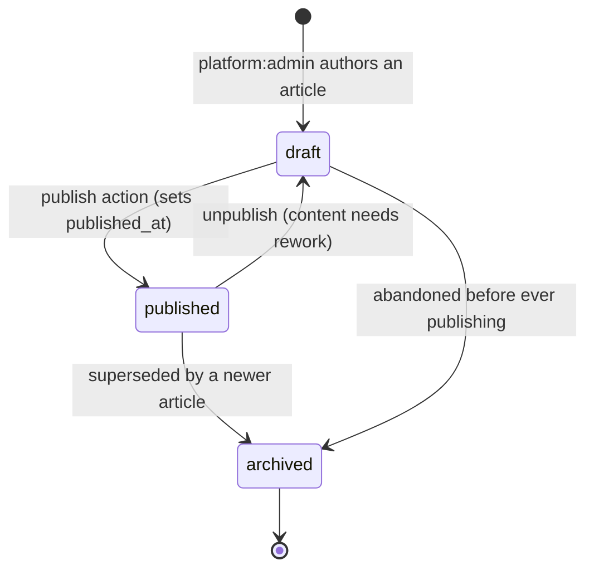
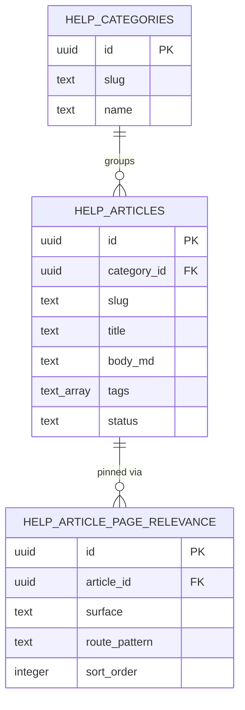
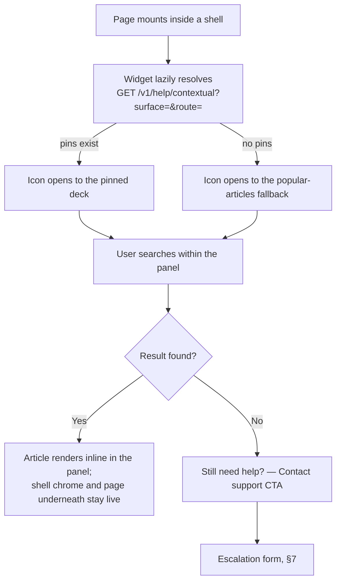
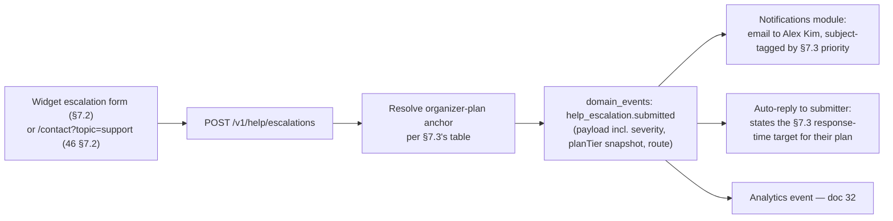

# Help Center and Support Architecture

This document owns the `help_categories`/`help_articles` content system introduced by [00-foundation.md](00-foundation.md) §14 Amendment A1: the category/article content model and its authoring lifecycle, per-surface contextual relevance tagging (which article pins as help on which route in [14-page-inventory.md](14-page-inventory.md)), the search-and-browse query layer that powers both the public `/help` entry and every in-app contextual surface, the in-app contextual help widget itself (trigger placement per shell, resolution algorithm, states), and the support escalation path for when self-serve content fails to resolve a question. It does **not** own: the `/help` page's shell, chrome, or block layout (that is [46-marketing-site.md](46-marketing-site.md) §8 — this document supplies the data the shell renders); the four authenticated shells' region structure (that is [13-application-layout.md](13-application-layout.md) — this document adds one affordance *into* an existing region, per the same content/structure split that document already establishes); the public `/contact` form (that is 46 §7 — this document's escalation path is the authenticated, context-aware sibling of it, reconciled in §7.5); email delivery mechanics, templates, and category taxonomy (that is [33-notification-system.md](33-notification-system.md), invoked here only at the point where an escalation fans out); or the AI-ingested, per-event knowledge base that grounds Expo Copilot (`kb_sources`/`kb_documents`/`kb_chunks`, owned by [23-knowledge-base-architecture.md](23-knowledge-base-architecture.md) and [22-rag-architecture.md](22-rag-architecture.md) — a deliberately separate system from Help Center, see §2.4).

---

## 1. Scope and Ownership

| This doc owns | Owned elsewhere |
|---|---|
| `help_categories`/`help_articles` content model, tags, lifecycle, authoring access | Column-level base schema for both tables (already specified) → [16-database-schema.md](16-database-schema.md) §9; this doc's two additions (§2.2, §3.2) extend that base |
| Per-surface/per-route contextual relevance tagging (`help_article_page_relevance`) | The route inventory being tagged against → [14-page-inventory.md](14-page-inventory.md); route existence/URL shape → [11-information-architecture.md](11-information-architecture.md) §4 |
| Search/browse query layer (`GET /v1/help/*`) and ranking | The `/help` page shell, blocks, and SEO → [46-marketing-site.md](46-marketing-site.md) §8 |
| In-app contextual help widget: trigger placement, resolution, states | Shell region *existence* (Header landmark) → [13-application-layout.md](13-application-layout.md) §2.1; shell region *content* for nav/breadcrumbs/bell → [12-navigation-structure.md](12-navigation-structure.md) |
| Support escalation form, routing rule, response-time expectations | Notification delivery, templates, channel taxonomy → [33-notification-system.md](33-notification-system.md); domain-event outbox mechanics → [25-event-pipeline.md](25-event-pipeline.md); the unauthenticated `/contact` escalation path → 46 §7 |
| — | Plan/tier names, capabilities, and the "Support" row's tier labels (Community/Priority/Dedicated+SLA) → [00-foundation.md](00-foundation.md) §4, rendered in 46 §5.2 |
| — | Per-event AI knowledge base (`kb_sources`/`kb_documents`/`kb_chunks`) grounding Expo Copilot | [23-knowledge-base-architecture.md](23-knowledge-base-architecture.md), [22-rag-architecture.md](22-rag-architecture.md) |

Help Center content is **platform-wide and org-agnostic**: one set of articles serves every tenant, every event, and unauthenticated visitors alike (foundation §7). This is the load-bearing distinction from the AI knowledge base, which is per-event, tenant-scoped, and ingested (§2.4) — the two systems share no tables and are never conflated in UI copy or code.

---

## 2. Content Model: Categories and Articles

### 2.1 `help_categories` (base schema, per [16-database-schema.md](16-database-schema.md) §9.1)

| Column | Type | Notes |
|---|---|---|
| `id` | `uuid` | PK |
| `slug` | `text NOT NULL` | unique; used in `/help?category=` (46 §2.1) |
| `name` | `text NOT NULL` | |
| `description` | `text` | |
| `sort_order` | `integer NOT NULL DEFAULT 0` | |

A flat list, not a tree — Concourse ships roughly a dozen categories (Getting Started, Organizer Console, Exhibitor Portal, Attendee App, Billing, AI Features, Troubleshooting, and a handful of persona-shaped others). A second nesting level was considered and rejected: at the article volume a Phase-1 Help Center actually carries (low hundreds of articles, not thousands), a category tree adds a navigation layer with no discoverability benefit and a second place content can go stale; `tags` (§2.2) does the cross-cutting work a subcategory would otherwise be asked to do, without forcing every article into exactly one branch of a hierarchy it may not cleanly fit.

### 2.2 `help_articles` — base schema plus this document's addition

Base columns are locked in [16-database-schema.md](16-database-schema.md) §9.2 (`id`, `category_id`, `slug`, `title`, `body_md`, `status`, `locale`, `view_count`, `published_at`, `search_vector`). This document adds one column, needed for the per-surface tagging in §3 to be discoverable and filterable by content type, and not yet present in that base schema:

| Column | Type | Notes |
|---|---|---|
| `tags` | `text[] NOT NULL DEFAULT '{}'` | Free-form, platform-admin-curated labels (`onboarding`, `billing`, `ai-features`, `troubleshooting`, persona slugs like `exhibitor-rep`). Indexed with a `GIN` index (`USING gin (tags)`) for `?tag=` filtering. Additive to an already-shipped table — adding a nullable-defaulted column never invalidates an existing row — so this is recorded here for [16-database-schema.md](16-database-schema.md) to fold into its next revision, the identical discipline [00-foundation.md](00-foundation.md) §7/§14 already used when 46 surfaced `legal_documents`/`legal_acceptances` (Amendment A2) after that document's needs became concrete. |

**Authoring format.** Articles are authored in MDX in the (internal, `platform:admin`-only) authoring tool — MDX's small, allow-listed component set (`<Callout>`, `<Screenshot>`, `<StepList>`) lets Alex Kim build structured how-to content without hand-rolled HTML. What persists in `body_md` is that MDX source verbatim; both the public `/help` page and the in-app widget parse it client-side with the same fixed, allow-listed renderer (no arbitrary embeds, no script execution — MDX is a trusted-author format here, not user-generated content, so this is a rendering-safety choice rather than a sanitization pipeline). `search_vector` is generated from `title || ' ' || body_md`, so raw MDX component tags leak a negligible amount of noise into FTS ranking — acceptable given the tag names themselves are topical (`callout`, `screenshot`) and never dominate ranking against real prose.

### 2.3 Article lifecycle



Only `published` articles are served on public routes and by the contextual widget's default queries (§5, §6) — enforced by the query (`WHERE status = 'published'`), not by RLS, matching [16-database-schema.md](16-database-schema.md) §9.2's stated reasoning that this content has no RLS-meaningful dimension. `archived` is retained, not deleted, so that stale contextual pins (§3) resolve to "this article was retired" rather than a dangling foreign key — the widget's resolution algorithm (§6.2) filters `archived` rows out at read time exactly as it filters `draft`.

### 2.4 Authoring access, and the Help Center / Knowledge Base boundary

Write access to `help_categories` and `help_articles` is `platform:admin`-only, an application-layer check per [16-database-schema.md](16-database-schema.md) §9.1/§9.2 — Alex Kim is the sole author of Help Center content in Phase 1. No organizer or exhibitor role can create, edit, or pin a help article; this is a deliberate, product-team-owned surface, distinct from:

- **`kb_sources`/`kb_documents`/`kb_chunks`** (foundation §7 "AI & knowledge") — per-*event* content (exhibitor profiles, agenda, uploaded docs) ingested and embedded to ground Expo Copilot's RAG answers. Organizer- and exhibitor-authored, tenant-scoped, owned by [23-knowledge-base-architecture.md](23-knowledge-base-architecture.md).
- **`help_categories`/`help_articles`** — platform-*wide* static documentation ("how do I assign a booth," "why is my export empty") authored once by the platform team and read by everyone.

The two are never merged into one search box (46 §8 already states this for the public page; §5.1/§6 restate it for the in-app case) — Copilot's citations are per-event and semantically retrieved; Help Center's results are deterministic keyword matches over a fixed corpus. Confusing them would make neither answer trustworthy in the way its own mechanism promises (foundation principle 2).

---

## 3. Per-Surface Contextual Relevance Tagging

### 3.1 Requirement

An article must be pinnable as contextual help on a specific route from [14-page-inventory.md](14-page-inventory.md) — e.g., the article "Understanding lead scores" pinned to `/exhibit/[orgSlug]/events/[eventSlug]/leads/[leadId]`, so Jamal Carter sees it without searching. This is a many-to-many relationship (one article can help on several routes; one route can have several pinned articles, ranked), which does not fit as a column on either existing table — it is a new, thin join entity.

### 3.2 `help_article_page_relevance` (new entity, this document's addition)

| Column | Type | Notes |
|---|---|---|
| `id` | `uuid` | PK |
| `article_id` | `uuid NOT NULL` | FK → `help_articles.id`, `ON DELETE CASCADE` |
| `surface` | `text NOT NULL` | `CHECK IN ('organizer_console','exhibitor_portal','attendee_app','platform_admin')` — the four canonical surfaces (foundation §12 glossary); marketing-site pins are unnecessary since `/help` already renders the full catalog (46 §8) |
| `route_pattern` | `text NOT NULL` | The route's canonical template string exactly as written in [14-page-inventory.md](14-page-inventory.md)/[11-information-architecture.md](11-information-architecture.md) §4 (e.g. `/exhibit/[orgSlug]/events/[eventSlug]/leads/[leadId]`) — matched by the frontend's own known route template at render time, never by fuzzy path parsing, so a rename of a dynamic segment in doc 11 is a one-line update here, not a regex rewrite |
| `sort_order` | `integer NOT NULL DEFAULT 0` | Ranks multiple pins on the same route |

**Constraints & indexes:** index on `(surface, route_pattern)` — the widget's one hot-path lookup. No `UNIQUE` constraint on `(article_id, surface, route_pattern)` is imposed at the database level beyond ordinary duplicate-prevention in the authoring UI, since a duplicate row is harmless (it would just render the same article twice, a UI bug the authoring tool prevents, not a data-integrity concern worth a constraint).
**RLS:** none — same reasoning as §9.1/§9.2 of [16-database-schema.md](16-database-schema.md); this table has no tenancy dimension.

Like `tags` (§2.2), this is an additive extension: a new child table introduces no risk to the two already-shipped tables and is recorded here for [16-database-schema.md](16-database-schema.md)'s next revision to formalize alongside them.



### 3.3 Worked examples

| Route (from doc 14) | Surface | Pinned article | Why |
|---|---|---|---|
| `/exhibit/[orgSlug]/events/[eventSlug]/leads/[leadId]` | `exhibitor_portal` | "Understanding lead scores" | Jamal Carter and Elena Rodriguez land here from every capture; the score/reason-codes UI (feature L1) is the single most-asked-about number in the product |
| `/exhibit/[orgSlug]/events/[eventSlug]/capture` | `exhibitor_portal` | "What happens if I lose signal while scanning" | Directly answers the offline write-queue behavior (13 §3.2.2) before it becomes a support question |
| `/org/[orgSlug]/events/[eventSlug]/floor-plan` | `organizer_console` | "Drawing your first floor plan", "Resolving booth-assignment conflicts" | Two articles, `sort_order` 1 and 2 — the floor-plan editor page has both an onboarding need and a recurring troubleshooting need |
| `/e/[eventSlug]/copilot` | `attendee_app` | "What Expo Copilot can and can't answer" | Sets Sofia Lindqvist's expectations before she asks a question the grounded RAG pipeline has no citation for |
| `/org/[orgSlug]/settings/billing` | `organizer_console` | "Understanding your plan and entitlements" | Ties directly to the `plans`/`subscriptions`/`entitlements` model (foundation §4) surfaced on that exact page |

---

## 4. Help API Surface

Routes follow [18-api-architecture.md](18-api-architecture.md) §3's conventions (plural kebab-case, cursor pagination on list routes, `problem+json` errors); as with 46 §7.3's contact endpoint, NestJS module placement (folded into a `HelpModule` vs. `PublicModule`) is an implementation detail for doc 18 to assign, not specified here.

| Route | Auth | Notes |
|---|---|---|
| `GET /v1/help/categories` | public | List `help_categories`, `sort_order` asc, with published-article counts |
| `GET /v1/help/articles` | public | `?category=`, `?tag=`, cursor-paginated; `published` only |
| `GET /v1/help/search` | public | `?q=` — Postgres FTS over `search_vector`; backs both 46 §8's public search hero and the in-app widget's search box (§6) |
| `GET /v1/help/articles/{slug}` | public | Full article body; fire-and-forget `view_count` increment |
| `GET /v1/help/popular` | public | Top-N by `view_count`; backs 46 §8's "Popular articles" block and the widget's no-pin fallback (§6.2) |
| `GET /v1/help/contextual` | any authenticated | `?surface=&route=` — resolves `help_article_page_relevance` pins for the caller's current shell/route (§6.2) |
| `POST /v1/help/escalations` | any authenticated | Body per §7.2; emits `help_escalation.submitted` (§7.4) |
| `POST`/`PATCH`/`DELETE /v1/admin/help/categories`, `.../help/articles`, `.../help/articles/{id}/page-relevance` | `role: platform:admin` | Authoring CRUD, under `AdminModule` per [18-api-architecture.md](18-api-architecture.md) §5.14's `/v1/admin/…` convention |

`GET /v1/help/search` and `GET /v1/help/articles?q=` are the same query path; `search` is kept as its own route because 46 §8 already names it explicitly as the public search hero's backing endpoint, and a stable, memorable path for the one most-hit read in the whole system is worth the trivial duplication with the general list route's `?q=` parameter.

---

## 5. Public Search & Browse Surface (`/help`)

[46-marketing-site.md](46-marketing-site.md) §8 owns the page: the search hero, category grid, popular-articles block, and fallback-to-`/contact` CTA are all specified there and are not repeated here. This document owns what those blocks call into.

### 5.1 Ranking

`GET /v1/help/search` ranks with Postgres FTS's `ts_rank_cd` against `search_vector`, with two deterministic tie-breakers applied after relevance: `published_at` descending (newer content wins ties) then `view_count` descending. No semantic reranking (`rerank-2.5`, foundation §6) is used here — that model is reserved for RAG retrieval (22-rag-architecture.md); Help Center search is deliberately a plain, explainable keyword match, consistent with 46 §8's explicit rejection of a second AI surface on the public page.

### 5.2 Browse

`GET /v1/help/categories` and `GET /v1/help/articles?category=` back the category grid; no separate "browse all" endpoint exists because an empty `?category=`/`?q=` on the articles route already returns the full published set, cursor-paginated — one endpoint, not two, for the identical reason 46 §2.1 treats query params as display-state rather than distinct pages.

---

## 6. In-App Contextual Help Widget

### 6.1 Trigger placement per shell

[13-application-layout.md](13-application-layout.md) §2.1 defines the Header region's landmark and states its default element set (breadcrumbs, search/palette trigger, notification bell, account menu) while explicitly reserving *what fills a region* to other documents (§1 of that doc). This document adds one more Header element — a help-icon trigger — following that identical split, the same way [12-navigation-structure.md](12-navigation-structure.md) supplies nav-tree content and the future [33-notification-system.md](33-notification-system.md) supplies the bell's content into regions doc 13 merely allocates space for.

| Shell | Placement | Notes |
|---|---|---|
| **ConsoleShell** | Header, adjacent to the notification bell | Visible at every breakpoint per 13 §3.1.2: full icon ≥`md`, collapses into the hamburger drawer's header alongside search/bell below `md`, identical collapse rule already governing those two elements |
| **PortalShell** | Header, adjacent to the notification bell (desktop); one of the four icons in the `<md` "slim bar" (search, help, bell, avatar) per 13 §3.2.1 | Same visibility as Console — Portal serves both Elena Rodriguez's desk workflow and Jamal Carter's at-booth phone workflow, and both need it |
| **AttendeeShell** | *No persistent header icon* — folded into `/profile` as a "Help & Support" section, plus inline "Learn more" chips on individual modules where a contextual pin exists (§3.3's Copilot example) | AttendeeShell's header is deliberately slim with no free icon slot (13 §3.3: greeting + bell on Home, back + title elsewhere) and its footer tab bar is a fixed five items that doc 12 has already closed to a sixth (13 §3.3, region table); adding a persistent icon would either crowd the header past its stated minimalism or require reopening the tab-bar count, and the fixed five-tab set is a locked decision this document does not reopen. A profile-anchored entry point plus inline chips reach every attendee need without altering either constraint. |
| **AdminShell** | *None* | Mirrors 13 §3.4's own stated rationale for omitting the notification bell — Alex Kim is the platform's single internal operator; ops issues route to on-call tooling, and self-serve product help is not the right model for the person who *is* the platform team. |

### 6.2 Resolution algorithm

```
function resolveWidgetContent(surface, routePattern):
    pins = SELECT ha.* FROM help_article_page_relevance hapr
           JOIN help_articles ha ON ha.id = hapr.article_id
           WHERE hapr.surface = surface
             AND hapr.route_pattern = routePattern
             AND ha.status = 'published'
           ORDER BY hapr.sort_order

    if pins is not empty:
        return { mode: "pinned", articles: pins }
    else:
        return { mode: "fallback", articles: topNByViewCount(N = 5) }
```

Deterministic pins always win when present — there is no scoring or relevance blending between pinned and popular content, so a content author can always guarantee what a given page shows. The fallback is identical data to 46 §8's "Popular articles" block, not a bespoke ranking, so the widget and the public entry page never disagree about what "popular" means.

### 6.3 Widget UX flow



The resolution call is lazy (fires on first widget open, not on every page load) — it is a Populated-state affordance, not primary page data, so it never competes with a route's own Loading skeleton (13 §5.1) for the user's attention.

### 6.4 Widget states

The widget is a panel/popover, not a routed page, so it does not implement the full five-state taxonomy of [13-application-layout.md](13-application-layout.md) §5 — it composes a narrower, panel-scoped subset:

| State | Behavior |
|---|---|
| Loading | Skeleton rows for the pinned/popular list, matching 13 §5.1's shape-preview principle at panel scale |
| Empty | Never a true dead end — "no pins" already falls back to popular articles (§6.2); a zero-result *search* clears to the fallback deck rather than a blank panel, the identical "search-empty is lighter than a true empty" distinction 13 §5.2 draws for full pages |
| Error | Inline retry within the panel; the rest of the page is unaffected (13 §5.3's scoped-widget-error pattern, applied at panel granularity) |
| Offline | **Blocking**, per default — Help Center content is not on JP-2's exhaustive offline-tolerant allowlist (13 §5.4's five named routes/queues), so no special-case cache exists for it; the panel shows "Help needs a connection — try again once you're back online" rather than a spinner |
| Populated | Pinned or fallback deck, search box, and the escalate CTA once a search misses |

---

## 7. Support Escalation Path

### 7.1 When self-serve fails

The widget's escalation CTA (§6.3, state `F -->|No|`) and the public `/help` page's fallback CTA (46 §8, `/contact?topic=support`) are the two entry points into "self-serve didn't work." Per [00-foundation.md](00-foundation.md) §7's explicit rationale ("no bespoke incident entity... escalation beyond self-serve routes through `notifications`/email to Alex"), neither entry point creates a ticket row. Both ultimately reach Alex Kim through the same mechanism 46 §7.2 already established for the public contact form: a transactional-outbox domain event fanning out to the Notifications module. What differs — and what this section specifies — is the **authenticated** path's form and routing, which carries context the anonymous public form structurally cannot.

### 7.2 Escalation form fields

Rendered inside the widget panel (§6.3, state `H`), pre-filled from the caller's session wherever possible so the user types only what a person actually needs to explain:

| Field | Type | Required | Notes |
|---|---|---|---|
| `subject` | text | Yes | Short summary, ≤120 chars |
| `description` | textarea | Yes | Max 4,000 chars — same cap as 46 §7.1's contact form, for consistency |
| `severity` | select: `blocker` \| `degraded` \| `question` | Yes | Self-reported; combines with the plan-tier anchor (§7.3) to set the notification's priority flag |
| `contactEmail` | email | Yes, pre-filled from `users.email` | Editable, in case the reply should go to a different inbox (e.g., a shared team alias) |
| `route`, `surface` | hidden, auto-captured | System-supplied | The exact page the user was on when they escalated — Alex never has to ask "which screen" |
| `organizationId`, `eventId` | hidden, auto-captured | System-supplied | The caller's current tenant/event scope, resolved server-side from session context, never client-asserted |
| `searchedQuery` | hidden, auto-captured | System-supplied, optional | The last search string the widget ran before the user gave up, if any — a direct signal for the content author (Alex) about what article is missing |

No file-attachment field ships in Phase 1: `files.owner_type` ([16-database-schema.md](16-database-schema.md) §8.1) is a fixed enum with no escalation-shaped value, and adding one purely to attach a screenshot is disproportionate to the value — the auto-captured `route` already gives Alex a direct link to reproduce the view, and the public contact form (46 §7.1) has no attachment field either, so this keeps the two escalation paths' shapes consistent. Revisit criterion (attachment support becomes worth the schema change) is tracked in [44-future-expansion-plan.md](44-future-expansion-plan.md).

### 7.3 Routing rule — plan-tier anchor and response-time expectations

**The routing rule: every escalation's priority is anchored to its event's *organizing* organization's plan tier — never the exhibitor tier, and never a separate attendee-side rate.** This is a deliberate simplification, not an oversight: [46-marketing-site.md](46-marketing-site.md) §5.2's organizer plan comparison table is the *only* place a "Support" row exists in the canonical plan/tier structure (foundation §4); §5.3's exhibitor tier table carries no equivalent row. Support commitment is something the organizer's platform license buys for the whole event — Priya Sharma's plan determines what Marcus Webb, Elena Rodriguez, Jamal Carter, and Sofia Lindqvist can all expect from Concourse's support during that event, exactly as it already determines their shared feature entitlements (foundation §4, §6.1 of [28-permission-model.md](28-permission-model.md)).

| Caller surface | Anchor resolution |
|---|---|
| Organizer Console | The event's own `organizations` row (organizer kind) |
| Exhibitor Portal | The `event_exhibitors` row's parent `events.organization_id` — i.e., the organizer running the show the exhibitor is participating in, not the exhibitor's own org |
| Attendee App | Same: the registered event's organizing organization |
| Public `/contact?topic=support` (46 §7.2) | No verified tenant identity exists pre-authentication — defaults to the `launch`/Community response target (§7.3 table) regardless of what the sender claims, since plan tier cannot be verified from an anonymous submission |

| Plan tier | Support label (46 §5.2) | First-response target | Escalation channel |
|---|---|---|---|
| `launch` | Community | Best-effort — no formal SLA; target within **3 business days** | Email to Alex Kim |
| `professional` | Priority | Target within **1 business day** | Email to Alex Kim, subject-line tagged `[Priority]` |
| `enterprise` | Dedicated + SLA | Target within **4 business hours** (Mon–Fri, 09:00–18:00 in the event's configured timezone, `events.timezone`) | Email to Alex Kim, subject-line tagged `[SLA]`; a `severity: blocker` escalation on an `events.status = live` event tightens the target to **1 hour**, since a live-floor blocker is the exact scenario product principle "works in a concrete hall" treats as maximum-urgency |

Scaling escalation handling beyond a single named recipient (a shared support roster, round-robin assignment, an on-call rotation) is explicitly deferred — Phase 1 has exactly one platform-admin persona (Alex Kim, foundation §3) and no support-team entity exists to assign to; this is tracked as a revisit item in [44-future-expansion-plan.md](44-future-expansion-plan.md), triggered by headcount growth on the platform team, not by a design gap here.

### 7.4 Delivery mechanism



As with 46 §7.2's contact-form event, `help_escalation.submitted` follows foundation §11's `noun.verb_past` naming and is written to the `domain_events` transactional outbox ([25-event-pipeline.md](25-event-pipeline.md)) in the same transaction as nothing else — there is no owning row to write alongside it, because there is no owning row at all (§7.1). The event *is* the record, the same "one source of truth, no bespoke entity" instance 46 §7.2 already establishes for its own escalation path. The `planTier` value is snapshotted into the payload at submission time rather than resolved fresh whenever anyone later reads the event, so a subsequent upgrade or downgrade never rewrites the historical record of what was promised at the moment the user actually escalated.

### 7.5 Relationship to the public `/contact` form

Concourse deliberately ships **two** escalation entry points rather than consolidating into one, because they serve genuinely different moments and neither can do the other's job:

| | Public `/contact?topic=support` (46 §7) | In-app widget escalation (this document) |
|---|---|---|
| Caller identity | Anonymous or unverified | Authenticated session, verified tenant/event scope |
| Plan-tier routing | Not possible (§7.3) — always Community-tier target | Full §7.3 anchor resolution |
| Page context | User-typed, if at all | Auto-captured (`route`, `surface`, last search) |
| Typical use | "I can't even log in," pre-purchase questions, press/sales | "I'm stuck on a specific screen inside the product" |
| Terminal mechanism | Same: `domain_events` → Notifications → email to Alex | Same: `domain_events` → Notifications → email to Alex |

Both are thin, stateless entry points into the identical no-bespoke-entity mechanism — the difference is entirely in what context reaches Alex Kim's inbox and what response-time promise the auto-reply can honestly make, not in the underlying architecture.

---

## Related Documents

- [00-foundation.md](00-foundation.md) — §4 plan/tier names consumed by §7.3's routing rule; §7 entity registry and Amendment A1's no-bespoke-ticket-entity rationale this document implements in full; §12 glossary terms used throughout
- [11-information-architecture.md](11-information-architecture.md) — canonical route templates that `help_article_page_relevance.route_pattern` (§3.2) matches against; §6 search architecture this document's Help search sits alongside without joining
- [12-navigation-structure.md](12-navigation-structure.md) — Header-region nav content the help-icon trigger (§6.1) sits next to
- [13-application-layout.md](13-application-layout.md) — shell Header region definitions this document adds a trigger into (§6.1); the five-state taxonomy the widget's panel-scoped states (§6.4) narrow from
- [14-page-inventory.md](14-page-inventory.md) — the exhaustive route list §3.3's worked examples pin against
- [16-database-schema.md](16-database-schema.md) — §9.1/§9.2's locked base columns for `help_categories`/`help_articles`; this document's `tags` column (§2.2) and `help_article_page_relevance` table (§3.2) are additive extensions recorded here for that document's next revision
- [18-api-architecture.md](18-api-architecture.md) — request conventions and the `/v1/admin/…` prefix pattern §4's authoring routes follow
- [22-rag-architecture.md](22-rag-architecture.md), [23-knowledge-base-architecture.md](23-knowledge-base-architecture.md) — the separate per-event AI knowledge base this document's §2.4 distinguishes Help Center from
- [25-event-pipeline.md](25-event-pipeline.md) — transactional outbox mechanics behind `help_escalation.submitted` (§7.4)
- [28-permission-model.md](28-permission-model.md) — §6.1's entitlement-anchor resolution pattern, reused by §7.3's plan-tier anchor rule
- [33-notification-system.md](33-notification-system.md) — email delivery, templates, and category taxonomy consuming §7.4's fan-out
- [44-future-expansion-plan.md](44-future-expansion-plan.md) — deferred items this document assigns: escalation attachment uploads (§7.2), multi-recipient/on-call support routing (§7.3)
- [46-marketing-site.md](46-marketing-site.md) — the public `/help` page shell and `/contact` form this document's search API and escalation routing respectively back
