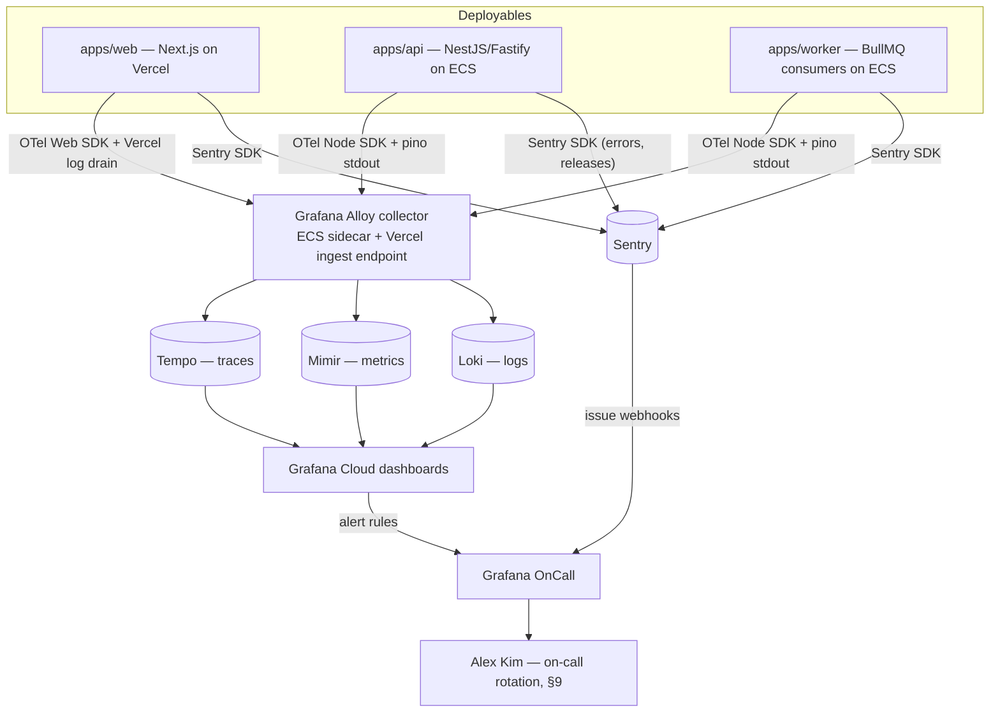
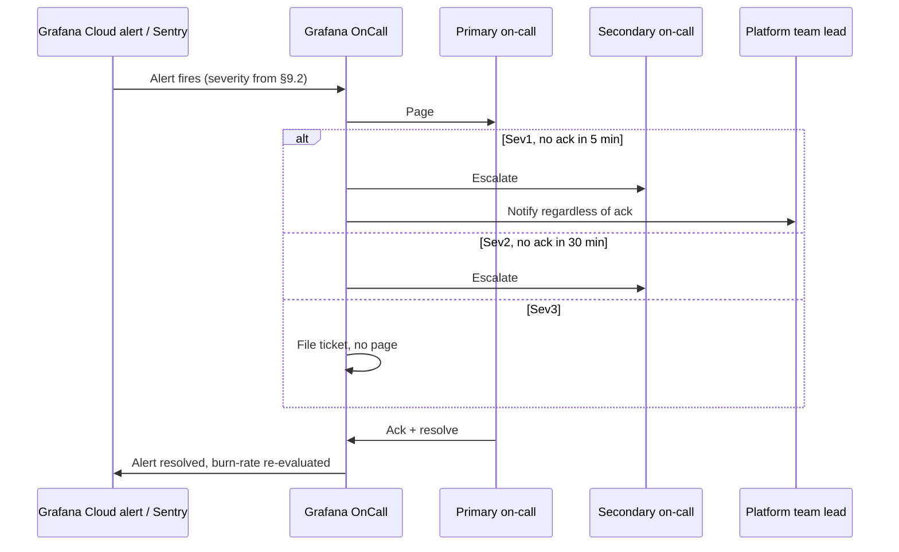

# Observability

This document specifies how Concourse observes its own production behavior: the OpenTelemetry tracing pipeline (including the request-context propagation `apps/api` already establishes in [18-api-architecture.md](18-api-architecture.md) §3.9), structured logging via pino, error tracking via Sentry, and the Grafana Cloud (Loki/Tempo/Mimir) dashboards and alerting built on top of them — the stack already named piecemeal in [00-foundation.md](00-foundation.md) §6. It owns the platform-wide metrics catalog this doc alone is responsible for (API latency/error rate per route, BullMQ queue depth and backlog age, Supabase Realtime broadcast/reconnect telemetry, database connection-pool saturation, RLS policy denial rate), the SLO alert thresholds and burn-rate policy for everything outside AI, the on-call rotation and escalation policy Alex Kim (Platform Admin, [03-user-personas.md](03-user-personas.md)) operates under, and the live-event readiness dashboard her persona section promises. It does **not** own: per-feature AI latency/cost/fallback design ([21-ai-architecture.md](21-ai-architecture.md) — this document treats its §9 metrics as dashboard inputs, never redefinitions); the BullMQ queue catalog, retry/backoff conventions, or worker scaling policy itself ([27-background-jobs-architecture.md](27-background-jobs-architecture.md) — this doc only defines what gets *measured* about queues); the audit-log content model ([29-audit-logging-architecture.md](29-audit-logging-architecture.md) — security signals surfaced here are mirrored into `audit_logs`, not defined there); product-analytics event taxonomy ([32-analytics-architecture.md](32-analytics-architecture.md)); or feature-flag lifecycle mechanics ([34-feature-flags-and-experimentation.md](34-feature-flags-and-experimentation.md)). Consistent with the "no bespoke incident entity" discipline already locked in [05-organizer-journey.md](05-organizer-journey.md) O-8, this document defines dashboards, metrics, and alert *routing* — never an incident-ticketing system.

---

## 1. Scope & Ownership

| This doc owns | Owned elsewhere |
|---|---|
| OTel tracing pipeline, span conventions, sampling policy | Per-span attributes for AI gateway calls ([21-ai-architecture.md](21-ai-architecture.md) §9) |
| pino structured logging shape, redaction, shipping | What gets logged for audit purposes specifically ([29-audit-logging-architecture.md](29-audit-logging-architecture.md)) |
| Sentry project layout, release tracking, alert routing | The error code registry itself ([41-error-code-registry.md](41-error-code-registry.md)) |
| Grafana Cloud dashboard catalog and panel definitions | The numeric SLA/SLO *targets* dashboards are built against ([10-non-functional-requirements.md](10-non-functional-requirements.md) §4, §10) |
| Platform-wide metrics: API latency/error rate, queue depth/backlog age, Realtime broadcast/reconnect telemetry, DB pool saturation, RLS denial rate | AI-specific metrics (`ai_tokens_total`, etc. — [21-ai-architecture.md](21-ai-architecture.md) §9), product-analytics events ([32-analytics-architecture.md](32-analytics-architecture.md)) |
| SLO alert thresholds beyond the AI-specific ones, burn-rate policy application | The consolidated NFR-MON threshold *values* this doc restates ([10-non-functional-requirements.md](10-non-functional-requirements.md) §10) |
| On-call rotation, escalation tiers, live-event staffing policy | Feature-flag kill-switch mechanics ([34-feature-flags-and-experimentation.md](34-feature-flags-and-experimentation.md)) |
| Live-event readiness dashboard definition | The `events` status state machine it observes ([00-foundation.md](00-foundation.md) §7, [18-api-architecture.md](18-api-architecture.md) §5.3) |

## 2. Observability Architecture Overview

Every deployable — `apps/web` (Vercel), `apps/api` (ECS Fargate), `apps/worker` (ECS Fargate) — emits the same three signal types through the same collection path, so a single trace ID joins a request across all three.



**Collector decision:** Concourse runs **Grafana Alloy** (Grafana Labs' OpenTelemetry Collector distribution) as a sidecar container on every ECS task, plus a hosted Alloy ingest endpoint fed by Vercel's log drain for `apps/web`. This is a decision made here, in the same spirit as [10-non-functional-requirements.md](10-non-functional-requirements.md)'s PgBouncer call — it is additive to the locked "OpenTelemetry → Grafana Cloud" choice ([00-foundation.md](00-foundation.md) §6), not a deviation from it: Alloy is Grafana Cloud's own recommended collector, so there is no new vendor to evaluate, only a concrete shape for a decision the stack registry left open.

**Why one collector for traces, metrics, and logs:** pino writes structured JSON to stdout (§4); Alloy's log pipeline parses `requestId`/`traceId` out of each line and attaches them as Loki labels, so a Tempo trace and its Loki log lines are cross-linked with one click in Grafana ("Logs for this span"). Metrics are emitted via the OTel Metrics API (Prometheus-compatible) and remote-written to Mimir. No service talks to Loki/Tempo/Mimir directly — everything goes through Alloy, which is the single place ingestion credentials live.

## 3. Distributed Tracing (OpenTelemetry)

### 3.1 Instrumentation

- `@opentelemetry/sdk-node` initializes in `apps/api` and `apps/worker` before any other import (a `--require` preload), with auto-instrumentation for Fastify, `pg` (via the Drizzle-underlying driver), `ioredis`, and BullMQ. `apps/web` uses `@vercel/otel`.
- Manual spans are added at every module boundary that isn't auto-instrumented: AI gateway calls (`ai.generate`, `ai.classify`, `ai.embed`, `ai.rerank`, `ai.retrieve` — attributes owned by [21-ai-architecture.md](21-ai-architecture.md) §9), the outbox relay drain cycle, webhook delivery attempts, and Supabase Realtime channel subscribes/broadcasts.

### 3.2 Context propagation

The `RequestContext` built in the Fastify `onRequest` hook ([18-api-architecture.md](18-api-architecture.md) §3.9) is the seam every signal in this document hangs off of:

```
RequestContext {
  requestId, traceId,
  principal: { kind, userId?, sessionId?, apiKeyId?, serviceName? },
  orgId?, eventId?, eventExhibitorId?,
}
```

- `traceId` is the OTel trace id for the request's root span. It is propagated into every BullMQ job payload as `meta.traceId` ([18-api-architecture.md](18-api-architecture.md) §3.9), so a worker job spawned by an API request continues the same trace rather than starting a new one — a booth-scan request that enqueues a Lead Intelligence extraction job shows as one continuous trace from HTTP ingress to AI summary write.
- Internal service-to-service calls (`/v1/internal/*`, [18-api-architecture.md](18-api-architecture.md) §10) propagate the W3C `traceparent` header so a worker-initiated callback into the API joins the same trace as the job that triggered it.
- There is no gateway process holding live connections to instrument the way a self-hosted Socket.IO handshake once was ([18-api-architecture.md](18-api-architecture.md) §7.1) — Supabase's own connection-level internals are not something we instrument directly. The closest honest equivalent: each Realtime channel subscribe from `packages/api-client`'s Supabase JS wrapper starts a new trace (there is no client-originating request to inherit from), tagged with `userId` and the channel name; on the publish side, our own service-role Broadcast calls and the RLS-authorization checks they depend on (§6.2/§6.3) are traced as ordinary spans within whatever trace triggered them.

### 3.3 Span naming convention

| Span name pattern | Example | Emitted by |
|---|---|---|
| `http.server` (auto) | `POST /v1/events/{eventId}/booth-visits` | Fastify auto-instrumentation |
| `db.query` (auto) | `SELECT leads` | `pg` auto-instrumentation |
| `ai.<verb>` | `ai.generate` | `packages/ai` ([21-ai-architecture.md](21-ai-architecture.md) §9) |
| `queue.job.<name>` | `queue.job.kb-ingest` | BullMQ worker wrapper (queue catalog: [27-background-jobs-architecture.md](27-background-jobs-architecture.md)) |
| `outbox.relay` | `outbox.relay` | Outbox relay worker ([25-event-pipeline.md](25-event-pipeline.md)) |
| `webhook.deliver` | `webhook.deliver` | Webhook delivery consumer ([18-api-architecture.md](18-api-architecture.md) §9) |
| `realtime.channel.<event>` | `realtime.channel.subscribe` | Supabase Realtime channel subscribe/broadcast calls ([18-api-architecture.md](18-api-architecture.md) §7 — channel topology, RLS-based authorization) |

Every span carries `organization_id` and, where resolved, `event_id`/`event_exhibitor_id` as attributes — the same scope ids RLS uses (§6.2) — so a trace can always be filtered to one tenant without joining back to logs.

### 3.4 Sampling policy

Head-based sampling decided once per request, in the Fastify `onRequest` hook, before any child span exists:

1. **100%** of requests that end in a 5xx or an uncaught exception (decided retroactively via a tail decision on the root span — Alloy buffers the trace briefly to allow this).
2. **100%** of requests touching an AI feature endpoint (Copilot, Pulse, Lead Intelligence summaries, Follow-up Studio) — AI traces are cheap in volume relative to scan traffic and valuable for eval/incident correlation.
3. **10%** baseline sample of everything else, configurable via env var (`OTEL_SAMPLE_RATIO`) without a deploy — the same "config, not code" discipline [18-api-architecture.md](18-api-architecture.md) §3.8 applies to rate limits.

Full tail-based sampling (buffering every trace platform-wide before deciding) is explicitly rejected for Phase 1: it requires a dedicated tail-sampling collector tier that isn't warranted at current trace volume (~7,500 spans/s briefly at peak scan throughput, [10-non-functional-requirements.md](10-non-functional-requirements.md) NFR-CAP-09); the head-based rules above already capture every trace an incident review would want. Revisit trigger tracked in [44-future-expansion-plan.md](44-future-expansion-plan.md): "baseline sample rate proves insufficient for a real incident reconstruction."

Trace retention in Tempo: **30 days**, the Grafana Cloud default tier — sufficient to cover a post-event retrospective (the longest live window, per [10-non-functional-requirements.md](10-non-functional-requirements.md) §4) plus buffer.

## 4. Structured Logging (pino)

### 4.1 Log line shape

Every log line from `apps/api` and `apps/worker` is a single JSON object:

```json
{
  "level": "info",
  "time": "2026-07-10T14:32:01.104Z",
  "requestId": "req_01J9X6...",
  "traceId": "4bf92f3577b34da6a3ce929d0e0e4736",
  "spanId": "00f067aa0ba902b7",
  "principal": { "kind": "session", "userId": "usr_..." },
  "orgId": "org_...",
  "eventId": "evt_...",
  "module": "EngagementModule",
  "msg": "lead captured",
  "leadId": "lead_..."
}
```

`requestId`/`traceId` are always present (§3.2); `orgId`/`eventId` are present whenever scope has been resolved. This is the same context object [18-api-architecture.md](18-api-architecture.md) §3.9 already commits to flowing into pino — this document fixes the concrete shape and shipping path.

### 4.2 Levels and discipline

| Level | Usage |
|---|---|
| `trace` | Disabled in production; local dev only |
| `debug` | Disabled in production by default; enabled per-service via env var during an active incident |
| `info` | Normal business events worth a record (lead captured, event published) — one line per meaningful state change, not per function call |
| `warn` | Recoverable anomalies: guardrail trigger, idempotency conflict, RLS denial (§6.2), fallback activation |
| `error` | Unhandled exceptions, failed job attempts, provider outages — always paired with a Sentry event (§5) |
| `fatal` | Process-ending failures (uncaught at the top level); triggers immediate ECS task restart |

### 4.3 Redaction

A pino serializer strips or hashes fields before a line is ever written, regardless of call site: passwords, session tokens, API key secrets, full `badge_code` values (logged as a truncated prefix only — badge codes are opaque per [00-foundation.md](00-foundation.md) §12, but a full code is still a replayable credential and is never persisted outside `registrations`), lead-note free text, and Follow-up Studio draft bodies. This mirrors the transcript-redaction discipline [21-ai-architecture.md](21-ai-architecture.md) §9 already applies to AI prompt/response sampling, extended to every log line platform-wide.

### 4.4 Shipping and retention

pino writes newline-delimited JSON to stdout only — no file transport, no direct network transport from application code (keeps the hot path allocation-free). Grafana Alloy tails the ECS task's stdout (via the `awslogs` driver → CloudWatch subscription → Alloy) and Vercel's log drain, parsing `requestId`/`traceId` into Loki labels for cross-linking with Tempo (§2). **Retention: 30 days in Loki**, matching Tempo — logs beyond that window are not retained; anything that must survive longer (privileged actions, consent changes) already lands in `audit_logs` per [29-audit-logging-architecture.md](29-audit-logging-architecture.md), which owns its own retention schedule. Log access in Grafana Cloud is restricted to `platform:admin`-equivalent engineering accounts; there is no in-product log viewer for any tenant-facing role.

## 5. Error Tracking (Sentry)

### 5.1 Project layout

Three Sentry projects, matching the three deployables named in [00-foundation.md](00-foundation.md) §6: `concourse-web`, `concourse-api`, `concourse-worker`. Each release is tagged with the git SHA from the CI pipeline ([00-foundation.md](00-foundation.md) §6 CI/CD); source maps upload automatically on deploy so stack traces resolve to original TypeScript.

### 5.2 Scope enrichment

The Sentry SDK's scope is populated from the same `RequestContext` (§3.2) at request start: `requestId`, `traceId`, `principal.kind`, `orgId`, `eventId`. No free-text PII (attendee names, lead notes, follow-up drafts) is ever attached to a Sentry scope — the redaction discipline in §4.3 applies identically here.

### 5.3 What reaches Sentry

- **Always:** uncaught exceptions, unhandled promise rejections, any `5xx` response, BullMQ job failures after retries are exhausted.
- **Never:** RFC 9457 problem responses in the `4xx` range ([18-api-architecture.md](18-api-architecture.md) §3.5) — a `422 validation_failed` or `404` is expected application behavior, not a defect, and routing it to Sentry would drown real signal. The one exception is `403 permission_denied`/`entitlement_required` spikes, which are surfaced as a metric (§6.2) and a security-signal dashboard panel (§7), not as individual Sentry events.
- **Guardrail-triggered AI events** are captured by [21-ai-architecture.md](21-ai-architecture.md)'s own transcript sampling, not duplicated into Sentry.

### 5.4 Alert routing

Sentry issue alerts (new issue, regression, or an issue's event-rate spiking) fire a webhook into **Grafana OnCall** (§9) rather than paging directly — this keeps exactly one escalation path platform-wide instead of two competing paging systems. Non-paging Sentry notifications (weekly digest, resolved issues) go to the platform team's Slack channel.

## 6. Metrics Catalog

### 6.1 AI-specific metrics (inputs, not redefinitions)

[21-ai-architecture.md](21-ai-architecture.md) §9 already fixes the AI module's metric emissions. This document consumes them as dashboard inputs (§7.5) and alert inputs (§8.1) — the names and label sets below are restated verbatim for a single point of lookup, but §9 of that document remains the source of truth if the two ever appear to disagree.

| Metric | Type | Labels | Meaning |
|---|---|---|---|
| `ai_tokens_total` | Counter | `feature`, `model`, `direction` | Token volume, for cost/usage dashboards |
| `ai_request_duration_seconds` | Histogram | `feature` | Gateway call latency |
| `ai_refusals_total` | Counter | `feature` | Model-issued refusals |
| `ai_guardrail_triggers_total` | Counter | `stage` | Injection/abuse screening hits |
| `ai_budget_denials_total` | Counter | `scope`, `feature` | Pre-flight budget rejections |
| `ai_fallback_activations_total` | Counter | `feature` | Deterministic-fallback activations |
| `ai_cache_hit_ratio` | Gauge | `feature` | Prompt/response cache effectiveness |

### 6.2 Platform-wide metrics (owned here)

| Metric | Type | Labels | Meaning |
|---|---|---|---|
| `http_requests_total` | Counter | `route`, `method`, `status_class` (`2xx`\|`4xx`\|`5xx`) | Request volume and error-rate denominator per route |
| `http_request_duration_seconds` | Histogram | `route`, `method` | API latency per route — feeds NFR-PERF-18/19 verification |
| `queue_depth` | Gauge | `queue` | Waiting-job count, polled from BullMQ every 15 s ([27-background-jobs-architecture.md](27-background-jobs-architecture.md) owns the queues; this doc owns the gauge) |
| `queue_oldest_job_age_seconds` | Gauge | `queue` | Age of the oldest still-waiting job — the **backlog age** signal, distinct from raw depth (§8.3) |
| `queue_job_duration_seconds` | Histogram | `queue`, `outcome` (`succeeded`\|`failed`) | Job processing time and failure rate |
| `realtime_broadcast_total` | Counter | `channel_prefix` (`event`\|`event_exhibitor`\|`booth`\|`user`\|`platform`\|`job`), `outcome` (`success`\|`failure`) | Our own Supabase service-role Broadcast publish attempts from `apps/api`/`apps/worker` — the closest proxy we can emit ourselves for realtime activity (below) |
| `realtime_client_reconnect_total` | Counter | `channel_prefix` | Client-side reconnect/`CHANNEL_ERROR` events from the Supabase JS client, reported by `apps/web` — feeds NFR-MON-08's equivalent (below, §8.2) |
| `db_pool_connections_in_use` | Gauge | `pool` (`api`\|`worker`) | Active connections per PgBouncer-fronted pool ([10-non-functional-requirements.md](10-non-functional-requirements.md) NFR-SCALE-04/05/06) |
| `db_pool_saturation_ratio` | Gauge (derived) | `pool` | `connections_in_use / pool_max` — the connection-pool saturation signal §8.3 alerts on |
| `rls_denials_total` | Counter | `table`, `operation` (`insert`\|`update`) | Postgres `WITH CHECK` policy rejections — the security signal defined in §6.3 |

**Why there is no live realtime connection-count metric:** under the prior Socket.IO gateway, `websocket_connections` (gauge, tagged by namespace) and `websocket_reconnects_total` were meaningful because `apps/api` operated the connection layer itself. Per [18-api-architecture.md](18-api-architecture.md) §7.1, there is no dedicated realtime gateway process anymore — clients connect directly to Supabase Realtime, a managed service we do not operate. That means live per-channel connection counts are no longer something our own stack can observe or emit directly, and we do not invent a metric we cannot actually back with real data: **connection-level monitoring for Realtime now lives in Supabase's own project dashboard**, the same honest simplification [18-api-architecture.md](18-api-architecture.md) §7.1 already makes for the retired ECS target group. `realtime_broadcast_total` (our own outbound publish calls, always something we control and instrument) and `realtime_client_reconnect_total` (client-emitted, via `apps/web`'s OTel Web SDK instrumentation of the Supabase JS client's own reconnect events, §3.1) are the closest equivalents this document's own stack owns.

### 6.3 RLS policy denial rate — mechanism

Postgres RLS filters `SELECT`s silently (a cross-tenant row simply doesn't appear — not measurable as a "denial" event). But under `FORCE ROW LEVEL SECURITY` ([16-database-schema.md](16-database-schema.md) §2.3), an `INSERT`/`UPDATE` whose row fails the policy's `WITH CHECK` clause raises Postgres error `42501` ("new row violates row-level security policy"). That error is the concrete, countable signal: application-level scoping ([00-foundation.md](00-foundation.md) §8) should make it structurally impossible to attempt such a write, so **any occurrence is either an application bug or an attempted cross-tenant write** — exactly the "zero cross-tenant data incidents" standing goal Alex is measured against ([02-business-goals.md](02-business-goals.md) §5).

```typescript
// packages/database — Drizzle error interceptor, registered once at the connection-pool level
interface RlsDenialEvent {
  table: string;
  operation: 'insert' | 'update';
  orgId: string | null;      // from RequestContext, not from the rejected row
  requestId: string;
  traceId: string;
}

function onPostgresError(err: DatabaseError, ctx: RequestContext) {
  if (err.code === '42501') {
    metrics.rlsDenialsTotal.inc({ table: err.table, operation: ctx.method === 'POST' ? 'insert' : 'update' });
    logger.warn({ requestId: ctx.requestId, traceId: ctx.traceId, table: err.table }, 'rls_denial');
    auditLog.record({ action: 'security.rls_denial', actorUserId: ctx.principal.userId, orgId: ctx.orgId }); // 29-audit-logging-architecture.md
  }
  throw new InternalServerErrorException(); // never leak policy internals to the client
}
```

This doc owns the metric and its alert threshold (§8.3); [29-audit-logging-architecture.md](29-audit-logging-architecture.md) owns the persisted `audit_logs` row's schema and retention.

## 7. Dashboard Catalog

All dashboards live in the Grafana Cloud instance provisioned per [00-foundation.md](00-foundation.md) §6, access restricted to platform-team accounts (mirroring the log-access restriction in §4.4).

| Dashboard | Audience | Key panels | Refresh |
|---|---|---|---|
| **Platform Health** | On-call (§9) | `http_request_duration_seconds` p50/p95/p99 per route, `http_requests_total` error rate by `status_class`, top-10 slowest routes | 30 s |
| **Queue Health** | On-call, platform team | `queue_depth` and `queue_oldest_job_age_seconds` per queue, `queue_job_duration_seconds` p95, retry/dead counts (from [27-background-jobs-architecture.md](27-background-jobs-architecture.md)'s catalog) | 30 s |
| **Realtime & Connections** | On-call | `realtime_broadcast_total` rate/failures by channel prefix, `realtime_client_reconnect_total` rate, Supabase Realtime publish latency (NFR-SCALE-10) | 15 s |
| **Database Health** | On-call | `db_pool_saturation_ratio` per pool, Postgres replica lag (NFR-MON-06), `rls_denials_total` rate | 15 s |
| **AI Operations** | Alex, AI eng | Every metric in §6.1, per-feature fallback-activation rate, per-event budget burn ([21-ai-architecture.md](21-ai-architecture.md) §6, [10-non-functional-requirements.md](10-non-functional-requirements.md) §11) | 30 s |
| **Security Signals** | Alex | `rls_denials_total`, `permission_denied`/`entitlement_required` response-rate spikes, `ai_guardrail_triggers_total`, Sentry issue volume | 30 s |
| **Live-Event Readiness** | Alex, Priya (read-only), Marcus (read-only) | Composite per-event view, §10 | 5 s during `live` window, 5 min otherwise |

## 8. SLO Alert Thresholds

### 8.1 AI-specific thresholds (restated from source)

Authoritative source: [21-ai-architecture.md](21-ai-architecture.md) §9. Reproduced here so on-call has one page to read during an incident.

| Signal | Threshold | Window |
|---|---|---|
| Expo Copilot first-token p95 | > 1.5 s | 15 min |
| Any AI feature fallback-activation rate | > 5% | 5 min |
| Eval nightly regression | Any metric regressing > 2 points from baseline | Nightly run |
| Budget-denial spike | Per-tenant `ai_budget_denials_total` rate anomaly | 5 min |

### 8.2 Platform-wide thresholds (restated from source)

Authoritative source: [10-non-functional-requirements.md](10-non-functional-requirements.md) §10 (NFR-MON-01…08). Reproduced verbatim as this document's alert-rule inputs.

| ID | Signal | Threshold | Window |
|---|---|---|---|
| NFR-MON-03 | Standard CRUD read p95 | > 300 ms sustained | 10 min |
| NFR-MON-04 | Standard CRUD write p95 | > 500 ms sustained | 10 min |
| NFR-MON-05 | Scan-ingestion `429` rate | > 1% of requests | 5 min |
| NFR-MON-06 | Postgres replica lag | > 5 s | 2 min |
| NFR-MON-07 | BullMQ queue depth (any queue) | > 3× rolling 7-day median | 10 min |
| NFR-MON-08 | Realtime client reconnect rate (`realtime_client_reconnect_total`, client-emitted per §6.2) | > 10% of connected clients/min | 5 min |

### 8.3 New thresholds this document defines

These extend §8.1/§8.2 with signals that were not yet given numeric thresholds anywhere else in the blueprint — decided here, justified against the availability tiers already locked in [10-non-functional-requirements.md](10-non-functional-requirements.md) §4.

| Signal | Threshold | Window | Rationale |
|---|---|---|---|
| **5xx rate — floor-critical routes** (Attendee App/Exhibitor Portal capture/Organizer Console live-ops during a `live` event window; NFR-AVAIL-01…03) | > 0.5% sustained (page); > 0.1% sustained (ticket) | 5 min page / 15 min ticket | 99.95% monthly target leaves only ~21.9 min/month of budget (§8.4); a floor-critical route burning budget deserves the tightest gate on the platform |
| **5xx rate — back-office/API routes** (NFR-AVAIL-04/05) | > 2% sustained (page); > 0.5% sustained (ticket) | 10 min page / 30 min ticket | 99.9% target has a looser budget (~43.8 min/month); non-live-window routes tolerate more before paging |
| **API p95 latency — any route** (composite of NFR-PERF-18/19 beyond the CRUD split) | > 2× the route's declared budget | 10 min | Catches routes outside the generic CRUD budgets (e.g. exports, search) that NFR-MON-03/04 don't individually name |
| **Queue backlog age — interactive-adjacent queues** (e.g. export/import jobs, `webhook-deliver`, `notification-dispatch`) | > 2 min (ticket); > 5 min (page) | Continuous | A waiting user is behind these jobs; age matters more than raw depth for user-perceived latency |
| **Queue backlog age — batch queues** (`ai-batch` nightly runs, bulk `kb-ingest`) | > 30 min (ticket); > 2 h (page) | Continuous | No user is waiting synchronously; a stuck nightly matchmaking run is real but not an emergency until it threatens the next live day |
| **Database connection-pool saturation** | `db_pool_saturation_ratio` > 80% (ticket); > 95% (page) | 5 min | Saturation precedes connection-exhaustion errors platform-wide; alerting before `pg` starts rejecting connections is the entire point of a saturation metric |
| **RLS policy denial rate** | Any occurrence (> 0) | Immediate page, zero grace window | Per §6.3, this event should be structurally impossible; unlike every other threshold in this document it tolerates no baseline — the alert *is* the incident |

### 8.4 Burn-rate policy

Restated from [10-non-functional-requirements.md](10-non-functional-requirements.md) §10.1: each availability target in that document's §4 implies a monthly error budget (99.95% → 21.9 min/month). A **fast burn** (> 2% of the monthly budget consumed within 1 hour) pages on-call immediately regardless of which specific threshold above tripped; a **slow burn** (> 10% consumed within 6 hours) opens a ticket. Every threshold in §8.1–§8.3 is implemented as a Grafana Cloud alert rule evaluated against this burn-rate framing, not as an independent one-off rule — a route that's slow but hasn't burned meaningful budget doesn't page.

## 9. On-Call Rotation & Escalation Policy

### 9.1 Rotation

The platform team Alex Kim belongs to runs a **weekly primary/secondary rotation** in **Grafana OnCall** (chosen in §2 because it ships as part of the already-locked Grafana Cloud plan — no new paging vendor is introduced). Primary is paged first; secondary is paged only on no-ack. Rotation membership, schedule overrides, and escalation policies are configured in Grafana OnCall directly — this document fixes the policy, not the roster.

### 9.2 Severity tiers

| Severity | Definition | Examples | Escalation |
|---|---|---|---|
| **Sev1** | Customer-visible outage, or any cross-tenant data exposure regardless of scale | Floor-critical route 5xx burn (§8.3), any `rls_denials_total` event, Postgres primary failover taking longer than RTO | Page primary immediately; auto-escalate to secondary after 5 min no-ack; platform team lead notified regardless of ack |
| **Sev2** | Degraded experience, deterministic fallback active, or a back-office route affected | AI fallback-activation rate > 5% (§8.1), queue backlog age past the "page" threshold (§8.3), DB pool saturation > 95% | Page primary; escalate to secondary only after 30 min no-ack |
| **Sev3** | Non-urgent anomaly worth investigating, no user impact yet | Slow-burn error budget consumption, queue depth ticket-level threshold, Sentry issue regression | Ticket only, next business day; no page |

### 9.3 Live-event heightened on-call

During any event's `live` window ([00-foundation.md](00-foundation.md) §7 `events.status`), staffing doubles per the operational cadence [03-user-personas.md](03-user-personas.md) already describes for Alex ("heightened on-call — watching the event's traffic, queue depths, sync-conflict rates, and AI spend in real time"): the standing weekly primary/secondary continues, **plus** a dedicated event on-call assignment scoped to that event, visible on the Live-Event Readiness dashboard (§10). The event on-call's paging scope is limited to alerts carrying that event's `event_id` label; the standing rotation continues to own everything else. This assignment is entered into Grafana OnCall's per-schedule override, not a new system.

### 9.4 Escalation flow



### 9.5 Alert-fatigue budget

Restated from [10-non-functional-requirements.md](10-non-functional-requirements.md) §10.3: no rotation carries more than **2 paging alerts/week** at steady state. A rotation that exceeds this triggers a **threshold review** (are §8.2/§8.3's numbers miscalibrated?), never a rotation-size increase — the fix for alert fatigue is fewer false pages, not more people absorbing them.

## 10. Live-Event Readiness Dashboard

This is the dashboard [03-user-personas.md](03-user-personas.md)'s Alex Kim section names directly: *"When a live event approaches, I want a readiness view per event (scale, flags, budgets, on-call), so launches are boring."* It is a **composite, per-event** view — a single Grafana Cloud dashboard templated on `event_id`, not a new system.

| Panel | Data source | Reads as |
|---|---|---|
| T-minus countdown to `starts_at` | `events` row | Time until the worker-driven automatic `published→live` transition ([18-api-architecture.md](18-api-architecture.md) §5.3) |
| Scan throughput vs. design ceiling | `http_requests_total{route="booth-visits"}` vs. NFR-SCALE-01 (1,500/s burst) | Headroom remaining before the rate-limit bucket ([18-api-architecture.md](18-api-architecture.md) §3.8) starts shedding load |
| Queue depth & backlog age for this event's jobs | `queue_depth`, `queue_oldest_job_age_seconds` filtered by event-scoped job payloads | Whether `ai-batch`/`kb-ingest` are keeping pace with this event's ingest volume (NFR-CAP-02/03/04) |
| AI budget burn | `ai_budget_denials_total`, per-event spend vs. plan ceiling ([21-ai-architecture.md](21-ai-architecture.md) §6.2) | Whether the event is tracking toward its `launch`/`professional`/`enterprise` budget before day-of |
| Feature flag state | PostHog flag API ([00-foundation.md](00-foundation.md) §6) | Which kill switches (`ai-expo-copilot`, etc.) are armed for this event, read-only from this dashboard — toggled from `/admin/flags` ([34-feature-flags-and-experimentation.md](34-feature-flags-and-experimentation.md)) |
| Realtime broadcast volume vs. design ceiling | `realtime_broadcast_total` rate vs. NFR-SCALE-08/09 | Headroom on this event's realtime fan-out volume — live per-connection counts against Supabase Realtime's own capacity are read from Supabase's project dashboard (§6.2), not this panel |
| Security signal status | `rls_denials_total`, `permission_denied` rate | Should read zero/near-zero; any nonzero value here before doors-open is a go/no-go blocker |
| On-call assignment | Grafana OnCall schedule for this event window (§9.3) | Who is holding the event-scoped pager |

**This dashboard is advisory, not a release gate on the `live` transition itself** — that transition fires automatically at `starts_at` regardless of dashboard state ([18-api-architecture.md](18-api-architecture.md) §5.3), because a manual approval step on a time-based transition would contradict the "boring launches" goal it exists to serve. Its purpose is to inform Alex's staffing and flag decisions *before* `starts_at` arrives, and to be the first place anyone looks *during* the live window — not to block the platform from doing what the event's schedule already says it should do.

## 11. Retention & Access Control

| Signal | Retention | Access |
|---|---|---|
| Traces (Tempo) | 30 days | Platform-team Grafana Cloud accounts only |
| Logs (Loki) | 30 days | Platform-team Grafana Cloud accounts only |
| Metrics (Mimir) | 13 months (Grafana Cloud default) | Platform-team Grafana Cloud accounts only |
| Sentry issues/events | Per Sentry's standard 90-day event retention; issues themselves persist indefinitely until resolved/deleted | Platform-team Sentry accounts only |
| RLS denial audit rows | Governed by [29-audit-logging-architecture.md](29-audit-logging-architecture.md)'s retention schedule, not this document's | Per doc 29's access rules |

No tenant-facing role (Priya, Marcus, Elena, Jamal, Sofia) has access to any observability system named in this document — the Live-Event Readiness dashboard's read-only access for Priya/Marcus (§10) is the single exception, scoped to their own event only, and carries no trace/log/RLS-denial detail, only the aggregate panels listed in §10's table.

## 12. Related Documents

- [00-foundation.md](00-foundation.md) — canonical tech-stack registry (§6) this document builds out into an operating architecture
- [03-user-personas.md](03-user-personas.md) — Alex Kim's jobs-to-be-done this document's on-call policy and readiness dashboard directly serve
- [10-non-functional-requirements.md](10-non-functional-requirements.md) — source of every availability target, capacity assumption, and NFR-MON threshold this document consumes and extends
- [18-api-architecture.md](18-api-architecture.md) — source of the request-context propagation this document's tracing/logging correlation is built on
- [21-ai-architecture.md](21-ai-architecture.md) — source of the AI-specific metrics this document treats as dashboard inputs
- [25-event-pipeline.md](25-event-pipeline.md) — outbox relay this document instruments (`outbox.relay` span)
- [27-background-jobs-architecture.md](27-background-jobs-architecture.md) — owns the BullMQ queue catalog this document's queue metrics are measured against
- [29-audit-logging-architecture.md](29-audit-logging-architecture.md) — owns the persisted audit record for security signals this document alerts on
- [34-feature-flags-and-experimentation.md](34-feature-flags-and-experimentation.md) — owns the flag toggling the readiness dashboard displays read-only
- [43-security-architecture.md](43-security-architecture.md) — broader threat model this document's RLS-denial and permission-denial signals feed into
- [44-future-expansion-plan.md](44-future-expansion-plan.md) — owns the tail-sampling revisit trigger (§3.4) and any other deferred observability scope
