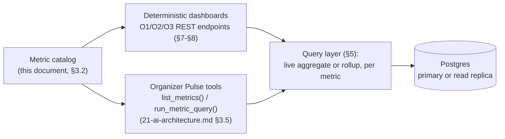
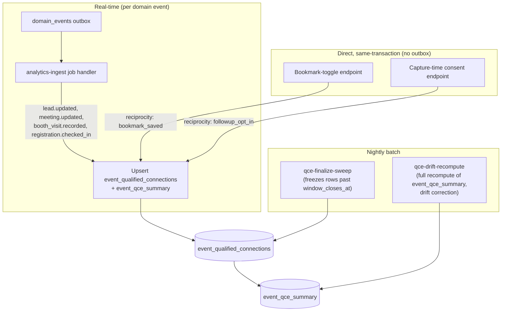

# Analytics Architecture

This document owns two things: **Analytics** — the product-analytics event taxonomy (`surface.object_action`, [00-foundation.md](00-foundation.md) §11), the metric catalog that backs every dashboard and that Organizer Pulse's `list_metrics()`/`run_metric_query()` tools validate against ([21-ai-architecture.md](21-ai-architecture.md) §3.5), and the Qualified Connections per Event (QCE) computation pipeline — and **Reports** — the post-event report and exhibitor ROI report, their generation triggers, and their export formats. Per [00-foundation.md](00-foundation.md) §13, reports are owned here rather than by a separate document because a report is a persisted view over this same metric catalog, not a separate system.

What this document does **not** own: the business definition of QCE ([01-product-vision.md](01-product-vision.md) §5.1 — this document consumes it) or its materialized schema (`event_qualified_connections`/`event_qce_summary`, fully specified in [16-database-schema.md](16-database-schema.md) §10 — this document specifies the *pipeline* that fills those tables); the domain event outbox, the `domain_events` catalog, or the `analytics-ingest` queue's transport mechanics ([25-event-pipeline.md](25-event-pipeline.md), [27-background-jobs-architecture.md](27-background-jobs-architecture.md) — this document owns the *translation* the queue's job handler applies); the role/permission matrix or entitlement check semantics ([28-permission-model.md](28-permission-model.md) — this document defines only the `analytics:read` permission's scope, per that document's delegation); platform-wide operational metrics, tracing, and on-call ([31-observability.md](31-observability.md)); feature-flag lifecycle and PostHog's flagging half ([34-feature-flags-and-experimentation.md](34-feature-flags-and-experimentation.md)); AI cost/token metrics ([21-ai-architecture.md](21-ai-architecture.md) §6, §9).

---

## 1. PostHog vs. First-Party Postgres — Two Analytics Systems

[00-foundation.md](00-foundation.md) §6 fixes PostHog as the product-analytics tool and reserves this document for its event taxonomy. That split is deliberate and load-bearing, not a naming convenience:

| | **PostHog** | **First-party Postgres aggregates** |
|---|---|---|
| Answers | "Are people using the product, and where do they drop off?" | "What did this event actually produce, and can Priya/Elena defend that number to their boss?" |
| Consumers | Product/growth engineering, funnel dashboards, feature-flag experiment analysis (doc 34) | Organizer/Exhibitor dashboards (§7), Organizer Pulse's narration (§4), reports (§9), the KPI tree ([02-business-goals.md](02-business-goals.md) §5) |
| Data class | Behavioral events (§2): page views, clicks, feature usage, funnel steps | Business facts: registrations, leads, booth visits, meetings, QCE — the literal numbers in a Stripe-adjacent commercial artifact (a rebooking pitch, a ROI report) |
| Tenancy enforcement | None at the row level — PostHog has no concept of Postgres RLS | Postgres RLS (`app.current_org_id`) is the backstop on every query, same as every other tenant-owned read ([00-foundation.md](00-foundation.md) §8) |
| Freshness model | Near-real-time ingestion, PostHog's own pipeline | Either live query (same-tenant reads, §5.1) or an async rollup with an explicit "as of" timestamp (cross-tenant reads, §5.2) — never silently stale |
| Statefulness | None — every event is an immutable fact | QCE requires *un-counting* a pair that regresses to `disqualified` (rule 3) and *freezing* a value after a 14-day window (rule 2) — genuinely stateful business logic no event-analytics tool expresses cleanly ([16-database-schema.md](16-database-schema.md) §10.1) |
| Failure mode if it goes down | Funnel dashboards go stale; nothing product-critical breaks | Never a single point of failure for a paying customer's number — computed and stored in the primary datastore, not fetched live from a third party at report-render time |

**Decision — why QCE, leads, meetings, and booth traffic are never computed in PostHog even though they are technically "events":** three reasons converge. (1) **Trust**: Elena takes the ROI report number to her CFO (§9); a number whose source of truth is a third-party SaaS product analytics tool, reconciled after the fact, is a weaker commercial claim than a number computed in the same database that enforces the tenancy guaranteeing nobody else can see or alter it. (2) **Tenancy**: PostHog cannot enforce Postgres RLS, so any cross-tenant aggregate (the organizer's view of exhibitor-owned lead counts, §5.2) would require exporting exhibitor-owned facts to a system with weaker isolation than the RLS-enforced database they already live in — a needless expansion of the trust boundary foundation principle 5 exists to prevent. (3) **Statefulness**: QCE's counting rules are not expressible as a PostHog funnel or trend (see row above). PostHog is correct, cheap, and sufficient for its actual job — engagement and funnel analytics — and wrong for anything a customer is paid to trust.

Both systems consume the same upstream fact stream (the `domain_events` outbox, per §2) but diverge at the point of delivery: PostHog receives a translated behavioral event; Postgres aggregates are computed and stored directly from the same domain events, never round-tripped through PostHog first.

---

## 2. Product Analytics Event Taxonomy

### 2.1 Two capture paths

Every `surface.object_action` event reaches PostHog through exactly one of two paths — the taxonomy in §2.2–§2.3 is organized by which path produced it:

1. **Outbox-derived.** The `analytics-ingest` job handler ([27-background-jobs-architecture.md](27-background-jobs-architecture.md) §5.9) receives every row from the `domain_events` outbox, unfiltered, per [25-event-pipeline.md](25-event-pipeline.md) §6.2's rule that ingestion is a complete capture obligation. Inside the handler, this document's translation table (§2.2) maps each `noun.verb_past` domain event to zero or one `surface.object_action` PostHog capture calls — "zero" because some domain events (§2.2's "suppressed" rows) have no product-analytics meaning and are intentionally not forwarded to PostHog even though they are fully captured as business facts elsewhere.
2. **Direct capture.** UI interactions with no corresponding system-of-record state change — a page view, a search query, an AI feature invocation, a report being *opened* rather than *generated* — have no domain event to translate. The client PostHog SDK (web) or a direct server-side `posthog-node` call (for actions that must be captured with certainty, e.g. billing-adjacent events) fires these at the point of interaction. §2.3 lists every direct-capture event already established in sibling docs, extended to a complete per-surface set.

Both paths use the same taxonomy convention and the same `identify()` calls (§2.4); a consumer reading PostHog cannot tell which path produced an event, by design — the fork is an internal implementation detail, not a second naming scheme.

### 2.2 Domain event → analytics event translation (complete, all 31 event types)

[25-event-pipeline.md](25-event-pipeline.md) §5 fixes the closed catalog of 31 domain event types and previews five translations (§6.2); it explicitly delegates "the full translation table (all 31 event types)" to this document. This is that table — every row is one of the 31.

| Domain event (aggregate) | Payload branch | Analytics event | Surface |
|---|---|---|---|
| `event.created` | — | `organizer.event_created` | Organizer |
| `event.published` | — | `organizer.event_published` | Organizer |
| `event.went_live` | — | `organizer.event_live` | Organizer |
| `event.completed` | — | `organizer.event_completed` | Organizer |
| `event.archived` | — | `organizer.event_archived` | Organizer |
| `booth.assigned` | — | `organizer.booth_assigned` | Organizer |
| `booth.reassigned` | — | `organizer.booth_reassigned` | Organizer |
| `booth.unassigned` | — | `organizer.booth_unassigned` | Organizer |
| `event_exhibitor.invited` | — | `organizer.exhibitor_invited` | Organizer |
| `event_exhibitor.accepted` | — | `exhibitor.invite_accepted` | Exhibitor |
| `event_exhibitor.profile_completed` | — | `exhibitor.profile_completed` | Exhibitor |
| `event_exhibitor.ready` | — | `exhibitor.ready` | Exhibitor |
| `event_exhibitor.withdrawn` | — | `exhibitor.withdrawn` | Exhibitor |
| `event_exhibitor.flagged` | — | `organizer.exhibitor_flagged` | Organizer |
| `event_exhibitor.updated` | — | `exhibitor.profile_updated` | Exhibitor |
| `registration.created` | — | `attendee.registered` | Attendee |
| `registration.checked_in` | — | `attendee.checked_in` | Attendee |
| `registration.cancelled` | — | `attendee.registration_cancelled` | Attendee |
| `registration.reactivated` | — | `attendee.registration_reactivated` | Attendee |
| `session_checkin.recorded` | — | `attendee.session_checked_in` | Attendee |
| `attendee_interests.updated` | `kind: 'declared'` | `attendee.interest_declared` | Attendee |
| `attendee_interests.updated` | `kind: 'inferred'` | *suppressed* | — |
| `booth_visit.recorded` | `source: 'self_scan'` | `attendee.booth_self_scanned` | Attendee |
| `booth_visit.recorded` | `source: 'badge_scan' \| 'dwell'` | `attendee.booth_visited` | Attendee |
| `lead.captured` | — | `exhibitor.lead_captured` | Exhibitor |
| `lead.updated` | `status: 'qualified'` | `exhibitor.lead_qualified` | Exhibitor |
| `lead.updated` | `status: 'contacted'` | `exhibitor.lead_contacted` | Exhibitor |
| `lead.updated` | `status: 'meeting_booked'` | `exhibitor.lead_meeting_booked` | Exhibitor |
| `lead.updated` | `status: 'closed'` | `exhibitor.lead_closed` | Exhibitor |
| `lead.updated` | `status: 'disqualified'`| `exhibitor.lead_disqualified` | Exhibitor |
| `lead.updated` | score/owner/note change, no status change | `exhibitor.lead_updated` | Exhibitor |
| `lead.reopened` | — | `exhibitor.lead_reopened` | Exhibitor |
| `lead.merged` | — | `exhibitor.leads_merged` | Exhibitor |
| `meeting.scheduled` | `requestedBy: 'attendee'` | `attendee.meeting_booked` | Attendee |
| `meeting.scheduled` | `requestedBy: 'exhibitor'` | `attendee.meeting_requested` | Attendee |
| `meeting.updated` | `status: 'confirmed'`, by `actor` | `{actor}.meeting_confirmed` | Actor's surface |
| `meeting.updated` | `status: 'completed'`, by `actor` | `{actor}.meeting_completed` | Actor's surface |
| `meeting.updated` | `status: 'declined'`, by `actor` | `{actor}.meeting_declined` | Actor's surface |
| `meeting.updated` | `status: 'no_show'` | `exhibitor.meeting_no_show` | Exhibitor |
| `file.scan_completed` | — | *suppressed* | — |
| `file.quarantined` | — | *suppressed* | — |
| `file.purged` | — | *suppressed* | — |

**Key decisions this table resolves:**

- **`attendee.checked_in`, not `attendee.badge_checked_in`.** [25-event-pipeline.md](25-event-pipeline.md) §6.2 previewed `attendee.badge_checked_in` as an illustrative example while explicitly deferring the final name to this document; [07-attendee-journey.md](07-attendee-journey.md) §12 already instruments the same domain event as `attendee.checked_in` in production-adjacent prose. This document finalizes `attendee.checked_in` — the name already load-bearing in the more detailed, persona-specific journey doc — and treats doc 25's example as superseded by this table, exactly as doc 25 itself anticipates.
- **`meeting.scheduled` branches on `requestedBy`, reconciling two prior names.** [25-event-pipeline.md](25-event-pipeline.md)'s preview used `attendee.meeting_requested` unconditionally; [07-attendee-journey.md](07-attendee-journey.md) §12 uses `attendee.meeting_booked`. Both are correct for different payloads: when Sofia books it herself (`requestedBy: 'attendee'`), it is her action — `attendee.meeting_booked`. When Elena's team requests it, Sofia receives a request — `attendee.meeting_requested`. This is the general **actor-attribution rule** applied throughout this table: any domain event carrying an `actor`/`requestedBy` field is attributed to that party's surface, not fixed to one surface per domain event type.
- **Inferred interest updates are suppressed from PostHog, not from the fact stream.** `attendee_interests.updated` with `kind: 'inferred'` fires on ordinary browsing behavior at high frequency and reflects no discrete user action — sending it to PostHog would be pure noise against the AI cost/volume discipline [21-ai-architecture.md](21-ai-architecture.md) §6 already applies elsewhere. "Suppressed" means *not forwarded to PostHog*; the underlying `attendee_interests` row is still written and still feeds Smart Matchmaking and the category-coverage metric (§4) exactly as before — suppression is a PostHog-delivery decision inside the `analytics-ingest` handler, not a gap in the `analytics-ingest` obligation itself (which [25-event-pipeline.md](25-event-pipeline.md) §6.2 correctly keeps unfiltered).
- **File-domain events are suppressed entirely.** [25-event-pipeline.md](25-event-pipeline.md) §5.7 itself notes `file.scan_completed`/`file.purged` have no human audience; `file.quarantined`'s one human audience (the uploader alert) is a notification, not a product-analytics signal. Security-relevant file events are already visible via [26-file-storage.md](26-file-storage.md) and [29-audit-logging-architecture.md](29-audit-logging-architecture.md) — duplicating them into PostHog would split one fact across two systems, against principle P3.
- **No Platform Admin (`platform.*`) surface in this taxonomy.** Alex Kim's actions are internal operations, not product usage; they are covered by `audit_logs` ([29-audit-logging-architecture.md](29-audit-logging-architecture.md)) and platform-wide metrics ([31-observability.md](31-observability.md)), never PostHog.

### 2.3 Direct-capture events by surface

Extending the examples already instrumented in [05-organizer-journey.md](05-organizer-journey.md), [06-exhibitor-journey.md](06-exhibitor-journey.md), and [07-attendee-journey.md](07-attendee-journey.md) to a complete set. All are fired at the point of interaction (§2.1's second path) and carry no `domain_events` row.

| Surface | Event | Fired when |
|---|---|---|
| Organizer | `organizer.event_cloned` | O-10 clone action completes (in addition to the standard `organizer.event_created` translation for the new event) |
| Organizer | `organizer.floor_plan_uploaded` | Floor plan underlay upload completes (C1) |
| Organizer | `organizer.roi_report_published` | Priya's one-click ROI report publish (O-9, §9.3) |
| Organizer | `organizer.report_exported` | Any CSV/PDF export completes (§9) |
| Organizer | `organizer.pulse_query_submitted` | A question is sent to Organizer Pulse (N1) |
| Organizer | `organizer.dashboard_viewed` | `/analytics` or event dashboard page view |
| Exhibitor | `exhibitor.org_created` / `exhibitor.org_claimed` | Invite-claim flow (D2) creates a new org vs. joins an existing one |
| Exhibitor | `exhibitor.staff_invited` | Staff seat invite sent (D5) |
| Exhibitor | `exhibitor.tier_upgraded` | Stripe Checkout upsell completes (Q4) |
| Exhibitor | `exhibitor.capture_queued` | Lead capture written to the offline queue, pre-sync (H2) — inherently client-only; cannot be observed server-side until sync |
| Exhibitor | `exhibitor.capture_synced` | Queued capture successfully syncs (H2) |
| Exhibitor | `exhibitor.followup_approved` | Elena approves a Follow-up Studio draft ([21-ai-architecture.md](21-ai-architecture.md) §3.4) |
| Exhibitor | `exhibitor.crm_synced` | CRM sync job completes (H12) |
| Exhibitor | `exhibitor.roi_report_viewed` | ROI report opened at `…/reports` (EX-11) |
| Exhibitor | `exhibitor.lead_exported` | CSV/XLSX lead export requested (H11) |
| Exhibitor | `exhibitor.matchmaking_prospect_viewed` | Prospect list opened (J3) |
| Exhibitor | `exhibitor.benchmark_viewed` | Competitive benchmark panel opened (O5) |
| Attendee | `attendee.badge_claimed` | Magic-link badge claim completes |
| Attendee | `attendee.booth_saved` | Bookmark toggled on an exhibitor (canonical example, [00-foundation.md](00-foundation.md) §11) |
| Attendee | `attendee.session_bookmarked` | Bookmark toggled on an agenda session (S-7) |
| Attendee | `attendee.consent_granted` / `attendee.consent_revoked` | Any consent toggle in `/profile` or at capture time ([21-ai-architecture.md](21-ai-architecture.md) §10) |
| Attendee | `attendee.recap_viewed` | Post-event recap opened |
| Attendee | `attendee.copilot_message_sent` | Expo Copilot message sent (feeds A3 KPI, §4) |
| Attendee | `attendee.match_recommendation_accepted` / `attendee.match_recommendation_dismissed` | Matchmaking feedback (J5) |
| Attendee | `attendee.directory_searched` | Exhibitor/product directory search (E4) |

### 2.4 Delivery, identity, and properties

- **Identity:** every capture call carries `distinct_id = users.id` (global identity, [00-foundation.md](00-foundation.md) §7) so an exhibitor rep's behavior across events is one PostHog person, consistent with `users` being one row per human across orgs/events. `identify()` sets `organization_id`(s), persona role, and event-scoped `registration_id`/`event_exhibitor_id` as person/group properties (PostHog **Groups**: `organization`, `event`).
- **Standard properties on every event:** `event_id`, `organization_id` (nullable for pre-org attendee events), `surface` (redundant with the event name's prefix but queryable independently for cross-surface funnels), `occurred_at`. Outbox-derived events additionally carry `domain_event_id` for cross-referencing a PostHog event back to its `domain_events` row during debugging.
- **No PII beyond what PostHog needs for identity resolution.** Consistent with [21-ai-architecture.md](21-ai-architecture.md) §10's posture, badge codes never appear in any analytics payload; attendee name/email are not sent as event properties (PostHog's `distinct_id` already resolves identity without restating it on every event).
- **Feature-flag evaluation events** (`ai-expo-copilot` etc., [21-ai-architecture.md](21-ai-architecture.md) §8.2) are PostHog's own automatic instrumentation, not part of this taxonomy — lifecycle and rollout mechanics are owned by [34-feature-flags-and-experimentation.md](34-feature-flags-and-experimentation.md).

---

## 3. Metric Catalog

### 3.1 One semantic layer, two consumers

Per principle P3 ("one source of truth"), the metric catalog defined below is consumed by exactly two callers, and both call the same underlying query functions — a metric can never disagree with itself depending on who's asking:



`list_metrics()` returns the catalog below (name, label, unit, allowed dimensions/grains/filters) verbatim as the tool-use schema Claude reasons over; `run_metric_query({ metric, dimensions, filters, grain })` validates the request against the same catalog before executing anything (§3.3) — this is the "curated semantic layer, never raw SQL" [21-ai-architecture.md](21-ai-architecture.md) §3.5 requires, and this document is its concrete content.

### 3.2 Catalog registry

`eventId` is an implicit, always-required filter on every metric (never client-supplied to Pulse's tool — injected server-side from the authenticated event context, same discipline as every other tenant-scoped query, [00-foundation.md](00-foundation.md) §8) and is omitted from the "Filters" column below for brevity.

| Metric key | Category | Label | Unit | Dimensions | Grains | Tenant |
|---|---|---|---|---|---|---|
| `registrations.count` | registrations | Registrations | count | `status`, `day` | hour, day, total | organizer |
| `registrations.checkin_rate` | registrations | Registration → check-in rate | percent | `day` | day, total | organizer |
| `checkins.throughput` | checkins | Check-in throughput | count/min | `hour` | hour | organizer |
| `booth_traffic.visits` | booth_traffic | Booth visits | count | `booth_id`, `event_exhibitor_id`, `category`, `day` | hour, day, total | organizer, exhibitor (own) |
| `booth_traffic.unique_visitors` | booth_traffic | Unique visitors | count | `booth_id`, `event_exhibitor_id` | day, total | organizer, exhibitor (own) |
| `booth_traffic.avg_dwell_seconds` | booth_traffic | Avg. dwell time | seconds | `booth_id` | total | organizer, exhibitor (own) |
| `booth_traffic.repeat_visit_rate` | booth_traffic | Repeat-visit rate | percent | `event_exhibitor_id` | total | organizer, exhibitor (own) |
| `leads.captured_count` | lead_volume | Leads captured | count | `event_exhibitor_id`, `status`, `day` | day, total | organizer (agg.), exhibitor (own) |
| `leads.qualification_rate` | lead_volume | Lead qualification rate | percent | `event_exhibitor_id` | total | organizer (agg.), exhibitor (own) |
| `leads.per_booth` | lead_volume | Leads per booth | ratio | `booth_id` | total | organizer |
| `category_coverage.demand_vs_supply` | category_coverage | Category coverage gap | ratio | `category` | total | organizer |
| `agenda.session_attendance_count` | session_attendance | Session attendance | count | `agenda_session_id` | total | organizer |
| `agenda.attendance_rate` | session_attendance | Session attendance rate | percent | `agenda_session_id` | total | organizer |
| `matchmaking.coverage_pct` | matchmaking | Matchmaking coverage | percent | `event_exhibitor_id`, `category` | total | organizer (agg.) |
| `matchmaking.acceptance_rate` | matchmaking | Match acceptance rate | percent | `event_exhibitor_id` | total | organizer (agg.) |
| `meetings.booked_count` | meetings | Meetings booked | count | `event_exhibitor_id`, `status` | day, total | organizer (agg.), exhibitor (own) |
| `meetings.honored_rate` | meetings | Meetings honored rate | percent | `event_exhibitor_id` | total | organizer (agg.), exhibitor (own) |
| `qce.count` | qce | Qualified Connections | count | — | total | organizer |
| `qce.per_1000` | qce | QCE per 1,000 registrations | ratio | — | total | organizer |
| `qce.per_exhibitor` | qce | QCE per exhibitor | ratio | — | total | organizer, exhibitor (own value only) |
| `floor.booth_assignment_rate` | floor_coverage | Booth assignment rate | percent | — | total | organizer |
| `floor.profile_completion_rate` | floor_coverage | Profile completion rate | percent | — | total | organizer |

This registry is exactly the "registrations, check-ins, booth traffic, lead volume, category coverage, session attendance" category list [21-ai-architecture.md](21-ai-architecture.md) §3.5 names for `list_metrics()`, extended with the three categories every other cross-referencing doc requires this document to define: `matchmaking` and `meetings` (both named explicitly in [05-organizer-journey.md](05-organizer-journey.md) O-9's Pulse content and the KPI tree, [02-business-goals.md](02-business-goals.md) §5), `qce` (the north-star itself, [01-product-vision.md](01-product-vision.md) §5), and `floor_coverage` (the KPI tree's "% booths assigned + profiled").

### 3.3 Query contract & validation

```typescript
interface MetricDefinition {
  key: string;                    // e.g. 'leads.qualification_rate' — §3.2's "Metric key"
  category: MetricCategory;       // the §3.2 "Category" column
  label: string;
  unit: 'count' | 'percent' | 'ratio' | 'seconds' | 'count_per_min';
  allowedDimensions: string[];    // subset the caller may group by
  allowedGrains: ('hour' | 'day' | 'total')[];
  tenantScope: 'organizer' | 'exhibitor' | 'both';
  source: 'live_aggregate' | 'rollup' | 'qce_summary';   // §5
}

interface RunMetricQueryRequest {
  metric: string;                 // must exist in the catalog
  dimensions?: string[];          // must be ⊆ metric.allowedDimensions
  filters?: Record<string, string | number>; // keys must be ⊆ allowedDimensions ∪ {'status'}
  grain?: 'hour' | 'day' | 'total'; // must be ∈ metric.allowedGrains
}
```

`run_metric_query` rejects (structured tool error, not a thrown exception the model must parse) any request where: the `metric` key is absent from the catalog; a requested dimension is not in `allowedDimensions`; the `grain` is not in `allowedGrains`; or the resolved `tenantScope` does not match the caller's principal (an exhibitor-scoped principal requesting an `organizer`-only metric, or vice versa). `eventId` and `organizationId` are never request fields — they are bound server-side from the authenticated principal before the query layer (§5) ever runs, so no prompt-injected or model-hallucinated tenant identifier can escape the caller's own scope, consistent with [21-ai-architecture.md](21-ai-architecture.md) §7's tenant-isolation-before-the-model discipline. The same validation function gates the deterministic REST endpoints behind §7/§8's dashboards — Pulse and the dashboards share one allowlist, not two.

---

## 4. Data Architecture Behind the Catalog

### 4.1 Same-tenant reads: live aggregate queries

When the requesting principal already has an RLS-granted row-level read path to the source table — an exhibitor reading their **own** `leads`/`booth_visits`/`meetings` (O2), an organizer reading `registrations`/`events`/`booths` they administer directly (O1) — the metric is computed by a parameterized `COUNT`/`GROUP BY` aggregate query executed at request time against a read replica (`NFR-SCALE-07`, [10-non-functional-requirements.md](10-non-functional-requirements.md)), scoped by the same RLS session variables as every other query ([00-foundation.md](00-foundation.md) §8). No materialization is needed here: RLS already permits the row-level read, so an aggregate over those same rows carries no additional tenancy risk, and the supporting indexes already specified in [16-database-schema.md](16-database-schema.md) §12 (`(event_exhibitor_id, captured_at)` on `booth_visits`, `(event_exhibitor_id, status)` on `leads`, etc.) make the aggregate cheap at the scale target ([00-foundation.md](00-foundation.md) D5).

### 4.2 Cross-tenant reads: async rollup tables + `analytics:read`

When the requesting principal does **not** have a row-level read path to the source table — the organizer viewing exhibitor-owned `leads`/`booth_visits`/`meetings`/`match_recommendations` in aggregate, or viewing `attendee_interests` in aggregate — [11-information-architecture.md](11-information-architecture.md) §2 marks the cell `Derived` and [28-permission-model.md](28-permission-model.md) §7 independently specifies the shape ("counts by pipeline status and score band," "`{boothId, visitCount, uniqueAttendeeCount, avgDwellSeconds}`," etc.) and calls the mechanism an **"async analytics rollup"** — never a live query against the tenant-owned table, because a live query would require bypassing the row's own RLS policy, which this platform never does (foundation §8). This document is where that rollup is specified.

The same `analytics-ingest` job handler that performs the PostHog translation (§2) and the QCE upsert (§5) carries a third responsibility: upserting three small, identity-stripped rollup tables that the organizer's *own*, unmodified RLS policy is allowed to read directly (no bypass, no security-definer function — the rollup rows themselves belong to the organizer's tenant scope):

| Table | Grain | Fed by | Backs |
|---|---|---|---|
| `event_exhibitor_metrics` | one row per `event_exhibitor` | `lead.captured`/`lead.updated`, `meeting.scheduled`/`meeting.updated` | [28-permission-model.md](28-permission-model.md) §7 rows 2 & 4; `leads.*`, `meetings.*` metrics |
| `booth_traffic_metrics` | one row per `booth` | `booth_visit.recorded` | [28-permission-model.md](28-permission-model.md) §7 row 3; `booth_traffic.*` metrics |
| `event_interest_coverage` | one row per (`event`, category tag) | `attendee_interests.updated` (`kind: 'declared'`), `event_exhibitor.updated`/`.profile_completed` (`categories`) | [28-permission-model.md](28-permission-model.md) §7 row 6; `category_coverage.*` metric |

Illustrative columns for the first (the others follow the same shape — counters plus `updated_at`):

| Column | Type | Notes |
|---|---|---|
| `event_exhibitor_id` | `uuid` | PK |
| `event_id` | `uuid NOT NULL` | denormalized, backs the event-scoped filter |
| `visits_count`, `unique_visitors_count` | `integer NOT NULL DEFAULT 0` | from `booth_visit.recorded`, joined at the booth currently assigned to this exhibitor |
| `avg_dwell_seconds` | `numeric(8,2)` | running average, updated incrementally (Welford's method — avoids re-scanning history per event) |
| `leads_by_status` | `jsonb NOT NULL DEFAULT '{}'` | `{captured, qualified, contacted, meeting_booked, closed, disqualified}` counts, matching [16-database-schema.md](16-database-schema.md) §6.6's `leads.status` values exactly |
| `meetings_by_status` | `jsonb NOT NULL DEFAULT '{}'` | matching `meetings.status` values ([16-database-schema.md](16-database-schema.md) §6.8) |
| `match_coverage_pct`, `match_avg_score` | `numeric(5,2)` | recomputed by the nightly `qce-drift-recompute` job (§5) directly from `match_recommendations`, since that table is already the AI pipeline's source of truth and needs no outbox mediation |
| `updated_at` | `timestamptz NOT NULL DEFAULT now()` | surfaced verbatim as the dashboard's "as of {timestamp}" per `NFR-REL-07` ([10-non-functional-requirements.md](10-non-functional-requirements.md)) |

**Note on placement:** per [16-database-schema.md](16-database-schema.md) §13's migration-governance convention (one schema file per domain, one document per table), these three tables belong in that document's registry alongside `event_qualified_connections`/`event_qce_summary` — they are specified here, in the same column-table format the rest of this corpus uses, pending that consolidation, exactly as [00-foundation.md](00-foundation.md) §14's Amendments A1/A2 already establish as the precedent for a document surfacing a genuine new data need.

**`analytics:read` permission.** [28-permission-model.md](28-permission-model.md) §7 names a "separate, coarser permission (`analytics:read`, owned in full by doc 32)" gating exactly these three rollup tables plus `event_qce_summary`. This document fixes its semantics: `analytics:read` is granted to `event:admin` and `event:staff` by default (no entitlement required — matches O1's ungated status in [08-feature-matrix.md](08-feature-matrix.md) §4.15) and returns **only** the pre-aggregated, identity-stripped rollup rows above — it is never a permission on the underlying `leads`/`booth_visits`/`meetings`/`match_recommendations` tables themselves, which have no organizer-side row policy at all ([16-database-schema.md](16-database-schema.md) §11). Endpoints surfacing the deeper funnel/segment/export views (§8) additionally require `entitlement:analytics_suite`; `analytics:read` alone is necessary but not sufficient for those.

### 4.3 Where QCE fits

`qce.*` metrics read `event_qce_summary` directly (already a single-row-per-event, organizer-safe aggregate per [16-database-schema.md](16-database-schema.md) §10.3) — no additional rollup needed, since that table already **is** the rollup. Its computation pipeline is detailed next.

---

## 5. Qualified Connections per Event — Computation Pipeline

[01-product-vision.md](01-product-vision.md) §5.1 defines QCE's business rules and delegates "the exact statuses, event definitions, and the materialized rollup" jointly to [16-database-schema.md](16-database-schema.md) (schema) and this document (pipeline). [16-database-schema.md](16-database-schema.md) §10.1 already resolves the storage question — a real table, incrementally maintained, not a `MATERIALIZED VIEW` — because two counting rules are stateful (un-counting a regression to `disqualified`; freezing after the 14-day window). This section specifies the three processes that keep that table correct.



**1. Real-time incremental upsert.** The `analytics-ingest` handler's second responsibility (alongside PostHog translation, §2, and the rollup upserts, §4.2): for exactly the four event types [16-database-schema.md](16-database-schema.md) §10.1 names as QCE's inputs — `lead.updated`, `meeting.updated`, `booth_visit.recorded`, `registration.checked_in` — the handler upserts the affected `event_qualified_connections` row (exhibitor-side qualification from `lead.updated`'s status; attendee-side reciprocity from `meeting.updated`'s `confirmed`/`completed` or `booth_visit.recorded`'s repeat-visit detection) and, if `is_active` flips, the event's `event_qce_summary`. This is the same handler as §4.2, not a separate queue — [27-background-jobs-architecture.md](27-background-jobs-architecture.md) §5's catalog has no dedicated QCE queue by design, per [25-event-pipeline.md](25-event-pipeline.md) §6.2's "one stream, multiple downstream materializations" principle (P3).

**2. Direct, same-transaction writes for the two non-outbox reciprocity signals.** `reciprocity_signal` supports five values ([16-database-schema.md](16-database-schema.md) §10.2), but only `meeting_accepted`/`meeting_completed` (from `meeting.updated`) and `repeat_booth_visit` (from `booth_visit.recorded`) have a domain event to ride on. `bookmark_saved` and `followup_opt_in` are attendee-initiated writes with no corresponding entry in the 31-event catalog (bookmarking is not itself a `domain_events`-tracked aggregate, and capture-time consent is a sub-field write, not a state-machine transition). **Decision:** the QCE upsert logic is exposed as a plain injectable function (`QceService.recordReciprocitySignal(...)`), not only as a job-handler-internal routine — the bookmark-toggle endpoint and the capture-time-consent endpoint call it directly, in the same database transaction as their own write, achieving the identical effect as the outbox path without outbox indirection for facts that were already synchronous, request-scoped writes.

**3. Nightly batch: finalize sweep and drift recompute.** Two scheduled BullMQ repeatable jobs, following the exact convention [27-background-jobs-architecture.md](27-background-jobs-architecture.md) §6 establishes for `file-retention-sweep` and `ai-usage-rollup` (daily/hourly cadence, `apps/worker`, generic retry policy):

| Job | Cadence | Purpose |
|---|---|---|
| `qce-finalize-sweep` | Daily, `0 4 * * *` UTC | Scans `event_qualified_connections` `WHERE finalized_at IS NULL AND window_closes_at < now()` (the exact index [16-database-schema.md](16-database-schema.md) §10.2 already reserves for "the nightly finalize sweep") and sets `finalized_at`, permanently freezing each row per vision §5.1 rule 2 |
| `qce-drift-recompute` | Daily, `0 5 * * *` UTC (after the sweep) | Full recompute of `event_qce_summary` from `event_qualified_connections` for every event with activity in the last 24h — the drift-correction pass [16-database-schema.md](16-database-schema.md) §10.3 already names, guarding against any missed or double-processed incremental upsert |

This is why the pipeline is accurately described as **both** event-driven and batch: the two nightly jobs are genuine batch processes (full-table sweeps on a cron schedule), while the row-level count stays live via the real-time path — the "materialized rollup table" the business definition calls for is kept correct by the combination, not by either piece alone.

---

## 6. Dashboards

| Feature | Route (owned by [11-information-architecture.md](11-information-architecture.md)) | Data source | Freshness |
|---|---|---|---|
| **O1 — Organizer event dashboard** | Event root / `/analytics` | Live aggregates (§4.1) over `registrations`, `events`, `booths` the organizer owns directly; rollups (§4.2) for `leads`/`booth_visits`/`meetings` aggregates | Live for owned tables; "as of {timestamp}" for rollups |
| **O2 — Exhibitor booth dashboard** | Participation root / `/analytics` | Live aggregates (§4.1) over the exhibitor's own `leads`, `booth_visits`, `meetings` | Near-real-time (`NFR-PERF-17`'s 5s `event.dashboard_tick` pushes invalidation hints; the dashboard re-fetches behind them) |

Both are available on every plan/tier with no entitlement gate ([08-feature-matrix.md](08-feature-matrix.md) §4.15 O1/O2) — consistent with the platform's "capture is free" philosophy ([02-business-goals.md](02-business-goals.md) §1.3): a Priya on `launch` or an Elena on `essentials` must see *something* real before either would ever pay for more. Per `NFR-REL-07` ([10-non-functional-requirements.md](10-non-functional-requirements.md)), any lag in the rollup path is surfaced as an explicit "as of {timestamp}" label, never a spinner (foundation principle 1) — the dashboard shows the last-computed numbers rather than blocking on a fresh aggregation.

---

## 7. Analytics Suite & Advanced Analytics

Gated by `entitlement:analytics_suite` (`professional`+, organizer) unless noted:

| Feature | ID | What's new over O1/O2 | Milestone |
|---|---|---|---|
| Funnels & segments | O3 | Multi-step funnels over the taxonomy in §2 (e.g. registration → check-in → booth visit → lead), attendee segmentation by declared interest/category | M3 |
| Scheduled exports | O3 | Recurring CSV exports of any metric in §3.2, delivered by email via the existing `exports` queue (§9.1) on a cron the organizer configures | M3 |
| Real-time booth analytics | O4 (`entitlement:booth_analytics_realtime`, exhibitor `intelligence` tier) | Live visit stream and peak-hour view pushed over the existing Supabase Realtime `booth:{boothId}` channel ([25-event-pipeline.md](25-event-pipeline.md) §6.5), not a polled dashboard | M5 |
| Competitive benchmarks | O5 (`entitlement:competitive_benchmarks`, exhibitor `intelligence` tier) | Ongoing, live category-percentile comparison across the event, anonymized — the deeper, continuously-updating counterpart to the one-line static percentile every exhibitor already gets free in the ROI report (§9.3); gating the *live, drill-down* version while keeping the *summary number* free is the resolved boundary between this feature and the ROI report | M5 |
| Portfolio analytics | O6 | Cross-event trends for the organizer org — the same catalog metrics (§3.2), dimensioned additionally by `event_id` across the org's event history | M5 |

**Decision — portfolio analytics needs no new storage.** O6 dimensions every §3.2 metric by `event_id` across an organizer's event history; because every metric already resolves to either a live aggregate (§4.1) or a rollup keyed by `event_id` (§4.2), a cross-event view is a `UNION`/`GROUP BY event_id` over already-existing per-event sources — no separate portfolio warehouse, consistent with principle P3.

---

## 8. Reports

Two report types, both produced by the same reporting pipeline and both requiring `entitlement:analytics_suite` on the **organizer's** subscription (the trigger side) — neither has an exhibitor-side entitlement gate, since both are things the organizer gives an exhibitor, at any tier, as part of the platform's rebooking mechanics ([02-business-goals.md](02-business-goals.md) §1.4 point 4).

### 8.1 Generation mechanics (shared)

Both report types extend the existing `exports` queue ([27-background-jobs-architecture.md](27-background-jobs-architecture.md) §5.5) rather than introducing a new queue — that queue's `ExportJob.kind` field is already documented there as "extensible: future export endpoints add a kind here":

```typescript
type ReportExportJob =
  | { kind: 'post_event_report'; scope: { eventId: string }; format: 'pdf' | 'csv'; meta: JobMeta }
  | { kind: 'exhibitor_roi_report'; scope: { eventExhibitorId: string }; format: 'pdf' | 'csv'; meta: JobMeta };
```

The handler queries the metric catalog (§3) for the relevant metrics scoped to the report's subject, renders a narrative PDF (fixed template, not AI-generated prose — reports are a deterministic artifact even though Organizer Pulse can narrate the same numbers conversationally) plus the underlying rows as CSV, writes both to `files` (purpose `post_event_report` / `exhibitor_roi_report`) per [26-file-storage.md](26-file-storage.md), and returns a 15-minute presigned Supabase Storage signed URL exactly as `leads:export` already does ([18-api-architecture.md](18-api-architecture.md) §5.9). Both formats are always generated together — CSV as the "give me the numbers" export, PDF as the "attach this to an email" sales asset (O-10's rebooking invitations attach the PDF).

### 8.2 Post-event report (O7)

Organizer-facing, whole-event wrap-up. Trigger: manual ("Generate report" action, always available once `status = 'completed'`, per `event.completed`'s "unlocks ROI reports" notification, [25-event-pipeline.md](25-event-pipeline.md) §6.3) or the same nightly `event.completed`-adjacent flow if the organizer has scheduled exports configured (§7). Content: every metric in §3.2 at `grain: 'total'`, decomposed by exhibitor category, attendee segment, and hall — the exact decomposition [05-organizer-journey.md](05-organizer-journey.md) O-9 step 2 describes for Organizer Pulse's post-event mode, since the report is a static rendering of the same underlying query the conversational Pulse experience narrates live. Milestone M4, P2 ([08-feature-matrix.md](08-feature-matrix.md) §4.15 O7).

### 8.3 Exhibitor ROI report

Per-`event_exhibitor` report, generated for **every** `event_exhibitor` at once when Priya triggers it (a single organizer action fans out to N `exhibitor_roi_report` jobs, one per exhibitor) and published to that exhibitor's own portal at `…/reports` ([05-organizer-journey.md](05-organizer-journey.md) O-9 step 3, [06-exhibitor-journey.md](06-exhibitor-journey.md) EX-11) with no exhibitor-side action required to receive it. Content, fixed by both journey docs verbatim: **visits, leads, qualified leads, meetings held, matchmaking engagement, and a benchmark percentile vs. the event median.**

**Decision — the benchmark percentile is free; the live competitive-benchmark feature (O5) is not.** The ROI report's percentile is a single static number — this exhibitor's `leads.qualification_rate` (or `qce.per_exhibitor`) rank among all `event_exhibitors` at the same event, computed once at report-generation time directly from the already-organizer-safe `event_exhibitor_metrics` rollup (§4.2). It exposes no other exhibitor's identity, only an anonymized rank, which is why it needs no `entitlement:competitive_benchmarks` check — that entitlement gates O5's *live, continuously-updating, drill-down-capable* benchmark view, a materially richer capability. Making the summary number free is deliberate: [06-exhibitor-journey.md](06-exhibitor-journey.md) EX-11 calls the ROI report "trustworthy evidence... because Elena does not build her own report" — withholding the one number that makes the report a comparison rather than a scoreboard would undermine exactly the trust property that makes it a rebooking asset in the first place.

Milestone M4, P2 (alongside O7, [08-feature-matrix.md](08-feature-matrix.md) §4.15) — both reports become meaningful only once `event.completed` finalizes the metric windows, so shipping them earlier than the milestone that also brings self-serve billing and the exhibitor tier upsell (M4's theme) has no standalone value.

---

## 9. Ownership

| Concern | Owner |
|---|---|
| QCE business definition (statuses, reciprocity signals, counting rules, 14-day window) | [01-product-vision.md](01-product-vision.md) §5.1 |
| `event_qualified_connections` / `event_qce_summary` column-level schema | [16-database-schema.md](16-database-schema.md) §10 |
| `event_exhibitor_metrics` / `booth_traffic_metrics` / `event_interest_coverage` schema, pending consolidation into doc 16 | This document, §4.2 |
| Domain event catalog (the 31 `noun.verb_past` types), outbox mechanics, `analytics-ingest` queue transport | [25-event-pipeline.md](25-event-pipeline.md) |
| `surface.object_action` taxonomy, PostHog delivery, metric catalog, report generation | This document |
| Role/permission matrix, entitlement check semantics; `analytics:read`'s existence is declared there, its scope here | [28-permission-model.md](28-permission-model.md) |
| Organizer Pulse's prompt architecture, tool-use loop, grounding validator | [21-ai-architecture.md](21-ai-architecture.md) §3.5 |
| BullMQ queue/retry conventions behind `analytics-ingest`, `exports`, and the two QCE scheduled jobs | [27-background-jobs-architecture.md](27-background-jobs-architecture.md) |
| Platform-wide operational metrics, alerting, on-call | [31-observability.md](31-observability.md) |
| Feature-flag lifecycle for `ai-organizer-pulse` and any experiment flags on dashboards | [34-feature-flags-and-experimentation.md](34-feature-flags-and-experimentation.md) |
| Retention of report files and analytics rollups | [38-data-retention-privacy-compliance.md](38-data-retention-privacy-compliance.md) |
| KPI tree, GTM exit criteria consuming these metrics | [02-business-goals.md](02-business-goals.md) §5 |

### Related Documents

- [00-foundation.md](00-foundation.md) — canonical entity registry, naming conventions, north-star metric
- [01-product-vision.md](01-product-vision.md) — QCE business definition
- [02-business-goals.md](02-business-goals.md) — KPI tree this catalog implements
- [08-feature-matrix.md](08-feature-matrix.md) — analytics/reporting feature rows (§4.15) and entitlement registry (§3)
- [11-information-architecture.md](11-information-architecture.md) — `Derived` cross-tenant read paths this document implements
- [16-database-schema.md](16-database-schema.md) — QCE materialized schema, RLS reference
- [21-ai-architecture.md](21-ai-architecture.md) — Organizer Pulse feature spec, tool contract
- [25-event-pipeline.md](25-event-pipeline.md) — domain event catalog and outbox
- [27-background-jobs-architecture.md](27-background-jobs-architecture.md) — queue/job conventions
- [28-permission-model.md](28-permission-model.md) — entitlement and permission semantics
- [44-future-expansion-plan.md](44-future-expansion-plan.md) — no analytics scope is currently deferred there; this document has no open items
