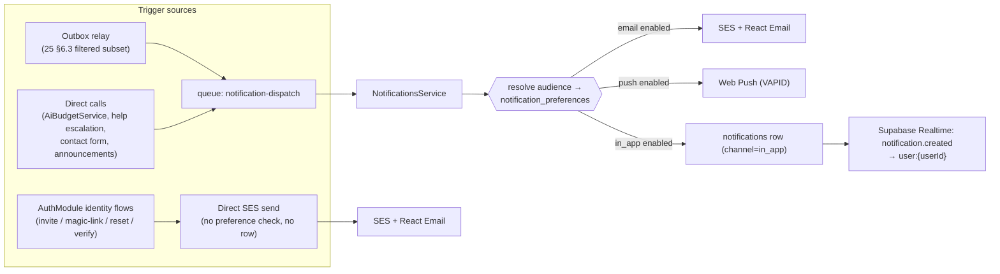
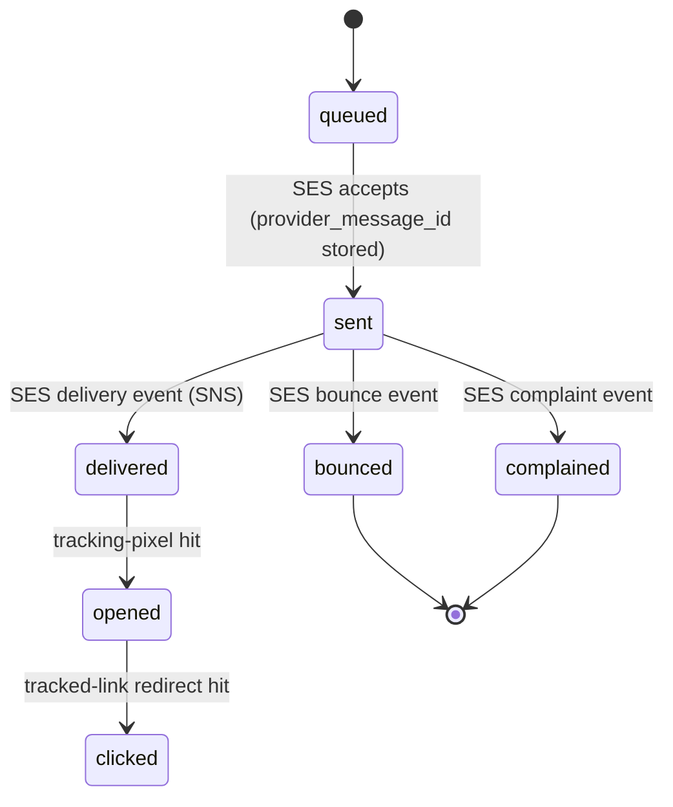
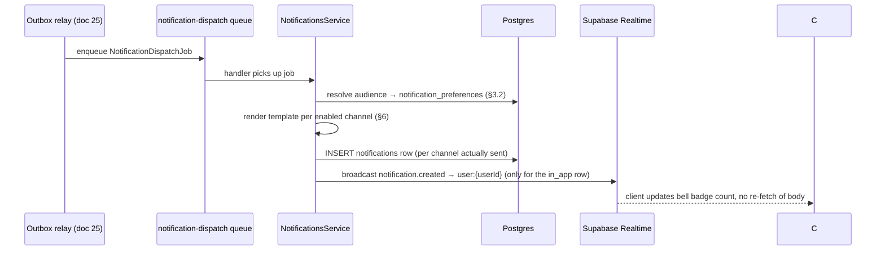

# 33 — Notification System

This document owns `notifications` and `notification_preferences` ([00-foundation.md](00-foundation.md) §7 "Platform") as the single choke point for **every** outbound communication Concourse sends, on every channel: **Email** (AWS SES + React Email, per foundation §6 — "via the notification service only"), **Web Push** (VAPID, for the installable PWA), and the **in-app inbox** (the bell in every authenticated shell). There is no separate email-system document — this is it. It specifies the `NotificationsModule` ([18-api-architecture.md](18-api-architecture.md) §1), the notification-category taxonomy and per-category opt-out rules, the React Email template architecture (one template per notification type), the automated-nudge throttle pattern, delivery tracking, and the `notification.created` realtime push. It does **not** own: the `domain_events` outbox or which events trigger a notification (that is [25-event-pipeline.md](25-event-pipeline.md) §6.3 — this document is the consumer of its fan-out); generic BullMQ retry/backoff conventions (owned by [27-background-jobs-architecture.md](27-background-jobs-architecture.md), applied here); Stripe's own invoice/dunning emails (Stripe sends those directly under its own brand — [36-billing-and-payments-architecture.md](36-billing-and-payments-architecture.md) territory, not routed through this service, per the boundary decision in §2.4); or the Help Center escalation form and SLA policy themselves (owned by [30-help-center-and-support.md](30-help-center-and-support.md) §7 — this document only renders and delivers the email that policy triggers). All persona, entity, and vocabulary use below is canonical per [00-foundation.md](00-foundation.md).

## 1. Ownership & Scope

| Topic | Owned here | Owned elsewhere |
|---|---|---|
| `notifications` / `notification_preferences` behavior, category taxonomy, opt-out rules | **This document** | Column-level DDL is canonicalized in [16-database-schema.md](16-database-schema.md) §8.2/§8.3 |
| Email channel (SES + React Email), Web Push (VAPID), in-app inbox — all three, end to end | **This document** | — |
| React Email template inventory, one per notification type | **This document** | — |
| Which domain events trigger a notification, and to whom | [25-event-pipeline.md](25-event-pipeline.md) §6.3 | This document consumes that fan-out |
| `notification-dispatch` queue mechanics (concurrency, generic retry policy) | [27-background-jobs-architecture.md](27-background-jobs-architecture.md) §5.2 | This document owns the job's *content* |
| `notification.created` realtime push (Supabase Realtime) | **This document** (emission) | Channel/RLS-authorization mechanics in [18-api-architecture.md](18-api-architecture.md) §7 |
| Broadcast announcement compose UI (`/announcements`) | [14-page-inventory.md](14-page-inventory.md) | This document owns the send mechanics it calls into |
| Help Center escalation form, SLA policy, routing rule | [30-help-center-and-support.md](30-help-center-and-support.md) §7 | This document renders/delivers the resulting email |
| Public `/contact` form fields and routing rule | [46-marketing-site.md](46-marketing-site.md) §7 | This document renders/delivers the resulting email |
| Invite/magic-link/reset/verify token mechanics (format, expiry, entropy) | [19-authentication-strategy.md](19-authentication-strategy.md) | This document renders/delivers the email those flows send |
| AI budget ceilings and the 80%/100% degradation ladder | [21-ai-architecture.md](21-ai-architecture.md) §6.2 | This document delivers the threshold notice |
| Analytics event taxonomy for notification interactions (opens, clicks as product events) | [32-analytics-architecture.md](32-analytics-architecture.md) | This document owns delivery-level (not product-analytics) tracking, §9 |

## 2. Architecture Overview

### 2.1 The `NotificationsModule`

All outbound communication funnels through **one NestJS module, `NotificationsModule`**, mounted by both deployables (`apps/api` for direct/synchronous triggers, `apps/worker` for the `notification-dispatch` queue consumer) — the same "one boundary, no other module calls the provider directly" discipline [21-ai-architecture.md](21-ai-architecture.md) §1 established for `AiModule`. Templates and rendering logic live in `packages/notifications`; only that package imports `@aws-sdk/client-ses` and `web-push`.



### 2.2 Two triggering paths

1. **Outbox-driven.** The relay ([25-event-pipeline.md](25-event-pipeline.md) §4) matches a claimed `domain_events` row against its §6.3 curated (not full-catalog) trigger table and enqueues a `notification-dispatch` job. This covers every notification with a clean underlying domain-event fact: booth reassignment, agenda change, lead-score threshold crossing, webhook auto-disable, file quarantine, event completion, and more (§4).
2. **Direct enqueue.** Any module with a transactional notification that has no independently-useful domain event of its own enqueues onto `notification-dispatch` directly ([27-background-jobs-architecture.md](27-background-jobs-architecture.md) §5.2's `NotificationDispatchJob.domainEventId` is optional for exactly this reason). Examples: `AiBudgetService` firing the 80%-of-budget notice inline during a pre-flight check (no one needs a standalone `ai_budget.threshold_crossed` domain event); the Help Center escalation and public contact-form handlers (§4.6); the `/announcements` broadcast composer.

### 2.3 Two delivery paths — the notification-object / bypass split

Every row in `notifications` requires a `user_id` ([16-database-schema.md](16-database-schema.md) §8.2) — the table models communication with a **known Concourse identity**. Two real cases fall outside that model, and rather than force them into it (or leave the mismatch unresolved), this document draws an explicit line:

| | **Notification-object sends** (default path) | **Direct transactional sends** (bypass path) |
|---|---|---|
| Recipient | An existing `users` row | A raw email address — no `users` row exists yet, or none is relevant |
| Examples | Everything in §4 tables | Org/exhibitor/exhibitor-staff invites, magic-link, password reset, email verification, public contact-form auto-reply |
| Persisted as a `notifications` row? | Yes | No — there is nothing to attach it to, and (for invites) no inbox to show it in |
| Subject to `notification_preferences`? | Yes, per §5 | No — you cannot unsubscribe from your own invite or password-reset email |
| Rendering | Same `packages/notifications` template registry, same SES transport | Same template registry, same SES transport |
| In-app inbox entry? | Yes (if `in_app` channel enabled) | No |

The bypass path still goes through the **single choke point** — `AuthModule` and the public contact-form handler call `NotificationsService.sendDirect(templateId, toEmail, data)`, never `@aws-sdk/client-ses` themselves — it is only the persistence/preference layer that is skipped, and only because there is no addressable, opt-out-capable identity yet. Once an invite is accepted, every subsequent communication to that person is a normal notification-object send.

### 2.4 Boundary: Stripe's own emails are out of scope

Stripe Billing (foundation §6) sends its own invoice, receipt, and dunning ("smart retry") emails directly under Stripe's sender identity as part of Checkout and the customer portal ([08-feature-matrix.md](08-feature-matrix.md) Q6). This is a deliberate exception to "one choke point," justified the same way payment-card data itself is excluded from Concourse's boundary: Stripe is the system of record for billing correspondence, its emails carry PCI-relevant and legally-mandated invoice formatting Concourse would only reproduce imperfectly, and Elena/Priya already expect billing mail to come from Stripe's domain. Any Concourse-authored billing *notice* that isn't Stripe's own transactional mail (e.g., a downgrade-pending warning) is a normal notification-object send in §4.

## 3. Data Model

### 3.1 `notifications` (canonical DDL: [16-database-schema.md](16-database-schema.md) §8.2)

| Column | Notes |
|---|---|
| `id`, `user_id`, `event_id?`, `category`, `channel`, `title`, `body_md`, `data`, `read_at` | As specified in doc 16 §8.2 |

**Additive delivery-tracking columns this document specifies and flags for doc 16 to fold into the next schema revision** (the same "register here, formalize there" discipline doc 16 §1 already uses for `help_articles.tags`-style extensions):

| Column | Type | Notes |
|---|---|---|
| `provider_message_id` | `text` | SES `MessageId`; join key for delivery events (§9). `NULL` for `push`/`in_app` rows. |
| `sent_at` | `timestamptz` | Set at successful handoff to SES/Web Push. |
| `delivered_at` | `timestamptz` | Set when SES's delivery notification arrives. |
| `bounced_at` / `bounce_type` | `timestamptz` / `text` | `CHECK IN ('permanent','transient','complaint') OR NULL`. Drives suppression (§11.2). |
| `opened_at` | `timestamptz` | Set on first tracking-pixel hit (email only). |
| `clicked_at` | `timestamptz` | Set on first tracked-link redirect hit. |

These are additive, nullable, and irrelevant to RLS or existing queries — `read_at`'s existing semantics (in-app "seen") are untouched.

### 3.2 `notification_preferences` (canonical DDL: doc 16 §8.3)

Recap: `(user_id, category, channel, event_id?)` with `event_id IS NULL` meaning the global default and a non-null value an event-scoped override, unique via `NULLS NOT DISTINCT` so exactly one global-default row can exist per `(user_id, category, channel)`. Resolution order for "is channel C of category K enabled for user U at event E": event-scoped row (if `E` is non-null and a row exists) → global-default row → the category's system default (§4). This mirrors the exact override pattern [11-information-architecture.md](11-information-architecture.md) §4.2 and [14-page-inventory.md](14-page-inventory.md)'s `/profile` `NotificationOverridePanel` already document from the UI side.

### 3.3 `push_subscriptions` (new supporting table, flagged for doc 16)

The `POST`/`DELETE /v1/users/me/push-subscriptions` routes ([18-api-architecture.md](18-api-architecture.md) §5.11) need a per-device, individually-deletable resource — a jsonb array on `users` cannot be targeted by id for `DELETE`. A dedicated table, sized for a handful of rows per user (one per installed PWA instance), is the same shape decision doc 16 made for `ai_usage_events` when doc 21 introduced it without a foundation-registry amendment:

| Column | Type | Notes |
|---|---|---|
| `id` | `uuid` | PK |
| `user_id` | `uuid NOT NULL` | FK → `users.id`, `ON DELETE CASCADE` |
| `endpoint` | `text NOT NULL` | The browser's push service endpoint URL |
| `p256dh_key`, `auth_key` | `text NOT NULL` | VAPID subscription keys |
| `user_agent` | `text` | For the device-management UI to show "Chrome on Pixel 7" |
| `last_used_at` | `timestamptz` | Updated on successful send; a subscription unused 90 days is pruned by the retention job ([38-data-retention-privacy-compliance.md](38-data-retention-privacy-compliance.md)) |

**Constraints:** `UNIQUE (user_id, endpoint)`. **RLS:** `USING (user_id = current_setting('app.current_user_id', true)::uuid)` — identical shape to `notifications`/`notification_preferences`.

## 4. Notification Category Taxonomy

Every category is a validated string in `packages/notifications/src/categories.ts` (an allowlist enum in code, stored as free `text` in the DB per doc 16 §8.2's explicit "grows without a migration" rationale). **Mandatory** channels in the tables below cannot be disabled by the user (§5); everything else defaults to the stated value and is user-optable.

### 4.1 Account & Security — identity-flow bypass sends (§2.3) plus one true notification-object category

| Category / template | Audience | Channels | Trigger |
|---|---|---|---|
| `auth.invite-org` *(bypass)* | Invited email address | Email (mandatory) | `POST /v1/organizations/{orgId}/invites` ([18-api-architecture.md](18-api-architecture.md) §5.2) |
| `auth.invite-exhibitor` *(bypass)* | Exhibitor contact email | Email (mandatory) | `event_exhibitors` row created ([05-organizer-journey.md](05-organizer-journey.md) O-4, feature D1) |
| `auth.invite-exhibitor-staff` *(bypass)* | Invited rep email | Email (mandatory) | `POST /v1/event-exhibitors/{id}/invites` (feature D5) |
| `auth.magic-link` *(bypass)* | Sofia's entered email | Email (mandatory) | `POST /v1/auth/magic-link/request` ([19-authentication-strategy.md](19-authentication-strategy.md) §9) |
| `auth.password-reset` *(bypass)* | Requesting email | Email (mandatory) | `POST /v1/auth/password-reset/request` |
| `auth.verify-email` *(bypass)* | Signup email | Email (mandatory) | Password-based signup (feature A1) |
| `account.new-device-alert` | The account owner | Email (mandatory), in-app (optional) | New `auth_sessions` row from an unrecognized device fingerprint ([20-session-strategy.md](20-session-strategy.md)) |

### 4.2 Organizer Operations (Priya, Marcus)

| Category | Audience | Channels | Default | Trigger |
|---|---|---|---|---|
| `organizer.exhibitor-nudge` | Exhibitor primary contact | Email | On | Bulk/automated reminder, `event_exhibitors.status = invited` older than 7 days ([05-organizer-journey.md](05-organizer-journey.md) O-4); throttled per §8 |
| `organizer.event-date-changed` | Accepted exhibitors + registered attendees | Email, in-app | On | `PATCH /v1/events/{eventId}` date fields on a `published` event (O-2 edge case) |
| `organizer.booth-reassigned` | Affected exhibitor staff; attendees who saved that exhibitor | Email, push, in-app | On | `booth.reassigned` domain event ([25-event-pipeline.md](25-event-pipeline.md) §5.2) |
| `organizer.agenda-changed` | Attendees who saved the agenda session | Push, in-app | On | Live-edit of a `live` event's `agenda_sessions` row (O-5 edge case) |
| `organizer.broadcast-announcement` | Organizer-selected segment (all attendees / one hall / one agenda session's attendees / all exhibitor staff) | Email, push, in-app (composer's choice) | On | `/announcements` composer, `announcements:manage` permission ([28-permission-model.md](28-permission-model.md)); FR-NOTIF-005 |
| `organizer.pulse-digest` | Priya, Marcus (`event:admin`/`event:staff`) | Email | On | Daily AI insight summary during `live` events (feature N2, FR-PULSE-002) |
| `webhook-endpoint-disabled` | Org owners/admins of the endpoint's org | Email, in-app | On | Endpoint auto-disabled after 100% failure for 5 consecutive days ([18-api-architecture.md](18-api-architecture.md) §9.6) |

### 4.3 Exhibitor Operations (Elena, Jamal)

| Category | Audience | Channels | Default | Trigger |
|---|---|---|---|---|
| `exhibitor.hot-lead-alert` | Lead's assigned rep (`leads.owner_user_id`) | Push, in-app | On | `lead.updated`'s score crosses the exhibitor's configured threshold (feature L4) |
| `exhibitor.followup-outbound` | Lead's registered attendee (resolved via `leads.registration_id → registrations.user_id`) | Email | On (recipient-side; cannot be sender-disabled) | Elena approves a Follow-up Studio draft for send ([21-ai-architecture.md](21-ai-architecture.md) §3.4); rendered under the exhibitor's own sending identity, mandatory unsubscribe footer per §5.2 |

### 4.4 Attendee Engagement (Sofia)

| Category | Audience | Channels | Default | Trigger |
|---|---|---|---|---|
| `registration.confirmed` | Registrant | Email (mandatory — carries the badge/QR) | On | `POST /v1/events/{eventId}/registrations` success ([19-authentication-strategy.md](19-authentication-strategy.md) §5.5's badge-claim email) |
| `attendee.pre-event-digest` | Registered attendees | Email | On | Scheduled send, T-1 week ([04-user-journey.md](04-user-journey.md)) |
| `attendee.post-event-recap` | Registered attendees | Email | On | `event.completed` fires ([07-attendee-journey.md](07-attendee-journey.md)) |
| `meeting.lifecycle` (`requested`/`confirmed`/`declined`/`cancelled` — one template per status) | Both meeting parties | Email, push, in-app | On | `meeting.updated` ([18-api-architecture.md](18-api-architecture.md) §7.3), feature I3 |
| `meeting.reminder` | Both meeting parties | Push, email (`.ics` attachment) | On | Scheduled T-1h before `meetings.starts_at` (feature I4) |

### 4.5 AI & Platform Notices

| Category | Audience | Channels | Default | Trigger |
|---|---|---|---|---|
| `ai.budget-threshold` (`scope: event \| event_exhibitor` in `data`) | Event scope → org owners/admins of the organizing org; exhibitor scope → that `event_exhibitor`'s `exhibitor:admin` staff | Email, in-app | On | `AiBudgetService` pre-flight check crosses 80% of any ceiling ([21-ai-architecture.md](21-ai-architecture.md) §6.2) |
| `file.quarantined` | Uploading user | Email, in-app | On (mandatory in spirit — a rejected upload always needs to reach the uploader) | AV scan verdict `infected` ([26-file-storage.md](26-file-storage.md) §10) |
| `legal.reconsent-required` | Any active user on a material `legal_documents` version change | Email, in-app | On | Re-consent trigger, `context: reconsent` ([46-marketing-site.md](46-marketing-site.md) §9.4) |

### 4.6 Support (both a notification-object send to Alex, and a bypass auto-reply to the submitter)

| Category / template | Audience | Channels | Default | Trigger |
|---|---|---|---|---|
| `support.help-escalation` | Alex Kim (`platform:admin`) — Phase 1's single named recipient, per [30-help-center-and-support.md](30-help-center-and-support.md) §7.3's explicit no-roster decision | Email (mandatory) | On | `help_escalation.submitted` ([30-help-center-and-support.md](30-help-center-and-support.md) §7.4); subject tagged `[SLA]` on `enterprise`-anchored escalations |
| `support.contact-form-routed` | Alex Kim (or `support@concourse.app` alias) | Email (mandatory) | On | `contact.form_submitted` ([46-marketing-site.md](46-marketing-site.md) §7.2) |
| `support.contact-form-autoreply` *(bypass)* | The anonymous submitter's entered email | Email | On | Same trigger, sent alongside the routed copy — no `users` row exists for an anonymous submitter |

### 4.7 Billing (Priya, Elena, Alex)

| Category | Audience | Channels | Default | Trigger |
|---|---|---|---|---|
| `billing.subscription_started` | Org owners/admins (`billing:manage`) of the subject organization | Email, in-app | On | `customer.subscription.created` webhook ([36-billing-and-payments-architecture.md](36-billing-and-payments-architecture.md) §7) |
| `billing.payment_failed` | Org owners/admins (`billing:manage`) of the subject organization | Email, in-app | On | `invoice.payment_failed` webhook, paired with the subscription's `past_due` transition ([36-billing-and-payments-architecture.md](36-billing-and-payments-architecture.md) §7, §10) |
| `billing.payment_recovered` | Org owners/admins (`billing:manage`) of the subject organization | Email, in-app | On | `customer.subscription.updated` (`past_due→active`) or `invoice.payment_succeeded` following a prior `past_due` ([36-billing-and-payments-architecture.md](36-billing-and-payments-architecture.md) §7) |
| `billing.trial_ending_soon` | Organizer org owners/admins (`billing:manage`) | Email, in-app | On | `customer.subscription.trial_will_end` webhook, 3 days out ([36-billing-and-payments-architecture.md](36-billing-and-payments-architecture.md) §7) |
| `billing.subscription_canceled` | Org owners/admins (`billing:manage`) of the subject organization | Email, in-app | On | `customer.subscription.deleted` webhook ([36-billing-and-payments-architecture.md](36-billing-and-payments-architecture.md) §7, §9) |
| `billing.dispute_opened` | Alex Kim (`platform:admin`) | Email, in-app | On | `charge.dispute.created` webhook ([36-billing-and-payments-architecture.md](36-billing-and-payments-architecture.md) §7) |

## 5. Per-Category Opt-Out Rules

**The rule:** every category/channel combination is user-optable *except* where the table above marks the channel **mandatory** — those exist because opting out would either strand the user (a badge/QR they need to enter the event) or defeat the point of the message (a security alert, an invite, your own password reset). No category may mark **every** channel mandatory except the identity-flow bypass sends in §4.1, which are outside the preference system entirely by construction (§2.3).

1. **FR-NOTIF-004 compliance:** the settings surface is `/account/notifications` (global) and, for attendees, `/e/[eventSlug]/profile`'s per-event override panel ([11-information-architecture.md](11-information-architecture.md) §4.2, [14-page-inventory.md](14-page-inventory.md)). Both write through `PUT /v1/users/me/notification-preferences`.
2. **One-click unsubscribe works without login.** Every non-mandatory email carries a `List-Unsubscribe` header and a footer link of the form `https://concourse.app/n/unsubscribe?u=<uid>&c=<category>&ch=<channel>&sig=<hmac>`, where `sig` is an HMAC-SHA256 over `u.c.ch` keyed by a server secret — stateless verification, no lookup token table required (the same signed-URL pattern [18-api-architecture.md](18-api-architecture.md) §3.2 already uses for pagination cursors). The link is a `GET` that flips `notification_preferences.enabled = false` (creating the global-default row if absent) and renders a static confirmation page.
3. **Idempotent by design:** re-clicking an unsubscribe link, or unsubscribing from an already-disabled category, is a no-op `200`, never an error — `already_unsubscribed` is documented in [41-error-code-registry.md](41-error-code-registry.md) as informational, not a failure state, per FR-NOTIF-004.
4. **Mandatory channels never render an unsubscribe footer or `List-Unsubscribe` header** — sending one on your own password-reset email would be actively wrong.
5. **Broadcast announcements (`organizer.broadcast-announcement`) remain user-optable** even though they are organizer-initiated: Concourse ships no "safety-critical override" flag in Phase 1 (no such requirement appears in [05-organizer-journey.md](05-organizer-journey.md) O-8, which frames announcements as an operational lever, not an emergency system) — introducing one is deferred to [44-future-expansion-plan.md](44-future-expansion-plan.md) pending a real incident-management need.

## 6. Template Architecture (React Email)

**One React Email component per notification type, versioned like a prompt.** Templates are code, reviewed and diffed like anything else — the same discipline [21-ai-architecture.md](21-ai-architecture.md) §4 applies to prompts, because an unreviewed change to transactional copy is just as much a production change as an unreviewed prompt edit.

```typescript
// packages/notifications/src/templates/registry.ts
interface TemplateDefinition<TData> {
  id: string;                     // 'registration.confirmed', matches the category (or a status-suffixed variant)
  category: string;               // taxonomy key, §4
  channels: ('email' | 'push' | 'in_app')[];
  component: React.ComponentType<TData>;   // React Email component, email channel only
  subject: (data: TData) => string;        // email subject / push title
  pushBody?: (data: TData) => string;      // short-form body for push/in_app
  mandatoryChannels?: ('email' | 'push' | 'in_app')[];
}

function defineTemplate<TData>(def: TemplateDefinition<TData>): TemplateDefinition<TData> { /* … */ }
```

- **Location:** `packages/notifications/src/templates/<category>/<TemplateId>.tsx`, one file per row in §4's tables (≈26 templates at last count, growing with the catalog per doc 16 §8.2's "grows without a migration" design).
- **Shared shell:** every email template composes a common `<NotificationLayout>` (React Email `Html`/`Body`/`Container`) carrying the Concourse header, footer, unsubscribe block (§5.4), and the design tokens owned by [39-design-system.md](39-design-system.md) — "notification copy templates" are explicitly that document's cross-reference into this one.
- **Merge data:** `templateData` (from the `NotificationDispatchJob`, [27-background-jobs-architecture.md](27-background-jobs-architecture.md) §5.2) is a plain object validated against a per-template Zod schema in `packages/shared` — the same "one schema → validation + types" discipline as everywhere else (foundation §6).
- **Manifest & drift detection:** a build step emits `templates.manifest.json` (`id → sha256(rendered-snapshot)`); CI fails if a template's committed snapshot changes without a version bump in its filename-adjacent changelog comment — a lighter-weight cousin of `AiModule`'s `prompts.manifest.json` ([21-ai-architecture.md](21-ai-architecture.md) §4), proportional to the lower risk (copy, not model behavior).
- **Localization:** Phase 1 templates are authored in English only. The Zod-schema-per-template structure is the i18n seam ([10-non-functional-requirements.md](10-non-functional-requirements.md) §9's "i18n readiness in scope"); localized template variants are explicitly deferred to [44-future-expansion-plan.md](44-future-expansion-plan.md), triggered by the first non-English-market enterprise deal.
- **Push/in-app rendering:** push notifications and in-app rows never render the full React Email component — they use `subject`/`pushBody`, kept under platform push-payload limits (Web Push practical ceiling ~4 KB); `data` on the `notifications` row carries the deep link ([12-navigation-structure.md](12-navigation-structure.md) §9's "notification taps always deep-link to the entity route").

## 7. Delivery Channels

### 7.1 Email (AWS SES)

- Single verified sending domain `concourse.app`, with per-category sender *display name* (e.g. "Concourse", "{Exhibitor} via Concourse" for `exhibitor.followup-outbound`) but a consistent envelope-from for deliverability (SPF/DKIM/DMARC aligned).
- SES is called only from `packages/notifications`; a configuration set with SNS event destinations feeds delivery tracking (§9).
- **Capacity:** peak single-send-window volume (a pre-event digest to a 50,000-attendee event) is budgeted at [10-non-functional-requirements.md](10-non-functional-requirements.md) §NFR-CAP-05 — the `notification-dispatch` queue batches SES `SendBulkTemplatedEmail`-equivalent calls (React Email renders once per recipient for personalization, batched sends at SES's rate limit) rather than one job per recipient, to stay within SES's per-second send-rate ceiling without starving interactive-path notifications (meeting confirmations, hot-lead alerts) queued behind a digest run — the queue's own priority (§10) is what protects those, not send batching.

### 7.2 Web Push (VAPID)

- Subscriptions registered client-side via the PWA's service worker against `push_subscriptions` (§3.3).
- A dead/expired subscription (HTTP 404/410 from the push service) triggers immediate deletion of that row and, per FR-NOTIF-002, silent fallback to the in-app channel for that send — the user is never shown an error for infrastructure they don't control.
- Payload is `{ title, body, deepLink, category }`, capped and encrypted per the Web Push protocol; no PII beyond what the recipient's own `data` already permits.

### 7.3 In-App Inbox

- `GET /v1/users/me/notifications` returns `channel = 'in_app'` rows only — email/push rows exist in the same table purely as delivery-tracking records (§3.1) and are never surfaced as separate inbox items, resolving what would otherwise be duplicate entries for one logical event delivered on three channels.
- `POST /v1/users/me/notifications/mark-read` (`ids: []` or `all: true`) sets `read_at`; the bell badge count is `COUNT(*) WHERE channel = 'in_app' AND read_at IS NULL`.
- Attendee-surface inbox lives at `/e/[eventSlug]/notifications` (event-scoped view over the same global table, filtered by `event_id`); the global equivalent for organizer/exhibitor surfaces is the topbar bell's popover panel ([12-navigation-structure.md](12-navigation-structure.md) §11). Platform Admin's `AdminShell` deliberately has no bell — Alex Kim routes through on-call tooling, not self-serve notification UX (consistent with [30-help-center-and-support.md](30-help-center-and-support.md) §3's identical rationale for omitting the help widget there).

## 8. Automated-Nudge Throttling (generalized pattern)

[05-organizer-journey.md](05-organizer-journey.md) O-4 fixes one instance of this — exhibitor reminders capped at one per exhibitor per 72 hours — but the underlying primitive is reusable anywhere an *automated* (not human-authored) reminder could otherwise fire repeatedly for the same target. `NotificationsService` exposes it as a per-category configuration, not a one-off in the exhibitor-tracker code:

```typescript
interface NudgeThrottleConfig {
  category: string;
  windowHours: number;          // e.g. 72
  key: (data: TemplateData) => string;   // what counts as "the same target"
}
```

Enforced with a Redis key `nudge-throttle:{category}:{key}` set with `EX {windowHours * 3600}` on first send, `NX` on every subsequent attempt — an attempt that fails the `NX` set is silently dropped (not queued, not errored; the audience still has the in-product state to look at, per [04-user-journey.md](04-user-journey.md)'s "email nudges accompany, never replace, an in-product status").

| Category | Window | Throttle key |
|---|---|---|
| `organizer.exhibitor-nudge` (automated bulk reminder) | 72 h | `event_exhibitor_id` |
| `exhibitor.hot-lead-alert` | 30 min | `lead_id` (a rapidly re-qualifying lead shouldn't re-page Jamal every visit) |

**Explicitly not throttled:** the manual, personal (non-templated) nudge Priya can send from a stale exhibitor's detail page ([05-organizer-journey.md](05-organizer-journey.md) O-4 edge case) — a human choosing to send one message is never rate-limited by this mechanism; only the automated path is.

## 9. Delivery Tracking

Follow-up Studio's dashboard needs open/click data per [21-ai-architecture.md](21-ai-architecture.md) §3.4 ("delivery via the notification service"); this is the mechanism.



1. **Ingestion:** SES's configuration set publishes delivery/bounce/complaint events to an SNS topic; a worker-internal endpoint (`POST /v1/internal/notifications/ses-events`, Ed25519 service-JWT per [18-api-architecture.md](18-api-architecture.md) §10) consumes them and updates the matching `notifications` row by `provider_message_id`.
2. **Opens/clicks:** every rendered email embeds a 1×1 tracking pixel (`/n/open?nid=<id>`) and rewrites outbound links to `/n/click?nid=<id>&url=<encoded>` (redirect-and-log). Both are unauthenticated, rate-limited GETs that update `opened_at`/`clicked_at` and 302 through.
3. **Consumption:** `exhibitor.followup-outbound` rows expose per-lead open/click state through `GET /v1/leads/{leadId}?expand=...` (an expansion Follow-up Studio's dashboard reads, per the "expansion, not sparse fieldsets" convention, [18-api-architecture.md](18-api-architecture.md) §3.4) — this document supplies the columns; the Follow-up Studio UI surface itself is [21-ai-architecture.md](21-ai-architecture.md)'s.
4. **Bounces feed suppression** (§11.2) rather than product analytics; aggregate open/click *rates* as a metric-catalog entry are [32-analytics-architecture.md](32-analytics-architecture.md)'s concern, fed by the same underlying columns.

## 10. Fan-Out Pipeline & Realtime Push



The `NotificationDispatchJob` shape is fixed in [27-background-jobs-architecture.md](27-background-jobs-architecture.md) §5.2:

```typescript
interface NotificationDispatchJob {
  domainEventId?: string;
  category: string;
  audienceUserIds: string[];
  templateId: string;
  templateData: Record<string, unknown>;
  meta: { requestId: string; traceId: string; principal: unknown };
}
```

`notification.created` is **not** sourced from `domain_events` — per [25-event-pipeline.md](25-event-pipeline.md) §7's explicit clarification, it is an ephemeral, gateway-internal push `NotificationsModule` emits directly after its own `in_app`-row insert, carrying only `{ notificationId, category }` so the client re-fetches the body via the REST endpoint rather than trusting a socket payload as the source of truth ([18-api-architecture.md](18-api-architecture.md) §7.3's "thin invalidation hints" rule).

## 11. Reliability & Failure Handling

### 11.1 Retry policy

`notification-dispatch` uses the general BullMQ retry policy ([27-background-jobs-architecture.md](27-background-jobs-architecture.md) §4.1) at priority 2 (High), concurrency 30. A job failing all retries logs a bounce per FR-NOTIF-001 rather than surfacing a user-facing error — nobody is staring at a spinner waiting for an email.

### 11.2 Bounce & complaint handling

| Event | Action |
|---|---|
| `bounced` (`bounce_type: permanent`) | Address added to a suppression list (Redis set + periodic Postgres flush); future sends to that address short-circuit to a no-op with a logged skip, never a repeated bounce |
| `bounced` (`transient`) | Retried per the template's own send policy (default: once, +30 min) before falling to permanent-bounce handling |
| `complained` | Immediate suppression, all categories, no override — a complaint is a stronger signal than an unsubscribe click and is treated at least as strongly |

### 11.3 Push failures

Covered in §7.2 — `push_unregistered` falls back to in-app per FR-NOTIF-002; no user-facing error, no retry against a dead endpoint.

### 11.4 Idempotency

Re-processing the same `NotificationDispatchJob` (BullMQ's deterministic `jobId` from the relay, [25-event-pipeline.md](25-event-pipeline.md) §4) is a harmless duplicate send at worst — sending the same email twice is a UX nuisance, not a correctness bug, exactly the tolerance [25-event-pipeline.md](25-event-pipeline.md) §7 already documents for this consumer. `sendDirect` bypass calls (§2.3) inherit the same tolerance; identity-flow tokens are themselves single-use (doc 19 §3), so a duplicate email at worst lets a user click either copy of the same still-valid link.

## 12. Security & Privacy

1. **Tenant isolation:** `notifications`/`notification_preferences`/`push_subscriptions` RLS is uniformly `user_id = current_user_id` (§3) — there is no cross-tenant read path onto another user's notifications, including for `platform:admin` (Alex reads notification *health*, not notification *content*, via [31-observability.md](31-observability.md) dashboards, never a direct table query).
2. **No badge codes, no raw contact details beyond consent scope in template data** — the same discipline [21-ai-architecture.md](21-ai-architecture.md) §10 applies to AI prompts applies here: `exhibitor.followup-outbound` template data is populated exclusively from the lead's `contact_consent_scope` ([16-database-schema.md](16-database-schema.md) §6.6), and a lead lacking contact consent is excluded from the audience entirely — never silently redacted mid-render.
3. **Unsubscribe-link HMAC secret** is managed alongside the other signed-URL secrets (webhook, cursor) per [43-security-architecture.md](43-security-architecture.md).
4. **Rate limits on the two unauthenticated GET endpoints** (`/n/unsubscribe`, `/n/open`, `/n/click`) reuse the "unauthenticated per IP" bucket ([18-api-architecture.md](18-api-architecture.md) §3.8) to prevent enumeration/abuse.
5. **Public contact-form auto-reply (§4.6) is rate-limited at the form itself** (5/hr, 20/day per IP, [46-marketing-site.md](46-marketing-site.md) §7.3), not re-limited here — this document trusts the caller's own guard rather than duplicating it.

## 13. Explicitly Deferred

| Item | Disposition |
|---|---|
| SMS as a fourth channel | [44-future-expansion-plan.md](44-future-expansion-plan.md) — no requirement surfaced anywhere in docs 00–31/46; revisit if an enterprise deal requires it |
| Localized (non-English) templates | §6 — deferred, i18n seam already prepared |
| Safety-critical / non-optable broadcast override | §5.5 — deferred pending a real incident-management need |
| In-app notification grouping/digest ("3 new leads" collapsed to one row) | [44-future-expansion-plan.md](44-future-expansion-plan.md) — a UX refinement, not a Phase-1 blocker; every notification is individually actionable today, just not visually clustered |
| Multi-recipient support routing for `support.help-escalation` | Already deferred by [30-help-center-and-support.md](30-help-center-and-support.md) §7.3 — this document inherits that disposition rather than restating it |

## 14. Related Documents

| Document | Relationship |
|---|---|
| [00-foundation.md](00-foundation.md) | Canonical entity registry (§7), tech stack (§6: SES, React Email, VAPID) |
| [16-database-schema.md](16-database-schema.md) | Canonical DDL owner for `notifications`, `notification_preferences`, and the additive columns/table this document specifies (§3) |
| [18-api-architecture.md](18-api-architecture.md) | Notification/push-subscription REST routes (§5.11), Supabase Realtime topology consumed by §10 |
| [25-event-pipeline.md](25-event-pipeline.md) | Domain-event catalog and the trigger-to-audience mapping this document's dispatch pipeline consumes |
| [27-background-jobs-architecture.md](27-background-jobs-architecture.md) | `notification-dispatch` queue mechanics (concurrency, generic retry) |
| [19-authentication-strategy.md](19-authentication-strategy.md) | Token mechanics behind every identity-flow bypass send (§2.3, §4.1) |
| [21-ai-architecture.md](21-ai-architecture.md) | AI budget-threshold trigger (§4.5), Follow-up Studio's consumption of delivery tracking (§9) |
| [30-help-center-and-support.md](30-help-center-and-support.md) | Help escalation form/SLA policy behind §4.6 |
| [46-marketing-site.md](46-marketing-site.md) | Public contact-form routing behind §4.6 |
| [39-design-system.md](39-design-system.md) | Visual tokens/voice-and-tone the React Email shell (§6) inherits |
| [38-data-retention-privacy-compliance.md](38-data-retention-privacy-compliance.md) | Retention of `notifications` history, `push_subscriptions` pruning, consent-scope enforcement (§12) |
| [44-future-expansion-plan.md](44-future-expansion-plan.md) | Every item in §13 |
