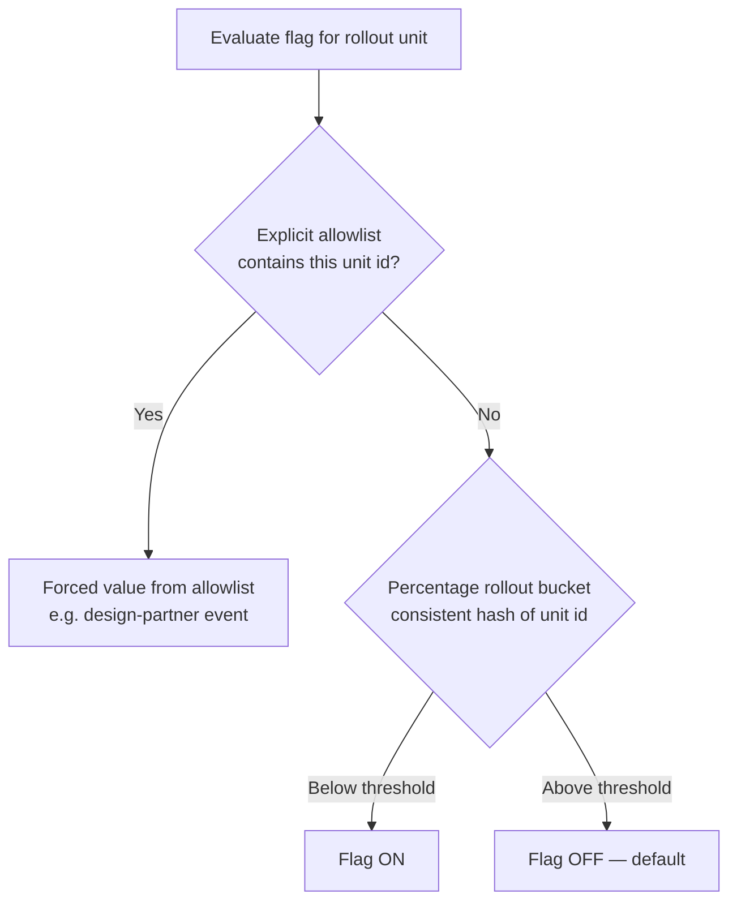
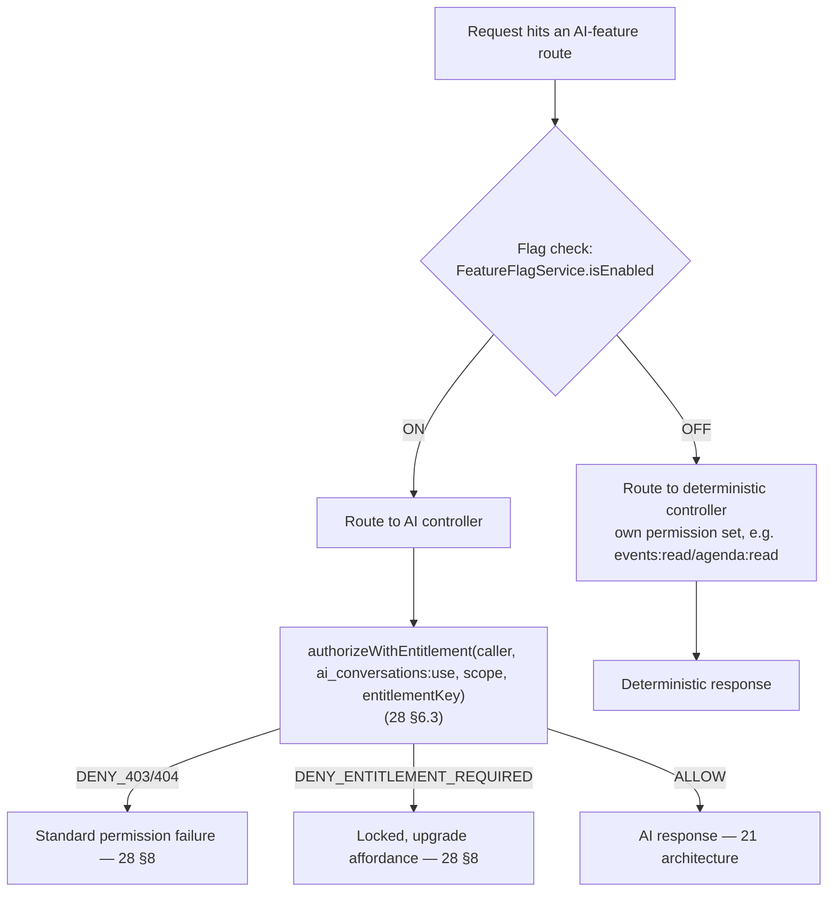
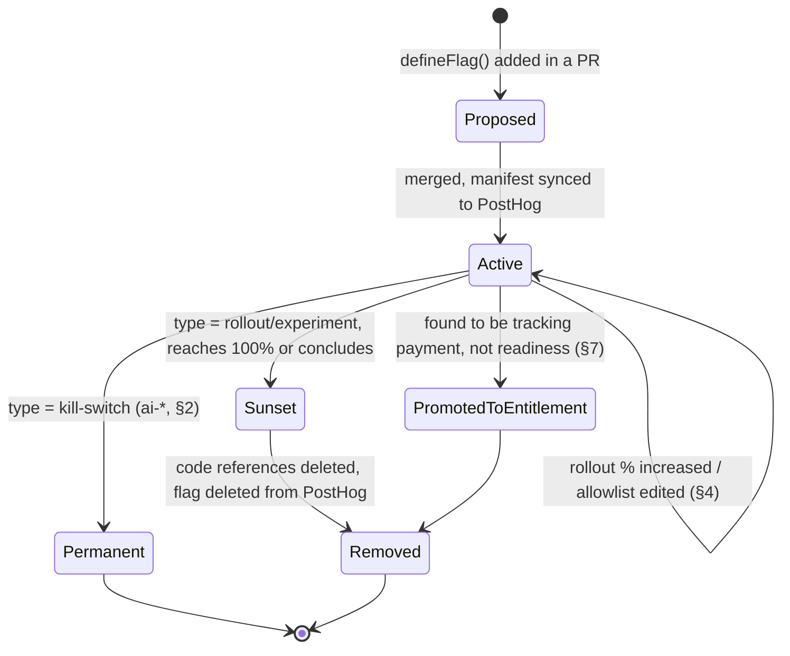

# Feature Flags and Experimentation

This document owns the PostHog-backed feature flag system end to end: the naming convention and flag
taxonomy, the consolidated kill-switch registry for the five AI features named in
[21-ai-architecture.md](21-ai-architecture.md) §8.2, evaluation architecture and caching, per-tenant
and per-event rollout mechanics (percentage rollout and the design-partner allowlist), the
experimentation (A/B test) model, flag lifecycle and governance, and the `/admin/flags` management
surface named in [11-information-architecture.md](11-information-architecture.md) §4.8. It draws the
explicit line between a **feature flag** (an ops kill-switch/rollout mechanism owned here) and an
**entitlement** (a commercial gate owned by [28-permission-model.md](28-permission-model.md) and
[08-feature-matrix.md](08-feature-matrix.md) §3) — the two render visually similar locked/disabled UI
but answer completely different questions and must never be confused in code or copy.

Explicitly **not** owned here: which model each AI feature calls and its degradation matrix
([21-ai-architecture.md](21-ai-architecture.md) §3, §8.3), the entitlement key registry and
plan/tier grants ([08-feature-matrix.md](08-feature-matrix.md) §3), the role→permission matrix and
entitlement-check semantics ([28-permission-model.md](28-permission-model.md) §3–§6), what gets written
to the immutable audit trail ([29-audit-logging-architecture.md](29-audit-logging-architecture.md)),
dashboards and alert routing ([31-observability.md](31-observability.md)), and product-analytics event
taxonomy and experiment result reporting ([32-analytics-architecture.md](32-analytics-architecture.md)).

---

## 1. Flag Taxonomy and Naming Convention

All flags are `kebab-case` and scoped by a prefix, per
[00-foundation.md](00-foundation.md) §11's canonical naming rule (`ai-followup-studio` is the locked
example). This document extends that single example into the full taxonomy every future flag must fit:

| Prefix | Category | Answers | Lifespan | Example |
|---|---|---|---|---|
| `ai-` | AI feature kill-switch | "Is this AI feature allowed to run right now?" | Permanent (standing safety control, never sunset) | `ai-expo-copilot` |
| `ops-` | Operational rollout | "Is this (non-AI) code path safe to serve yet?" | Transient — removed once at 100% and stable for one release cycle | `ops-checkin-scanner-v2` |
| `exp-` | Experiment / A-B test | "Which variant performs better?" | Transient — removed at experiment conclusion (§8) | `exp-matchmaking-cta-copy` |

Rules that keep the taxonomy from decaying:

1. **One flag, one prefix, one purpose.** A flag is never reused across categories after it ships — an
   `ops-` rollout flag that reaches 100% is deleted, not repurposed into a permanent toggle. A capability
   that needs to stay permanently switchable belongs in the `ai-` kill-switch pattern (§2) or, if the
   restriction tracks payment rather than safety, becomes an entitlement key instead (§7).
2. **The flag key names the capability, not the team or the ticket.** `ai-followup-studio`, not
   `followup-studio-2027-q1` or `elena-team-flag`.
3. **No environment suffixes.** Environment is a PostHog project/API-key concern (staging vs.
   production keys), never part of the flag key — the same key means the same thing everywhere.

## 2. Kill-Switch Registry — AI Features

This is the canonical, consolidated registry for the five flags first introduced in
[21-ai-architecture.md](21-ai-architecture.md) §8.2. That document remains authoritative for each
feature's per-flag *fallback user experience* (its §8.3 degradation matrix); this table is authoritative
for the flag's *mechanics* — scope, entitlement dependency, and milestone.

| Flag | Feature (00 §10) | Persona(s) | Entitlement anchor ([08-feature-matrix.md](08-feature-matrix.md) §3) | Milestone | Rollout unit (§5) | Fallback on kill (detail: 21 §8.3) |
|---|---|---|---|---|---|---|
| `ai-expo-copilot` | Expo Copilot | Sofia | `entitlement:expo_copilot` (organizer org) | M3 | `event` | Deterministic event search + browse |
| `ai-smart-matchmaking` | Smart Matchmaking | Sofia, Elena | `entitlement:matchmaking` (organizer org) + `entitlement:matchmaking_priority` (event_exhibitor) | M3 | `event` | Template reasons over stored evidence; category browse |
| `ai-lead-intelligence` | Lead Intelligence | Jamal, Elena | `entitlement:lead_intelligence` (event_exhibitor) | M3 | `event` | Rule-only score + raw interaction timeline |
| `ai-followup-studio` | Follow-up Studio | Elena | `entitlement:followup_studio` (event_exhibitor) | M4 | `event` | Merge-field template sequences |
| `ai-organizer-pulse` | Organizer Pulse | Priya | `entitlement:organizer_pulse` (organizer org) | M4 | `event` | Standard analytics dashboards ([32-analytics-architecture.md](32-analytics-architecture.md)) |

All five are marked `permanent: true` in the flag registry (§9) — they are standing safety controls
that ship alongside their feature at its milestone and are never scheduled for removal. Every one of
them defaults to **event**-scoped rollout, not organization- or platform-wide, because the natural
blast-radius unit for an AI incident is one live event, not one organizer's entire portfolio (§5).

## 3. Flag Evaluation Architecture

Server-side evaluation only — flags gate what the API/worker services execute, never client-only logic,
so a flipped kill-switch is enforced even against a stale, already-loaded client bundle.

**Public port** (the only surface features may call, mirroring the `AiModule` port pattern in
[21-ai-architecture.md](21-ai-architecture.md) §1):

```typescript
interface FeatureFlagService {
  isEnabled(key: FlagKey, context: FlagContext): Promise<boolean>;
  getPayload<T>(key: FlagKey, context: FlagContext): Promise<T | null>;
  getVariant(key: FlagKey, context: FlagContext): Promise<string | null>; // experiments only, §8
}

interface FlagContext {
  organizationId?: string;   // organizer or exhibitor org
  eventId?: string;          // primary rollout unit for ai-* flags
  eventExhibitorId?: string; // used only by exhibitor-tier-adjacent experiments
  userId?: string;           // person-level context, reserved (§13)
}
```

`FeatureFlagService` wraps the PostHog Node SDK inside `packages/flags`, mounted by both `apps/api` and
`apps/worker` — the same "one module, one boundary" discipline [21-ai-architecture.md](21-ai-architecture.md)
§1 applies to AI calls applies here to flag calls, and for the same reason: a feature module reaching
around the port could bypass the cache, the audit hook, or the fail-safe default (§13).

```mermaid
flowchart LR
  subgraph callers["Feature modules (api + worker)"]
    F1[Expo Copilot module] --> P
    F2[Smart Matchmaking module] --> P
    F3[Any ops-/exp- gated module] --> P
  end
  P[FeatureFlagService port] --> C{Redis cache<br/>flags:eval:hit?}
  C -->|hit, fresh| R[Return cached value]
  C -->|miss/stale| D[PostHog /decide API]
  D --> W[Write-through to Redis<br/>TTL 30s]
  W --> R
  D -.->|PostHog unreachable| S[Fail-safe default (§13)]
```

**Caching.** Every evaluation is cached in Redis (foundation §6) keyed
`flags:eval:{flagKey}:{rolloutUnitType}:{rolloutUnitId}`, TTL 30 seconds — short enough that a flag
flip is visible within the "seconds, no deploy" promise ([21-ai-architecture.md](21-ai-architecture.md)
§8.2), long enough that a live event's request volume never turns into PostHog `/decide` traffic.
A PostHog webhook on flag change additionally **actively busts** the matching cache keys rather than
waiting out the TTL, so an emergency kill-switch flip (§10) is felt on the very next request, not up
to 30 seconds later.

## 4. Rollout Mechanics: Percentage Rollout and Design-Partner Allowlists

Every flag resolves through an ordered decision list — PostHog's *release conditions*, evaluated
top to bottom, first match wins:



1. **Explicit allowlist** — an ordered list of `event_id` (or `organization_id` for org-scoped flags)
   values forced to a specific value regardless of the percentage rollout below. This is the mechanism
   for the **design-partner events** named in the GTM-1 phase ([02-business-goals.md](02-business-goals.md)
   §3): during Year 1, every one of the 3–5 design-partner events is added to each `ai-*` flag's
   allowlist as part of event setup, guaranteeing "all five AI features live in production at a real
   event" (GTM-1 exit criterion) independent of whatever percentage rollout the flag is otherwise at.
2. **Percentage rollout** — a consistent hash of the rollout-unit id buckets it into `0–99`; the flag
   carries a threshold (e.g. `25` = the bottom quartile of buckets get `true`). This is the GTM-2-and-onward
   mechanism: once organizers self-serve onto `professional` outside the design-partner program
   (§3 of [02-business-goals.md](02-business-goals.md)), the population is too large and too
   undifferentiated for a hand-maintained allowlist, and progressive percentage rollout becomes the
   right tool for de-risking a new model version or prompt change (per the eval-gated CI process in
   [21-ai-architecture.md](21-ai-architecture.md) §5).

During GTM-1, the allowlist mechanism **is** the rollout mechanism — the explicit list and the
"turn every design-partner event on" business goal are the same list by construction, which is why the
allowlist is evaluated first: it is a standing override, not a phase-in.

## 5. Per-Tenant and Per-Event Scoping

The rollout unit — the id a flag is bucketed and allowlisted against — is declared per flag at
definition time (§9), not inferred at call time:

| Rollout unit | `distinct_id` source | Used by | Rationale |
|---|---|---|---|
| `event` | `events.id` | All five `ai-*` kill-switches (§2); most `exp-*` experiments touching event-scoped surfaces (Attendee App, Exhibitor Portal event scope) | An AI incident's blast radius should be one live event, not an organizer's whole portfolio or every event on the platform; this also matches the design-partner allowlist unit (§4) |
| `organization` | `organizations.id` | `ops-*` flags for organization-wide surfaces (e.g. a new Organizer Console shell); experiments on org-level flows (billing, settings) | Some surfaces (org dashboard, settings) have no event context at request time |
| `user` | `users.id` | Reserved — no shipped flag uses this yet (§13) | Person-level A/B on individual UI treatments, deferred per §13 |

A flag's rollout unit also determines which PostHog **group type** it evaluates against: `event` and
`organization` are registered as PostHog groups (not just person properties), so a percentage rollout
or allowlist entry is defined once per event/organization rather than needing every attendee or staff
member of that event to be independently bucketed — consistent with `event_staff`/`exhibitor_staff`/
`registrations` all being *many users under one tenant-scoped entity* (foundation §7): the flag follows
the entity, not each person under it.

```json
{
  "distinct_id": "system-eval",
  "groups": { "event": "01933b3e-...-event-uuid" },
  "person_properties": {},
  "group_properties": {
    "event": { "milestone": "M3", "organizer_plan": "professional", "is_design_partner": true }
  }
}
```

This is the shape of the context sent to PostHog's `/decide` endpoint for an `ai-expo-copilot`
evaluation — `is_design_partner` is the group property the allowlist condition (§4) matches on, kept as
a first-class property rather than only an opaque id list so the PostHog dashboard (§10) is
self-explanatory to Alex without cross-referencing the event table.

## 6. Evaluation Order: Flags, Permissions, and Entitlements

Flags are **not** a fourth column in [28-permission-model.md](28-permission-model.md) §6.3's
`authorizeWithEntitlement` — they run strictly before it, as a routing decision between two entirely
different code paths (the AI path and its deterministic equivalent), each of which then applies its own
permission and entitlement checks independently:



This ordering is deliberate, not incidental: **a killed flag makes the AI code path unreachable, so
there is nothing for the permission/entitlement chain to evaluate.** This is exactly why AI features
degrade to "a working deterministic experience" rather than an error state ([00-foundation.md](00-foundation.md)
§10) — the deterministic controller is a fully independent, always-permitted code path with its own
ordinary permission checks (e.g. Copilot's deterministic fallback uses the Attendee App's directory
search, gated only by `agenda:read`/`event_exhibitors:read`, never by `ai_conversations:use`).

## 7. Flags vs. Entitlements — The Line

Both a killed flag and a missing entitlement can render a locked- or disabled-looking control, which is
exactly why this line must be explicit and enforced in code review, not left to convention:

| Dimension | Feature flag (this document) | Entitlement ([28-permission-model.md](28-permission-model.md) §6) |
|---|---|---|
| Question answered | "Is this capability safe/ready to run right now?" | "Has the relevant tenant paid for this capability?" |
| Owning system | PostHog + Redis cache (this doc) | `plans → subscriptions → entitlements` in Postgres, Stripe-synced ([16-database-schema.md](16-database-schema.md), [36-billing-and-payments-architecture.md](36-billing-and-payments-architecture.md)) |
| Change trigger | Engineering/ops decision: incident response, progressive rollout, design-partner enablement | Commercial event: purchase, upgrade, downgrade, Stripe webhook |
| Who can change it | `platform:admin` only, via `/admin/flags` (§10) | Nobody flips code directly — resolved automatically from billing state; platform admin can grant a manual override ([08-feature-matrix.md](08-feature-matrix.md) §4.17 Q2) |
| Anchor / granularity | `event` or `organization` — chosen for ops blast-radius (§5) | Organizer organization (plan keys) or `event_exhibitors` row (tier keys) — chosen for commercial correctness ([28-permission-model.md](28-permission-model.md) §6.1) |
| Evaluation relative to the other | First — routes to a code path (§6) | Second — only reached once the flag has already routed to the AI path |
| UI when the gate is closed | Deterministic fallback, no upgrade copy — the feature isn't "not purchased," it's "not running right now" | Locked state with upgrade/plan-contact affordance ([28-permission-model.md](28-permission-model.md) §8) |
| Expected lifespan | `ai-*` kill-switches: permanent. `ops-*`/`exp-*`: transient, removed on completion (§9) | Durable for the life of the plan/tier structure |
| Failure posture | Fails closed to the deterministic baseline, silently at request scale (§13) | Fails closed but always visible/discoverable ([08-feature-matrix.md](08-feature-matrix.md) §5 rule 2) |

Two rules resolve every case where the two could be confused:

1. **A flag being off must never produce upgrade/upsell copy, even for a tenant that would also lack
   the entitlement.** The client cannot infer commercial state from an ops signal — the deterministic
   fallback notice ("Copilot is temporarily unavailable," [21-ai-architecture.md](21-ai-architecture.md)
   §3.1) is the only copy a killed flag is allowed to produce.
2. **An entitlement being missing must never be described in "temporarily unavailable" ops language.**
   That framing hides a monetizable moment behind what reads as an outage; entitlement gates always use
   the locked/upgrade UI ([28-permission-model.md](28-permission-model.md) §8), never a flag-style
   notice.

If a restriction is found to be tracking payment status rather than operational readiness, it is not a
flag — it is promoted to an entitlement key in [08-feature-matrix.md](08-feature-matrix.md) §3. If a
flag is still gating a capability well past its rollout window with no incident or business reason,
that is flag debt (§9), not a permanent design.

## 8. Experimentation

`exp-*` flags are PostHog **multivariate** flags (2+ variants, not simply on/off) analyzed with
PostHog Experiments' built-in statistical significance testing. Two rules keep experiments from
colliding with the kill-switch system:

1. **`ai-*` kill-switches are never multivariate and never double as experiments.** Mixing "is this
   safe to run" with "which variant converts better" makes incident response ambiguous — a responder
   flipping `ai-expo-copilot` off during a live event must not have to reason about which of several
   variants was serving traffic. Experimentation on an AI feature's *prompt or behavior* runs through
   the eval-gated prompt-version pipeline ([21-ai-architecture.md](21-ai-architecture.md) §4–§5)
   instead, not through this flag system.
2. **Every experiment declares a guardrail metric before launch**, drawn from the KPI tree
   ([02-business-goals.md](02-business-goals.md) §5) — most commonly a component feeding
   **Qualified Connections per Event**. An experiment that regresses its guardrail metric beyond a
   pre-registered threshold is auto-flagged for review; result computation and reporting are owned by
   [32-analytics-architecture.md](32-analytics-architecture.md), which already owns the metric catalog
   these guardrails are drawn from.

```json
{
  "key": "exp-matchmaking-cta-copy",
  "type": "experiment",
  "rolloutUnit": "event",
  "variants": [
    { "key": "control", "rollout_percentage": 50 },
    { "key": "reasons-first", "rollout_percentage": 50 }
  ],
  "guardrailMetric": "matchmaking_acceptance_rate",
  "owner": "elena-experience-pod",
  "sunsetBy": "2026-10-01"
}
```

Experiments are always **event**- or **organization**-scoped, matching §5 — no experiment ships at
person-level granularity in Phase 1 (§13).

## 9. Flag Lifecycle, Governance, and Flag Debt

Flags are **declared in code, not created ad hoc in the PostHog dashboard** — the same discipline
[21-ai-architecture.md](21-ai-architecture.md) §4 applies to prompts applies here, for the same reason
(an unreviewed toggle is a production change):

```typescript
defineFlag({
  key: 'ai-followup-studio',
  type: 'kill-switch',       // 'kill-switch' | 'rollout' | 'experiment'
  rolloutUnit: 'event',
  owner: 'ai-platform-pod',
  permanent: true,           // kill-switches never carry a sunsetBy
});

defineFlag({
  key: 'ops-checkin-scanner-v2',
  type: 'rollout',
  rolloutUnit: 'event',
  owner: 'floor-ops-pod',
  permanent: false,
  sunsetBy: '2026-09-01',    // required for every non-permanent flag
});
```

A build step compiles every `defineFlag` call in `packages/flags/src/registry.ts` into a manifest and
idempotently upserts it into PostHog via CI (mirroring the `prompts.manifest.json` build step in
[21-ai-architecture.md](21-ai-architecture.md) §4) — the PostHog dashboard reflects the registry, never
the other way around.



**Governance cadence.** A monthly review (owned by Alex Kim as platform admin) surfaces, via
`/admin/flags` (§10): every non-permanent flag past its `sunsetBy` date (flag debt), every flag with no
remaining code references (CI lints the registry manifest against a repo-wide grep for the flag key, in
both directions — dead flags and undeclared keys are both build failures), and every experiment past
its declared end date with no recorded decision. Flag debt is a build-time signal, not just a dashboard
line item: CI fails a PR that adds a `rollout`/`experiment` flag without a `sunsetBy`, and warns (does
not fail) on any flag more than 30 days past it.

## 10. The `/admin/flags` Management Surface

Named in [11-information-architecture.md](11-information-architecture.md) §4.8 as one of Platform
Admin's twelve routes, sitting inside that surface's *platform health → tenant → record* hierarchy
(§5 of that document) at the "platform health" altitude — flags are an operational lever over the whole
platform, not scoped to one tenant.

**Page contents:**

| Region | Contents |
|---|---|
| Flag list | Every flag from the registry manifest (§9): key, type, rollout unit, current rollout %/variant split, permanent/`sunsetBy`, owner, last-changed timestamp and actor |
| Kill-switch panel | The five `ai-*` flags (§2) pinned at the top with a single-click emergency toggle — a "panic button" per flag, confirmation-modal-gated (irreversible-feeling, floor-wide impact during a live event) |
| Flag detail drawer | Allowlist editor (add/remove `event_id`/`organization_id`, §4), percentage slider, linked entitlement key (read-only, cross-reference into [08-feature-matrix.md](08-feature-matrix.md) §3 so Alex can see the commercial gate sitting behind the ops gate), per-flag audit history |
| Experiment panel | Active `exp-*` flags with variant split and a link out to the PostHog Experiments result view (statistical analysis is PostHog's, not re-built here) |

**Access control.** Flag mutation is role-gated directly on `platform:admin` (foundation §8) rather than
extending [28-permission-model.md](28-permission-model.md) §2's `resource:action` permission-string
registry — the same "deliberately absent from the registry" pattern that document already establishes
for self-owned account resources, applied here because flag mutation has no tenant scope, no
entitlement anchor, and no owning-resource id to check against (it targets a third-party system,
PostHog, not a row in the domain model). This sits outside the two platform-exclusive write actions
[28-permission-model.md](28-permission-model.md) §9 enumerates for *its own* matrix, but follows the
identical discipline: every flag mutation is still mandatorily written to `audit_logs`
(foundation §7 Platform entity), viewable filtered by `resource_type = feature_flag` in
`/admin/audit-log` ([11-information-architecture.md](11-information-architecture.md) §4.8), consistent
with [29-audit-logging-architecture.md](29-audit-logging-architecture.md)'s ownership of what gets
logged.

## 11. Observability and Audit

Dashboards and alert routing are owned by [31-observability.md](31-observability.md); this section
defines what the flag system emits into that pipeline:

- **Metrics:** `feature_flag_evaluations_total{flag,value,rollout_unit_type}`,
  `feature_flag_cache_hit_ratio`, `feature_flag_change_events_total{flag,actor,change_type}`.
- **Spans:** one OTel span attribute set per evaluation — `flag.key`, `flag.value`, `flag.source`
  (`cache` | `posthog` | `fail_safe_default`) — attached to the same request span the calling feature
  module already emits (for `ai-*` flags, this composes directly with the `ai.*` span attributes in
  [21-ai-architecture.md](21-ai-architecture.md) §9, so `fallback.used = true` on an AI span is always
  traceable back to either a flag-off event or a budget/entitlement denial).
- **Alerting:** any `ai-*` kill-switch flip is a **paging** event, not just a dashboard change — flipping
  a standing safety control is treated as an incident-response action worth an on-call notification
  regardless of who initiated it, per [31-observability.md](31-observability.md)'s on-call ownership.
  `feature_flag_cache_hit_ratio` dropping (indicating repeated PostHog calls, a precursor to §12's
  fail-safe path) alerts before the fail-safe actually engages.

## 12. Reliability: PostHog Outage Handling

The same reliability philosophy [21-ai-architecture.md](21-ai-architecture.md) §8.1 applies to the
Claude/Voyage provider boundary applies to the PostHog boundary — evaluation must never block a
request, and failure must degrade to a known-good state rather than an ambiguous one:

1. **Bounded staleness first.** A cache miss triggers a `/decide` call with a 300 ms timeout; on
   timeout or error, the last-known-good cached value is served for up to 5 minutes past its normal
   30-second TTL (a "stale-while-revalidating" extension), not an immediate fail-safe — most PostHog
   blips are shorter than this window.
2. **Fail-safe default beyond the staleness window.** If no cached value exists at all, or the
   staleness window is exceeded, each flag falls back to a `defaultValue` declared at definition time
   in code (§9) — **never** to "whatever PostHog would have said." For every `ai-*` kill-switch, that
   default is hardcoded `false` (off): when the flag system itself cannot be reached, the platform runs
   the deterministic path, consistent with the product principle that the floor "works in a concrete
   hall" ([00-foundation.md](00-foundation.md) §1) — connectivity to a third-party flagging service is
   exactly the kind of dependency that principle exists to defend against. `ops-*`/`exp-*` flags default
   to whatever value was last fully rolled out before the flag was introduced (i.e., pre-flag behavior),
   which for a rollout flag is `false` and for a completed-but-not-yet-deleted experiment is `control`.
3. **No client-side flag evaluation as a substitute.** Because evaluation is server-side only (§3), a
   PostHog outage degrades server responses in a way every client already knows how to render (the
   ordinary deterministic-fallback UI) — there is no separate "flags unavailable" client state to build
   or test.

## 13. Deferred Items

Two extensions are deliberately out of Phase-1 scope, each with a stated revisit trigger, resolved to
[44-future-expansion-plan.md](44-future-expansion-plan.md) rather than left open:

1. **Person-level (`user`) rollout and experimentation.** §5 reserves the `user` rollout unit but no
   Phase-1 flag uses it — every AI kill-switch and every experiment is scoped at `event` or
   `organization` granularity, which is sufficient at the beachhead scale
   ([02-business-goals.md](02-business-goals.md) §2.1) where the organizer-mandated, whole-floor
   deployment model (foundation §1 principle "one source of truth") makes event-level rollout the
   natural unit. Revisit when self-serve, non-organizer-mandated adoption (GTM-2/3) makes person-level
   experiments (e.g. individual attendees seeing different Copilot UI treatments within the same event)
   valuable enough to justify the added statistical and privacy surface.
2. **Self-hosted/regional PostHog for data-residency tenants.** `entitlement:data_residency`
   ([08-feature-matrix.md](08-feature-matrix.md) §3) is reserved but undelivered; when it ships, flag
   evaluation for residency-constrained tenants will need a regional PostHog deployment or an
   equivalent in-region evaluation path rather than the single US-hosted instance assumed throughout
   this document. Tracked alongside the entitlement's own delivery in
   [44-future-expansion-plan.md](44-future-expansion-plan.md).

---

## Ownership

This document is the single source of truth for: flag naming and taxonomy (§1), the AI kill-switch
registry's mechanics (§2), evaluation architecture and caching (§3), rollout and allowlist mechanics
(§4–§5), the evaluation-order boundary with permissions/entitlements (§6), the flags-vs-entitlements
line (§7), experimentation (§8), flag lifecycle and governance (§9), the `/admin/flags` surface (§10),
and PostHog-outage reliability posture (§12). It must stay consistent with the fallback UX defined
per-feature in [21-ai-architecture.md](21-ai-architecture.md) §3/§8.3, the entitlement key registry in
[08-feature-matrix.md](08-feature-matrix.md) §3, the permission/entitlement composition rules in
[28-permission-model.md](28-permission-model.md) §6–§8, and the route inventory in
[11-information-architecture.md](11-information-architecture.md) §4.8.

## Related Documents

- [00-foundation.md](00-foundation.md) — naming conventions (§11), tech stack (§6, PostHog + Redis), product principles
- [02-business-goals.md](02-business-goals.md) — GTM-1 design-partner phase and KPI tree behind experiment guardrail metrics (§3, §5)
- [08-feature-matrix.md](08-feature-matrix.md) — entitlement key registry and gating interaction rules (§3, §5)
- [11-information-architecture.md](11-information-architecture.md) — `/admin/flags` route and Platform Admin surface hierarchy (§4.8, §5)
- [16-database-schema.md](16-database-schema.md) — `plans`/`subscriptions`/`entitlements` storage behind the commercial side of §7
- [21-ai-architecture.md](21-ai-architecture.md) — the five AI features' per-feature fallback UX and degradation matrix (§3, §8)
- [28-permission-model.md](28-permission-model.md) — role→permission matrix, entitlement-check semantics, UI-gating decision table (§6, §8)
- [29-audit-logging-architecture.md](29-audit-logging-architecture.md) — audit trail semantics for flag mutations
- [31-observability.md](31-observability.md) — dashboards, alert routing, on-call ownership for flag-emitted signals
- [32-analytics-architecture.md](32-analytics-architecture.md) — experiment result analysis and the metric catalog guardrails draw from
- [36-billing-and-payments-architecture.md](36-billing-and-payments-architecture.md) — subscription lifecycle behind entitlement resolution
- [44-future-expansion-plan.md](44-future-expansion-plan.md) — person-level rollout and regional PostHog deferrals (§13)
