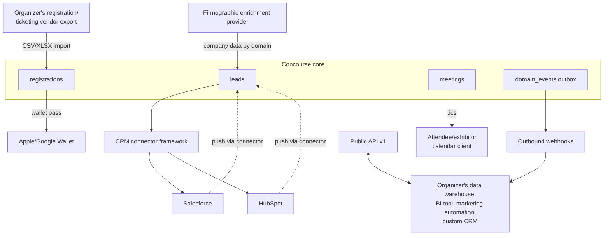
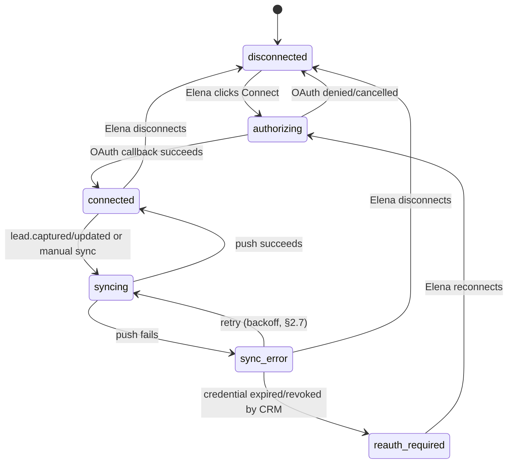
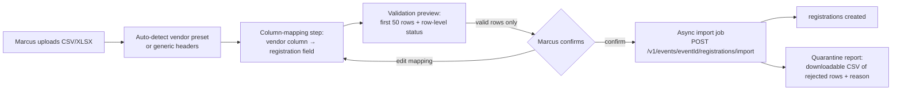

# Integrations and Connectors

This document is the canonical catalog of every external system Concourse integrates with, what each integration is for, and how it is architected at the abstraction level: the CRM sync connector framework (Salesforce and HubSpot first), registration/ticketing-vendor bulk import, the pluggable firmographic-enrichment-provider abstraction that feeds Lead Intelligence, calendar (`.ics`) and Apple/Google Wallet pass integrations, and outbound webhooks plus the Public API as the enterprise integration point. It owns *why* organizations integrate and *what* each connector abstraction looks like — not wire-protocol mechanics. REST conventions, the public API surface, and webhook delivery mechanics belong to [18-api-architecture.md](18-api-architecture.md) §8–9; this document is the catalog that decides which domain events and endpoints matter for integration purposes and cross-references those sections rather than restating them. AI service boundary, model routing, and Lead Intelligence scoring belong to [21-ai-architecture.md](21-ai-architecture.md); this document owns only the enrichment *provider* abstraction that scoring consumes as an input. Notification delivery channels (email/push) belong to [33-notification-system.md](33-notification-system.md); this document owns what a calendar invite or wallet pass *contains*, not how it is transmitted. Column-level schema for every entity introduced here is finalized in [16-database-schema.md](16-database-schema.md).

---

## 1. Integration Landscape Overview

Concourse integrates with the outside world in five distinct shapes. Each has a different trust boundary, a different data-flow direction, and a different reason an organization would reach for it.

| # | Category | Direction | Primary persona | Feature-matrix ID | Entitlement | Milestone |
|---|---|---|---|---|---|---|
| 1 | CRM sync (Salesforce, HubSpot, future) | Concourse → CRM (push) | Elena | H12 | `entitlement:crm_sync` | M4 |
| 2 | Registration/ticketing-vendor bulk import | Vendor export → Concourse (pull, one-time per batch) | Priya, Marcus | (registrations import, foundation §7 `registrations`) | — (all organizer plans) | M2 |
| 3 | Firmographic enrichment | Third-party data provider → Concourse (pull) | Elena, Jamal (consumers); Alex (provider config) | L3 | `entitlement:lead_intelligence` | M3 |
| 4 | Calendar (`.ics`) invites | Concourse → attendee/exhibitor calendar client | All | I4 | `entitlement:meeting_scheduling` (meetings); — (agenda) | M3 |
| 5 | Apple/Google Wallet passes | Concourse → attendee device | Sofia | F9 | — | M3 |
| 6 | Outbound webhooks + Public API | Concourse ↔ organizer's enterprise tooling | Priya (integrations) | R1–R5 | `entitlement:public_api`, `entitlement:webhooks` | M4 |



Two categories are deliberately **not** built as live vendor-API connectors, both traceable to non-goals in [01-product-vision.md](01-product-vision.md) §7: registration/ticketing-vendor import is file-based, not an OAuth partnership with each vendor (§3.1 explains why), and CRM sync is one-directional push, never a bidirectional sync that would make Concourse compete with the exhibitor's system of record (§2.6).

---

## 2. CRM Sync Connector Framework

### 2.1 Goals and non-goals

H12 in [08-feature-matrix.md](08-feature-matrix.md) commits to Salesforce and HubSpot at launch, gated by `entitlement:crm_sync` (`growth`/`intelligence` exhibitor tiers). The framework's job is to make the *third* connector (and the tenth) an additive plugin, not a rewrite of `EngagementModule`. Concretely:

- **Goal:** a connector is a class implementing one interface (§2.2); adding a CRM means writing that class and registering it — no changes to lead capture, scoring, or the sync trigger pipeline.
- **Goal:** every connector is one-directional (Concourse → CRM) and idempotent per lead, so a retried sync never double-creates a CRM record.
- **Non-goal:** reading data back from the CRM into Concourse. The lead record in Concourse remains the single source of truth per foundation principle P3 ([01-product-vision.md](01-product-vision.md) §6) — a two-way sync would create exactly the "six tools, six copies" failure mode that principle forbids. If an exhibitor wants CRM-side stage changes reflected in Concourse, that is future work, assigned to [44-future-expansion-plan.md](44-future-expansion-plan.md) (§8 below), because it requires a reconciliation model this document deliberately does not build.
- **Non-goal:** Concourse is not a horizontal CRM ([01-product-vision.md](01-product-vision.md) §7) — sync is a hand-off, not a competing pipeline view.

### 2.2 The connector interface

```typescript
// packages/integrations/src/crm/crm-connector.interface.ts

interface CrmCredential {
  crmConnectionId: string;      // crm_connections.id
  provider: CrmProviderId;
  accessToken: string;          // decrypted at call time only (see §2.7)
  refreshToken?: string;
  instanceUrl?: string;         // Salesforce org URL; absent for HubSpot
  expiresAt: string;
}

interface MappedLeadPayload {
  leadId: string;               // leads.id — carried through for idempotency
  fields: Record<string, string | number | boolean | null>; // post-mapping, per §2.5
  targetObject: string;         // e.g. "Lead", "Contact" (Salesforce); "contacts" (HubSpot)
}

interface CrmSyncResult {
  leadId: string;
  status: 'created' | 'updated' | 'skipped' | 'failed';
  remoteObjectId?: string;      // written back to crm_sync_logs, never to leads
  errorCode?: string;
  errorDetail?: string;
}

/** Every CRM integration implements this. Adding a provider = implementing
 *  this interface + registering it; nothing upstream changes. */
interface CrmConnector {
  readonly provider: CrmProviderId;   // 'salesforce' | 'hubspot' | future values
  authorize(authCode: string, redirectUri: string): Promise<CrmCredential>;
  refreshCredential(credential: CrmCredential): Promise<CrmCredential>;
  testConnection(credential: CrmCredential): Promise<boolean>;
  describeFields(credential: CrmCredential, targetObject: string): Promise<CrmFieldDescriptor[]>;
  pushLead(credential: CrmCredential, payload: MappedLeadPayload): Promise<CrmSyncResult>;
  pushLeadBatch(credential: CrmCredential, payloads: MappedLeadPayload[]): Promise<CrmSyncResult[]>;
}

interface CrmFieldDescriptor {
  apiName: string;
  label: string;
  type: 'string' | 'number' | 'boolean' | 'date' | 'picklist';
  picklistValues?: string[];
  required: boolean;
}
```

`CrmConnectorRegistry.register(providerId, factory)` resolves the concrete connector from `crm_connections.provider` at call time. Two providers ship at launch (§2.3–2.4); the registry has no hardcoded provider list anywhere else in the codebase — `AiModule`'s single-seam discipline ([21-ai-architecture.md](21-ai-architecture.md) §1) is the model this framework follows.

### 2.3 Salesforce connector

- **Auth:** OAuth 2.0 Web Server Flow via a Concourse-owned Salesforce Connected App; Elena authorizes from the Exhibitor Portal, granting a refresh token scoped to `api` and `refresh_token`. No JWT bearer / service-account flow in Phase 1 — it requires per-org key exchange Elena cannot self-serve, and self-serve OAuth is the only onboarding path that fits the "growth tier upsell, no sales call" model (foundation D4).
- **Target object:** `Lead` by default (matches Salesforce's own qualification-pipeline vocabulary); `Contact` is selectable per connection for exhibitors who route trade-show leads directly into existing account structures.
- **Write path:** REST API (`/services/data/v60.0/sobjects/{object}`) for incremental per-lead pushes (the sync trigger in §2.6 is per-event, not bulk); Bulk API 2.0 is used once, at connection time, only if Elena opts into a historical backfill of already-captured leads from before the connection existed.
- **Field discovery:** `describeFields` calls Salesforce's `describe` endpoint so the mapping UI (§2.5) always reflects the org's actual fields, including custom fields (`__c` suffix) and picklists — no static Salesforce schema baked into Concourse.

### 2.4 HubSpot connector

- **Auth:** OAuth 2.0 via a Concourse-owned HubSpot public app; standard authorization-code flow, refresh token stored per `crm_connections` row.
- **Target objects:** `contacts` primary, with an optional `companies` association created/matched by domain when firmographic data is available (§4) — HubSpot's object model treats company association as first-class in a way Salesforce's flat `Lead` object does not, so the connector's default mapping differs by provider even though the interface is identical.
- **Write path:** HubSpot CRM API v3 (`/crm/v3/objects/contacts`), batch endpoint used for the same historical-backfill case as Salesforce.

### 2.5 Field mapping

Mapping is per `crm_connections` row, editable by Elena from the Exhibitor Portal, seeded with a sensible default and never silently auto-mapped past that default without her confirming it (same discipline as the registration-import mapping preview, §3.2).

| Concourse field | Default Salesforce mapping | Default HubSpot mapping | Notes |
|---|---|---|---|
| Registration first/last name | `FirstName` / `LastName` | `firstname` / `lastname` | |
| Registration email | `Email` | `email` | Only present if capture-time consent covers contact sharing ([21-ai-architecture.md](21-ai-architecture.md) §10) |
| Registration company/title (declared) | `Company` / `Title` | `company` / `jobtitle` | |
| Firmographic enrichment (§4), if present | `Industry`, custom `Employee_Range__c` | `industry`, `numemployees` | Only synced if the exhibitor's tier holds `entitlement:lead_intelligence` |
| Lead score (0–100) | custom `Concourse_Score__c` | custom property `concourse_score` | Created on the CRM side at first sync if absent (connector calls a "create custom field" step once, gated behind an explicit Elena confirmation — Concourse never silently mutates a customer's CRM schema without consent) |
| Lead pipeline status | custom `Concourse_Stage__c` (picklist) | custom property `concourse_stage` | One-way mirror; editing status back in the CRM has no effect on Concourse (§2.1) |
| AI interaction summary (`L2`) | `Description` | `notes_last_contacted` fallback, or custom `concourse_summary` | Text-length-capped to the target field's limit; overflow truncates with a "…(see Concourse)" suffix and a deep link |
| Booth/event context | custom `Concourse_Event__c` | custom property `concourse_event` | Free text: event name + booth number |

`crm_field_mappings` rows store `(crm_connection_id, concourse_field, crm_object, crm_field, transform, is_required)`; `transform` is a small enum (`none | truncate | picklist_map`) — enough for the table above without a general expression language, which would be an unreviewable injection surface.

### 2.6 Sync triggers

Sync is event-driven, not polled, using the same transactional-outbox mechanism webhooks use ([18-api-architecture.md](18-api-architecture.md) §9, [25-event-pipeline.md](25-event-pipeline.md)):

1. `lead.captured` and `lead.updated` domain events fan out to a dedicated BullMQ queue `crm-sync` ([27-background-jobs-architecture.md](27-background-jobs-architecture.md)) for every `event_exhibitor` with an active `crm_connections` row.
2. The job resolves the connector via the registry (§2.2), builds a `MappedLeadPayload` from `crm_field_mappings`, and calls `pushLead`.
3. **Manual "Sync now"** exists per-lead and per-filtered-list in the Exhibitor Portal for leads captured before a connection existed or after a mapping change.
4. **Nightly reconciliation** (queue `crm-sync-reconcile`) compares `leads.updated_at` against the most recent successful `crm_sync_logs` row per lead and re-enqueues anything with a gap — the self-healing net that catches a missed or failed event without requiring Elena to notice.



### 2.7 Error handling, retries, and secrets

- **Retry policy** mirrors webhook delivery for consistency of mental model: exponential backoff with jitter, capped at 7 attempts, landing in `sync_error` on exhaustion ([18-api-architecture.md](18-api-architecture.md) §9.5).
- **Auto-disable:** a connection with 100% failure over 5 consecutive days flips to `sync_error` with a persistent Exhibitor Portal banner and a notification to Elena ([33-notification-system.md](33-notification-system.md)) — the same auto-disable discipline as webhook endpoints, so on-call and support already know the pattern.
- **Credential storage:** `crm_connections.access_token_ciphertext` / `refresh_token_ciphertext` are encrypted at rest with a KMS-backed envelope key, decrypted only inside the sync worker process at call time and never logged; secrets management posture is owned by [43-security-architecture.md](43-security-architecture.md).
- **Field-level failures** (e.g., a CRM validation rule rejects a value) mark that lead `failed` in `crm_sync_logs` with the CRM's error detail surfaced verbatim in the Exhibitor Portal sync log — Elena needs the CRM's own words to fix her mapping, not a Concourse paraphrase.

### 2.8 Entities

New entities owned by this document, DDL finalized in [16-database-schema.md](16-database-schema.md):

| Table | Purpose | Key columns |
|---|---|---|
| `crm_connections` | One row per `event_exhibitors` × provider connection | `id`, `event_exhibitor_id`, `provider`, `status`, `target_object`, `access_token_ciphertext`, `refresh_token_ciphertext`, `instance_url`, `last_synced_at`, `created_at`, `updated_at` |
| `crm_field_mappings` | Field-mapping rows per connection | `id`, `crm_connection_id`, `concourse_field`, `crm_object`, `crm_field`, `transform`, `is_required` |
| `crm_sync_logs` | Per-lead sync attempt history (append-only, mirrors `webhook_deliveries`' shape) | `id`, `crm_connection_id`, `lead_id`, `attempt_number`, `status`, `remote_object_id`, `error_code`, `error_detail`, `attempted_at` |

All three are tenant-owned rows carrying `organization_id` (the exhibitor org) per foundation §8, RLS-enforced identically to every other tenant table.

---

## 3. Registration & Ticketing-Vendor Bulk Import

### 3.1 Scope decision: file import, not vendor API partnerships

[01-product-vision.md](01-product-vision.md) §7 states the resolved boundary: "`registrations` support direct sign-up and bulk import from the organizer's registration/ticketing vendor" — Concourse deliberately stays out of ticketing/registration commerce. The corollary decision, made here rather than left open: **import is file-based (CSV/XLSX), not a set of live OAuth/API connectors into each ticketing vendor.** Building and maintaining API partnerships with Cvent, Eventbrite, Bizzabo, Splash, etc. would recreate exactly the "ticketing company" surface area the non-goal rejects, for a one-time-per-event action. A file export every vendor already produces is sufficient, cheaper to build, and vendor-agnostic — the same reasoning that keeps `badge_code` hardware-neutral (foundation §12).

### 3.2 Import flow and validation-preview UX

The pattern matches the exhibitor CSV import already established in [05-organizer-journey.md](05-organizer-journey.md) O-4 ("CSV import with a mapping/validation preview (bad rows quarantined, never silently dropped)"), applied to `registrations` instead of `event_exhibitors`:



1. **Upload** — presigned S3 upload ([26-file-storage.md](26-file-storage.md)), 10 MiB body-size allowance on import routes per [18-api-architecture.md](18-api-architecture.md) §6.
2. **Vendor preset detection** — headers are matched against known presets (§3.5); on no match, every column is offered for manual mapping.
3. **Mapping step** — each source column maps to a `registrations` field, a custom profile question (per event, [05-organizer-journey.md](05-organizer-journey.md) O-6), or "ignore." Required target fields (email, first name, last name) must be mapped before the preview step is reachable.
4. **Validation preview** — every row is validated client-visible *before* commit: email format, required-field presence, duplicate-within-file detection, and duplicate-against-existing-`registrations` detection (same email + event → treated as an update, not a duplicate create, matching the re-scan-appends-not-duplicates discipline used for lead capture, H3). Each row is tagged `valid | warning | error`; `warning` rows (e.g., missing optional field) still import; `error` rows block only themselves.
5. **Confirm** — triggers `POST /v1/events/{eventId}/registrations/import` ([18-api-architecture.md](18-api-architecture.md) §5.7), which returns a `job` resource (§5.15 of that document). Marcus watches progress via the `job:{jobId}` realtime room.
6. **Quarantine, never silent drop** — every rejected row is written to a downloadable error CSV attached to the completed job result, with the exact validation failure per row. This is the same non-negotiable UX commitment O-4 makes for exhibitor import, generalized here.

### 3.3 Field mapping targets

| Import target | Maps to | Notes |
|---|---|---|
| Standard identity fields | `registrations` (via `users` match-or-create by email) | Existing `users` row is reused if the email already has one; otherwise a placeholder account is created and claimed at first login (magic link) |
| Registration type (General/VIP/Press, etc.) | `registrations.registration_type` | Unmapped values default to the event's default type, flagged as `warning` |
| Custom profile questions | `attendee_interests` (when marked interest-bearing) or free-form profile fields | Mirrors the O-6 custom-question model exactly — imported answers behave identically to form-entered ones |
| Check-in status (if the vendor already ran on-site check-in for a prior touchpoint) | `registrations.status = checked_in` (rare; mostly for post-event historical import) | Only accepted when explicitly mapped — never inferred |

### 3.4 Vendor presets

Presets are header-matching templates, not API integrations (§3.1) — a preset is a bundled mapping shipped so common exports need zero manual mapping:

| Preset | Detection heuristic | Coverage |
|---|---|---|
| Generic CSV/XLSX | Fallback when no preset matches | Full manual mapping |
| Eventbrite export | Header set includes `Order #`, `Attendee #`, `Ticket Type` | Name, email, ticket type → registration type |
| Cvent export | Header set includes `Registration ID`, `Reg Type`, `Registration Status` | Name, email, reg type, status |
| Bizzabo / Splash / generic spreadsheet exports | Common-column heuristics (`First Name`/`Last Name`/`Email` variants) | Name/email only; rest manual |

New presets are additive JSON template files (`packages/shared/src/imports/registration-presets/*.json`) — adding vendor #5 is a config change, not a code change, the same pluggability discipline as §2.

### 3.5 Milestone and permission

Ships at M2 alongside the rest of registration (F1–F8, [08-feature-matrix.md](08-feature-matrix.md) §4.6) since the API route already exists at that milestone ([18-api-architecture.md](18-api-architecture.md) §5.7); presets accrete afterward without being milestone-blocking. Permission string: `registrations:import` (organizer staff only — [28-permission-model.md](28-permission-model.md) owns the full matrix).

---

## 4. Firmographic Enrichment Provider Abstraction

### 4.1 Purpose

L3 in [08-feature-matrix.md](08-feature-matrix.md) — "Company data via pluggable enrichment provider" — feeds one input into Lead Intelligence scoring: [21-ai-architecture.md](21-ai-architecture.md) §3.3 names "seniority/firmographic fit" as a deterministic scoring component. That document owns *how the score consumes* the data; this document owns the *provider abstraction* that produces it, because enrichment is a swappable third-party dependency, not an AI-model concern — no LLM call is involved in fetching or normalizing it.

### 4.2 Provider interface

```typescript
// packages/integrations/src/enrichment/enrichment-provider.interface.ts

interface FirmographicProfile {
  companyName: string;
  domain: string;
  industry?: string;
  employeeCountRange?: string;     // e.g. "201-500"
  annualRevenueRange?: string;     // e.g. "$10M-$50M"
  headquartersCountry?: string;
  linkedInUrl?: string;
  seniorityHint?: 'individual_contributor' | 'manager' | 'director' | 'vp' | 'c_suite' | 'unknown';
  confidence: number;              // 0–1, provider-reported or derived
  source: string;                  // provider name, for auditability
  fetchedAt: string;
}

/** Every enrichment provider implements this. Swapping providers, or adding
 *  a second one for waterfall fallback, never touches Lead Intelligence. */
interface FirmographicEnrichmentProvider {
  readonly name: string;
  enrichByDomain(domain: string): Promise<FirmographicProfile | null>;
  enrichByEmail(email: string): Promise<FirmographicProfile | null>;
}
```

### 4.3 Provider selection

| Consideration | Decision |
|---|---|
| Which provider ships first | A single commercial B2B enrichment API (selected at implementation time by cost/coverage bake-off — the interface makes the choice reversible, so this document fixes the *abstraction*, not the vendor name, as the binding decision) |
| Configuration scope | **Platform-wide**, set by Alex in Platform Admin — not per-organizer or per-exhibitor. Enrichment cost is centrally metered the same way AI spend is (`ai_budget_daily_usd` precedent, [21-ai-architecture.md](21-ai-architecture.md) §6.2), avoiding per-tenant vendor contracts that would multiply integration surface for a feature every `growth`+ exhibitor gets automatically |
| Multi-provider fallback | Not built in Phase 1 — one provider, ship it, measure coverage gaps against the eval discipline already used for AI features, revisit only if data shows it is warranted. Assigned to [44-future-expansion-plan.md](44-future-expansion-plan.md) §8 if it becomes a real gap, not built speculatively now |

### 4.4 Trigger and caching

1. On `lead.captured`, if the registration's email domain is a resolvable business domain (free-mail domains — gmail.com, outlook.com, etc. — are skipped; enrichment has nothing to return), an enrichment job enqueues on `ai-batch` (reusing the same queue Lead Intelligence extraction uses, [21-ai-architecture.md](21-ai-architecture.md) §2, since it is the same latency class: async, not on the interactive path).
2. **Cache-first:** `firmographic_enrichment_cache` is keyed by `domain`, TTL 90 days (company facts — industry, headcount band — change slowly; 90 days matches the cadence of the nightly CRM reconciliation job for operational symmetry). A cache hit skips the provider call entirely.
3. Cache is **shared across tenants by domain**, deliberately: `firmographic_enrichment_cache` rows hold company-level facts about "Acme Corp," not personal data about the individual attendee — this is not exhibitor-owned lead data (foundation §8's tenancy rule protects the *lead*, i.e., the exhibitor's relationship to a specific person, not generic public-record company facts). The association `(lead_id → cached profile)` is what is exhibitor-owned and lives on the lead's stored snapshot, not the cache row.
4. Result attaches to the lead's stored evidence set consumed by scoring and the AI summary ([21-ai-architecture.md](21-ai-architecture.md) §3.3), tagged with `source` and `fetchedAt` for provenance in the summary's evidence-id discipline.

### 4.5 Consent and data privacy

Enrichment runs only for leads within capture-time contact consent scope, identical to the Follow-up Studio consent gate ([21-ai-architecture.md](21-ai-architecture.md) §10) — a lead lacking contact consent is excluded from enrichment entirely, not enriched-and-hidden. Retention of the exhibitor-facing enriched snapshot follows the same lead-retention schedule as the rest of the lead record, owned by [38-data-retention-privacy-compliance.md](38-data-retention-privacy-compliance.md); the shared domain-level cache (§4.4) is not personal data and is retention-scoped independently (90-day rolling TTL, no DSAR linkage since it holds no individual's data).

New entity: `firmographic_enrichment_cache(domain PK, profile jsonb, source, fetched_at, expires_at)` — global, not tenant-scoped (no `organization_id`), consistent with §4.4's reasoning. DDL finalized in [16-database-schema.md](16-database-schema.md).

---

## 5. Calendar (.ics) and Wallet Pass Integrations

### 5.1 Calendar invites (`.ics`) — I4

- **Generated, not stored:** `.ics` files are produced on demand from `meetings` and `agenda_sessions` rows — no persistence, matching the precedent set by print-friendly badges (F6, generated on demand from `registrations`). A dedicated deterministic service (no LLM involvement — this is pure data formatting) builds the `VEVENT` block.
- **Trigger points:** meeting `requested → confirmed` (I3 lifecycle) attaches a `METHOD:REQUEST` invite; a reschedule increments `SEQUENCE` so calendar clients update the existing entry instead of duplicating it; cancellation sends `METHOD:CANCEL`. Saved agenda sessions (G2) generate a plain `.ics` on demand from "Add to calendar" — no lifecycle machinery needed since agenda sessions are informational, not two-party commitments.
- **Content:** `UID` = the meeting or agenda session id (stable across regenerations, required for client-side de-duplication); `DTSTART`/`DTEND` in the event's configured timezone (foundation §7 `events.timezone`); `LOCATION` = booth number/hall or room name with a deep link back into the Attendee App or Exhibitor Portal; `ORGANIZER`/`ATTENDEE` populated only with fields covered by capture-time consent, mirroring the enrichment and Follow-up Studio consent gate (§4.5) — a meeting invite never leaks contact fields the attendee didn't consent to share.
- **Delivery is not this document's concern:** the generated `.ics` is handed to [33-notification-system.md](33-notification-system.md) as an email attachment on the same transactional messages that already exist for meeting confirmations (P1, [08-feature-matrix.md](08-feature-matrix.md) §4.16) — this document specifies *what* the file contains, not the send pipeline.

### 5.2 Apple/Google Wallet passes — F9

- **What ships in the pass:** attendee name, event name and dates, the badge QR (the same `badge_code` payload used for physical scanning, foundation §12 — one badge, two renderings, never two credentials), and event branding (logo/colors, reusing the branding already configured at B2, [08-feature-matrix.md](08-feature-matrix.md) §4.2).
- **Apple Wallet (PassKit):** a signed `.pkpass` bundle generated server-side (Apple Developer pass-type certificate held by the platform, not per-organizer — passes are Concourse-branded-and-signed regardless of event, keeping certificate management centralized). Because `badge_code` **rotates** (foundation §12, security posture), an already-issued pass must be updatable in place, which requires implementing Apple's PassKit web-service protocol: device registration (`POST /v1/wallet-passes/apple/devices/{deviceLibraryIdentifier}/registrations/{passTypeIdentifier}/{serialNumber}`), a "what changed" polling endpoint, and an APNs push to prompt the device to re-fetch. This is the one piece of real protocol surface this document must specify, because without it a rotated badge silently orphans a stale QR on the lock screen — a "works in a concrete hall" (foundation principle P4) failure at exactly the moment (gate check-in) it matters most.
- **Google Wallet:** the Google Wallet API for Passes uses a simpler object-patch model (`objects.patch` on the issued pass object) with no separate device-registration table — Google's client handles sync natively, so no `wallet_pass_registrations`-equivalent entity is needed for that half.
- **New entity (Apple only):** `wallet_pass_registrations(device_library_identifier, pass_type_identifier, serial_number [= registration_id], push_token, registered_at)` — tenant-scoped via the underlying `registrations` row. DDL finalized in [16-database-schema.md](16-database-schema.md).
- **Update triggers:** `badge_code.rotate` (per the existing rotate endpoint, [18-api-architecture.md](18-api-architecture.md) §5.7) and any change to `registrations.status` (e.g., cancelled) both enqueue an APNs push to every registered device for that registration.

---

## 6. Outbound Webhooks and Public API as the Enterprise Integration Point

### 6.1 Division of ownership

[18-api-architecture.md](18-api-architecture.md) §8 (Public API) and §9 (Webhook Delivery) own the wire protocol: authentication, scopes, signing, retry/backoff, delivery logs. This document owns the **catalog** — which use cases justify the `enterprise`-only `entitlement:public_api` and `entitlement:webhooks` keys ([08-feature-matrix.md](08-feature-matrix.md) §3), and why an organizer would reach for the generic API/webhook surface instead of (or alongside) a purpose-built connector from §2–§5.

### 6.2 Why organizations integrate

| Use case | Mechanism | Typical organizer tooling |
|---|---|---|
| Warehouse/BI sync for cross-event analytics beyond doc 32's dashboards | Public API reads (`events`, `registrations`, `event-exhibitors`, `leads` — aggregate/organizer-visible scope only) | Snowflake/BigQuery ingestion jobs, Looker/Tableau |
| Real-time trigger into marketing automation on registration or check-in | Webhooks (`registration.created`, `registration.checked_in`) | Marketo, Pardot, internal automation |
| CRM not on the built-in connector list (§2) | Webhooks (`lead.captured`, `lead.updated`) + Public API leads endpoints, self-integrated by the organization | Microsoft Dynamics, Pipedrive, any homegrown CRM |
| Custom on-site kiosk or registration flow outside the standard Attendee App | Public API writes (`registrations:create`) | Organizer-built kiosk software |
| Org-facing audit/compliance export | Public API (`GET /v1/organizations/{orgId}/audit-logs`) | SIEM ingestion |
| Meeting/agenda sync into an organizer's own scheduling tooling | Webhooks (`meeting.scheduled`, `meeting.updated`) + Public API `meetings` reads | Internal ops tooling |

Row three is the deliberate answer to "what about CRM #3?" without waiting on the built-in connector roadmap: the pluggable framework in §2 is the curated, zero-code path for the two CRMs known to matter most at launch; the public API + webhooks are the always-available, code-required escape hatch for everything else. The two are complementary, not sequential — an organizer is never blocked pending a new built-in connector.

### 6.3 Event types relevant to the integration catalog

Full registry lives in [18-api-architecture.md](18-api-architecture.md) §9.1; the subset that matters for the use cases above:

| Event type | Feeds |
|---|---|
| `lead.captured`, `lead.updated` | CRM connectors (§2), custom-CRM escape hatch |
| `registration.created`, `registration.checked_in` | Marketing automation, check-in dashboards |
| `booth_visit.recorded` | Custom analytics |
| `meeting.scheduled`, `meeting.updated` | Scheduling-tool sync |
| `event.published`, `event_exhibitor.updated` | Organizer-side ops automation |

### 6.4 Developer experience

`entitlement:public_api` and `entitlement:webhooks` are both `enterprise`-plan-only ([08-feature-matrix.md](08-feature-matrix.md) §3), reflecting that this integration point is aimed at organizers with an internal engineering resource, not exhibitors — exhibitor programmatic access routes through the CRM connector framework (§2) or, if none fits, is explicitly deferred (feature-matrix §4.18 footnote; [44-future-expansion-plan.md](44-future-expansion-plan.md)). The developer docs portal (R5) publishes the generated OpenAPI 3.1 contract ([18-api-architecture.md](18-api-architecture.md) §2) — this document does not restate API reference content, only points integrators at it.

---

## 7. Entitlement and Gating Summary

Consolidated view of every entitlement key this document's integrations depend on (registry definitions in [08-feature-matrix.md](08-feature-matrix.md) §3):

| Integration | Entitlement key | Plan/tier | Enforcement point |
|---|---|---|---|
| CRM sync (§2) | `entitlement:crm_sync` | Exhibitor `growth`/`intelligence` | Connect action blocked in Exhibitor Portal; sync jobs no-op if revoked mid-cycle (downgrade handling per Q5, [08-feature-matrix.md](08-feature-matrix.md) §4.17) |
| Registration import (§3) | — | All organizer plans | Permission-gated (`registrations:import`), not entitlement-gated — a Phase-1 setup tool, not a paid upsell |
| Firmographic enrichment (§4) | `entitlement:lead_intelligence` | Exhibitor `growth`/`intelligence` | Enrichment job checks entitlement before enqueue; revoked entitlement freezes existing enriched data read-only, matches L3/L1/L2 gating |
| Calendar invites (§5.1) | `entitlement:meeting_scheduling` (meetings only; agenda `.ics` is ungated) | Exhibitor `growth`/`intelligence` | Meeting-confirmed event only fires where the exhibitor holds the entitlement |
| Wallet passes (§5.2) | — | All attendees (foundation D4: attendees always free) | No gate — badge passes are core registration functionality |
| Webhooks / Public API (§6) | `entitlement:webhooks`, `entitlement:public_api` | Organizer `enterprise` | Enforced at route level per [18-api-architecture.md](18-api-architecture.md) §5.13 |

---

## 8. Explicitly Deferred

Resolved out of scope for Phase 1, assigned to [44-future-expansion-plan.md](44-future-expansion-plan.md) rather than left open:

- **Bidirectional CRM sync** (CRM-side stage changes flowing back into `leads`) — rejected in Phase 1 by the one-source-of-truth decision in §2.1; revisit only if design-partner demand overrides the reconciliation-complexity cost.
- **Additional built-in CRM connectors** (Microsoft Dynamics, Pipedrive, etc.) beyond Salesforce/HubSpot — the interface in §2.2 makes this a bounded, additive effort; sequencing is a roadmap question for [45-implementation-roadmap.md](45-implementation-roadmap.md), not an architecture question this document needs to resolve now. The public API/webhook escape hatch (§6.2) covers the gap in the meantime.
- **Multi-provider firmographic enrichment with waterfall fallback** (§4.3) — single provider ships first; add a second only if coverage data justifies it.
- **Live vendor-API registration/ticketing connectors** — explicitly rejected, not merely deferred, per §3.1's reasoning tied to the non-goal in [01-product-vision.md](01-product-vision.md) §7. Not revisited unless that non-goal itself is revised.
- **Exhibitor-scoped Public API** — already tracked in [08-feature-matrix.md](08-feature-matrix.md) §4.18's footnote and [44-future-expansion-plan.md](44-future-expansion-plan.md); this document does not duplicate that entry, only confirms exhibitor programmatic access continues to route through §2/§6.2 until it lands.

---

## 9. Related Documents

- [00-foundation.md](00-foundation.md) — canonical entity registry (§7), tenancy rules (§8), and glossary this document's new entities and vocabulary conform to
- [01-product-vision.md](01-product-vision.md) — non-goals (§7) that bound the CRM-sync and registration-import scope decisions in §2.1 and §3.1
- [05-organizer-journey.md](05-organizer-journey.md) — the CSV mapping/validation-preview UX pattern (O-4) this document's registration-import UX (§3.2) is built to match
- [06-exhibitor-journey.md](06-exhibitor-journey.md) — Elena's exhibitor-side flows into which CRM connections and enrichment surface
- [08-feature-matrix.md](08-feature-matrix.md) — H12, F9, I4, L3 feature definitions and the entitlement registry this document gates against
- [16-database-schema.md](16-database-schema.md) — eventual column-level DDL owner for every new entity introduced here (`crm_connections`, `crm_field_mappings`, `crm_sync_logs`, `firmographic_enrichment_cache`, `wallet_pass_registrations`)
- [18-api-architecture.md](18-api-architecture.md) — wire-protocol owner for the Public API (§8) and webhook delivery (§9) this document catalogs the use cases for
- [21-ai-architecture.md](21-ai-architecture.md) — Lead Intelligence scoring (§3.3) that consumes the firmographic enrichment abstraction owned here
- [25-event-pipeline.md](25-event-pipeline.md) — the transactional-outbox mechanism CRM sync triggers and webhook fan-out both build on
- [27-background-jobs-architecture.md](27-background-jobs-architecture.md) — queue ownership for `crm-sync`, `crm-sync-reconcile`, and enrichment jobs
- [28-permission-model.md](28-permission-model.md) — permission-string matrix for `registrations:import`, connector management, and enrichment configuration
- [33-notification-system.md](33-notification-system.md) — delivery channel for `.ics` attachments and wallet-pass push notices
- [38-data-retention-privacy-compliance.md](38-data-retention-privacy-compliance.md) — retention schedule for enriched lead data and consent enforcement this document's data flows respect
- [43-security-architecture.md](43-security-architecture.md) — secrets-management posture for CRM OAuth credentials
- [44-future-expansion-plan.md](44-future-expansion-plan.md) — every deferred item in §8, consolidated with revisit criteria

**Ownership boundary, restated:** this document is the catalog of *what* Concourse integrates with and *why* an organization or exhibitor would use each integration; protocol mechanics for the enterprise integration point live in doc 18, AI scoring mechanics live in doc 21, delivery-channel mechanics live in doc 33, and column-level schema for every entity named here lands in doc 16.
