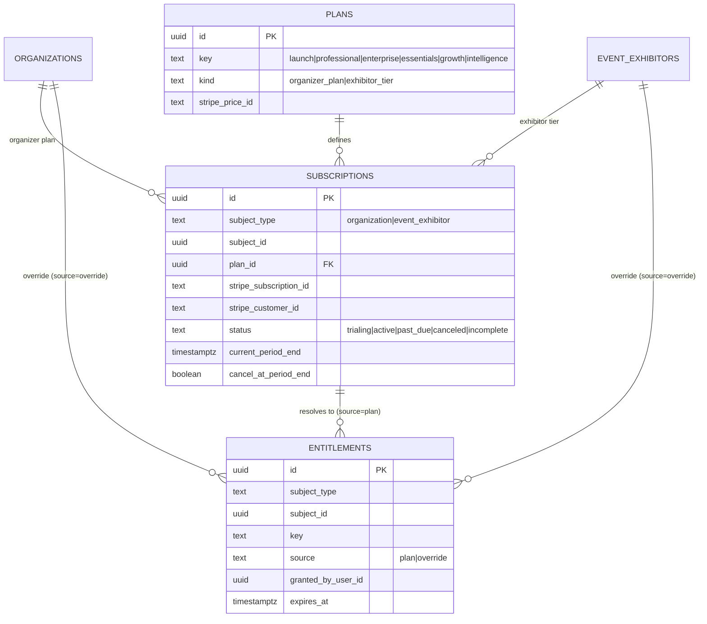
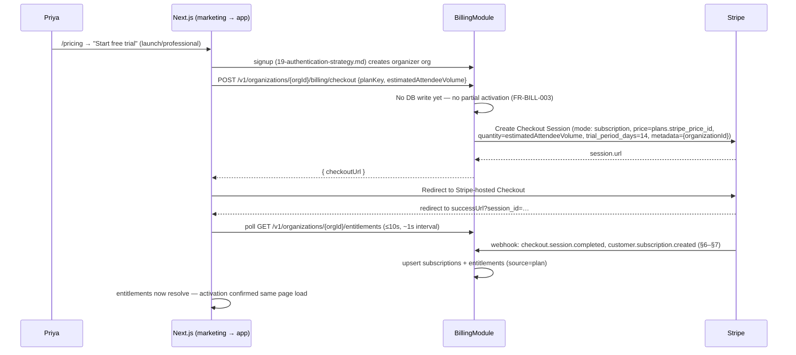
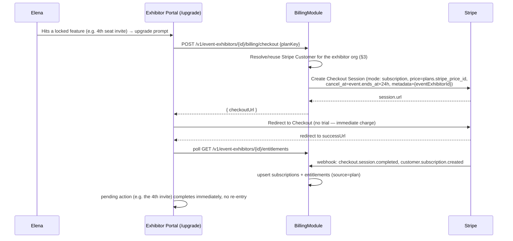
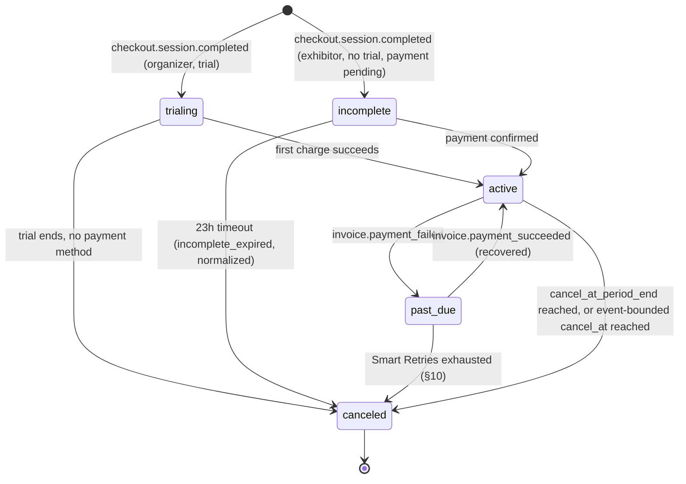

# 36 — Billing and Payments Architecture

This document owns the full **Stripe Billing** integration behind `plans → subscriptions → entitlements`
(foundation §4, §7): organizer subscription checkout (feature **Q3**), exhibitor tier-upsell checkout
(**Q4**), the Stripe webhook handler at `POST /v1/billing/stripe/webhook` ([18-api-architecture.md](18-api-architecture.md)
§5.12) and every subscription-lifecycle event it must handle, proration for mid-event tier upgrades,
downgrade/expiry handling with a grace period and read-only fallback (**Q5**), dunning via Stripe Smart
Retries (**Q6**), the billing-portal link (**Q6**), and manual provisioning for design-partner discounts
(**Q2**) — performed by Alex Kim through Platform Admin — including exactly how manual overrides
interact with Stripe as the system of record. It does **not** own: column-level DDL for `plans`,
`subscriptions`, `entitlements` (canonical in [16-database-schema.md](16-database-schema.md) §8.4–§8.6,
reproduced below only for reference); the entitlement-check algorithm, permission↔entitlement
composition, or the role→permission matrix (owned by [28-permission-model.md](28-permission-model.md),
which this document feeds); the price points themselves (owned by [02-business-goals.md](02-business-goals.md)
§1.4 — deliberately unset in Phase 1); Stripe's own invoice/receipt/dunning emails (Stripe sends those
directly under its own brand, per the boundary decision in [33-notification-system.md](33-notification-system.md)
§2.4 — this document is that decision's other half); the `domain_events` outbox schema and relay
mechanics (owned by [25-event-pipeline.md](25-event-pipeline.md), which this document feeds new event
types into); or the audit-log write mechanics and taxonomy (owned by [29-audit-logging-architecture.md](29-audit-logging-architecture.md)
§6.6, which already fixes the exact action names this document's manual-provisioning path must emit).
All persona, entity, and vocabulary use below is canonical per [00-foundation.md](00-foundation.md).

## 1. Ownership & Scope

| Topic | Owned here | Owned elsewhere |
|---|---|---|
| Stripe Checkout flows (organizer Q3, exhibitor Q4) | **This document** | Account/credential signup mechanics → [19-authentication-strategy.md](19-authentication-strategy.md) |
| `POST /v1/billing/stripe/webhook` processing, event→entitlement mapping | **This document** | Route existence & auth mode → [18-api-architecture.md](18-api-architecture.md) §5.12 |
| Proration, dunning, grace period, read-only fallback | **This document** | — |
| Manual provisioning (Q2) mechanics and Stripe-interaction rules | **This document** | Audit action names/taxonomy → [29-audit-logging-architecture.md](29-audit-logging-architecture.md) §6.6 |
| `plans`/`subscriptions`/`entitlements` column-level schema | [16-database-schema.md](16-database-schema.md) §8.4–§8.6 | Reproduced here for reference only |
| Entitlement-check algorithm, permission composition | [28-permission-model.md](28-permission-model.md) §6 | This document is that algorithm's write side |
| Price points, tier boundaries, pricing philosophy | [02-business-goals.md](02-business-goals.md) §1.4 | This document only fixes the billing *mechanism* |
| Notification content/categories/opt-outs | [33-notification-system.md](33-notification-system.md) | This document specifies *which* billing facts trigger a send |
| Domain event catalog, outbox, fan-out | [25-event-pipeline.md](25-event-pipeline.md) §5–§6 | This document registers the new billing event types (§14) |

## 2. Billing Domain Model (Recap)

The canonical schema lives in [16-database-schema.md](16-database-schema.md) §8.4–§8.6; this section
only restates the columns this document's flows read and write.

Two facts drive everything below: **(1)** `entitlements` carries exactly one row per
`(subject_type, subject_id, key)` — an override does not sit *alongside* a plan-derived grant for the
same key, it *replaces* it (§13). **(2)** `subscriptions.status` has no `unpaid` value — Stripe's
`unpaid` status (used when Stripe keeps retrying without canceling) is normalized to `canceled` at the
webhook boundary (§6), and Stripe's own `incomplete_expired` normalizes the same way. Our state machine
distinguishes exactly three access states — "has current access" (`trialing`/`active`), "in jeopardy"
(`past_due`, the grace period), and "lost access" (`canceled`) — and every Stripe subscription is
configured to auto-cancel once Smart Retries exhaust (§10) rather than parking indefinitely in `unpaid`,
keeping the two state machines in lockstep.

## 3. Stripe Object Mapping

| Concourse concept | Stripe object | Notes |
|---|---|---|
| `organizations` (either kind) | `Customer` | One Stripe Customer per `organizations` row, created lazily on first checkout; `email = billing_email`, `metadata.organization_id` set for support lookups. An exhibitor org that buys tiers at three events still has **one** Customer — every `event_exhibitor` subscription for that org reuses it, resolved by joining `event_exhibitors.organization_id` back to any existing `subscriptions.stripe_customer_id` for that org before creating a new Customer. |
| `plans` row | `Product` + one `Price` | One Stripe Price per `plans.stripe_price_id`. Organizer `launch`/`professional` Prices are recurring (monthly) with **graduated/tiered pricing** keyed on Checkout line-item `quantity`; exhibitor tier Prices (`growth`/`intelligence`) are flat, non-tiered. The tier boundary numbers themselves are a commercial input owned by [02-business-goals.md](02-business-goals.md) §1.4 (deliberately unset in Phase 1) — this document fixes only the mechanism. |
| Organizer signup's attendee-volume estimate | Checkout line-item `quantity` | Collected in the signup flow per [46-marketing-site.md](46-marketing-site.md) §5.2 ("signup collects an attendee-volume estimate before Stripe Checkout renders an actual price"); reconciled post-signup (§8.3). |
| Q3/Q4 checkout | `checkout.session` (`mode: 'subscription'`) | Both flows use Checkout, never raw `PaymentIntent`s or Elements — Stripe hosts card entry, 3DS, and wallet UI so no cardholder data ever transits Concourse's origin. |
| `enterprise` plan | *(none — no self-serve Checkout)* | Sales-assisted only; provisioned via §12's manual path or an out-of-band invoiced contract, never through `GET /v1/plans` + Checkout (marketing CTA is "Talk to sales" → `/contact?topic=sales`, [46-marketing-site.md](46-marketing-site.md) §5.2). |
| `GET /v1/organizations/{orgId}/billing/portal` | Customer Portal session | One route serves both Priya (organizer org) and Elena (exhibitor org) — `organizations` is the tenant type for both kinds (foundation §8), so the same Stripe Customer→portal link works whether the org's subscriptions are organizer-plan or exhibitor-tier rows. No separate exhibitor-portal route exists or is needed. |

## 4. Organizer Subscription Checkout (Q3)

**Route:** `POST /v1/organizations/{orgId}/billing/checkout` — `billing:manage` ([28-permission-model.md](28-permission-model.md)
§3.9), `Idempotency-Key` required ([18-api-architecture.md](18-api-architecture.md) §3.6 explicitly lists
billing checkout among idempotency-mandatory writes). Body: `{ planKey: 'launch'|'professional', estimatedAttendeeVolume: number }`.
`enterprise` is rejected with `422 invalid_plan_for_self_serve` — routes to sales, never to this endpoint.

- **No partial activation (FR-BILL-003):** the checkout-initiation call makes zero writes to
  `subscriptions`/`entitlements` — if Checkout is abandoned or declined, the org's prior state (or lack of
  one) is exactly as it was.
- **Trial:** every self-serve organizer subscription starts with a 14-day trial
  (`trial_period_days: 14`), matching the marketing CTA "Start free trial"
  ([46-marketing-site.md](46-marketing-site.md) §5.2). Entitlements resolve to the *purchased* plan's
  full key set immediately on `customer.subscription.created` (status `trialing` is treated identically
  to `active` for entitlement resolution, §7) — a trial that hides the features it's supposed to sell
  would defeat its own purpose.
- **Attendee-volume reconciliation:** the declared `estimatedAttendeeVolume` sets the initial Checkout
  quantity. A daily cron job (`billing-volume-reconciliation`, following the single-tick cron pattern in
  [27-background-jobs-architecture.md](27-background-jobs-architecture.md) §7) compares it against the
  live `registrations` count across the org's active events; if actual volume has moved to a higher
  tiered band, the subscription item's `quantity` is updated with `proration_behavior: 'none'` — organic
  attendee growth is billed correctly starting the *next* renewal, never as a surprise mid-cycle charge.
  This is the deliberate opposite of §8's proration rule for an explicit tier-upgrade purchase.
- **`Idempotency-Replayed` on retry:** a client retry with the same key and body replays the stored
  Checkout Session URL rather than creating a second Stripe session, per [18-api-architecture.md](18-api-architecture.md)
  §3.6.

## 5. Exhibitor Tier-Upsell Checkout (Q4)

**Route:** `POST /v1/event-exhibitors/{id}/billing/checkout` — `billing:manage` (`exhibitor:admin`),
`Idempotency-Key` required. Body: `{ planKey: 'growth'|'intelligence' }`. A tier is purchased **per
event** (FR-BILL-004) — `subject_id` is the `event_exhibitors.id`, never the exhibitor organization.

- **Event-bounded subscription:** exhibitor tier subscriptions carry `cancel_at` = the event's
  `ends_at` + 24h buffer, set at creation. This lets Concourse reuse the same recurring-subscription
  machinery (and the same webhook/entitlement pipeline) for a product that is really a one-time,
  event-scoped purchase — no separate one-time-payment code path, no manual cleanup at event close;
  Stripe cancels it automatically and `customer.subscription.deleted` fires like any other cancellation.
- **No trial, immediate charge:** unlike organizer checkout, exhibitor upsell is a reactive,
  already-decided purchase at a friction point (seat cap, export attempt) — a trial adds latency to a
  decision the user already made, so none is offered.
- **No self-serve mid-event downgrade:** Q4 is upsell-only by design (the tier ladder in
  [06-exhibitor-journey.md](06-exhibitor-journey.md) EX-4 has no "downgrade" moment). A voluntary
  mid-event downgrade with partial refund is deferred to [44-future-expansion-plan.md](44-future-expansion-plan.md);
  today the only path off a purchased tier before the event ends is Alex's manual override path (§12),
  used identically to a support/refund case.

## 6. Stripe Webhook Handler

**Route:** `POST /v1/billing/stripe/webhook` — Stripe signature, no session ([18-api-architecture.md](18-api-architecture.md)
§5.12). Raw body required for signature verification (Fastify's body parser is bypassed for this route,
same pattern any raw-body webhook needs).

```mermaid
flowchart TD
    A[POST /v1/billing/stripe/webhook] --> B{Verify Stripe-Signature<br/>tolerance 5 min}
    B -->|invalid| C[400 stripe_webhook_signature_invalid]
    B -->|valid| D{Redis NX:<br/>stripe-webhook-event:&#123;event.id&#125;<br/>TTL 24h}
    D -->|already processed| E[200 OK — no-op<br/>DB upserts are naturally idempotent anyway]
    D -->|first time| F[Dispatch by event.type — §7 table]
    F --> G[Upsert subscriptions row<br/>by stripe_subscription_id]
    G --> H[Resolve entitlements for source=plan rows<br/>skip unexpired source=override rows — §13]
    H --> I[Invalidate Redis entitlements cache]
    I --> J[Write domain_events row — same transaction]
    J --> K[200 OK]
```

- **Signature verification and dedupe are two different mechanisms for two different problems:**
  signature verification proves the request came from Stripe; the Redis `NX` guard prevents a *retried*
  delivery of the same Stripe event from double-firing side effects (notifications, domain events). It
  is deliberately separate from the client-facing `Idempotency-Key` header (§18 §3.6) — that header
  dedupes *our* API's own POSTs; Stripe's webhook retries are a different at-least-once stream with its
  own `event.id` as the natural dedupe key.
  DB upserts run unconditionally either way because they are idempotent by construction (unique
  constraints on `stripe_subscription_id` and `(subject_type, subject_id, key)`), so a duplicate delivery
  landing on the fast path is harmless even without the guard — the guard exists purely to stop
  duplicate notification sends.
- **Ordering is not guaranteed** (Stripe does not guarantee webhook delivery order). The handler always
  fetches the subscription's *current* state from the event payload (or re-fetches from Stripe if the
  payload is a thin event) rather than assuming monotonic arrival — an out-of-order `past_due` arriving
  after a later `active` would otherwise incorrectly re-open a grace period. Each event is checked against
  `subscriptions.updated_at`; a payload timestamped older than the stored row is applied for its
  side-effects (notification history) but does not regress `status`.
- **Response time:** the handler acknowledges within Stripe's timeout by doing all work in one
  transaction before returning `200`; there is no async hand-off to a queue for this route specifically,
  because the write is small (one subscription row, a handful of entitlement rows) and doing it inline
  keeps entitlement resolution synchronous with the webhook, which is what lets §4/§5's short polling
  window work at all.

## 7. Subscription Lifecycle Events → Entitlement Resolution

Every event below is handled; "and others" in the task sense are the trial-boundary and dispute events
also listed.

| Stripe event | Our handling | Entitlement effect | Notification triggered |
|---|---|---|---|
| `checkout.session.completed` | Correlate `metadata.organizationId`/`eventExhibitorId` to the subject; capture `stripe_customer_id` | None directly — `customer.subscription.created` (next row) does the entitlement write | — |
| `customer.subscription.created` | Upsert `subscriptions` (`status` from payload, usually `trialing` or `active`) | Resolve full plan key set as `source='plan'` (§13) | `billing.subscription_started` |
| `customer.subscription.updated` | Upsert `subscriptions` — covers plan/price change (upgrade), `cancel_at_period_end` toggle, and status transitions (`trialing→active`, `active→past_due`, `past_due→active` on recovery) | Re-resolve `source='plan'` rows against the *new* plan/status; `past_due` does **not** revoke entitlements — grace period (§9) | `billing.payment_recovered` (past_due→active only) |
| `customer.subscription.deleted` | `status='canceled'` (also the target for normalized `unpaid`/`incomplete_expired`, §2) | Revoke all `source='plan'` rows for the subject → floor tier (§9); `source='override'` rows are untouched | `billing.subscription_canceled` |
| `invoice.payment_failed` | No status write (subscription's own `past_due` arrives via the paired `customer.subscription.updated`) | None (grace period already active) | `billing.payment_failed` — Concourse-authored heads-up distinct from Stripe's own dunning email (§10, [33-notification-system.md](33-notification-system.md) §2.4) |
| `invoice.payment_succeeded` | Confirms renewal; refreshes `current_period_end` | None beyond the row refresh | `billing.payment_recovered` only if the immediately prior state was `past_due` — otherwise silent (routine renewals are not notification-worthy) |
| `customer.subscription.trial_will_end` (3 days out) | No DB write | None | `billing.trial_ending_soon` |
| `charge.dispute.created` | Logged, forwarded to Alex (`platform:admin`) via the platform-ops notification room | None automatically — a dispute does not by itself revoke entitlements, since Stripe's own dispute process (and possible reversal) can take weeks and the customer relationship is unresolved, not necessarily fraudulent | `billing.dispute_opened` (Alex only) |

Full dispute/chargeback response workflow (evidence submission, automatic entitlement freeze pending
resolution) is deferred to [44-future-expansion-plan.md](44-future-expansion-plan.md) — Phase 1 handles
disputes as a manual support case once Alex is notified.

## 8. Proration Rules for Mid-Event Tier Upgrades

Only **upgrades** are self-serve (§5); the rules below govern an exhibitor moving `growth→intelligence`
(or an organizer moving `launch→professional`/`professional→enterprise`-via-sales) while a subscription
is already active.

1. **Upgrade = immediate access, immediate prorated charge.** The API calls Stripe's subscription-update
   with `proration_behavior: 'create_prorations'` and `billing_cycle_anchor: 'unchanged'` — Stripe credits
   the unused time on the old price and charges the new price for the remainder of the current cycle,
   collected immediately against the payment method already on file (no new Checkout Session needed for
   an *existing* subscriber; the upgrade button calls a plan-change endpoint that updates the existing
   Stripe Subscription directly).
2. **Entitlements grant optimistically on the `customer.subscription.updated` webhook**, not on proration
   invoice payment confirmation — Elena's intelligence-tier features unlock the moment Stripe accepts the
   plan change, matching FR-BILL-004's "same page load" bar. If the proration invoice itself later fails,
   that failure is just another `invoice.payment_failed` → the subscription flows into `past_due` and the
   standard grace period (§9) applies — entitlements are not revoked for a single failed proration
   attempt while retries are still in flight, avoiding flapping between tiers.
3. **Downgrades are never prorated with a refund.** A downgrade selected through the Billing Portal is
   configured to take effect **at the end of the current billing period** (a native Stripe Customer Portal
   setting), not immediately — the organizer/exhibitor keeps what they already paid for through the
   period they paid for it, and the new (lower) plan's entitlements resolve on the `customer.subscription.updated`
   webhook that fires when the scheduled change actually applies at period end.
4. **Organic attendee-volume growth is not a tier upgrade** and is never prorated mid-cycle — it is
   reconciled at the next renewal per §4's `billing-volume-reconciliation` job. Only an explicit plan/tier
   change (organizer plan tier, or exhibitor `growth→intelligence`) triggers immediate proration.

## 9. Downgrade, Expiry & Grace Period (Q5)

**Grace period definition:** the `past_due` window, from the first failed renewal/proration invoice
until Stripe's Smart Retries either recover the payment or exhaust (§10). Entitlements are **not**
touched while `past_due` — full access continues through the entire grace period; this is the "grace" the
name promises, and matches FR-BILL-007's "grace period at current tier, then reversion."

**What happens when `status` reaches `canceled`** (grace exhausted, or a clean non-renewal, or an
exhibitor's event-bounded subscription reaching its natural `cancel_at`): every `source='plan'`
entitlement row for the subject is re-resolved against the subject's floor state. The floor differs by
subject type — a deliberate asymmetry that mirrors foundation D4's two-sided model exactly.

| Subject | Floor | Entitlement effect | Data handling |
|---|---|---|---|
| `event_exhibitors` | `essentials` (genuinely free) | `lead_intelligence`, `meeting_scheduling`, `lead_export`, `crm_sync`, `followup_studio`, `matchmaking_priority`, `competitive_benchmarks`, `booth_analytics_realtime` → all revoked; `staff_seats` limit reverts to 3 | Never deleted — see seat/data rules below |
| `organizations` (kind `organizer`) | **No free floor** (D4: organizer license is always paid) | `events_limit` effectively 0 (no new events, no publishing); `analytics_suite`, `matchmaking`, `organizer_pulse`, `sso_saml`, `public_api`, `webhooks`, `audit_log_access` → all revoked | Never deleted — see event read-only rules below |

**Deliberate exception — `entitlement:expo_copilot` is not in the revocation list above.** Though
anchored at the same organizer-org level as `analytics_suite`/`matchmaking`/etc.
([34-feature-flags-and-experimentation.md](34-feature-flags-and-experimentation.md) §2), Expo Copilot is
granted on every plan tier including `launch` ([08-feature-matrix.md](08-feature-matrix.md) §3's
entitlement registry) and remains available regardless of organizer plan status or lapse — it is gated
only by its own AI budget ceiling ([21-ai-architecture.md](21-ai-architecture.md) §6.2), not by the
billing/entitlement floor logic above. This omission from the revocation table is an intentional design
decision, not an oversight.

**Seat reduction (exhibitor side only — organizer `event_staff` seats are unlimited on every plan per
[02-business-goals.md](02-business-goals.md) §1.4 point 2, so this never applies to organizers).**
`exhibitor_staff` is a pure join table with no status column ([16-database-schema.md](16-database-schema.md)
§4.2 note — seat enforcement is application-layer only, by design). "Freeze" is therefore a **live rank
check at request time**, not a persisted flag: on every write action, a member's eligibility is
`rank(created_at ASC, id ASC) among exhibitor_staff for this event_exhibitor ≤ current entitlement:staff_seats limit`.
The 3 earliest-added members keep write access; later ones see read-only until the tier is restored, at
which point every row passes the rank check again automatically — nothing was ever deleted or
persistently flagged, so reactivation on renewal restores them **exactly**, per FR-BILL-007.

**Read-only fallback (organizer side).** A **live** event is never bricked mid-show over a billing
lapse — registration, check-in, and lead capture continue uninterrupted through the event's scheduled
end, consistent with foundation §1's "works in a concrete hall" principle and because stranding
thousands of attendees/exhibitors over a declined card is commercially reckless, not merely a technical
inconvenience. What goes read-only instead:

1. New event creation and publishing are blocked (`events_limit` gate, §5.2 gating rule 2 — fails closed
   but visible, never `404`).
2. Among the organizer's non-live events, if the count already exceeds what the (now absent) plan would
   allow, events are ranked `live` (never touched) → then by `(created_at ASC, id ASC)` among the rest;
   events beyond the allowance become view/export-only — same rank-check-at-request-time mechanism as
   exhibitor seats, for the same reason (no schema change, exact restoration on reactivation).
3. `PATCH` on a read-only event returns `403 entitlement_required`; `GET` and exports continue to work —
   data is never deleted for a billing reason, only write access, per FR-BILL-007's "downgrade never
   deletes data, only access."

## 10. Dunning via Stripe Smart Retries (Q6)

Stripe Billing's Smart Retries (ML-timed retry attempts, not a fixed daily cron) are enabled on every
recurring subscription, configured to retry for **21 days** before taking the final action; the final
action is set to **cancel the subscription** rather than leaving it `unpaid` indefinitely — the choice
that keeps our `status` CHECK constraint's three-state model (§2) accurate without a fourth value.

| Layer | Who sends it | Content |
|---|---|---|
| Stripe's own dunning emails | Stripe, under Stripe's sender identity | Invoice-formatted payment-retry notices, receipt-grade — [33-notification-system.md](33-notification-system.md) §2.4's explicit exception to "one choke point" |
| Concourse's own heads-up | NotificationsModule, triggered by `billing.payment_failed`/`billing.trial_ending_soon` (§7) | A plain in-product notice ("Your Concourse payment didn't go through — update it in Billing") that points at the same billing portal link (§11); it does not attempt to reproduce invoice formatting |
| In-app state | Organizer Console / Exhibitor Portal billing pages | A persistent banner while `status = 'past_due'`, sourced live from `GET .../subscriptions`, not from the notification itself (thin-hint rule, [18-api-architecture.md](18-api-architecture.md) §7.3) |

This two-layer design is deliberate, not redundant: Stripe's email is the legally-formatted,
PCI-adjacent record of the retry itself; Concourse's own notice is the product-native nudge that gets
Priya/Elena back into the app rather than into their inbox to fix it.

## 11. Billing Portal Link (Q6)

`GET /v1/organizations/{orgId}/billing/portal` — `billing:manage` — creates a Stripe Billing Portal
session scoped to that org's Stripe Customer and returns its URL (`return_url` = the org's own
`/settings/billing` page). One configuration serves both tenant kinds (§3): Priya sees her organizer
plan, invoices, and payment method; Elena sees every tier subscription her exhibitor org holds across
every event it has ever exhibited at, invoices included, in one list — there is no per-event portal
scoping, because the underlying Stripe Customer is per-organization, not per-event (§3).

Portal-allowed actions (configured in the Stripe Dashboard's portal configuration, applied via the
Billing Portal Configuration API at session-creation time): update payment method, view/download
invoices, and change/cancel plan (subject to §8's downgrade-at-period-end rule). Full account
cancellation through the portal is allowed — it is exactly the "clean non-renewal" path in §9, no
different in outcome from a payment failure that exhausts dunning, just without the grace period (there
is nothing to be "in jeopardy" about when the customer explicitly chose to leave).

## 12. Manual Provisioning for Design-Partner Discounts (Q2)

Alex Kim, via Platform Admin, needs to comp or discount access for design partners (the `launch` plan is
explicitly "the design-partner vehicle," [00-foundation.md](00-foundation.md) §4) without routing every
such deal through Stripe Checkout. **Stripe is the system of record for what was paid; `entitlements` is
Concourse's own system of record for what a subject can currently do — manual provisioning writes only
to the latter, never fabricates a Stripe object.** Per [28-permission-model.md](28-permission-model.md)
§3.9, `platform:admin` never holds `billing:manage` — Alex cannot touch a tenant's actual Stripe
subscription; the mechanism below is a parallel, narrower capability, not an impersonated billing write.

**Mechanism — entitlement overrides, not fabricated subscriptions.** Manual provisioning writes
`entitlements` rows with `source='override'`, `granted_by_user_id = Alex's user id`, and an
admin-chosen `expires_at` (nullable — open-ended for an indefinite deal). It deliberately does **not**
create a `subscriptions` row: a design-partner org that has never checked out shows an empty
subscriptions list ("No plan selected yet," per the `/org/[orgSlug]/settings/billing` empty state) while
every entitlement key that plan would grant is individually present and working. "Grants plans/tiers"
(Q2's own wording) is a UI convenience over the same primitive — the `EntitlementOverrideForm` at
`/admin/billing` offers "apply all keys for plan X" as one action, which expands to one override row per
key in [08-feature-matrix.md](08-feature-matrix.md) §3's registry for that plan, rather than a distinct
code path.

**Routes** (new — `AdminModule`, `platform:admin` only, extending [18-api-architecture.md](18-api-architecture.md)
§5.14's `/v1/admin/*` convention exactly as [30-help-center-and-support.md](30-help-center-and-support.md)
§ and [29-audit-logging-architecture.md](29-audit-logging-architecture.md) §6.6 already do for their own
admin-only mutations):

| Route | Body | Notes |
|---|---|---|
| `POST /v1/admin/entitlement-overrides` | `{ subjectType, subjectId, key \| applyPlanKey, boolValue?, limitValue?, expiresAt?, reason }` | `reason` required (audit mandate below); `applyPlanKey` expands to every key for that plan/tier |
| `DELETE /v1/admin/entitlement-overrides/{id}` | `{ reason }` | Reverts the row to normal `source='plan'` resolution on the next resolution pass — does not delete the entitlement, only the override's precedence |

**Audit logging is mandatory and exact.** Every grant/revoke writes `audit_logs` synchronously, in the
same transaction, using the action names [29-audit-logging-architecture.md](29-audit-logging-architecture.md)
§6.6 already fixes: `entitlement_override.granted` / `entitlement_override.revoked`,
`resource_type: entitlement_override`, `{ entitlementKey, value }`, reason **required** — matching
FR-BILL-002's "every grant is audit-logged" precisely, not a new taxonomy invented by this document. The
same transaction also inserts a `domain_events` row of the same two types (§14) so notifications/cache
invalidation fan out asynchronously — the pattern [29-audit-logging-architecture.md](29-audit-logging-architecture.md)
§5 explicitly sanctions: one business fact, two consumers, one transaction.

**Precedence when an override coexists with a real subscription.** Because `entitlements` allows only
one row per `(subject, key)`, an override on key K always wins for K regardless of what any active
subscription would otherwise grant — the plan-resolution step in §6/§7 explicitly skips any row whose
`source='override'` and `expires_at` is unexpired (or null). Other keys on the same subject, untouched by
an override, keep resolving normally from the subscription. Example: an `event_exhibitor` self-serve
purchases `growth` via Stripe, and Alex separately overrides `entitlement:followup_studio` to `true` as a
one-off perk — the subject now has `growth`'s keys from the subscription plus `followup_studio` from the
override, and if that exhibitor's Stripe subscription later lapses (§9), every `source='plan'` key
reverts to `essentials` while the override stays exactly as Alex set it, independent of billing status.

**Converting a design partner to self-serve billing.** When a comped partner is ready to pay, Alex has
them run a normal Q3/Q4 checkout. The resulting `customer.subscription.created` webhook writes
`source='plan'` rows for every key — but it does **not** automatically clear pre-existing overrides on
the same keys, since overrides are independent of subscription state by design (previous paragraph).
Alex explicitly revokes the relevant overrides once the real Stripe-driven entitlements are confirmed
active, so the moment of "did the paid integration actually work" is never masked by a still-active
comp — this is a documented step in the conversion runbook, not an automatic side effect.

## 13. Entitlement Resolution, Caching & Invalidation

This document is the **write side** of the resolution algorithm [28-permission-model.md](28-permission-model.md)
§6 already specifies as the **read side**. Every write path in this document — webhook-driven plan
resolution (§6–§7) and manual override (§12) — follows the same rule:

1. Resolve the target `(subject_type, subject_id)`.
2. For each entitlement key implicated by the write: if an unexpired `source='override'` row already
   exists for that exact key, **skip it** (override wins, §12). Otherwise upsert the `source='plan'` row
   from the subscription's current plan and status (`canceled`/no-subscription → the floor tier, §9).
3. Invalidate the Redis cache key `entitlements:{subjectType}:{subjectId}` ([28-permission-model.md](28-permission-model.md)
   §6.2's cache key) so the next read recomputes rather than serving a stale value — this is what makes
   FR-BILL-004's "entitlements resolve on webhook confirmation, same page load" true in practice; without
   the invalidation, the client's post-checkout poll (§4/§5) could keep hitting a cached pre-purchase
   result for the cache's full TTL.
4. `entitlements.expires_at` on an override is enforced at *read* time by the same algorithm ([28-permission-model.md](28-permission-model.md)
   §6), not by a sweep job — an expired override simply falls through to whatever `source='plan'` would
   otherwise resolve to, the same as if it had never existed, with no separate cleanup step required for
   correctness (a periodic sweep that deletes long-expired override rows is a housekeeping nicety, not a
   correctness requirement, and is left to the general data-hygiene pass [38-data-retention-privacy-compliance.md](38-data-retention-privacy-compliance.md)
   already owns).

## 14. Domain Events Emitted by Billing

These extend the domain event catalog [25-event-pipeline.md](25-event-pipeline.md) §5 owns — registered
here per the same "register at the point of need, fold into the next revision" discipline
[16-database-schema.md](16-database-schema.md)'s own introduction and [00-foundation.md](00-foundation.md)
§14's Amendments Log both already establish.

| Event type (`noun.verb_past`) | Aggregate | Fires on | Fan-out consumers ([25-event-pipeline.md](25-event-pipeline.md) §6) |
|---|---|---|---|
| `subscription.created` | `subscription` | `customer.subscription.created` webhook | notification (`billing.subscription_started`), analytics |
| `subscription.updated` | `subscription` | Any `customer.subscription.updated` webhook | notification (conditional, §7 table), analytics, realtime billing-page invalidation |
| `subscription.canceled` | `subscription` | `customer.subscription.deleted` webhook | notification (`billing.subscription_canceled`), analytics |
| `entitlement_override.granted` | `entitlement_override` | `POST /v1/admin/entitlement-overrides` | notification (informs the org it received a manual grant), analytics |
| `entitlement_override.revoked` | `entitlement_override` | `DELETE /v1/admin/entitlement-overrides/{id}` | notification, analytics |

Organizer-subject events (`subscription.*` where `subject_type = 'organization'`) are the only ones
webhook-subscribable to enterprise customers per [18-api-architecture.md](18-api-architecture.md) §9.1's
"registry grows with doc 25" clause; `event_exhibitor`-subject billing events are not exposed via
webhooks, consistent with exhibitor programmatic access being out of Phase 1 scope entirely
([08-feature-matrix.md](08-feature-matrix.md) §4.18 footnote).

The notification categories referenced throughout this document (`billing.payment_failed`,
`billing.payment_recovered`, `billing.trial_ending_soon`, `billing.subscription_started`,
`billing.subscription_canceled`, `billing.dispute_opened`) are registered here and fold into
[33-notification-system.md](33-notification-system.md) §4's taxonomy on its next revision, per that
document's own note that "any Concourse-authored billing notice… is a normal notification-object send."

## 15. Error Handling & Idempotency Summary

| Concern | Code | Behavior |
|---|---|---|
| Organizer checkout declined | `payment_required` | Prior plan unchanged, no partial activation (§4, FR-BILL-003) |
| Exhibitor checkout declined | `payment_required` | Prior tier unchanged (§5, FR-BILL-004) |
| Missing entitlement on a gated route | `entitlement_required` | Feature surface renders with an upgrade/plan-contact prompt, never `404` ([08-feature-matrix.md](08-feature-matrix.md) §5 rule 2, FR-BILL-005/006) |
| Manual-override attempt without `platform:admin` | `permission_denied` | FR-BILL-002 |
| Invalid Stripe webhook signature | `stripe_webhook_signature_invalid` | `400`, request dropped, alerted (repeated failures page on-call per [31-observability.md](31-observability.md)) |
| Entitlement resolution service down (cache and DB both unavailable) | `entitlement_resolution_failed` | Fails **closed** — treated as entitlement absent, never fails open (FR-BILL-001) |
| Enterprise plan sent to self-serve checkout | `invalid_plan_for_self_serve` | `422`, redirects the client to `/contact?topic=sales` |

Full HTTP-status mapping for these codes is registered here and folds into
[41-error-code-registry.md](41-error-code-registry.md) on its own next revision, matching every other
document's practice of registering codes at the point they're introduced rather than waiting for that
registry to exist first.

## 16. Explicitly Deferred

Consolidated in [44-future-expansion-plan.md](44-future-expansion-plan.md): self-serve mid-event
exhibitor tier downgrade with partial refund (§5); full dispute/chargeback response workflow beyond
Alex's manual notification (§7); enterprise invoiced/PO-based contract billing as a distinct Stripe
Invoicing integration rather than the manual-override path (§12) standing in for it; multi-currency
billing (Phase 1 is USD-only, consistent with `ai_budget_daily_usd`'s existing USD-only precedent in
[08-feature-matrix.md](08-feature-matrix.md) §3); true usage-metered billing for attendee volume (§4
uses a periodic reconciliation, not Stripe metered billing, deliberately — the volume shifts slowly
enough per event that real-time metering buys nothing).

## 17. Related Documents

- [00-foundation.md](00-foundation.md) — canonical plan/tier names (§4), entity registry (§7)
- [02-business-goals.md](02-business-goals.md) — revenue model and pricing philosophy this document's mechanics serve
- [08-feature-matrix.md](08-feature-matrix.md) — Q1–Q6 feature definitions and the entitlement key registry (§3)
- [09-functional-requirements.md](09-functional-requirements.md) — FR-BILL-001…008, the testable requirements this document implements
- [16-database-schema.md](16-database-schema.md) — canonical `plans`/`subscriptions`/`entitlements` DDL
- [18-api-architecture.md](18-api-architecture.md) — route definitions this document implements (§5.12) and extends (§12)
- [25-event-pipeline.md](25-event-pipeline.md) — domain event outbox this document feeds (§14)
- [27-background-jobs-architecture.md](27-background-jobs-architecture.md) — cron job pattern `billing-volume-reconciliation` follows
- [28-permission-model.md](28-permission-model.md) — entitlement-check algorithm (read side of §13's write side)
- [29-audit-logging-architecture.md](29-audit-logging-architecture.md) — manual-provisioning audit taxonomy (§6.6)
- [33-notification-system.md](33-notification-system.md) — Stripe/Concourse email boundary (§2.4) and this document's new notification categories
- [46-marketing-site.md](46-marketing-site.md) — pricing page CTAs and the attendee-volume-before-charge signup requirement (§5.2)
- [44-future-expansion-plan.md](44-future-expansion-plan.md) — every item deferred in §16
