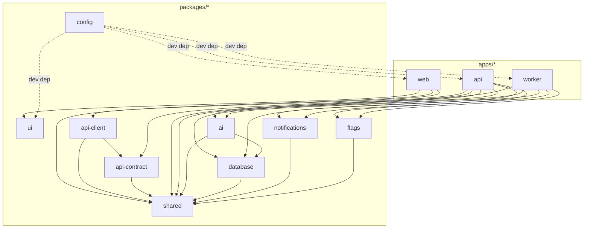
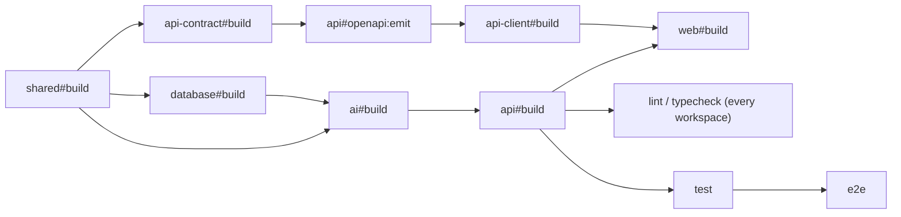

# Monorepo and Folder Structure

This document is the concrete repository tree for Concourse's pnpm 9 + Turborepo 2 monorepo (foundation §6): every top-level `apps/*` and `packages/*` workspace, one level of subfolder detail inside each, the allowed/forbidden dependency edges between them, the Turborepo task graph (targets, caching, remote cache), and where configuration and environment variables live. It does **not** own: the technology choices themselves ([00-foundation.md](00-foundation.md) §6 is the source of truth for versions), the internals of any one deployable's business logic (owned by the doc for that domain — [18-api-architecture.md](18-api-architecture.md), [21-ai-architecture.md](21-ai-architecture.md), [27-background-jobs-architecture.md](27-background-jobs-architecture.md), etc.), or deployment/infrastructure specifics beyond the `infra/` folder shape (Terraform module internals are implementation detail, not a docs-layer decision). Naming conventions themselves (case, prefixes, `SCREAMING_SNAKE` env vars) are fixed in [00-foundation.md](00-foundation.md) §11; this document applies them to a concrete tree rather than restating them.

---

## 1. Scope and Ownership

| This doc owns | Owned elsewhere |
|---|---|
| The concrete `apps/*` / `packages/*` tree, one level of subfolder detail per workspace | Each workspace's internal architecture and business logic → the domain doc that owns it |
| Dependency-graph rules between workspaces (who may import whom) | The specific runtime contracts crossing those edges (e.g., the AI service ports) → [21-ai-architecture.md](21-ai-architecture.md) §1 |
| Turborepo task graph: targets, `dependsOn` shape, caching, remote cache | CI trigger policy and branch/merge gating specifics → not yet written; tracked in [45-implementation-roadmap.md](45-implementation-roadmap.md) |
| Where config and env vars physically live (files, per-deployable `.env`s) | The env var naming grammar itself → [00-foundation.md](00-foundation.md) §11; secrets rotation/storage mechanics → [43-security-architecture.md](43-security-architecture.md) |
| Internal package naming/scoping (`@concourse/*`) and workspace-protocol versioning | Public npm publishing (none — see §11) |

## 2. Top-Level Repository Layout

The repository root (referred to below as `concourse/` — the product's canonical working name, foundation §1) contains three code roots (`apps/`, `packages/`, `infra/`), one non-code root already governed by its own registry (`docs/`, foundation §13), an eval-fixtures root already referenced by name in [21-ai-architecture.md](21-ai-architecture.md) §5 and [22-rag-architecture.md](22-rag-architecture.md) §9 (`evals/`), and root-level workspace/tooling files:

```
concourse/
├── apps/
│   ├── web/            # Next.js 15 — all four surfaces + marketing site (§3)
│   ├── api/             # NestJS 11 on Fastify — the one API deployable (§4)
│   └── worker/           # Node 22 + BullMQ 5 — the one worker deployable (§5)
├── packages/
│   ├── ui/               # Marquee design system — tokens, icons, illustrations, components (§6.1)
│   ├── database/          # Drizzle ORM schema, migrations, seed data (§6.2)
│   ├── shared/             # Zod schemas, shared TS types, i18n resources, cross-cutting constants (§6.3)
│   ├── ai/                  # AiModule — the sole boundary to Claude/Voyage (§6.4)
│   ├── api-contract/         # Zod→OpenAPI pipes + the committed OpenAPI 3.1 artifact (§6.5)
│   ├── api-client/             # Generated typed fetch client consumed by apps/web (§6.6)
│   ├── notifications/           # Email/push templates + the sole SES/Web Push boundary (§6.7)
│   ├── flags/                     # PostHog-backed FeatureFlagService boundary (§6.8)
│   └── config/                     # Shared tsconfig, ESLint, Prettier bases (§6.9)
├── infra/                # Terraform IaC (§7.1)
├── evals/                 # Golden-set fixtures for every AI/retrieval eval gate (§7.2)
├── docs/                   # This documentation set (foundation §13) — unchanged by this doc
├── .github/
│   └── workflows/            # GitHub Actions CI (affected-graph builds, foundation §6)
├── package.json                # root scripts (`turbo run ...`), root devDependencies
├── pnpm-workspace.yaml            # workspace globs: apps/*, packages/*
├── turbo.json                       # task graph (§9)
├── .npmrc                             # pnpm strictness flags (§8.2)
├── .env.example                        # every env var name, no values (§10)
└── .gitignore
```

## 3. `apps/web` — Next.js 15 (all surfaces)

One Next.js app serves every path-scoped surface in foundation §5, per the App Router route-group convention [13-application-layout.md](13-application-layout.md) §1 already fixes for the four authenticated shells. This document fixes the corresponding folder names, since doc 13 deliberately leaves the auth/account group's *shell* unnamed while still needing a filesystem name (§12, decision M9), and supplies the marketing route group doc 13 doesn't need to name because it isn't a shell at all ([46-marketing-site.md](46-marketing-site.md)).

```
apps/web/
├── src/
│   ├── app/
│   │   ├── (marketing)/       # /, /pricing, /about, /contact, /help, /legal/* — MarketingShell, doc 46
│   │   ├── (console)/          # /org/[orgSlug]/... — ConsoleShell (Priya, Marcus)
│   │   ├── (portal)/            # /exhibit/[orgSlug]/events/[eventSlug]/... — PortalShell (Elena, Jamal)
│   │   ├── (attendee)/           # /e/[eventSlug]/... — AttendeeShell (Sofia)
│   │   ├── (admin)/               # /admin/... — AdminShell (Alex Kim)
│   │   └── (auth)/                 # /auth/..., /account/... — minimal chrome, no shell (doc 13 §1)
│   ├── components/             # app-level composed components (surface-specific; the design
│   │                            #   system itself lives in packages/ui, never duplicated here)
│   ├── lib/                     # client utilities: API hooks over packages/api-client, tenant
│   │                            #   context, formatters, the service-worker registration for PWA
│   ├── middleware.ts             # path-based tenant/slug resolution (foundation §5)
│   └── instrumentation.ts         # @vercel/otel bootstrap (doc 31 §4)
├── public/                          # manifest.json, PWA icons, static assets
└── next.config.ts
```

## 4. `apps/api` — NestJS 11 on Fastify

One module per row of the resource map in [18-api-architecture.md](18-api-architecture.md) §1; this document mirrors folder names only — the authoritative module→resource table lives there.

```
apps/api/
├── src/
│   ├── modules/
│   │   ├── auth/                # AuthModule
│   │   ├── users/                 # UsersModule
│   │   ├── organizations/          # OrganizationsModule
│   │   ├── events/                  # EventsModule
│   │   ├── floor/                     # FloorModule
│   │   ├── exhibitors/                 # ExhibitorsModule
│   │   ├── products/                    # ProductsModule
│   │   ├── registrations/                 # RegistrationsModule
│   │   ├── agenda/                          # AgendaModule
│   │   ├── engagement/                        # EngagementModule (leads, meetings, booth_visits)
│   │   ├── matchmaking/                         # MatchmakingModule
│   │   ├── knowledge-base/                        # KnowledgeBaseModule
│   │   ├── ai/                                      # AiModule mount point (packages/ai, §6.4)
│   │   ├── files/                                     # FilesModule
│   │   ├── notifications/                               # NotificationsModule mount point
│   │   ├── billing/                                       # BillingModule
│   │   ├── webhooks/                                        # WebhooksModule
│   │   ├── api-keys/                                          # ApiKeysModule
│   │   ├── search/                                              # SearchModule
│   │   ├── admin/                                                 # AdminModule
│   │   └── health/                                                  # HealthModule
│   ├── common/                 # request-context AsyncLocalStorage, guards, interceptors,
│   │                            #   idempotency-key pipe, RFC 9457 exception filter
│   ├── config/                  # per-module env validation namespaces (§10)
│   └── main.ts
└── nest-cli.json
```

## 5. `apps/worker` — Node 22 + BullMQ 5

Mirrors the queue catalog and scheduled-job registry [27-background-jobs-architecture.md](27-background-jobs-architecture.md) §5–§6 own in full; folder names here are illustrative of the shape, not a second catalog.

```
apps/worker/
├── src/
│   ├── queues/               # one consumer per BullMQ queue in doc 27's registry, e.g.
│   │                          #   webhook-deliver.consumer.ts, kb-ingest.consumer.ts,
│   │                          #   ai-batch.consumer.ts, exports.consumer.ts, imports.consumer.ts,
│   │                          #   file-av-scan.consumer.ts, analytics-ingest.consumer.ts
│   ├── scheduled/              # repeatable jobs, e.g. file-retention-sweep.job.ts,
│   │                            #   event-lifecycle-tick.job.ts, ai-usage-rollup.job.ts
│   ├── outbox-relay/            # the non-queue SKIP LOCKED poll loop (doc 25 §4)
│   ├── common/                    # shared with apps/api's src/common where the contract allows
│   │                              #   (request-context propagation, doc 27 §2)
│   └── main.ts
└── nest-cli.json
```

## 6. `packages/*` — Shared Workspaces

| Package | npm name | Purpose | Mounted / consumed by |
|---|---|---|---|
| `ui` | `@concourse/ui` | Marquee design system (doc 39) | `apps/web` only |
| `database` | `@concourse/database` | Drizzle schema, migrations, seed | `apps/api`, `apps/worker`, `packages/ai` |
| `shared` | `@concourse/shared` | Zod schemas, shared types, i18n, constants | Every workspace (the universal leaf) |
| `ai` | `@concourse/ai` | `AiModule` — sole model-provider boundary | `apps/api`, `apps/worker` |
| `api-contract` | `@concourse/api-contract` | Zod→OpenAPI pipes + committed spec | `apps/api`, `packages/api-client` |
| `api-client` | `@concourse/api-client` | Generated typed fetch client | `apps/web` only (today) |
| `notifications` | `@concourse/notifications` | Templates + sole SES/Web Push boundary | `apps/api`, `apps/worker` |
| `flags` | `@concourse/flags` | `FeatureFlagService` (PostHog Node SDK boundary) | `apps/api`, `apps/worker` |
| `config` | `@concourse/config` | tsconfig / ESLint / Prettier bases | Every workspace (dev-dependency only) |

`apps/*` package names are **unscoped** (`web`, `api`, `worker`) — they are deploy targets, never imported by name, so a scope buys nothing; this is why [18-api-architecture.md](18-api-architecture.md) §2.2 already runs `pnpm --filter api openapi:emit` unscoped. `packages/*` are the imported surface and take the `@concourse/*` scope [39-design-system.md](39-design-system.md) §3.3 already establishes for `@concourse/ui`.

### 6.1 `packages/ui`

Exact structure already fixed by [39-design-system.md](39-design-system.md) §3.3 (styles) and §12 (icons/illustrations); `components/` is this document's addition for the vendored Radix-based component implementations themselves (shadcn-style, per foundation §6 — vendored, not a dependency).

```
packages/ui/
└── src/
    ├── styles/          # primitives.css, semantic.css, density.css, theme.css, base.css, index.css
    ├── icons/             # custom Lucide-style icon components (doc 39 §12)
    ├── illustrations/       # spot-illustration SVG components (doc 39 §12)
    └── components/            # vendored Radix primitives: button/, dialog/, table/, ... (one
                                 #   folder per component, engineering conventions in doc 40)
```

### 6.2 `packages/database`

Schema file split mirrors [16-database-schema.md](16-database-schema.md) §14's domain sections exactly, so any table's DDL is one filename lookup away.

```
packages/database/
├── schema/            # identity.ts, events-floor.ts, exhibitor.ts, engagement.ts,
│                        #   ai-knowledge.ts, platform.ts, support.ts (doc 16 §14)
├── migrations/          # drizzle-kit generated SQL + hand-written RLS/GRANT escape-hatch
│                          #   migrations (doc 16 §14)
├── seed/                  # idempotent seed scripts: plans catalog, help content, fixture event
└── src/                     # outbox.ts (doc 25 §3), rls-context.ts (session-var setter,
                               #   foundation §8), client.ts (pooled connection factory)
```

### 6.3 `packages/shared`

The universal leaf: zero internal workspace dependencies (§8), so it can never form a cycle.

```
packages/shared/
└── src/
    ├── schemas/          # Zod schemas, one file per domain — mirrors packages/database/schema/
    ├── ai/                 # models.ts: MODEL_REASONING / MODEL_FAST aliases (doc 21 §2),
    │                        #   embedding model pin (doc 22 §3)
    ├── i18n/                # <locale>/<surface>.json ICU MessageFormat resources (doc 10 §12)
    ├── types/                 # shared TS types/enums not modeled as a Zod schema
    └── constants/               # permission strings, entitlement keys, domain-event names,
                                   #   queue names (foundation §11's naming grammar as typed consts)
```

### 6.4 `packages/ai`

Folder-per-port, matching the public port table in [21-ai-architecture.md](21-ai-architecture.md) §1 one-to-one, plus the private gateway and the two feature-internal folders doc 21/24 already name explicitly.

```
packages/ai/
└── src/
    ├── generation/        # AiGenerationService (claude-fable-5)
    ├── classification/      # AiClassificationService (claude-haiku-4-5)
    ├── embedding/             # AiEmbeddingService (Voyage voyage-3.5 / rerank-2.5)
    ├── retrieval/               # RetrievalService (doc 22)
    ├── matchmaking/               # weights.ts, tune-weights.ts (doc 21 §3.2, doc 24)
    ├── prompts/                     # PromptRegistry + <feature>/<name>.prompt.ts (doc 21 §4)
    ├── guardrails/                     # AiGuardrailService (doc 21 §7)
    ├── budget/                           # AiBudgetService (doc 21 §6)
    └── gateway/                             # AiGatewayService — private orchestrator (doc 21 §1)
```

`@anthropic-ai/sdk` and `voyageai` are declared as dependencies only here (doc 21 §1's enforcement, §8 below).

### 6.5 `packages/api-contract`

```
packages/api-contract/
├── src/          # nestjs-zod-style validation pipes/decorators vendored per doc 18 §2.1
└── openapi/
    └── concourse.v1.json    # generated, committed; CI fails if regenerating it produces a diff
```

### 6.6 `packages/api-client`

```
packages/api-client/
└── src/
    ├── generated/     # codegen output from openapi/concourse.v1.json — never hand-edited
    └── index.ts         # barrel export: one typed function per operationId + shared types
```

### 6.7 `packages/notifications`

```
packages/notifications/
└── src/
    ├── templates/       # <category>/<TemplateId>.tsx — React Email, ≈26 templates (doc 33 §7)
    └── categories.ts      # the category allowlist enum (doc 33 §4)
```

`@aws-sdk/client-ses` and `web-push` are declared as dependencies only here (doc 33 §1's "one boundary" discipline, mirroring `packages/ai`'s).

### 6.8 `packages/flags`

```
packages/flags/
└── src/
    └── registry.ts        # defineFlag() calls, compiled into the client manifest (doc 34 §9)
```

### 6.9 `packages/config`

```
packages/config/
├── eslint/       # base.js + per-runtime overrides (next.js, nestjs.js) — carries the
│                  #   no-restricted-imports rules enforcing §6.4 and §6.7's SDK containment
├── typescript/     # base.json + per-runtime tsconfig (nextjs.json, node.json)
└── prettier/         # index.js — the one formatting config every workspace extends
```

## 7. Non-Package Roots

### 7.1 `infra/`

Terraform, per foundation §6. One root module per environment, composed from shared child modules matching the AWS-managed services still named in foundation §6 (ECS Fargate, ElastiCache, ALB) — Database, Auth, Storage, and Realtime are provisioned as a Supabase project (§14 Amendment A5), not via this Terraform, so the `rds` and `s3-cloudfront` modules below are retained only as historical placeholders pending confirmation of their removal in a follow-up infra review:

```
infra/
├── modules/            # network, ecs-api, ecs-worker, rds, elasticache, s3-cloudfront, iam
└── environments/
    ├── staging/
    └── production/
```

Module-internal Terraform (resource blocks, variable wiring) is implementation detail of the IaC itself, not a docs-layer decision this document resolves further.

### 7.2 `evals/`

Golden-set fixtures, checked into the repo per [21-ai-architecture.md](21-ai-architecture.md) §5 and [22-rag-architecture.md](22-rag-architecture.md) §9 — one folder per feature, each a `golden.jsonl`:

```
evals/
├── copilot/            # 200 queries (doc 21 §5)
├── matchmaking/          # 100 labeled pairs (doc 21 §5, doc 24 §9)
├── lead-intelligence/      # 100 lead fixtures (doc 21 §5)
├── followup-studio/          # 60 lead fixtures (doc 21 §5)
├── pulse/                       # 80 questions (doc 21 §5)
├── retrieval/                     # 150 labeled queries (doc 22 §9)
└── security/                        # injection.jsonl, ≥30 attack documents (doc 21 §7.6)
```

## 8. Dependency-Graph Rules

The governing rule, restated from the brief this document was given: **`apps/web` depends on `packages/api-client` and `packages/ui`, and never depends on `packages/ai` directly** — the same one-boundary discipline [21-ai-architecture.md](21-ai-architecture.md) §1 enforces for model calls extends structurally to the whole graph. Every workspace's edges:



| Rule | Statement | Why |
|---|---|---|
| R1 | `apps/web` never imports `packages/ai`, `packages/database`, `packages/notifications`, or `packages/flags` | These are server-only boundaries mounted by `apps/api`/`apps/worker` alone (docs 21 §1, 33 §1, 34 §9); `apps/web` reaches their effects only through `packages/api-client` calls or SSR-bootstrapped payloads |
| R2 | `apps/api` and `apps/worker` never depend on `packages/api-client` | `packages/api-client` is *generated from* `apps/api`'s own emitted OpenAPI artifact ([18-api-architecture.md](18-api-architecture.md) §2) — a back-dependency would be a build cycle. Internal worker→api calls use plain HTTP with a signed service JWT ([18-api-architecture.md](18-api-architecture.md) §10, [27-background-jobs-architecture.md](27-background-jobs-architecture.md) §2) instead; this is a runtime relationship, not a workspace dependency edge |
| R3 | `packages/shared` depends on nothing internal | The universal leaf — every other package may import it, it imports none of them, so it can never sit inside a cycle (product principle P3, foundation §1) |
| R4 | `packages/ui` depends on nothing internal except `packages/config` (dev-only) | Keeps it a pure leaf, unmodified-consumable by a future React Native surface (foundation D3) without dragging in web-only concerns |
| R5 | Only `packages/ai` may declare `@anthropic-ai/sdk` / `voyageai`; only `packages/notifications` may declare `@aws-sdk/client-ses` / `web-push` | Docs 21 §1 and 33 §1's "one boundary" rule, applied identically |
| R6 | `packages/ai` may depend on `packages/database` (one-way) | `AiEmbeddingService`/`RetrievalService` write/read `kb_chunks`, `ai_conversations`, `ai_messages` directly (doc 21 §1 diagram); `packages/database` never depends back on `packages/ai` |

**Enforcement — structural, not just convention:**

1. **pnpm's non-hoisted `node_modules`** (default, strict mode) means a workspace can only resolve a package it explicitly lists in its own `package.json` `dependencies`. An undeclared cross-package import fails at module resolution, not just at lint time — this is the primary enforcement for every edge (and non-edge) in the table above.
2. **Turborepo's task graph mirrors the same edges** (`dependsOn: ["^build"]` walks declared `package.json` dependencies), so a mis-declared dependency also breaks build ordering, not only imports.
3. **`no-restricted-imports`** in `packages/config/eslint` catches the finer-grained cases pnpm can't: deep relative imports that cross a package boundary via `../../` instead of the package name, and the external-SDK containment rules in R5.

## 9. Turborepo Task Graph

Tasks (Turborepo 2 `tasks`, not the legacy `pipeline` key):

```jsonc
// turbo.json
{
  "$schema": "https://turbo.build/schema.json",
  "tasks": {
    "build": {
      "dependsOn": ["^build"],
      "outputs": [".next/**", "!.next/cache/**", "dist/**"]
    },
    "api#openapi:emit": {
      "dependsOn": ["^build"],
      "outputs": ["packages/api-contract/openapi/**"]
    },
    "api-client#build": {
      "dependsOn": ["^build", "api#openapi:emit"],
      "outputs": ["dist/**"]
    },
    "lint": { "dependsOn": ["^build"] },
    "typecheck": { "dependsOn": ["^build"] },
    "test": { "dependsOn": ["build"], "outputs": ["coverage/**"] },
    "test:integration": { "dependsOn": ["build"], "cache": false },
    "e2e": { "dependsOn": ["build"], "cache": false },
    "dev": { "cache": false, "persistent": true }
  }
}
```



- **`packages/api-client#build` names its cross-package dependency explicitly** (`api#openapi:emit`), not just `^build` — a Turborepo-2 task-graph feature this document uses precisely because R2 forbids the *package-level* edge back to `apps/api`; the task graph still needs the artifact, so it depends on one specific task output rather than the whole package.
- **Caching:** every deterministic task (`build`, `lint`, `typecheck`, `test`) is cached on its declared `outputs` plus the `env` keys it reads (declared per task so a changed secret value still busts the cache without widening the cache key unnecessarily). `test:integration`, `e2e`, and `dev` are never cached — Testcontainers and Playwright runs are non-deterministic enough that a stale cache hit would be worse than a re-run.
- **Remote caching:** **Vercel Remote Cache.** `apps/web` is already Vercel-hosted (foundation §6), so this introduces no new vendor — it is Turborepo's own first-party remote-cache target, authenticated via `TURBO_TOKEN`/`TURBO_TEAM` (Turborepo-mandated names, exempt from the service-prefix env convention per §10).
- **Affected-graph CI** (foundation §6's "Turborepo affected-graph"): GitHub Actions runs `turbo run build lint typecheck test --filter='...[origin/main...HEAD]'` — only workspaces actually touched by a PR (plus their dependents) execute; everything else resolves from remote cache.

## 10. Configuration and Environment Variables

Per foundation §11: `SCREAMING_SNAKE` with a service prefix (`API_DATABASE_URL` is foundation's own example). This document fixes where each var is declared and consumed:

| File | Committed? | Purpose |
|---|---|---|
| `.env.example` (root) | Yes | Every var name across every deployable, placeholder values only — the single reference list |
| `apps/web/.env.local` | No (gitignored) | Local dev values for `apps/web` (Next.js's own convention) |
| `apps/api/.env` | No | Local dev values for `apps/api` |
| `apps/worker/.env` | No | Local dev values for `apps/worker` |

In deployed environments, ECS Fargate task definitions (`apps/api`, `apps/worker`) and the Vercel project (`apps/web`) inject values from AWS Secrets Manager / SSM Parameter Store (secrets) or plain task-definition environment blocks (non-secret config); rotation, KMS, and who-can-read-what are owned by [43-security-architecture.md](43-security-architecture.md), not restated here.

| Prefix | Scope | Example |
|---|---|---|
| `WEB_` | `apps/web` | `WEB_NEXT_PUBLIC_API_BASE_URL` |
| `API_` | `apps/api` | `API_DATABASE_URL`, `API_REDIS_URL`, `API_SESSION_COOKIE_NAME` |
| `WORKER_` | `apps/worker` | `WORKER_DATABASE_URL`, `WORKER_REDIS_URL` |
| `AI_` | `AiModule` config namespace — **module-level, not deployable-level** | `AI_ANTHROPIC_API_KEY`, `AI_VOYAGE_API_KEY` (doc 21 §1) |

The `AI_` prefix is a deliberate, declared exception to the per-deployable rule: `AiModule` is mounted identically inside both `apps/api` and `apps/worker` (doc 21 §1) and must read the byte-identical secret in either process. Using `AI_` instead of forcing two copies (`API_ANTHROPIC_API_KEY` / `WORKER_ANTHROPIC_API_KEY`) makes it visually unambiguous that the key is gated by `AiModule`'s own access boundary regardless of which deployable loaded it. `packages/notifications`' SES/Web Push credentials follow the same module-namespace pattern (`NOTIFICATIONS_SES_REGION`, etc.) for the identical reason.

`packages/database`'s drizzle-kit CLI (migrations, seed) is invoked via `pnpm --filter database migrate` and reads whichever `*_DATABASE_URL` its caller already has in scope (`API_DATABASE_URL` in CI/local, `WORKER_DATABASE_URL` if run from a worker context) rather than minting its own tooling-only prefix — it is tooling invoked on behalf of a deployable, not a deployable itself.

## 11. Package Versioning and the Workspace Protocol

**Decision: no internal package is published to npm, ever.** Every `apps/*` → `packages/*` and `packages/*` → `packages/*` dependency uses pnpm's `workspace:*` protocol (`"@concourse/ui": "workspace:*"`), which always resolves to the current in-repo source — there is no version drift to manage and no publish step to forget. This is consistent with foundation §6 describing `packages/ui` itself as "vendored, not dependency": the whole internal package set follows the same philosophy at the workspace level. `packages/api-contract`'s `openapi/concourse.v1.json` is the one artifact with an externally-meaningful version (`/v1`, foundation §9) — that version is governed by the contract-diff CI check ([18-api-architecture.md](18-api-architecture.md) §2.2), not by npm semver.

## 12. Key Decisions

| ID | Decision | Rationale |
|---|---|---|
| M1 | Root folder named for the product (`concourse/`), not a placeholder | Every other document already treats "Concourse" as the operative working name (foundation §1) |
| M2 | `apps/*` unscoped, `packages/*` scoped `@concourse/*` | Matches existing precedent exactly: doc 18 §2.2's unscoped `pnpm --filter api`, doc 39 §3.3's `@concourse/ui` |
| M3 | `apps/api`/`apps/worker` never depend on `packages/api-client` (R2) | Avoids a build cycle — the client is generated from the API's own contract output |
| M4 | `apps/web` never depends on `packages/flags` directly | Doc 34 mounts `FeatureFlagService` only in `apps/api`/`apps/worker`; preserves the one-module-one-boundary discipline doc 21 established and doc 34 extends |
| M5 | `packages/ui` takes zero internal dependencies beyond `packages/config` (dev-only) | Keeps it a pure leaf, reusable unmodified by a future React Native surface (foundation D3) |
| M6 | `AI_*` (and `NOTIFICATIONS_*`) env vars are module-level namespaces, not deployable prefixes | Reconciles foundation §11's per-service default with doc 21 §1's `AiModule` being mounted in two deployables needing the identical secret |
| M7 | Turborepo remote cache runs on Vercel Remote Cache | No new vendor — `apps/web` is already Vercel-hosted, and it's Turborepo's own first-party cache target |
| M8 | drizzle-kit CLI borrows its caller's `*_DATABASE_URL` rather than a new `DATABASE_` tooling prefix | It runs on behalf of a deployable, not as one |
| M9 | The doc-13 "fifth, unnamed" auth/account shell gets the folder name `(auth)` | A Next.js route group needs *some* folder name even though doc 13 deliberately withholds a shell identity for it; this fixes only the path, not a new shell |
| M10 | The marketing site's route group is named `(marketing)` | Doc 46 names the chrome "MarketingShell" but never fixes a folder; supplied here for parity with the four already-named groups |

## 13. Ownership / Related Documents

| Detail | Owned by |
|---|---|
| This document | Concrete repo tree, package boundaries, dependency-graph rules, Turborepo task graph, config/env file locations |
| Tech stack choices and versions (Next.js 15, NestJS 11, Drizzle, etc.) | [00-foundation.md](00-foundation.md) §6 |
| Env var naming grammar, file/route naming conventions | [00-foundation.md](00-foundation.md) §11 |
| `AiModule` internals, model routing, per-feature specs | [21-ai-architecture.md](21-ai-architecture.md) |
| REST API module map, contract pipeline, OpenAPI hygiene | [18-api-architecture.md](18-api-architecture.md) |
| BullMQ queue catalog, worker scaling, retry policy | [27-background-jobs-architecture.md](27-background-jobs-architecture.md) |
| Design token shipping mechanism, icon/illustration folders | [39-design-system.md](39-design-system.md) |
| Column-level schema, migration/seed governance | [16-database-schema.md](16-database-schema.md) |
| Notification templates and transport boundary | [33-notification-system.md](33-notification-system.md) |
| Feature-flag lifecycle and `packages/flags` boundary | [34-feature-flags-and-experimentation.md](34-feature-flags-and-experimentation.md) |
| Secrets storage, rotation, supply-chain posture | [43-security-architecture.md](43-security-architecture.md) |
| Shell/route-group definitions for the four authenticated surfaces | [13-application-layout.md](13-application-layout.md) |
| Milestone sequencing this repo's build-out follows | [45-implementation-roadmap.md](45-implementation-roadmap.md) |
