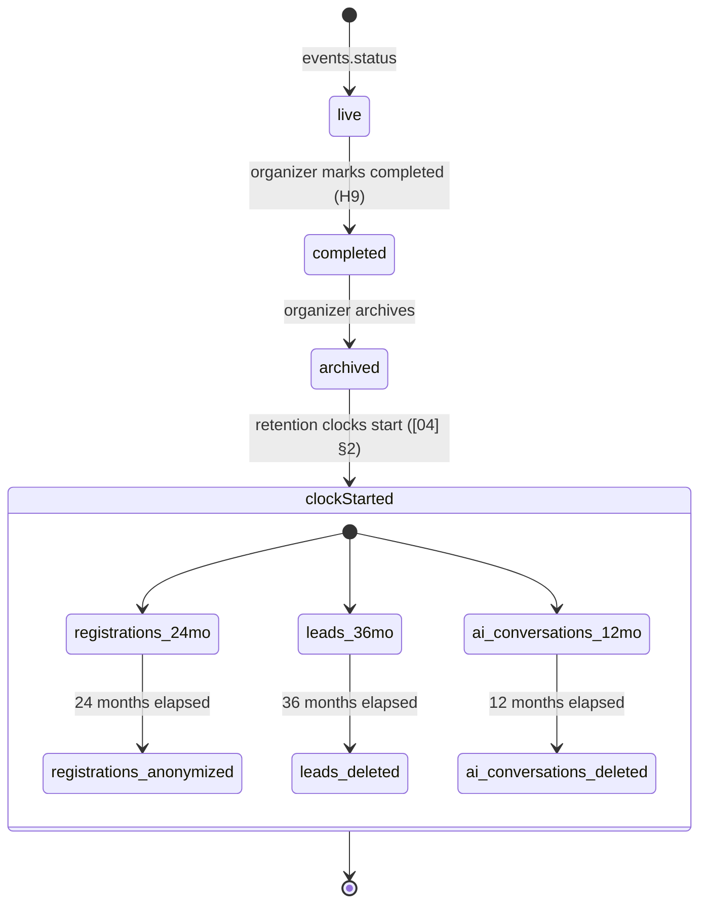
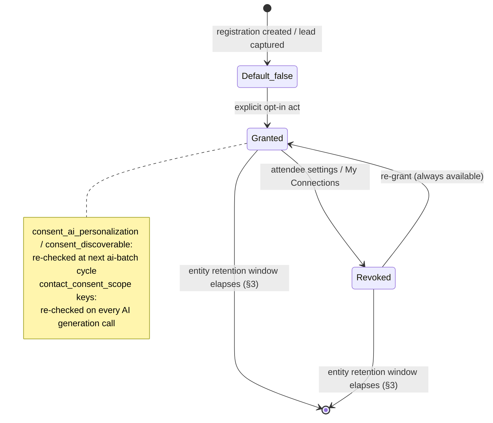

# Data Retention, Privacy & Compliance

This document is the canonical owner of three things across the whole platform: **retention** — how long every entity's data survives after the "retention clocks start" moment fixed in [04-user-journey.md](04-user-journey.md) §2's master timeline (event archival) or its own natural clock, and the purge/anonymization mechanism that enforces it; **consent** — the full lifecycle (grant, default, revoke, propagation) behind `consent_ai_personalization`, `consent_discoverable`, and lead capture-time contact-sharing consent, all of which [21-ai-architecture.md](21-ai-architecture.md) §10 already names and defers here; and **DSAR/erasure mechanics** — the self-service export and account-deletion procedures behind feature A10 ([08-feature-matrix.md](08-feature-matrix.md)), including the exact hard-delete/anonymize/retain decision per entity. It also fixes Concourse's GDPR/CCPA regulatory posture and sub-processor terms, resolving the "zero-data-retention" note already flagged in [21-ai-architecture.md](21-ai-architecture.md) §10.

**What this document does not own:** column-level DDL, types, and the nullability guarantee that makes anonymization possible ([16-database-schema.md](16-database-schema.md) §2.5, which explicitly delegates "the procedure" here); the audit-specific retention/redaction carve-out for `audit_logs` itself ([29-audit-logging-architecture.md](29-audit-logging-architecture.md) §8, cited not restated); file storage mechanics and the sweep *engine* ([26-file-storage.md](26-file-storage.md) §9, which executes the *durations* this document sets); knowledge-base erasure propagation *inside* `kb_chunks` ([23-knowledge-base-architecture.md](23-knowledge-base-architecture.md) §10, which this document triggers but does not reimplement); the BullMQ worker deployable and general retry policy ([27-background-jobs-architecture.md](27-background-jobs-architecture.md), which runs the jobs this document names); and the role→permission matrix gating who can read compliance surfaces ([28-permission-model.md](28-permission-model.md)). This document is the detailed mitigation record for business risk R6 ("privacy and consent failures") in [02-business-goals.md](02-business-goals.md) §7.

---

## 1. Data Classification & Legal Bases

Every personal-data category Concourse processes, with Concourse's role (GDPR distinguishes *controller* — decides why/how data is processed — from *processor* — processes on a controller's instructions) and its primary lawful basis. This table is the reference every other section cites rather than re-deriving.

| Data category | Examples | Concourse's role | Primary lawful basis (GDPR Art. 6) | CCPA/CPRA category |
|---|---|---|---|---|
| Account & identity | `users`, `auth_sessions`, `api_keys` | Controller | Contract (1)(b) — necessary to provide the account | Identifiers |
| Registration & attendee profile | `registrations`, `attendee_interests` | Controller (event-hosting service the attendee opted into) | Contract (1)(b) for the base registration; **Consent (1)(a)** for the AI-personalization and discoverability layers gated by `consent_ai_personalization`/`consent_discoverable` (§4) | Identifiers, professional/employment info |
| Lead/contact data | `leads`, `lead_notes` | **Processor** on behalf of the exhibitor org (an independent controller for its own pipeline) | Consent (1)(a) — the attendee's capture-time `contact_consent_scope` (§4.3) is the entire lawful basis; no scope, no processing | Identifiers |
| AI conversation content | `ai_conversations`, `ai_messages` | Controller | Contract/legitimate interest (1)(f) for base Expo Copilot Q&A (the attendee's own messages + public KB content); **Consent (1)(a)** for the personalization augmentation (declared interests/bookmarks in the prompt, per [21-ai-architecture.md](21-ai-architecture.md) §10) | Identifiers, internet activity |
| Audit & security | `audit_logs` | Controller | Legitimate interest (1)(f) / legal obligation — demonstrating compliance (Art. 17(3)(b)) | Identifiers (exempted from deletion, §3) |
| Consent evidence | `legal_acceptances` | Controller | Legal obligation (1)(c)) — evidencing valid consent (Art. 7(1)) | Identifiers |
| Billing | Stripe-held payment methods/invoices (`plans`/`subscriptions`/`entitlements` reference only; card data never touches Concourse's database) | Controller for the organizer/exhibitor relationship; Stripe is the processor | Contract (1)(b) + legal obligation (1)(c), tax records | Identifiers, financial info |

**CCPA/CPRA posture in one line:** for organizer and exhibitor business customers, Concourse is a **Service Provider** — it processes attendee/lead personal information only to perform the event-hosting/lead-capture service the customer purchased, never for its own independent commercial purpose. Concourse does not sell or share personal information for cross-context behavioral advertising. GDPR and CCPA rights are fulfilled through **one unified Privacy Request pipeline** (§9) rather than two parallel workflows — building a second, functionally overlapping intake mechanism would violate the "one source of truth" product principle ([00-foundation.md](00-foundation.md) §1, P3).

---

## 2. Retention Clocks

[04-user-journey.md](04-user-journey.md) §2's master timeline fixes the moment: *"Event archived; data retention clocks start"* (`events.status: completed → archived`). For entities whose data is scoped to one event, this is the clock-start. Two entity families have their own independent clocks instead: `audit_logs` (clock = `created_at`, no event relationship — an admin action can happen against an org with many events) and `legal_acceptances` (clock = `accepted_at`, a global identity fact, not event-scoped).



`audit_logs` (7 years from `created_at`) and `legal_acceptances` (7 years from `accepted_at`) run on their own independent clocks in parallel, unaffected by any one event's archival — shown separately in §3's table rather than inside this diagram, since they are not event-scoped.

---

## 3. Retention Schedule (Authoritative Table)

**Decision — windows are long enough to serve the two things that need historical data (cross-event exhibitor/attendee recognition, and exhibitor pipeline defensibility) and no longer**, per the data-minimization principle GDPR Art. 5(1)(e) requires and per product principle P3 (one source of truth — a stale copy nobody needs is a liability, not an asset).

| Entity | Clock start | Window | End-of-window action | Why |
|---|---|---|---|---|
| `registrations` (+ cascaded `attendee_interests`, `session_checkins`, `booth_visits`, `meetings`, `match_recommendations`) | Event archived | **24 months** | **Anonymize in place**: `company_name`, `job_title`, `custom_fields` nulled/reset; `consent_ai_personalization`, `consent_discoverable` reset `false`. The row and every aggregate derived from it (QCE, check-in counts) survive indefinitely thereafter — anonymized history, not deleted history. | 24 months spans two typical annual-edition cycles, covering the cross-event attendee-recognition and organizer year-over-year trend window ([02-business-goals.md](02-business-goals.md) §5 KPI tree) without holding raw identity past its useful life. |
| `leads` (+ `lead_notes`) | Event archived | **36 months** | **Hard delete.** | A 36-month sales-cycle/commercial-record window covers exhibitor pipeline defensibility; by month 36 the underlying `registrations` row is already anonymized (its 24-month window elapses first), so no further identity linkage exists to justify keeping the exhibitor's copy in Concourse once the exhibitor's own CRM sync/export (H11/H12) has long since captured whatever they still need. |
| `ai_conversations` + `ai_messages` (`expo_copilot`, `followup_studio` threads) | Event archived | **12 months** | **Hard delete.** | Free-text conversational content has no continuing legitimate business need once the immediate personalization window closes, and free text cannot be meaningfully anonymized in place (there is no "null" for a sentence) — full deletion is the only coherent action, mirrored by the account-erasure path (§6) which deletes these unconditionally regardless of window. |
| `ai_conversations` (`organizer_pulse` threads — cross-event, no single archival) | `last_message_at` | **12 months** | Hard delete. | Same rationale; Pulse threads aren't anchored to one event's lifecycle, so the clock is the thread's own last activity. |
| `audit_logs` | `created_at` | **7 years** | Hard delete (mechanism owned entirely by [29-audit-logging-architecture.md](29-audit-logging-architecture.md) §8 — cited, not restated). | SOC 2 Type II / enterprise-contract expectation; independent of any user's own account lifecycle (§6). |
| `legal_acceptances` | `accepted_at` | **7 years** | Retained as-is; never deleted early. On account erasure, `user_id` is repointed to the erasure tombstone (§6.2) rather than the row being touched. | Mirrors `audit_logs`' legal-defensibility basis — a consent record's entire value is proving "someone accepted version *n* at time *t*," which erasure of the *account* must not be able to erase. |
| `files` — purpose `lead_note_voice` | `transcription_status = completed` | **90 days** | Hard delete (raw audio). | The transcript already lives durably in `lead_notes.body_md` under the `leads` window above; keeping the highest-sensitivity, least-necessary artifact (raw voice) for months past transcription serves no purpose. |
| `files` — purpose `export` (incl. `account_data_export`, §5) — **excluding `post_event_report`/`exhibitor_roi_report`, carved out in the row directly below** | Job completion | **7 days** | Hard delete. | Matches the existing 15-minute-signed-URL-then-regenerate-on-demand posture ([18-api-architecture.md](18-api-architecture.md) §5.9); a week is headroom for a slow download, not a durable copy. |
| `files` — purpose `post_event_report`, `exhibitor_roi_report` (the reporting pipeline [32-analytics-architecture.md](32-analytics-architecture.md) §8.1 delegates retention ownership to this document for) | Job completion | **36 months** | Hard delete. | **Carved out of the generic `export` row above, not governed by its 7-day window.** These two purposes are durable rebooking/renewal sales assets, not one-off downloads: [32-analytics-architecture.md](32-analytics-architecture.md) §8.1/§8.3, [06-exhibitor-journey.md](06-exhibitor-journey.md) EX-11, and [05-organizer-journey.md](05-organizer-journey.md) O-10 all describe the PDF as the artifact literally attached to a rebooking invitation — an event it fires well after generation (O-10 lands T+2–6 weeks at the earliest, and an organizer may reuse the same prior-edition report at the *next* annual cycle's rebooking push). A 7-day purge would destroy the asset before its primary use case ever occurs. 36 months mirrors the `leads` row's sales-cycle-defensibility window above rather than inventing a new duration, keeping every artifact in the exhibitor commercial-record family — the pipeline data and the reports summarizing it — on the same clock. |
| `files` — `avatar`, `logo`, `product_image`, `uploaded_document` | n/a (tied to owning row) | Indefinite while the owning row is active | Purged by [26-file-storage.md](26-file-storage.md) §9.3's orphan sweep once the owning row (`users.avatar_file_id`, `products.image_file_id`, `kb_sources`) is gone. | These are reusable catalog/profile assets, not point-in-time personal data with an independent clock. |
| `kb_sources` / `kb_documents` / `kb_chunks` | n/a | Owned entirely by [23-knowledge-base-architecture.md](23-knowledge-base-architecture.md) §6/§10 | Delete-and-regenerate or purge on exhibitor withdrawal/erasure. | Pointer only — no duplicate policy here. |
| `background_jobs` | `created_at` | 30 days | Owned by [27-background-jobs-architecture.md](27-background-jobs-architecture.md) §8.4 as operational housekeeping, **not** a privacy retention policy. | Pointer only, listed for completeness of "where does every row eventually go." |

### 3.1 The `retention-purge` job

**Decision — this document introduces one new scheduled BullMQ job, `retention-purge`,** into [27-background-jobs-architecture.md](27-background-jobs-architecture.md)'s catalog, following the exact "define here, formalize on the owning document's next revision" discipline already established for `background_jobs` (doc 27 §8.1/J9) and for `legal_documents`/`legal_acceptances` ([00-foundation.md](00-foundation.md) §14 A2). It runs daily at `0 4 * * *` UTC (one hour after `file-retention-sweep`, avoiding lock contention on the same tables), using doc 27 §4.1's general retry policy (5 attempts, exponential+jitter — a missed run is caught by the next day's run, consistent with the reasoning already applied to `file-retention-sweep`'s "2 attempts, a missed day is caught by the next run"). Each run:

1. Anonymizes `registrations` past their 24-month window (§3, batched, `UPDATE ... WHERE archived_at < now() - interval '24 months' AND company_name IS NOT NULL`, idempotent — a row with already-null fields is simply skipped).
2. Hard-deletes `leads`/`lead_notes` past their 36-month window.
3. Hard-deletes `ai_conversations`/`ai_messages` past their 12-month window (both clocks, §3).

This is a distinct job from `audit-log-purge` ([29-audit-logging-architecture.md](29-audit-logging-architecture.md) §8, which owns `audit_logs`' 7-year purge entirely) and from `file-retention-sweep` ([26-file-storage.md](26-file-storage.md) §9.3, which owns `files`) — three separate sweeps, each scoped to the tables its owning document actually governs, rather than one monolithic job crossing ownership boundaries. Failure alerting follows the identical pattern doc 27 §10 already applies to `file-retention-sweep`: a missed scheduled run is a compliance risk, not just an operational one, and pages accordingly. Feature S7 ([08-feature-matrix.md](08-feature-matrix.md), "Retention & archival execution") is Alex's Platform Admin visibility into this job's run history.

---

## 4. Consent Architecture (Canonical Owner)

Wherever [21-ai-architecture.md](21-ai-architecture.md) §10 references `consent_ai_personalization`, `consent_discoverable`, or the lead capture-time contact-sharing consent scope, **this document is the canonical owner of their full lifecycle** (grant, default, revoke, propagation); doc 21 consumes the columns and enforcement points defined here without restating them. Per Journey Principle JP-6 ([04-user-journey.md](04-user-journey.md) §5, "Consent before exposure"), every one of these is an **opt-in** default — `false` until an explicit act grants it, never a pre-checked box.

### 4.1 `consent_ai_personalization` (on `registrations`)

| Property | Value |
|---|---|
| Default | `false` (schema default, [16-database-schema.md](16-database-schema.md) §6.1) |
| Grant moment | Registration flow (declared-interests step) or later, in-app attendee settings |
| What it gates | Expo Copilot may include the attendee's declared `attendee_interests` and bookmarks in prompts; Smart Matchmaking includes the registration in scoring runs |
| Revoke moment | Attendee settings, any time, self-service, effective immediately (no grace period — this is a data-minimization toggle, not an erasure) |
| Revoke propagation | (1) Excluded from all future Copilot prompt construction and matchmaking scoring runs from the next `ai-batch` incremental cycle onward ([21-ai-architecture.md](21-ai-architecture.md) §3.2); (2) per [23-knowledge-base-architecture.md](23-knowledge-base-architecture.md) §10.1, this propagation resolves entirely within docs 21/24's territory and never reaches `kb_chunks`, because attendee data was never indexed there in the first place |

### 4.2 `consent_discoverable` (on `registrations`)

| Property | Value |
|---|---|
| Default | `false` |
| Grant moment | Same as above |
| What it gates | Whether the registration can appear in exhibitor-facing recommendations (Smart Matchmaking's prospect list, J3) |
| Revoke moment | Attendee settings, immediate |
| Revoke propagation | Registration drops out of `match_recommendations` generation for the exhibitor side on the next scoring cycle; does not affect the attendee's own inbound recommendations (`consent_ai_personalization` governs those independently) |

### 4.3 Lead capture-time contact-sharing consent (`leads.contact_consent_scope`)

**Decision — the canonical scope-key catalog is exactly three keys**, matching the example [16-database-schema.md](16-database-schema.md) §6.6 already anticipates, stored as `text[]` so the catalog can grow without a migration but is never ambiguous about what exists today:

| Key | Grants | Consumer |
|---|---|---|
| `contact_info` | The attendee's name/email/company/job title (from `registrations`) is visible to the exhibitor in the Lead Intelligence UI. **Structurally always present** — per Journey Principle JP-6, a lead cannot be created at all without this (a badge scan or self-scan *is* the disclosure act; passive dwell never creates a lead) | Every Lead Intelligence surface |
| `ai_summary` | Permits AI generation of interaction summaries/next-best-action referencing this lead's evidence | [21-ai-architecture.md](21-ai-architecture.md) §3.3 (Lead Intelligence) |
| `followup_email` | Permits inclusion in Follow-up Studio drafting and platform-sent outbound email | [21-ai-architecture.md](21-ai-architecture.md) §3.4 (Follow-up Studio) — a lead lacking this key is excluded from draft selection entirely, never merely redacted |

**Grant moment:** at capture (badge scan / self-scan), presented as the disclosed-data-set screen JP-6 requires — the exact UI is [07-attendee-journey.md](07-attendee-journey.md)'s to specify; this document fixes only the three keys and their effect. `contact_info` grants automatically with any capture; `ai_summary` and `followup_email` are independent checkboxes the attendee can decline while still allowing basic capture (feature H4, "Consent enforcement").

**Revoke moment:** attendee's "My Connections" view (feature H13) exposes a per-lead scope-key revocation control — the attendee can withdraw `ai_summary` and/or `followup_email` after the fact (not `contact_info`, since withdrawing it is equivalent to requesting the lead's erasure, handled as a DSAR-style request routed the same way as §6). **Revoke propagation:** because AI generation re-checks `contact_consent_scope` on *every* call rather than baking a decision in once (already true per [21-ai-architecture.md](21-ai-architecture.md) §3.3/§3.4's "only attendee fields covered by capture-time consent scope"), revocation takes effect on the very next summary regeneration or draft batch — no separate propagation job is needed.



### 4.4 Freeform text is not scrubbed automatically

`lead_notes.body_md` is rep-authored freeform text and may occasionally name the attendee directly (a habit, not a structured field). Automated PII redaction of arbitrary freeform text is not attempted — this mirrors the exact "redact at the source, then treat it as an ordinary content edit" pattern [23-knowledge-base-architecture.md](23-knowledge-base-architecture.md) §10.2 already established for a structurally identical problem (a speaker bio naming a third party). If a DSAR request specifically flags a note as containing erasure-eligible personal data, it routes to the exhibitor for manual redaction via the DSAR queue (§9), not to an automated scanner. Building that scanner is assigned to [44-future-expansion-plan.md](44-future-expansion-plan.md); revisit criterion: DSAR volume flagging note text exceeds what manual redaction handles at acceptable turnaround.

---

## 5. DSAR: Self-Service Data Export (Feature A10, part 1)

`POST /v1/account/data-export` (self-service, any authenticated user, any time — no cooldown). Follows the exact async-job shape [18-api-architecture.md](18-api-architecture.md) §5.15 already fixes: inserts a `background_jobs` row (`kind: 'account_data_export'`, a new value this document adds to the extensible enum [27-background-jobs-architecture.md](27-background-jobs-architecture.md) §5.5 already anticipates — "extensible: future export endpoints add a kind here") on the existing `exports` queue, and returns `202` with the job id. The handler writes a `.zip` to Supabase Storage under `files.purpose = 'export'` (§3's 7-day window) and returns a 15-minute Supabase Storage signed URL, identical mechanics to the existing `leads_export` kind.

**Contents** — every table where the requester is a first-class party, structured per GDPR Art. 20 portability (machine-readable JSON):

```json
{
  "exportedAt": "2026-07-10T18:04:00Z",
  "account": { "id": "...", "email": "...", "fullName": "...", "locale": "en", "createdAt": "..." },
  "organizationMemberships": [ { "organizationId": "...", "role": "org:member" } ],
  "registrations": [
    {
      "eventId": "...", "eventName": "TechExpo 2026", "status": "checked_in",
      "consentAiPersonalization": true, "consentDiscoverable": false,
      "declaredInterests": ["industrial-iot"], "bookmarks": ["booth-42"]
    }
  ],
  "leadsAboutMe": [
    {
      "eventExhibitorName": "Acme Sensors", "status": "qualified", "score": 78,
      "contactConsentScope": ["contact_info", "ai_summary"],
      "notes": ["Interested in a Q3 pilot"]
    }
  ],
  "aiConversations": [ { "feature": "expo_copilot", "messageCount": 12, "lastMessageAt": "..." } ],
  "legalAcceptances": [ { "documentType": "privacy", "version": 3, "acceptedAt": "..." } ]
}
```

**Decision — `leadsAboutMe` is included even though `leads` rows are exhibitor-owned.** GDPR/CCPA access rights attach to the data subject's personal data regardless of which party controls it; Concourse, as the processor holding the row, must be able to produce it. The export deliberately excludes anything that is the *exhibitor's own* confidential content (internal scoring weights, other leads, staff identities) — only the fields where the requester's own personal data appears.

---

## 6. DSAR: Account Deletion & Erasure Mechanics (Feature A10, part 2)

`POST /v1/account/deletion-request` — self-service, any persona (Priya, Marcus, Elena, Jamal, Sofia, Alex all use the same one mechanism, per product principle P3).

### 6.1 The hard-delete / anonymize / retain decision, per entity

This is the exhaustive answer to "what actually happens to my data":

| Entity | Action | Why |
|---|---|---|
| `users` (the row itself) | **Anonymized in place, never SQL-deleted** — matches [16-database-schema.md](16-database-schema.md) §2.5's explicit rule ("anonymized in place rather than deleted") | Deleting the row outright would either cascade-destroy rows this document has decided must survive (`registrations`, `legal_acceptances` — both `NOT NULL`/`ON DELETE CASCADE` to `users.id`), or violate `UNIQUE (event_id, user_id)` if a shared placeholder identity were reused across erasures. Anonymizing in place — `email → 'erased-<shortId>@deleted.concourse.internal'`, `full_name → 'Deleted User'`, `password_hash → NULL`, `avatar_file_id → NULL`, `email_verified_at → NULL`, every OAuth/passkey credential row deleted — makes the account permanently unloginable and strips every identifying field, while every foreign key ([16-database-schema.md](16-database-schema.md), [29-audit-logging-architecture.md](29-audit-logging-architecture.md) §3) continues to resolve exactly as those documents already specify: `audit_logs.actor_user_id`/`target_user_id` still resolve to a row, but that row is now anonymized and, per D-AUDIT-3, the denormalized `actor_display_name`/`actor_display_email` snapshot was already frozen at write time regardless — so the audit trail's legibility guarantee is unaffected either way. |
| `registrations` (+ cascaded `attendee_interests`, `booth_visits`, `session_checkins`, `meetings`, `match_recommendations`) | **Anonymized immediately** (same fields as the §3.1 sweep — `company_name`, `job_title`, `custom_fields` nulled; consent columns reset `false`) | Same reasoning as the passive sweep (§3), just triggered on request rather than by elapsed time. `badge_code` is rotated (invalidated) only if the event is still `live`/`published` — a physical badge could otherwise still be presented after the account behind it is erased. |
| `leads` (+ `lead_notes`) | **Retained, structure unchanged** — the exhibitor's business record persists; only the transitive identity link (via `registrations`→`users`, both now anonymized) is severed | The lead itself is the exhibitor's own pipeline evidence under its own `contact_consent_scope`-derived lawful basis (§1); erasing the *attendee's account* removes the identity behind the record but does not retroactively invalidate the exhibitor's independent record of "someone matching this profile visited our booth." Freeform note text is handled per §4.4. |
| `ai_conversations` + `ai_messages` | **Hard-deleted immediately** | Personal conversational content; no legitimate retention purpose once the account is gone (consistent with the passive-sweep rationale in §3, just immediate rather than windowed). |
| `legal_acceptances` | **Retained**, unchanged, for the full 7-year window (§3) | Legal-defensibility basis is independent of the account's erasure — see §6.2's tombstone mechanism, which is exactly why anonymizing `users` in place (rather than deleting it) was chosen: no repointing is even needed. |
| `audit_logs` | **Retained** exactly per [29-audit-logging-architecture.md](29-audit-logging-architecture.md) §8's carve-out — untouched by this procedure | Legitimate-interest/legal-obligation basis, independent of the acting or affected user's own account lifecycle. |
| `organization_memberships`, `exhibitor_staff`, `event_staff` | **Hard-deleted** (cascade) | No retained value once the account is gone; membership is a live-state fact, not a record. |
| `auth_sessions`, OAuth/passkey credential rows, `api_keys` created by the user | **Hard-deleted** | Pure account artifacts. |
| Files: `avatar_file_id` | **Hard-deleted** (via the same purge routine [26-file-storage.md](26-file-storage.md) §9.4 already exposes for on-demand targeted purge) | No purpose without the account. |

Any other `ON DELETE CASCADE`/`ON DELETE SET NULL` reference to `users.id` not named above is left to its schema-specified behavior unmodified — this table names the concrete exceptions this document identified as needing special handling; it is not a claim that every column in [16-database-schema.md](16-database-schema.md) was individually re-audited here.

### 6.2 Procedure

```mermaid
sequenceDiagram
    participant U as Requester (any persona)
    participant API as apps/api
    participant Q as privacy-requests queue
    participant DB as Postgres

    U->>API: POST /v1/account/deletion-request
    API->>DB: mark users.status = pending_erasure; revoke all auth_sessions
    API->>U: 202 — confirmation + 14-day cancellation window
    Note over API,DB: Immediate effects: login disabled;<br/>excluded from AI prompts & matchmaking (§4)
    U-->>API: (optional) POST /v1/account/deletion-request/cancel — within 14 days
    Note over Q: If not cancelled, T+14 days:
    Q->>DB: BEGIN
    Q->>DB: anonymize registrations (§6.1) + credentials/session cleanup
    Q->>DB: anonymize users row in place (§6.1) — no DELETE
    Q->>DB: hard-delete ai_conversations, ai_messages, auth artifacts
    Q->>DB: COMMIT
    Q->>DB: INSERT audit_logs (action: user.erasure_completed)
```

**Decision — 14-day grace window, with an explicit "delete immediately" override** at request time for requesters who don't want to wait. The default window absorbs accidental clicks (consistent with Journey Principle JP-7, "no dead ends" — a mistaken deletion request is not a dead end, it's a 14-day-reversible one) while still landing inside GDPR's "without undue delay" norm.

**Edge case — sole organization owner.** If the requester is the sole `org:owner` of an organization with other active members or an active subscription, the request is **blocked with a named next action**: transfer ownership first (existing ownership-transfer flow, [19-authentication-strategy.md](19-authentication-strategy.md)), consistent with JP-7. This is not a silent failure — the block itself is surfaced with the exact blocking condition and the unblocking action, matching every other handoff in [04-user-journey.md](04-user-journey.md) §4.

**New queue — `privacy-requests`.** This document introduces one more addition to [27-background-jobs-architecture.md](27-background-jobs-architecture.md)'s catalog beyond `retention-purge` (§3.1), following the same "define here, formalize on next revision" discipline:

```typescript
type PrivacyRequestJob =
  | { kind: 'account_data_export'; userId: string; meta: JobMeta }
  | { kind: 'account_erasure'; userId: string; meta: JobMeta };
```

Concurrency 3, priority 3 (Standard), retry per doc 27 §4.1's general policy — this is exactly the shape doc 27 already anticipates for a document that needs a new queue to do its job (the identical precedent `ai-batch` set for doc 21, `kb-ingest` for doc 23).

### 6.3 Audit trail for privacy actions

Every export and erasure action writes an `audit_logs` row (`user.data_exported`, `user.erasure_requested`, `user.erasure_cancelled`, `user.erasure_completed`) using [29-audit-logging-architecture.md](29-audit-logging-architecture.md)'s existing `noun.verb_past` grammar; formal addition to that document's action-taxonomy registry (§4/§6) happens on its next revision, the same registration discipline [27-background-jobs-architecture.md](27-background-jobs-architecture.md) J9 already used for `background_jobs`. Confirmation of a submitted request is delivered via [33-notification-system.md](33-notification-system.md) (category `account_privacy`) at request time — not after execution, since the erased email address won't exist to receive it by then.

---

## 7. Sub-Processors & Zero-Data-Retention Posture

| Sub-processor | Purpose | Data categories | Retention/training posture |
|---|---|---|---|
| **Anthropic** (Claude API) | Generation/classification (`claude-fable-5`, `claude-haiku-4-5`) | Prompt content per [21-ai-architecture.md](21-ai-architecture.md) §10's allow-list | **Zero data retention** — commercial terms, no training on Concourse data; prompt-cache entries expire ≤ 5 minutes, keyed to Concourse's account only |
| **Voyage AI** | Embeddings (`voyage-3.5`) + reranking (`rerank-2.5`) | KB chunk text, query text | **Zero data retention** — same commercial posture as Anthropic |
| **Stripe** | Billing (organizer subscriptions, exhibitor tier purchases) | Payment method tokens, invoice metadata — card numbers never touch Concourse's own database | **Zero data retention beyond active billing relationship** — Stripe is PCI-DSS-compliant and is the system of record for payment instruments; Concourse stores only Stripe-issued references |
| **AWS SES** | Transactional email delivery, notification service's sole choke point ([00-foundation.md](00-foundation.md) §6) | Recipient address + rendered template content, transiently, for delivery only | **Zero data retention** — SES does not retain message content post-delivery |
| **Supabase** | Database/Postgres hosting, Auth, Storage, Realtime ([00-foundation.md](00-foundation.md) §6, §14 Amendment A5) | Everything (this is the primary data store, including file storage and AV-scanned objects, [26-file-storage.md](26-file-storage.md)) | **Not a "zero-retention" provider** — retention here is governed entirely by *this document's* schedule (§3), not a separate provider-side clock; region pinned to match the primary `us-east-1` processing region ([00-foundation.md](00-foundation.md) §6). Enterprise SSO (SAML/OIDC, M4) is Supabase Auth's own native feature, not a separate sub-processor — IdP directory attributes negotiated per SSO connection flow through Supabase Auth and are governed by the enterprise customer's own IdP configuration ([19-authentication-strategy.md](19-authentication-strategy.md) §14). |
| **AWS** (ECS Fargate, ElastiCache, Amazon Transcribe) | Compute, cache/queues, ASR | Everything passing through compute (transiently) or queued in Redis; audio bytes transiently during transcription | **Not a "zero-retention" provider** — retention here is governed entirely by *this document's* schedule (§3), not a separate provider-side clock; region `us-east-1` primary ([00-foundation.md](00-foundation.md) §6) |
| **PostHog** | Product analytics + feature flags | Anonymized/pseudonymized event properties per [32-analytics-architecture.md](32-analytics-architecture.md)'s taxonomy | Standard PostHog retention (governed by Concourse's PostHog plan settings); no raw PII fields are sent (event taxonomy is doc 32's responsibility to keep that way) |
| **Sentry / Grafana Cloud** | Error tracking, observability | Stack traces, span/log metadata; PII scrubbing rules applied at the SDK layer before transmission | Standard vendor retention windows (30–90 days), not personal-data stores of record |

**Decision — every AI/ML content-processing sub-processor (Anthropic, Voyage) and the transactional-email processor (SES) operate under zero-data-retention terms; the payments processor (Stripe) operates under a zero-retention-beyond-active-relationship posture governed by PCI-DSS.** This is the concrete resolution of the "zero-data-retention" note [21-ai-architecture.md](21-ai-architecture.md) §10 already flags — this document is where that posture is enumerated in full, across every sub-processor, not just the AI ones.

---

## 8. GDPR / CCPA Regulatory Posture

- **Dual role, by data category** — §1's table is the authoritative mapping; Concourse is a controller for its own account/audit/consent-evidence data and a processor for attendee/lead data collected on an organizer's or exhibitor's behalf. Enterprise customers receive a Data Processing Agreement (DPA) — the commercial legal instrument itself is counsel-authored and lives outside this repository, the same "text is counsel-authored, architecture is documented here" split already established for `legal_documents` ([00-foundation.md](00-foundation.md) §7, [46-marketing-site.md](46-marketing-site.md)).
- **Cross-border transfer:** primary processing region is `us-east-1` ([00-foundation.md](00-foundation.md) §6); EU attendee data processed there relies on Standard Contractual Clauses / the EU-US Data Privacy Framework as the transfer mechanism, consistent with every named sub-processor's own certification. Dedicated EU data residency (`entitlement:data_residency`) is a reserved-but-undelivered enterprise key ([08-feature-matrix.md](08-feature-matrix.md)) — delivery is [44-future-expansion-plan.md](44-future-expansion-plan.md)'s, not this document's.
- **Breach notification SLA:** detection/response mechanics (intrusion detection, incident runbooks) are [43-security-architecture.md](43-security-architecture.md)'s eventual territory; this document fixes only the notification *target*: **72 hours from confirmed breach determination** to notify the affected organizer (the controller of record for exhibitor/attendee data in the affected event), mirroring GDPR Art. 33's supervisory-authority norm. Whether the organizer additionally notifies attendees directly is the organizer's own controller decision, made with their counsel, on a per-incident basis — Concourse's obligation is timely, complete disclosure to the organizer, not a decision on their behalf.
- **CCPA "right to opt out of sale/sharing":** not applicable — Concourse does not sell or share personal information as CCPA defines those terms (§1). No opt-out mechanism is built because there is nothing to opt out of; this is stated explicitly rather than left implicit, since "we don't do the thing the law regulates" is itself a compliance posture that must be documented, not assumed.

---

## 9. Data Subject Rights Handling & SLAs

One unified **Privacy Request** pipeline serves GDPR Art. 15 (access)/17 (erasure)/20 (portability) and CCPA/CPRA's know/delete/correct/portability rights — building parallel workflows for functionally overlapping rights would duplicate the single source of truth this document is meant to be (P3).

| Request type | Entry point | Identity verification | Target completion |
|---|---|---|---|
| Access / portability (export) | Self-service, §5 | None beyond the existing authenticated session | Async job, typically < 1 hour; always < 24 hours |
| Erasure (account deletion) | Self-service, §6 | None beyond the existing authenticated session | 14-day grace window + execution, or immediate on explicit override; always resolved within GDPR's one-month default (extendable to three months only for a request complex enough to require manual note redaction, §4.4 — the sole documented exception) |
| Rectification | Existing profile/account settings (feature A9) | Same as any profile edit | Immediate — no DSAR ticket needed for fields the user can already edit themselves |
| Objection / restriction (consent revocation) | Attendee settings / My Connections (§4) | None — self-service toggle | Immediate |
| Non-self-service request (e.g., email to support, can't log in) | Routed through [30-help-center-and-support.md](30-help-center-and-support.md)'s escalation path to Alex, no bespoke ticket entity, consistent with that document's discipline | Match against account email + one on-file factor (last login device, last event registered for) before Alex triggers the same self-service procedures on the requester's behalf | Same targets as above, from confirmed identity |

---

## 10. Key Decisions

| # | Decision | Rationale |
|---|---|---|
| PR1 | `users` rows are anonymized in place on erasure, never SQL-deleted | Avoids cascading away rows this document requires to survive (`registrations`, `legal_acceptances`) and avoids a shared-placeholder unique-constraint collision, while every FK behavior already fixed in docs 16/29 remains valid |
| PR2 | `registrations` (+ dependents) are anonymized, never deleted, on both the passive 24-month sweep and on-demand erasure | The row and its aggregates (QCE, check-ins) have standing analytical value that outlives the individual's identity |
| PR3 | `leads`/`lead_notes` are hard-deleted after 36 months, but survive attendee account erasure unless independently past their own window | The exhibitor's business record has an independent lawful basis (§1) from the attendee's account; erasing the account severs identity, not the exhibitor's own record |
| PR4 | `ai_conversations`/`ai_messages` are always hard-deleted (never anonymized), on both the passive 12-month sweep and erasure | Free text has no meaningful "anonymized" state |
| PR5 | `audit_logs` and `legal_acceptances` are untouched by account erasure | Independent legal-obligation/legitimate-interest basis (Art. 6(1)(f)/17(3)(b)/7(1)), exactly the carve-out doc 29 already requires this document to honor |
| PR6 | Two new BullMQ queues (`retention-purge`, `privacy-requests`) and one new `background_jobs.kind` value pair are introduced here, formalized into doc 27's registry on its next revision | Matches the established "define in the document that needs it, register formally later" discipline (doc 27 J9, foundation §14 A2) |
| PR7 | The lead capture-time consent scope catalog is fixed at exactly three keys (`contact_info`, `ai_summary`, `followup_email`) | Matches [16-database-schema.md](16-database-schema.md) §6.6's worked example precisely; the `text[]` storage allows growth without a migration if a fourth key is ever needed |
| PR8 | Freeform `lead_notes` text is never automatically scanned/redacted for PII | Mirrors the identical "redact at the source, manually" pattern already locked in [23-knowledge-base-architecture.md](23-knowledge-base-architecture.md) §10.2 for a structurally identical problem |
| PR9 | GDPR and CCPA rights share one Privacy Request pipeline | Avoids duplicating functionally overlapping workflows (P3) |
| PR10 | `files` purposes `post_event_report`/`exhibitor_roi_report` are carved out of the generic 7-day `export` window and instead retained **36 months** from generation | They are durable rebooking/renewal sales assets attached to invitations well after generation ([32-analytics-architecture.md](32-analytics-architecture.md) §8.1/§8.3, [06-exhibitor-journey.md](06-exhibitor-journey.md) EX-11, [05-organizer-journey.md](05-organizer-journey.md) O-10), not a slow-download buffer; 36 months matches the `leads` row's existing sales-cycle-defensibility window rather than introducing a new duration |

---

## 11. Ownership / Related Documents

| Detail | Owned by |
|---|---|
| This document | Retention schedules and their purge mechanism, DSAR/erasure mechanics and the hard-delete/anonymize/retain decision per entity, consent architecture lifecycle (grant/default/revoke), GDPR/CCPA posture, sub-processor terms |
| Column-level DDL, nullability guarantee, RLS | [16-database-schema.md](16-database-schema.md) |
| `audit_logs` schema, taxonomy, and 7-year retention/erasure carve-out | [29-audit-logging-architecture.md](29-audit-logging-architecture.md) |
| File storage mechanism, Supabase Storage, AV scanning via self-hosted ClamAV, the sweep *engine* this document sets durations for | [26-file-storage.md](26-file-storage.md) |
| KB source/document/chunk erasure propagation internals | [23-knowledge-base-architecture.md](23-knowledge-base-architecture.md) |
| `apps/worker` topology, BullMQ general retry policy, the two queues this document adds | [27-background-jobs-architecture.md](27-background-jobs-architecture.md) |
| Role→permission matrix gating compliance surfaces, cross-tenant read paths | [28-permission-model.md](28-permission-model.md) |
| Non-self-service request intake/escalation | [30-help-center-and-support.md](30-help-center-and-support.md) |
| Notification delivery for privacy-action confirmations | [33-notification-system.md](33-notification-system.md) |
| Analytics rollups/report retention, event taxonomy | [32-analytics-architecture.md](32-analytics-architecture.md) |
| Versioned legal text, acceptance-tracking hook | [46-marketing-site.md](46-marketing-site.md) |
| Threat model, breach detection/response mechanics | [43-security-architecture.md](43-security-architecture.md) |
| EU data residency delivery, per-tenant extended retention/legal-hold overrides, automated freeform-text PII redaction | [44-future-expansion-plan.md](44-future-expansion-plan.md) |
| Business risk R6 this document mitigates | [02-business-goals.md](02-business-goals.md) §7 |
