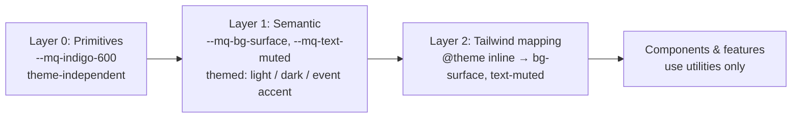

# Design System

This document defines **Marquee**, the Concourse design system: the design tokens (color, type, spacing, radii, elevation, motion, z-index), theming and density mechanics, accessibility standards, UI voice & tone, and iconography/illustration rules that every surface consumes. Marquee is shipped as code (CSS variables via Tailwind 4 `@theme` in `packages/ui`) — code is the source of truth; any Figma library mirrors this document, never the reverse. Component APIs and engineering conventions live in [40-ui-component-library.md](40-ui-component-library.md); the concrete component list lives in [15-component-inventory.md](15-component-inventory.md). All names here conform to [00-foundation.md](00-foundation.md).

---

## 1. Scope and ownership

| This doc owns | Owned elsewhere |
|---|---|
| Token names, values, and naming grammar | Component props/APIs → [40-ui-component-library.md](40-ui-component-library.md) |
| Light/dark theming and event-accent theming mechanics | Component inventory and page usage → [15-component-inventory.md](15-component-inventory.md) |
| Accessibility standards (contrast, focus, touch targets, motion) | Automated a11y test gates → [42-testing-strategy.md](42-testing-strategy.md) |
| Density modes | Page layouts and information architecture → [14-page-inventory.md](14-page-inventory.md) |
| Voice & tone for UI copy | Error code registry → [41-error-code-registry.md](41-error-code-registry.md) |
| Iconography and illustration rules | Notification copy templates → [33-notification-system.md](33-notification-system.md) |

## 2. Principles

Marquee operationalizes the product principles in [00-foundation.md](00-foundation.md) §1:

| Product principle | Design consequence |
|---|---|
| Fast is the feature | Motion never gates content. Skeletons over spinners. Durations ≤300ms for UI transitions. Optimistic UI states are first-class (see §9, §12 of [15-component-inventory.md](15-component-inventory.md) offline states). |
| Intelligence over records | Data-viz tokens and `ai` semantic color family are part of the core palette, not bolt-ons. AI-generated content is always visually labeled (§13.4). |
| One source of truth | Exactly one token layer is themable (semantic). Components never reference primitives or raw hex — lint-enforced ([40-ui-component-library.md](40-ui-component-library.md) §4). |
| Works in a concrete hall | High-contrast defaults (expo lighting is hostile), 44px touch targets on mobile surfaces, offline/sync states are designed states with dedicated tokens, not error styling. |
| Earn enterprise trust | WCAG 2.2 AA is a release gate, not an aspiration. Dark mode and density parity across all four surfaces. |

## 3. Token architecture

### 3.1 Three layers



1. **Primitives** — raw scales (color ladders, size ramps). Never themed, never used directly by components.
2. **Semantic** — role-based tokens that reference primitives. This is the only layer that changes between light/dark/density/event-accent contexts.
3. **Tailwind mapping** — a Tailwind 4 `@theme inline` block maps semantic tokens into Tailwind namespaces so utilities like `bg-surface`, `text-muted`, `rounded-md` resolve to Marquee values.

### 3.2 Naming grammar

```
--mq-<category>-<role>[-<variant>][-<state>]
```

- Prefix `mq` (Marquee) namespaces every token and makes grep trivial.
- Primitive color tokens: `--mq-<palette>-<step>` (e.g. `--mq-indigo-600`, `--mq-slate-100`).
- Semantic categories: `bg`, `text`, `border`, `icon`, `ring`, `shadow`, `radius`, `space`, `font`, `text` (size uses `--mq-type-*` to avoid collision with text color), `leading`, `duration`, `ease`, `z`, `control`.
- States: `-hover`, `-active`, `-disabled` (e.g. `--mq-bg-brand-hover`).
- Component tokens (`--mq-<component>-<property>`, e.g. `--mq-table-row-h`) are allowed only when a value must vary by density or theme and is shared by multiple components. Everything else uses semantic tokens directly.

### 3.3 Shipping mechanism

Tokens live in `packages/ui/src/styles/` and are consumed by importing one file:

```
packages/ui/src/styles/
  primitives.css    # Layer 0: palettes, size ramps
  semantic.css      # Layer 1: :root (light) + [data-theme="dark"] overrides
  density.css       # [data-density="comfortable" | "compact"] variables
  theme.css         # Layer 2: @theme inline → Tailwind namespaces
  base.css          # focus-visible ring, reduced-motion rules, font-face
  index.css         # imports all of the above, exported as "@concourse/ui/styles.css"
```

The web app's `globals.css` is exactly:

```css
@import "tailwindcss";
@import "@concourse/ui/styles.css";
```

Theme selection: `<html data-theme="light|dark" data-density="comfortable|compact">`. Default theme follows `prefers-color-scheme`; an explicit user choice (stored per user, mirrored to `localStorage` for pre-hydration paint) wins. A blocking inline script in the root layout stamps `data-theme` before first paint to prevent flash. We reject CSS-only `prefers-color-scheme` theming because users must be able to override it per device.

## 4. Color system

### 4.1 Primitive palettes

Seven 11-step ladders (steps 50–950, OKLCH-tuned for perceptual evenness). `slate` is the only neutral; there is deliberately no second gray.

| Step | slate | indigo (brand) | sky (info) | emerald (success) | amber (warning) | red (danger) | violet (ai) |
|---|---|---|---|---|---|---|---|
| 50 | `#F8FAFC` | `#EEF2FF` | `#F0F9FF` | `#ECFDF5` | `#FFFBEB` | `#FEF2F2` | `#F5F3FF` |
| 100 | `#F1F5F9` | `#E0E7FF` | `#E0F2FE` | `#D1FAE5` | `#FEF3C7` | `#FEE2E2` | `#EDE9FE` |
| 200 | `#E2E8F0` | `#C7D2FE` | `#BAE6FD` | `#A7F3D0` | `#FDE68A` | `#FECACA` | `#DDD6FE` |
| 300 | `#CBD5E1` | `#A5B4FC` | `#7DD3FC` | `#6EE7B7` | `#FCD34D` | `#FCA5A5` | `#C4B5FD` |
| 400 | `#94A3B8` | `#818CF8` | `#38BDF8` | `#34D399` | `#FBBF24` | `#F87171` | `#A78BFA` |
| 500 | `#64748B` | `#6366F1` | `#0EA5E9` | `#10B981` | `#F59E0B` | `#EF4444` | `#8B5CF6` |
| 600 | `#475569` | `#4F46E5` | `#0284C7` | `#059669` | `#D97706` | `#DC2626` | `#7C3AED` |
| 700 | `#334155` | `#4338CA` | `#0369A1` | `#047857` | `#B45309` | `#B91C1C` | `#6D28D9` |
| 800 | `#1E293B` | `#3730A3` | `#075985` | `#065F46` | `#92400E` | `#991B1B` | `#5B21B6` |
| 900 | `#0F172A` | `#312E81` | `#0C4A6E` | `#064E3B` | `#78350F` | `#7F1D1D` | `#4C1D95` |
| 950 | `#020617` | `#1E1B4B` | `#082F49` | `#022C22` | `#451A03` | `#450A0A` | `#2E1065` |

`violet` is reserved for AI provenance (labels on Expo Copilot answers, Lead Intelligence summaries, Follow-up Studio drafts, Organizer Pulse insights). It is never used decoratively, so "violet = AI-generated" stays a reliable signal.

### 4.2 Semantic tokens — surfaces, text, borders

| Token | Light | Dark | Usage |
|---|---|---|---|
| `--mq-bg-canvas` | `slate-50` | `slate-950` | Page background |
| `--mq-bg-surface` | `#FFFFFF` | `slate-900` | Cards, panels, table bodies |
| `--mq-bg-raised` | `#FFFFFF` | `slate-800` | Popovers, dropdowns, dialogs (dark elevates by surface, §8) |
| `--mq-bg-sunken` | `slate-100` | `slate-950` | Wells, input backgrounds in filled style, code blocks |
| `--mq-bg-overlay` | `rgb(2 6 23 / 0.5)` | `rgb(2 6 23 / 0.7)` | Dialog/sheet scrim |
| `--mq-bg-brand` | `indigo-600` | `indigo-500` | Primary buttons, active nav, selection |
| `--mq-bg-brand-hover` | `indigo-700` | `indigo-400` | Hover on brand fills |
| `--mq-bg-brand-subtle` | `indigo-50` | `indigo-950` | Selected rows, active tab backgrounds |
| `--mq-bg-inverse` | `slate-900` | `slate-50` | Tooltips |
| `--mq-text-primary` | `slate-900` | `slate-50` | Headings, body |
| `--mq-text-secondary` | `slate-600` | `slate-400` | Supporting copy, table headers |
| `--mq-text-muted` | `slate-500` | `slate-500` | Placeholders, timestamps, captions |
| `--mq-text-disabled` | `slate-400` | `slate-600` | Disabled control labels |
| `--mq-text-on-brand` | `#FFFFFF` | `#FFFFFF` | Text on `bg-brand` |
| `--mq-text-inverse` | `slate-50` | `slate-900` | Text on `bg-inverse` |
| `--mq-text-link` | `indigo-600` | `indigo-400` | Inline links |
| `--mq-border-default` | `slate-200` | `slate-800` | Dividers, card borders, table rules |
| `--mq-border-strong` | `slate-300` | `slate-700` | Input borders, interactive outlines |
| `--mq-ring` | `indigo-500` | `indigo-400` | Focus ring (§12.2) |

### 4.3 Semantic tokens — status and AI

Each family ships four tokens: `-subtle` (tinted background), `-text` (readable on subtle and on surface), `-solid` (filled chips/buttons, white text), `-border`.

| Family | Subtle (L / D) | Text (L / D) | Solid (L / D) | Border (L / D) |
|---|---|---|---|---|
| `success` | `emerald-50` / `emerald-950` | `emerald-700` / `emerald-300` | `emerald-600` / `emerald-500` | `emerald-200` / `emerald-800` |
| `warning` | `amber-50` / `amber-950` | `amber-700` / `amber-300` | `amber-600` / `amber-500` | `amber-200` / `amber-800` |
| `danger` | `red-50` / `red-950` | `red-700` / `red-300` | `red-600` / `red-500` | `red-200` / `red-800` |
| `info` | `sky-50` / `sky-950` | `sky-700` / `sky-300` | `sky-600` / `sky-500` | `sky-200` / `sky-800` |
| `ai` | `violet-50` / `violet-950` | `violet-700` / `violet-300` | `violet-600` / `violet-500` | `violet-200` / `violet-800` |

Token names follow the grammar: `--mq-status-success-subtle`, `--mq-status-ai-text`, etc.

### 4.4 Data visualization tokens

Charts (dashboards, Organizer Pulse, booth analytics) use a dedicated categorical set — never status colors, so "series 3 is red" never reads as "danger":

| Token | Light | Dark |
|---|---|---|
| `--mq-viz-cat-1` … `--mq-viz-cat-8` | `indigo-500`, `sky-500`, `emerald-500`, `amber-500`, `violet-500`, `#EC4899` (pink-500), `#14B8A6` (teal-500), `slate-400` | same hues, 400-step where the 500 fails 3:1 on `slate-900` |

Sequential heat ramp for `FloorHeatmap` (crowd density; rendered at 55–80% opacity over floor plans):

`--mq-viz-heat-1..6`: `sky-100`, `sky-300`, `sky-500`, `indigo-500`, `violet-600`, `violet-900`.

Match-score bands for `MatchScoreChip` (see [15-component-inventory.md](15-component-inventory.md)): `high` (score ≥ 70) → `success` family, `medium` (40–69) → `warning` family, `low` (< 40) → neutral (`slate`). Bands, not raw gradients — scores must be glanceable on a phone while walking.

### 4.5 Event accent theming (Attendee App only)

Organizers may set one `brand_color` per event ([16-database-schema.md](16-database-schema.md), `events`). On Attendee App routes (`/e/[eventSlug]/…`) only, that color re-targets exactly three tokens: `--mq-bg-brand`, `--mq-bg-brand-hover`, `--mq-text-link`. At event-publish time the API derives an accessible pair in OKLCH: lightness is clamped so white text on the accent meets 4.5:1; the hover state is L−8%. If the submitted color cannot be clamped into compliance within ΔH of 10°, the platform falls back to Marquee indigo and surfaces a warning in the Organizer Console. We reject full white-labeling in Phase 1 (fonts, radii, arbitrary palettes): it multiplies the QA matrix for marginal value — tracked in [44-future-expansion-plan.md](44-future-expansion-plan.md).

## 5. Typography

### 5.1 Typefaces

- **UI and content:** **Inter Variable**, self-hosted woff2 (latin + latin-ext subsets), `font-display: swap`. Fallback stack: `Inter Variable, ui-sans-serif, system-ui, sans-serif`. Self-hosted because external font CDNs violate our performance and privacy posture.
- **Code and machine identifiers** (badge codes, API keys, webhook payloads): **JetBrains Mono**, same hosting rules. Fallback: `ui-monospace, monospace`.
- Numeric UI (tables, StatTile, prices, counts) always sets `font-variant-numeric: tabular-nums` so columns don't shimmy as values update live.

### 5.2 Type scale

Rem-based (root 16px). Token grammar `--mq-type-<name>` / `--mq-leading-<name>`.

| Token | Size / line-height | Weight | Tracking | Usage |
|---|---|---|---|---|
| `display` | 30px / 36px | 600 | −0.02em | Page heroes (marketing-adjacent screens, empty dashboards) |
| `title-lg` | 24px / 32px | 600 | −0.01em | Page titles |
| `title` | 20px / 28px | 600 | −0.01em | Section headings, dialog titles |
| `title-sm` | 16px / 24px | 600 | 0 | Card titles, table group headers |
| `body-lg` | 16px / 24px | 400 | 0 | Attendee App reading copy, Copilot answers |
| `body` | 14px / 20px | 400 | 0 | Default UI text everywhere |
| `body-sm` | 13px / 18px | 400 | 0 | Dense table cells, secondary metadata |
| `caption` | 12px / 16px | 400 | 0 | Timestamps, helper text, chart axes |
| `overline` | 11px / 16px | 500 | +0.06em, uppercase | Eyebrow labels, column group headers |

Weights available: 400, 500 (interactive labels, buttons), 600 (headings). 700+ is not used — Inter 600 is sufficiently heavy at UI sizes; restricting weights keeps the variable-font payload lean.

The Attendee App defaults reading surfaces to `body-lg`; consoles default to `body`. Minimum rendered size anywhere is 11px.

## 6. Spacing and layout

- **Base unit: 4px.** Spacing utilities use Tailwind's default numeric scale (`--spacing: 0.25rem`); Marquee adds no parallel spacing ladder — one scale, one truth.
- Semantic aliases (density- or viewport-dependent):

| Token | Comfortable | Compact | Usage |
|---|---|---|---|
| `--mq-space-gutter` | 16px (<768px) / 24px (≥768px) | same | Page horizontal padding |
| `--mq-space-section` | 32px | 24px | Vertical rhythm between page sections |
| `--mq-card-p` | 20px | 16px | Card/panel padding |
| `--mq-gap-stack` | 12px | 8px | Default gap in form stacks and lists |

- **Containers:** Organizer Console and Platform Admin content area max-width 1440px with a 240px sidebar (64px collapsed rail). Exhibitor Portal same shell. Attendee App is a single centered column, max-width 640px on desktop; full-bleed with `--mq-space-gutter` padding on mobile.
- **Grid:** dashboards use a 12-column CSS grid, 24px gaps; StatTiles span 3 columns desktop, 6 tablet, 12 mobile.

## 7. Radii

| Token | Value | Usage |
|---|---|---|
| `--mq-radius-none` | 0 | Full-bleed media, table cells |
| `--mq-radius-xs` | 4px | Checkboxes, tags, `Kbd` |
| `--mq-radius-sm` | 6px | Buttons, inputs, selects |
| `--mq-radius-md` | 10px | Cards, popovers, dropdown menus |
| `--mq-radius-lg` | 14px | Dialogs, sheets, drawers |
| `--mq-radius-full` | 9999px | Pills (Badge), avatars, MatchScoreChip |

Nested radii rule: inner radius = outer radius − padding, floor `xs` (prevents the "thick corner" artifact on media inside cards).

## 8. Elevation

| Token | Light value | Usage |
|---|---|---|
| `--mq-shadow-0` | none | Flush content, table rows |
| `--mq-shadow-1` | `0 1px 2px rgb(2 6 23 / 0.06)` | Cards on canvas |
| `--mq-shadow-2` | `0 2px 8px rgb(2 6 23 / 0.08), 0 1px 2px rgb(2 6 23 / 0.06)` | Dropdowns, popovers, hover-lift |
| `--mq-shadow-3` | `0 8px 24px rgb(2 6 23 / 0.12), 0 2px 6px rgb(2 6 23 / 0.08)` | Dialogs, sheets |
| `--mq-shadow-4` | `0 16px 48px rgb(2 6 23 / 0.18)` | Command palette, toasts |

**Dark theme rule:** shadows barely read on dark canvases, so elevation is expressed primarily by surface step (`surface` → `raised`) plus a 1px `--mq-border-default` hairline; shadow tokens remain applied (they still separate stacked overlays) but at 60% of light-mode alpha. This is encoded in `semantic.css`, not per component.

## 9. Motion

| Token | Value | Usage |
|---|---|---|
| `--mq-duration-fast` | 75ms | Hover/active color shifts, tooltip fade-in |
| `--mq-duration-base` | 150ms | Most enter/exit fades, checkbox/switch |
| `--mq-duration-moderate` | 200ms | Dialog scale+fade, dropdown, toast slide |
| `--mq-duration-slow` | 300ms | Sheet/Drawer slide, accordion expand |
| `--mq-duration-deliberate` | 500ms | Skeleton→content crossfade, chart series intro |
| `--mq-ease-standard` | `cubic-bezier(0.2, 0, 0, 1)` | Default for everything |
| `--mq-ease-decelerate` | `cubic-bezier(0, 0, 0, 1)` | Elements entering the screen |
| `--mq-ease-accelerate` | `cubic-bezier(0.3, 0, 1, 1)` | Elements leaving the screen |

Rules:

1. **Motion never gates data.** Content renders immediately; animation is applied to the container, and any animation longer than 300ms must be interruptible.
2. Continuous animations (Skeleton pulse at 1.6s, Spinner rotation) are the only things allowed to exceed 500ms.
3. Under `prefers-reduced-motion: reduce`, `base.css` collapses all transition/animation durations to 0.01ms except pure opacity fades ≤150ms; parallax, auto-playing movement, and the heatmap's live-pulse are disabled entirely.
4. No physics/spring libraries in Phase 1 — CSS transitions cover every pattern in the inventory; a runtime animation library is payload we don't need.

## 10. Z-index scale

Literal z-index values are banned (ESLint + Stylelint); only tokens:

| Token | Value | Layer |
|---|---|---|
| `--mq-z-raised` | 1 | Sticky-adjacent cards, map pins |
| `--mq-z-sticky` | 10 | Sticky table headers, app headers, bottom tab bar |
| `--mq-z-dropdown` | 20 | Dropdown menus, comboboxes, popovers |
| `--mq-z-overlay` | 30 | Dialog/sheet scrims |
| `--mq-z-modal` | 40 | Dialog, Sheet, Drawer, Command palette content |
| `--mq-z-toast` | 50 | Toast viewport |
| `--mq-z-tooltip` | 60 | Tooltips (must beat everything) |

Portaled overlays (Radix) always render to `document.body`, so stacking contexts inside pages cannot trap them.

## 11. Density modes

Two modes, applied via `data-density` on the surface root layout:

| Variable | `comfortable` | `compact` |
|---|---|---|
| `--mq-control-h` (buttons, inputs, selects) | 40px | 32px |
| `--mq-control-px` | 14px | 10px |
| `--mq-table-row-h` | 52px | 40px |
| `--mq-table-cell-px` | 12px | 8px |
| `--mq-card-p` | 20px | 16px |
| `--mq-gap-stack` | 12px | 8px |

Assignment policy:

- **Attendee App:** always `comfortable` (touch-first; not user-switchable — walking a floor with a phone is the design target).
- **Exhibitor Portal:** `comfortable` by default; the mobile capture routes (BadgeScanner, quick-qualify) are locked `comfortable`.
- **Organizer Console / Platform Admin:** `comfortable` default; users can switch to `compact`. `DataTable` instances additionally accept a per-table density override persisted per user — operations staff live in tables and asked-for-density is table-local, not global.
- Font sizes do **not** change with density; only heights, paddings, and gaps. Changing type size across modes doubles the truncation/wrapping QA surface for no legibility gain.
- Compact mode never ships on a touch-primary route: it violates the 44px target (§12.3).

## 12. Accessibility standards

Target: **WCAG 2.2 AA** across all surfaces. These are release gates enforced per component ([40-ui-component-library.md](40-ui-component-library.md) §9) and per page ([42-testing-strategy.md](42-testing-strategy.md)).

### 12.1 Contrast
- Text ≥ 4.5:1; large text (≥24px, or ≥19px semibold) ≥ 3:1; UI component boundaries and graphical objects (chart marks, focus indicators, input borders) ≥ 3:1.
- Every pair published in §4.2–§4.4 has been chosen to meet these ratios; a token-pair contrast test runs in CI so a token edit cannot silently regress (test lives in `packages/ui`).
- Color is never the sole channel: status chips carry text or icons; chart series get distinct shapes/dashes in line charts; MatchScoreChip shows the number, not just the band color.

### 12.2 Focus
- `:focus-visible` only (no rings on mouse click): 2px solid `--mq-ring`, 2px offset, on every interactive element, including custom ones (map booths, table rows).
- Focus is never removed, only restyled. Overlay components (Radix) trap and restore focus; the trigger regains focus on close.
- Every page has a skip-link to `main`; landmark structure (`header`/`nav`/`main`/`aside`) is part of each shell composite.

### 12.3 Touch targets
- Minimum interactive target **44×44 CSS px** on touch-primary surfaces (Attendee App, Exhibitor Portal mobile routes). Where the visual affordance is smaller (e.g. a 24px icon button in a card corner), the hit area is extended with an inset pseudo-element — the visual stays small, the target doesn't.
- Compact density (pointer-first consoles) guarantees ≥ 24×24 px with ≥ 8px spacing, satisfying WCAG 2.5.8.

### 12.4 Motion, screen readers, input
- Reduced-motion behavior per §9.3.
- Toast, scan results (BadgeScanner success/failure), and live dashboard deltas announce via `aria-live` regions (`polite`; scan errors `assertive`).
- Icon-only buttons require `aria-label` (type-enforced, see [40-ui-component-library.md](40-ui-component-library.md) §5).
- All functionality is keyboard-operable; Command palette (`⌘K`) is an accelerator, never the only path.
- Forms: visible labels (placeholder is never the label), errors associated via `aria-describedby`, `autocomplete` attributes on identity fields.

## 13. Voice & tone

### 13.1 Global rules

| Rule | Do | Don't |
|---|---|---|
| Sentence case everywhere (buttons, titles, tabs) | "Export leads" | "Export Leads" / "EXPORT LEADS" |
| Verb-first buttons, ≤ 3 words | "Assign booth" | "Click here to assign a booth" |
| Concrete numbers over vague words | "3 scans pending sync" | "Some scans haven't synced" |
| No blame, no alarm theatrics | "That badge code isn't valid" | "ERROR: Invalid input!" |
| Use canonical vocabulary ([00-foundation.md](00-foundation.md) §12) | "event", "agenda session", "lead" | "show", "session", "contact" |
| Absolute times in event-local timezone | "Starts 14:30 (event time)" | "Starts in a while" |

### 13.2 Per-surface tone

| Surface | Tone | Example |
|---|---|---|
| Attendee App (Sofia) | Warm, concise concierge | "Your next stop: Booth 214 — Nordfab matches 3 of your interests." |
| Exhibitor Portal (Jamal, Elena) | Energetic but factual; never salesy at the user | "12 new leads today. 4 are scored 70+." |
| Organizer Console (Priya, Marcus) | Terse, operational | "Check-in rate 68% — 412 badges unclaimed." |
| Platform Admin (Alex) | Neutral, technical, exact | "Webhook delivery failed 3× — next retry 12:04:31 UTC." |

### 13.3 Errors and empty states
- Error pattern: **what happened + how to recover**, in that order. "Couldn't sync 3 leads — they're saved on this device and will retry when you're back online." Machine codes from [41-error-code-registry.md](41-error-code-registry.md) appear in a collapsed details affordance, never in the headline.
- Empty states always offer the next action ("No leads yet — scan your first badge") and use an illustration (§14.3), not a bare wall of gray.
- Offline is a status, not an error: neutral/informational styling (`info` family or neutral), never `danger`.

### 13.4 AI content voice
- Every AI-generated artifact (Copilot answer, lead summary, follow-up draft, Pulse insight) carries the `AiContentBadge` (violet family) — no exceptions, including exports.
- Conversational surfaces (Expo Copilot, Organizer Pulse chat) may use first person ("I found 12 exhibitors…"). Generated artifacts (summaries, drafts, insights) are voiced neutrally and never in first person — a summary is a document, not a speaker.
- Copilot answers show citations inline (`CitationChip`); an uncited claim is a bug ([22-rag-architecture.md](22-rag-architecture.md)).
- AI copy never overstates certainty: match reasons say "matches your interest in industrial IoT", not "perfect for you".

## 14. Iconography and illustration

### 14.1 Icon set
- **Lucide** (`lucide-react`) is the single icon set. Sizes: **16** (inline with `body`/`body-sm`), **20** (buttons, nav, default), **24** (page headers, tab bar, empty states). `absoluteStrokeWidth` with 2px stroke at all sizes for uniform weight.
- Icon color inherits `currentColor`; use text tokens, never palette primitives.
- Decorative icons get `aria-hidden`; meaningful ones get labels via adjacent text or `aria-label`.

### 14.2 Custom domain icons
Concepts Lucide lacks (booth, badge-scan, floor-plan, lead-pipeline) are drawn in-house on a 24px grid, 2px stroke, matching Lucide's optical style, and shipped from `packages/ui/src/icons/` as React components with the same size/stroke props. New custom icons require design review — the bar is "Lucide genuinely has no fit", checked against the Lucide catalog first.

### 14.3 Illustration
- Spot illustrations (empty states, onboarding, upgrade prompts) are simple geometric compositions built **only from semantic tokens** (so they theme automatically), shipped as React SVG components in `packages/ui/src/illustrations/`.
- Max 3 hues per illustration: neutral structure + brand accent + one status/ai accent when meaningful.
- No external illustration libraries, no raster illustrations, no photography in product UI (photos appear only as user-supplied content: logos, headshots, product images — always in `Avatar`/media frames with defined aspect ratios and `slate-100`/`slate-800` letterboxing).

## 15. Governance

- Token additions/changes land as PRs touching `packages/ui/src/styles/` **and** this document in the same change; CI runs the contrast test suite and a full Chromatic snapshot run ([40-ui-component-library.md](40-ui-component-library.md) §7).
- New semantic tokens require a written role justification in the PR description; new primitives require evidence that no existing step works. The default answer to "can we add a color?" is no.
- Marquee versioning follows the component library policy ([40-ui-component-library.md](40-ui-component-library.md) §8) — tokens are part of the same workspace package and move atomically with components.
