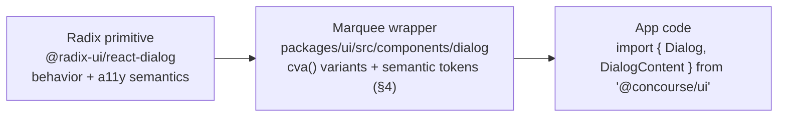
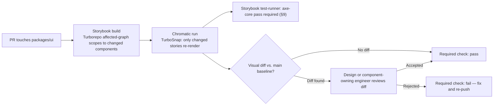
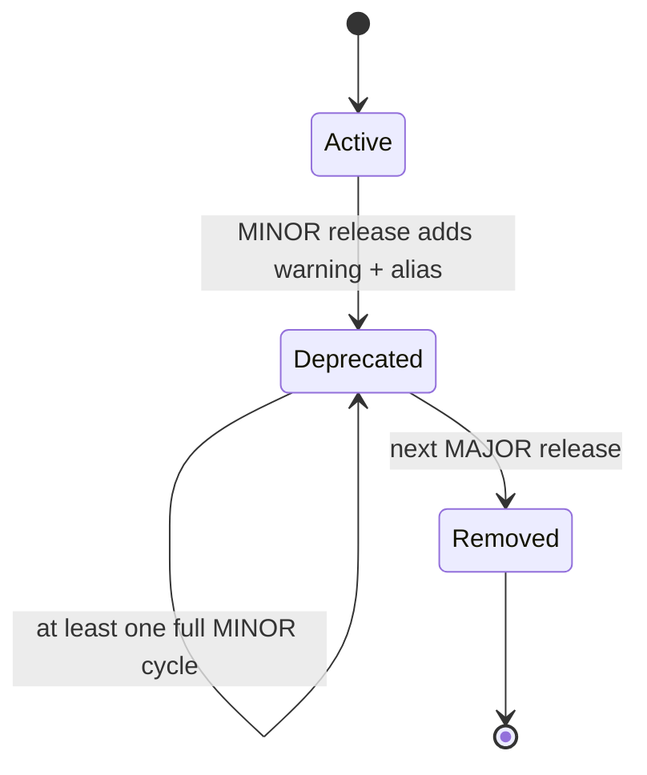

# UI Component Library

This document owns **how** Concourse's UI components are built, reviewed, and versioned: the `packages/ui` package architecture, prop-naming and API conventions (controlled vs. uncontrolled, variant/size/tone axes), the pattern for wrapping Radix UI primitives, accessibility-prop enforcement, the Storybook/Chromatic visual-regression gate, and the component versioning policy. It does not own token names or values ([39-design-system.md](39-design-system.md)) or the concrete component list, purpose, usage sites, and state behavior ([15-component-inventory.md](15-component-inventory.md)). All names conform to [00-foundation.md](00-foundation.md); this document introduces no new persona, product name, or entity.

---

## 1. Scope and ownership

| This doc owns | Owned elsewhere |
|---|---|
| `packages/ui` package architecture and the vendored-not-dependency model | Tech stack choices (Tailwind 4, Radix UI, React 19) — [00-foundation.md](00-foundation.md) §6 |
| Prop-naming and API conventions (controlled/uncontrolled, `variant`/`size`/`tone`) | Design tokens consumed by those props — [39-design-system.md](39-design-system.md) |
| The pattern for wrapping Radix UI primitives | The concrete component list, purpose, and usage sites — [15-component-inventory.md](15-component-inventory.md) |
| Accessibility-prop enforcement (e.g. `aria-label` type-enforcement) | Accessibility standards themselves (contrast, focus, touch targets) — [39-design-system.md](39-design-system.md) §12 |
| The Storybook/Chromatic visual-regression CI gate for `packages/ui` | Page-level and cross-component test strategy, CI test matrix — [42-testing-strategy.md](42-testing-strategy.md) |
| Component versioning, deprecation, and migration policy | Monorepo package boundaries and build graph — [37-monorepo-and-folder-structure.md](37-monorepo-and-folder-structure.md) |
| Contribution workflow for new/changed components | Five-state taxonomy definitions consumed by component states — [13-application-layout.md](13-application-layout.md) §5 |

## 2. Package architecture: vendored, not dependency

Per [00-foundation.md](00-foundation.md) §6, styling is "Tailwind CSS 4 + Radix UI primitives — Owned component library in `packages/ui` (shadcn-style: vendored, not dependency)." Concretely:

- **Radix UI primitives are real npm dependencies** (`@radix-ui/react-dialog`, `@radix-ui/react-select`, etc.) — they supply unstyled behavior and accessibility semantics (focus trapping, roving tabindex, portal management) that would be wasteful and risky to reimplement.
- **The Marquee wrapper components are not a black-box npm UI kit.** Their source lives in-repo, in `packages/ui/src/components/`, fully owned and editable by this team — the same "own the code" posture `shadcn/ui` popularized, except fixed once as a single workspace package rather than re-copy-pasted per consuming app. There is exactly one copy, consumed by every surface (foundation principle 3, "one source of truth").
- Consuming apps (the single Next.js app, per foundation §5) import from `@concourse/ui`, a workspace package (pnpm workspaces, foundation §6) — never from `@radix-ui/*` directly outside `packages/ui`. A component that needs new Radix behavior gets a wrapper added to `packages/ui`; it is never reached for ad hoc in a page file.

### 2.1 Directory layout

```
packages/ui/
  src/
    components/
      button/
        button.tsx
        button.stories.tsx
        button.test.tsx
        index.ts
      dialog/
        dialog.tsx
        dialog.stories.tsx
        dialog.test.tsx
        index.ts
      data-table/
        data-table.tsx
        data-table.stories.tsx
        data-table.test.tsx
        index.ts
      ...                      # one folder per component in 15-component-inventory.md
    icons/                     # custom domain icons (39 §14.2)
    illustrations/             # spot illustrations (39 §14.3)
    styles/                    # token layers — owned by 39-design-system.md
    lib/
      cn.ts                    # clsx + tailwind-merge className composer
      variants.ts              # shared cva() variant-map helpers
      a11y.ts                  # shared a11y test/assert helpers (§9)
    index.ts                   # public package entry — re-exports every component
  package.json                 # name: "@concourse/ui", private workspace package
```

Concrete repo-tree boundaries and how `packages/ui` fits the broader dependency graph are [37-monorepo-and-folder-structure.md](37-monorepo-and-folder-structure.md)'s domain; this section states only the internal shape of the package itself.

## 3. Anatomy of a component module

Every entry in [15-component-inventory.md](15-component-inventory.md) becomes exactly one folder under `src/components/` with four co-located files: the implementation, its Storybook stories (§7), its unit/interaction tests (§10), and a barrel `index.ts` that re-exports only the public surface (internal sub-parts stay unexported unless the compound-component pattern in §6 requires them). This co-location is deliberate: a reviewer opens one folder and sees the full contract of a component — API, visual states, and behavioral tests — rather than hunting across a stories/ and tests/ tree.

A component module always exports:

1. The component(s) themselves (a flat set of named exports — see §6 for compound components).
2. A `<Name>Props` TypeScript type (never `I<Name>Props` — foundation §11's no-`I`-prefix rule applies to component props like every other interface).
3. Nothing else. Internal variant maps (`cva` configs), sub-parts used only for composition, and style helpers stay module-private.

## 4. Token consumption rules (styling implementation)

[39-design-system.md](39-design-system.md) §2 states: "Components never reference primitives or raw hex — lint-enforced (40-ui-component-library.md §4)." This section is that enforcement.

- Components in `packages/ui/src/components/**` may only use **semantic** Tailwind utilities produced by the `@theme inline` mapping (39 §3.1) — e.g. `bg-surface`, `text-muted`, `border-default`, `rounded-md`. They may never use a **primitive** utility (`bg-indigo-600`, `text-slate-500`) or a raw hex/rgb/hsl literal in a `className`, inline `style`, or `cva()` variant map.
- Enforcement is a custom ESLint rule (`@concourse/eslint-plugin-ui`, scoped to `packages/ui/src/components/**`) that flags:
  1. Any Tailwind class matching a primitive-palette pattern (`/^(bg|text|border|ring|fill|stroke)-(slate|indigo|sky|emerald|amber|red|violet)-\d{2,3}$/`).
  2. Any hex/`rgb()`/`hsl()` string literal inside a `className` expression, a `style` object, or a `cva()` config.
- This rule runs in `pnpm lint` (CI, per [00-foundation.md](00-foundation.md) §6 GitHub Actions) and is a required check on any PR touching `packages/ui`.
- **Exceptions** are narrow and explicit: `packages/ui/src/styles/primitives.css` itself (the one place primitives are *defined*), and decorative story-only fixtures marked with a `// eslint-disable-next-line @concourse/ui/tokens-only -- <reason>` comment. A bare disable with no reason fails review — the same "written justification" discipline 39 §15 applies to adding a new token applies symmetrically to bypassing token discipline.
- Illustrations and custom icons (39 §14.2–§14.3) are exempt from the *palette* check (they intentionally reference semantic tokens for theming) but not the raw-hex check — an SVG with a hardcoded fill fails the same rule.

## 5. Prop-naming, controlled/uncontrolled, and accessibility-prop conventions

This is the API-surface contract every component in [15-component-inventory.md](15-component-inventory.md) must satisfy, and is the section [39-design-system.md](39-design-system.md) §12.4 points to for "icon-only buttons require `aria-label` (type-enforced)."

### 5.1 Naming axes

| Prop | Axis | Convention | Example |
|---|---|---|---|
| `variant` | Visual style | Enum, kebab-case values, orthogonal to color | `variant="solid" \| "outline" \| "ghost" \| "subtle"` |
| `size` | Dimensional scale | Enum `"sm" \| "md" \| "lg"`; `md` resolves to whichever control-height token the ambient density mode provides (39 §11) — `size` is a per-instance relative step, density is the global baseline; the two compose rather than compete | `<Button size="sm">` inside a table row toolbar |
| `tone` | Semantic color family | Enum matching 39 §4.3's status families exactly: `"success" \| "warning" \| "danger" \| "info" \| "ai" \| "neutral"` — kept as its own prop, never folded into `variant`, so `variant` and `tone` combine freely (e.g. `<Badge variant="subtle" tone="success">`) | `<Badge tone="ai">AI-generated</Badge>` |
| Boolean flags | State | Plain adjective, no `is`/`has` prefix — matches native HTML attribute conventions and Radix's own props | `disabled`, `required`, `loading`, `readOnly` |
| Event handlers | Callback | `on<Event>`, camelCase, matches foundation §11 | `onSelect`, `onOpenChange`, `onRetry` |

### 5.2 Controlled vs. uncontrolled

Every stateful component mirrors the Radix convention it wraps (or, for non-Radix components, adopts it by analogy) rather than inventing a parallel one:

| Pattern | Uncontrolled | Controlled |
|---|---|---|
| Disclosure (Dialog, Popover, DropdownMenu, Sheet, Drawer, AccordionItem) | `defaultOpen` | `open` + `onOpenChange` |
| Value-bearing (Tabs, Select, RadioGroup, ToggleGroup) | `defaultValue` | `value` + `onValueChange` |
| Free text / form inputs | `defaultValue` (native semantics) | `value` + `onChange` |

A component **must** support both modes identically to how its underlying Radix primitive does — a Marquee wrapper never narrows a Radix primitive's controllability. Purely presentational components (`Badge`, `Kbd`, `Avatar`, per [15-component-inventory.md](15-component-inventory.md) §6.6) have no controlled/uncontrolled distinction; they take data props only.

### 5.3 `asChild` passthrough

Every Radix-backed wrapper forwards `asChild` unmodified. This is the mechanism [15-component-inventory.md](15-component-inventory.md)'s composed components rely on (e.g. `BookMeetingButton` rendering as a `Button` that is itself a `Link`) without either component needing to know about the other's DOM output.

### 5.4 Accessibility-prop enforcement: `aria-label` on icon-only components

Any component that can render icon-only (no visible text child) must make an accessible name **structurally impossible to omit** — enforced at compile time via a discriminated union, not a runtime warning:

```ts
// packages/ui/src/components/button/button.tsx
interface BaseButtonProps
  extends Omit<React.ButtonHTMLAttributes<HTMLButtonElement>, "children"> {
  variant?: "solid" | "outline" | "ghost" | "subtle";
  size?: "sm" | "md" | "lg";
  tone?: "success" | "warning" | "danger" | "info" | "ai" | "neutral";
  loading?: boolean;
}

interface LabeledButtonProps extends BaseButtonProps {
  /** Visible text content — satisfies the accessible name on its own. */
  children: React.ReactNode;
  icon?: LucideIcon;
  "aria-label"?: string;
}

interface IconOnlyButtonProps extends BaseButtonProps {
  /** No visible text — the icon alone is the entire affordance. */
  children?: never;
  icon: LucideIcon;
  /** Required: this is the only accessible name the control has. */
  "aria-label": string;
}

export type ButtonProps = LabeledButtonProps | IconOnlyButtonProps;
```

Omitting `children` collapses `ButtonProps` onto the `IconOnlyButtonProps` branch, at which point TypeScript makes `aria-label` a required key — the same discriminated-union pattern used for any component with an "icon-only" affordance (`IconButton`, table row-action triggers, `MapToggle`, `RetryButton`'s icon-only compact variant). This is verified twice, per §9: at compile time by the type, and at CI time by a rendered-output test asserting an accessible name resolves for every icon-only story.

## 6. Wrapping Radix UI primitives and compound components

### 6.1 Which primitives get wrapped

Every interactive or overlay Radix primitive consumed anywhere in [15-component-inventory.md](15-component-inventory.md) — `Dialog`, `AlertDialog`, `Popover`, `DropdownMenu`, `Select`, `Tabs`, `Accordion`, `Tooltip`, `Toast`, `RadioGroup`, `Checkbox`, `Switch`, `Slider`, `ScrollArea` — gets a Marquee wrapper in `packages/ui`. There is no "consume Radix unstyled and inline Tailwind classes at the call site" escape hatch: every call site imports from `@concourse/ui`, never `@radix-ui/*` (§2). Components with no Radix analog (`DataTable`, `BadgeScanner`, `FloorPlanCanvas`, `MapCanvas`, chart components) follow the same module anatomy (§3) and API conventions (§5) built directly on HTML/SVG/Canvas.

### 6.2 Wrapper pattern

```tsx
// packages/ui/src/components/dialog/dialog.tsx
import * as DialogPrimitive from "@radix-ui/react-dialog";
import { cva } from "class-variance-authority";
import { cn } from "../../lib/cn";

export const Dialog = DialogPrimitive.Root;
export const DialogTrigger = DialogPrimitive.Trigger;
export const DialogClose = DialogPrimitive.Close;

const contentVariants = cva(
  "bg-raised rounded-lg shadow-3 z-modal fixed left-1/2 top-1/2 -translate-x-1/2 -translate-y-1/2",
  { variants: { size: { sm: "max-w-sm", md: "max-w-md", lg: "max-w-lg" } },
    defaultVariants: { size: "md" } },
);

export interface DialogContentProps
  extends React.ComponentPropsWithoutRef<typeof DialogPrimitive.Content> {
  size?: "sm" | "md" | "lg";
}

export const DialogContent = React.forwardRef<HTMLDivElement, DialogContentProps>(
  ({ className, size, ...props }, ref) => (
    <DialogPrimitive.Portal>
      <DialogPrimitive.Overlay className="bg-overlay z-overlay fixed inset-0" />
      <DialogPrimitive.Content
        ref={ref}
        className={cn(contentVariants({ size }), className)}
        {...props}
      />
    </DialogPrimitive.Portal>
  ),
);
DialogContent.displayName = "DialogContent";
```



Rules distilled from the pattern above:

1. **Naming stays Radix-shaped.** The wrapper keeps the primitive's own part suffix (`Trigger`, `Content`, `Overlay`, `Item`) so familiarity with Radix's docs transfers directly — Marquee never invents a parallel vocabulary for the same concept.
2. **Flat exports, not a namespaced object.** `DialogContent`, not `Dialog.Content` — matches the shadcn convention foundation §6 points to and keeps tree-shaking and import ergonomics simple.
3. **Variant maps use `cva()`** exclusively (never inline ternaries) so every component's variant surface is introspectable and testable the same way.
4. **`ref` is always forwarded.** Every wrapper is `forwardRef`; this is what lets `asChild` (§5.3) and portal-based focus management keep working through the wrapper.
5. **Styling is added, behavior is inherited.** A Marquee wrapper never re-implements what Radix already does (focus trap, `aria-*` wiring, roving tabindex) — the wrapper's only job is Tailwind classes via semantic tokens (§4) plus Marquee-specific convenience props (`size`, `tone`).

## 7. Storybook and Chromatic visual-regression gate

[39-design-system.md](39-design-system.md) §15 requires "a full Chromatic snapshot run" on token PRs — this section is the gate that also covers every component PR.

- **Every exported component ships a co-located `.stories.tsx`** (§3). A story file is not optional scaffolding; a component without stories cannot pass CI (§9).
- **Story matrix.** At minimum, a story file covers:
  - The default render plus one story per `variant` × representative `tone`.
  - One story per applicable state in the five-state taxonomy ([13-application-layout.md](13-application-layout.md) §5; shorthand `L`/`E`/`Er`/`Of`/`P`/`P→Locked` as used in [15-component-inventory.md](15-component-inventory.md) §2.2) — a component whose inventory row lists `L: skeleton row` etc. must have a story rendering that exact state.
  - Both themes (light/dark, via the Storybook theme-switch toolbar addon) and both density modes (comfortable/compact) where the component's inventory entry says density-sensitive.
- **CI pipeline:**



- Chromatic and the axe-core check are both **required GitHub status checks** (00 §6 GitHub Actions) on any PR touching `packages/ui` — a PR cannot merge with an unreviewed visual diff or an a11y regression.
- Baseline is always `main`; Chromatic's review UI link is posted back to the PR automatically. Auto-accept-on-green is disabled — a human always looks at a real visual diff before it becomes the new baseline.
- Interaction (play-function) tests inside stories are reused by both Chromatic (visual state after interaction) and the plain Storybook test-runner (behavioral assertion) — one fixture, two kinds of check, per §10.

## 8. Component versioning policy

[39-design-system.md](39-design-system.md) §15 states "Marquee versioning follows the component library policy" — this is that policy. `@concourse/ui` is a single private workspace package (pnpm, foundation §6); tokens (39) and components ship from the same package and move atomically under one version number, because a token change and the component that consumes it are never independently deployable.

- **Tooling:** [Changesets](https://github.com/changesets/changesets) — the standard release-automation tool for pnpm/Turborepo monorepos (00 §6). Every PR touching `packages/ui` requires a changeset file describing the change and its bump level; CI blocks merge if one is missing.
- **SemVer applied to `@concourse/ui`:**

| Bump | Triggers | Example |
|---|---|---|
| **MAJOR** | Prop removed or renamed without a back-compat alias · component removed · default `variant`/`tone` changed · DOM structure change that breaks a consumer's CSS override · semantic token renamed/removed (39 §3.2 grammar change) | Removing `Dialog`'s deprecated `isOpen` alias in favor of `open` only |
| **MINOR** | New component added · new optional prop or `variant`/`size`/`tone` value added · new semantic token added · a deprecation warning introduced (§12) | Adding a `tone="ai"` option to `Badge` |
| **PATCH** | Bug fix with no API change · visual fix that doesn't alter any documented variant's intent · a11y fix (e.g. missing `aria-live`) · dependency bump inside `packages/ui` | Fixing `Tooltip`'s focus-return on `Escape` |

- A token **value** change (e.g. adjusting `--mq-bg-brand`'s hex) is a MINOR — it's a visual refinement with no API break. A token **name** removal/rename is MAJOR, because it can break any component still referencing the old CSS variable — which the lint rule in §4 should already prevent outside `packages/ui`, but the version bump accounts for the possibility regardless.
- **Changelog:** Changesets generates `CHANGELOG.md` and a GitHub Release per version; release notes group by bump level and link the originating PR.
- **Pre-release channel:** a `next` dist-tag (Changesets "pre" mode) is used when a MAJOR needs to bake across several dependent app PRs before general availability — this is the only case `packages/ui` and the consuming app version out of lockstep, and only temporarily.
- Deprecation mechanics (the required window before a MAJOR can remove something) are §12's domain — this section defines the bump semantics, not the sunset process.

## 9. Accessibility engineering and per-component release gates

[39-design-system.md](39-design-system.md) §12 states accessibility standards "are release gates enforced per component (40-ui-component-library.md §9) and per page ([42-testing-strategy.md](42-testing-strategy.md))." This section is the per-component half of that split — [42-testing-strategy.md](42-testing-strategy.md) owns the page-level and cross-surface a11y test matrix; this section owns what a single component must prove before it can ship.

A component PR cannot merge into `main` without all of:

1. **Automated axe-core pass**, zero violations, run by the Storybook test-runner against every story (§7) — this is what catches missing roles, invalid `aria-*` combinations, and contrast regressions on the component's own default styling.
2. **Accessible-name test for icon-only variants.** For every component that has an icon-only branch (§5.4), a rendered-output test asserts `getByRole(..., { name: expect.any(String) })` resolves — i.e. the type-level enforcement in §5.4 is backed by a runtime check, the same defense-in-depth discipline the platform applies to tenant isolation ([00-foundation.md](00-foundation.md) §8).
3. **Focus-visible correctness.** Any new interactive element uses `--mq-ring` (39 §12.2) via the semantic token layer (§4) — never a component-local `outline` or `box-shadow` value — verified by the token-consumption lint rule, not a separate check.
4. **Touch-target guarantee.** Any component usable on a touch-primary surface ([15-component-inventory.md](15-component-inventory.md)'s Attendee App / Exhibitor Portal mobile routes) either renders at ≥44×44px or ships the inset-pseudo-element hit-area extension (39 §12.3). A shared test helper, `expectMinimumHitArea(element, 44)`, asserts this for every component flagged touch-primary in its story metadata.
5. **Reduced-motion compliance.** Any component with a CSS animation or transition (`Skeleton`, `Toast`, `Accordion`, `Sheet`/`Drawer`, `FloorHeatmap`'s live-pulse) is checked with a shared helper, `expectRespectsReducedMotion(Component)`, that renders under an emulated `prefers-reduced-motion: reduce` and asserts the durations collapse per 39 §9.3.
6. **A completed keyboard-walkthrough note in the PR description** for any newly interactive component — not automatable, so it's a human checklist item enforced by the PR template rather than CI, but still a hard gate: reviewers block merge on its absence.

Where a component's inventory entry names a specific `aria-live` requirement (e.g. `BadgeScanner`'s `aria-live="assertive"` invalid-scan toast, per [15-component-inventory.md](15-component-inventory.md) §7.1), that requirement is encoded as a story + axe-adjacent assertion in the component's own test file — the general standard lives in 39 §12.4, its enforcement for that one component lives here.

## 10. Testing conventions per component

- **Unit and behavioral tests:** Vitest + React Testing Library, co-located as `<name>.test.tsx` (§3). These test props, controlled/uncontrolled behavior (§5.2), and the accessible-name assertions in §9 — logic, not pixels.
- **Interaction tests:** written as Storybook play functions inside the relevant story, not as a separate test file — one fixture serves both the Storybook test-runner (behavior) and Chromatic (post-interaction visual state, §7). Duplicating an interaction as both a play function and a hand-written RTL test is redundant and is flagged in review.
- **No component-level snapshot tests.** Markup snapshots are brittle under RSC/Server Component boundaries and duplicate what Chromatic already does better (an actual rendered visual diff beats a serialized DOM string). Chromatic is the system's only "does this look right" check.
- **Cross-component and page-level E2E** (Playwright, multi-component flows, real API integration) is explicitly [42-testing-strategy.md](42-testing-strategy.md)'s domain — this document stops at the boundary of a single component's own test file.

## 11. Contribution workflow

| Change type | Requirement before merge |
|---|---|
| New component added to `packages/ui` | Fits one of the five categories in [15-component-inventory.md](15-component-inventory.md) §2.1 (or an RFC justifying a sixth); a design-system-owning engineer sign-off; stories + tests + changeset (§7, §10, §8) all present |
| New prop, `variant`, `size`, or `tone` value on an existing component | Changeset at MINOR (§8); updated stories covering the new value |
| Breaking API change (prop removed/renamed, default changed) | An RFC (GitHub issue, using the design-system RFC template) open for visibility before the PR; deprecation path per §12 if a mechanical migration is possible; changeset at MAJOR |
| New Radix primitive introduced for the first time | RFC — a new primitive dependency is a standing commitment (bundle size, upgrade surface) that should be visible before it lands, not discovered in a diff |
| Bug fix, visual polish, a11y fix with no API change | Standard PR review; changeset at PATCH |

The **new-component bar** deliberately excludes one-off, single-use-site UI: per [15-component-inventory.md](15-component-inventory.md) §2.1's own build-order logic, a component earns a place in `packages/ui` by being reused across ≥2 usage sites or by crossing a surface boundary (Console/Portal/Attendee/Admin) — everything else stays local to the page that needs it until a second consumer appears.

## 12. Deprecation and migration workflow



1. **Mark.** A deprecated prop, variant, or component gets a `@deprecated` JSDoc tag (surfaced in editor tooltips), a `console.warn` in development builds only (never production — no runtime cost or user-visible noise), and a "Deprecated" badge on its Storybook story.
2. **Alias, don't break.** Wherever mechanically possible, the deprecated shape keeps working via an internal alias to the new shape for the entire deprecation window — consumers see a warning, not a compile error, until the MAJOR that removes it.
3. **Window.** Minimum one full MINOR release cycle between introducing a deprecation warning and shipping the MAJOR that removes it — enough time for every consuming PR in the single Next.js app (foundation §5) to migrate incrementally rather than in one blocking change.
4. **Codemod for mechanical renames.** Any deprecation that is a pure rename (prop A → prop B with no semantic change) ships a small `ts-morph` or `jsscodeshift` codemod script alongside the deprecation PR, referenced from the changeset — the fix should be "run this script," not "manually touch every call site."
5. **Removal.** Only happens in a MAJOR (§8), with the changeset entry linking back to the original deprecation PR and codemod for anyone reading the changelog later.

## 13. Open questions

Two items sit at this document's boundary but are not yet decided, per foundation §13's rule that every open question resolves to a decision or an explicit assignment:

- **React Native component parity.** Foundation D3 designs the API and typed client so native apps can be added later without API changes, but says nothing about whether `packages/ui`'s React components (Tailwind/DOM-based) get a parallel React Native implementation, a shared headless-logic layer, or a separate native design-system effort entirely. Deferred to [44-future-expansion-plan.md](44-future-expansion-plan.md) — it only becomes decidable once the native milestone itself is scheduled.
- **Public/external consumption of `@concourse/ui`.** Today it is a private workspace package with exactly one consumer (the single Next.js app). Whether it should ever be published externally (e.g. to support a future embeddable widget SDK for exhibitor microsites) is out of scope until such a product surface exists. Deferred to [44-future-expansion-plan.md](44-future-expansion-plan.md).

No other open question remains in this document's scope — every convention, gate, and policy above is a stated decision.

## 14. Ownership and Cross-References

| Concern | Owner |
|---|---|
| `packages/ui` architecture, prop/API conventions, Radix wrapping pattern, versioning and deprecation policy, Storybook/Chromatic gate | **This document** |
| Design tokens: names, values, theming mechanics, density, motion, voice & tone, iconography rules | [39-design-system.md](39-design-system.md) |
| Canonical component names, purpose, usage sites, conceptual props, per-component state behavior | [15-component-inventory.md](15-component-inventory.md) |
| Five-state taxonomy definitions and shell composition rules that component states implement | [13-application-layout.md](13-application-layout.md) |
| Page-level and cross-surface test strategy, CI test matrix, fixtures | [42-testing-strategy.md](42-testing-strategy.md) |
| Monorepo package boundaries, build/dependency graph | [37-monorepo-and-folder-structure.md](37-monorepo-and-folder-structure.md) |
| Deferred native (React Native) and external-consumption questions | [44-future-expansion-plan.md](44-future-expansion-plan.md) |
| Canonical names, personas, tech stack, glossary that every convention above must conform to | [00-foundation.md](00-foundation.md) |
