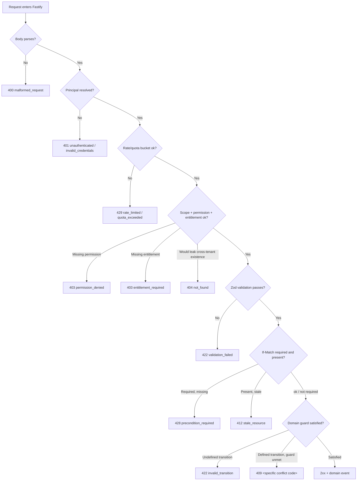
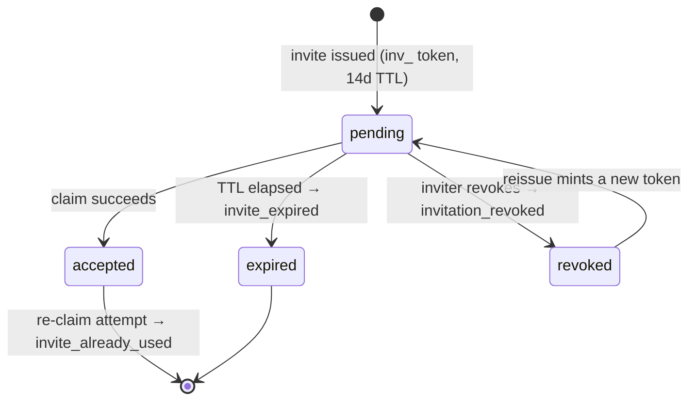

# 41 — Error Code Registry

This document owns the complete catalog of machine-readable `code` values Concourse's API returns, each pinned to exactly one HTTP status, a plain-English trigger condition, and the client behavior expected in response. [18-api-architecture.md](18-api-architecture.md) §3.5 owns the wire *shape* (RFC 9457 `application/problem+json`) and forward-references this document for the registry itself — this document does not restate that shape, only the values that fill it. Every other document that names a `code` in backticks (principally [09-functional-requirements.md](09-functional-requirements.md), [19-authentication-strategy.md](19-authentication-strategy.md), [26-file-storage.md](26-file-storage.md), [33-notification-system.md](33-notification-system.md), and [36-billing-and-payments-architecture.md](36-billing-and-payments-architecture.md)) is consolidated here; where those documents diverge on the exact status or shape for the same underlying condition, §14 records the resolving decision so this registry has exactly one answer, never two. This document does not own: the RFC 9457 envelope fields themselves, pagination/idempotency/concurrency *mechanics* (18 §3.2/3.6/3.7 — this doc only fixes the codes those mechanics emit), or per-feature business logic ([09-functional-requirements.md](09-functional-requirements.md) — this doc only fixes the codes that logic emits).

**Binding contract:** clients branch on `code` — a stable string — and never on `title` or `detail`, which are human copy and may be reworded or localized without notice. This rule is stated once, here, and is binding on every client (`packages/api-client`, the web app, and any enterprise integrator against the public API) exactly as [18-api-architecture.md](18-api-architecture.md) §3.5 already requires.

## 1. Scope & How to Read This Registry

Every row below has five fields: **Code** (the wire value), **HTTP Status**, **Title** (the human headline `problem+json.title` carries), **When It Fires** (the precondition/failure), and **Client Guidance** (what a well-behaved client does next). Codes are grouped by the module boundaries [09-functional-requirements.md](09-functional-requirements.md) §2 already established, so a code introduced by `FR-LEAD-004` lives in the Lead Capture table, etc. A handful of codes are not live HTTP rejections at all — they are terminal states on an async resource (a `kb_sources` ingestion, a webhook delivery) that 09 still names as a `code` for traceability. These are marked **(async)** in the HTTP Status column with the status that applies only if a client-initiated retry re-fails synchronously; §3 explains the convention in full.

## 2. The Problem Document Contract (recap)

Per [18-api-architecture.md](18-api-architecture.md) §3.5, every non-2xx response is:

```json
{
  "type": "https://docs.concourse.app/errors/entitlement_required",
  "title": "Entitlement required",
  "status": 403,
  "code": "entitlement_required",
  "detail": "Lead Intelligence requires the growth tier or higher for this event.",
  "requestId": "req_01J9X6M3K2N4P5Q6R7S8T9U0V1",
  "errors": [
    { "field": "entitlement", "code": "lead_intelligence", "message": "Missing entitlement key." }
  ]
}
```

- `errors[]` is populated only on `422 validation_failed` (one entry per failing Zod field) and, by convention established here, on `403 entitlement_required`/`permission_denied` (one entry naming the missing entitlement/permission key, per [09-functional-requirements.md](09-functional-requirements.md) §2's universal-preconditions note) — every other code carries an empty or absent `errors[]`.
- Bulk/batch endpoints (CSV imports — FR-ONBOARD-001, FR-AGENDA-001) are the one documented exception to "one problem body per response": a batch with per-row failures returns `200` with a body-level `quarantine` array, **not** a single `422`, because most rows typically succeed and a whole-batch rejection would be actively wrong:

```json
{
  "imported": 42,
  "quarantine": [
    { "row": 7, "code": "validation_failed", "message": "email: invalid format" },
    { "row": 19, "code": "duplicate_resource", "message": "booth number already assigned" }
  ]
}
```

## 3. HTTP Status Conventions

| Status | Meaning as used in this registry |
|---|---|
| `400` | The request itself is malformed at the transport/grammar level (bad JSON, unknown filter/sort field, missing a required header) — never a business-rule failure. |
| `401` | No valid principal was established at all, or a credential-verification attempt failed. |
| `402` | Payment was required and declined/absent for the action attempted. |
| `403` | A principal exists but is denied — by role, entitlement, consent gate, or a security policy override (e.g., Require SSO). |
| `404` | The addressed resource does not exist, or the caller must not learn that it does (tenant-isolation default, [00-foundation.md](00-foundation.md) §8). |
| `409` | The request is well-formed and the actor is authorized, but current server-side state conflicts with it — a concurrent write, a uniqueness violation, or a guard on a *defined* transition/action isn't currently satisfied. |
| `410` | A single-use token (magic link, invite, password reset) is permanently unusable — expired, already consumed, or revoked. Distinct from `404`: the token's prior existence is not in question, only its continued validity. |
| `412` | An `If-Match` precondition failed against the resource's current `updated_at`-derived ETag ([18-api-architecture.md](18-api-architecture.md) §3.7). |
| `422` | The request is well-formed but semantically invalid: failed field validation, or an attempted state-machine transition that is not drawn in its diagram at all ([09-functional-requirements.md](09-functional-requirements.md) §3). |
| `428` | `If-Match` was required on a contended resource and the client omitted it. |
| `429` | A rate or quota bucket was exhausted. |
| `502` | An upstream dependency this request handed off to (SES, a connector's third-party API, a webhook target) failed. |
| `503` | A Concourse-owned service dependency (AI gateway, embedding pipeline, enrichment provider) is temporarily unavailable; the deterministic fallback for that feature is authoritative ([09-functional-requirements.md](09-functional-requirements.md) §5, "AI degradation"). |

**Two conventions this registry fixes, binding on every implementation:**

- **Guard-failure vs. illegal transition.** A §3-diagram transition attempted from a state that doesn't draw an arrow to it at all is `422 invalid_transition` (the action is nonsensical). A transition or action that *is* modeled but whose additional guard condition (a checklist, a zero-registrations check, an occupied slot) isn't currently met is `409` under its own specific code (`checklist_incomplete`, `unpublish_blocked`, `booth_already_assigned`, etc.) — this keeps "you can never do this" distinct from "you can't do this *right now*," which the two different client recovery paths (disable the control vs. show a reason and a retry) require.
- **Peek vs. consuming calls on single-use tokens.** Every non-consuming "peek" endpoint (`GET /v1/auth/magic-link/{token}`, `GET /v1/auth/invites/{token}`, `GET /v1/auth/password-reset/{token}`) always returns `200` with `{ valid: boolean, code?: "…" }` — inspecting a token's status is a successful read regardless of what it finds, so it is never itself a problem response. The *consuming* call (`.../claim`, `.../accept`, `.../confirm`) is what returns the real problem+json (`410`, `409`, etc.) when the token turns out to be unusable. This resolves an inconsistency between [19-authentication-strategy.md](19-authentication-strategy.md) §9.2 (which shows the magic-link peek itself returning `410`) and §10.1/10.3 (which show the invite peek returning `200 { valid: false, code }`) — the `200`-peek shape is canonical; §14 (D-1) records this.

## 4. Error Resolution Flow



## 5. Request & Transport-Level Codes

Owned mechanically by [18-api-architecture.md](18-api-architecture.md) §3; every route in the platform can emit these regardless of module.

| Code | HTTP Status | Title | When It Fires | Client Guidance |
|---|---|---|---|---|
| `malformed_request` | 400 | Malformed request | Body fails to parse as JSON, or a required header is absent/garbled before Zod even runs ([18-api-architecture.md](18-api-architecture.md) §3.5). | Fix the request shape client-side; never retry unchanged. |
| `validation_failed` | 422 | Validation failed | One or more Zod field checks fail; `errors[]` carries `{ field, code, message }` per failure ([18-api-architecture.md](18-api-architecture.md) §3.5). | Render inline field errors from `errors[]`; never parse `detail` text. |
| `unauthenticated` | 401 | Not signed in | No valid session or API key principal on a route that requires one ([09-functional-requirements.md](09-functional-requirements.md) §2 universal precondition). | Redirect to `/auth/login` (first-party) or fail the integration (public API) — never retry with the same credentials. |
| `permission_denied` | 403 | Not permitted | Principal is authenticated but lacks the checked permission string ([28-permission-model.md](28-permission-model.md)); `errors[0].code` names the missing permission. | Hide/disable the triggering control; this is not a retryable state. |
| `entitlement_required` | 403 | Upgrade required | Principal lacks a checked `entitlement:*` key ([00-foundation.md](00-foundation.md) §4); `errors[0].code` names the missing key. | Render the feature surface with an upgrade/plan-contact prompt — **never** treat this as a 404; the underlying route always renders per gating rule 2 ([08-feature-matrix.md](08-feature-matrix.md) §5). |
| `not_found` | 404 | Not found | The addressed id-resource doesn't exist, or exists in a tenant the caller cannot see (default for all id-addressed routes rather than leaking a 403, [00-foundation.md](00-foundation.md) §8). | Show a generic "not found" state; never distinguish "doesn't exist" from "you can't see it." |
| `duplicate_resource` | 409 | Already exists | A uniqueness constraint is violated on create — organization slug (`FR-AUTH-005`), event slug (`FR-EVENT-001`, globally unique), or any other resource-level unique key. | Surface the conflicting field; for slugs, show the server-suggested alternative (never silently auto-suffix, per FR-AUTH-005). |
| `invalid_cursor` | 400 | Invalid pagination cursor | A `cursor` value doesn't decode/verify, or was issued for a different `sort`+`filter` combination ([18-api-architecture.md](18-api-architecture.md) §3.2). | Drop the cursor and refetch page one; never replay a stale cursor. |
| `invalid_sort` | 400 | Invalid sort field | `?sort=` names a field outside that resource's sortable allowlist ([18-api-architecture.md](18-api-architecture.md) §3.3). | Fall back to the resource's default sort; surface a developer-facing warning only on the public API. |
| `idempotency_key_required` | 400 | Idempotency key required | A POST that creates a must-not-double-fire fact (`booth-visits`, `leads`, `lead-notes`, `meetings`, `session_checkins`, billing checkout, webhook redelivery) omits `Idempotency-Key` ([18-api-architecture.md](18-api-architecture.md) §3.6). | Generate a UUIDv4 client-side and resend with the header; never omit it on these routes. |
| `idempotency_conflict` | 409 | Idempotency key reused | Same `Idempotency-Key` replayed with a different request body hash ([18-api-architecture.md](18-api-architecture.md) §3.6); also fired when an offline-queued sync replays the same `client_capture_id` with a changed payload (FR-LEAD-002). | This is a client bug class (key reuse across distinct intents) — mint a new key; do not retry with the same one. |
| `idempotency_in_progress` | 409 | Request already in flight | Same `Idempotency-Key` exists in Redis with no stored response yet — a genuine concurrent duplicate ([18-api-architecture.md](18-api-architecture.md) §3.6). | Retry with exponential backoff against the *same* key; do not mint a new one. |
| `precondition_required` | 428 | If-Match required | `If-Match` was omitted on a contended resource that requires it: `events`, `floor_plans`, `booths`, `event_exhibitors`, `webhook_endpoints` ([18-api-architecture.md](18-api-architecture.md) §3.7). | Re-fetch the resource for its current `ETag`, then resend with `If-Match`. |
| `stale_resource` | 412 | Resource has changed | `If-Match` was present but no longer matches the resource's current ETag — someone else wrote it first ([18-api-architecture.md](18-api-architecture.md) §3.7). | Re-fetch, re-apply the user's edit on top of the fresh state, retry. Never blind-overwrite. |
| `rate_limited` | 429 | Rate limit exceeded | A Redis token bucket (session, API key, unauthenticated-IP, or scan-ingestion) is exhausted ([18-api-architecture.md](18-api-architecture.md) §3.8). | Honor `Retry-After` and `RateLimit-*` headers; back off, never hot-loop. |
| `api_key_scope_insufficient` | 403 | Key lacks required scope | A public-API request authenticates with a valid key whose granted scopes don't cover the route, or attempts a session-only route ([18-api-architecture.md](18-api-architecture.md) §8). | Reissue a key with the needed scope; this is never resolved by retrying. |

## 6. Authentication, Identity & Invite Codes

Owned narratively by [19-authentication-strategy.md](19-authentication-strategy.md); FR ids per [09-functional-requirements.md](09-functional-requirements.md) §4.1.

| Code | HTTP Status | Title | When It Fires | Client Guidance |
|---|---|---|---|---|
| `invalid_credentials` | 401 | Incorrect email or password | Password login fails — wrong password *or* unknown email, identically worded to prevent account enumeration ([19-authentication-strategy.md](19-authentication-strategy.md) §4.4). This is deliberately distinct from `unauthenticated`: it names a *failed proof attempt*, not "no session at all" on a protected route (FR-AUTH-001; see §14 D-6). | Show the generic combined message; never say "no account with that email." |
| `oauth_denied` | 400 | Sign-in cancelled | The user cancels or denies consent at the OAuth provider mid-flow (FR-AUTH-002). | Return to the sign-in screen with no error styling — this is a user choice, not a failure. |
| `account_conflict` | 409 | Account already exists differently | An OAuth callback resolves to a verified email that already owns a password-based account (FR-AUTH-002). | Route to account-linking; never silently merge the identities. |
| `magic_link_invalid` | 410 | Link no longer valid | The token behind `/auth/magic-link/{token}` is expired, already consumed, or revoked at claim time ([19-authentication-strategy.md](19-authentication-strategy.md) §9.2–9.3). Consolidates the informal `magic_link_expired`/`magic_link_already_used` names in FR-AUTH-003 — one wire code, since the recovery UI ("Resend" / "Edit email") is identical regardless of which sub-case occurred (§14 D-2). | Render "Resend" / "Edit email" — never a lockout, never a support ticket (FR-AUTH-003). |
| `passkey_registration_failed` | 400 | Couldn't register passkey | The WebAuthn registration ceremony fails client- or server-side (FR-AUTH-004). | Offer retry; fall back to password/OAuth, never a dead end. |
| `unsupported_authenticator` | 400 | Authenticator not supported | The browser/device can't complete a WebAuthn ceremony at all (FR-AUTH-004). | Same graceful fallback as `passkey_registration_failed`. |
| `sso_required` | 403 | Sign in with your company SSO | The email's domain is enrolled in an active Supabase Auth SSO connection with "Require SSO" on; password/OAuth/passkey login is rejected before any credential check ([19-authentication-strategy.md](19-authentication-strategy.md) §14.3). Response carries `ssoUrl`. | Redirect straight to `ssoUrl`; never present a password field for this email. |
| `sso_assertion_invalid` | 401 | SSO sign-in failed | The SAML assertion Supabase Auth returns fails validation (FR-AUTH-008). | Return to the IdP-initiated or SP-initiated start screen; surface a "contact your IT admin" hint on repeat failure. |
| `email_verification_required` | 403 | Verify your email first | A password-based account attempts an action gated on verification — org creation/join, sending invites, publishing an event — before confirming its address ([19-authentication-strategy.md](19-authentication-strategy.md) §11). | Show the persistent verification banner with a resend action; this never blocks login or browsing. |
| `deletion_blocked_sole_owner` | 409 | Transfer ownership first | Self-deletion (FR-AUTH-010) is attempted while the caller is the sole `org:owner` of at least one organization. | Route to an ownership-transfer flow; retry once transferred. |
| `invite_already_pending` | 409 | Invite already sent | An org invite (FR-AUTH-006) is re-sent to an email that already has one outstanding for the same org. | Offer "resend" instead of creating a second token. |
| `invite_expired` | 410 | Invite has expired | The `inv_` token's 14-day TTL has elapsed, unclaimed ([19-authentication-strategy.md](19-authentication-strategy.md) §13; FR-ONBOARD-002). | Show "ask for a new invite"; an admin reissues from the invite list. |
| `invitation_revoked` | 410 | Invite was revoked | The inviter explicitly revoked the pending invite before it was claimed ([19-authentication-strategy.md](19-authentication-strategy.md) §10.3). Consolidates the `invite_revoked` reference in FR-ONBOARD-002 — same condition, this document's exact wire spelling is canonical (§14 D-3). | Render the clean "invitation revoked" page ([19-authentication-strategy.md](19-authentication-strategy.md) §10.3) — never a raw 404. |
| `invite_already_used` | 410 | Invite already accepted | A second claim attempt hits a token whose conditional consume already succeeded once ([19-authentication-strategy.md](19-authentication-strategy.md) §13's "second claim on an already-consumed token always fails"). | If the caller is already a member, route straight to the surface; otherwise show "this invite was already used." |
| `already_claimed` | 409 | Organization already created | Two claimants race on the same verified-domain exhibitor org during FR-ONBOARD-003; the loser is resolved to "request to join" the just-created org. | Re-fetch; present the "request to join {org}" screen rather than retrying create. |



## 7. Event, Floor & Booth Codes

FR ids per [09-functional-requirements.md](09-functional-requirements.md) §4.2–4.3; state machine is §3.1 there.

| Code | HTTP Status | Title | When It Fires | Client Guidance |
|---|---|---|---|---|
| `invalid_transition` | 422 | Not a valid status change | Any attempt to move a §3-governed status field (`events.status`, `event_exhibitors.status`, `leads.stage`, `meetings.status`, `registrations.status`) along an arrow its diagram doesn't draw ([09-functional-requirements.md](09-functional-requirements.md) §3). | Disable the triggering control client-side once the current state is known — this is never a race worth retrying. |
| `checklist_incomplete` | 409 | Publish checklist incomplete | `draft → published` (FR-EVENT-005) attempted while a hard gate (plan entitlement, dates/timezone, registration config, page content) is unmet. | Deep-link to the unmet checklist item; floor plan/agenda are warnings only, never blockers. |
| `unpublish_blocked` | 409 | Can't unpublish with registrations | `published → draft` attempted while ≥1 `registrations` row exists (FR-EVENT-005). | Offer "close registration" instead (keeps status `published`, flips `registration_open` false). |
| `booth_number_conflict` | 409 | Booth number already used | A booth create/update collides with an existing booth number within the same hall (FR-FLOOR-002). | Prompt for a different number; bulk grid-stamp/CSV import surfaces this per row. |
| `withdrawal_blocked` | 409 | Reassign before deleting | A `booths` row assigned to an exhibitor is deleted without first reassigning or explicitly unassigning it (FR-FLOOR-002). | Route to the reassign/unassign action first. |
| `booth_already_assigned` | 409 | Booth already assigned | `FR-FLOOR-003`'s booth-assignment write targets a booth that another concurrent request just claimed. | Re-fetch the floor plan and offer an open booth; standard `If-Match`-guarded resource. |

## 8. Exhibitor Onboarding, Catalog & File Codes

FR ids per [09-functional-requirements.md](09-functional-requirements.md) §4.4–4.5; file mechanics owned by [26-file-storage.md](26-file-storage.md). Invite-token codes for exhibitor invitations reuse the family in §6 above (`invite_expired`, `invitation_revoked`, `invite_already_used`, `already_claimed`) — not repeated here.

| Code | HTTP Status | Title | When It Fires | Client Guidance |
|---|---|---|---|---|
| `file_scan_failed` | 422 | Upload couldn't be scanned | AV scanning itself errors technically (`files.status = failed`, not `infected`) on a catalog asset upload (FR-CATALOG-003). | Listing saves without the asset; offer an inline retry — never a silent drop. |
| `file_not_clean` | 422 | File isn't ready yet | An endpoint attempts to attach/link a `files` row whose status is anything other than `clean` — pending, scanning, infected, or failed ([26-file-storage.md](26-file-storage.md) §5). Standardizes doc 26's two mentions (a `422` at the linking decision and a `409` at the signed-download path) onto one status; both describe the same "not yet safe to use" precondition (§14 D-4). | Poll or wait for `clean`; never construct a servable URL from a non-clean file. |

## 9. Registration, Badging & Agenda Codes

FR ids per [09-functional-requirements.md](09-functional-requirements.md) §4.6–4.7; registration state machine is §3.5 there.

| Code | HTTP Status | Title | When It Fires | Client Guidance |
|---|---|---|---|---|
| `capacity_exceeded` | *context-dependent — see below* | At capacity | Three distinct sites use this one code deliberately, per §14 D-7: | |
| ↳ registration submission (FR-REG-001) | `202` (success body, not a rejection) | Added to waitlist | Event capacity cap reached at submission time. | No `registrations` row is created yet; body carries `{ status: "waitlisted", code: "capacity_exceeded" }`. Client shows a waitlist confirmation, not an error screen. |
| ↳ waitlist queue itself full (FR-REG-008) | `409` (real problem+json) | Waitlist is full | The Redis FIFO waitlist queue has a configured depth cap and that cap is also reached. | Genuine hard stop — show "registration closed, waitlist full." |
| ↳ agenda session check-in (FR-AGENDA-003) | `201` (success, with a warning) | Over capacity (recorded anyway) | A door scan/self-scan check-in exceeds the room's configured capacity. | Check-in is recorded regardless; body carries a `warnings: [{ code: "capacity_exceeded" }]` array so staff sees an alert without blocking entry. |
| `badge_code_invalid` | 404 | Badge not valid | A scanned `badge_code` doesn't resolve to any registration, or resolves to one that has since rotated the code (self-service "report lost badge," [07-attendee-journey.md](07-attendee-journey.md) §12). Derived from that document's "badge no longer valid" state, formalized here (§14 D-8). | Show "badge no longer valid" with a manual-lookup fallback — never attribute the scan to anyone. |
| `agenda_conflict` | 409 | Room/time conflict | A new or edited `agenda_sessions` row overlaps another in the same room/time block (FR-AGENDA-001). | Block the save; surface the conflicting session so the organizer can retime one of them. |

Note: `FR-REG-004`'s "badge belongs to a cancelled registration" edge case is `invalid_transition` (§7), not `badge_code_invalid` — the badge resolves to a real registration whose status simply forbids the requested transition; `badge_code_invalid` is reserved for badges that don't resolve at all or are stale.

## 10. Lead Capture, Pipeline & Meeting Codes

FR ids per [09-functional-requirements.md](09-functional-requirements.md) §4.8–4.9; lead pipeline state machine is §3.3, meeting lifecycle is §3.4.

| Code | HTTP Status | Title | When It Fires | Client Guidance |
|---|---|---|---|---|
| `consent_required` | 403 | Consent not yet given | A booth-visit/lead capture (FR-LEAD-004) or attendee self-scan (FR-LEAD-009) is attempted with no consent record for that `registration_id` at that event. | Present the disclosure inline; capture is blocked pre-transaction, never soft-flagged after the fact. |
| `merge_conflict` | 409 | Already resolved | A lead-duplicate merge/dismiss (FR-LEAD-010) targets a candidate pair another admin already merged or dismissed. | Re-fetch the duplicate queue; the resolved pair simply drops off the list. |
| `slot_unavailable` | 409 | Slot just booked | A meeting request (FR-MEETING-002) targets a bookable slot another party claimed first. | Re-fetch the exhibitor's live slot list and offer the next open one. |

`idempotency_conflict` (§5) is the code for FR-LEAD-002's offline-sync double-submit case (same `client_capture_id`, different body hash) — not repeated here. `invalid_transition` (§7) covers `FR-LEAD-003`/`FR-LEAD-008`'s illegal pipeline-stage jumps and `FR-MEETING-003`/`FR-MEETING-005`'s illegal status changes.

## 11. AI Layer Codes — Copilot, Lead Intelligence, Follow-up Studio, Pulse

FR ids per [09-functional-requirements.md](09-functional-requirements.md) §4.11–4.14. Every code here resolves to a **deterministic fallback**, never a broken screen — the "AI degradation" cross-cutting pattern in [09-functional-requirements.md](09-functional-requirements.md) §5 and model/provider detail in [21-ai-architecture.md](21-ai-architecture.md) §8.

| Code | HTTP Status | Title | When It Fires | Client Guidance |
|---|---|---|---|---|
| `ai_unavailable` | 503 | Assistant temporarily unavailable | The AI provider circuit breaker is open, or the request would exceed a budget ceiling — spans Expo Copilot, Organizer Pulse, and Lead Intelligence summaries ([21-ai-architecture.md](21-ai-architecture.md) §8.1). | Swap to the deterministic equivalent immediately (search/browse for Copilot, standard dashboards for Pulse, raw timeline for Lead Intelligence) with a one-line notice; never a blank panel or spinner. |
| `quota_exceeded` | 429 | Message limit reached | Per-registration Expo Copilot quota (30/hr, 200/day) is exhausted (FR-COPILOT-002). | Show remaining-quota reset time; deterministic search stays fully available. |
| `ingestion_failed` **(async)** | 503 on manual retry | Ingestion failed | A `kb_sources → kb_documents → kb_chunks` pipeline run errors technically (FR-COPILOT-001); retried per [27-background-jobs-architecture.md](27-background-jobs-architecture.md) backoff. Passive occurrences surface only as the source's own status field, never a live rejection of the request that created it. | Surface a "processing failed, retry" action on the source's row; a manual retry that fails again returns `503`. |
| `enrichment_unavailable` **(async)** | 503 on manual retry | Enrichment provider unavailable | The pluggable firmographic-enrichment provider is down (FR-LEADINTEL-003); retried async, lead itself is unaffected. | Lead renders fully without enrichment fields; no client action needed, enrichment backfills silently on retry. |
| `send_failed` **(async)** | 502 on manual resend | Send failed | An SES bounce/complaint on a Follow-up Studio send (FR-FOLLOWUP-003) or a transactional notification (FR-NOTIF-001). Surfaced per-recipient in the batch/delivery view, not as a rejection of the original approve/send call. | Show the failure inline on that recipient's row with a resend action; never blocks the rest of the batch. |

## 12. Notification & Billing Codes

FR ids per [09-functional-requirements.md](09-functional-requirements.md) §4.16–4.17; Stripe object mapping owned by [36-billing-and-payments-architecture.md](36-billing-and-payments-architecture.md) §3.

| Code | HTTP Status | Title | When It Fires | Client Guidance |
|---|---|---|---|---|
| `push_unregistered` | — (never client-facing; see guidance) | — | A push notification dispatch targets a device with no registered push subscription (FR-NOTIF-002, FR-LEADINTEL-004). This is a server-internal routing decision, not a rejection of any client request — no endpoint returns this as a problem+json body. | Nothing to handle client-side; the notification lands in the in-app center instead. Listed here only because 09 names it as a `code` for traceability. |
| `already_unsubscribed` | 200 | Already unsubscribed | A one-click unsubscribe link is clicked twice, or clicked for an already-disabled category (FR-NOTIF-004; [33-notification-system.md](33-notification-system.md) §5.4). | Treated as success — render the same static confirmation page as a fresh unsubscribe; this is explicitly informational, never a failure state. |
| `payment_required` | 402 | Payment required | Stripe Checkout is declined for an organizer plan (FR-BILL-003) or an exhibitor upsell (FR-BILL-004), or a lapsed subscription blocks a gated action (FR-BILL-007/008). | Prior plan/tier is unchanged — never a partial activation. Route to the billing portal / retry checkout. |
| `entitlement_resolution_failed` | — (never client-facing; masked, see guidance) | — | The `plans → subscriptions → entitlements` resolver's cache **and** database are both unavailable (FR-BILL-001). | Fails **closed**: the caller receives the ordinary `403 entitlement_required` (§5) as if the entitlement were genuinely absent — this code never reaches a client. It exists purely for server-side alerting ([31-observability.md](31-observability.md)); §14 D-5 records why no distinct wire status is introduced. |
| `invalid_plan_for_self_serve` | 422 | Contact sales for this plan | An `enterprise`-only plan is submitted to the self-serve Stripe Checkout flow ([36-billing-and-payments-architecture.md](36-billing-and-payments-architecture.md) §15). | Redirect to `/contact?topic=sales`; never attempt checkout retry. |
| `stripe_webhook_signature_invalid` | 400 | Invalid webhook signature | An inbound Stripe webhook fails HMAC signature verification ([36-billing-and-payments-architecture.md](36-billing-and-payments-architecture.md) §15). | Server-to-server only — the request is dropped and alerted; no first-party client ever sees this. |

## 13. Public API, Webhook & Integration Codes

FR ids per [09-functional-requirements.md](09-functional-requirements.md) §4.18; connector detail owned by [35-integrations-and-connectors.md](35-integrations-and-connectors.md).

| Code | HTTP Status | Title | When It Fires | Client Guidance |
|---|---|---|---|---|
| `sync_error` **(async)** | 502 on manual reconnect | CRM sync failed | A CRM connector (Salesforce/HubSpot, FR-LEAD-012) accumulates failures — surfaced first as the connector's own `status` field, auto-disabling after 100% failure over 5 consecutive days ([35-integrations-and-connectors.md](35-integrations-and-connectors.md)). | Show the persistent portal banner naming the failing connector; a manual reconnect attempt that fails again returns `502`. |

`api_key_scope_insufficient` (§5), `entitlement_required` (§5), and `rate_limited` (§5) cover the remaining public-API/webhook error surface (`FR-API-001` through `FR-API-004`) without a dedicated code — `idempotency_key_required` (§5) also governs manual webhook redelivery (`FR-API-004`).

## 14. Resolved Cross-Document Decisions

Several codes were named slightly differently, or with an ambiguous HTTP status, across the documents that introduced them. Each is resolved here exactly once, per the "one source of truth" product principle ([00-foundation.md](00-foundation.md) §1) — no open question below is left unresolved.

| # | Question | Decision | Rationale |
|---|---|---|---|
| D-1 | Does a token "peek" endpoint return `200` or a problem+json status when the token is invalid? | **`200` with `{ valid: false, code }`**, uniformly. | A non-consuming status check succeeding at reporting "this token is dead" is not itself a failed request; [19-authentication-strategy.md](19-authentication-strategy.md) §10.1's invite-peek shape is canonical, superseding the `410`-peek wording in its own §9.2. |
| D-2 | Are `magic_link_expired` and `magic_link_already_used` (named informally in FR-AUTH-003) distinct wire codes? | **No — one code, `magic_link_invalid` (410).** | [19-authentication-strategy.md](19-authentication-strategy.md) §9.2 implements exactly one code for expired/consumed/revoked magic links because the client renders the identical "Resend/Edit email" recovery screen regardless of which sub-case occurred. |
| D-3 | Is the code `invite_revoked` (FR-ONBOARD-002) different from `invitation_revoked` (19 §10.3)? | **No — same code, spelled `invitation_revoked`.** | Both describe an organizer/exhibitor admin revoking a pending invite before claim; 19's spelling is canonical since it ships the exact wire example. |
| D-4 | Is `file_not_clean` `422` or `409` (doc 26 shows both)? | **`422`, uniformly.** | Doc 26's explicit "Decision" callout picks `422` for the linking case; the `409` mention at the signed-download path describes the same underlying precondition and is folded into the same code/status. |
| D-5 | Does `entitlement_resolution_failed` get its own wire status? | **No — it never reaches a client.** The caller always receives `403 entitlement_required`, fail-closed. | [09-functional-requirements.md](09-functional-requirements.md) FR-BILL-001 is explicit that the resolver "fails closed... never fails open," i.e., an outage must be indistinguishable from a genuine missing entitlement to the caller. The distinct code exists only for server-side alerting. |
| D-6 | Is `invalid_credentials` redundant with `unauthenticated`? | **No — kept as two codes.** `invalid_credentials` (401) is a failed *login attempt*; `unauthenticated` (401) is "no session at all" on a route that requires one. | [19-authentication-strategy.md](19-authentication-strategy.md) §4.4 gives the login-failure case its own explicit wire example distinct from the generic no-session case [18-api-architecture.md](18-api-architecture.md) §3.5 defines — the two client flows (show a login-form error vs. redirect to login) are different enough to warrant distinct codes. |
| D-7 | Is `capacity_exceeded` one HTTP status or three? | **Three, by call site** (§9) — `202` success-with-waitlist, `409` hard queue-full, `201` success-with-warning. | FR-REG-001, FR-REG-008, and FR-AGENDA-003 each use the phrase for a genuinely different severity; collapsing them onto one status would misrepresent two of the three as hard failures when the product intent is explicitly non-blocking (F8's "never an error page," AGENDA-003's "soft"). |
| D-8 | Does a stale/unknown badge scan need its own code? | **Yes — `badge_code_invalid` (404), newly registered here.** | [07-attendee-journey.md](07-attendee-journey.md) §12 describes the "badge no longer valid" behavior in prose without naming a code; this registry is the first document to need the wire value, so it is minted here per [09-functional-requirements.md](09-functional-requirements.md) §2's "a code appearing here for the first time is this document's contribution to the registry." |
| D-9 | Does exceeding `entitlement:staff_seats` need a dedicated `seat_limit_exceeded` code? | **No.** Exceeding the seat cap is entitlement-gated exactly like every other paid ceiling — it returns the ordinary `entitlement_required` (FR-ONBOARD-006, [28-permission-model.md](28-permission-model.md) §9, [36-billing-and-payments-architecture.md](36-billing-and-payments-architecture.md) §4.2). Introducing a parallel code would contradict the existing, consistent "seats are an entitlement limit, not a separate error class" modeling across three locked documents. |
| D-10 | Does a slug collision need a dedicated `slug_collision` code? | **No.** Both organization slugs (FR-AUTH-005) and event slugs (FR-EVENT-001) already use `duplicate_resource` (§5) for uniqueness violations; a slug is one more uniquely-constrained field, not a distinct error class. | Keeps `duplicate_resource` the single code for every "this unique value is taken" case platform-wide. |

## 15. Client Handling Contract

Binding on every consumer of the API — `packages/api-client`, the Next.js app, and any enterprise integrator:

```typescript
// packages/shared/src/errors/handle-problem.ts
interface ProblemDetails {
  type: string;
  title: string;
  status: number;
  code: ErrorCode;                 // the ONLY field client logic may branch on
  detail: string;                  // human copy — display only, never parsed
  requestId: string;
  errors?: { field: string; code: string; message: string }[];
}

// Representative slice — the full union is generated from this document's
// tables into packages/shared/src/errors/codes.ts by the OpenAPI build step.
type ErrorCode =
  | "validation_failed" | "unauthenticated" | "permission_denied"
  | "entitlement_required" | "not_found" | "duplicate_resource"
  | "stale_resource" | "precondition_required" | "rate_limited"
  | "invalid_transition" | "consent_required" | "ai_unavailable"
  | "magic_link_invalid" | "invitation_revoked" | "capacity_exceeded"
  | "badge_code_invalid" /* …see §5–13 for the complete set */;

function handleProblem(p: ProblemDetails): void {
  switch (p.code) {
    case "entitlement_required":
      return renderUpgradePrompt(p.errors?.[0]?.code);
    case "stale_resource":
      return refetchAndPromptMerge();
    case "ai_unavailable":
      return fallbackToDeterministic();
    // … one case per code a given surface actually handles;
    // an unhandled code always falls through to the generic toast below.
    default:
      return renderGenericToast(p.title); // never p.detail as a key
  }
}
```

Per [39-design-system.md](39-design-system.md) §13.3: the machine `code` itself is surfaced to end users only inside a collapsed "details" affordance, never in the headline — the headline is always the plain-English recovery pattern ("what happened + how to recover," e.g. "That badge code isn't valid"). Offline states are styled as informational (`info`/neutral), never `danger`, even when the underlying condition is one of this registry's codes queued for later sync.

## 16. Explicitly Deferred

Localized (translated) `title`/`detail` copy for every code in this registry is out of Phase-1 scope — `code` and `status` are fixed and stable now (this document), but the human-readable strings ship in English only until the general i18n rollout lands; tracked in [44-future-expansion-plan.md](44-future-expansion-plan.md) alongside the rest of "actual translated locale content" that document already owns per [10-non-functional-requirements.md](10-non-functional-requirements.md) §2.

## 17. Ownership & Related Documents

| Concern | Owner |
|---|---|
| The `code` catalog and HTTP status mapping (this document) | **41-error-code-registry.md** |
| RFC 9457 envelope shape, idempotency/concurrency/rate-limit mechanics that emit these codes | [18-api-architecture.md](18-api-architecture.md) |
| The business logic/state machines each code is a failure mode of | [09-functional-requirements.md](09-functional-requirements.md) |
| Credential/invite/SSO flows behind every Authentication code | [19-authentication-strategy.md](19-authentication-strategy.md) |
| Session/device mechanics behind `unauthenticated` recovery (login redirect, revocation) | [20-session-strategy.md](20-session-strategy.md) |
| AI provider routing, circuit breaker, and budget policy behind every `ai_unavailable`/`quota_exceeded` | [21-ai-architecture.md](21-ai-architecture.md) |
| File status states behind `file_scan_failed`/`file_not_clean` | [26-file-storage.md](26-file-storage.md) |
| Role→permission matrix and entitlement semantics behind `permission_denied`/`entitlement_required` | [28-permission-model.md](28-permission-model.md) |
| Notification delivery/unsubscribe mechanics behind `push_unregistered`/`already_unsubscribed` | [33-notification-system.md](33-notification-system.md) |
| Connector retry/auto-disable behind `sync_error` | [35-integrations-and-connectors.md](35-integrations-and-connectors.md) |
| Stripe object mapping and dunning behind Billing codes | [36-billing-and-payments-architecture.md](36-billing-and-payments-architecture.md) |
| Voice & tone rules for how any code's copy reaches a user | [39-design-system.md](39-design-system.md) |
| Test coverage asserting every code/status pair in this registry | [42-testing-strategy.md](42-testing-strategy.md) |
| Translated `title`/`detail` copy (deferred) | [44-future-expansion-plan.md](44-future-expansion-plan.md) |
