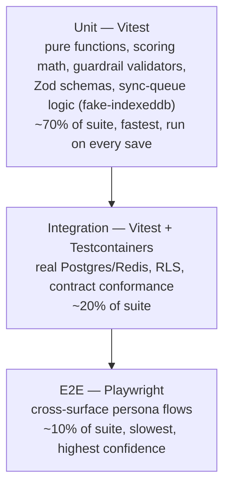
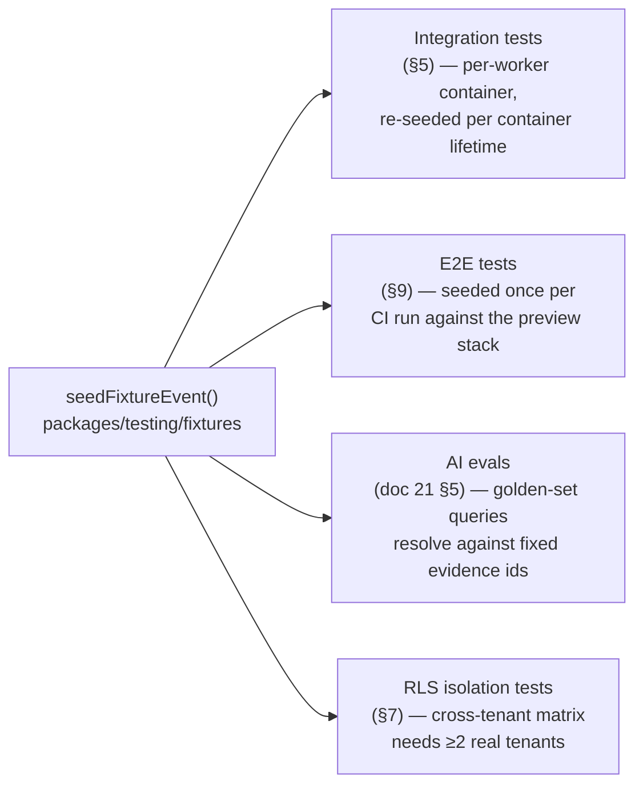
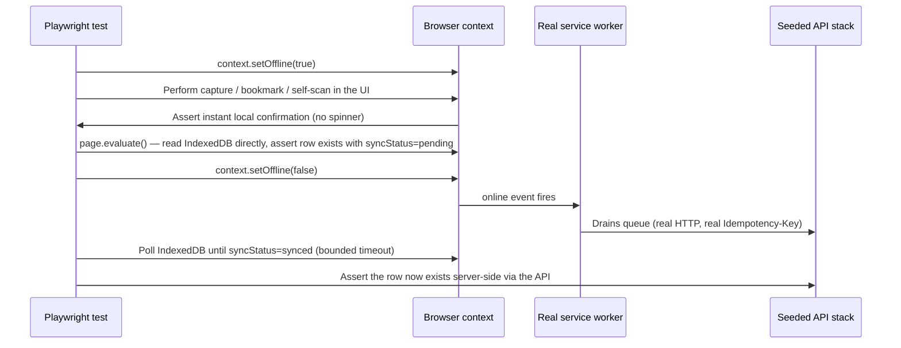

# Testing Strategy

This document specifies how Concourse verifies correctness before code reaches production: the test pyramid built on the tools already locked in [00-foundation.md](00-foundation.md) §6 (**Playwright** for E2E, **Vitest** for unit, **Testcontainers** for integration), the seeded-fixture-event pattern that [21-ai-architecture.md](21-ai-architecture.md) §5 already depends on, multi-tenant isolation testing as a release gate under principle P5, an offline-sync testing approach for [17-offline-sync-architecture.md](17-offline-sync-architecture.md)'s service-worker and IndexedDB logic, the automated accessibility test gates promised by [39-design-system.md](39-design-system.md) §12, and API contract conformance testing against the OpenAPI artifact from [18-api-architecture.md](18-api-architecture.md) §2. It closes with an index of every gate that blocks a merge across the system — the index points to each subsystem's authoritative gate definition rather than restating its mechanics. What this document does **not** own: column-level schema and RLS policy *definitions* ([16-database-schema.md](16-database-schema.md)), the role→permission matrix ([28-permission-model.md](28-permission-model.md)), the AI eval golden sets and their grading rubrics ([21-ai-architecture.md](21-ai-architecture.md) §5), the OpenAPI contract pipeline and breaking-change classification ([18-api-architecture.md](18-api-architecture.md) §2, §3.10, §11), design tokens and the a11y standards themselves ([39-design-system.md](39-design-system.md) §12), or the offline write/conflict business rules ([17-offline-sync-architecture.md](17-offline-sync-architecture.md)). This document owns the general-purpose test methodology, fixtures, and CI gating that sit underneath all of those.

---

## 1. Scope and Ownership

| This doc owns | Owned elsewhere |
|---|---|
| Test pyramid: tool choice per layer, ratios, isolation strategy | Tool selection itself → [00-foundation.md](00-foundation.md) §6 |
| The seeded-fixture-event pattern (canonical fixture data, seeding mechanics, reuse across suites) | Per-feature golden-set content → [21-ai-architecture.md](21-ai-architecture.md) §5 |
| RLS isolation test methodology and its release-gate status | RLS policy definitions themselves → [16-database-schema.md](16-database-schema.md); role/permission matrix → [28-permission-model.md](28-permission-model.md) |
| Offline/sync test approach (service worker, IndexedDB, background-sync simulation) | Write-path business rules, conflict resolution semantics → [17-offline-sync-architecture.md](17-offline-sync-architecture.md) |
| Automated accessibility test gates (contrast, component, page, keyboard, motion) | Accessibility standards and token values → [39-design-system.md](39-design-system.md) §12 |
| API contract conformance testing (schema validation against live responses) | Contract generation pipeline, breaking-change classification → [18-api-architecture.md](18-api-architecture.md) §2, §3.10, §11 |
| The merge-gate index (what blocks a PR, and where each gate's mechanics live) | Each gate's pass/fail logic and thresholds in its own subsystem doc |
| Test environments, flakiness policy, coverage thresholds | — |

## 2. Testing Principles

Testing operationalizes the product principles in [00-foundation.md](00-foundation.md) §1 rather than existing as a separate concern:

| Product principle | Testing consequence |
|---|---|
| Fast is the feature | Perceived-latency budgets (§3.1's ≤1.5 s Copilot first token, §3.7's booth-visit endpoint) are asserted in integration tests, not just observed in production. |
| Intelligence over records | AI feature correctness is graded on groundedness and citation validity, not just "did it respond" ([21-ai-architecture.md](21-ai-architecture.md) §5, indexed §12). |
| One source of truth | One fixture-event definition, one OpenAPI contract, one RLS test manifest — no suite maintains a parallel copy of tenant or schema truth. |
| Works in a concrete hall | Offline behavior is a first-class, deliberately tested path (§10), not an untested edge case. |
| Earn enterprise trust (**P5**) | Multi-tenant isolation tests are a **release gate**, not a nice-to-have (§7). Accessibility is a release gate (§11), not a backlog item. |

## 3. The Test Pyramid

| Layer | Tool | What it verifies | Network/DB | Runs on |
|---|---|---|---|---|
| Unit | **Vitest** | Pure business logic: matchmaking weight math ([24-matchmaking-and-scoring.md](24-matchmaking-and-scoring.md)), guardrail validators ([21-ai-architecture.md](21-ai-architecture.md) §7), Zod schemas (`packages/shared`), sync-outbox coalescing and backoff math ([17-offline-sync-architecture.md](17-offline-sync-architecture.md) §4.3, §6.4), prompt-hash manifest checks | None — all boundaries mocked | Every commit (pre-commit + CI), target < 2 min full run |
| Integration | **Vitest + Testcontainers** | Repository/query correctness, RLS isolation (§7), NestJS module wiring, BullMQ job handlers, API contract conformance (§8), migrations | Real Postgres 16 + pgvector, Redis 7 containers; ephemeral per CI job | Every PR, target < 8 min |
| E2E | **Playwright** | Cross-surface persona flows end to end: publish → capture → sync → follow-up; a11y page scans (§11); offline/online transitions (§10) | Real API/worker/DB stack against a preview deploy | Smoke subset (`@smoke`) on every PR; full regression nightly |

**Ratio guidance:** roughly 70% unit / 20% integration / 10% E2E by test count — inverted by confidence and cost, not by importance. A regression that only an E2E test can catch (e.g., a real service-worker sync race) still gets one, but the default choice for new logic is the cheapest layer that can actually exercise it.

## 4. Unit Testing (Vitest)

- **Location convention:** `*.test.ts` colocated with source (`packages/*/src/**/*.test.ts`, `apps/*/src/**/*.test.ts`) — Vitest's default, no separate `__tests__` tree, so a moved file's test moves with it.
- **What belongs here:** anything expressible as input → output with no I/O — scoring functions, prompt-registry hash verification, RFC 9457 problem-document builders, cursor encode/decode ([18-api-architecture.md](18-api-architecture.md) §3.2), the RLS-relevant query-builder helpers (the SQL they *generate*, not what Postgres does with it — that's integration territory).
- **IndexedDB/service-worker unit tests** use `fake-indexeddb` (in-memory polyfill) rather than a browser — the sync-outbox coalescing rule, the drain-order state machine, and the exponential-backoff formula ([17-offline-sync-architecture.md](17-offline-sync-architecture.md) §4.3, §6.2, §6.4) are pure state transitions once the storage API is swapped for the polyfill, and this tier is where their edge cases (rapid toggle coalescing, backoff cap at 300 s, non-retryable classification) are exhaustively enumerated — far cheaper than reproducing them in a real browser.
- **AI provider boundary is always mocked at this tier:** `AiGenerationService`/`AiEmbeddingService` are injected with fakes; unit tests assert that features call the gateway with the right prompt id/inputs, never that a model produced a particular string (that's the eval suite's job, §12).
- **Coverage threshold:** 80% statement coverage on `packages/shared`, `packages/ai` (excluding prompt files, which are data), and any package containing scoring/validation logic; 60% floor elsewhere (thin controller/DTO code is better covered by integration tests than inflated with trivial unit tests). Enforced via `vitest --coverage` with `v8` provider; threshold configured per-package in `vitest.config.ts`, aggregated in CI (§14).

## 5. Integration Testing (Testcontainers)

- **Containers:** every integration run provisions an ephemeral **Postgres 16 + pgvector** container and a **Redis 7** container via `@testcontainers/postgresql` / `@testcontainers/redis`, migrated with the same `drizzle-kit` migrations that run in production ([00-foundation.md](00-foundation.md) §6) — integration tests exercise the real schema, real RLS policies, and real indexes, never a mocked query layer.
- **Isolation strategy:** one container pair per Vitest worker (not per test file) to amortize container startup (~1–2 s) across the worker's whole file set; each test runs inside a transaction that's rolled back on completion (`BEGIN` in a `beforeEach`, `ROLLBACK` in `afterEach`), so tests within a worker never see each other's writes without needing a full re-seed. Tests that specifically need cross-transaction visibility (e.g., verifying a BullMQ consumer reads a row a prior request committed) opt out of the rollback wrapper explicitly and truncate the tables they touched in `afterEach` instead.
- **What belongs here:** repository queries against real RLS ([16-database-schema.md](16-database-schema.md)), NestJS module wiring (guards, interceptors, the `RequestContext` → `app.current_org_id` pipeline from [18-api-architecture.md](18-api-architecture.md) §3.9), BullMQ job handlers against real Redis, RLS isolation tests (§7), and API contract conformance tests (§8).
- **AI calls inside integration tests are mocked at the `AiGatewayService` boundary** using recorded fixture responses keyed by prompt id — this tier verifies wiring (budget checks fire, guardrails run in order, usage is metered), never model output quality. Real-model evaluation is a separate concern (§12).

## 6. The Seeded Fixture Event Pattern

Every layer above unit testing needs realistic, tenant-correct data — and multiple documents already need the *same* data (Copilot's grounded-answer eval, matchmaking's golden pairs, RLS isolation tests, E2E persona flows). Rather than each subsystem inventing its own dataset, Concourse seeds **one canonical fixture event, run against a seeded fixture event via Testcontainers**, that every consuming suite reads from. This is the pattern [21-ai-architecture.md](21-ai-architecture.md) §5 already names and defers to this document; it is defined here in full, once.

### 6.1 What the fixture event contains

The fixture event is named **"TechExpo 2027"** — the same illustrative event name used in [00-foundation.md](00-foundation.md) §12's glossary, kept consistent rather than inventing a second placeholder. It seeds one complete, small-but-representative slice of the domain model (§7 of [00-foundation.md](00-foundation.md)):

| Entity group | Seeded shape |
|---|---|
| Organizations | 1 organizer org (`professional` plan) + 4 exhibitor orgs, one per tier permutation needed for entitlement tests: 2× `essentials`, 1× `growth`, 1× `intelligence` |
| Event & floor | 1 `event` (`status: live`), 1 `venue`, 1 `floor_plan`, 12 `booths` (assigned to the 4 exhibitors + 8 unassigned) |
| Exhibitor participation | 4 `event_exhibitors` (one per org above), `exhibitor_staff` rows covering both `exhibitor:admin` and `exhibitor:rep`, a `products`/`event_product_listings` set per exhibitor |
| Registrations & attendees | 40 `registrations` spanning both consent states (`consent_ai_personalization` granted/revoked, `consent_discoverable` on/off) so consent-gated code paths (doc 21 §10) have both branches to exercise; a mix of `attendee_interests` |
| Agenda | 6 `agenda_sessions` with partial overlap in topic tags, some with `session_checkins` |
| Engagement | `booth_visits` and `leads` across every pipeline status (`captured` → `closed`/`disqualified`), `lead_notes` including one voice-transcribed note, 3 `meetings` in different statuses, `match_recommendations` for a subset of registrations |
| Knowledge base | `kb_sources`/`kb_documents`/`kb_chunks` for each exhibitor (profile, one product PDF, one deliberately injection-laden document for the guardrail suite, [21-ai-architecture.md](21-ai-architecture.md) §7.6) |
| AI | A handful of pre-existing `ai_conversations`/`ai_messages` so thread-continuation logic has non-empty history to load |

### 6.2 Seeding mechanics

- The seed lives in `packages/testing/fixtures/techexpo-2027/` as a set of typed factory functions (`packages/testing/fixtures/factory.ts`, one factory per entity, composable — e.g. `createLead({ status: 'qualified' })` fills every other field with a sensible default) plus one `seedFixtureEvent(db)` entry point that inserts the full graph in dependency order inside a single transaction.
- **Determinism:** every seeded row uses a fixed, checked-in UUIDv7 (not `randomUUID()`), so `evidence_ids`, `documentId`s, and lead ids referenced in eval golden sets ([21-ai-architecture.md](21-ai-architecture.md) §5's Copilot/Lead-Intelligence/Follow-up-Studio fixture assertions) are stable across every run, every environment, forever — an eval assertion written against `lead_id: "01930000-..."` never silently breaks because a re-seed reshuffled ids.
- **Idempotency:** `seedFixtureEvent` is safe to call against an already-seeded database (upsert semantics) so it can run once per CI job or once per Testcontainers-provisioned container without a "already exists" failure.

### 6.3 Reuse across layers

- **Integration tests (§5):** each Testcontainers worker runs `seedFixtureEvent` once after migrating, then relies on the per-test transaction rollback (§5) to keep the seed pristine across the file's tests.
- **E2E tests (§9):** the preview stack seeds once per CI run (not per test) since Playwright tests share a live server; tests that mutate fixture data (e.g., publishing a draft event) either use a dedicated freshly-created event within the same run or clean up after themselves — the shared fixture event's read-only fixtures (booths, agenda, exhibitor catalog) are never mutated by a test that doesn't own that mutation.
- **AI evals (doc 21 §5):** golden-set `.jsonl` files reference fixture ids directly, which is only safe because of the determinism guarantee in §6.2.
- **RLS isolation tests (§7):** need at least two real, differently-scoped tenants to prove isolation — the fixture's 4 exhibitor orgs plus the 1 organizer org supply that without any test writing bespoke setup data.

## 7. Multi-Tenant Isolation Testing

Per [00-foundation.md](00-foundation.md) §8 and product principle **P5 ("earn enterprise trust")**, tenant isolation is enforced by Postgres Row-Level Security as defense-in-depth behind application scoping. RLS policy *definitions* live in [16-database-schema.md](16-database-schema.md); this section owns how that guarantee is tested and gated.

### 7.1 The isolation test matrix

For **every tenant-owned table** (any table carrying `organization_id`, per the entity registry in [00-foundation.md](00-foundation.md) §7), the integration suite runs a generated matrix, executed as real SQL against a real Postgres container with RLS enabled (never mocked):

| Case | Setup | Assertion |
|---|---|---|
| Same-tenant read | `SET app.current_org_id` to org A; query org A's own row | Row is returned |
| Cross-tenant read | `SET app.current_org_id` to org A; query by id for a row owned by org B | Zero rows — never an error, never the row (matches the API's "404, not 403" leak-avoidance rule, [18-api-architecture.md](18-api-architecture.md) §3.5) |
| Cross-tenant write | `SET app.current_org_id` to org A; `UPDATE`/`DELETE` targeting org B's row by id | Zero rows affected |
| Exhibitor-vs-exhibitor (same event) | Two exhibitor orgs (`event_exhibitors` A and B) inside the *same* `event_id`; org A session queries B's `leads`/`booth_visits` | Zero rows — proves isolation holds even when a shared parent (`event`) exists, the case most likely to be coded wrong |
| No-session-context | Query executed with no `app.current_org_id` set at all | Zero rows (fails closed, never fails open) |

This matrix runs against the fixture event's tenants (§6) so no test writes its own two-tenant setup — it reuses the canonical dataset.

### 7.2 Coverage self-enforcement

A schema-introspection check (run in the same CI job) lists every table with an `organization_id` column and diffs it against a manifest of tables the isolation matrix (§7.1) actually covers (`packages/testing/rls/coverage-manifest.ts`). **A new tenant-owned table with no corresponding isolation-matrix entry fails CI** with an explicit "untested tenant table: `<name>`" message — coverage cannot silently lag schema growth, which is the failure mode that actually causes tenant-isolation bugs in practice (a new table shipped without anyone remembering to test it).

### 7.3 Cross-tenant read paths are tested separately

Explicitly-modeled cross-tenant reads (an attendee viewing exhibitor profiles, an organizer viewing aggregate exhibitor stats — [00-foundation.md](00-foundation.md) §8) are *not* RLS violations, they're intended API surface. These get their own integration tests asserting the *exact* field set exposed matches the resource's public-facing schema (§8) — the isolation matrix (§7.1) proves raw table access is blocked; these tests prove the sanctioned door only opens the intended width.

### 7.4 Release gate

The full RLS isolation suite (§7.1) plus its coverage check (§7.2) is a **hard merge gate on every PR touching a migration file or an RLS policy**, and a **hard release gate** on every deploy — a failure here blocks the pipeline unconditionally, with no override label (unlike the contract-breaking-change gate, §8, which supports an explicit override for intentional breaks). Tenant isolation is the one gate in this document with no escape hatch.

## 8. API Contract Testing

[18-api-architecture.md](18-api-architecture.md) §2 establishes that the OpenAPI 3.1 document is generated from code and committed, with CI already failing if the emitted spec drifts from the committed artifact. This document owns the complementary layer: **does the running API actually honor that contract at request time?** A committed spec that the server silently disobeys is worse than no spec.

### 8.1 Response-schema conformance

An integration-tier suite (§5) runs the real NestJS app (Testcontainers-backed Postgres/Redis) and, for every `operationId` in the committed `concourse.v1.json`, replays at least one representative request per HTTP method the operation supports, validating the actual response body against that operation's schema using Ajv loaded directly from the committed artifact (single source — the validator never maintains a parallel copy of the shapes). Two failure modes are checked, both load-bearing:

- **Under-conformance:** a required field is missing, or a type doesn't match — the classic contract break.
- **Over-conformance (mass-assignment leak):** the response contains a field *not* declared in the schema — this is the automated enforcement of [18-api-architecture.md](18-api-architecture.md) §11 rule 3 ("a field reaches the wire only by being named in a DTO"); an accidental extra field on an ORM-shaped response is exactly the bug this catches and unit tests on the DTO class alone would not.

### 8.2 Cross-cutting contract behaviors

The same suite asserts the conventions [18-api-architecture.md](18-api-architecture.md) §3 fixes generically, exercised against real endpoints rather than restated as prose:

- **Pagination envelope** (§3.2): every list endpoint returns `{ data, pagination: { nextCursor, hasMore } }` and never a bare array.
- **Problem documents** (§3.5): representative 401/403/404/422/429 responses are valid `application/problem+json` with a `code` present in [41-error-code-registry.md](41-error-code-registry.md).
- **Idempotency replay** (§3.6): a repeated `POST` with the same `Idempotency-Key` and body returns the stored response with `Idempotency-Replayed: true`; the same key with a different body returns `409 idempotency_conflict`.
- **Optimistic concurrency** (§3.7): `ETag` is present on single-resource GETs for every resource requiring `If-Match`; a stale `If-Match` returns `412 stale_resource`.

### 8.3 What this tier does *not* do

Breaking-change **classification** (is a given diff allowed within `/v1` or does it need `/v2`?) and the spec-diff CI check itself are owned and mechanically defined in [18-api-architecture.md](18-api-architecture.md) §3.10 and §11 rule 4 — this document's conformance suite only proves the server *matches whatever spec is currently committed*; it is indexed as a distinct merge gate in §14 rather than duplicated here.

## 9. End-to-End Testing (Playwright)

- **Scope:** cross-surface, cross-persona flows that no lower tier can exercise in one piece — e.g., Priya publishes an event → Jamal captures a lead at a booth (offline, per §10) → the lead syncs and appears in Elena's dashboard → Elena requests a Follow-up Studio draft → Sofia asks Expo Copilot about the exhibitor and sees a citation back to that exhibitor's profile. Each flow is written from one persona's real route tree ([00-foundation.md](00-foundation.md) §5), never by hitting the API client library directly.
- **Browsers/devices:** Chromium + WebKit (mobile Safari emulation) are both run in CI — WebKit is not optional given Jamal's and Sofia's devices are real iPhones ([17-offline-sync-architecture.md](17-offline-sync-architecture.md) §6.1 calls out Safari's lack of Background Sync API support explicitly, and E2E is where that gap gets exercised, §10). Firefox is run in the nightly full regression only, not on every PR, to keep PR feedback fast.
- **Environment:** tests run against a real deployed stack — a Vercel preview for the Next.js app plus an ephemeral API/worker/Postgres/Redis stack — seeded once per run with the fixture event (§6.3). E2E deliberately does not mock the network; that's the point of the tier.
- **Tagging and gating:** every test carries a Playwright tag. `@smoke` (the critical-path subset — auth, publish, capture, sync, one AI feature per surface) runs on every PR and blocks merge. The full suite (including `@a11y` from §11 and `@offline` from §10) runs nightly and on release branches; a nightly failure pages the owning team but does not retroactively block already-merged PRs — it blocks the next release cut instead.
- **Flakiness discipline:** see §13.

## 10. Offline & Sync Testing

[17-offline-sync-architecture.md](17-offline-sync-architecture.md) specifies the service worker caching strategy, IndexedDB schema, background-sync algorithm, and conflict resolution. This section defines how that logic is verified at each test tier — deliberately split, because a real browser is only needed for part of it.

### 10.1 Unit tier — algorithm correctness without a browser

Per §4, the drain-order state machine, backoff formula, and sync-outbox coalescing rule are tested with **`fake-indexeddb`** substituted for the real browser API. This is the cheapest place to exhaustively enumerate: rapid bookmark toggle → single final network call; a capture followed by a dependent `PendingLeadUpdate` before the capture has an `id_map` entry → update stays `pending` and is retried; a `401` mid-drain → whole queue pauses, not just the failing item; every backoff-classification row in [17-offline-sync-architecture.md](17-offline-sync-architecture.md) §6.4's table gets a direct unit test.

### 10.2 E2E tier — real service worker, real browser, simulated connectivity

Algorithm-correctness unit tests don't prove the *actual* service worker registers, caches, and drains correctly in a real browser — that requires Playwright, tagged `@offline`:

- **Connectivity simulation:** `browserContext.setOffline(true/false)` toggles the real network layer Playwright controls, which is what triggers the real `online`/`offline` browser events the service worker listens to (§6.1 of doc 17) — this is not a mock, it exercises the actual trigger path.
- **IndexedDB assertions:** `page.evaluate()` reads the real IndexedDB stores directly (`concourse-attendee`, `concourse-exhibitor`) to assert exact record shapes and `syncStatus` transitions — the same interface the app code uses, so a schema mismatch between the app and the test would be a real bug, not a test-only fiction.
- **iOS Background Sync gap:** WebKit's Playwright engine, matching real Safari, does not implement the Background Sync API — the `@offline` suite runs its full matrix against **both** Chromium and WebKit specifically to prove the foreground-polling and foreground/resume fallbacks ([17-offline-sync-architecture.md](17-offline-sync-architecture.md) §6.1) actually cover the gap on the engine that matters most for Jamal's device.
- **72-hour session-expiry pause:** tested with Playwright's clock control (`page.clock.install()` / fast-forward) rather than a real 72-hour wait — the test advances virtual time past the session TTL ([20-session-strategy.md](20-session-strategy.md) §11) with items still queued, asserts the "Sign in to sync your {N} pending items" banner appears and no queued item is discarded, then simulates re-login and asserts the drain resumes.
- **Storage quota pressure:** simulated by pre-filling `Cache Storage`/IndexedDB near the browser's reported quota before running a capture, asserting write queues are never evicted while read caches are (per [17-offline-sync-architecture.md](17-offline-sync-architecture.md) §9's eviction priority).

### 10.3 Gate

`@offline` is part of the nightly full E2E regression (§9); it also runs on every PR that touches `apps/web/src/service-worker/**`, `apps/web/src/lib/sync/**`, or [17-offline-sync-architecture.md](17-offline-sync-architecture.md)'s implementation packages, so changes to this exact surface get immediate feedback rather than waiting for the nightly run.

## 11. Accessibility Test Gates

[39-design-system.md](39-design-system.md) §12 sets WCAG 2.2 AA as a release gate and explicitly assigns "automated a11y test gates" to this document. Three automated layers, each catching a different class of regression:

### 11.1 Token-level: contrast

A Vitest unit test (`packages/ui`) iterates every published semantic color pair in [39-design-system.md](39-design-system.md) §4.2–§4.4 (surface/text/border pairs, the five status families, the data-viz categorical and heatmap ramps) and computes the actual contrast ratio programmatically, failing if any pair now falls under 4.5:1 (normal text) or 3:1 (large text / UI boundaries). This runs in the unit tier (§4) — a token value change is caught before it ever reaches a component.

### 11.2 Component-level: axe scans on every variant

Every component in [15-component-inventory.md](15-component-inventory.md)'s inventory ships with story/fixture coverage of its default state plus documented variants (disabled, error, loading); an automated `axe-core` scan runs against each rendered variant in the integration tier, asserting **zero** violations at the `serious`/`critical` impact levels. This catches missing `aria-label`s on icon-only buttons, unlabeled form controls, and insufficient touch-target hit areas ([39-design-system.md](39-design-system.md) §12.3) at the smallest reproducible unit — a failure here names the exact component and variant, not a whole page.

### 11.3 Page-level: axe scans in E2E

`@a11y`-tagged Playwright tests run `@axe-core/playwright` against one representative route per major page pattern per surface (Organizer Console dashboard, Exhibitor Portal capture screen, Attendee App agenda, Platform Admin tenancy list, plus the marketing site's public pages) — this catches violations that only exist at composition time (focus order across a full page, landmark structure, skip-link presence, `aria-live` regions actually firing on toast/scan-result events, per [39-design-system.md](39-design-system.md) §12.4) which no single component's isolated scan (§11.2) can see.

### 11.4 Thresholds and gate

| Impact level | Gate |
|---|---|
| `critical`, `serious` | **Blocks merge** — zero tolerance at either the component (§11.2) or page (§11.3) layer |
| `moderate`, `minor` | Logged to the observability dashboard ([31-observability.md](31-observability.md)); reviewed in weekly design-system triage; not currently a merge gate |

This two-tier threshold is a deliberate, final decision rather than an open question: zero-tolerance on every impact level would make the gate too noisy to trust (axe's `moderate` category includes many false-positive-prone heuristics), while gating on nothing would make the "release gate" language in doc 39 meaningless. Reduced-motion behavior (§9.3 of doc 39) and keyboard-only navigation (tab order, no traps, visible focus ring on every interactive element including custom map/table elements) are asserted as part of the same `@a11y` Playwright tags — emulating `prefers-reduced-motion: reduce` and asserting computed transition durations collapse to ≤0.01ms per doc 39's rule, and driving the page by `Tab`/`Shift+Tab`/`Enter` only to assert every action remains reachable.

## 12. AI Evaluation Gates (Index Only)

Golden-set eval suites, graders (programmatic + model-graded rubric), the adversarial injection suite, and the specific regression thresholds (citation validity 100%, groundedness ≥ 0.90, no metric regressing > 2 points) are fully owned and specified by [21-ai-architecture.md](21-ai-architecture.md) §5 and §7.6. This document's only contribution is the substrate they run on: the seeded fixture event (§6), whose deterministic ids let a golden-set assertion reference a specific `evidence_id` or `documentId` and have it resolve identically on every run, everywhere. Eval execution — which suites run per-PR (scoped to touched features) versus nightly (full, against live models) — is likewise defined in doc 21 §5, not restated here; §14 indexes it purely as a merge-gate line item.

## 13. Flakiness & Test Hygiene

- **Zero-tolerance policy on merge:** a flaky test (passes/fails non-deterministically on identical input) is treated as a bug in the test, not a reason to retry-until-green. CI runs each E2E test up to 2 automatic retries to absorb genuine infra blips (container cold start, transient network), but a test requiring retries more than occasionally is flagged by the CI dashboard's flake-rate metric and quarantined (skipped with a tracked issue) rather than left to erode trust in the suite — a quarantined test still blocks its own fix from closing, since re-enabling requires a green run.
- **No shared mutable state across parallel workers:** Testcontainers gives each Vitest worker its own Postgres/Redis pair (§5); Playwright workers against the shared E2E stack (§9) either create their own event/org via the API (never mutating the shared fixture in place) or run in the small `@smoke` set where read-only assumptions are enforced by convention and caught by CI's flake-rate signal if violated.
- **Time is always controllable:** any test whose correctness depends on elapsed time (session expiry, backoff delays, cache staleness) uses fake/virtual clocks (Vitest's `vi.useFakeTimers`, Playwright's `page.clock`) — never a real `sleep`. A test that needs to "wait 72 hours" to prove something is a test that has not found the clock-control API yet, not a candidate for a long-running CI job.

## 14. CI Merge-Gate Index

This is the authoritative index of everything that can block a PR or a release. Each row's **mechanics** (exact thresholds, grading logic, override process) live in the linked document; this table only says *that* the gate exists, *what* it protects, and *where* to look.

| Gate | Protects against | Blocks | Mechanics owned by |
|---|---|---|---|
| Unit test suite green | Regressions in pure business logic | Merge | This doc §4 |
| Coverage thresholds (80%/60%) | Untested new logic | Merge | This doc §4 |
| Integration suite green | Wiring/query regressions against real Postgres/Redis | Merge | This doc §5 |
| RLS isolation matrix + coverage manifest | Cross-tenant data leakage | Merge (no override) + Release | This doc §7 |
| API contract conformance suite | Server disobeying its committed OpenAPI schema | Merge | This doc §8 |
| OpenAPI spec-diff / breaking-change classification | Undeclared breaking changes to `/v1` | Merge (override: `contract-break-approved` label) | [18-api-architecture.md](18-api-architecture.md) §3.10, §11 |
| E2E `@smoke` suite green | Cross-surface persona-flow regressions | Merge | This doc §9 |
| E2E `@offline` suite green (on touched paths) | Service-worker/IndexedDB regressions | Merge (path-scoped) | This doc §10 |
| Accessibility: 0 critical/serious axe violations (component + page) | WCAG 2.2 AA regressions | Merge | This doc §11, standards in [39-design-system.md](39-design-system.md) §12 |
| Token contrast test | Silent contrast regression on a token edit | Merge | This doc §11.1, values in [39-design-system.md](39-design-system.md) §4 |
| AI eval regression gates (citation validity, groundedness, injection suite, metric drift) | Ungrounded, unsafe, or regressed AI feature output | Merge (scoped to touched `packages/ai`/`evals`) | [21-ai-architecture.md](21-ai-architecture.md) §5, §7.6 |
| Nightly full E2E + eval regression | Drift not caught by PR-scoped subsets | Next release cut | This doc §9, §12; [21-ai-architecture.md](21-ai-architecture.md) §5 |

## 15. Related Documents

| Topic | Document |
|---|---|
| Tool choices this pyramid is built on (Playwright, Vitest, Testcontainers) | [00-foundation.md](00-foundation.md) §6 |
| Tenant/RLS model under test | [00-foundation.md](00-foundation.md) §8, [16-database-schema.md](16-database-schema.md) |
| Offline write/conflict business rules this doc's `@offline` suite verifies | [17-offline-sync-architecture.md](17-offline-sync-architecture.md) |
| API conventions this doc's contract suite verifies | [18-api-architecture.md](18-api-architecture.md) |
| AI eval golden sets, graders, and thresholds this doc indexes | [21-ai-architecture.md](21-ai-architecture.md) §5, §7.6 |
| Accessibility standards and tokens this doc's a11y gates enforce | [39-design-system.md](39-design-system.md) §12 |
| Error codes asserted in contract tests | [41-error-code-registry.md](41-error-code-registry.md) |
| Session/token TTLs exercised by offline clock-control tests | [20-session-strategy.md](20-session-strategy.md) §11 |
| Dashboards for flake rate, moderate a11y violations, nightly eval drift | [31-observability.md](31-observability.md) |
