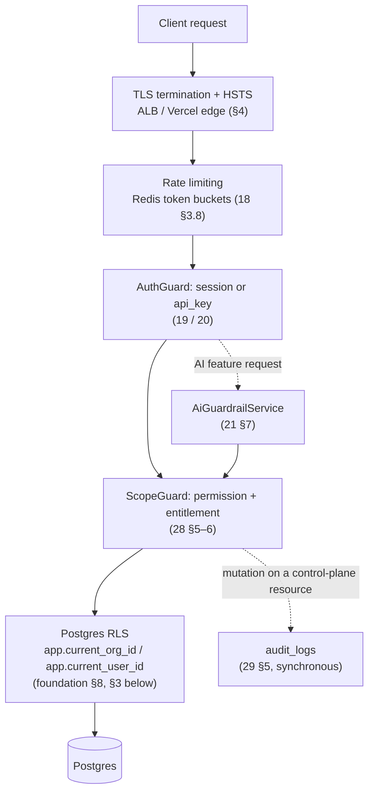
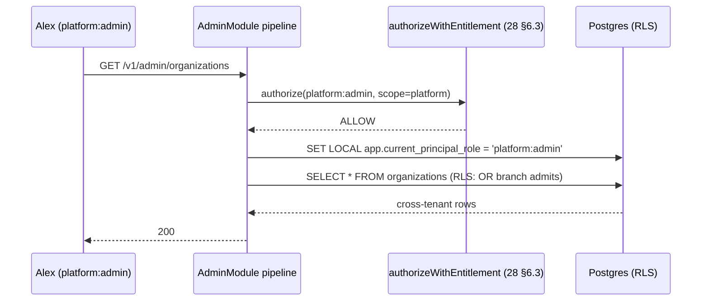
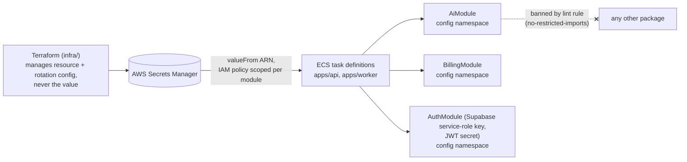
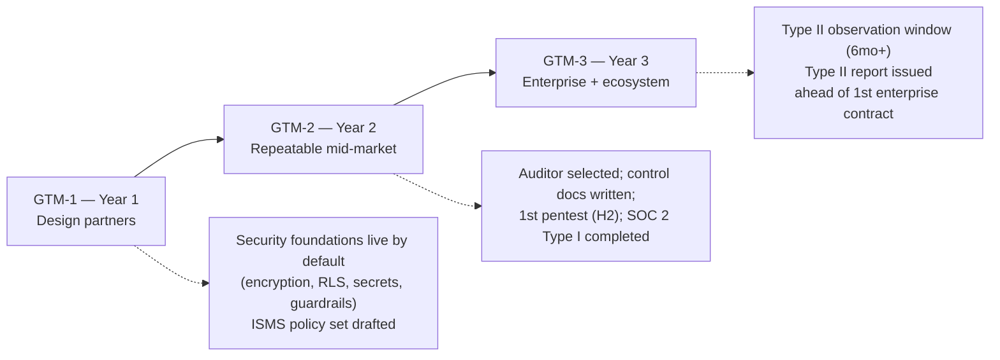

# 43 — Security Architecture

This document is the cross-cutting synthesis a security reviewer starts from: the platform-wide threat model, the encryption posture (at rest and in transit), the secrets-management pattern every service must follow, dependency/supply-chain controls, the RLS-as-backstop tenancy model restated explicitly as a security control, incident detection, and the compliance-readiness roadmap toward SOC 2 Type II. It does not re-derive detail already owned elsewhere — it points at the owning document and states only what is genuinely cross-cutting or was left as an explicit forward reference by another locked document. In particular: credential and session mechanics are [19-authentication-strategy.md](19-authentication-strategy.md) and [20-session-strategy.md](20-session-strategy.md)'s; the role→permission matrix and cross-tenant read-path registry are [28-permission-model.md](28-permission-model.md)'s; the immutable audit trail is [29-audit-logging-architecture.md](29-audit-logging-architecture.md)'s; retention, consent, DSAR/erasure, and the GDPR/CCPA posture are [38-data-retention-privacy-compliance.md](38-data-retention-privacy-compliance.md)'s; AI-specific guardrails (prompt injection, jailbreak defense, grounding validators) are [21-ai-architecture.md](21-ai-architecture.md) §7's. Several of those documents forward-reference this one by name (`the platform-scope RLS branch`, `secrets held per 43-security-architecture.md`, `breach detection/response mechanics are 43's eventual territory`) — this document is where those references resolve, not merely a pointer back to them.

## 1. Security Principles

Foundation product principle 5 — "**earn enterprise trust**: tenancy, permissions, and audit are foundations, not add-ons" ([00-foundation.md](00-foundation.md) §1) — is this document's charter. Three corollaries run through every section below:

1. **Defense in depth, never a single control.** Every threat in §2 is closed by at least two independent layers (application check + database policy; code-level scoping + infrastructure-level IAM; guardrail + human-in-the-loop), matching the standard [21-ai-architecture.md](21-ai-architecture.md) §7 already sets for AI guardrails ("no single control is trusted") — this document generalizes that standard to the whole platform rather than reinventing it for each subsystem.
2. **Fail closed.** An unresolvable authorization state, an unset RLS session variable, a missing entitlement, or a provider outage always degrades toward "no access" / "deterministic fallback" ([28-permission-model.md](28-permission-model.md) §5–6, [21-ai-architecture.md](21-ai-architecture.md) §8.3), never toward permissive default.
3. **Security is provable, not just present.** Every security-relevant action that changes control-plane state is written to [29-audit-logging-architecture.md](29-audit-logging-architecture.md)'s `audit_logs`; every claim in this document (encryption, isolation, secrets scoping) is the kind of claim an enterprise security questionnaire or a SOC 2 auditor can verify against a concrete mechanism, not a policy statement alone.

## 2. Platform-Wide Threat Model

[21-ai-architecture.md](21-ai-architecture.md) §7 ranks four AI-specific threats. This section extends that ranking to the whole platform — the AI threats are threats 2 and 6 below, restated by reference rather than duplicated, alongside every other class of attack the architecture must resist.

| # | Threat | Representative attack scenario | Primary defenses (this platform) | Detail owner |
|---|---|---|---|---|
| 1 | **Cross-tenant data leakage** | An exhibitor's app-layer bug omits an `event_exhibitor_id` filter and returns another exhibitor's `leads` rows; or a retrieval bug surfaces exhibitor-internal KB content to an unrelated attendee | Application-layer scoping (ScopeGuard) **and** Postgres RLS as an independent second layer (§3); the exhaustive cross-tenant read-path registry ([28-permission-model.md](28-permission-model.md) §7) that treats anything not listed there as a bug by definition; tenant- and visibility-filtered retrieval ([22-rag-architecture.md](22-rag-architecture.md) §6) | [28-permission-model.md](28-permission-model.md), §3 below |
| 2 | **Prompt injection via exhibitor-supplied content** | A product PDF or lead note contains "ignore previous instructions…" aimed at an attendee-facing Copilot answer | Ingestion-time classifier screening, nonce-delimited untrusted-content blocks, capability minimization (no mutating tools), output validators, adversarial eval gate | [21-ai-architecture.md](21-ai-architecture.md) §7 (owns in full; not restated here) |
| 3 | **Credential attacks** | Credential stuffing against `/v1/auth/login`; password reuse from a third-party breach; phishing for a magic-link or invite token | Supabase Auth-managed password hashing with breach-corpus checking enforced via the Password Verification Hook, per-`(email, IP)` and per-endpoint rate limits layered atop Supabase Auth's own built-in limits, Supabase-managed WebAuthn clone detection, generic error responses (no enumeration), SHA-256-hashed single-use invite tokens with 256-bit entropy | [19-authentication-strategy.md](19-authentication-strategy.md) §4, §7, §8, §13 |
| 4 | **Session hijacking** | A stolen device or an XSS-exfiltrated cookie is replayed to impersonate an active session | Supabase JWT access/refresh sessions with a Custom Access Token Hook enforcing a hard 8-hour `hard_expires_at` ceiling for `attendee`/`kiosk_attendee` sessions, `HttpOnly` cookies managed by `@supabase/ssr`, service-role-mediated revocation (`admin.signOut` scopes, or direct invalidation of one session's refresh token in Supabase's own `auth` schema) backed by a cooperative Supabase Realtime disconnect signal, new-device+new-country anomaly heuristic feeding `suspected_hijack` | [20-session-strategy.md](20-session-strategy.md) §1, §5, §6, §9; [18-api-architecture.md](18-api-architecture.md) §7 |
| 5 | **SSRF via outbound integrations** | A malicious `webhook_endpoints.url` (or a malicious `kb_sources` external URL) points at a cloud metadata endpoint or an internal service | Dial-time DNS re-resolution, private/link-local IP rejection, redirects not followed, TLS-required egress — generalized platform-wide, not just to webhooks (§7) | [18-api-architecture.md](18-api-architecture.md) §9, §7 below |
| 6 | **Model jailbreak / AI feature abuse** | An attendee attempts to coerce Copilot into ignoring its citation/refusal policy, or floods the AI message quota | Input screening, length caps, per-registration quota (30/hr, 200/day), refusal-phrasing enforcement, budget-triggered fallback | [21-ai-architecture.md](21-ai-architecture.md) §7, §6.2 |
| 7 | **Supply-chain compromise** | A transitive npm dependency is compromised and exfiltrates secrets at build or runtime | Lockfile-pinned installs, automated vulnerability scanning and patch SLAs, native GitHub security tooling, container image scanning (§8) | §8 below |
| 8 | **Insider / platform-admin misuse** | A support engineer with `platform:admin` reads or acts beyond the scope of a legitimate support request | No standing write access beyond two audited security actions, no impersonation in Phase 1, every read path enumerated and coarsened where it crosses tenants ([28-permission-model.md](28-permission-model.md) §7, §9) | [28-permission-model.md](28-permission-model.md) §9, [29-audit-logging-architecture.md](29-audit-logging-architecture.md) |
| 9 | **Availability attack during a live event** | A volumetric or targeted request flood against `booth-visits`/check-in endpoints during peak show-floor hours | Redis token-bucket rate limiting sized for real floor traffic (1,200 req/min per `event_exhibitors` id), ALB-fronted horizontally scaled ECS Fargate, circuit breakers on AI provider calls so an AI outage cannot cascade into the deterministic path | [18-api-architecture.md](18-api-architecture.md) §3.8, [21-ai-architecture.md](21-ai-architecture.md) §8.1 |

Ranking rationale: cross-tenant leakage sits first because it is the single failure mode that would invalidate Concourse's core positioning ("first-class tenant with owned data," [02-business-goals.md](02-business-goals.md) §6) and the "zero cross-tenant data incidents" standing goal ([02-business-goals.md](02-business-goals.md) §4); everything from #2 down is ordered by a combination of blast radius and how directly attacker-controlled input reaches the platform.

## 3. Tenant Isolation as a Security Control (RLS as Backstop)

[00-foundation.md](00-foundation.md) §8 fixes the tenancy model: shared Postgres schema, `organization_id` on every tenant-owned row, RLS enforced via per-request session variables, explicitly **defense-in-depth behind application-level scoping — both mandatory, neither sufficient alone**. This section states, as a security control rather than a data-modeling choice, exactly how that guarantee holds under connection pooling and under the one case foundation §8 doesn't cover: platform-scope reads that have no `organization_id` at all.

**One documented exception to "both layers, always":** [26-file-storage.md](26-file-storage.md) §2, §12 establishes that Supabase Storage's `storage.objects` table has no separate application-level policy layer sitting in front of it — Supabase Storage exposes no bucket-policy language analogous to the old S3 model, so Postgres RLS is genuinely the *primary*, not merely backstop, control for object reads/writes in that one subsystem. This is a narrow, named exception scoped to `storage.objects` specifically; every other tenant-owned table in §3.1's two-layer model below is unaffected, and the `files` metadata row itself keeps the standard defense-in-depth posture.

### 3.1 Two independent layers, one Postgres policy

| Layer | Mechanism | What it catches |
|---|---|---|
| Application | `ScopeGuard` resolves the caller's roles for the path-derived scope and evaluates `authorizeWithEntitlement` ([28-permission-model.md](28-permission-model.md) §5–6) before a query is ever built | Business-logic authorization bugs: wrong permission checked, stale entitlement, wrong scope id trusted from client state |
| Database | Postgres RLS policy `USING (organization_id = current_setting('app.current_org_id', true)::uuid)` on every tenant-owned table, with `FORCE ROW LEVEL SECURITY` set so even the owning role cannot bypass it without an explicit `BYPASSRLS` grant (which no application database role holds) | The class of bug the application layer cannot: a missing `WHERE organization_id = …` in a hand-written or ORM-generated query, a join that silently widens scope, a future engineer forgetting the guard |

**Transaction-scoped session variables.** Every request wraps its SQL in an explicit transaction whose opening statements are `SET LOCAL app.current_org_id`, `SET LOCAL app.current_user_id` — `SET LOCAL`, not a bare `SET`, is the specific scoping keyword that makes this safe under the pooled connections `apps/api`/`apps/worker` use: `LOCAL` binds the value to the current transaction only, so a value can never leak forward to a different request that later reuses the same pooled physical connection. This is the concrete mechanism behind [18-api-architecture.md](18-api-architecture.md) §3.9's "SET Postgres session variables" step.

### 3.2 The platform-scope RLS branch

[28-permission-model.md](28-permission-model.md) §9 states that `platform:admin` routes carry no `app.current_org_id` at all and use "a separate RLS policy branch keyed on the role claim itself" — this is that branch, defined:

- The RLS policy on every tenant-owned table carries a second `OR` clause: `organization_id = current_setting('app.current_org_id', true)::uuid OR current_setting('app.current_principal_role', true) = 'platform:admin'`.
- `app.current_principal_role` is set (via the same `SET LOCAL` discipline as §3.1) **only** from inside the `AdminModule`'s request pipeline, and only after `authorizeWithEntitlement` has already resolved `ALLOW` for a route that is itself gated to `platform:admin` ([28-permission-model.md](28-permission-model.md) §5–6, §9). No other module's code path can reach the service method that issues this `SET`, enforced the same way [21-ai-architecture.md](21-ai-architecture.md) §1 restricts AI-provider-SDK imports to `packages/ai`: an ESLint `no-restricted-imports` rule scoped so only `apps/api/src/admin/**` may import the `RlsContextService.setPlatformScope()` helper.
- The variable is never client-settable, never cached, and defaults to unset on every fresh transaction — a request that never reaches an `AdminModule` route simply never has it set, so the additional `OR` clause is inert for every ordinary tenant-scoped request. This keeps the fail-closed principle (§1) intact: the default state of the flag is "absent," and "absent" evaluates to `false` in the `OR`.
- This branch governs **reads only** — [28-permission-model.md](28-permission-model.md) §9 already establishes that `platform:admin` has exactly two audited write actions (`organization.status_changed`, `user.sessions_revoked_all`) and no tenant-role-equivalent write access; the RLS branch does not need, and does not grant, a write-side counterpart.

This design is deliberately **not** "treat a missing `app.current_org_id` as platform scope" — that would be fail-*open* (any bug that forgot to set the tenant variable would silently grant cross-tenant access). Requiring an explicit, narrowly-issuable, positive flag keeps the RLS backstop fail-closed for every code path except the one that has already passed authorization for exactly this purpose.

## 4. Encryption Posture

### 4.1 At rest

| Data store | Mechanism | Notes |
|---|---|---|
| PostgreSQL 15 (Supabase-managed) | Encryption at rest managed by the Supabase platform by default — Concourse does not configure or hold key material ([00-foundation.md](00-foundation.md) §6, §14 Amendment A5) | Automated backups/point-in-time recovery inherit the same Supabase-managed encryption; a customer-managed-key upgrade path is the mechanism `entitlement:data_residency` will use when EU residency ships, now tracked as Supabase's own customer-managed-key offering if/when built ([26-file-storage.md](26-file-storage.md) §2, [44-future-expansion-plan.md](44-future-expansion-plan.md)) |
| ElastiCache Redis 7 | Encryption at rest enabled on the cluster (protects RDB/AOF persistence artifacts) | Redis holds only hashed API-key/invite-token values, the hashed Attendee Continuity Token ([20-session-strategy.md](20-session-strategy.md) §5.3), and transient job/cache data — never plaintext credentials, and no longer the session token itself now that sessions are Supabase-issued JWTs (§6) — so at-rest encryption here is defense-in-depth, not the sole protection for those values |
| Supabase Storage (files, exports, static assets) | Encryption at rest managed by the Supabase Storage platform by default — no bucket policy for us to author, since Supabase Storage's only access-control surface is RLS on `storage.objects` (§3's documented exception), not a separate encryption-header policy ([26-file-storage.md](26-file-storage.md) §2) | Signed uploads ([26-file-storage.md](26-file-storage.md)) inherit the same platform-managed encryption; Supabase Storage's own built-in CDN serves reads, never writes, so there is no read-side policy exception to reason about — the same division of labor the old CloudFront-vs-bucket-policy split encoded |
| Terraform state | Remote state backend encrypted at rest (S3 + SSE-KMS, matching the application buckets); secret-bearing resources marked `sensitive = true` so values never render in `terraform plan`/`apply` output or CI logs | See §5 for why actual secret *values* never enter state at all |

### 4.2 In transit

- **TLS 1.2+ everywhere**, no exceptions: client↔Vercel edge, client↔ALB (`api.concourse.app`), client↔Supabase Auth/Storage/Realtime (direct client-to-Supabase calls per [19-authentication-strategy.md](19-authentication-strategy.md), [26-file-storage.md](26-file-storage.md), [18-api-architecture.md](18-api-architecture.md) §7), API/worker↔Supabase-managed Postgres (SSL required at the connection-string level), API↔ElastiCache (in-transit encryption enabled on the replication group), API↔Anthropic/Voyage/Stripe/SES (all external providers called only over HTTPS).
- `Strict-Transport-Security: max-age=63072000; includeSubDomains; preload` on every API response, plus `X-Content-Type-Options: nosniff` ([18-api-architecture.md](18-api-architecture.md) §6) — this document treats those two headers as the floor for every surface, including the marketing site and the Attendee/Organizer/Exhibitor Portal surfaces served by the same Next.js app.
- Outbound webhook deliveries require TLS (`https://` only endpoints, enforced at `POST /v1/organizations/{orgId}/webhook-endpoints` creation) and are HMAC-signed in addition to riding TLS ([18-api-architecture.md](18-api-architecture.md) §9.3) — signature verification protects payload integrity even in a TLS-terminating-proxy scenario on the receiver's side, which this platform cannot control.
- Complementary cryptographic controls that are hashing, not encryption, and must not be conflated with either: Supabase Auth's own internally-managed password hashing (GoTrue, an implementation detail this platform does not specify or touch — [19-authentication-strategy.md](19-authentication-strategy.md) §4.2), SHA-256 hashing of our own remaining single-use invite tokens before storage ([19-authentication-strategy.md](19-authentication-strategy.md) §13), and SHA-256 hashing of public-API-key secrets ([18-api-architecture.md](18-api-architecture.md) §8). Session tokens are no longer a value our own code hashes and compares at all — sessions are Supabase-issued JWTs, verified by signature ([20-session-strategy.md](20-session-strategy.md) §2). These are one-way and irreversible by design (where this platform controls the mechanism) — encryption (§4.1) protects data the platform must read back; hashing protects credentials the platform only ever needs to *verify*.

## 5. Secrets Management

### 5.1 The Secret-Scoping Rule (generalized from the AI module)

[21-ai-architecture.md](21-ai-architecture.md) §1 establishes a two-part enforcement pattern for Anthropic/Voyage credentials: (1) the provider SDK is a dependency only of the one package that may call it, and (2) an ESLint `no-restricted-imports` rule bans that SDK everywhere else in the repo. **This document generalizes that pattern platform-wide as the Secret-Scoping Rule: every third-party credential is a dependency, and a config namespace, of exactly the module that needs it — never a global environment variable any module can read.**

| Secret class | Scoped to (module) | Delivery |
|---|---|---|
| Anthropic / Voyage API keys | `AiModule` (`packages/ai`) | ECS task secret injection, `apps/api` + `apps/worker` only |
| Stripe secret key + webhook signing secret | `BillingModule` | ECS task secret injection |
| Supabase service-role key | `AuthModule` — kiosk-claim provisioning, session-continuity-token redemption, and admin-mediated session revocation are the only code paths permitted to hold it ([19-authentication-strategy.md](19-authentication-strategy.md) §9.5; [20-session-strategy.md](20-session-strategy.md) §5.3, §6) | ECS task secret injection, `apps/api` only — never shipped to any client |
| Supabase JWT secret | Platform-level (`apps/api` Fastify middleware verifies every authenticated request's JWT signature locally against it — [20-session-strategy.md](20-session-strategy.md) §2) | ECS task secret injection |
| Web Push VAPID private key | `NotificationsModule` | ECS task secret injection |
| Database credentials (Supabase Postgres connection string) | Platform-level (both deployables need DB access) | ECS task secret injection; rotation mechanics per §5.3 |
| Redis auth token | Platform-level | ECS task secret injection |
| Ed25519 worker signing key (internal service JWTs, [20-session-strategy.md](20-session-strategy.md) §11) | `apps/worker` only — the API holds only the corresponding **public** keys, which are not secrets | ECS task secret injection, private key never leaves the worker deployable |
| AWS SES credentials | `NotificationsModule` | **No static credential at all** — the ECS task IAM role grants `ses:SendEmail` directly; this is the preferred pattern wherever AWS IAM can substitute for a stored secret |

Application data that looks like a secret but is not a platform secret — webhook endpoint HMAC secrets and public-API-key secrets — is generated, hashed, and rotated per-tenant inside the product itself ([18-api-architecture.md](18-api-architecture.md) §8, §9.3), not through this infrastructure mechanism; it is listed here only to disambiguate the two categories.

### 5.2 Terraform-managed, never plaintext in the repo

- Terraform (`infra/`, [00-foundation.md](00-foundation.md) §6) manages the **AWS Secrets Manager secret resources** (name, description, rotation schedule) and the **IAM policies** that scope which ECS task role may `secretsmanager:GetSecretValue` on which secret ARN — the identical per-module least-privilege scoping §5.1 enforces at the code layer, restated at the infrastructure layer, so a compromised container still cannot read a secret its own task role was never granted.
- Terraform does **not** manage secret *values*. The committed resource is `aws_secretsmanager_secret` (metadata and rotation config); `aws_secretsmanager_secret_version` (the actual value) is never written by a `terraform apply` from a value in source control — it is set once, out-of-band, by a platform operator through the AWS console/CLI at provisioning time, or thereafter by AWS's own native rotation Lambda (§5.3). This is what makes "Terraform-managed secrets" and "no plaintext in the repo" simultaneously true: the *lifecycle* is Terraform-managed; the *material* never is.
- **No plaintext in the repo** is enforced structurally, not by policy alone: GitHub secret scanning + push protection (org-wide) rejects a push containing a recognizable credential pattern before it lands in history; a nightly full-history re-scan catches anything push protection's pattern set misses; every committed `.env.example` carries placeholder values only, with real `.env` files gitignored; local development pulls scoped, developer-specific credentials from Secrets Manager via each engineer's own IAM identity rather than a shared plaintext file.

### 5.3 Rotation

| Secret type | Cadence | Mechanism |
|---|---|---|
| Database credentials | 90 days | Supabase project credential rotation, coordinated the same way this table already handles a store with no native AWS-style rotation Lambda (see the Redis row immediately below) — Terraform-coordinated manual rotation with a brief dual-credential overlap window |
| Redis auth token | 180 days | Terraform-coordinated manual rotation with a brief dual-token overlap window (ElastiCache has no native rotation Lambda) |
| Anthropic / Voyage / Stripe keys | Annual scheduled minimum; immediate on suspected compromise | Provider console rotation, Secrets Manager value update, ECS task restart to pick up the new value |
| Supabase service-role key / JWT secret | Annual scheduled minimum; immediate on suspected compromise | Supabase project settings rotation (dashboard/Management API), Secrets Manager value update, ECS task restart to pick up the new value |
| Ed25519 worker signing keypair | 90 days | New keypair generated, private key delivered to `apps/worker` only; API holds current + previous public key for a 24-hour overlap ([20-session-strategy.md](20-session-strategy.md) §11) |

## 6. Credential, Session & Abuse Defenses (Synthesis)

Full mechanics live in [19-authentication-strategy.md](19-authentication-strategy.md) and [20-session-strategy.md](20-session-strategy.md); this section states only the cross-cutting properties a reviewer should carry forward from both without re-reading either in full:

- **Sessions are short-lived, signature-verified JWTs, revocable through Supabase's own service-role primitives rather than an O(1) Redis delete.** Every human session is a Supabase-issued JWT access token (~1 hour) plus a rotatable refresh token, verified locally by signature on every request with no database round trip; revocation runs through `admin.signOut` scopes or a direct, service-role-only invalidation of one specific session's refresh token in Supabase's own `auth` schema ([20-session-strategy.md](20-session-strategy.md) §1, §6), and for `attendee`/`kiosk_attendee` sessions is additionally bounded by the Custom Access Token Hook's hard 8-hour `hard_expires_at` ceiling regardless of what the refresh token would otherwise permit (§5.3). The one other JWT in the system (worker→API internal auth) has a 5-minute TTL specifically because that use case inverts the revocation tradeoff.
- **Every credential-bearing value our own code stores at rest is a one-way hash, never the raw value**: our own remaining single-use invite tokens and API-key secrets are SHA-256-hashed before storage — one audited hashing discipline. Password material is no longer a value our own code stores at all — Supabase Auth (GoTrue) hashes and stores it internally; magic-link, verify-email, and reset-password tokens are likewise now Supabase-issued and Supabase-internal, not our own token type ([19-authentication-strategy.md](19-authentication-strategy.md) §3, §13); and session tokens are Supabase JWTs, verified by signature rather than hashed-and-compared ([20-session-strategy.md](20-session-strategy.md) §2).
- **Rate limiting is layered by intent, not just by principal**: Supabase Auth's own built-in rate limits apply first, underneath general per-session/per-key buckets ([18-api-architecture.md](18-api-architecture.md) §3.8), underneath *stricter* auth-specific buckets for login, signup, magic-link, and password-reset endpoints ([19-authentication-strategy.md](19-authentication-strategy.md) §8) — an attacker hitting `/auth/login` hits the tighter bucket first.
- **Anomaly detection is a lead for human review, never an automatic lockout** ([20-session-strategy.md](20-session-strategy.md) §9) — a deliberate product-security tradeoff favoring availability (a false-positive lockout during a live event is itself a security-adjacent incident) over reflexive blocking, consistent with the friction-as-last-resort stance both documents already take.
- **Every security-relevant credential/session event is audit-logged**: role changes, membership removal, admin-triggered session revocation, and password-reset-triggered mass revocation all land in `audit_logs` ([29-audit-logging-architecture.md](29-audit-logging-architecture.md) §6.1), giving the incident-response process (§9) a durable, tamper-evident record independent of Supabase's own session state.

## 7. SSRF & Outbound Request Egress Control

[18-api-architecture.md](18-api-architecture.md) §9 fixes the SSRF guard for webhook delivery: dial-time DNS re-resolution, private/link-local IP rejection re-checked on every retry attempt, redirects not followed, TLS required. **This document generalizes that guard as a platform-wide requirement rather than a webhook-specific one**: any code path that fetches a caller-supplied or tenant-supplied URL is a potential SSRF vector and must route through the same shared guard, implemented once and reused, not re-derived per feature.

| Integration point | Caller-supplied URL | Guard applied |
|---|---|---|
| Outbound webhook delivery | `webhook_endpoints.url` (org admin) | Full guard, [18-api-architecture.md](18-api-architecture.md) §9 |
| KB external-URL ingestion | `kb_sources` external URL (exhibitor/organizer) | Same shared guard, applied at ingestion time before the crawler ever dials the URL ([23-knowledge-base-architecture.md](23-knowledge-base-architecture.md)) |
| Copilot's "exhibitor's own website" citation exception | Exhibitor's registered website field ([21-ai-architecture.md](21-ai-architecture.md) §7.4) | The field is rendered as a link for the *user's browser* to follow, never dialed server-side by Concourse — no SSRF surface exists here because the platform itself never fetches it |

**D-SEC-1 (decision):** the SSRF guard is implemented once, as a shared utility (`packages/shared`'s HTTP-egress helper), and every server-side outbound fetch of a non-hardcoded URL is required to go through it — a lint rule flags a raw `fetch`/`http.request` call to a variable-sourced URL outside that helper, the same enforcement shape §5.1 and [21-ai-architecture.md](21-ai-architecture.md) §1 already use for scoping concerns. This closes the gap that would otherwise exist the day a second feature (beyond webhooks) starts dialing tenant-supplied URLs.

## 8. Dependency & Supply-Chain Security

| Control | Mechanism | Trigger | Gate |
|---|---|---|---|
| Lockfile integrity | `pnpm install --frozen-lockfile` | Every CI run | Fails the build outright on any drift between `package.json` and `pnpm-lock.yaml` |
| Known-vulnerability audit | `pnpm audit --audit-level=high` | Every CI run | Blocks merge; a documented, time-boxed exception requires a tracked follow-up issue, never a silent waiver |
| Dependency vulnerability alerts | GitHub Dependabot security alerts | Continuous | Opens a PR immediately, independent of the weekly cadence below; SLA table follows |
| Automated version-update policy | GitHub Dependabot version updates | Weekly, grouped per workspace package | Patch/minor bumps auto-merge once the full Turborepo-affected CI graph is green (including the `packages/ai` eval suite where touched, [21-ai-architecture.md](21-ai-architecture.md) §5); major bumps always require a human reviewer |
| Static analysis (SAST) | GitHub CodeQL | Every PR touching `apps/*`/`packages/*` TypeScript | Blocks merge on a new high/critical finding |
| Secret scanning | GitHub secret scanning + push protection | On push, plus nightly full-history sweep | Blocks the push itself; a nightly-sweep hit opens an incident (§9) |
| Container image scanning | ECR image scanning on push (native AWS feature — no new vendor beyond the already-canonical ECS Fargate/ECR stack) | Every image push | Blocks deployment on a critical CVE with an available fix |

**Vulnerability remediation SLA:**

| Severity | Remediation SLA |
|---|---|
| Critical | 48 hours |
| High | 7 days |
| Medium | 30 days |
| Low | Next regular dependency-update cycle |

Every tool in this section is either already canonical to the stack ([00-foundation.md](00-foundation.md) §6: GitHub Actions, pnpm, ECS Fargate/ECR, Supabase per §14 Amendment A5) or a native GitHub/AWS security feature layered onto that stack — deliberately, so this document introduces zero new vendors to satisfy supply-chain requirements. Supabase's own client SDKs (`@supabase/supabase-js`, `@supabase/ssr`) and CLI are ordinary `pnpm`-managed dependencies of `apps/api`/`apps/web`, so they already fall inside every control above (lockfile integrity, `pnpm audit`, Dependabot, CodeQL) without needing a special case. A formal SBOM export is not built in Phase 1 (no current customer or examiner requirement drives it); it is assigned to [44-future-expansion-plan.md](44-future-expansion-plan.md), revisit criterion: the first enterprise contract that contractually requires one.

## 9. Incident Detection & Response

[38-data-retention-privacy-compliance.md](38-data-retention-privacy-compliance.md) §8 fixes the **notification** obligation (72 hours from confirmed breach determination to the affected organizer) and explicitly defers **detection and response mechanics** to this document. This section closes that reference.

- **Detection signals**, all already emitted by canonical platform components rather than a new tool: the self-hosted ClamAV scanning pipeline's own quarantine/failure signals (`file.quarantined`, quarantine-rate metrics — [26-file-storage.md](26-file-storage.md) §6, §13), Sentry error-rate anomalies, and the OTel metrics/alerting stack owned operationally by [31-observability.md](31-observability.md) — including security-relevant series already defined elsewhere in this registry: `ai_guardrail_triggers_total` ([21-ai-architecture.md](21-ai-architecture.md) §9), `ai_budget_denials_total`, and webhook-endpoint auto-disable events ([18-api-architecture.md](18-api-architecture.md) §9.6). The `suspected_hijack` clustering heuristic ([20-session-strategy.md](20-session-strategy.md) §9) is the session-specific instance of the same idea.
- **Severity and triage SLA:**

| Severity | Example | Triage target |
|---|---|---|
| SEV1 | A quarantine-rate spike consistent with a targeted attack on an upload surface ([26-file-storage.md](26-file-storage.md) §13); confirmed cross-tenant data exposure; multiple accounts clustering into `suspected_hijack` within a short window (a pattern, not an isolated hijack) | Acknowledge within 1 hour, 24/7 |
| SEV2 | Single-account `suspected_hijack` flag; a webhook endpoint auto-disabled for suspected abuse; a secret-scanning nightly-sweep hit | Acknowledge within 4 business hours |
| SEV3 | A dependency vulnerability past its SLA window (§8); an anomalous but sub-threshold rate-limit pattern | Standard on-call queue, next business day |

- **On-call rotation and paging mechanics** are [31-observability.md](31-observability.md)'s operational responsibility (dashboards, alert routing) — this document owns only the security-specific severity classification and triage targets above, which [31-observability.md](31-observability.md) consumes as its security-alert routing rules.
- **Forensics.** `audit_logs`' synchronous, append-only write path ([29-audit-logging-architecture.md](29-audit-logging-architecture.md) §5) and `auth_sessions`' device/IP history ([20-session-strategy.md](20-session-strategy.md) §3) are the primary tamper-evident record for reconstructing "who did what, from where, and when" during an investigation; OTel trace correlation via `request_id` ([31-observability.md](31-observability.md)) joins application-level detail to the same timeline.
- **A SEV1 that is confirmed as an actual breach** starts [38-data-retention-privacy-compliance.md](38-data-retention-privacy-compliance.md) §8's 72-hour organizer-notification clock at the moment of confirmed determination — this document's triage process is what produces that determination; doc 38 owns everything from that point forward.

## 10. Compliance Readiness Roadmap

**Decision — the SOC 2 Type II timeline is sequenced against [02-business-goals.md](02-business-goals.md) §3's GTM phases, landing ahead of GTM-3's enterprise-entry exit criteria rather than reacting to them**, because enterprise procurement (the ">=3 enterprise organizer contracts" exit criterion) will gate on exactly this report.

| GTM phase | Timeframe | Security/compliance milestone |
|---|---|---|
| **GTM-1** (design partners) | Year 1 | Controls exist by design from day one, per foundation principle 5 — encryption (§4), RLS (§3), secrets scoping (§5), and AI guardrails ([21-ai-architecture.md](21-ai-architecture.md) §7) are already live, not retrofitted. No formal third-party audit program yet. Internal ISMS policy set (access-control policy, incident-response runbook extending §9, vendor/sub-processor risk register mirroring [38-data-retention-privacy-compliance.md](38-data-retention-privacy-compliance.md) §7) is drafted by the end of Year 1. |
| **GTM-2** (repeatable mid-market) | Year 2 | A SOC 2 auditor is selected; control-design documentation is written against the existing mechanisms in this document (nothing here requires new engineering to *pass design review* — the gap is documentation and evidence collection, not missing controls). A first third-party **penetration test** runs in Year 2 H2, timed so findings are closed before the Type II observation window opens. **SOC 2 Type I** (point-in-time control-design opinion) is completed by end of Year 2 — accepted by many mid-market and early-enterprise prospects as an interim trust signal. |
| **GTM-3** (enterprise + ecosystem) | Year 3 | The **Type II observation window** (minimum 6 months per AICPA guidance) opens immediately at the start of Year 3, so the **Type II report is issued within Year 3**, ahead of or alongside the ">=3 enterprise organizer contracts" exit criterion — not after it. Annual penetration testing continues on the same cadence set in GTM-2, plus an ad hoc test before any material architecture change (e.g., custom domains, data residency — both [44-future-expansion-plan.md](44-future-expansion-plan.md)). |

**Trust Services Criteria in scope:** Security (mandatory), Availability, and Confidentiality. **Privacy is explicitly out of the formal SOC 2 Privacy-category scope** — GDPR/CCPA obligations are already fully addressed contractually via the DPA and the posture in [38-data-retention-privacy-compliance.md](38-data-retention-privacy-compliance.md) §8, and duplicating that into a second AICPA-specific privacy framework would be exactly the kind of redundant parallel workflow product principle P3 ("one source of truth") rules out elsewhere in this registry.

Two enterprise-facing capabilities already shipped independently of this roadmap continue to support it rather than waiting on it: `entitlement:sso_saml` (Supabase Auth's native SAML 2.0 SSO, milestone M4, [19-authentication-strategy.md](19-authentication-strategy.md) §14) and `entitlement:audit_log_access` (the org-facing audit viewer, feature S5, [29-audit-logging-architecture.md](29-audit-logging-architecture.md) §10) — both are commercial proof points a SOC 2 examiner and an enterprise security reviewer will each independently check for, and both exist in the product prior to the Type II report being issued.

## 11. Ownership & Related Documents

This document is the single source of truth for: the platform-wide threat model and its ranking (§2), the platform-scope RLS branch definition (§3.2), the encryption posture across every data store and transport (§4), the Secret-Scoping Rule and its Terraform/rotation mechanics (§5), the generalized SSRF egress guard (§7), dependency/supply-chain controls (§8), incident detection and triage severity (§9), and the SOC 2 compliance roadmap (§10). It does not restate, and must stay consistent with:

| Concern | Owner |
|---|---|
| Credential verification (password, OAuth, passkey, magic-link, SSO), auth-specific rate limits, token registry | [19-authentication-strategy.md](19-authentication-strategy.md) |
| Session issuance/revocation, device management, Supabase Realtime authorization hand-off and forced-disconnect backstop, internal service JWTs | [20-session-strategy.md](20-session-strategy.md) |
| Role→permission matrix, entitlement semantics, cross-tenant read-path registry, UI gating | [28-permission-model.md](28-permission-model.md) |
| `audit_logs` schema, taxonomy, immutability, retention, viewers | [29-audit-logging-architecture.md](29-audit-logging-architecture.md) |
| Retention schedules, consent lifecycle, DSAR/erasure, GDPR/CCPA posture, sub-processor terms, breach *notification* SLA | [38-data-retention-privacy-compliance.md](38-data-retention-privacy-compliance.md) |
| AI prompt-injection defenses, jailbreak handling, grounding validators, guardrail evals | [21-ai-architecture.md](21-ai-architecture.md) §7 |
| REST conventions, rate limiting, webhook SSRF guard baseline, security headers, Supabase Realtime channel-authorization mechanics | [18-api-architecture.md](18-api-architecture.md) §6, §7, §9 |
| Multi-tenancy model, canonical roles, entity registry | [00-foundation.md](00-foundation.md) §7–8 |
| RAG tenant/visibility-filtered retrieval | [22-rag-architecture.md](22-rag-architecture.md) |
| KB source ingestion, quarantine | [23-knowledge-base-architecture.md](23-knowledge-base-architecture.md) |
| File storage, presigned uploads, AV scanning | [26-file-storage.md](26-file-storage.md) |
| Background job scheduling/retry policy | [27-background-jobs-architecture.md](27-background-jobs-architecture.md) |
| OTel dashboards, alert routing, on-call | [31-observability.md](31-observability.md) |
| GTM phases and enterprise-entry exit criteria this roadmap is sequenced against | [02-business-goals.md](02-business-goals.md) §3 |
| SBOM export, EU data residency, per-tenant extended audit retention | [44-future-expansion-plan.md](44-future-expansion-plan.md) |

