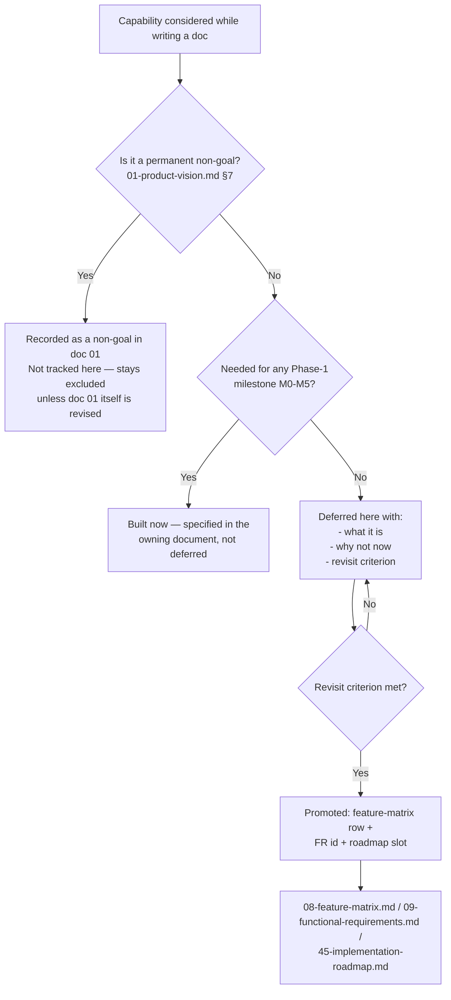
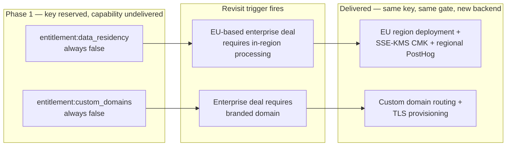

# Future Expansion Plan

This document owns every capability, market, and architectural extension that another Concourse document has explicitly deferred rather than built in Phase 1. Nothing here is an open question — [00-foundation.md](00-foundation.md) §13 requires every deferral across `/docs` to resolve to a justified decision *or* an explicit assignment to this document, and this is that document. Each item below states what it is, which document(s) deferred it and why, and — the part that makes a deferral different from a "no" — the concrete, observable **revisit criterion** that would justify building it. Items are grouped by theme (mobile & native, enterprise & compliance, monetization & market expansion, AI & personalization, platform ops & integrations, data & privacy, product & attendee experience). This document does not re-litigate the reasoning already recorded in the deferring document — it consolidates, cross-references, and adds the trigger. It also does not own the permanent **non-goals** in [01-product-vision.md](01-product-vision.md) §7 (a non-goal means "not on the roadmap at all unless that document is revised"); where a non-goal and a deferred item are adjacent (e.g., hybrid/virtual capture), this document says so explicitly.

---

## 1. Purpose and Scope

**What this document is for:** every other document in `/docs` is written as a locked, load-bearing decision record for Phase 1 (milestones M0–M5, [08-feature-matrix.md](08-feature-matrix.md) §2). Writing "we'll figure this out later" directly into a locked document would violate the "no TBD" rule in [00-foundation.md](00-foundation.md) §13 and quietly reopen decisions that are supposed to be closed. Instead, every document that hits a genuine "not now, but plausibly later" decision names the capability, states why Phase 1 doesn't need it, and points here. This document is where those pointers land.

**What this document is not:**

1. **Not a roadmap with dates.** Sequencing, staffing, and calendar commitments belong to [45-implementation-roadmap.md](45-implementation-roadmap.md). This document supplies the *content* a future roadmap revision would sequence — it does not itself promise when, or in what order, anything ships.
2. **Not a backlog of nice-to-haves.** Every entry here was already scoped and deliberately excluded by a specific document, for a stated reason, at a specific point in Concourse's architecture. This is a register of *closed, revisitable* decisions, not a wishlist.
3. **Not a home for non-goals.** [01-product-vision.md](01-product-vision.md) §7 lists commitments the product will never become (a ticketing company, a horizontal CRM, a badge-hardware vendor, a venue marketplace). Those stay in doc 01. This document holds things Concourse plausibly *will* become, once a stated trigger fires.

**Counting convention:** this document catalogs **41 distinct deferred items** across seven themes, drawn from every document in `/docs` that cites `44-future-expansion-plan.md`. Where two documents defer the same underlying capability from different angles (e.g., data residency appears in the entitlement registry, the storage layer, and the compliance posture), it is listed once, in its primary theme, with every deferring document cross-referenced.

---

## 2. How Deferral Works in This Blueprint

Every item below followed the same discipline before landing here, and every future deferral should too:

Three properties this document enforces on every row:

1. **A revisit criterion is mandatory, not optional.** "We might want this eventually" is not a deferral, it is an open question — and open questions are disallowed by [00-foundation.md](00-foundation.md) §13. Every row states the concrete signal (a contract clause, a metric threshold, a support-volume level, a milestone being scheduled) that would justify building it.
2. **A seam is noted where one already exists.** Several Phase-1 decisions were made specifically so a deferred item stays buildable without a rewrite — the D3 native-readiness seam (§3), the reserved `entitlement:data_residency`/`entitlement:custom_domains` keys (§4), the i18n externalization work already done in [10-non-functional-requirements.md](10-non-functional-requirements.md) §9. This document notes those seams so a future implementer knows what's already in place versus what starts from zero.
3. **Promotion removes the row.** When a revisit criterion fires and the item is scheduled, it graduates out of this document into a feature-matrix row, one or more `FR-*` ids, and a roadmap slot — the same discipline [00-foundation.md](00-foundation.md) §14 uses for its own Amendments Log. §11 below specifies that process.

---

## 3. Mobile & Native Platforms

Concourse ships Phase 1 as a PWA-first, single-codebase product (foundation D3). Every item in this theme is a consequence of that decision's deliberate incompleteness: D3 chose "PWA now, native-ready architecture" over "native now," and the seam it built is what every row below would consume.

| Item | What it is | Deferred by | Why not now | Revisit criterion |
|---|---|---|---|---|
| **Native React Native apps** | iOS/Android native apps for Sofia (Attendee App) and Jamal (Exhibitor Portal mobile capture) | [00-foundation.md](00-foundation.md) D3, [01-product-vision.md](01-product-vision.md) §8, [03-user-personas.md](03-user-personas.md) §8, [04-user-journey.md](04-user-journey.md), [07-attendee-journey.md](07-attendee-journey.md), [08-feature-matrix.md](08-feature-matrix.md) §6 | PWAs close the practical native gap for floor operations today (offline-capable, installable, one codebase) at a fraction of the engineering cost of maintaining three codebases; foundation principle 3 ("one source of truth") argues against a parallel native stack until PWA limitations are actually blocking adoption | A design-partner or prospect cites a specific PWA limitation (e.g., background push reliability, camera API gaps for badge scanning, app-store discoverability) that is costing registered deals, not a hypothetical preference for "a real app" |
| **React Native component parity for `packages/ui`** | Whether Marquee's React/Tailwind components get a parallel React Native implementation, a shared headless-logic layer, or a wholly separate native design system | [40-ui-component-library.md](40-ui-component-library.md) §13 | Undecidable in the abstract — the right answer depends on how much of `packages/ui`'s logic (validation, state machines) versus rendering (DOM/Tailwind) a native app would actually reuse, which isn't knowable until the native milestone has a shape | The native-apps item above is scheduled into [45-implementation-roadmap.md](45-implementation-roadmap.md) |
| **Native-app token/session storage hardening** | Session/token storage patterns specific to iOS Keychain / Android Keystore, beyond the browser-storage model the PWA session strategy assumes | [20-session-strategy.md](20-session-strategy.md) (Ownership table) | The opaque-session-token model ([20-session-strategy.md](20-session-strategy.md)) already works for any HTTP client; native-specific secure-storage hardening is only worth specifying once a native client exists to store tokens on | Native apps item above enters active development |
| **Public/external consumption of `@concourse/ui`** | Publishing the component library outside the single Next.js app — e.g., an embeddable widget SDK for exhibitor microsites | [40-ui-component-library.md](40-ui-component-library.md) §13 | Today `@concourse/ui` has exactly one consumer; publishing a package implies a versioning/support contract with external consumers that has no product surface to justify it yet | A concrete product surface requiring it is scoped (e.g., an "embed our booth on your own site" feature for exhibitors) |

---

## 4. Enterprise & Compliance

Every item here is gated, in the code that exists today, by an `enterprise`-plan entitlement key that is already reserved in the registry ([08-feature-matrix.md](08-feature-matrix.md) §3) but resolves to "off" for every tenant. The keys exist so adding the capability later is additive — no schema migration to introduce the gate itself, only to implement what sits behind it.

| Item | What it is | Deferred by | Why not now | Revisit criterion |
|---|---|---|---|---|
| **EU data residency delivery** (`entitlement:data_residency`) | In-region (EU) processing and storage for tenants that require it — a second AWS region, a customer-managed KMS key (SSE-KMS) replacing default SSE-S3 encryption, and a regional PostHog deployment (or equivalent in-region flag-evaluation path) for tenants covered by the entitlement | [00-foundation.md](00-foundation.md) §6, [02-business-goals.md](02-business-goals.md) §1.2/§8, [08-feature-matrix.md](08-feature-matrix.md) §3, [10-non-functional-requirements.md](10-non-functional-requirements.md) §4, [26-file-storage.md](26-file-storage.md) §3, [34-feature-flags-and-experimentation.md](34-feature-flags-and-experimentation.md) §13, [38-data-retention-privacy-compliance.md](38-data-retention-privacy-compliance.md) §8, [43-security-architecture.md](43-security-architecture.md) §4/§10 | Phase 1 is single-region (`us-east-1`) with Standard Contractual Clauses / the EU-US Data Privacy Framework covering EU attendee data in the interim; a second region is a materially larger infrastructure and on-call surface than the beachhead segment (mid-market, largely US-first, [02-business-goals.md](02-business-goals.md) §2.1) currently needs | First signed enterprise contract (GTM-3) that contractually requires in-region EU processing |
| **Full region-level disaster recovery** | Cross-region standby with RTO measured in hours rather than minutes, beyond the Multi-AZ failover Phase 1 already provides automatically | [10-non-functional-requirements.md](10-non-functional-requirements.md) §4 | Multi-AZ Postgres/Redis already covers AZ-level failure (the realistic Phase-1 failure mode); a documented cross-region DR runbook is a materially larger commitment with no design-partner or GTM-1/2 requirement driving it | First enterprise contract that contractually requires a documented DR runbook beyond Multi-AZ |
| **Custom domains** (`entitlement:custom_domains`) | Organizer-branded domains (e.g., `expo.acmeevents.com`) routing to Concourse instead of the platform's own domain/slug scheme | [00-foundation.md](00-foundation.md) §5/§6, [02-business-goals.md](02-business-goals.md) §1.2 | Path-based tenant resolution by slug ([00-foundation.md](00-foundation.md) §5) is simpler to operate and secure (no per-tenant TLS certificate lifecycle) and no Phase-1 segment has asked for white-label URLs | First enterprise prospect for whom domain branding is a stated procurement requirement |
| **Full white-labeling** | Custom fonts, radii, and arbitrary palettes beyond the three re-targetable tokens (`--mq-bg-brand`, `--mq-bg-brand-hover`, `--mq-text-link`) event-accent theming already supports | [39-design-system.md](39-design-system.md) §4.5, [08-feature-matrix.md](08-feature-matrix.md) §6 | Full white-labeling multiplies the accessibility and visual-regression QA matrix (every organizer's arbitrary palette must independently clear WCAG 2.2 AA) for a value proposition Marquee's constrained event-accent model already covers for the vast majority of organizer branding needs | Multiple `enterprise` prospects independently name full white-labeling as a blocking requirement, not a preference |
| **Exhibitor-scoped public API** | A version of the Public API (today `entitlement:public_api`, `enterprise` organizer plan only) issued to exhibitor organizations directly, rather than routed through the CRM connector framework | [08-feature-matrix.md](08-feature-matrix.md) §4.18/§6, [28-permission-model.md](28-permission-model.md) §3.10, [35-integrations-and-connectors.md](35-integrations-and-connectors.md) §6.4/§8 | `api_keys` is already an org-generic entity ([00-foundation.md](00-foundation.md) §7) — the seam exists — but exhibitor organizations are a materially different buyer (no internal engineering resource assumed) than the enterprise organizers this key currently serves, and the built-in CRM connectors (Salesforce, HubSpot) plus the organizer-side webhook/API escape hatch already cover exhibitor integration needs in Phase 1 | An exhibitor-side integration need surfaces that neither a built-in CRM connector nor the organizer's own webhook feed can satisfy |
| **API v2 deprecation machinery** | `Deprecation`/`Sunset` response headers, per-key usage reporting to "chase stragglers," and the ≥12-month v1 support window process | [18-api-architecture.md](18-api-architecture.md) §3.10 | There is no v2 yet — v1's non-breaking-change discipline (new fields, new enums, tolerant-reader client) has absorbed every change so far without requiring a breaking version; building deprecation tooling for a version that doesn't exist is speculative | A breaking API change is scoped that cannot be expressed as a v1-compatible addition (§3.10's own criteria) |
| **Full write-capable user impersonation** | "Act as" impersonation with write ability, beyond the read-only "view as" mode (feature S2, [08-feature-matrix.md](08-feature-matrix.md) §4.19; `FR-ADMIN-002`, [09-functional-requirements.md](09-functional-requirements.md) §4.19) that already ships in M2 | [18-api-architecture.md](18-api-architecture.md) §5.14, [28-permission-model.md](28-permission-model.md) §9.3 | Read-only impersonation already resolves the majority of Alex Kim's support-diagnosis needs (§7 cross-tenant read paths, [28-permission-model.md](28-permission-model.md)); a write-capable mode multiplies audit and consent complexity (whose action is it, does the tenant need to be told before it happens vs. after) for support cases that haven't yet proven read-only is insufficient | Support volume data shows a recurring class of issue that read-only impersonation cannot resolve (e.g., fixing a stuck record on a tenant's behalf without walking them through it live) |
| **Formal SBOM export** | A generated Software Bill of Materials artifact for customer/examiner consumption | [43-security-architecture.md](43-security-architecture.md) §8/§11 | No current customer or examiner requirement drives it; the underlying dependency inventory (GitHub Dependabot, `pnpm` lockfile) already exists, so producing an SBOM export is a formatting exercise once required, not new tracking infrastructure | First enterprise contract that contractually requires a delivered SBOM |
| **Per-tenant extended retention / legal-hold overrides** | A specific enterprise customer's contractual or legal-hold requirement to retain audit logs or business data longer than the platform-standard 7-year (`audit_logs`) or entity-specific ([38-data-retention-privacy-compliance.md](38-data-retention-privacy-compliance.md)) windows | [29-audit-logging-architecture.md](29-audit-logging-architecture.md) §8, [38-data-retention-privacy-compliance.md](38-data-retention-privacy-compliance.md) §11, [43-security-architecture.md](43-security-architecture.md) §11 | The standard schedules already satisfy every named compliance regime (SOC 2, GDPR) Concourse targets in Phase 1; a per-tenant override is a data-model and purge-job complication (a retention exception table, per-tenant purge-job branching) with no customer asking for it yet | First enterprise contract that requires a documented retention exception beyond the platform default |

---

## 5. Monetization & Market Expansion

Every item in this theme is a business-model or billing-mechanics extension the two-sided model (foundation D4) and Stripe Billing integration ([36-billing-and-payments-architecture.md](36-billing-and-payments-architecture.md)) deliberately left out of Phase 1's simpler shape.

| Item | What it is | Deferred by | Why not now | Revisit criterion |
|---|---|---|---|---|
| **Paid attendee ticketing/payments** | Charging attendees for event admission through Concourse itself | [00-foundation.md](00-foundation.md) D4 (attendees always free), [04-user-journey.md](04-user-journey.md), [05-organizer-journey.md](05-organizer-journey.md) O-6, [07-attendee-journey.md](07-attendee-journey.md), [08-feature-matrix.md](08-feature-matrix.md) §6 | Attendee density is the flywheel's fuel (foundation D4, [01-product-vision.md](01-product-vision.md) §5.2) — charging attendees would suppress exactly the participation that generates Qualified Connections; consumer ticketing is also a distinct, low-margin, fraud/regulation-heavy business Concourse is architecturally not built to be ([01-product-vision.md](01-product-vision.md) §7 non-goal, "not a ticketing company") | An organizer segment emerges where paid admission is standard practice and the organizer explicitly requests Concourse handle it (not merely import ticketing-vendor data, which is already supported) — revisit only alongside a re-examination of the adjacent non-goal in [01-product-vision.md](01-product-vision.md) §7 |
| **Sponsorship/ad inventory** | Paid placement, banner/sponsor slots, or promoted-listing inventory sold to exhibitors or third parties beyond tier-based entitlements | [08-feature-matrix.md](08-feature-matrix.md) §6 | The tier ladder (`essentials`/`growth`/`intelligence`) already monetizes exhibitor value through capability, not attention-inventory; sponsorship/ad models risk polluting the intelligence-over-records product principle (P2) with impression-based incentives QCE is explicitly designed to resist | A design-partner or GTM-2 organizer requests sponsorship inventory as a revenue line they want Concourse to operate on their behalf |
| **Self-serve mid-event exhibitor tier downgrade with partial refund** | An exhibitor downgrading `intelligence`→`growth` (or similar) mid-event with a prorated refund, self-service | [36-billing-and-payments-architecture.md](36-billing-and-payments-architecture.md) §16 | Phase 1's downgrade handling (Q5, [08-feature-matrix.md](08-feature-matrix.md) §4.17) already covers subscription lapse gracefully (grace period, seat freeze, no data loss); a self-serve mid-event *voluntary* downgrade with proration is a materially rarer case with no observed demand | Support volume shows exhibitors requesting mid-event downgrades often enough to justify self-service over a manual Alex Kim override (Q2) |
| **Full dispute/chargeback response workflow** | Automated evidence submission and workflow beyond Alex Kim's manual notification-driven response | [36-billing-and-payments-architecture.md](36-billing-and-payments-architecture.md) §16 | Stripe's own dispute tooling plus a manual notification to Alex Kim already handles Phase-1 dispute volume; building a dedicated workflow ahead of volume data is speculative | Dispute volume per event/quarter exceeds what manual handling can process within Stripe's response-time windows |
| **Enterprise invoiced/PO-based contract billing** | A distinct Stripe Invoicing integration for customers who require purchase-order-based, invoiced payment terms rather than card-based subscription checkout | [36-billing-and-payments-architecture.md](36-billing-and-payments-architecture.md) §16 | The manual-override provisioning path (Q2, [08-feature-matrix.md](08-feature-matrix.md) §4.17) already lets Alex Kim stand up an enterprise contract's entitlements without card-based checkout; a dedicated invoicing integration is only worth the engineering cost once PO-based deals are frequent enough that manual provisioning becomes an operational bottleneck | ≥3 enterprise contracts (GTM-3 exit criterion, [02-business-goals.md](02-business-goals.md) §3) require invoiced terms as standard, not exception |
| **Multi-currency billing** | Billing organizer/exhibitor plans in a currency other than USD | [36-billing-and-payments-architecture.md](36-billing-and-payments-architecture.md) §16 | Phase 1 is USD-only end to end, consistent with `entitlement:ai_budget_daily_usd`'s existing USD-only precedent ([08-feature-matrix.md](08-feature-matrix.md) §3); the beachhead segment (mid-market US/English-primary events, [02-business-goals.md](02-business-goals.md) §2.1) does not require it | Signed deal in a market where local-currency billing is a stated procurement requirement (same trigger class as the i18n delivery item, §9) |
| **True usage-metered billing for attendee volume** | Real-time Stripe metered billing on registered-attendee count, replacing the current periodic reconciliation | [36-billing-and-payments-architecture.md](36-billing-and-payments-architecture.md) §16 | Attendee volume per event shifts slowly enough within a single event's lifecycle that periodic reconciliation captures the same billing outcome as real-time metering, without the added Stripe integration surface | A pricing model change (e.g., true pay-as-you-go across concurrent events) makes real-time metering materially more accurate than periodic reconciliation |
| **Explicit not-now market segments** | Consumer expos/fan conventions, festivals, corporate internal events, and academic conferences | [02-business-goals.md](02-business-goals.md) §2.3, [03-user-personas.md](03-user-personas.md) §7 (anti-personas: festival producer, conference chair) | Misaligned buyer economics (no exhibitor-pipeline revenue to prove ROI against), or an agenda-centric shape the platform's floor-first domain model doesn't serve well, per the segment analysis in [02-business-goals.md](02-business-goals.md) §2 and the non-goals in [01-product-vision.md](01-product-vision.md) §7 | A specific segment shows exhibitor-pipeline economics comparable to the mid-market B2B beachhead (e.g., a large academic conference with a genuine expo-floor sponsor market) |
| **Pricing-point experiments** | Setting actual currency price points (vs. the locked pricing *philosophy*, [02-business-goals.md](02-business-goals.md) §1.4) and testing them | [02-business-goals.md](02-business-goals.md) §8, [46-marketing-site.md](46-marketing-site.md) §5.1 | Pricing philosophy (value-metric based, never-tax-collaboration, anchor-to-ROI) is locked; actual numbers are deliberately set against design-partner data rather than guessed upfront | Sufficient design-partner QCE and attach-rate data exists (GTM-1 exit criteria, [02-business-goals.md](02-business-goals.md) §3) to set defensible price points |

---

## 6. AI & Personalization

Every AI feature ships with a deterministic fallback in Phase 1 (foundation §10); the items below are *extensions* to the five canonical AI features, not features currently missing a fallback.

| Item | What it is | Deferred by | Why not now | Revisit criterion |
|---|---|---|---|---|
| **Runtime prompt-management UI** | A UI allowing prompt edits without a code review/deploy cycle | [21-ai-architecture.md](21-ai-architecture.md) §4 | Prompts are code (`packages/ai/src/prompts/`), versioned and hash-checked in CI; an unreviewed prompt change is a production change to a revenue-facing AI feature, and a runtime editor would bypass exactly the review discipline that keeps prompt drift impossible | Prompt-iteration operational volume (edits per week across the five AI features) demands faster-than-deploy turnaround that the current git-revert rollback model can't service |
| **Hybrid lexical fusion for RAG retrieval** | Combining lexical (keyword/BM25-style) signal with the current cosine-similarity + rerank pipeline, to close any exact-identifier recall gap (booth numbers, SKUs, agenda track codes) | [22-rag-architecture.md](22-rag-architecture.md) §8/§12 | Canonical identifiers are already written into chunk text at chunking time, and `rerank-2.5`'s cross-encoder is materially more sensitive to lexical overlap than cosine similarity alone — the mitigation already in place is expected to recover most exact-match precision without adding a second retrieval pathway | Retrieval evals (§8 of [22-rag-architecture.md](22-rag-architecture.md)) show a sustained exact-match recall gap the existing mitigation doesn't close |
| **Multi-provider firmographic enrichment with waterfall fallback** | A second enrichment vendor with waterfall fallback, supplementing the single commercial B2B enrichment API Phase 1 ships with | [35-integrations-and-connectors.md](35-integrations-and-connectors.md) §4.3/§8 | One provider, centrally metered like AI spend, is sufficient until coverage-gap data says otherwise; adding a second vendor before evidence of a gap duplicates integration surface for unproven benefit | Coverage-gap measurement (the same eval discipline used for AI features) shows a material fraction of leads the single provider can't enrich |
| **Person-level (`user`) rollout and experimentation granularity** | Feature-flag and experiment targeting at the individual-attendee level, rather than the current `event`/`organization` granularity | [34-feature-flags-and-experimentation.md](34-feature-flags-and-experimentation.md) §13 | The organizer-mandated, whole-floor deployment model (foundation principle "one source of truth," [02-business-goals.md](02-business-goals.md) §2.1) makes event-level rollout the natural unit at beachhead scale — every attendee at an event should see the same platform behavior, since Smart Matchmaking and QCE depend on whole-floor participation | Self-serve, non-organizer-mandated adoption (GTM-2/3) makes person-level experiments (e.g., individual attendees seeing different Expo Copilot UI treatments within the same event) valuable enough to justify the added statistical and privacy surface |

---

## 7. Platform Ops & Integrations

Infrastructure, search, observability, background-job topology, CRM/connector breadth, and the smaller marketing-site launch items that don't justify Phase-1 engineering investment yet.

| Item | What it is | Deferred by | Why not now | Revisit criterion |
|---|---|---|---|---|
| **Bidirectional CRM sync** | CRM-side stage changes (e.g., a Salesforce opportunity stage change) flowing back into Concourse `leads` | [35-integrations-and-connectors.md](35-integrations-and-connectors.md) §2.1/§8 | The lead record in Concourse is the single source of truth (product principle P3, [01-product-vision.md](01-product-vision.md) §6); a two-way sync recreates exactly the "six tools, six copies" failure mode Concourse exists to eliminate, and requires a reconciliation model (whose write wins on conflict) this document deliberately does not build | Design-partner demand overrides the reconciliation-complexity cost with a specific, recurring workflow need |
| **Additional built-in CRM connectors** | Microsoft Dynamics, Pipedrive, and other CRMs beyond the Salesforce/HubSpot connectors shipping at launch | [35-integrations-and-connectors.md](35-integrations-and-connectors.md) §8 | The connector interface (`CrmConnector`, §2.2 of that document) makes a new connector a bounded, additive implementation, not an architecture change — sequencing which connector comes third is a roadmap question, not an open architectural one; the public API/webhook escape hatch already covers any CRM in the interim | Exhibitor demand data (support tickets, upsell conversations) names a specific third CRM often enough to justify building it ahead of the public-API escape hatch |
| **Reusable cross-event venue catalog** | A `venues` record reusable across event editions at the same physical location, instead of one `venues` row per event | [16-database-schema.md](16-database-schema.md) §4.2 | An organizer re-entering an address for a returning venue is a minor annoyance, not a blocked workflow — no Phase-1 feature requires venue reuse, and the O-10 rebooking clone flow already copies the floor plan/booth layout forward | Organizer feedback (post-GTM-1) shows repeated venue re-entry is a recurring friction point in the O-10 rebooking flow |
| **Postgres FTS → dedicated search service** | Replacing per-tenant `tsvector` indexes with Elasticsearch/Typesense or an equivalent dedicated search tier | [11-information-architecture.md](11-information-architecture.md) §6 | At Phase-1 scale (hundreds of thousands of registrations per event, foundation D5), tenant-filtered `tsvector` indexes already serve sub-50ms lookups (NFR-PERF-16, [10-non-functional-requirements.md](10-non-functional-requirements.md)); a dedicated search tier adds an infrastructure layer and a consistency problem for no benefit at this scale | Search latency or relevance measurably degrades at the D5 design-ceiling scale (5,000 exhibitors / 250,000 registrations per event) in a way Postgres FTS tuning can't fix |
| **Full tail-based sampling for observability** | Buffering every OTel trace platform-wide before deciding what to keep, replacing the current head-based sampling rules | [31-observability.md](31-observability.md) §3.4 | Head-based sampling rules already capture every trace an incident review would want at current peak trace volume (~7,500 spans/s briefly, NFR-CAP-09); tail-based sampling requires a dedicated collector tier not warranted at that volume | Baseline sample rate proves insufficient for a real incident reconstruction |
| **Dedicated ECS task-definition split for AI-heavy background workloads** | A second ECS task definition reserved for `ai-batch`-class jobs, separating them from the general worker pool | [27-background-jobs-architecture.md](27-background-jobs-architecture.md) (Ownership table) | `ai-batch` and network-bound queues (`file-av-scan`, `webhook-deliver`) already have independent BullMQ concurrency limits and the AI gateway's own token buckets — isolation already exists at the software level; a second deployable is only worth the operational overhead if production metrics show one queue's volume degrading another's latency | Production queue-depth/latency metrics (§10 of that document) show cross-queue contention the existing software-level isolation doesn't resolve |
| **Multi-recipient/on-call support routing** | Scaling `support.help-escalation` beyond Alex Kim as the single named recipient — a shared roster, round-robin assignment, or an on-call rotation | [30-help-center-and-support.md](30-help-center-and-support.md) §7.3, [33-notification-system.md](33-notification-system.md) §13 | Phase 1 has exactly one platform-admin persona (Alex Kim) and no support-team entity exists to assign escalations to; building routing infrastructure ahead of headcount is speculative | Platform-team headcount grows beyond one, or escalation volume exceeds one person's response-time targets (§7.3 of [30-help-center-and-support.md](30-help-center-and-support.md)) |
| **Escalation attachment uploads** | A file-attachment field on the in-app Help Center escalation widget and the public contact form | [30-help-center-and-support.md](30-help-center-and-support.md) §7.2 | `files.owner_type` is a fixed enum with no escalation-shaped value; the auto-captured `route` field already gives Alex Kim a direct link to reproduce the reported view, which covers most of what a screenshot would show | Attachment support becomes worth the schema change (e.g., escalations routinely need visual evidence the auto-captured route doesn't convey) |
| **SMS as a fourth notification channel** | Adding SMS alongside email/push/in-app | [33-notification-system.md](33-notification-system.md) §13 | No requirement has surfaced anywhere in docs 00–31/46 for SMS specifically; the three existing channels cover every Phase-1 use case including the "works in a concrete hall" offline-tolerant design | An enterprise deal requires SMS as a stated notification channel |
| **In-app notification grouping/digest** | Collapsing multiple related notifications ("3 new leads") into one row instead of individually listed items | [33-notification-system.md](33-notification-system.md) §13 | Every notification is already individually actionable today; this is a UX refinement, not a Phase-1 blocker | Notification-volume feedback from active exhibitor reps shows list-clutter is hurting usability, not merely aesthetics |
| **Marketing site: CAPTCHA (Cloudflare Turnstile) escalation** | Adding bot-mitigation CAPTCHA to the public contact form | [46-marketing-site.md](46-marketing-site.md) §7.3 | A CAPTCHA vendor is a dependency not taken pre-emptively; the Redis-bucket rate limit plus honeypot field is the Phase-1 posture | Spam rate through the rate limiter exceeds 5% of submissions for two consecutive weeks |
| **Marketing site: legal document version-history page** | A public "policy history" page listing prior published versions of `legal_documents`, beyond the current-version-only public route | [46-marketing-site.md](46-marketing-site.md) §9.4 | Older versions remain queryable by `platform:admin` for compliance/audit purposes already; a public-facing history page is additional UI surface with no demonstrated user demand | A specific legal, sales, or compliance request for a public policy-history page is made |
| **Marketing site: social/brand account placeholders** | Real social-media links replacing the external placeholder links in the marketing-site footer | [46-marketing-site.md](46-marketing-site.md) §3.2 | Brand social accounts don't exist yet — this is a launch-checklist item, not a design or architecture decision | Brand accounts are created ahead of public launch |
| **Marketing site: `Offer`/`Product` structured data (JSON-LD)** | Adding schema.org `Offer` markup to the `/pricing` page | [46-marketing-site.md](46-marketing-site.md) §10 | `Offer` schema expects a price, and Phase 1 deliberately publishes none (pricing-philosophy-before-price-points decision, [02-business-goals.md](02-business-goals.md) §1.4) | Actual price points are set (same trigger as the pricing-experiments item, §5) |

---

## 8. Data & Privacy

Extensions to the retention, consent, and audit machinery in [38-data-retention-privacy-compliance.md](38-data-retention-privacy-compliance.md) and [29-audit-logging-architecture.md](29-audit-logging-architecture.md) that go beyond what GDPR/CCPA compliance and the current enterprise posture require today.

| Item | What it is | Deferred by | Why not now | Revisit criterion |
|---|---|---|---|---|
| **Automated freeform-text PII redaction** | Automatically scanning and redacting personal data that a rep names directly inside freeform `lead_notes.body_md` text | [38-data-retention-privacy-compliance.md](38-data-retention-privacy-compliance.md) §4/§11 | Mirrors the identical "redact at the source, manually" pattern already locked in [23-knowledge-base-architecture.md](23-knowledge-base-architecture.md) §10.2 for a structurally identical problem (a speaker bio naming a third party); a DSAR that specifically flags a note routes to the exhibitor for manual redaction today, which is proportionate at current volume | DSAR volume flagging note text exceeds what manual redaction can handle at an acceptable turnaround time |
| **Read-access logging** | Logging *who viewed* a resource, as distinct from the write/mutation logging `audit_logs` already captures exhaustively | [29-audit-logging-architecture.md](29-audit-logging-architecture.md) §7 | The write volume of "every `GET`" is orders of magnitude larger than control-plane mutations and would need its own sampling/retention posture entirely separate from the 7-year, every-row guarantee this document's mutation logging provides; no compliance regime Concourse targets in Phase 1 requires it | An enterprise or compliance requirement specifically calls for read-access (view) logging, not merely write-access logging |

*Per-tenant extended retention/legal-hold overrides is cataloged once, under Enterprise & Compliance (§4), since both its enterprise-contract trigger and its data-retention mechanics are addressed there.*

---

## 9. Product & Attendee Experience

Attendee- and exhibitor-facing capabilities named directly in [08-feature-matrix.md](08-feature-matrix.md) §6's Phase-1 non-features list, plus the adjacent incident-management gap called out in the organizer journey.

| Item | What it is | Deferred by | Why not now | Revisit criterion |
|---|---|---|---|---|
| **Badge-printer hardware integrations** | Direct integration with physical badge-printing hardware at check-in, beyond the print-friendly PDF badge (F6) Phase 1 ships | [08-feature-matrix.md](08-feature-matrix.md) §6, [01-product-vision.md](01-product-vision.md) §7 (non-goal: "not a badge-hardware vendor") | Hardware integration is inventory, logistics, and certification — a different business — and hardware lock-in is exactly the dependency organizers resent about incumbents (e.g., Bizzabo's wearables); the vendor-neutral, opaque `badge_code` QR (foundation §12) already works with any commodity scanner or printer, and the PDF badge (F6) is the Phase-1 answer for on-site printing | An enterprise organizer's existing badge-printer hardware fleet requires a direct integration (vs. printing the generated PDF) as a stated procurement blocker |
| **Indoor turn-by-turn navigation** | Step-by-step wayfinding through the venue (beyond the pan/zoom interactive floor map and booth locator Phase 1 ships) | [08-feature-matrix.md](08-feature-matrix.md) §6 | Turn-by-turn indoor navigation typically requires venue-specific positioning infrastructure (BLE beacons, UWB, or a mapped Wi-Fi RTT survey) that Concourse does not control and that varies per venue; the interactive floor map + booth locator (C4/C5, [08-feature-matrix.md](08-feature-matrix.md) §4.3) already solves "where is this booth" without that infrastructure dependency | A venue partnership or organizer segment provides the positioning infrastructure turn-by-turn navigation would require, making it buildable without Concourse operating hardware itself |
| **Multi-language UI content (i18n delivery)** | Actual translated locale content — UI copy, notification templates, error-code `title`/`detail` strings, and a marketing-site locale strategy — built on top of the i18n *readiness* posture already shipped in Phase 1 | [08-feature-matrix.md](08-feature-matrix.md) §6, [10-non-functional-requirements.md](10-non-functional-requirements.md) §9, [33-notification-system.md](33-notification-system.md) §6/§13, [41-error-code-registry.md](41-error-code-registry.md) §16, [46-marketing-site.md](46-marketing-site.md) §10.1 | Every surface already externalizes copy through ICU MessageFormat resource files, uses `Intl` formatting, and uses logical CSS properties for RTL readiness ([10-non-functional-requirements.md](10-non-functional-requirements.md) §9) — the seam is fully built — but no Phase-1 segment (English-primary, US-first beachhead, [02-business-goals.md](02-business-goals.md) §2.1) requires an actual second locale, and translating without a market to serve has no payoff, including for AI-generated content (Expo Copilot, Organizer Pulse, Lead Intelligence, Follow-up Studio all stay English-only) | Signed enterprise or mid-market deal in a non-English-primary market |
| **Hybrid/virtual event capture** | Any capability supporting virtual or hybrid (in-person + streamed) event formats | [01-product-vision.md](01-product-vision.md) §7 (adjacent to the "not a virtual-events platform" non-goal), [03-user-personas.md](03-user-personas.md) §7 (anti-persona: the virtual-event host) | Concourse's differentiators — offline floor operations, physical presence signals, booth-visit capture — are meaningless online; virtual event platforms are a distinct product with distinct economics, and the 2020-era pivot to virtual is treated as a cautionary tale, not a template | This item sits directly adjacent to a stated non-goal in [01-product-vision.md](01-product-vision.md) §7 and is tracked here only as "hybrid *content* capture" (e.g., recording an in-person agenda session for later on-demand viewing) — a materially narrower scope than a virtual-events platform. Revisit only alongside a re-examination of that non-goal, not on its own |
| **Dedicated incident-ticketing entity** | A structured incident/ticket workflow for live-day issues, beyond the Phase-1 operational levers (announcements, status overrides, audit-logged overrides) | [05-organizer-journey.md](05-organizer-journey.md) O-8, [04-user-journey.md](04-user-journey.md), [33-notification-system.md](33-notification-system.md) §5.5 (the adjacent "safety-critical, non-optable broadcast override" item) | O-8's operational levers (targeted announcements, booth/session/check-in status overrides, all audit-logged with actor and reason) already give Marcus Webb the tools a live-day incident needs, without the schema and workflow weight of a dedicated ticketing entity — consistent with the platform's broader "no bespoke ticket entity" discipline also applied to Help Center escalation (doc 30) and the public contact form (doc 46) | A real incident-management need is demonstrated in production — e.g., recurring live-day incidents that the announcement/override levers can't adequately track or that need a stateful workflow (assigned, in-progress, resolved) rather than a one-shot broadcast |

---

## 10. Consolidated Revisit-Trigger Index

A scannable index of every item above, grouped by the *shape* of its revisit trigger rather than by theme — useful when checking "has anything just become revisit-eligible" against a specific business event (a signed contract, a metric crossing a threshold, a milestone being scheduled).

| Trigger shape | Items |
|---|---|
| **First enterprise contract requiring X** | EU data residency (§4), full region-level DR (§4), custom domains (§4), formal SBOM export (§4), per-tenant extended retention overrides (§4), enterprise invoiced/PO billing (§5, at ≥3 contracts), badge-printer hardware integration (§9) |
| **Signed deal in a new market/segment** | Multi-language UI delivery (§9), multi-currency billing (§5), explicit not-now market segments (§5) |
| **Native-apps milestone scheduled** | React Native component parity (§3), native-app token storage hardening (§3) |
| **Evals/metrics cross a measured threshold** | Hybrid lexical fusion for RAG (§6), multi-provider firmographic enrichment (§6), Postgres FTS → dedicated search (§7), full tail-based sampling (§7), ECS task-definition split (§7), CAPTCHA escalation (§7) |
| **Support/ops volume data shows a gap** | Multi-recipient support routing (§7), escalation attachment uploads (§7), mid-event tier downgrade with refund (§5), full dispute/chargeback workflow (§5), full write-capable impersonation (§4) |
| **Demonstrated demand with no current signal** | Sponsorship/ad inventory (§5), additional CRM connectors (§7), bidirectional CRM sync (§7), exhibitor-scoped public API (§4), reusable venue catalog (§7), in-app notification grouping (§7), SMS channel (§7), person-level rollout granularity (§6), public `@concourse/ui` consumption (§3) |
| **A prerequisite item ships first** | Marketing site `Offer` JSON-LD and pricing experiments (both wait on real price points, §5/§7), regional PostHog for data residency (implied by §4's EU residency item) |
| **A breaking change is scoped** | API v2 deprecation machinery (§4) |
| **A non-goal is independently revised** | Paid attendee ticketing (§5), hybrid/virtual event capture (§9) — these two are the only items whose trigger requires revisiting a decision in [01-product-vision.md](01-product-vision.md) §7 first, not merely a business signal |
| **A real operational need is demonstrated in production** | Runtime prompt-management UI (§6), dedicated incident-ticketing entity (§9), full write-capable impersonation (§4, shared) |

---

## 11. Promotion Process

When a revisit criterion in §3–§9 fires, an item leaves this document through the same discipline [00-foundation.md](00-foundation.md) §14 uses for its own Amendments Log — nothing is silently edited into history:

1. **Confirm the trigger, in writing.** The specific contract, metric, or production signal is named in the promoting change, not asserted from memory.
2. **Assign it a home.** A new or extended row in [08-feature-matrix.md](08-feature-matrix.md) §4 (with milestone and priority), one or more new `FR-*` ids in [09-functional-requirements.md](09-functional-requirements.md), and a sequencing slot in [45-implementation-roadmap.md](45-implementation-roadmap.md).
3. **Update the entitlement/permission surface if one is already reserved.** Several items (§4) already have a reserved entitlement key sitting at "off" — promotion wires the key to real logic; it does not invent a new key.
4. **Remove or annotate the row here.** The row is deleted from this document once it has a feature-matrix id to live in instead — this document holds *undelivered* deferrals only, never a duplicate shadow-copy of something already scheduled, consistent with product principle P3 ("one source of truth," [01-product-vision.md](01-product-vision.md) §6).
5. **Log the promotion** in [00-foundation.md](00-foundation.md) §14's Amendments Log if it changes a previously locked decision (e.g., D3's mobile strategy, D4's business model), since that log — not this document — is the canonical record of *why* a locked decision changed.

---

## 12. Related Documents

- [00-foundation.md](00-foundation.md) — the canonical decision record every deferral in this document ultimately traces back to (§13's "no TBD" rule, §14's Amendments Log pattern this document's promotion process follows)
- [01-product-vision.md](01-product-vision.md) — non-goals (§7) this document deliberately does not duplicate, and the product principles (§6) every "why not now" reasons from
- [02-business-goals.md](02-business-goals.md) — GTM phases and segment analysis behind every market-expansion and pricing item in §5
- [03-user-personas.md](03-user-personas.md) — anti-personas behind the hybrid/virtual and market-segment items in §5 and §9
- [08-feature-matrix.md](08-feature-matrix.md) — the entitlement key registry (§3) most enterprise items in §4 are already reserved against, and the destination every promoted item (§11) resolves to
- [09-functional-requirements.md](09-functional-requirements.md) — the destination for testable requirements once an item is promoted (§11)
- [10-non-functional-requirements.md](10-non-functional-requirements.md) — the i18n readiness seam (§9) and DR/availability posture (§4) this document's items build on top of
- [16-database-schema.md](16-database-schema.md) — the venue-catalog and entitlement-table schema decisions referenced in §4 and §7
- [18-api-architecture.md](18-api-architecture.md) — the D3 native-readiness seam (§3), API versioning policy (§4), and impersonation exclusion (§4) this document expands on
- [20-session-strategy.md](20-session-strategy.md) — native-app session hardening (§3)
- [21-ai-architecture.md](21-ai-architecture.md) — prompt-management and the five AI features' deterministic-fallback discipline behind §6
- [22-rag-architecture.md](22-rag-architecture.md) — the hybrid-retrieval revisit criterion in §6
- [26-file-storage.md](26-file-storage.md) — the SSE-KMS upgrade path behind the EU data residency item in §4
- [27-background-jobs-architecture.md](27-background-jobs-architecture.md) — the ECS task-definition split item in §7
- [28-permission-model.md](28-permission-model.md) — the impersonation and exhibitor-API deferrals in §4, referenced from the role/permission matrix
- [29-audit-logging-architecture.md](29-audit-logging-architecture.md) — read-access logging and retention-override items in §8
- [30-help-center-and-support.md](30-help-center-and-support.md) — support-routing and attachment items in §7
- [31-observability.md](31-observability.md) — the tail-sampling revisit trigger in §7
- [33-notification-system.md](33-notification-system.md) — the channel, digest, and incident-override items in §7 and §9
- [34-feature-flags-and-experimentation.md](34-feature-flags-and-experimentation.md) — person-level rollout and regional PostHog deferrals in §6 and §4
- [35-integrations-and-connectors.md](35-integrations-and-connectors.md) — CRM sync and enrichment deferrals in §6 and §7
- [36-billing-and-payments-architecture.md](36-billing-and-payments-architecture.md) — every billing-mechanics deferral in §5
- [38-data-retention-privacy-compliance.md](38-data-retention-privacy-compliance.md) — PII-redaction and residency-adjacent deferrals in §4 and §8
- [39-design-system.md](39-design-system.md) — the white-labeling deferral in §4
- [40-ui-component-library.md](40-ui-component-library.md) — the React Native parity and external-consumption questions in §3
- [41-error-code-registry.md](41-error-code-registry.md) — translated error copy behind the i18n item in §9
- [43-security-architecture.md](43-security-architecture.md) — SBOM export and the compliance-roadmap items in §4
- [45-implementation-roadmap.md](45-implementation-roadmap.md) — the sequencing destination every promoted item (§11) feeds into
- [46-marketing-site.md](46-marketing-site.md) — the marketing-site launch items in §7 and the locale-strategy item in §9
