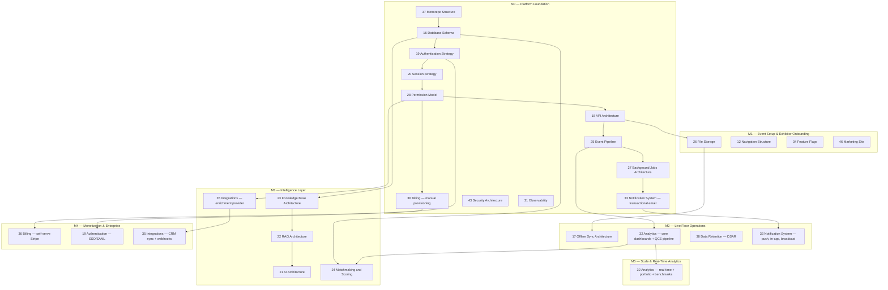
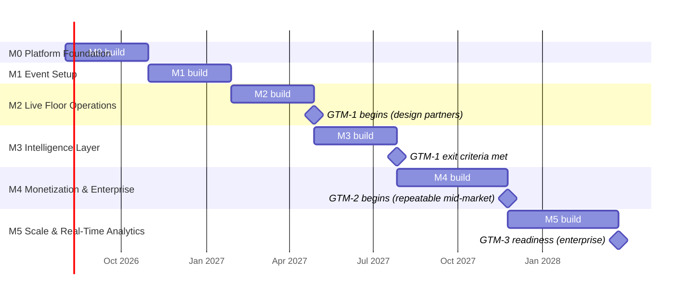

# Implementation Roadmap

This document owns milestone sequencing, dependency ordering between architectural modules, directional staffing shape per milestone, and GTM-phase alignment for building Concourse. It is the execution plan that sits downstream of [08-feature-matrix.md](08-feature-matrix.md) (which owns milestone *scope membership* and exit-criteria authorship) and [02-business-goals.md](02-business-goals.md) (which owns the GTM phases and business risk register this plan must satisfy). This document does not re-derive scope, re-litigate exit criteria, or restate business goals — it sequences the build against them and states who is needed, in what shape, at each step.

---

## 1. Scope and Ownership

| This document owns | Owned elsewhere instead |
|---|---|
| Dependency ordering between architectural documents (00–43, 46) | Feature scope per milestone — [08-feature-matrix.md](08-feature-matrix.md) §2, §4 |
| Directional staffing shape (frontend/backend/AI/platform) per milestone | Testable requirements behind each feature — [09-functional-requirements.md](09-functional-requirements.md) |
| Calendar sequencing and the P1 slippage sign-off log (§9) | Business risk identification and mitigation strategy — [02-business-goals.md](02-business-goals.md) §7 |
| GTM-phase-to-milestone alignment | GTM phase definitions and exit criteria — [02-business-goals.md](02-business-goals.md) §3 |
| Exit-criteria restatement (verbatim, per milestone, §4) | Exit-criteria authorship — [08-feature-matrix.md](08-feature-matrix.md) §2 |

The milestone identifiers M0–M5 are canonical per [08-feature-matrix.md](08-feature-matrix.md) §2 and are never renumbered or redefined here.

---

## 2. Sequencing Principles

Concourse's build order follows one rule, consistent with product principle 5 in [00-foundation.md](00-foundation.md) ("earn enterprise trust... tenancy, permissions, and audit are foundations, not add-ons"): **no feature ships before the architectural module that gates it exists.** Concretely:

1. **Data before identity.** [16-database-schema.md](16-database-schema.md) must exist before [19-authentication-strategy.md](19-authentication-strategy.md) can be implemented — `users`, `organizations`, and `organization_memberships` are schema before they are login flows.
2. **Identity before access control.** [19-authentication-strategy.md](19-authentication-strategy.md) and [20-session-strategy.md](20-session-strategy.md) must exist before [28-permission-model.md](28-permission-model.md) — a role/permission matrix is meaningless without an authenticated, session-bearing actor to hold roles.
3. **Access control before any gated surface.** [28-permission-model.md](28-permission-model.md) must exist before [18-api-architecture.md](18-api-architecture.md)'s resource routes ship, and before any entitlement-gated feature in [08-feature-matrix.md](08-feature-matrix.md) §4 is built — every gated feature cell in the matrix resolves through the permission model's entitlement-check semantics.
4. **Transport before fan-out.** [25-event-pipeline.md](25-event-pipeline.md) (the transactional outbox) and [27-background-jobs-architecture.md](27-background-jobs-architecture.md) (the worker deployable) must exist before any consumer that depends on domain events — [33-notification-system.md](33-notification-system.md), [32-analytics-architecture.md](32-analytics-architecture.md), and [23-knowledge-base-architecture.md](23-knowledge-base-architecture.md) all fan out from the same outbox rather than each inventing delivery.
5. **Deterministic core before AI layer.** Per foundation §10, every AI feature is an additive layer over a deterministic feature that must already work. [24-matchmaking-and-scoring.md](24-matchmaking-and-scoring.md)'s deterministic formula ships before AI-assisted reason generation; [21-ai-architecture.md](21-ai-architecture.md)/[22-rag-architecture.md](22-rag-architecture.md)/[23-knowledge-base-architecture.md](23-knowledge-base-architecture.md) ship together as the Expo Copilot substrate only once the underlying entities (agenda, catalog, exhibitor profiles) they retrieve over already exist from M1–M2.
6. **Entitlement plumbing before monetization UX.** [36-billing-and-payments-architecture.md](36-billing-and-payments-architecture.md)'s manual-provisioning path (Q2) rides on [28-permission-model.md](28-permission-model.md) from M0; its self-serve Stripe Checkout paths (Q3–Q6) are deferred to M4, once there is a live event and real usage to sell against.

The chain **[16-database-schema.md](16-database-schema.md) → [19-authentication-strategy.md](19-authentication-strategy.md) → [20-session-strategy.md](20-session-strategy.md) → [28-permission-model.md](28-permission-model.md) → [18-api-architecture.md](18-api-architecture.md)** is the critical path: nothing in M1 onward starts before this chain is in staging, which is exactly [08-feature-matrix.md](08-feature-matrix.md) §2's M0 exit criterion.

---

## 3. Architectural Module Dependency Graph

### 3.1 Every architectural document, placed

| Doc | Title | Primary milestone(s) | Dependency rationale |
|---|---|---|---|
| [37-monorepo-and-folder-structure.md](37-monorepo-and-folder-structure.md) | Monorepo and Folder Structure | Pre-M0 | Repo scaffold; every other package depends on the workspace boundaries it defines. |
| [16-database-schema.md](16-database-schema.md) | Database Schema | M0 | Authored in full upfront (all domains in foundation §7); RLS policies and indexing land with it — every other module reads or writes through it. |
| [39-design-system.md](39-design-system.md) | Design System | M0 | Tokens, color, typography must exist before the first pixel of any surface ships. |
| [40-ui-component-library.md](40-ui-component-library.md) | UI Component Library | M0 | Component APIs consumed by every page from the first auth screen onward. |
| [11-information-architecture.md](11-information-architecture.md) | Information Architecture | M0 | Route map and surface→entity mapping precede any frontend build. |
| [13-application-layout.md](13-application-layout.md) | Application Layout | M0 | Shell composition needed before the first authenticated surface renders. |
| [41-error-code-registry.md](41-error-code-registry.md) | Error Code Registry | M0 | API convention (foundation §9) requires stable codes before the first endpoint ships. |
| [18-api-architecture.md](18-api-architecture.md) | API Architecture | M0 | Contract pipeline and request conventions gate every route in every later milestone. |
| [19-authentication-strategy.md](19-authentication-strategy.md) | Authentication Strategy | M0 (core), M1 (passkeys, device mgmt), M4 (SSO) | Core credential/OAuth/magic-link flows (A1–A3, A5, A6, A9) are M0; passkeys (A4) and session listing (A7) are M1; Supabase Auth native SAML/OIDC (A8) is M4. |
| [20-session-strategy.md](20-session-strategy.md) | Session Strategy | M0 | Session mechanics required the moment any credential flow exists. |
| [28-permission-model.md](28-permission-model.md) | Permission Model | M0 | Role/permission matrix and entitlement-check semantics gate every feature cell in [08-feature-matrix.md](08-feature-matrix.md) §4. |
| [25-event-pipeline.md](25-event-pipeline.md) | Event Pipeline | M0 | Transactional outbox underlies notifications, analytics, and KB reingestion fan-out from the first domain event onward. |
| [27-background-jobs-architecture.md](27-background-jobs-architecture.md) | Background Jobs Architecture | M0 | Worker deployable required for the outbox relay and async email send (P1). |
| [33-notification-system.md](33-notification-system.md) | Notification System | M0 (transactional email, P1), M2 (web push P2, in-app P3, preferences P4, broadcast P5) | Core send path ships with M0; channel expansion tracks live-floor features in M2. |
| [29-audit-logging-architecture.md](29-audit-logging-architecture.md) | Audit Logging Architecture | M0 (core + platform viewer S4 in M1), M4 (org-facing viewer S5) | Audit is a foundation per product principle 5, not a later add-on; org-facing export is entitlement-gated (`entitlement:audit_log_access`) and arrives with enterprise in M4. |
| [31-observability.md](31-observability.md) | Observability | M0 | "All working in staging" (M0 exit criterion) requires tracing/logging/dashboards to exist to verify it. |
| [42-testing-strategy.md](42-testing-strategy.md) | Testing Strategy | M0 | CI merge gates must exist before the first PR merges, not retrofitted later. |
| [43-security-architecture.md](43-security-architecture.md) | Security Architecture | M0 | Threat model, encryption posture, and secrets management precede any tenant data existing at all. |
| [38-data-retention-privacy-compliance.md](38-data-retention-privacy-compliance.md) | Data Retention, Privacy & Compliance | M0 (consent architecture, `legal_acceptances` at signup), M2 (A10 DSAR export/deletion) | Consent capture is part of signup (M0); self-service DSAR is its own feature (A10, M2). |
| [36-billing-and-payments-architecture.md](36-billing-and-payments-architecture.md) | Billing and Payments Architecture | M0 (Q2 manual provisioning), M4 (Q3–Q6 self-serve Stripe) | Design partners run on platform-admin-granted plans/tiers (Q2) from M0; self-serve checkout, proration, dunning ship in M4. |
| [09-functional-requirements.md](09-functional-requirements.md) | Functional Requirements | Spans all milestones | Authored ahead of each milestone's build; FR-\* ids are the acceptance contract behind every feature-matrix row. |
| [10-non-functional-requirements.md](10-non-functional-requirements.md) | Non-Functional Requirements | M0 (budgets set), M5 (verified against foundation D5 scale targets) | Perf/scale/availability budgets are authored upfront and are the literal subject of the M5 exit criterion. |
| [12-navigation-structure.md](12-navigation-structure.md) | Navigation Structure | M1 | Nav trees, switchers, and breadcrumbs matter once Organizer Console and Exhibitor Portal have enough routes to navigate between. |
| [14-page-inventory.md](14-page-inventory.md) | Page Inventory | M1 | Route-by-route build spec for the M1 event-setup and onboarding surfaces. |
| [15-component-inventory.md](15-component-inventory.md) | Component Inventory | M1 | Concrete component list needed as M1's floor-plan editor and onboarding flows are built. |
| [26-file-storage.md](26-file-storage.md) | File Storage | M1 | First heavy usage is event branding (B2) and product media (E3), both M1. |
| [34-feature-flags-and-experimentation.md](34-feature-flags-and-experimentation.md) | Feature Flags and Experimentation | M1 | Feature-toggle mechanics (B4) begin in M1; the kill-switch registry becomes load-bearing once AI features ship in M3. |
| [46-marketing-site.md](46-marketing-site.md) | Marketing Site | M1 | Public event landing pages (B2) and the marketing shell ship together; legal pages must predate any M0 signup that requires consent acceptance. |
| [30-help-center-and-support.md](30-help-center-and-support.md) | Help Center and Support Architecture | M1 | Ships alongside the marketing site's public Help Center entry point and in-app contextual help. |
| [17-offline-sync-architecture.md](17-offline-sync-architecture.md) | Offline & Sync Architecture | M2 | Implements offline badge-scan lead capture (H2) — the defining M2 capability (product principle 4). |
| [32-analytics-architecture.md](32-analytics-architecture.md) | Analytics Architecture | M2 (core dashboards O1/O2 + QCE pipeline), M3 (analytics suite O3), M4 (post-event report O7), M5 (real-time O4, benchmarks O5, portfolio O6) | QCE computation needs registration/check-in/lead data flowing first (M2); advanced analytics layers on top milestone by milestone. |
| [21-ai-architecture.md](21-ai-architecture.md) | AI Architecture | M3 | Model routing and per-feature specs for Expo Copilot, Lead Intelligence (K/L features), all M3. |
| [22-rag-architecture.md](22-rag-architecture.md) | RAG Architecture | M3 | Retrieval pipeline underlies Expo Copilot (K1–K6), M3. |
| [23-knowledge-base-architecture.md](23-knowledge-base-architecture.md) | Knowledge Base Architecture | M3 | `kb_sources`→`kb_documents`→`kb_chunks` ingestion is the substrate Expo Copilot retrieves over. |
| [24-matchmaking-and-scoring.md](24-matchmaking-and-scoring.md) | Matchmaking and Scoring | M3 | Deterministic scoring formula and priority placement (J1–J5), all M3. |
| [35-integrations-and-connectors.md](35-integrations-and-connectors.md) | Integrations and Connectors | M3 (firmographic enrichment, L3), M4 (CRM sync H12, outbound webhooks R3) | Enrichment ships with Lead Intelligence in M3; CRM sync and the enterprise webhook surface ship with M4. |
| [44-future-expansion-plan.md](44-future-expansion-plan.md) | Future Expansion Plan | N/A | Deferred items only; consulted at every milestone boundary to confirm nothing in §6 of [08-feature-matrix.md](08-feature-matrix.md) has crept back into scope. |

---

## 4. Milestone Build Plan

### 4.1 M0 — Platform Foundation

**Scope** (full detail in [08-feature-matrix.md](08-feature-matrix.md) §4.1, §4.16–4.19): email/password, OAuth, magic-link auth (A1–A3); organization creation and member invites (A5–A6); profile/account settings (A9); transactional email (P1); entitlement resolution service and manual provisioning (Q1–Q2); tenant/user directory (S1).

**Architectural docs delivered:** [37-monorepo-and-folder-structure.md](37-monorepo-and-folder-structure.md), [16-database-schema.md](16-database-schema.md), [19-authentication-strategy.md](19-authentication-strategy.md), [20-session-strategy.md](20-session-strategy.md), [28-permission-model.md](28-permission-model.md), [18-api-architecture.md](18-api-architecture.md), [25-event-pipeline.md](25-event-pipeline.md), [27-background-jobs-architecture.md](27-background-jobs-architecture.md), [33-notification-system.md](33-notification-system.md) (transactional email only), [29-audit-logging-architecture.md](29-audit-logging-architecture.md), [31-observability.md](31-observability.md), [39-design-system.md](39-design-system.md), [40-ui-component-library.md](40-ui-component-library.md), [11-information-architecture.md](11-information-architecture.md), [13-application-layout.md](13-application-layout.md), [41-error-code-registry.md](41-error-code-registry.md), [42-testing-strategy.md](42-testing-strategy.md), [43-security-architecture.md](43-security-architecture.md), [38-data-retention-privacy-compliance.md](38-data-retention-privacy-compliance.md) (consent architecture only), [36-billing-and-payments-architecture.md](36-billing-and-payments-architecture.md) (manual provisioning, Q2 only).

**Staffing shape (directional):**

| Role | Count | Rationale |
|---|---|---|
| Backend engineer | 3 | Schema, RLS policies, auth module, session/permission plumbing, outbox, worker bootstrap. |
| Platform engineer | 2 | Terraform, CI/CD, Fargate/Vercel environments, Redis/Postgres provisioning, OTel/Grafana wiring. |
| Frontend engineer | 1 | Auth screens, account settings, minimal shell per [13-application-layout.md](13-application-layout.md). |
| AI/ML engineer | 0 | No AI surface in scope this milestone. |

**Risk callouts:** R6 (privacy/consent failures, [02-business-goals.md](02-business-goals.md) §7) concentrates here — consent-first capture and `legal_acceptances` at signup must exist before any user record is created, not retrofitted. R7 (single-event operational failure) begins its mitigation here: on-call, tracing, and error budgets ([31-observability.md](31-observability.md)) must be live before any staging environment carries real data.

**Exit criterion** (verbatim, [08-feature-matrix.md](08-feature-matrix.md) §2): *"Users, organizations, auth, RLS tenancy, entitlement resolution, transactional email, Platform Admin provisioning all working in staging."*

### 4.2 M1 — Event Setup & Exhibitor Onboarding

**Scope** ([08-feature-matrix.md](08-feature-matrix.md) §4.2–4.5): event CRUD/lifecycle, branding, staff assignment, configuration (B1–B4); floor plan and booth inventory/assignment (C1–C3); bulk exhibitor invitations, invite claim, participation management, exhibitor profile, staff seats, profile moderation (D1–D5, D7); product catalog, event product listings, product media (E1–E3).

**Architectural docs delivered/extended:** [26-file-storage.md](26-file-storage.md), [12-navigation-structure.md](12-navigation-structure.md), [14-page-inventory.md](14-page-inventory.md), [15-component-inventory.md](15-component-inventory.md), [34-feature-flags-and-experimentation.md](34-feature-flags-and-experimentation.md), [46-marketing-site.md](46-marketing-site.md), [30-help-center-and-support.md](30-help-center-and-support.md); [19-authentication-strategy.md](19-authentication-strategy.md) extended (passkeys A4, device/session management A7); [29-audit-logging-architecture.md](29-audit-logging-architecture.md) extended (platform audit viewer S4).

**Staffing shape (directional):**

| Role | Count | Rationale |
|---|---|---|
| Frontend engineer | 3 | Floor-plan editor, booth inventory, exhibitor onboarding wizard, catalog UI — the heaviest FE lift of any milestone to date. |
| Backend engineer | 3 | Event/venue/booth/exhibitor-participation domain services, bulk invite processing, profile moderation queue. |
| Platform engineer | 1 | Supabase Storage presigned upload pipeline, AV scanning integration, feature-flag infra (PostHog). |
| AI/ML engineer | 0 | No AI surface in scope this milestone. |

**Risk callouts:** R1 (two-sided cold start, [02-business-goals.md](02-business-goals.md) §7) begins its mitigation here — `essentials` free-tier onboarding must be genuinely low-friction (D1–D2) since organizer-mandated adoption at event setup is the named mitigation.

**Exit criterion** (verbatim, [08-feature-matrix.md](08-feature-matrix.md) §2): *"An organizer publishes a real event: floor plan drawn, booths assigned, exhibitors invited and onboarded, catalog visible on a public event page."*

### 4.3 M2 — Live Floor Operations

**Scope** ([08-feature-matrix.md](08-feature-matrix.md) §4.6–4.8, §4.15–4.16): registration flow, form builder, digital badge, check-in scanning, walk-up registration, print badge (F1–F6); agenda management, personal schedule, session check-ins, speaker profiles (G1–G4); badge-scan lead capture, offline capture/sync, re-scan handling, consent enforcement, qualifiers, lead notes, pipeline/assignment, attendee self-scan, lead export, my connections (H1–H6, H8, H9, H11, H13); organizer/exhibitor dashboards (O1–O2); web push, in-app notifications, preferences, broadcasts (P2–P5); account deletion/DSAR (A10).

**Architectural docs delivered/extended:** [17-offline-sync-architecture.md](17-offline-sync-architecture.md), [32-analytics-architecture.md](32-analytics-architecture.md) (core dashboards and QCE pipeline), [38-data-retention-privacy-compliance.md](38-data-retention-privacy-compliance.md) (DSAR export/deletion, A10); [33-notification-system.md](33-notification-system.md) extended (push, in-app, preferences, broadcast).

**Staffing shape (directional):**

| Role | Count | Rationale |
|---|---|---|
| Frontend engineer | 3 | PWA offline shell, badge-scan capture UI, agenda/schedule UI, notification center — sub-second-interaction bar (product principle 1) is UX-engineering-heavy. |
| Backend engineer | 3 | Registration/badging state machines, check-in throughput at scale, sync-conflict resolution service, QCE rollup pipeline. |
| Platform engineer | 2 | Service worker/IndexedDB reliability engineering, load testing for live check-in throughput, Redis-backed realtime scaling ahead of the first live event. |
| AI/ML engineer | 0 | No AI surface in scope this milestone. |

**Risk callouts:** R1 (two-sided cold start) reaches its resolution point here — `essentials` populates the floor and Smart Matchmaking's interest-seeding (`attendee_interests`) depends on registration data this milestone produces. R6 (privacy/consent) concentrates again — consent enforcement (H4) blocks lead capture without a recorded attendee consent event. R7 (single-event operational failure) is most acute here: this is the first milestone where a live, public event actually runs, so offline-tolerance (P4) and check-in throughput are the release-blocking concern. This is also the milestone in which GTM-1 design-partner events begin running (§7).

**Exit criterion** (verbatim, [08-feature-matrix.md](08-feature-matrix.md) §2): *"A real event runs end-to-end: registration, badges, gate check-in, offline lead capture, agenda, notifications, basic dashboards. This is the first revenue-capable milestone."*

### 4.4 M3 — Intelligence Layer

**Scope** ([08-feature-matrix.md](08-feature-matrix.md) §4.6, §4.9–4.12, §4.19): registration approval rules, capacity caps/waitlist, wallet passes (F7–F9); meetings — availability, booking, lifecycle, calendar invites, outcome capture (I1–I5); Smart Matchmaking — interest capture, recommendations, prospect list, priority placement, feedback (J1–J5); Expo Copilot and KB — ingestion, conversations, actionable answers, organizer KB sources, exhibitor auto-ingestion, answer feedback (K1–K6); Lead Intelligence — scoring, AI summaries, firmographic enrichment, hot-lead alerts (L1–L4); voice notes/transcription (H7); duplicate lead merge (H10); analytics suite (O3); AI cost console, moderation queue (S3, S6).

**Architectural docs delivered:** [21-ai-architecture.md](21-ai-architecture.md), [22-rag-architecture.md](22-rag-architecture.md), [23-knowledge-base-architecture.md](23-knowledge-base-architecture.md), [24-matchmaking-and-scoring.md](24-matchmaking-and-scoring.md), [35-integrations-and-connectors.md](35-integrations-and-connectors.md) (enrichment provider abstraction only). [32-analytics-architecture.md](32-analytics-architecture.md) extended (analytics suite, O3). [34-feature-flags-and-experimentation.md](34-feature-flags-and-experimentation.md)'s kill-switch registry becomes load-bearing here.

**Staffing shape (directional):**

| Role | Count | Rationale |
|---|---|---|
| AI/ML engineer | 3 | RAG pipeline, prompt/eval infrastructure, matchmaking golden-set tuning, lead-scoring model — this milestone is defined by AI/ML build, not general backend work. |
| Backend engineer | 2 | Meeting-lifecycle state machine, enrichment connector, moderation queue, AI cost console plumbing. |
| Frontend engineer | 2 | Copilot chat UI with citations, matchmaking recommendation surfaces, meeting booking flows. |
| Platform engineer | 1 | Vector index (pgvector/HNSW) operations, embedding pipeline scaling, AI cost/kill-switch observability. |

**Risk callouts:** R4 (incumbents bolt on AI, [02-business-goals.md](02-business-goals.md) §7) is decided here — this is the milestone where the structural moat (tenancy + offline-first + domain model built to feed retrieval) must actually differentiate, not just ship. R5 (AI cost and quality at event scale) concentrates here as the AI features go live for the first time — model routing, per-event budgets, and degradation ladders ([10-non-functional-requirements.md](10-non-functional-requirements.md) §11) must be operating correctly before the first production AI traffic. This milestone also completes GTM-1's exit criterion that all five AI features be live in production at a real event (§7).

**Exit criterion** (verbatim, [08-feature-matrix.md](08-feature-matrix.md) §2): *"KB ingestion, Expo Copilot, Smart Matchmaking, Lead Intelligence, and meetings live at a production event."*

### 4.5 M4 — Monetization & Enterprise

**Scope** ([08-feature-matrix.md](08-feature-matrix.md) §4.1–4.2, §4.8, §4.13–4.14, §4.16–4.19): SAML/OIDC SSO (A8); event cloning (B5); CRM sync (H12); Follow-up Studio — drafted sequences, review/approval, platform sending, CRM export (M1–M4 in the Follow-up Studio module); Organizer Pulse — NL Q&A, live-day digest, category gap insights (N1–N3); post-event report (O7); self-serve billing, tier purchase, downgrade/expiry, billing portal/dunning (Q3–Q6); public API, API key management, outbound webhooks, delivery log, developer docs (R1–R5); org-facing audit access, retention/archival execution (S5, S7).

**Architectural docs delivered/extended:** [36-billing-and-payments-architecture.md](36-billing-and-payments-architecture.md) (self-serve Stripe, Q3–Q6), [19-authentication-strategy.md](19-authentication-strategy.md) extended (Supabase Auth native SSO, A8), [35-integrations-and-connectors.md](35-integrations-and-connectors.md) extended (CRM sync, outbound webhooks as the enterprise integration point), [29-audit-logging-architecture.md](29-audit-logging-architecture.md) extended (org-facing viewer, S5), [32-analytics-architecture.md](32-analytics-architecture.md) extended (post-event report, O7).

**Staffing shape (directional):**

| Role | Count | Rationale |
|---|---|---|
| Backend engineer | 3 | Stripe Checkout/webhook handling, proration/dunning logic, public API surface, webhook delivery/retry infrastructure. |
| Platform engineer | 1 | Supabase Auth native SSO integration, API-key scoping and rate limiting, retention/archival job scheduling. |
| Frontend engineer | 2 | Billing portal UI, tier-upsell checkout flow, Organizer Pulse NL interface, developer docs portal. |
| AI/ML engineer | 1 | Follow-up Studio draft generation and Organizer Pulse's NL-to-metric translation, both grounded in the M3 AI substrate. |

**Risk callouts:** R2 (revenue seasonality/event concentration, [02-business-goals.md](02-business-goals.md) §7) is directly addressed here — annual multi-event licenses and the self-serve exhibitor upsell (the mitigation named in R2 and R3) only exist once Q3/Q4 ship. R3 (exhibitor attach underperforms) concentrates here — the in-portal tier-purchase flow (Q4) is the product surface the attach-rate exit criteria (§7) are measured against. This milestone is the enabling condition for GTM-2 (§7).

**Exit criterion** (verbatim, [08-feature-matrix.md](08-feature-matrix.md) §2): *"Self-serve Stripe billing, exhibitor tier upsell, Follow-up Studio, Organizer Pulse, SSO (SAML/OIDC), Public API + webhooks."*

### 4.6 M5 — Scale & Real-Time Analytics

**Scope** ([08-feature-matrix.md](08-feature-matrix.md) §4.15): real-time booth analytics (O4), competitive benchmarks (O5), portfolio analytics (O6).

**Architectural docs delivered/extended:** [32-analytics-architecture.md](32-analytics-architecture.md) extended (real-time stream, benchmarks, portfolio views); full verification pass against [10-non-functional-requirements.md](10-non-functional-requirements.md) §3 scale targets and foundation D5.

**Staffing shape (directional):**

| Role | Count | Rationale |
|---|---|---|
| Platform engineer | 2 | Scale/load testing against foundation D5 targets (thousands of exhibitors, hundreds of thousands of attendees, multiple simultaneous events), realtime pipeline hardening for live booth-analytics streams. |
| Backend engineer | 2 | Benchmark aggregation (anonymized cross-tenant read path per [28-permission-model.md](28-permission-model.md) §7), portfolio cross-event rollups. |
| Frontend engineer | 1 | Real-time dashboard surfaces, benchmark visualizations. |
| AI/ML engineer | 1 | Continued eval/tuning of matchmaking and lead-scoring models against production data volume from M3–M4. |

**Risk callouts:** R7 (single-event operational failure) reaches its full scale test here — this milestone is where the platform is "verified against foundation D5 scale targets," i.e., the first point real load-bearing evidence exists that an outage risk at flagship scale has been mitigated. R8 (beachhead too small/expansion mistimed) is informed by this milestone's output — competitive benchmarks and portfolio analytics are the product evidence GTM-3 enterprise sales conversations require.

**Exit criterion** (verbatim, [08-feature-matrix.md](08-feature-matrix.md) §2): *"Real-time booth analytics, competitive benchmarks, portfolio analytics; platform verified against foundation D5 scale targets per [10-non-functional-requirements.md](10-non-functional-requirements.md)."*

---

## 5. Staffing Ramp Summary

| Milestone | Frontend | Backend | AI/ML | Platform | Total |
|---|---|---|---|---|---|
| M0 | 1 | 3 | 0 | 2 | 6 |
| M1 | 3 | 3 | 0 | 1 | 7 |
| M2 | 3 | 3 | 0 | 2 | 8 |
| M3 | 2 | 2 | 3 | 1 | 8 |
| M4 | 2 | 3 | 1 | 1 | 7 |
| M5 | 1 | 2 | 1 | 2 | 6 |

Counts are directional headcount-shape, not exact hires — a single engineer may span roles on a small team, and these numbers describe where build-hours concentrate, not a hiring mandate. The AI/ML role is near-zero until M3 by design (foundation §10: AI is an additive layer, never a load-bearing dependency before its deterministic base exists), then dominates M3 before receding as the intelligence layer matures into maintenance mode.

---

## 6. Timeline

Dates are planning estimates from kickoff, not founder-committed calendar targets — precise scheduling is a business decision outside this document's scope (consistent with how [02-business-goals.md](02-business-goals.md) §4 treats currency figures). The binding contract is the dependency order in §2–§3, not the specific day counts above.

---

## 7. GTM-Phase Alignment

Per [02-business-goals.md](02-business-goals.md) §3, GTM unfolds in three phases; this roadmap's milestones are the product substrate each phase depends on.

| GTM phase | Period | Depends on milestone | Alignment |
|---|---|---|---|
| **GTM-1: Design partners** | Year 1 | **M2 → M3** | M2 is explicitly the first revenue-capable milestone ([08-feature-matrix.md](08-feature-matrix.md) §2) — this is where GTM-1's 3–5 design-partner events start running live, billed via M0's manual-provisioning path (Q2) rather than self-serve Stripe. GTM-1's exit criterion that "all five AI features live in production at a real event" is not satisfiable until M3 ships; GTM-1 formally exits once M3 is live at ≥3 design-partner events. |
| **GTM-2: Repeatable mid-market** | Year 2 | **M4** | GTM-2's motion — "in-product self-serve exhibitor upsell as the primary expansion engine" — requires M4's self-serve Stripe billing and tier-purchase checkout (Q3–Q4). M4 also delivers Follow-up Studio and Organizer Pulse, the retention/expansion features GTM-2's ≥90% organizer logo retention target leans on. |
| **GTM-3: Enterprise + ecosystem** | Year 3 | **M4 (SSO, public API) → M5 (scale proof)** | GTM-3 sells the `enterprise` plan; SSO and the public API/webhooks are M4 deliverables, but enterprise buyers additionally require the scale and benchmark evidence M5 produces (competitive benchmarks, portfolio analytics, verified D5 scale targets) before a 12-month procurement cycle can close. |

This mapping is why M2's exit criterion is annotated "first revenue-capable" in [08-feature-matrix.md](08-feature-matrix.md) §2 — it is the exact point where the GTM-1 design-partner motion (§2.3 of [02-business-goals.md](02-business-goals.md)'s beachhead thesis) becomes executable against a running product rather than a prototype.

---

## 8. Risk Register Cross-Reference

Consolidated from the per-milestone callouts in §4, mapped against [02-business-goals.md](02-business-goals.md) §7's risk register.

| Risk | Description (abbreviated) | Concentrates in | Roadmap mitigation checkpoint |
|---|---|---|---|
| R1 | Two-sided cold start within each event | M1 → M2 | `essentials` onboarding must be low-friction by M1 exit; registration/interest data from M2 seeds Smart Matchmaking before M3 behavioral signal exists. |
| R2 | Revenue seasonality and event concentration | M4 | Annual multi-event licensing and self-serve upsell only exist once M4 ships — before that, revenue is necessarily lumpy by design. |
| R3 | Exhibitor attach underperforms | M2 (measurement begins) → M4 (mechanism ships) | Attach is measured from M2's design-partner events onward; the actual upsell mechanism (Q4) is an M4 deliverable — a measurement/mechanism gap this roadmap must not let drift. |
| R4 | Incumbents bolt on AI | M3 | The structural moat (tenancy, offline-first, retrieval-ready domain model) is decided at M3 — this is the milestone the differentiation narrative depends on. |
| R5 | AI cost and quality at event scale | M3 → M5 | Model routing and budgets ship with M3; the first real scale stress test is M5's D5 verification pass. |
| R6 | Privacy and consent failures | M0 → M2 | Consent architecture ships with M0 signup; consent-gated capture (H4) is enforced starting M2, the first milestone with live attendee interactions. |
| R7 | Single-event operational failure | M2 → M5 | M2 is the first live public event (offline-tolerance is release-blocking); M5 is the formal scale-verification milestone against foundation D5. |
| R8 | Beachhead too small / expansion mistimed | M4 → M5 | Enterprise entry criteria (GTM-3, §7) are deliberately gated behind M4's SSO/API and M5's scale proof rather than pursued opportunistically. |

---

## 9. P1 Slippage Sign-Off Log

Per [08-feature-matrix.md](08-feature-matrix.md) §1 priority semantics: a **P1** feature "may slip exactly one milestone with explicit sign-off recorded in [45-implementation-roadmap.md](45-implementation-roadmap.md)." **P0** features may never slip a milestone; **P2** features are opportunistic and require no sign-off. This section is the log of any such recorded slip.

| Feature ID | Feature | Original milestone | Slipped to | Signed off by | Date | Reason |
|---|---|---|---|---|---|---|
| — | — | — | — | — | — | No P1 slippage recorded as of this writing. |

---

## 10. Related Documents

- [00-foundation.md](00-foundation.md) — canonical product identity, entity registry, tech stack, and document map this roadmap sequences against
- [02-business-goals.md](02-business-goals.md) — GTM phases (§3), three-year business goals (§4), and risk register (§7) this roadmap aligns to and mitigates
- [08-feature-matrix.md](08-feature-matrix.md) — milestone scope membership, exit criteria, and priority semantics restated (not re-derived) throughout this document
- [09-functional-requirements.md](09-functional-requirements.md) — testable requirements behind every feature cited per milestone
- [10-non-functional-requirements.md](10-non-functional-requirements.md) — performance/scale budgets verified at M5
- [16-database-schema.md](16-database-schema.md), [19-authentication-strategy.md](19-authentication-strategy.md), [28-permission-model.md](28-permission-model.md) — the M0 critical-path chain
- [21-ai-architecture.md](21-ai-architecture.md), [22-rag-architecture.md](22-rag-architecture.md), [23-knowledge-base-architecture.md](23-knowledge-base-architecture.md), [24-matchmaking-and-scoring.md](24-matchmaking-and-scoring.md) — the M3 intelligence layer
- [36-billing-and-payments-architecture.md](36-billing-and-payments-architecture.md) — manual provisioning (M0) through self-serve billing (M4)
- [37-monorepo-and-folder-structure.md](37-monorepo-and-folder-structure.md) — the repository structure this build sequence assumes from day one
- [44-future-expansion-plan.md](44-future-expansion-plan.md) — items explicitly out of every milestone above
