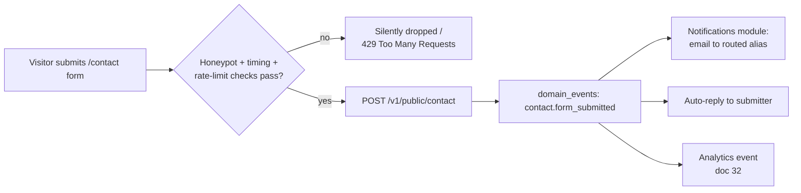
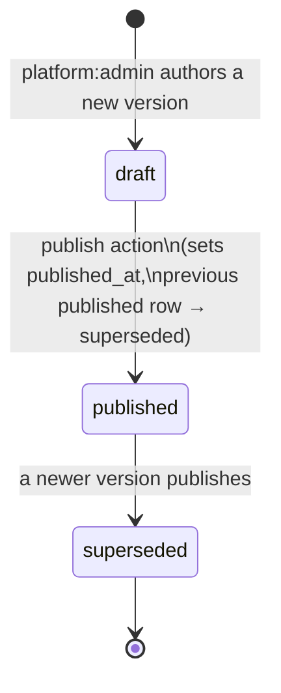
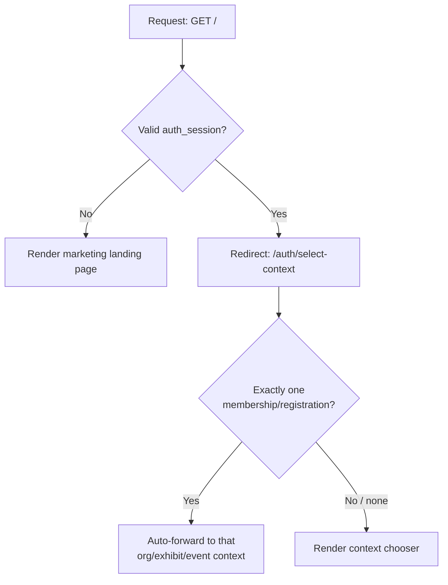

# Marketing Site

This document specifies Concourse's public marketing site — the seven public routes added in scope by [00-foundation.md](00-foundation.md) §14 Amendment A1: `/`, `/pricing`, `/about`, `/contact`, `/help`, `/legal/privacy`, `/legal/terms`. It owns the page-by-page content architecture (sections and blocks, not marketing copy), the route table, the marketing-only nav/footer chrome, SEO/metadata conventions, the contact-form routing contract, and the versioned legal-content model. It does **not** own: pricing capability content (that's [00-foundation.md](00-foundation.md) §4 and [02-business-goals.md](02-business-goals.md) §1.2–1.4 — this doc only renders it), Help Center content (owned by [30-help-center-and-support.md](30-help-center-and-support.md) — this doc owns only the public entry shell), the four authenticated-surface shells (owned by [13-application-layout.md](13-application-layout.md)), per-route component/data/access specs for the authenticated surfaces (owned by [14-page-inventory.md](14-page-inventory.md) — this doc plays that role for its own seven routes since they fall outside doc 11's tenant-scoped route map), or the actual legal text (counsel-authored, out of this blueprint's scope entirely — §9 says so explicitly).

---

## 1. Scope and Ownership

| This doc owns | Owned elsewhere |
|---|---|
| Route table for the 7 marketing routes; per-page section/block architecture | Canonical route map for the four authenticated surfaces → [11-information-architecture.md](11-information-architecture.md) |
| Marketing-only header/footer chrome ("MarketingShell") | The four authenticated shells (`ConsoleShell`, `PortalShell`, `AttendeeShell`, `AdminShell`) → [13-application-layout.md](13-application-layout.md) |
| Contact-form field contract, routing rules, spam/rate-limit protection | Email delivery mechanics, templates → [33-notification-system.md](33-notification-system.md); rate-limit primitive → [00-foundation.md](00-foundation.md) §9, detailed in [18-api-architecture.md](18-api-architecture.md) |
| Versioned legal-document data model, acceptance-tracking hook | The legal text itself (counsel-authored, never in this repo); DSAR/erasure mechanics for `legal_acceptances` → [38-data-retention-privacy-compliance.md](38-data-retention-privacy-compliance.md) |
| Help Center **entry page shell** (search box, category grid, fallback CTA) | Help Center **content model** (`help_categories`, `help_articles`), authoring, in-app contextual help → [30-help-center-and-support.md](30-help-center-and-support.md) |
| Pricing page **comparison-table UI** and CTA routing | Plan/tier **names and capabilities** → [00-foundation.md](00-foundation.md) §4; capability detail and pricing philosophy → [02-business-goals.md](02-business-goals.md) §1; actual price points → set later per [02-business-goals.md](02-business-goals.md) §1.4, tracked for revisit in [44-future-expansion-plan.md](44-future-expansion-plan.md) |
| SEO/metadata conventions for public routes | — |
| Signed-in-user redirect rule for `/` | The destination itself (`/auth/select-context` logic) → [11-information-architecture.md](11-information-architecture.md) §4.1, [12-navigation-structure.md](12-navigation-structure.md) |

The marketing site is the same Next.js app as every other surface (foundation §6), rendered fully static/RSC at the edge with no auth and no tenant context (foundation §5). It is a fifth chrome context alongside the four authenticated shells, not a fifth "surface" in the foundation §12 glossary sense — it carries no `organization`/`event` scope and appears nowhere in the entity registry's access rows.

---

## 2. Route Table

Conventions match [11-information-architecture.md](11-information-architecture.md) §4: paths are kebab-case, no dynamic segments on this surface (legal document *versions* are data, not routes — see §9.2). This is the complete Phase-1 route inventory for the marketing site: 7 routes.

| Route | Purpose | Rendering |
|---|---|---|
| `/` | Landing page: problem/solution, differentiators, social proof, plan teaser | Static (ISR: revalidate on content deploy) |
| `/pricing` | Organizer plan and exhibitor tier comparison, CTA routing | Static (ISR: revalidate on tier/capability change) |
| `/about` | Company narrative, vision, team/careers placeholder | Static |
| `/contact` | Routed contact form (sales / support / press / other) | Static shell + client-island form |
| `/help` | Public Help Center entry: search + browse (content owned by doc 30) | Static shell + client-island search, server-fetched category/article data |
| `/legal/privacy` | Currently published Privacy Policy | Static (ISR: revalidate on publish of a new `legal_documents` version) |
| `/legal/terms` | Currently published Terms of Service | Static (ISR: revalidate on publish of a new `legal_documents` version) |

### 2.1 Query-parameter conventions (marketing-site-local)

These routes sit outside doc 11's canonical query-param table (§4.9 there covers the four tenant surfaces only); the marketing site defines its own small set, following the same grammar (query params select state, never a different page):

| Param | Route | Meaning | Example |
|---|---|---|---|
| `topic` | `/contact` | Pre-selects the routing topic (§7.2) | `/contact?topic=sales` |
| `category` | `/help` | Pre-filters the category grid (maps to a `help_categories` slug, doc 30) | `/help?category=exhibitors` |
| `q` | `/help` | Text query, same grammar as doc 11 §4.9 | `/help?q=badge scan` |
| `plan` | `/pricing` | Deep-link to a highlighted plan/tier card for use in emails and ads | `/pricing?plan=professional` |

### 2.2 Redirects

- Authenticated user hits `/` → `/auth/select-context` (§11; the other six routes stay reachable to signed-in users — see §11).
- `/legal` (bare) → `/legal/terms` (terms is the more frequently linked of the two from signup flows).
- Unknown sub-paths under `/legal/*`, `/help/*` beyond what doc 30 defines → 404 (no fuzzy matching, consistent with foundation-wide redirect discipline in [11-information-architecture.md](11-information-architecture.md) §4.10).

---

## 3. Marketing Shell — Nav and Footer

The marketing site uses its own minimal chrome, **not** any of the four shells in [13-application-layout.md](13-application-layout.md): no sidebar, no context switcher, no density mode (marketing pages are always `comfortable`-equivalent spacing — density is a tenant-console concept and doesn't apply here). It still consumes Marquee tokens ([39-design-system.md](39-design-system.md)) so type, color, and motion match the rest of the product exactly — a visitor should feel zero visual seam between `/pricing` and the app they sign into next.

### 3.1 `MarketingHeader`

```
[Concourse logo] → /        Product ▾   Pricing   About   Help        [Log in]  [Sign up]
```

- **Product ▾** is a dropdown teaser (not a route) pointing at anchors on `/` (`#for-organizers`, `#for-exhibitors`, `#for-attendees`) — no new pages, avoids fragmenting the differentiator story across routes that would each need their own SEO treatment.
- Signed-in visitors see the identity affordance in place of Log in/Sign up: an account menu (avatar, name) with "Go to my events" (routes into `/auth/select-context`, §11) and "Log out" — regardless of which of the seven marketing routes they're on.
- Sticky on scroll, height 56px, `--mq-bg-surface` background with `--mq-border-default` hairline (§4.2/§8 of doc 39) — visually a lightweight cousin of the authenticated app headers, never a distinct "brochure site" skin.
- Mobile (<768px): logo + hamburger → full-screen sheet nav (Radix `Dialog`, reusing the pattern from doc 39 §8 elevation tokens), same links stacked, CTAs pinned to the bottom.

### 3.2 `MarketingFooter`

Four-column layout (collapses to an accordion stack <768px):

| Product | Company | Resources | Legal |
|---|---|---|---|
| Pricing | About | Help Center | Privacy Policy |
| For organizers *(anchor)* | Contact | Public API *(links to developer docs, post-GA per doc 02 GTM-3)* | Terms of Service |
| For exhibitors *(anchor)* | Careers *(placeholder, §6)* | Status page *(placeholder — owned by [31-observability.md](31-observability.md) when a public status page ships)* | |

Below the columns: copyright line, social icon row (Lucide icons per doc 39 §14.1, links are external placeholders until brand accounts exist — tracked in [44-future-expansion-plan.md](44-future-expansion-plan.md) as a launch-checklist item, not a design decision), and a language indicator fixed to "English (US)" (§10.4 — no locale switcher in Phase 1).

---

## 4. Landing Page (`/`) — Content Architecture

Blocks in page order. Copy itself is marketing-authored; this table specifies structure and the canonical source each block must stay faithful to.

| # | Block | Purpose | Canonical source |
|---|---|---|---|
| 1 | Hero | One-liner + sub-headline + primary CTA ("Start free" → `/auth/signup`) + secondary CTA ("Talk to sales" → `/contact?topic=sales`) | Foundation §1 one-liner and positioning |
| 2 | Problem | "Badge scans are dumb data" — the three-stakeholder cost table condensed to a 3-card layout (Exhibitor / Attendee / Organizer) | [01-product-vision.md](01-product-vision.md) §1.1 |
| 3 | Solution | The intelligence-layer framing: floor interactions → knowledge base → AI features → Qualified Connections | [01-product-vision.md](01-product-vision.md) §3 vision statement + flywheel diagram |
| 4 | Differentiators | Four cards: AI-native, Speed as product, Offline-first, Exhibitor-owned data | [01-product-vision.md](01-product-vision.md) §4.1–4.4 |
| 5 | AI feature strip | Five compact tiles, one per AI feature, each carrying the `AiContentBadge` (violet, doc 39 §4.3) for visual consistency with in-app AI labeling | Foundation §10 |
| 6 | Social proof (placeholder) | Logo strip + 1–2 pull-quote slots; empty-state-safe (renders a "design partners onboarding" message, never a broken layout, until real logos exist) | New for Phase 1 — see §4.1 below |
| 7 | Plan-comparison teaser | Condensed 3-column strip (one per organizer plan) with a single differentiating line each and a "Compare all plans" CTA | Links to `/pricing`; content sourced from foundation §4, never restated with new numbers |
| 8 | Role-routed CTA row | Three CTAs: "I'm an organizer" → `/auth/signup?role=organizer`, "I'm an exhibitor" → anchor to `/pricing#for-exhibitors`, "I'm attending an event" → no marketing CTA at all | Attendees never self-serve an account from this site — they join via an emailed magic link tied to a specific event's registration flow (foundation §6 auth row; [11-information-architecture.md](11-information-architecture.md) §4.7 `/e/[eventSlug]/register`), so a marketing-site CTA aimed at them would dead-end with nothing to link to |
| 9 | Footer | `MarketingFooter` (§3.2) | — |

### 4.1 Social-proof placeholder — explicit decision

Before design-partner logos and quotes exist (GTM-1, [02-business-goals.md](02-business-goals.md) §3), block 6 renders a neutral "Now onboarding design partners" strip rather than fabricated testimonials or an empty gap — never placeholder logos that look real. The component (`SocialProofStrip`) accepts a data-driven list; zero entries is a designed empty state per doc 39 §13.3, not a hidden block, so the page never needs a structural redeploy once the first real logo lands.

---

## 5. Pricing Page (`/pricing`)

Renders — never restates — the canonical plan/tier structure from [00-foundation.md](00-foundation.md) §4 and [02-business-goals.md](02-business-goals.md) §1.2–1.3. No hard price points anywhere on this page: per §1.4 of doc 02, pricing is value-metric-based (organizer: banded by registered-attendee volume; exhibitor: flat per-event fee) and price points are set later with design partners. The page shows **what's included**, never a number that doesn't exist yet.

### 5.1 Page structure

| Block | Content |
|---|---|
| Header | "Simple pricing that grows with your event" + segment toggle: **For organizers** / **For exhibitors** (two tabs, not two pages — one URL, `?plan=` deep-links a card, §2.1) |
| Organizer comparison table (§5.2) | `launch` / `professional` / `enterprise` columns |
| Exhibitor comparison table (§5.3) | `essentials` / `growth` / `intelligence` columns |
| Pricing philosophy note | Short explainer: "Organizer pricing scales with your registered attendees, not seats — every plan includes unlimited staff." (renders §1.4 point 2 verbatim in spirit) |
| FAQ strip | 4–6 Q&As (e.g., "Do exhibitors have to pay?", "What happens if we grow past our attendee band mid-event?") — content owned by marketing/sales, not this doc; structurally a static accordion, `FAQPage` JSON-LD (§10.3) |
| Footer | `MarketingFooter` |

### 5.2 Organizer plan comparison table (`PricingComparisonTable`, organizer variant)

| Capability | `launch` | `professional` | `enterprise` |
|---|---|---|---|
| Events | Single event | Multi-event, cross-event benchmarks | Unlimited, portfolio views |
| Core floor ops | Included | Included | Included |
| Exhibitor management | Included | Included | Included |
| Analytics + Organizer Pulse | Basic dashboards | Full suite incl. Organizer Pulse | Full suite + custom exports |
| Smart Matchmaking (event-wide) | — | Included | Included |
| Support | Community | Priority | Dedicated + SLA |
| SSO (SAML/OIDC) | — | — | Included |
| Public API + webhooks | — | — | Included |
| Custom domains, data residency | — | — | Included |
| **Price** | Get a quote | Get a quote | Talk to sales |
| **CTA** | Start free trial → `/auth/signup?role=organizer&plan=launch` | Start free trial → `/auth/signup?role=organizer&plan=professional` | Talk to sales → `/contact?topic=sales` |

Rows above are the identical capability set from foundation §4 / doc 02 §1.2, formatted for a marketing audience (no restated numbers). "Get a quote" replaces a dollar figure because organizer price bands by attendee volume; the signup flow (owned by [19-authentication-strategy.md](19-authentication-strategy.md) and [36-billing-and-payments-architecture.md](36-billing-and-payments-architecture.md)) collects an attendee-volume estimate before Stripe Checkout renders an actual price — the marketing site never computes or displays that number itself.

### 5.3 Exhibitor tier comparison table (`PricingComparisonTable`, exhibitor variant)

| Capability | `essentials` | `growth` | `intelligence` |
|---|---|---|---|
| Profile + product listings | Included | Included | Included |
| Basic lead capture | Included | Included | Included |
| Staff seats | 3 | Unlimited | Unlimited |
| Lead Intelligence <span style="opacity:.7">(AI)</span> | — | Included | Included |
| Meeting scheduling | — | Included | Included |
| Exports + CRM sync | — | Included | Included |
| Smart Matchmaking priority <span style="opacity:.7">(AI)</span> | — | — | Included |
| Follow-up Studio <span style="opacity:.7">(AI)</span> | — | — | Included |
| Competitive benchmarks | — | — | Included |
| Real-time booth analytics | — | — | Included |
| **Price** | Free with booth | Paid — per event | Paid — per event |
| **CTA** | Exhibitor info → §5.4 | Exhibitor info → §5.4 | Exhibitor info → §5.4 |

Rows marked "(AI)" carry the `AiContentBadge` (violet) in the rendered UI, consistent with the platform-wide rule that AI-powered capabilities are always visually labeled (doc 39 §13.4) — the pricing page is not exempt just because it's marketing.

### 5.4 CTA routing — the three distinct paths

| Audience | Primary CTA | Destination | Why this path and not another |
|---|---|---|---|
| Organizer, `launch`/`professional` | "Start free trial" | `/auth/signup?role=organizer&plan=…` | Self-serve land matches the GTM-1 founder-led-but-product-driven motion ([02-business-goals.md](02-business-goals.md) §3); signup collects attendee-volume banding before any Stripe charge |
| Organizer, `enterprise` | "Talk to sales" | `/contact?topic=sales` | Enterprise deals are procurement-driven, 12-month cycles, SSO/API/residency review ([02-business-goals.md](02-business-goals.md) §2.2) — a self-serve signup would be the wrong shape for that buyer |
| Exhibitor, any tier | "Exhibitor info" | `/help?category=exhibitors` (secondary: "Already invited? Sign in" → `/auth/login`) | Exhibitor tier purchase is **not** a marketing-site transaction — `event_exhibitors` participation is created via an organizer's invite flow (`/org/[orgSlug]/events/[eventSlug]/exhibitors/invite`, doc 11 §4.4) or exhibitor self-serve org creation via `/auth/signup?role=exhibitor`; the actual tier upgrade happens inside the Exhibitor Portal (`/exhibit/[orgSlug]/events/[eventSlug]/upgrade`, doc 11 §4.6). The pricing page's job for this audience is to set expectations and route to the two real entry points, not to sell a tier it can't provision. |

---

## 6. About Page (`/about`)

| Block | Content | Source |
|---|---|---|
| Mission | Vision statement | [01-product-vision.md](01-product-vision.md) §3 |
| Why now | Three market shifts | [01-product-vision.md](01-product-vision.md) §1.3 |
| How we're different (recap) | Condensed differentiator cards, links to `/#` anchors on the landing page rather than duplicating full content | [01-product-vision.md](01-product-vision.md) §4 |
| For exhibitors | Short explainer of the invite-based / self-serve entry into exhibiting (same content referenced by the pricing page's "Exhibitor info" CTA, §5.4) — this block is the actual landing target for `/pricing`'s exhibitor CTA when doc 30's category isn't yet populated, so it is never allowed to be empty | This doc |
| Team / careers (placeholder) | Founder note + "we're hiring" placeholder block, empty-state-safe like §4.1's social proof — no fabricated headcount or bios before they exist | This doc |
| Footer | `MarketingFooter` | — |

The "For exhibitors" block on `/about` and the `/help?category=exhibitors` link from §5.4 are two doors to the same idea at different content maturity: `/about#for-exhibitors` ships on day one (owned by this doc, always populated); the Help Center category (owned by doc 30) is the long-term canonical home once that system exists. The pricing page CTA points at the Help Center per §5.4 because that's the durable target; until doc 30 populates that category, its fallback route is `/about#for-exhibitors` — a redirect rule owned by doc 30 when it's written, not invented here.

---

## 7. Contact Page (`/contact`)

### 7.1 Form fields

| Field | Type | Required | Notes |
|---|---|---|---|
| `name` | text | Yes | |
| `email` | email | Yes | RFC 5322 validated; disposable-domain blocklist (§7.3) |
| `company` | text | No | |
| `topic` | select: `sales` \| `support` \| `press` \| `other` | Yes | Pre-filled from `?topic=` (§2.1); default `other` |
| `message` | textarea | Yes | Max 4,000 chars |
| `eventName` | text | No | Shown only when `topic=sales` (helps route to the right sales conversation) |
| `_hp` (honeypot) | hidden text | — | Never rendered visibly; non-empty on submit ⇒ silently dropped (§7.3) |

### 7.2 Routing rules

| Topic | Destination alias | Handled by | Notes |
|---|---|---|---|
| `sales` | `sales@concourse.app` | Founder-led sales motion ([02-business-goals.md](02-business-goals.md) §3 GTM-1/2) | Also the landing target for `/pricing`'s enterprise "Talk to sales" CTA (§5.4) |
| `support` | `support@concourse.app` | Routes to Alex Kim / platform team, same escalation discipline as Help Center self-serve escalation ([00-foundation.md](00-foundation.md) §7 "Support & content": *"escalation beyond self-serve routes through `notifications`/email to Alex"*) | Also the fallback CTA from `/help` (§8) when self-serve search doesn't resolve the question |
| `press` | `press@concourse.app` | Marketing/comms distribution | |
| `other` | `hello@concourse.app` | Triaged manually, re-routed by hand if it turns out to be sales/support/press | Catch-all so the form never has a required field with no honest default |

No new persisted entity is introduced for submissions (`contact_submissions` was considered and rejected) — this follows the identical "no bespoke ticket entity" discipline foundation §7 already applies to Help Center escalation. A successful submission emits a `contact.form_submitted` domain event (naming per foundation §11: `noun.verb_past`) into the transactional outbox ([25-event-pipeline.md](25-event-pipeline.md)), which fans out to: (a) the Notifications module, which sends a templated email (React Email, foundation §6) to the routed alias plus an auto-reply confirmation to the submitter, and (b) product analytics (doc 32), for GTM funnel visibility. This keeps `/contact` consistent with P3 (One source of truth) — the event log is the record, not a new table nobody else reads.



### 7.3 Spam and rate-limit protection

| Layer | Mechanism |
|---|---|
| Client-side | Hidden honeypot field (`_hp`); minimum-time-to-submit heuristic (reject <2s from page load — bots fill instantly) |
| Server-side rate limit | Redis token bucket, unauthenticated/IP-keyed: 5 submissions/hour, 20/day per IP — same primitive foundation §9 already specifies for session/API-key limits, extended here to an anonymous IP key; responses carry the same `RateLimit-*` headers for consistency |
| Validation | Email format + MX-record sanity check; disposable-email-domain blocklist (maintained list, not a new entity — a static config file) |
| CAPTCHA | **Not included by default** — a CAPTCHA vendor is a dependency we don't take pre-emptively. If Redis-bucket + honeypot data (post-launch) shows sustained abuse past the rate limit, Cloudflare Turnstile is the designated escalation, tracked in [44-future-expansion-plan.md](44-future-expansion-plan.md) with the explicit revisit trigger "spam rate through the rate limiter exceeds 5% of submissions for 2 consecutive weeks" — a stated decision, not an open question. |
| Endpoint | `POST /v1/public/contact` — unauthenticated, no `Idempotency-Key` requirement (foundation §9's idempotency rule is for mutating tenant resources; a public contact form re-send is harmless and rate-limited anyway). Module ownership (folded into `NotificationsModule` vs. a new `PublicModule`) is an implementation detail for [18-api-architecture.md](18-api-architecture.md) to assign — this doc specifies the contract, not the NestJS wiring. |

---

## 8. Help Center Entry Page (`/help`)

This page is a **shell**, not a content system. Content — categories, articles, versioning, in-app contextual help, and support escalation mechanics beyond the contact-page routing in §7 — is entirely owned by [30-help-center-and-support.md](30-help-center-and-support.md) and its `help_categories`/`help_articles` entities (foundation §7). What this doc specifies is what renders around that content on the public entry route.

| Block | Content | Backing |
|---|---|---|
| Search hero | Prominent search input, no chat/AI affordance (Expo Copilot is an authenticated, event-scoped feature per foundation §10 — the public Help Center is deliberately plain keyword search, not a second AI surface) | `GET /v1/help/search?q=` — Postgres FTS (`tsvector`) over `help_articles`, same backing choice doc 11 §6 makes for every other surface's keyword search, applied here as a public, unauthenticated endpoint |
| Category grid | Cards per `help_categories` row (icon, title, article count) | Server-fetched at build/revalidate time; `?category=` deep-links a filtered view (§2.1) |
| Popular articles | Top N `help_articles` by view count | Same data source; ranking logic owned by doc 30 |
| Fallback CTA | "Can't find it? Contact support" → `/contact?topic=support` | This doc (§7.2) |
| Footer | `MarketingFooter` | — |

The search box and category grid are client islands over server-fetched data (RSC-first per foundation §6); no client-side full-text index ships to the browser — every query round-trips to the FTS endpoint, keeping the public page's JS payload small (P1, fast is the feature, applies to marketing pages too).

---

## 9. Legal Pages (`/legal/privacy`, `/legal/terms`)

### 9.1 Scope boundary — explicit and binding

**The actual legal text is counsel-authored and entirely out of this blueprint's scope.** Nothing in this document, or anywhere else in `/docs`, specifies privacy or terms *content*. This section specifies only the technical delivery mechanism: how a legal document's current version is stored, published, rendered, and how a user's acceptance of it is recorded. Any placeholder text used during development must be replaced by counsel before the routes go live in production — that gate is a launch-checklist item, not a design decision this doc can resolve.

### 9.2 Versioned-content data model

Two entities, added to the canonical registry as [00-foundation.md](00-foundation.md) §7 Amendment A2 (recorded there; specified fully here):

**`legal_documents`**

| Column | Type | Notes |
|---|---|---|
| `id` | uuid (v7) | |
| `document_type` | enum: `privacy` \| `terms` | |
| `version` | integer | Monotonic per `document_type`, starting at 1 |
| `effective_date` | date | When this version takes legal effect — may be future-dated for advance-notice publishing |
| `status` | enum: `draft` \| `published` \| `superseded` | Exactly one `published` row per `document_type` at any time |
| `body_file_id` | uuid → `files` | Rendered HTML/Markdown body, stored per [26-file-storage.md](26-file-storage.md); counsel-authored, never in this repo |
| `published_at` | timestamptz, nullable | Set on the `draft → published` transition |
| `published_by` | uuid → `users` | Must hold `platform:admin` (foundation §8) |
| `created_at` / `updated_at` | timestamptz | Per foundation §11 naming convention |

**`legal_acceptances`**

| Column | Type | Notes |
|---|---|---|
| `id` | uuid (v7) | |
| `user_id` | uuid → `users` | Consent is always tied to a global identity, never anonymous |
| `legal_document_id` | uuid → `legal_documents` | The **specific version** shown at acceptance time — never a pointer to "current" |
| `context` | enum: `signup` \| `reconsent` \| `checkout` | Why the acceptance was captured |
| `accepted_at` | timestamptz | |
| `ip_address_hash` | text | Hashed, not raw, per P5 and [38-data-retention-privacy-compliance.md](38-data-retention-privacy-compliance.md) |
| `created_at` | timestamptz | |

### 9.3 Version lifecycle



Only `platform:admin` (Alex Kim) can publish (foundation §8 role vocabulary) — publishing a new Terms/Privacy version is a trust-boundary action, logged to `audit_logs` like every privileged action (product principle P5). Publishing atomically supersedes the prior `published` row for that `document_type` — the invariant "exactly one published version per type" is a database constraint (partial unique index on `document_type` where `status = 'published'`), not application-level discipline alone.

### 9.4 Public rendering and the acceptance hook

- `GET /v1/legal/{documentType}` returns the currently published version's metadata and rendered body location; `/legal/privacy` and `/legal/terms` fetch this at build/ISR-revalidate time (§2). No version-history route ships in Phase 1 — older versions remain queryable by `platform:admin` for compliance/audit purposes but are not separately routed on the public site (avoids inventing UI surface beyond the seven canonical routes; assigned to [44-future-expansion-plan.md](44-future-expansion-plan.md) if a "policy history" page is ever requested).

```json
{
  "documentType": "privacy",
  "version": 4,
  "effectiveDate": "2026-06-01",
  "publishedAt": "2026-05-24T18:02:00Z",
  "bodyUrl": "https://cdn.concourse.app/legal/privacy/v4.html"
}
```

- **The acceptance hook.** `/auth/signup` ([11-information-architecture.md](11-information-architecture.md) §4.1, detailed in [19-authentication-strategy.md](19-authentication-strategy.md)) renders its consent checkbox against the *same* `GET /v1/legal/{documentType}` response used by the public pages — the version id shown to the user is the version id snapshotted into `legal_acceptances` on submit, in the same transaction that creates the `users` row. This is what makes the acceptance legally meaningful: it records exactly which text the user saw, immune to the document being republished later.

```typescript
interface LegalDocumentSummary {
  documentType: "privacy" | "terms";
  version: number;
  effectiveDate: string; // ISO date
  publishedAt: string;   // ISO datetime
  bodyUrl: string;
}

interface SignupConsentPayload {
  // …other signup fields owned by doc 19…
  acceptedLegalVersions: {
    documentType: "privacy" | "terms";
    legalDocumentId: string; // uuid — the exact version id from LegalDocumentSummary
  }[];
}
```

- Re-consent (`context: reconsent`) is the mechanism for material changes to either document post-signup — triggered by a notification (doc 33) prompting active users to accept the new version before continuing; the trigger policy (which changes count as "material") is a legal/product judgment call outside this blueprint's scope, consistent with §9.1.

---

## 10. SEO and Metadata Conventions

| Convention | Rule |
|---|---|
| Title | `{Page title} — Concourse` (e.g., "Pricing — Concourse"); ≤60 chars |
| Meta description | Unique per route, ≤160 chars, written to answer "why click this" |
| Canonical URL | Always absolute (`https://concourse.app/pricing`), self-referencing on all 7 routes — no query-param canonicalization ambiguity since `topic`/`category`/`q`/`plan` are display-state only (§2.1) |
| Open Graph | `og:title`, `og:description`, `og:type=website`, `og:image` — one static 1200×630 brand image per route family (home/pricing get bespoke images; about/contact/help/legal share a generic brand image) |
| Twitter Card | `summary_large_image`, reusing the OG image |
| `robots.txt` | Allow-all for the 7 marketing routes; disallow nothing on this surface (no dynamic query-param crawl traps since none of the params above change page identity) |
| `sitemap.xml` | Auto-generated at build time: the 7 routes, `lastmod` for `/legal/*` sourced from `legal_documents.published_at` (§9.2) so search engines see policy updates promptly |
| Structured data | `Organization` JSON-LD on `/`; `FAQPage` JSON-LD on `/pricing` (§5.1 FAQ strip). **No `Product`/`Offer` JSON-LD** — schema.org's `Offer` expects a price, and Phase 1 deliberately publishes none (§5, doc 02 §1.4); adding `Offer` schema is revisited in [44-future-expansion-plan.md](44-future-expansion-plan.md) once price points exist. |
| Performance | Static/RSC rendering (foundation §6) keeps every marketing route's Core Web Vitals budget tight by construction — the same P1 "fast is the feature" discipline that governs the authenticated surfaces applies here; no third-party scripts beyond privacy-reviewed analytics (PostHog, foundation §6) load render-blocking. |

### 10.1 Internationalization

English (US) only in Phase 1 — no `hreflang`, no locale switcher, no locale-prefixed routes. This is consistent with the platform-wide Phase 1 posture (no other doc in this blueprint specifies a second locale); international expansion is tracked under the EU-region item in [44-future-expansion-plan.md](44-future-expansion-plan.md), and a marketing-site locale strategy would be scoped there if and when that lands.

---

## 11. Signed-in Users Landing on `/`

### 11.1 Rule

A request to `/` from a session with a valid `auth_session` (foundation §7) redirects server-side to `/auth/select-context` before any marketing content renders — a signed-in user has no reason to see the pitch again, and `/auth/select-context` (doc 11 §4.1) already implements the "which of my memberships/registrations do I mean" resolution, including the single-context auto-forward case.

### 11.2 Flow



The branch at `E` is owned entirely by `/auth/select-context`'s own logic (doc 11 §4.1, doc 12) — this doc's contribution stops at "redirect there," not "decide what happens next."

### 11.3 The other six routes stay reachable

`/pricing`, `/about`, `/contact`, `/help`, `/legal/privacy`, `/legal/terms` do **not** redirect for signed-in users. An organizer checking whether they should upgrade to `professional`, a customer re-reading the Terms, or a user filing a support ticket are all legitimate signed-in visits to marketing routes. `MarketingHeader` (§3.1) reflects sign-in state (account menu instead of Log in/Sign up) on every route without altering navigation.

---

## 12. Related Documents

| Doc | Relationship |
|---|---|
| [00-foundation.md](00-foundation.md) | §4 plan/tier names (rendered, never restated, on `/pricing`); §5 marketing route list and A1 scope decision; §7 entity registry, incl. A2 (`legal_documents`, `legal_acceptances`) |
| [01-product-vision.md](01-product-vision.md) | Source content for the landing page's problem/solution/differentiator blocks (§4) and the About page (§6) |
| [02-business-goals.md](02-business-goals.md) | §1.2–1.4 plan/tier capability detail and pricing philosophy rendered on `/pricing` (§5); GTM motion behind the CTA routing decisions (§5.4) |
| [03-user-personas.md](03-user-personas.md) | Persona names used consistently in any illustrative copy examples above |
| [11-information-architecture.md](11-information-architecture.md) | Canonical route map for the four authenticated surfaces; `/auth/select-context` definition (§11) |
| [12-navigation-structure.md](12-navigation-structure.md) | Context-switcher behavior downstream of the §11 redirect |
| [13-application-layout.md](13-application-layout.md) | The four authenticated shells this doc's `MarketingShell` is explicitly distinct from (§3) |
| [18-api-architecture.md](18-api-architecture.md) | API conventions the `POST /v1/public/contact` and `GET /v1/legal/{documentType}` endpoints follow (§7.3, §9.4) |
| [19-authentication-strategy.md](19-authentication-strategy.md) | `/auth/signup` consent checkbox consuming the legal acceptance hook (§9.4) |
| [26-file-storage.md](26-file-storage.md) | Storage for `legal_documents.body_file_id` (§9.2) |
| [30-help-center-and-support.md](30-help-center-and-support.md) | Owns all Help Center content rendered inside the `/help` shell (§8) |
| [33-notification-system.md](33-notification-system.md) | Email delivery for contact-form routing (§7.2) and re-consent prompts (§9.4) |
| [36-billing-and-payments-architecture.md](36-billing-and-payments-architecture.md) | Stripe Checkout flow reached after the `/pricing` organizer signup CTA (§5.4) |
| [38-data-retention-privacy-compliance.md](38-data-retention-privacy-compliance.md) | Retention/erasure mechanics for `legal_acceptances` and hashed IPs |
| [39-design-system.md](39-design-system.md) | Tokens, AI-content labeling rule, and accessibility standards the marketing shell and pricing table conform to |
| [44-future-expansion-plan.md](44-future-expansion-plan.md) | Deferred items this doc explicitly assigns: Turnstile escalation (§7.3), `Offer` JSON-LD (§10), locale strategy (§10.1), legal-history page (§9.4), social/brand account placeholders (§3.2) |
